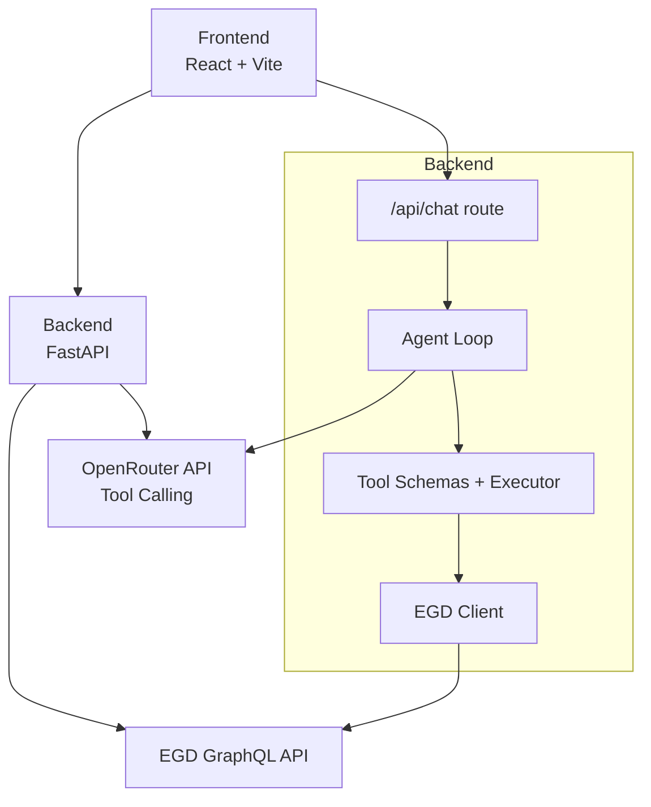
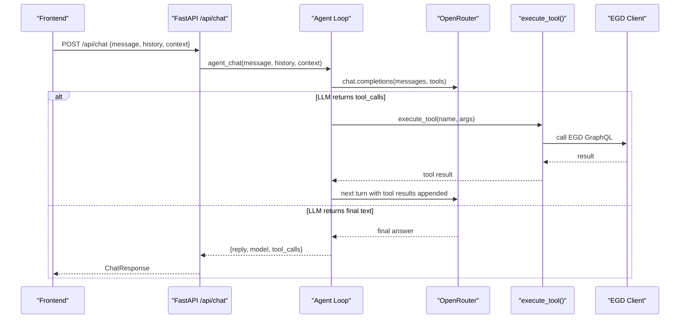
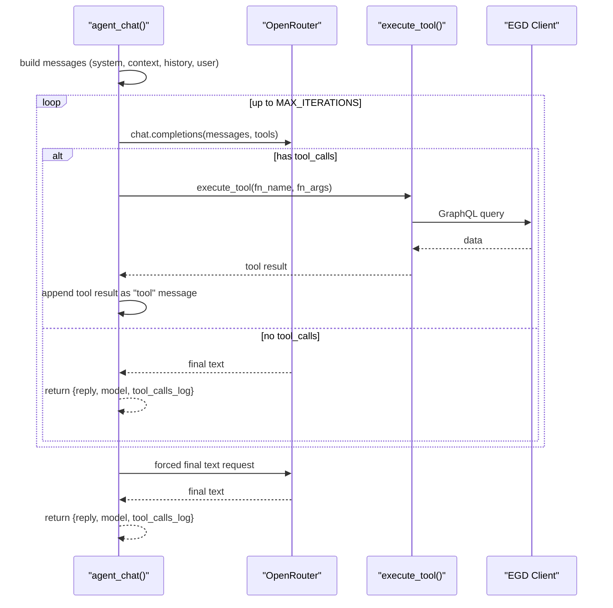
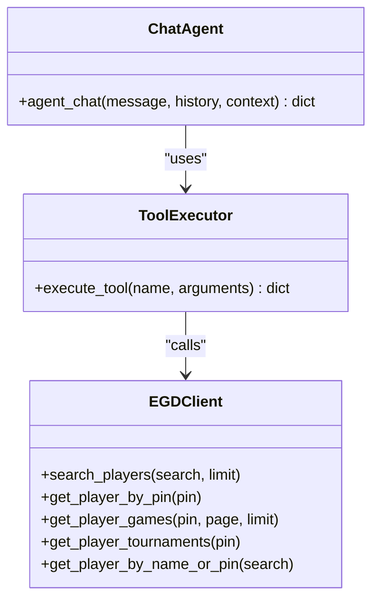
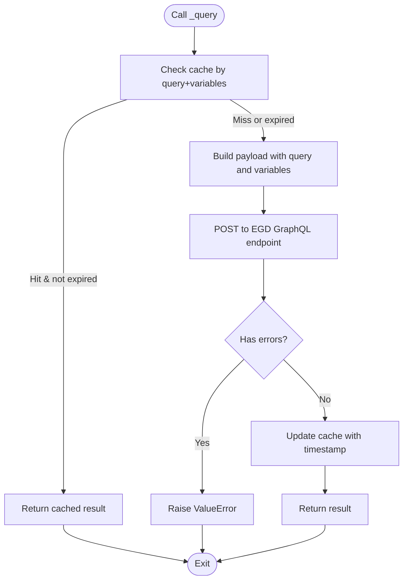
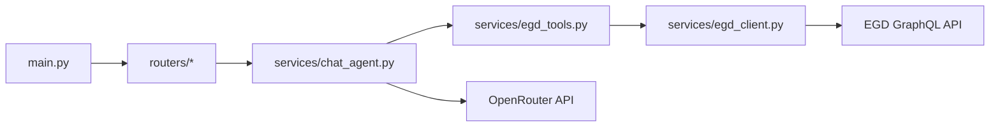

# AI Chat System

<cite>
**Referenced Files in This Document**
- [main.py](file://backend/app/main.py)
- [chat_agent.py](file://backend/app/services/chat_agent.py)
- [egd_tools.py](file://backend/app/services/egd_tools.py)
- [egd_client.py](file://backend/app/services/egd_client.py)
- [chat.py](file://backend/app/routers/chat.py)
- [players.py](file://backend/app/routers/players.py)
- [chat.py (models)](file://backend/app/models/chat.py)
- [player.py](file://backend/app/models/player.py)
- [ChatWidget.tsx](file://frontend/src/components/ChatWidget.tsx)
- [ARCHITECTURE.md](file://docs/ARCHITECTURE.md)
- [AGENT_DESIGN.md](file://docs/AGENT_DESIGN.md)
- [AGENTS.md](file://docs/AGENTS.md)
</cite>

## Table of Contents
1. [Introduction](#introduction)
2. [Project Structure](#project-structure)
3. [Core Components](#core-components)
4. [Architecture Overview](#architecture-overview)
5. [Detailed Component Analysis](#detailed-component-analysis)
6. [Dependency Analysis](#dependency-analysis)
7. [Performance Considerations](#performance-considerations)
8. [Troubleshooting Guide](#troubleshooting-guide)
9. [Conclusion](#conclusion)
10. [Appendices](#appendices)

## Introduction
This document explains the agentic AI chat system that powers GoNow’s assistant. It focuses on:
- Tool calling mechanism and iterative reasoning loop
- Context management across conversation turns
- Available EGD tools, function schemas, and execution handlers
- OpenRouter integration, model configuration, and cost optimization
- Orchestration pattern used for autonomous data lookup

The system uses OpenRouter’s native tool calling to let the LLM autonomously decide when to query the European Go Database (EGD). The backend implements a simple ReAct-style loop: send messages with tool schemas, execute any requested tools, feed results back, and repeat until the LLM produces a final text answer.

## Project Structure
The relevant parts of the project are organized as follows:
- Backend FastAPI app mounts routers and loads environment variables
- Services implement the agent loop, tool definitions, and EGD client
- Models define request/response contracts
- Frontend provides a floating chat widget that integrates with the backend

**Diagram sources**
- [main.py:14-31](file://backend/app/main.py#L14-L31)
- [chat.py:9-24](file://backend/app/routers/chat.py#L9-L24)
- [chat_agent.py:30-153](file://backend/app/services/chat_agent.py#L30-L153)
- [egd_tools.py:5-99](file://backend/app/services/egd_tools.py#L5-L99)
- [egd_client.py:11-42](file://backend/app/services/egd_client.py#L11-L42)

**Section sources**
- [main.py:1-42](file://backend/app/main.py#L1-L42)
- [ARCHITECTURE.md:1-99](file://docs/ARCHITECTURE.md#L1-L99)

## Core Components
- Agent loop: orchestrates message building, OpenRouter calls, tool execution, and iteration control
- Tools: OpenAI-compatible function schemas plus an executor that dispatches to EGD operations
- EGD client: async GraphQL client with in-memory caching
- API routes: expose /api/chat and player endpoints
- Models: Pydantic models for chat requests/responses and player data

Key responsibilities:
- chat_agent.py: Implements the agentic loop and context handling
- egd_tools.py: Defines tool schemas and executes them via egd_client
- egd_client.py: Encapsulates EGD GraphQL queries and caching
- routers/chat.py: Exposes the chat endpoint and delegates to the agent
- models/chat.py: Defines ChatRequest, ChatResponse, and ChatMessage

**Section sources**
- [chat_agent.py:30-153](file://backend/app/services/chat_agent.py#L30-L153)
- [egd_tools.py:5-212](file://backend/app/services/egd_tools.py#L5-L212)
- [egd_client.py:11-197](file://backend/app/services/egd_client.py#L11-L197)
- [chat.py:9-24](file://backend/app/routers/chat.py#L9-L24)
- [chat.py (models):6-21](file://backend/app/models/chat.py#L6-L21)

## Architecture Overview
The chat flow is a ReAct-style loop using OpenRouter’s native tool calling:
- Build messages from system prompt, optional page context, and recent history
- Send to OpenRouter with tool schemas
- If the response includes tool_calls, execute each tool and append results as “tool” messages
- Repeat until no tool_calls remain or max iterations reached
- Return final reply, model name, and list of executed tool names

**Diagram sources**
- [chat.py:9-24](file://backend/app/routers/chat.py#L9-L24)
- [chat_agent.py:30-153](file://backend/app/services/chat_agent.py#L30-L153)
- [egd_tools.py:102-212](file://backend/app/services/egd_tools.py#L102-L212)
- [egd_client.py:21-42](file://backend/app/services/egd_client.py#L21-L42)

## Detailed Component Analysis

### Agentic Chat Loop and Iterative Reasoning
The agent loop:
- Loads OpenRouter API key and model from environment
- Builds a messages array including a system prompt, optional page context, and last N history entries
- Sends requests to OpenRouter with tool schemas attached
- Detects tool_calls; if present, executes them and appends results as “tool” messages
- Loops up to a configurable maximum number of iterations
- On exhaustion, forces a final text response by appending a summarization prompt

Context management:
- Optional page context is injected as a system message before user input
- History is limited to the most recent messages to reduce token usage

Error handling:
- Missing API key returns a friendly message
- JSON parsing errors for tool arguments default to empty dict
- Final fallback ensures a text reply even after max iterations

Configuration:
- Model ID defaults to a fast, cost-effective option
- Max iterations default prevents runaway loops

**Section sources**
- [chat_agent.py:1-153](file://backend/app/services/chat_agent.py#L1-L153)

#### Sequence Diagram: Agent Loop

**Diagram sources**
- [chat_agent.py:30-153](file://backend/app/services/chat_agent.py#L30-L153)
- [egd_tools.py:102-212](file://backend/app/services/egd_tools.py#L102-L212)
- [egd_client.py:21-42](file://backend/app/services/egd_client.py#L21-L42)

### Tool Calling Mechanism and Function Schemas
Available tools (OpenAI-compatible function schemas):
- search_player(query: string) — Search players by name or PIN
- get_player_details(pin: integer) — Full profile with rating history
- get_player_rating_history(pin: integer) — Rating evolution over time
- get_player_games(pin: integer, limit?: integer) — Recent game history
- compare_players(pin1: integer, pin2: integer) — Side-by-side comparison

Execution handler:
- execute_tool(name, arguments) dispatches to EGD client methods
- Returns standardized success/error payloads
- Normalizes and sorts rating histories where applicable

Notes:
- All parameters are validated implicitly by the LLM based on schemas
- Limits are enforced server-side (e.g., games limit capped at 200)

**Section sources**
- [egd_tools.py:5-99](file://backend/app/services/egd_tools.py#L5-L99)
- [egd_tools.py:102-212](file://backend/app/services/egd_tools.py#L102-L212)

#### Class Diagram: Tool Execution Flow

**Diagram sources**
- [chat_agent.py:30-153](file://backend/app/services/chat_agent.py#L30-L153)
- [egd_tools.py:102-212](file://backend/app/services/egd_tools.py#L102-L212)
- [egd_client.py:11-197](file://backend/app/services/egd_client.py#L11-L197)

### EGD Client and Data Access
The EGD client:
- Uses httpx async HTTP client to call the EGD GraphQL endpoint
- Supports bearer token authentication
- Provides in-memory caching with TTL to reduce external calls
- Offers typed helper methods for common queries

Caching strategy:
- Cache key derived from query and variables
- TTL-based invalidation to balance freshness and performance

GraphQL queries:
- Player search with pagination
- Player details including placements and biography
- Games with ordering and pagination
- Tournament extraction from placements

**Section sources**
- [egd_client.py:1-197](file://backend/app/services/egd_client.py#L1-L197)

#### Flowchart: EGD Client Query Path

**Diagram sources**
- [egd_client.py:21-42](file://backend/app/services/egd_client.py#L21-L42)

### API Route and Request Handling
The chat route:
- Accepts ChatRequest with message, optional context, and history
- Delegates to agent_chat and returns ChatResponse
- Wraps exceptions into HTTP 500 responses

Player routes:
- Provide search, player details, games, and tournaments endpoints
- Use the same EGD client for data access

**Section sources**
- [chat.py:9-24](file://backend/app/routers/chat.py#L9-L24)
- [players.py:8-106](file://backend/app/routers/players.py#L8-L106)
- [chat.py (models):6-21](file://backend/app/models/chat.py#L6-L21)

### Frontend Integration
The chat widget:
- Sends messages to /api/chat with current history
- Displays assistant replies and loading indicators
- Integrates with Go-themed UI components

Note: The current implementation sends a simplified payload without exposing tool call metadata to the UI.

**Section sources**
- [ChatWidget.tsx:1-240](file://frontend/src/components/ChatWidget.tsx#L1-L240)

## Dependency Analysis
High-level dependencies:
- FastAPI app mounts routers and configures CORS
- Chat router depends on agent service
- Agent depends on tool schemas and executor
- Executor depends on EGD client
- EGD client depends on httpx and environment tokens

**Diagram sources**
- [main.py:14-31](file://backend/app/main.py#L14-L31)
- [chat.py:9-24](file://backend/app/routers/chat.py#L9-L24)
- [chat_agent.py:30-153](file://backend/app/services/chat_agent.py#L30-L153)
- [egd_tools.py:102-212](file://backend/app/services/egd_tools.py#L102-L212)
- [egd_client.py:11-42](file://backend/app/services/egd_client.py#L11-L42)

**Section sources**
- [main.py:14-31](file://backend/app/main.py#L14-L31)
- [chat.py:9-24](file://backend/app/routers/chat.py#L9-L24)
- [chat_agent.py:30-153](file://backend/app/services/chat_agent.py#L30-L153)
- [egd_tools.py:102-212](file://backend/app/services/egd_tools.py#L102-L212)
- [egd_client.py:11-42](file://backend/app/services/egd_client.py#L11-L42)

## Performance Considerations
- In-memory caching in EGD client reduces repeated GraphQL calls with a 5-minute TTL
- Limiting conversation history to recent messages reduces token usage and latency
- Configurable max iterations prevent excessive tool-calling loops
- Default model selection balances speed and cost for typical use cases
- Server-side parameter limits (e.g., games limit cap) protect against large payloads

[No sources needed since this section provides general guidance]

## Troubleshooting Guide
Common issues and resolutions:
- Missing OpenRouter API key: The agent returns a clear message instructing to configure the key
- JSON parse errors in tool arguments: Defaults to empty dict and continues safely
- EGD API errors: Client raises descriptive errors; executor wraps exceptions in error payloads
- Rate limits or network timeouts: Increase timeout values or adjust caching strategy as needed

Operational checks:
- Verify environment variables are loaded from .env
- Confirm CORS settings allow frontend origins
- Validate that EGD token is set and valid

**Section sources**
- [chat_agent.py:42-48](file://backend/app/services/chat_agent.py#L42-L48)
- [chat_agent.py:102-108](file://backend/app/services/chat_agent.py#L102-L108)
- [egd_client.py:33-42](file://backend/app/services/egd_client.py#L33-L42)
- [main.py:20-27](file://backend/app/main.py#L20-L27)

## Conclusion
The GoNow agentic chat system leverages OpenRouter’s native tool calling to provide an efficient, low-complexity orchestration pattern. The agent loop implements a ReAct-style workflow with robust context management and safe error handling. Tool schemas clearly describe available EGD operations, and the executor centralizes data access through a cached GraphQL client. With configurable model selection and iteration limits, the system balances responsiveness, accuracy, and cost.

[No sources needed since this section summarizes without analyzing specific files]

## Appendices

### OpenRouter Integration and Model Configuration
- Endpoint: https://openrouter.ai/api/v1/chat/completions
- Authentication: Bearer token from OPENROUTER_API_KEY
- Model: Configurable via CHAT_MODEL (default: google/gemini-2.0-flash-001)
- Max iterations: Configurable via CHAT_MAX_ITERATIONS (default: 3)

Cost optimization tips:
- Prefer faster, cheaper models for routine queries
- Keep prompts concise and limit history length
- Use tool calling only when necessary to reduce token consumption

**Section sources**
- [chat_agent.py:9-11](file://backend/app/services/chat_agent.py#L9-L11)
- [AGENTS.md:31-36](file://docs/AGENTS.md#L31-L36)
- [AGENT_DESIGN.md:230-248](file://docs/AGENT_DESIGN.md#L230-L248)

### API Endpoints Summary
- GET /api/search?q=... — Search players by name or PIN
- GET /api/player/{pin} — Get player details with rating history
- GET /api/player/{pin}/games — Get player game history
- GET /api/player/{pin}/tournaments — Get tournament history
- POST /api/chat — Agentic AI chat with tool calling

**Section sources**
- [players.py:8-106](file://backend/app/routers/players.py#L8-L106)
- [chat.py:9-24](file://backend/app/routers/chat.py#L9-L24)
- [AGENTS.md:74-82](file://docs/AGENTS.md#L74-L82)

### Design Decisions and Research Notes
- Native tool calling chosen over heavy orchestration frameworks
- No sandbox required because LLM triggers predefined trusted functions
- ReAct pattern implemented implicitly via the tool-calling loop
- Model selection favors speed/cost ratio while maintaining tool calling support

**Section sources**
- [AGENT_DESIGN.md:1-259](file://docs/AGENT_DESIGN.md#L1-L259)