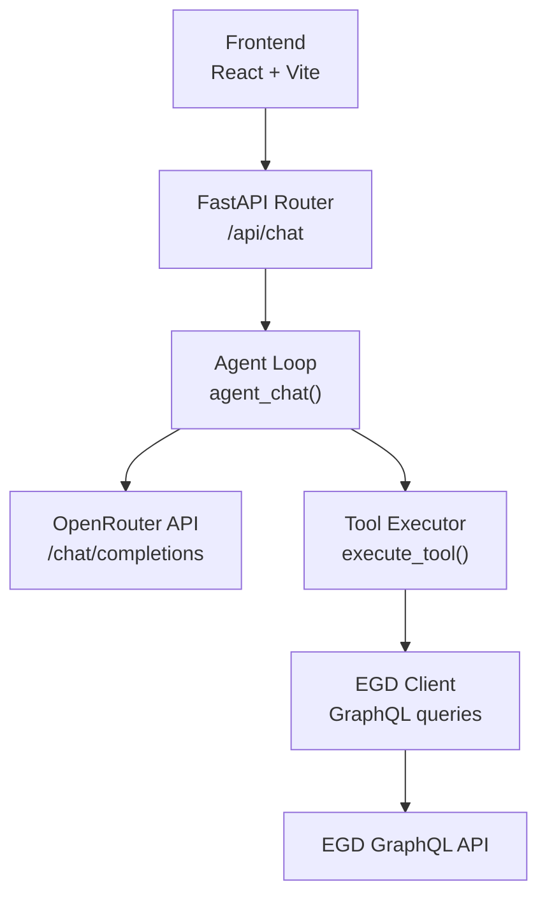
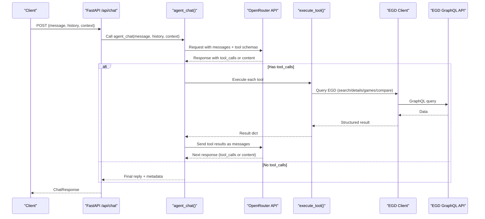
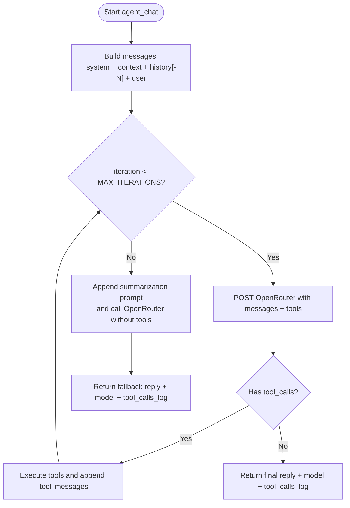
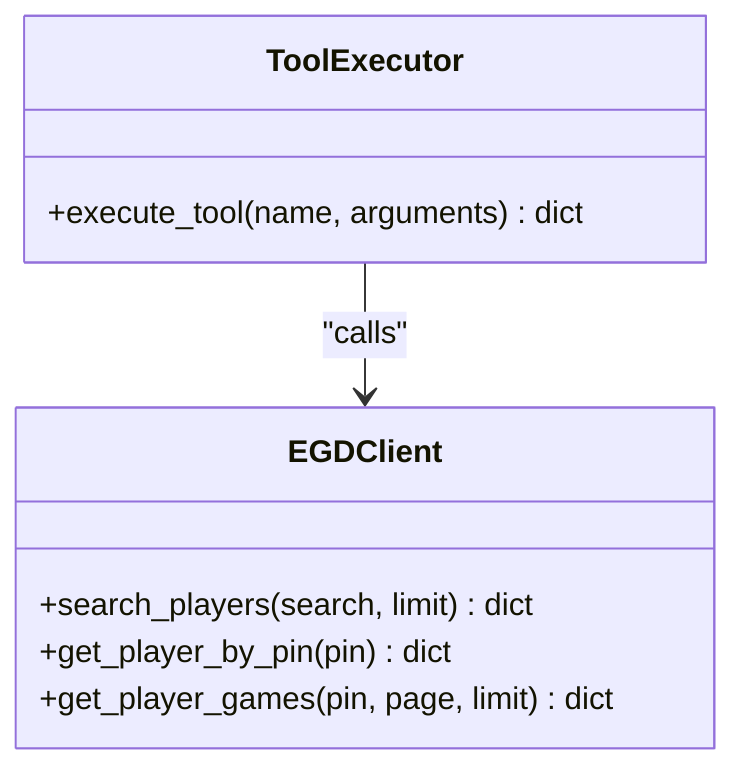
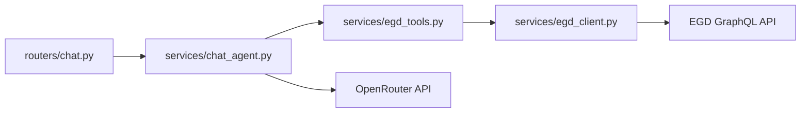

# Agent Architecture & Loop

<cite>
**Referenced Files in This Document**
- [chat_agent.py](file://backend/app/services/chat_agent.py)
- [egd_tools.py](file://backend/app/services/egd_tools.py)
- [egd_client.py](file://backend/app/services/egd_client.py)
- [chat.py](file://backend/app/routers/chat.py)
- [chat.py](file://backend/app/models/chat.py)
- [main.py](file://backend/app/main.py)
- [ARCHITECTURE.md](file://docs/ARCHITECTURE.md)
- [AGENT_DESIGN.md](file://docs/AGENT_DESIGN.md)
</cite>

## Table of Contents
1. [Introduction](#introduction)
2. [Project Structure](#project-structure)
3. [Core Components](#core-components)
4. [Architecture Overview](#architecture-overview)
5. [Detailed Component Analysis](#detailed-component-analysis)
6. [Dependency Analysis](#dependency-analysis)
7. [Performance Considerations](#performance-considerations)
8. [Troubleshooting Guide](#troubleshooting-guide)
9. [Conclusion](#conclusion)

## Introduction
This document explains the agentic chat architecture and iterative reasoning loop that powers GoNow’s AI assistant. It focuses on how the agent_chat function orchestrates conversation, tool calling, and data retrieval from the European Go Database (EGD), with OpenRouter as the LLM provider. You will learn:
- How user input flows to a final response
- How the system iteratively calls tools until the model produces a text answer
- How message history and context are managed
- The fallback mechanism when maximum iterations are reached
- Error handling strategies and orchestration patterns enabling autonomous data lookup

## Project Structure
The backend is organized by feature layers:
- Routers expose HTTP endpoints
- Services implement business logic (agent loop, tool execution, EGD client)
- Models define request/response schemas
- Documentation captures design decisions and architecture

**Diagram sources**
- [chat.py:1-25](file://backend/app/routers/chat.py#L1-L25)
- [chat_agent.py:30-154](file://backend/app/services/chat_agent.py#L30-L154)
- [egd_tools.py:102-212](file://backend/app/services/egd_tools.py#L102-L212)
- [egd_client.py:11-43](file://backend/app/services/egd_client.py#L11-L43)

**Section sources**
- [main.py:14-31](file://backend/app/main.py#L14-L31)
- [ARCHITECTURE.md:43-81](file://docs/ARCHITECTURE.md#L43-L81)

## Core Components
- Chat router: Accepts chat requests and delegates to the agent loop.
- Agent loop: Builds messages, sends them to OpenRouter with tool schemas, executes tool calls, and loops until a final text response or max iterations.
- Tool executor: Maps tool names to implementations and returns structured results.
- EGD client: Provides read-only access to player data via GraphQL with caching.
- Models: Define request/response shapes for validation.

Key responsibilities:
- Conversation assembly and iteration control
- Tool schema registration and dispatch
- External API integration and error propagation
- Context injection and history management

**Section sources**
- [chat.py:1-25](file://backend/app/routers/chat.py#L1-L25)
- [chat_agent.py:30-154](file://backend/app/services/chat_agent.py#L30-L154)
- [egd_tools.py:102-212](file://backend/app/services/egd_tools.py#L102-L212)
- [egd_client.py:11-43](file://backend/app/services/egd_client.py#L11-L43)
- [chat.py:1-21](file://backend/app/models/chat.py#L1-L21)

## Architecture Overview
The agent uses native tool calling provided by OpenRouter. The LLM decides when to call tools and what arguments to pass. The backend executes those tools against the EGD API and feeds results back into the conversation until the model provides a final answer.

**Diagram sources**
- [chat.py:1-25](file://backend/app/routers/chat.py#L1-L25)
- [chat_agent.py:30-154](file://backend/app/services/chat_agent.py#L30-L154)
- [egd_tools.py:102-212](file://backend/app/services/egd_tools.py#L102-L212)
- [egd_client.py:44-150](file://backend/app/services/egd_client.py#L44-L150)

## Detailed Component Analysis

### Agent Loop: agent_chat
Responsibilities:
- Build the initial message array with system prompt, optional context, and recent history
- Iterate up to a configurable maximum number of turns
- For each turn:
  - Send messages and tool schemas to OpenRouter
  - If the model returns tool_calls:
    - Append assistant message with tool_calls to conversation
    - Execute each tool and append tool results as “tool” messages
    - Continue loop
  - Else return final text response
- Fallback after max iterations:
  - Append a summarization prompt without tools
  - Make one more request to force a text answer

Key behaviors:
- History truncation to last N messages to limit context size
- Tool call logging for observability
- Graceful fallback when no API key is configured

**Diagram sources**
- [chat_agent.py:30-154](file://backend/app/services/chat_agent.py#L30-L154)

**Section sources**
- [chat_agent.py:30-154](file://backend/app/services/chat_agent.py#L30-L154)

### Tool Execution: execute_tool
Responsibilities:
- Map tool names to implementations
- Validate required parameters
- Call EGD client methods
- Normalize results into consistent success/error structures

Available tools:
- search_player(query): Search players by name or PIN
- get_player_details(pin): Full profile including rating history
- get_player_rating_history(pin): Rating evolution over time
- get_player_games(pin, limit?): Recent game history
- compare_players(pin1, pin2): Side-by-side comparison

Error handling:
- Unknown tool names return an error structure
- Exceptions during execution are caught and returned as errors

**Diagram sources**
- [egd_tools.py:102-212](file://backend/app/services/egd_tools.py#L102-L212)
- [egd_client.py:11-150](file://backend/app/services/egd_client.py#L11-L150)

**Section sources**
- [egd_tools.py:1-212](file://backend/app/services/egd_tools.py#L1-L212)

### EGD Client: egd_client
Responsibilities:
- Provide typed GraphQL queries for player search, details, games, and tournaments
- Cache responses in-memory with TTL to reduce external calls
- Raise descriptive errors for GraphQL failures

Caching strategy:
- In-memory dictionary keyed by query + variables
- TTL-based invalidation to balance freshness and performance

**Section sources**
- [egd_client.py:1-197](file://backend/app/services/egd_client.py#L1-L197)

### Router: /api/chat
Responsibilities:
- Parse request body using Pydantic models
- Delegate to agent_chat
- Return standardized response including reply, model, and tool_calls log
- Wrap exceptions in HTTP 500 responses

**Section sources**
- [chat.py:1-25](file://backend/app/routers/chat.py#L1-L25)

### Models: ChatRequest, ChatResponse, ChatMessage
Responsibilities:
- Enforce shape of incoming requests and outgoing responses
- Support optional context and history fields
- Include optional metadata like model name and tool_calls log

**Section sources**
- [chat.py:1-21](file://backend/app/models/chat.py#L1-L21)

## Dependency Analysis
High-level dependencies:
- Router depends on agent_chat
- Agent depends on OpenRouter API and tool executor
- Tool executor depends on EGD client
- EGD client depends on httpx and environment configuration

**Diagram sources**
- [chat.py:1-25](file://backend/app/routers/chat.py#L1-L25)
- [chat_agent.py:30-154](file://backend/app/services/chat_agent.py#L30-L154)
- [egd_tools.py:102-212](file://backend/app/services/egd_tools.py#L102-L212)
- [egd_client.py:11-43](file://backend/app/services/egd_client.py#L11-L43)

**Section sources**
- [main.py:29-31](file://backend/app/main.py#L29-L31)
- [ARCHITECTURE.md:83-88](file://docs/ARCHITECTURE.md#L83-L88)

## Performance Considerations
- Message history truncation: Only the last N messages are included to keep payloads small and reduce token usage.
- Max iterations cap: Prevents runaway loops; default is low to balance responsiveness and cost.
- EGD caching: In-memory cache with TTL reduces repeated GraphQL calls and latency.
- Tool call batching: Each iteration can include multiple tool calls; however, they are executed sequentially per implementation.
- Model selection: Configurable via environment variable to tune speed/cost trade-offs.

[No sources needed since this section provides general guidance]

## Troubleshooting Guide
Common issues and resolutions:
- Missing OpenRouter API key:
  - Symptom: Immediate fallback reply indicating configuration is missing
  - Resolution: Set OPENROUTER_API_KEY in backend .env
- Exceeded maximum iterations:
  - Symptom: Final answer generated after fallback summarization prompt
  - Resolution: Increase CHAT_MAX_ITERATIONS if complex multi-step lookups are common
- EGD API errors:
  - Symptom: Tool execution returns error structure or raises ValueError
  - Resolution: Verify EGD_API_TOKEN and network connectivity; check GraphQL query validity
- Unexpected tool arguments:
  - Symptom: JSON decode errors or missing keys
  - Resolution: Ensure tool parameter names match schemas; handle defaults gracefully

Operational checks:
- Health endpoint: GET /health returns status ok
- CORS: Ensure frontend origins are allowed in middleware

**Section sources**
- [chat_agent.py:42-48](file://backend/app/services/chat_agent.py#L42-L48)
- [chat_agent.py:128-153](file://backend/app/services/chat_agent.py#L128-L153)
- [egd_client.py:38-42](file://backend/app/services/egd_client.py#L38-L42)
- [main.py:39-41](file://backend/app/main.py#L39-L41)

## Conclusion
GoNow’s agentic chat leverages native tool calling to enable autonomous data lookup. The agent_chat function orchestrates a simple yet powerful ReAct-style loop: reason, act (call tools), observe (receive results), and repeat until the model answers. With robust error handling, configurable limits, and efficient caching, the system balances performance, reliability, and extensibility. The design avoids heavy orchestration frameworks while providing clear extension points for additional tools and data sources.