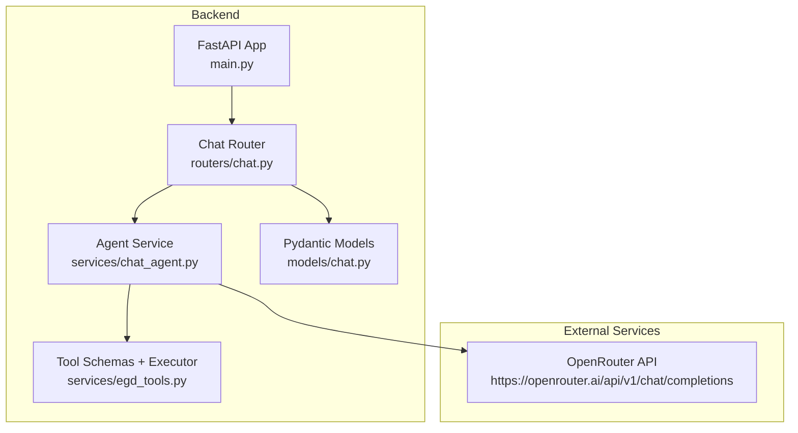
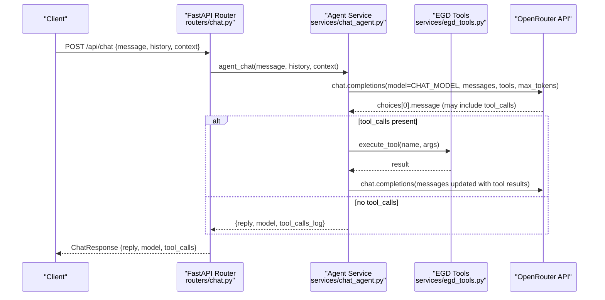
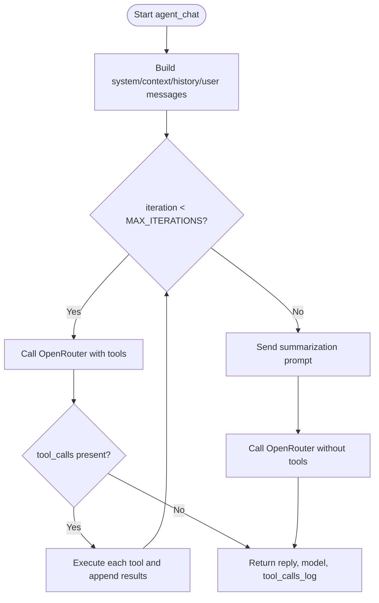
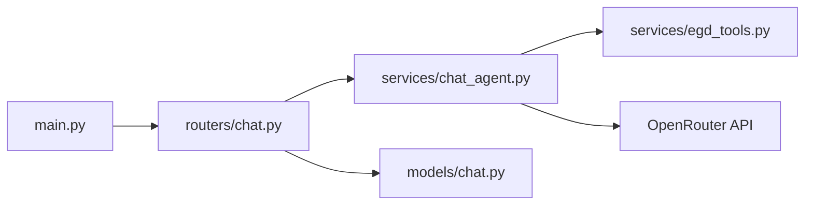

# Model Configuration & Optimization

<cite>
**Referenced Files in This Document**
- [main.py](file://backend/app/main.py)
- [chat_agent.py](file://backend/app/services/chat_agent.py)
- [chat.py](file://backend/app/routers/chat.py)
- [chat.py (models)](file://backend/app/models/chat.py)
- [egd_tools.py](file://backend/app/services/egd_tools.py)
- [README.md](file://README.md)
- [AGENTS.md](file://docs/AGENTS.md)
- [AGENT_DESIGN.md](file://docs/AGENT_DESIGN.md)
</cite>

## Table of Contents
1. [Introduction](#introduction)
2. [Project Structure](#project-structure)
3. [Core Components](#core-components)
4. [Architecture Overview](#architecture-overview)
5. [Detailed Component Analysis](#detailed-component-analysis)
6. [Dependency Analysis](#dependency-analysis)
7. [Performance Considerations](#performance-considerations)
8. [Troubleshooting Guide](#troubleshooting-guide)
9. [Conclusion](#conclusion)
10. [Appendices](#appendices)

## Introduction
This document explains how AI models are configured and optimized in the project, focusing on OpenRouter integration, environment variable configuration (CHAT_MODEL, CHAT_MAX_ITERATIONS), cost optimization techniques, model selection strategy, token limits, performance tuning options, guidance for choosing models by use case, monitoring costs, and rate limiting strategies for production deployments.

## Project Structure
The chat feature is implemented in the backend with a FastAPI router delegating to an agentic service that calls OpenRouter’s chat completions API with tool calling support. The application loads environment variables from a .env file located in the backend directory.

**Diagram sources**
- [main.py:14-31](file://backend/app/main.py#L14-L31)
- [chat.py:1-24](file://backend/app/routers/chat.py#L1-L24)
- [chat_agent.py:1-154](file://backend/app/services/chat_agent.py#L1-L154)
- [egd_tools.py:1-99](file://backend/app/services/egd_tools.py#L1-L99)
- [chat.py (models):1-21](file://backend/app/models/chat.py#L1-L21)

**Section sources**
- [main.py:1-42](file://backend/app/main.py#L1-L42)
- [chat.py:1-24](file://backend/app/routers/chat.py#L1-L24)
- [chat_agent.py:1-154](file://backend/app/services/chat_agent.py#L1-L154)
- [egd_tools.py:1-99](file://backend/app/services/egd_tools.py#L1-L99)
- [chat.py (models):1-21](file://backend/app/models/chat.py#L1-L21)

## Core Components
- Environment loading: The app loads .env from the backend directory at startup.
- Chat router: Exposes POST /api/chat and delegates to the agent service.
- Agent service: Implements the agentic loop with OpenRouter tool calling, configurable via environment variables.
- Tool schemas and executor: Define available tools and execute them server-side.
- Pydantic models: Validate request/response payloads.

Key environment variables:
- OPENROUTER_API_KEY: Required for chat; if missing, chat returns a disabled message.
- CHAT_MODEL: Selects the OpenRouter model ID used by the agent.
- CHAT_MAX_ITERATIONS: Limits the number of tool-calling iterations per turn.

Token limits:
- max_tokens is set in requests to cap response length.

Supported models (via CHAT_MODEL):
- google/gemini-2.0-flash-001 (default)
- openai/gpt-4o-mini
- anthropic/claude-3.5-sonnet

**Section sources**
- [main.py:8-10](file://backend/app/main.py#L8-L10)
- [chat.py:9-24](file://backend/app/routers/chat.py#L9-L24)
- [chat_agent.py:9-11](file://backend/app/services/chat_agent.py#L9-L11)
- [chat_agent.py:42-48](file://backend/app/services/chat_agent.py#L42-L48)
- [chat_agent.py:67-81](file://backend/app/services/chat_agent.py#L67-L81)
- [chat_agent.py:134-145](file://backend/app/services/chat_agent.py#L134-L145)
- [README.md:140-154](file://README.md#L140-L154)
- [AGENT_DESIGN.md:230-248](file://docs/AGENT_DESIGN.md#L230-L248)

## Architecture Overview
The chat flow uses OpenRouter’s native tool calling. The LLM decides when to call tools; the backend executes trusted tool functions and feeds results back until a final text answer is produced or the iteration limit is reached.

**Diagram sources**
- [chat.py:9-24](file://backend/app/routers/chat.py#L9-L24)
- [chat_agent.py:30-153](file://backend/app/services/chat_agent.py#L30-L153)
- [egd_tools.py:102-212](file://backend/app/services/egd_tools.py#L102-L212)

## Detailed Component Analysis

### Environment Variables and Model Selection
- OPENROUTER_API_KEY: If empty, the agent returns a disabled message instead of calling OpenRouter.
- CHAT_MODEL: Defaults to a fast, cheap model with tool calling support; can be changed to other supported models.
- CHAT_MAX_ITERATIONS: Controls the maximum number of tool-calling loops per user turn.

Model options and trade-offs:
- google/gemini-2.0-flash-001: Fast, very cheap, good quality, supports tool calling (default).
- openai/gpt-4o-mini: Fast, cheap, good quality, supports tool calling.
- anthropic/claude-3.5-sonnet: Medium speed, moderate cost, excellent quality, supports tool calling.

Use these to balance cost, latency, and quality based on your needs.

**Section sources**
- [chat_agent.py:9-11](file://backend/app/services/chat_agent.py#L9-L11)
- [chat_agent.py:42-48](file://backend/app/services/chat_agent.py#L42-L48)
- [README.md:140-154](file://README.md#L140-L154)
- [AGENT_DESIGN.md:230-248](file://docs/AGENT_DESIGN.md#L230-L248)

### Token Limits and Response Length Control
- max_tokens is set in requests to constrain response length.
- In the agent loop, max_tokens is applied to both tool-calling turns and the final summarization call.

Recommendations:
- Keep max_tokens aligned with expected answer length to avoid unnecessary tokens and cost.
- For complex answers requiring more detail, increase max_tokens cautiously and monitor usage.

**Section sources**
- [chat_agent.py:67-81](file://backend/app/services/chat_agent.py#L67-L81)
- [chat_agent.py:134-145](file://backend/app/services/chat_agent.py#L134-L145)

### Agentic Loop and Iteration Cap
- The agent sends messages and tools to OpenRouter.
- If the model responds with tool_calls, the backend executes them and appends results as tool messages.
- The loop repeats up to CHAT_MAX_ITERATIONS times.
- If the iteration limit is reached without a final answer, the agent issues a follow-up prompt to force a text summary.

**Diagram sources**
- [chat_agent.py:30-153](file://backend/app/services/chat_agent.py#L30-L153)

**Section sources**
- [chat_agent.py:30-153](file://backend/app/services/chat_agent.py#L30-L153)

### Tool Calling and Data Access
- Tools are defined as function schemas compatible with OpenRouter/OpenAI function calling.
- Available tools include searching players, retrieving player details, rating history, recent games, and comparing two players.
- The executor dispatches to the appropriate function and returns structured results.

Best practices:
- Keep tool descriptions precise to guide the LLM effectively.
- Limit returned data size where possible to reduce token usage and improve performance.

**Section sources**
- [egd_tools.py:1-99](file://backend/app/services/egd_tools.py#L1-L99)
- [egd_tools.py:102-212](file://backend/app/services/egd_tools.py#L102-L212)

### Request/Response Contracts
- ChatRequest includes message, optional context, and optional history.
- ChatResponse includes reply, optional model name, and optional list of tool calls executed.

These contracts ensure consistent validation and clear API behavior.

**Section sources**
- [chat.py (models):6-21](file://backend/app/models/chat.py#L6-L21)

## Dependency Analysis
- main.py loads environment variables and mounts routers.
- routers/chat.py depends on models/chat.py and services/chat_agent.py.
- services/chat_agent.py depends on services/egd_tools.py and reads environment variables for model and iteration settings.
- External dependency: OpenRouter API endpoint.

**Diagram sources**
- [main.py:14-31](file://backend/app/main.py#L14-L31)
- [chat.py:1-24](file://backend/app/routers/chat.py#L1-L24)
- [chat_agent.py:1-154](file://backend/app/services/chat_agent.py#L1-L154)
- [egd_tools.py:1-99](file://backend/app/services/egd_tools.py#L1-L99)
- [chat.py (models):1-21](file://backend/app/models/chat.py#L1-L21)

**Section sources**
- [main.py:1-42](file://backend/app/main.py#L1-L42)
- [chat.py:1-24](file://backend/app/routers/chat.py#L1-L24)
- [chat_agent.py:1-154](file://backend/app/services/chat_agent.py#L1-L154)
- [egd_tools.py:1-99](file://backend/app/services/egd_tools.py#L1-L99)
- [chat.py (models):1-21](file://backend/app/models/chat.py#L1-L21)

## Performance Considerations
- Model choice impacts latency and cost: prefer faster, cheaper models for high-volume scenarios; switch to higher-quality models for complex reasoning tasks.
- Token budgeting: tune max_tokens to match expected output length to minimize cost and latency.
- Iteration control: keep CHAT_MAX_ITERATIONS low enough to prevent long-running chains while allowing multi-step tool usage.
- History trimming: the agent limits conversation history to the last N messages to reduce input size and cost.

[No sources needed since this section provides general guidance]

## Troubleshooting Guide
Common issues and resolutions:
- Missing API key: If OPENROUTER_API_KEY is not set, the agent returns a disabled message. Ensure the key is present in the backend .env file.
- Unexpected model behavior: Verify CHAT_MODEL matches a supported model ID and that the selected model supports tool calling.
- Long responses or high costs: Reduce max_tokens and review tool outputs to trim unnecessary data.
- Too many iterations: Lower CHAT_MAX_ITERATIONS to bound tool-calling loops.

Operational checks:
- Health endpoint: Use GET /health to verify the backend is running.
- API docs: Visit /docs to inspect endpoints and test requests.

**Section sources**
- [chat_agent.py:42-48](file://backend/app/services/chat_agent.py#L42-L48)
- [main.py:34-41](file://backend/app/main.py#L34-L41)

## Conclusion
The chat system integrates OpenRouter with native tool calling, offering flexible model selection and robust iteration control. By configuring CHAT_MODEL, CHAT_MAX_ITERATIONS, and max_tokens appropriately, you can balance cost, latency, and quality. For production, implement rate limiting and cost monitoring to protect against abuse and manage expenses.

[No sources needed since this section summarizes without analyzing specific files]

## Appendices

### Environment Variables Reference
- OPENROUTER_API_KEY: OpenRouter API key for chat.
- CHAT_MODEL: OpenRouter model ID (e.g., google/gemini-2.0-flash-001, openai/gpt-4o-mini, anthropic/claude-3.5-sonnet).
- CHAT_MAX_ITERATIONS: Maximum tool-calling iterations per chat turn.

**Section sources**
- [README.md:140-154](file://README.md#L140-L154)
- [AGENTS.md:31-36](file://docs/AGENTS.md#L31-L36)
- [AGENT_DESIGN.md:230-248](file://docs/AGENT_DESIGN.md#L230-L248)

### Model Selection Guidance
- Default model: google/gemini-2.0-flash-001 for best speed/cost ratio with tool calling.
- Balanced option: openai/gpt-4o-mini for good quality and reasonable cost.
- High-quality option: anthropic/claude-3.5-sonnet for superior reasoning at higher cost.

Choose based on:
- Complexity of queries (simple lookups vs. nuanced analysis).
- Expected throughput and latency requirements.
- Budget constraints.

**Section sources**
- [README.md:140-154](file://README.md#L140-L154)
- [AGENT_DESIGN.md:230-248](file://docs/AGENT_DESIGN.md#L230-L248)

### Cost Optimization Techniques
- Prefer faster, cheaper models for routine tasks.
- Tune max_tokens to avoid over-generation.
- Limit CHAT_MAX_ITERATIONS to reduce repeated tool calls.
- Trim conversation history to reduce input tokens.
- Monitor OpenRouter usage and adjust model selection dynamically based on workload patterns.

[No sources needed since this section provides general guidance]

### Monitoring Costs
- Track OpenRouter usage metrics (tokens, requests) through your provider dashboard.
- Log model names and tool call counts per request to correlate usage with features.
- Set alerts for unusual spikes in token consumption or error rates.

[No sources needed since this section provides general guidance]

### Rate Limiting Strategies for Production
- Implement per-user or global request rate limits at the API gateway or middleware layer.
- Enforce quotas per API key or tenant to prevent abuse.
- Add retry/backoff policies for transient failures to external APIs.
- Cache frequent read-only tool results where appropriate to reduce redundant calls.

[No sources needed since this section provides general guidance]