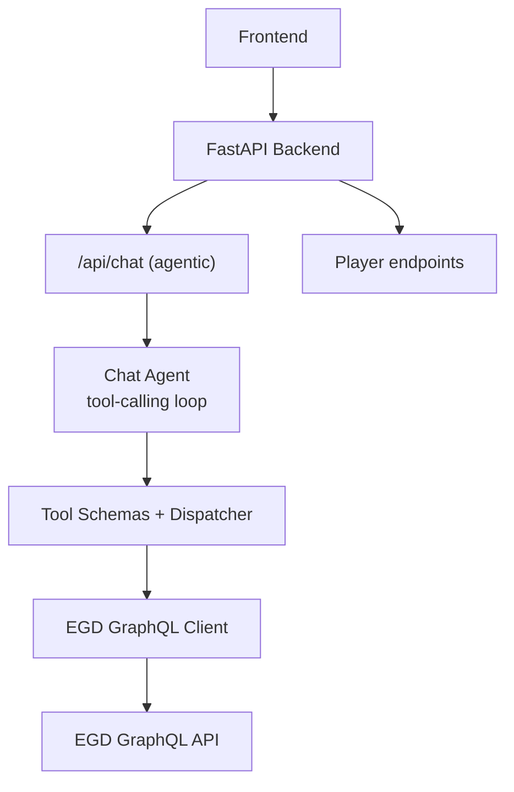
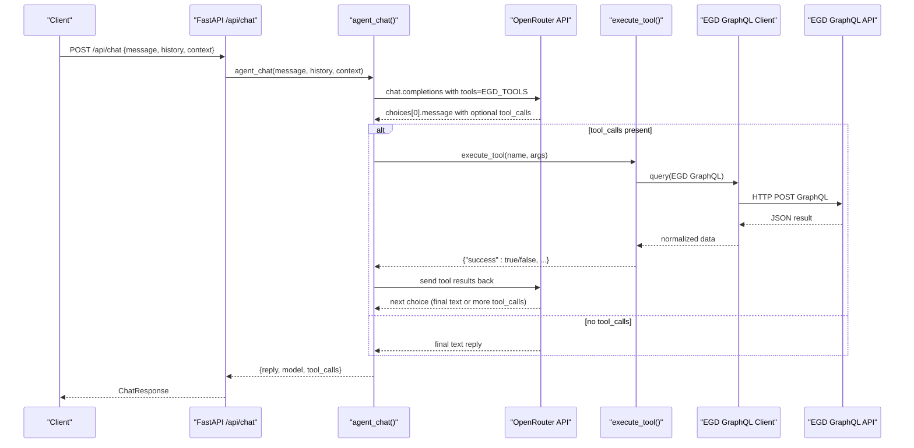
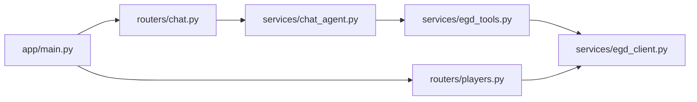

# Tool System & EGD Integration

<cite>
**Referenced Files in This Document**
- [egd_tools.py](file://backend/app/services/egd_tools.py)
- [chat_agent.py](file://backend/app/services/chat_agent.py)
- [egd_client.py](file://backend/app/services/egd_client.py)
- [players.py](file://backend/app/routers/players.py)
- [chat.py](file://backend/app/routers/chat.py)
- [player.py](file://backend/app/models/player.py)
- [chat.py](file://backend/app/models/chat.py)
- [main.py](file://backend/app/main.py)
- [EGD_API.md](file://docs/EGD_API.md)
- [README.md](file://README.md)
</cite>

## Table of Contents
1. [Introduction](#introduction)
2. [Project Structure](#project-structure)
3. [Core Components](#core-components)
4. [Architecture Overview](#architecture-overview)
5. [Detailed Component Analysis](#detailed-component-analysis)
6. [Dependency Analysis](#dependency-analysis)
7. [Performance Considerations](#performance-considerations)
8. [Troubleshooting Guide](#troubleshooting-guide)
9. [Conclusion](#conclusion)
10. [Appendices](#appendices)

## Introduction
This document explains the tool system and European Go Database (EGD) integration used by the agentic chat assistant. It covers:
- Available tools: search_player, get_player_details, compare_players, plus additional tools for rating history and games
- Function schemas, parameters, and return values
- The execute_tool dispatcher and how tools are registered for LLM function calling
- How the chat agent orchestrates tool calls with OpenRouter
- Error handling patterns
- Real-time data retrieval via the EGD GraphQL client

The goal is to make it easy for developers to understand, extend, and troubleshoot the tooling layer that bridges the LLM with live EGD data.

## Project Structure
The backend exposes REST endpoints and an agentic chat endpoint. Tools are defined as OpenAI-compatible function schemas and executed server-side against the EGD GraphQL API.

**Diagram sources**
- [main.py:14-31](file://backend/app/main.py#L14-L31)
- [chat.py:9-24](file://backend/app/routers/chat.py#L9-L24)
- [players.py:8-40](file://backend/app/routers/players.py#L8-L40)
- [chat_agent.py:30-153](file://backend/app/services/chat_agent.py#L30-L153)
- [egd_tools.py:5-99](file://backend/app/services/egd_tools.py#L5-L99)
- [egd_client.py:11-42](file://backend/app/services/egd_client.py#L11-L42)

**Section sources**
- [main.py:14-31](file://backend/app/main.py#L14-L31)
- [README.md:24-55](file://README.md#L24-L55)

## Core Components
- Tool definitions and dispatcher:
  - EGD_TOOLS: list of OpenAI-compatible function schemas for LLM tool calling
  - execute_tool(name, arguments): synchronous dispatcher that routes to specific tool implementations and returns a standardized result dict
- Chat agent:
  - Sends messages and tool schemas to OpenRouter
  - Parses tool_calls from the model response
  - Executes tools via execute_tool and feeds results back until final text or max iterations
- EGD client:
  - Encapsulates GraphQL queries, caching, and error handling
  - Provides methods for player search, details, games, tournaments, and name/PIN resolution

Key responsibilities:
- Tool registration: EGD_TOOLS is passed directly to OpenRouter so the LLM can call functions
- Execution: execute_tool centralizes validation, dispatch, and error wrapping
- Data access: egd_client performs authenticated requests to EGD with TTL-based cache

**Section sources**
- [egd_tools.py:5-99](file://backend/app/services/egd_tools.py#L5-L99)
- [egd_tools.py:102-212](file://backend/app/services/egd_tools.py#L102-L212)
- [chat_agent.py:30-153](file://backend/app/services/chat_agent.py#L30-L153)
- [egd_client.py:11-42](file://backend/app/services/egd_client.py#L11-L42)

## Architecture Overview
The agentic chat flow uses OpenRouter’s native tool calling. The backend defines tool schemas, executes them server-side, and returns structured results to the LLM.

**Diagram sources**
- [chat.py:9-24](file://backend/app/routers/chat.py#L9-L24)
- [chat_agent.py:30-153](file://backend/app/services/chat_agent.py#L30-L153)
- [egd_tools.py:102-212](file://backend/app/services/egd_tools.py#L102-L212)
- [egd_client.py:21-42](file://backend/app/services/egd_client.py#L21-L42)

## Detailed Component Analysis

### Tool Definitions and Schema
Tools are declared as OpenAI-compatible function schemas. Each entry includes:
- type: "function"
- function.name: unique tool identifier
- function.description: guidance for the LLM
- function.parameters: JSON schema describing required and optional inputs

Available tools:
- search_player(query: string)
  - Description: Search players by name or PIN; returns basic info
  - Parameters: query (string, required)
  - Returns: standardized dict with success flag and data payload
- get_player_details(pin: integer)
  - Description: Get detailed profile including grade, rating, biography, and rating history
  - Parameters: pin (integer, required)
  - Returns: standardized dict with success flag and enriched player data
- get_player_rating_history(pin: integer)
  - Description: Get rating evolution over time from tournament placements
  - Parameters: pin (integer, required)
  - Returns: standardized dict with success flag and sorted history
- get_player_games(pin: integer, limit?: integer)
  - Description: Get recent game history with opponents and tournament info
  - Parameters: pin (integer, required), limit (integer, optional, capped at 200)
  - Returns: standardized dict with success flag and paginated games
- compare_players(pin1: integer, pin2: integer)
  - Description: Compare two players side-by-side (rating, grade, tournaments)
  - Parameters: pin1 (integer, required), pin2 (integer, required)
  - Returns: standardized dict with success flag and both players’ summaries

Notes:
- All tool responses follow a consistent shape: {"success": bool, "data"?: any, "error"?: string}
- The dispatcher wraps exceptions and returns {"success": false, "error": str(e)}

**Section sources**
- [egd_tools.py:5-99](file://backend/app/services/egd_tools.py#L5-L99)
- [egd_tools.py:102-212](file://backend/app/services/egd_tools.py#L102-L212)

### execute_tool Dispatcher
Responsibilities:
- Route by tool name to implementation logic
- Validate required parameters
- Call EGD client methods
- Normalize and enrich results
- Wrap errors consistently

Flow:
- If unknown tool name: return failure with descriptive error
- For each tool:
  - Extract parameters from arguments
  - Call egd_client methods
  - Transform raw EGD data into tool-friendly structures
  - Return standardized result

Error handling:
- Missing or invalid parameters lead to early failures
- Network or GraphQL errors bubble up and are caught by the outer try/except
- Not-found cases return explicit errors (e.g., player not found)

**Section sources**
- [egd_tools.py:102-212](file://backend/app/services/egd_tools.py#L102-L212)

### Chat Agent Orchestration
Responsibilities:
- Build message history and system prompt
- Send request to OpenRouter with EGD_TOOLS attached
- Parse tool_calls from model response
- Execute tools via execute_tool
- Append tool results as “tool” role messages
- Loop until final text or max iterations reached

Configuration:
- Model selection via environment variable
- Max iterations configurable via environment variable
- Graceful fallback if API key missing

Return value:
- reply: final text answer
- model: model identifier used
- tool_calls: log of tool names invoked during the turn

**Section sources**
- [chat_agent.py:30-153](file://backend/app/services/chat_agent.py#L30-L153)

### EGD GraphQL Client
Responsibilities:
- Authenticate requests using Bearer token from environment
- Execute GraphQL queries with variables
- Cache responses with TTL to reduce external calls
- Provide typed helpers for common operations

Key methods:
- _query(query, variables): internal executor with caching and error handling
- search_players(search, limit): typo-tolerant player search
- get_player_by_pin(pin): full player details with placements and biography
- get_player_games(pin, page, limit): paginated game history
- get_player_tournaments(pin): deduplicated tournament list from placements
- get_player_by_name_or_pin(search): convenience resolver for PIN vs name

Caching:
- In-memory dict keyed by query+variables
- TTL-based expiration to balance freshness and performance

Error handling:
- Raises ValueError on GraphQL errors
- HTTP errors raised by httpx propagate upward

**Section sources**
- [egd_client.py:11-42](file://backend/app/services/egd_client.py#L11-L42)
- [egd_client.py:44-192](file://backend/app/services/egd_client.py#L44-L192)

### REST Endpoints for Players
While tools are primarily consumed by the chat agent, the backend also exposes direct REST endpoints for players:
- GET /api/search?q=<query>: search by name or PIN
- GET /api/player/{pin}: player details with rating history
- GET /api/player/{pin}/games: paginated game history
- GET /api/player/{pin}/tournaments: tournament history

These endpoints use the same EGD client and provide consistent data shapes for frontend consumption.

**Section sources**
- [players.py:8-106](file://backend/app/routers/players.py#L8-L106)

### Pydantic Models
Models define expected shapes for chat interactions and player data:
- ChatMessage, ChatRequest, ChatResponse: structure for chat API
- PlayerSummary, TournamentInfo, PlacementInfo, PlayerDetail, SearchResponse: structures for player-related payloads

These models help enforce types and improve documentation and IDE support.

**Section sources**
- [chat.py:6-21](file://backend/app/models/chat.py#L6-L21)
- [player.py:6-60](file://backend/app/models/player.py#L6-L60)

## Dependency Analysis
High-level dependencies:
- Routers depend on services
- Chat agent depends on tool schemas and dispatcher
- Tools depend on EGD client
- EGD client depends on httpx and environment configuration

**Diagram sources**
- [main.py:29-31](file://backend/app/main.py#L29-L31)
- [chat.py:9-24](file://backend/app/routers/chat.py#L9-L24)
- [players.py:8-40](file://backend/app/routers/players.py#L8-L40)
- [chat_agent.py:30-153](file://backend/app/services/chat_agent.py#L30-L153)
- [egd_tools.py:102-212](file://backend/app/services/egd_tools.py#L102-L212)
- [egd_client.py:11-42](file://backend/app/services/egd_client.py#L11-L42)

**Section sources**
- [main.py:29-31](file://backend/app/main.py#L29-L31)
- [chat_agent.py:30-153](file://backend/app/services/chat_agent.py#L30-L153)
- [egd_tools.py:102-212](file://backend/app/services/egd_tools.py#L102-L212)
- [egd_client.py:11-42](file://backend/app/services/egd_client.py#L11-L42)

## Performance Considerations
- Caching: EGD client caches responses per query+variables with a TTL to reduce network overhead
- Pagination limits: Tools cap maximum limits (e.g., games limit capped at 200) to prevent large payloads
- Iteration bounds: Chat agent limits tool-calling loops to a configurable maximum to avoid long-running turns
- Asynchronous I/O: Uses async HTTP clients for non-blocking operations

Recommendations:
- Tune cache TTL based on data volatility
- Monitor EGD API rate limits and adjust pagination
- Consider adding retry/backoff for transient network errors

[No sources needed since this section provides general guidance]

## Troubleshooting Guide
Common issues and resolutions:
- Missing API keys:
  - OPENROUTER_API_KEY not set: chat returns a friendly message indicating configuration is required
  - EGD_API_TOKEN not set: GraphQL requests will fail; ensure token is configured in .env
- Unknown tool name:
  - execute_tool returns an error indicating the tool is not recognized; verify tool name matches schema
- Player not found:
  - get_player_details and compare_players return explicit errors when PIN does not exist
- GraphQL errors:
  - EGD client raises ValueError on GraphQL errors; inspect error details and adjust query/variables
- Excessive tool calls:
  - If the LLM keeps calling tools beyond expectations, reduce CHAT_MAX_ITERATIONS or refine prompts

Operational checks:
- Health endpoint: GET /health returns status ok
- API docs: GET / provides link to Swagger UI

**Section sources**
- [chat_agent.py:42-48](file://backend/app/services/chat_agent.py#L42-L48)
- [egd_tools.py:207-212](file://backend/app/services/egd_tools.py#L207-L212)
- [egd_client.py:38-42](file://backend/app/services/egd_client.py#L38-L42)
- [main.py:34-41](file://backend/app/main.py#L34-L41)

## Conclusion
The tool system cleanly separates LLM-facing function schemas from server-side execution logic. The dispatcher ensures consistent input/output and robust error handling, while the EGD client abstracts GraphQL complexity and adds caching. Together, they enable an agentic chat experience that retrieves real-time player data from the European Go Database.

[No sources needed since this section summarizes without analyzing specific files]

## Appendices

### Tool Usage Examples
- Search a player by name:
  - Tool: search_player
  - Parameters: { "query": "Zhan Shi" }
  - Expected outcome: list of matching players with basic info
- Get player details:
  - Tool: get_player_details
  - Parameters: { "pin": 12345678 }
  - Expected outcome: enriched profile including rating history
- Compare two players:
  - Tool: compare_players
  - Parameters: { "pin1": 12345678, "pin2": 87654321 }
  - Expected outcome: side-by-side summary for both players

Note: These examples describe usage patterns and expected outcomes; actual payloads and responses follow the schemas and structures documented above.

**Section sources**
- [egd_tools.py:5-99](file://backend/app/services/egd_tools.py#L5-L99)
- [egd_tools.py:102-212](file://backend/app/services/egd_tools.py#L102-L212)

### EGD GraphQL Reference
For deeper understanding of available queries and types, refer to the EGD API reference.

**Section sources**
- [EGD_API.md:1-274](file://docs/EGD_API.md#L1-L274)