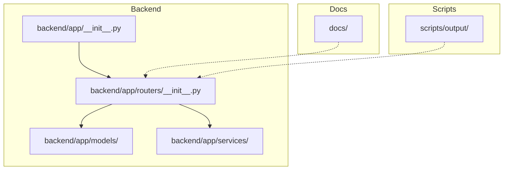
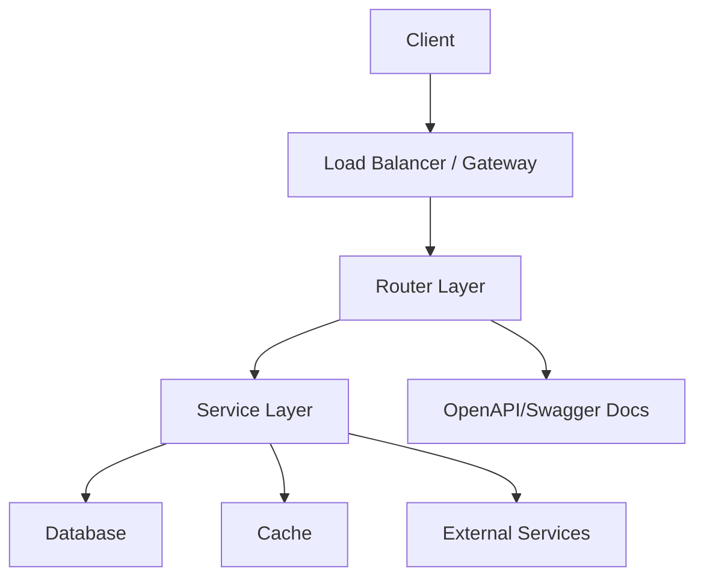
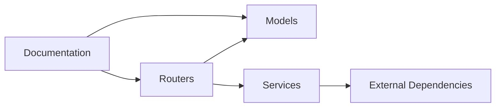
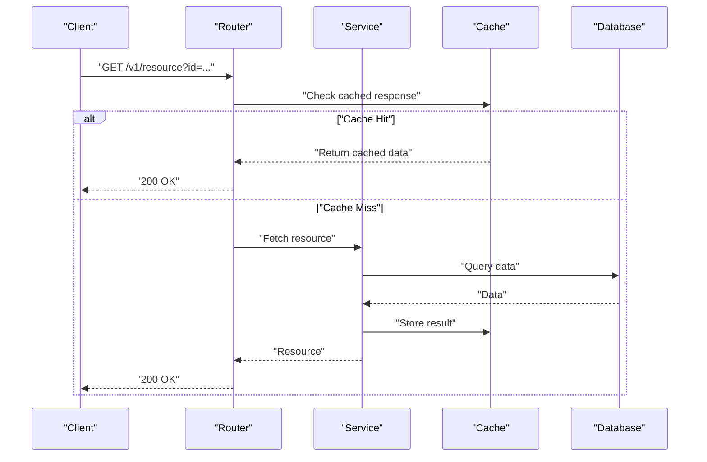

# API Best Practices

<cite>
**Referenced Files in This Document**
- [__init__.py](file://backend/app/__init__.py)
- [routers/__init__.py](file://backend/app/routers/__init__.py)
- [.gitignore](file://.gitignore)
</cite>

## Table of Contents
1. [Introduction](#introduction)
2. [Project Structure](#project-structure)
3. [Core Components](#core-components)
4. [Architecture Overview](#architecture-overview)
5. [Detailed Component Analysis](#detailed-component-analysis)
6. [Dependency Analysis](#dependency-analysis)
7. [Performance Considerations](#performance-considerations)
8. [Troubleshooting Guide](#troubleshooting-guide)
9. [Conclusion](#conclusion)
10. [Appendices](#appendices)

## Introduction
This document provides comprehensive best practices for developing APIs within the GoNow framework. It covers API versioning, backward compatibility, deprecation policies, documentation standards (including OpenAPI/Swagger integration and automated generation), consistent error handling, logging strategies, monitoring approaches, performance optimization, caching, load balancing, testing, debugging, deployment considerations, coding standards, naming conventions, and architectural patterns. The guidance is designed to be accessible to both new and experienced developers while ensuring maintainability and scalability.

## Project Structure
The repository follows a modular backend layout with clear separation of concerns:
- Application initialization and package bootstrap under backend/app
- Routing definitions under backend/app/routers
- Data models under backend/app/models
- Business logic under backend/app/services
- Documentation assets under docs
- Build and output artifacts under scripts/output

**Diagram sources**
- [__init__.py](file://backend/app/__init__.py)
- [routers/__init__.py](file://backend/app/routers/__init__.py)

**Section sources**
- [__init__.py](file://backend/app/__init__.py)
- [routers/__init__.py](file://backend/app/routers/__init__.py)

## Core Components
- Application Bootstrap: The application entry point initializes middleware, configuration, and routing registration. Ensure environment variables are loaded securely and dependencies are injected consistently.
- Router Layer: Centralizes endpoint definitions, path parameters, query validation, and response formatting. Use explicit version prefixes for API evolution.
- Models: Define request/response schemas and data contracts. Keep them aligned with OpenAPI specifications for consistency.
- Services: Encapsulate business logic, external integrations, and domain rules. Keep routers thin by delegating complex operations here.

Best practices:
- Keep endpoints stateless and idempotent where possible.
- Validate inputs at the router boundary and return structured errors.
- Separate cross-cutting concerns (auth, rate limiting, tracing) into middleware.

**Section sources**
- [__init__.py](file://backend/app/__init__.py)
- [routers/__init__.py](file://backend/app/routers/__init__.py)

## Architecture Overview
A recommended layered architecture for GoNow APIs:
- Client -> API Gateway/Load Balancer -> Router Layer -> Service Layer -> Data Access/External Services
- Cross-cutting concerns: Authentication, Authorization, Rate Limiting, Logging, Metrics, Tracing
- Documentation: OpenAPI spec generated from code annotations or schema definitions

[No sources needed since this diagram shows conceptual workflow, not actual code structure]

## Detailed Component Analysis

### API Versioning Strategies
- URI Path Versioning: Prefer /v1/, /v2/ prefixes for clear client signaling and easy routing.
- Header-Based Versioning: Use custom headers when you need to avoid URL changes; less discoverable but useful for internal APIs.
- Content Negotiation: Accept-Version header for advanced clients; combine with content-type negotiation.

Guidelines:
- Treat each major version as a separate contract surface.
- Maintain parallel routes during transitions and sunset old versions on a schedule.
- Document breaking changes explicitly in release notes and OpenAPI changelogs.

**Section sources**
- [routers/__init__.py](file://backend/app/routers/__init__.py)

### Backward Compatibility and Deprecation Policies
- Additive changes only in minor versions: new fields, optional parameters, new endpoints.
- Avoid removing or renaming fields without a deprecation period.
- Provide migration guides and dual-write support if necessary.
- Deprecation lifecycle: announce -> soft-deprecate (warnings) -> hard-deprecate (errors) -> remove.

Operational tips:
- Emit deprecation warnings in responses (headers or body) for early detection.
- Track usage metrics per endpoint to plan sunsetting.

**Section sources**
- [routers/__init__.py](file://backend/app/routers/__init__.py)

### API Documentation Standards and OpenAPI/Swagger Integration
- Single source of truth: define schemas once and reuse across routers and docs.
- Generate OpenAPI specs automatically from code annotations or schema builders.
- Include examples, descriptions, and error codes in the spec.
- Host Swagger UI alongside the API for interactive exploration.

Automation:
- Integrate spec generation into CI to prevent drift between code and docs.
- Lint specs for completeness and correctness.

**Section sources**
- [routers/__init__.py](file://backend/app/routers/__init__.py)

### Consistent Error Handling
- Standardize error envelopes with fields like code, message, details, and trace_id.
- Map domain errors to HTTP status codes consistently.
- Never leak stack traces or sensitive information to clients.
- Provide actionable messages and links to documentation where applicable.

Middleware approach:
- Global exception handler to normalize errors.
- Validation errors grouped by field for better UX.

**Section sources**
- [routers/__init__.py](file://backend/app/routers/__init__.py)

### Logging Strategies
- Structured logging with correlation IDs for distributed tracing.
- Log levels: debug (dev), info (prod), warn/error (incidents).
- Redact secrets and PII; include context such as user_id, request_id, endpoint, latency.
- Ship logs to centralized systems with retention policies.

**Section sources**
- [routers/__init__.py](file://backend/app/routers/__init__.py)

### Monitoring Approaches
- Expose metrics: request rate, latency percentiles, error rates, saturation.
- Health and readiness endpoints for orchestration.
- Distributed tracing across services and external calls.
- Alerting on SLO breaches and anomalous behavior.

**Section sources**
- [routers/__init__.py](file://backend/app/routers/__init__.py)

### Performance Optimization Techniques
- Connection pooling for databases and external services.
- Request/response compression where appropriate.
- Efficient serialization formats and minimal payloads.
- Profile hot paths and optimize critical sections.

**Section sources**
- [routers/__init__.py](file://backend/app/routers/__init__.py)

### Caching Strategies
- Use cache layers for read-heavy endpoints with well-defined invalidation rules.
- Set TTLs based on data freshness requirements.
- Implement cache keys that account for query parameters and user context.
- Monitor hit ratios and eviction rates.

**Section sources**
- [routers/__init__.py](file://backend/app/routers/__init__.py)

### Load Balancing Considerations
- Stateless service design enables horizontal scaling.
- Configure health checks and graceful shutdown.
- Use sticky sessions only when necessary; prefer shared state via cache or database.
- Plan capacity with autoscaling policies and backpressure mechanisms.

**Section sources**
- [routers/__init__.py](file://backend/app/routers/__init__.py)

### Testing API Endpoints
- Unit tests for services and validators.
- Contract tests against OpenAPI specs.
- Integration tests with test databases and mocked external services.
- Load and chaos tests for resilience.

CI integration:
- Run tests on every PR; publish reports and artifacts.

**Section sources**
- [routers/__init__.py](file://backend/app/routers/__init__.py)

### Debugging Techniques
- Enable verbose logging in development environments.
- Use correlation IDs to follow requests across components.
- Inspect request/response payloads safely.
- Leverage profiling tools for CPU/memory bottlenecks.

**Section sources**
- [routers/__init__.py](file://backend/app/routers/__init__.py)

### Deployment Considerations
- Environment-specific configurations via secure secret management.
- Blue/green or canary deployments for low-risk releases.
- Feature flags for gradual rollouts.
- Rollback procedures and runbooks.

**Section sources**
- [routers/__init__.py](file://backend/app/routers/__init__.py)

### Coding Standards and Naming Conventions
- Follow language idioms and style guides.
- Use descriptive names for endpoints, fields, and variables.
- Keep functions small and focused; favor composition over inheritance.
- Enforce linting and formatting in CI.

**Section sources**
- [routers/__init__.py](file://backend/app/routers/__init__.py)

### Architectural Patterns for Maintainable APIs
- Layered architecture with clear boundaries.
- Dependency injection for testability and flexibility.
- Event-driven interactions for decoupled workflows.
- API gateway pattern for cross-cutting concerns.

**Section sources**
- [routers/__init__.py](file://backend/app/routers/__init__.py)

## Dependency Analysis
High-level dependency relationships among core modules:
- Routers depend on models and services for data and logic.
- Services may depend on external libraries and infrastructure.
- Documentation depends on schemas defined in models and routers.

**Diagram sources**
- [routers/__init__.py](file://backend/app/routers/__init__.py)

**Section sources**
- [routers/__init__.py](file://backend/app/routers/__init__.py)

## Performance Considerations
- Optimize database queries and use indexes appropriately.
- Batch operations and reduce round trips.
- Apply pagination and filtering to large datasets.
- Tune concurrency settings based on workload characteristics.
- Use CDN and edge caching for static assets.

[No sources needed since this section provides general guidance]

## Troubleshooting Guide
Common issues and resolutions:
- 4xx/5xx spikes: check error logs, validate inputs, review recent changes.
- Latency regressions: analyze traces, identify slow endpoints, optimize queries.
- Memory leaks: profile heap usage, inspect long-lived references.
- Auth failures: verify token lifetimes, scopes, and key rotation.

Operational hygiene:
- Ensure .env files are excluded from version control.
- Keep logs out of repositories and artifact stores.

**Section sources**
- [.gitignore](file://.gitignore)

## Conclusion
Adopting these best practices will help you build robust, scalable, and maintainable APIs in the GoNow framework. Focus on clear versioning, strong documentation, consistent error handling, observability, and performance tuning. Integrate automation into your CI/CD pipeline to enforce quality and accelerate delivery.

[No sources needed since this section summarizes without analyzing specific files]

## Appendices

### Appendix A: Example API Workflow

[No sources needed since this diagram shows conceptual workflow, not actual code structure]