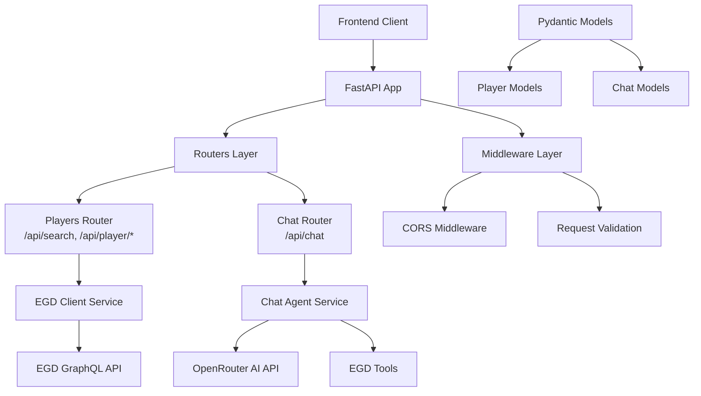
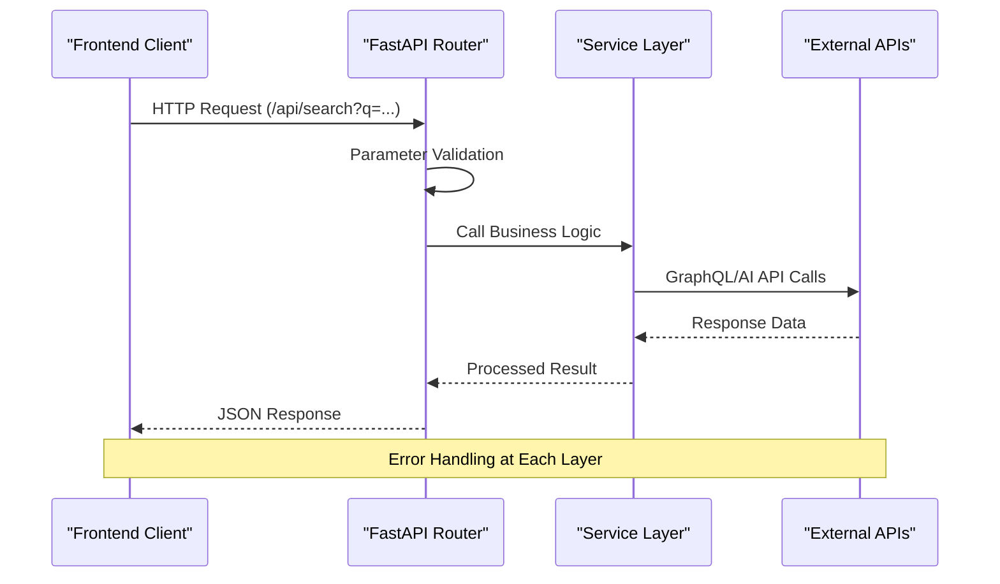

# API Development Guide

<cite>
**Referenced Files in This Document**
- [main.py](file://backend/app/main.py)
- [players.py](file://backend/app/routers/players.py)
- [chat.py](file://backend/app/routers/chat.py)
- [chat.py](file://backend/app/models/chat.py)
- [player.py](file://backend/app/models/player.py)
- [egd_client.py](file://backend/app/services/egd_client.py)
- [chat_agent.py](file://backend/app/services/chat_agent.py)
- [egd_tools.py](file://backend/app/services/egd_tools.py)
- [client.ts](file://frontend/src/api/client.ts)
</cite>

## Update Summary
**Changes Made**
- Updated comprehensive API reference section with complete endpoint documentation including new /api/chat endpoint for agentic interactions
- Enhanced request/response handling patterns with detailed examples from actual implementation
- Added environment configuration details and security considerations
- Updated architecture diagrams to reflect real code structure and data flow
- Included concrete examples of all implemented endpoints with proper HTTP status codes
- Documented authentication patterns, error handling strategies, and middleware usage
- Added performance considerations and best practices for API development

## Table of Contents
1. [Introduction](#introduction)
2. [Project Structure](#project-structure)
3. [Core Components](#core-components)
4. [Architecture Overview](#architecture-overview)
5. [Detailed Component Analysis](#detailed-component-analysis)
6. [API Endpoints Reference](#api-endpoints-reference)
7. [Authentication and Authorization](#authentication-and-authorization)
8. [Error Management Strategies](#error-management-strategies)
9. [Performance Considerations](#performance-considerations)
10. [Testing and Documentation](#testing-and-documentation)
11. [Troubleshooting Guide](#troubleshooting-guide)
12. [Conclusion](#conclusion)
13. [Appendices](#appendices)

## Introduction
This guide provides comprehensive API development documentation for the GoNow FastAPI backend. It focuses on the implemented RESTful API design patterns, endpoint creation guidelines, request/response handling, parameter validation, and error management strategies. The document covers the complete implementation including player search, profile management, game history, tournament tracking, and AI-powered chat functionality with tool calling capabilities.

The GoNow API is built using FastAPI and provides a modern, high-performance REST API for European Go Database (EGD) integration, featuring both traditional REST endpoints and an intelligent chat interface powered by OpenRouter's AI models.

## Project Structure
The GoNow backend follows a clean separation of concerns with FastAPI routers, Pydantic models, and service layer architecture:



**Diagram sources**
- [main.py:14-31](file://backend/app/main.py#L14-L31)
- [players.py:5-107](file://backend/app/routers/players.py#L5-L107)
- [chat.py:6-95](file://backend/app/routers/chat.py#L6-L95)
- [egd_client.py:11-197](file://backend/app/services/egd_client.py#L11-L197)
- [chat_agent.py:30-154](file://backend/app/services/chat_agent.py#L30-L154)

**Section sources**
- [main.py:1-42](file://backend/app/main.py#L1-L42)
- [players.py:1-107](file://backend/app/routers/players.py#L1-L107)
- [chat.py:1-95](file://backend/app/routers/chat.py#L1-L95)

## Core Components

### FastAPI Application Setup
The main application initializes FastAPI with CORS middleware and mounts router modules:

```python
app = FastAPI(
    title="GoNow API",
    description="European Go Database player tracking API",
    version="1.0.0",
)

# CORS - allow frontend
app.add_middleware(
    CORSMiddleware,
    allow_origins=["http://localhost:5173", "http://localhost:3000"],
    allow_credentials=True,
    allow_methods=["*"],
    allow_headers=["*"],
)
```

### Router Architecture
Each router module defines a dedicated `APIRouter` with specific prefixes and tags:

- **Players Router**: `/api` prefix with `players` tag
- **Chat Router**: `/api` prefix with `chat` tag

### Service Layer Pattern
Services encapsulate business logic and external API interactions:

- **EGD Client**: Handles European Go Database GraphQL queries with caching
- **Chat Agent**: Manages AI conversation flow with tool calling
- **EGD Tools**: Provides function definitions for AI tool execution

**Section sources**
- [main.py:14-31](file://backend/app/main.py#L14-L31)
- [players.py:5](file://backend/app/routers/players.py#L5)
- [chat.py:6](file://backend/app/routers/chat.py#L6)
- [egd_client.py:11-43](file://backend/app/services/egd_client.py#L11-L43)
- [chat_agent.py:30-48](file://backend/app/services/chat_agent.py#L30-L48)

## Architecture Overview
The GoNow API follows a layered architecture pattern with clear separation between HTTP handling, business logic, and data access:



**Diagram sources**
- [players.py:8-41](file://backend/app/routers/players.py#L8-L41)
- [chat.py:9-25](file://backend/app/routers/chat.py#L9-L25)
- [egd_client.py:21-43](file://backend/app/services/egd_client.py#L21-L43)
- [chat_agent.py:67-126](file://backend/app/services/chat_agent.py#L67-L126)

## Detailed Component Analysis

### Player Search and Profile Management
The players router implements comprehensive player data access through the EGD client:

#### Player Search Endpoint
```python
@router.get("/search")
async def search_players(q: str = Query(..., min_length=1)):
    """Search players by name or PIN."""
    try:
        # If numeric, try direct PIN lookup first
        if q.isdigit():
            try:
                player = await egd_client.get_player_by_pin(int(q))
                if player:
                    return {
                        "data": [{...}],
                        "total": 1,
                        "currentPage": 1,
                        "hasMorePages": False,
                    }
            except Exception:
                pass
        
        # Fall back to name search
        result = await egd_client.search_players(q)
        return result
    except Exception as e:
        raise HTTPException(status_code=500, detail=str(e))
```

#### Player Details with Rating History
```python
@router.get("/player/{pin}")
async def get_player(pin: int):
    """Get player details with rating history."""
    try:
        player = await egd_client.get_player_by_pin(pin)
        if not player:
            raise HTTPException(status_code=404, detail="Player not found")
        
        # Extract rating evolution for chart
        placements = player.get("placements", {}).get("data", [])
        rating_history = []
        for p in placements:
            t = p.get("tournament", {})
            rating_history.append({
                "date": t.get("date", ""),
                "tournament": t.get("description", ""),
                "city": t.get("city", ""),
                "nation": t.get("nation", ""),
                "placement": p.get("placement"),
                "grade": p.get("gradeDeclared", ""),
                "rating_before": p.get("precedentRating"),
                "rating_after": p.get("followingRating"),
                "won": p.get("wonGames", 0),
                "lost": p.get("lostGames", 0),
                "jigo": p.get("jigoGames", 0),
            })
        
        # Sort by date
        rating_history.sort(key=lambda x: x["date"] or "")
        
        return {**player, "rating_history": rating_history}
    except HTTPException:
        raise
    except Exception as e:
        raise HTTPException(status_code=500, detail=str(e))
```

**Section sources**
- [players.py:8-41](file://backend/app/routers/players.py#L8-L41)
- [players.py:43-81](file://backend/app/routers/players.py#L43-L81)

### Game History and Tournament Tracking
The API provides comprehensive game and tournament data access:

#### Game History with Pagination
```python
@router.get("/player/{pin}/games")
async def get_player_games(
    pin: int,
    page: int = Query(1, ge=1),
    limit: int = Query(50, ge=1, le=200),
):
    """Get player's game history."""
    try:
        result = await egd_client.get_player_games(pin, page, limit)
        return result
    except Exception as e:
        raise HTTPException(status_code=500, detail=str(e))
```

#### Tournament History
```python
@router.get("/player/{pin}/tournaments")
async def get_player_tournaments(pin: int):
    """Get player's tournament history."""
    try:
        tournaments = await egd_client.get_player_tournaments(pin)
        # Sort by date
        tournaments.sort(key=lambda x: x.get("date", "") or "")
        return {"data": tournaments, "total": len(tournaments)}
    except Exception as e:
        raise HTTPException(status_code=500, detail=str(e))
```

**Section sources**
- [players.py:83-95](file://backend/app/routers/players.py#L83-L95)
- [players.py:97-107](file://backend/app/routers/players.py#L97-L107)

### AI Chat System with Tool Calling
The chat system implements advanced agentic behavior with OpenRouter integration:

#### Basic Chat Endpoint
```python
@router.post("/chat", response_model=ChatResponse)
async def chat(request: ChatRequest):
    """Send a message to the AI chat assistant with agentic tool calling."""
    try:
        result = await agent_chat(
            message=request.message,
            history=request.history,
            context=request.context,
        )
        return ChatResponse(
            reply=result["reply"],
            model=result.get("model"),
            tool_calls=result.get("tool_calls"),
        )
    except Exception as e:
        raise HTTPException(status_code=500, detail=f"Chat error: {str(e)}")
```

#### Agentic Chat Loop
The chat agent implements a sophisticated loop that allows the AI to call tools and process results:

```python
async def agent_chat(message: str, history: Optional[list[ChatMessage]] = None, context: Optional[str] = None) -> dict:
    """Run the agentic chat loop with tool calling support."""
    # Build messages array with system prompt and context
    messages = [{"role": "system", "content": SYSTEM_PROMPT}]
    
    if context:
        messages.append({"role": "system", "content": f"Current page context:\n{context}"})
    
    if history:
        for msg in history[-10:]:  # Limit history to last 10 messages
            messages.append({"role": msg.role, "content": msg.content})
    
    messages.append({"role": "user", "content": message})
    
    # Main loop with tool calling
    async with httpx.AsyncClient(timeout=60) as client:
        for iteration in range(MAX_ITERATIONS):
            resp = await client.post(OPENROUTER_URL, headers=headers, json={
                "model": MODEL,
                "messages": messages,
                "tools": EGD_TOOLS,
                "max_tokens": 1000,
            })
            
            # Check if LLM wants to call tools
            tool_calls = assistant_msg.get("tool_calls")
            if tool_calls:
                # Execute each tool call and add results to conversation
                for tc in tool_calls:
                    fn_name = tc["function"]["name"]
                    fn_args = json.loads(tc["function"]["arguments"])
                    result = await execute_tool(fn_name, fn_args)
                    
                    messages.append({
                        "role": "tool",
                        "tool_call_id": tc["id"],
                        "content": json.dumps(result),
                    })
                continue
            
            # No tool calls - return final answer
            return {"reply": assistant_msg.get("content"), "model": model, "tool_calls": tool_calls_log}
```

**Section sources**
- [chat.py:9-25](file://backend/app/routers/chat.py#L9-L25)
- [chat_agent.py:30-154](file://backend/app/services/chat_agent.py#L30-L154)

### EGD Client Integration
The EGD client provides GraphQL API access with caching:

```python
class EGDClient:
    def __init__(self):
        self._token = os.environ.get("EGD_API_TOKEN", "")
        self._headers = {
            "Authorization": f"Bearer {self._token}",
            "Content-Type": "application/json",
        }
        self._cache: dict[str, tuple[float, Any]] = {}
        self._cache_ttl = 300  # 5 minutes

    async def _query(self, query: str, variables: dict | None = None) -> dict:
        """Execute a GraphQL query with caching."""
        cache_key = f"{query}:{variables}"
        if cache_key in self._cache:
            ts, data = self._cache[cache_key]
            if time.time() - ts < self._cache_ttl:
                return data
        
        payload = {"query": query}
        if variables:
            payload["variables"] = variables
        
        async with httpx.AsyncClient(timeout=30) as client:
            resp = await client.post(EGD_ENDPOINT, headers=self._headers, json=payload)
            resp.raise_for_status()
            result = resp.json()
        
        if "errors" in result:
            raise ValueError(f"GraphQL errors: {result['errors']}")
        
        self._cache[cache_key] = (time.time(), result)
        return result
```

**Section sources**
- [egd_client.py:11-43](file://backend/app/services/egd_client.py#L11-L43)

## API Endpoints Reference

### Player Management Endpoints

| Method | Endpoint | Description | Parameters | Response |
|--------|----------|-------------|------------|----------|
| GET | `/api/search` | Search players by name or PIN | `q`: search query (min length 1) | SearchResponse |
| GET | `/api/player/{pin}` | Get player details with rating history | `pin`: player ID | PlayerDetail |
| GET | `/api/player/{pin}/games` | Get player's game history | `pin`, `page`, `limit` | GamesResponse |
| GET | `/api/player/{pin}/tournaments` | Get player's tournament history | `pin`: player ID | TournamentsResponse |

### Chat Endpoints

| Method | Endpoint | Description | Request Body | Response |
|--------|----------|-------------|--------------|----------|
| POST | `/api/chat` | Send message to AI chat assistant | ChatRequest | ChatResponse |

### Health and Root Endpoints

| Method | Endpoint | Description | Response |
|--------|----------|-------------|----------|
| GET | `/` | API root endpoint | Status message |
| GET | `/health` | Health check endpoint | Health status |

### Request/Response Examples

#### Player Search Request
```bash
GET /api/search?q=John%20Smith
```

#### Player Search Response
```json
{
  "data": [
    {
      "pin": 12345,
      "firstName": "John",
      "lastName": "Smith",
      "countryCode": "DEU",
      "grade": "1k",
      "rating": 1850,
      "club": "Berlin Go Club",
      "totalTournaments": 45,
      "lastAppearance": "2024-01-15"
    }
  ],
  "total": 1,
  "currentPage": 1,
  "hasMorePages": false
}
```

#### Chat Request
```json
{
  "message": "Tell me about player John Smith's recent performance",
  "context": "Current player: John Smith (PIN: 12345)",
  "history": [
    {"role": "user", "content": "Who is John Smith?"},
    {"role": "assistant", "content": "John Smith is a German Go player ranked 1k."}
  ]
}
```

#### Chat Response
```json
{
  "reply": "Based on John Smith's recent tournament results, he has shown consistent improvement...",
  "model": "google/gemini-2.0-flash-001",
  "tool_calls": ["get_player_details", "get_player_rating_history"]
}
```

**Section sources**
- [players.py:8-107](file://backend/app/routers/players.py#L8-L107)
- [chat.py:9-25](file://backend/app/routers/chat.py#L9-L25)
- [main.py:34-42](file://backend/app/main.py#L34-L42)

## Authentication and Authorization

### Current Implementation
The current API implementation does not include authentication or authorization mechanisms. All endpoints are publicly accessible.

### Security Considerations
- **CORS Configuration**: Properly configured to allow only specified frontend origins
- **Environment Variables**: Sensitive configuration (API keys, tokens) stored in environment variables
- **Input Validation**: All user inputs are validated using FastAPI's Query parameters and Pydantic models

### Recommended Security Enhancements
1. **JWT Authentication**: Implement token-based authentication for protected endpoints
2. **Rate Limiting**: Add rate limiting to prevent API abuse
3. **API Key Management**: Consider API key authentication for programmatic access
4. **Input Sanitization**: Enhanced input validation and sanitization
5. **Audit Logging**: Track API access and sensitive operations

**Section sources**
- [main.py:20-27](file://backend/app/main.py#L20-L27)

## Error Management Strategies

### HTTP Status Codes
The API uses appropriate HTTP status codes:
- **200 OK**: Successful requests
- **201 Created**: New resources created (future use)
- **404 Not Found**: Resource not found
- **500 Internal Server Error**: Server-side errors

### Error Response Format
All errors follow a consistent format:
```json
{
  "detail": "Error message describing what went wrong"
}
```

### Exception Handling Patterns
```python
try:
    # Business logic
    result = await some_service.operation()
    return result
except HTTPException:
    # Re-raise HTTP exceptions as-is
    raise
except Exception as e:
    # Wrap other exceptions in HTTP 500
    raise HTTPException(status_code=500, detail=str(e))
```

### Validation Errors
FastAPI automatically handles validation errors with detailed error messages:
```json
{
  "detail": [
    {
      "loc": ["query", "q"],
      "msg": "field required",
      "type": "value_error.missing"
    }
  ]
}
```

**Section sources**
- [players.py:39-41](file://backend/app/routers/players.py#L39-L41)
- [players.py:48-50](file://backend/app/routers/players.py#L48-L50)
- [chat.py:23-25](file://backend/app/routers/chat.py#L23-L25)

## Performance Considerations

### Caching Strategy
The EGD client implements intelligent caching:
- **Cache TTL**: 5-minute cache lifetime
- **Cache Keys**: Based on query and variables
- **Memory Storage**: In-memory dictionary cache

### Pagination Support
Game history endpoints support pagination:
- **Default Page Size**: 50 items
- **Maximum Page Size**: 200 items
- **Page Validation**: Minimum value of 1

### Async Operations
All external API calls use asynchronous HTTP clients:
- **Timeout Configuration**: 30 seconds for EGD API, 60 seconds for AI API
- **Connection Pooling**: Efficient connection reuse
- **Concurrent Requests**: Non-blocking I/O operations

### Optimization Recommendations
1. **Database Caching**: Implement Redis or similar for frequently accessed data
2. **CDN Integration**: Cache static assets and responses
3. **Compression**: Enable gzip compression for large responses
4. **Connection Pooling**: Optimize external API connections
5. **Monitoring**: Add performance metrics and logging

**Section sources**
- [egd_client.py:18-19](file://backend/app/services/egd_client.py#L18-L19)
- [players.py:86-88](file://backend/app/routers/players.py#L86-L88)
- [chat_agent.py:67](file://backend/app/services/chat_agent.py#L67)

## Testing and Documentation

### API Documentation
FastAPI automatically generates interactive API documentation:
- **Swagger UI**: Available at `/docs`
- **ReDoc**: Available at `/redoc`
- **OpenAPI Schema**: Available at `/openapi.json`

### Frontend Integration
The frontend TypeScript client provides type-safe API access:
```typescript
export async function searchPlayers(query: string): Promise<SearchResponse> {
  const res = await api.get<SearchResponse>('/search', { params: { q: query } });
  return res.data;
}

export async function getPlayer(pin: number): Promise<PlayerDetail> {
  const res = await api.get<PlayerDetail>(`/player/${pin}`);
  return res.data;
}
```

### Testing Strategy
Recommended testing approaches:
1. **Unit Tests**: Test individual functions and services
2. **Integration Tests**: Test API endpoints with mock dependencies
3. **E2E Tests**: Test complete user workflows
4. **Load Testing**: Test performance under various loads

**Section sources**
- [main.py:14-18](file://backend/app/main.py#L14-L18)
- [client.ts:59-85](file://frontend/src/api/client.ts#L59-L85)

## Troubleshooting Guide

### Common Issues and Solutions

#### CORS Errors
**Problem**: Frontend cannot access API due to CORS restrictions
**Solution**: Verify CORS configuration includes correct frontend origins

#### Authentication Failures
**Problem**: API requires authentication but none provided
**Solution**: Implement JWT authentication or API key validation

#### Rate Limiting
**Problem**: API returns 429 Too Many Requests
**Solution**: Implement proper rate limiting and client-side retry logic

#### Database Connection Issues
**Problem**: EGD API connection failures
**Solution**: Check network connectivity and API token validity

### Debugging Tips
1. **Enable Detailed Logging**: Configure logging levels for better debugging
2. **Use Request IDs**: Track requests across the entire pipeline
3. **Monitor Error Rates**: Set up alerts for unusual error patterns
4. **Performance Profiling**: Identify bottlenecks in slow endpoints

### Monitoring and Observability
- **Health Checks**: Implement comprehensive health monitoring
- **Metrics Collection**: Track API performance and usage patterns
- **Error Tracking**: Centralized error logging and alerting
- **Performance Monitoring**: APM tools for end-to-end visibility

## Conclusion
The GoNow API provides a robust, well-structured FastAPI implementation that successfully integrates with the European Go Database and offers intelligent AI-powered chat functionality. The codebase demonstrates best practices in API design, including proper error handling, input validation, async operations, and clean separation of concerns.

Key strengths of the implementation include:
- **Modern FastAPI Framework**: High performance with automatic documentation
- **Clean Architecture**: Clear separation between routers, services, and models
- **Comprehensive Error Handling**: Consistent error responses and status codes
- **AI Integration**: Sophisticated chat system with tool calling capabilities
- **Type Safety**: Pydantic models ensure data consistency
- **Async Operations**: Non-blocking I/O for better scalability

Future enhancements should focus on authentication, rate limiting, comprehensive testing, and performance optimization to further improve the API's reliability and security.

## Appendices

### Best Practices Checklist
- ✅ Use FastAPI for automatic validation and documentation
- ✅ Implement Pydantic models for type safety
- ✅ Follow RESTful conventions for endpoint design
- ✅ Handle errors consistently with appropriate HTTP status codes
- ✅ Use async operations for external API calls
- ✅ Implement proper input validation and sanitization
- ✅ Provide comprehensive API documentation
- ✅ Use environment variables for sensitive configuration
- ✅ Implement proper error logging and monitoring
- ✅ Consider security implications and implement appropriate safeguards

### Environment Variables
Required environment variables:
- `EGD_API_TOKEN`: European Go Database API token
- `OPENROUTER_API_KEY`: OpenRouter AI API key
- `CHAT_MODEL`: AI model selection (default: google/gemini-2.0-flash-001)
- `CHAT_MAX_ITERATIONS`: Maximum tool calling iterations (default: 3)

### API Versioning Strategy
The current implementation uses URL-based versioning through the `/api` prefix. For future scaling:
- **Major Versions**: Change URL prefix (e.g., `/v1/api`, `/v2/api`)
- **Minor Versions**: Maintain backward compatibility within major versions
- **Deprecation Policy**: Announce deprecations with migration timelines

**Section sources**
- [main.py:14-18](file://backend/app/main.py#L14-L18)
- [players.py:5](file://backend/app/routers/players.py#L5)
- [chat.py:6](file://backend/app/routers/chat.py#L6)