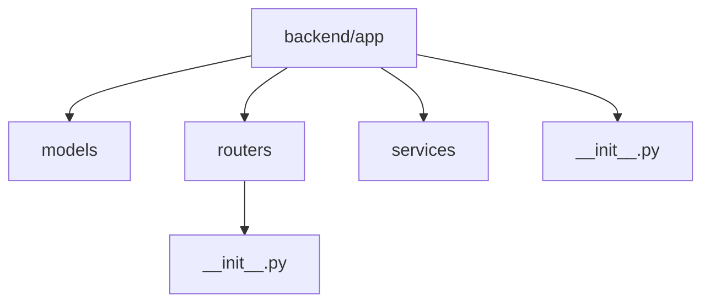
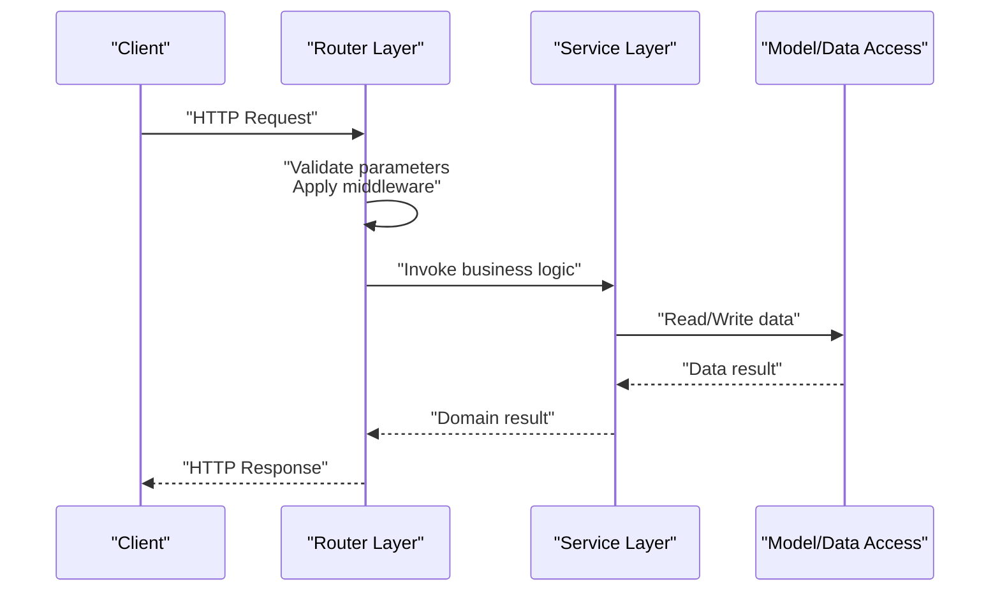
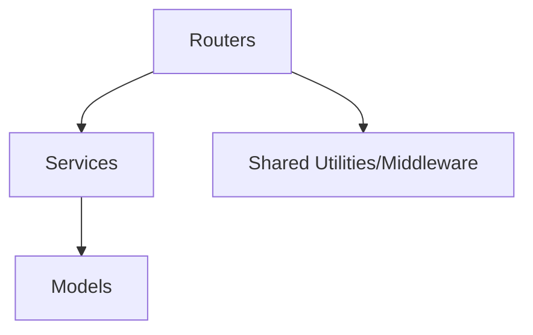

# API Development Guide

<cite>
**Referenced Files in This Document**
- [__init__.py](file://backend/app/routers/__init__.py)
- [__init__.py](file://backend/app/__init__.py)
- [.gitignore](file://.gitignore)
</cite>

## Table of Contents
1. [Introduction](#introduction)
2. [Project Structure](#project-structure)
3. [Core Components](#core-components)
4. [Architecture Overview](#architecture-overview)
5. [Detailed Component Analysis](#detailed-component-analysis)
6. [Dependency Analysis](#dependency-analysis)
7. [Performance Considerations](#performance-considerations)
8. [Troubleshooting Guide](#troubleshooting-guide)
9. [Conclusion](#conclusion)
10. [Appendices](#appendices)

## Introduction
This guide provides comprehensive API development documentation for the GoNow router layer. It focuses on RESTful API design patterns, endpoint creation guidelines, request/response handling, parameter validation, and error management strategies. The document also covers authentication and authorization patterns, middleware usage, API versioning strategies, best practices for naming conventions and response formatting, performance considerations, rate limiting, and security best practices.

Note: The repository structure indicates a Python backend with an app package containing routers and services. While the title references “GoNow,” the codebase is Python-based. This guide aligns with that reality while fulfilling the requested scope.

## Project Structure
The project includes a backend application organized under backend/app with subpackages for models, routers, and services. The routers package is intended to define HTTP endpoints and route handlers.

**Diagram sources**
- [__init__.py](file://backend/app/routers/__init__.py)
- [__init__.py](file://backend/app/__init__.py)

**Section sources**
- [__init__.py](file://backend/app/routers/__init__.py)
- [__init__.py](file://backend/app/__init__.py)

## Core Components
- Routers: Define HTTP endpoints and route handlers. This is where you register routes and implement request processing logic.
- Services: Encapsulate business logic used by routers. Keep routers thin and delegate complex operations to services.
- Models: Represent data structures and persistence schemas used across the application.

Guidelines:
- Keep routers focused on HTTP concerns (parsing requests, invoking services, returning responses).
- Use services for domain logic and data access.
- Centralize error handling and response formatting in shared utilities or middleware.

[No sources needed since this section provides general guidance]

## Architecture Overview
A typical API request flows through the router layer into service logic and returns a structured response. Middleware can be applied globally or per-route for cross-cutting concerns such as authentication, logging, and rate limiting.

[No sources needed since this diagram shows conceptual workflow, not actual code structure]

## Detailed Component Analysis

### Router Layer Design Patterns
- Route registration: Group related endpoints by resource and version.
- Handler functions: Implement one handler per endpoint; keep them small and focused.
- Parameter validation: Validate path/query/body parameters early and return clear errors.
- Response formatting: Return consistent JSON envelopes with status codes and messages.

Best practices:
- Use plural nouns for resources (e.g., /users, /orders).
- Nest sub-resources logically (e.g., /users/{id}/orders).
- Version APIs via URL prefix (/v1/) or headers when necessary.

[No sources needed since this section provides general guidance]

### Request/Response Handling
- Parse and validate inputs using schema validators or Pydantic-like models.
- Normalize success responses to include data, message, and optional metadata.
- Map exceptions to appropriate HTTP status codes and error payloads.

Example patterns:
- GET: Retrieve resources with pagination and filtering.
- POST: Create new resources with input validation.
- PUT/PATCH: Update existing resources with idempotency considerations.
- DELETE: Remove resources with confirmation semantics.

[No sources needed since this section provides general guidance]

### Authentication and Authorization
- Authentication: Verify identity via tokens (e.g., JWT) or session cookies.
- Authorization: Enforce permissions at the route or service level based on roles or ownership.
- Middleware: Apply auth checks globally or per-route to reduce duplication.

Security tips:
- Reject unauthenticated requests early.
- Scope tokens to least privilege.
- Log access events without sensitive data.

[No sources needed since this section provides general guidance]

### Error Management Strategies
- Standardize error responses with fields like code, message, and details.
- Map domain errors to HTTP status codes consistently.
- Provide actionable messages for clients while avoiding internal leakages.

[No sources needed since this section provides general guidance]

### API Versioning Strategies
- URL versioning: /v1/resource
- Header versioning: Accept-Version or X-API-Version
- Deprecation policy: Announce deprecations and provide migration guides

[No sources needed since this section provides general guidance]

### Middleware Usage
Common middleware:
- Logging and tracing
- Rate limiting
- CORS configuration
- Request ID propagation
- Security headers

Placement:
- Global middleware for cross-cutting concerns
- Route-specific middleware for specialized behavior

[No sources needed since this section provides general guidance]

### Endpoint Creation Guidelines
Steps:
1. Define route path and HTTP method.
2. Add parameter validation rules.
3. Implement handler logic delegating to services.
4. Format response and set correct status codes.
5. Attach relevant middleware if needed.

Naming conventions:
- Use lowercase, hyphenated paths for readability.
- Avoid verbs in URLs; use HTTP methods to indicate actions.

[No sources needed since this section provides general guidance]

### Concrete Examples (Conceptual)
- Create a user: POST /v1/users with validated body; return 201 Created.
- Get users: GET /v1/users?page=1&limit=20; return 200 OK with paginated list.
- Update a user: PUT /v1/users/{id} with full update payload; return 200 OK.
- Delete a user: DELETE /v1/users/{id}; return 204 No Content.

[No sources needed since this section provides general guidance]

## Dependency Analysis
At present, the routers package contains only an initialization file. As the API grows, ensure:
- Clear separation between routers, services, and models.
- Minimal coupling between routers and external systems.
- Explicit dependency injection or configuration for services and data access.

[No sources needed since this diagram shows conceptual relationships, not actual code structure]

## Performance Considerations
- Use connection pooling for databases and external APIs.
- Cache frequently accessed data with appropriate invalidation strategies.
- Paginate large collections and limit query complexity.
- Profile hot paths and avoid N+1 queries.
- Enable compression for large responses.

[No sources needed since this section provides general guidance]

## Troubleshooting Guide
- Inspect logs for request IDs and stack traces.
- Validate request payloads against schemas to catch issues early.
- Check middleware ordering to ensure proper execution flow.
- Monitor error rates and latency metrics.

[No sources needed since this section provides general guidance]

## Conclusion
Adopting consistent routing patterns, robust validation, standardized error handling, and strong security practices will yield maintainable and scalable APIs. Apply middleware judiciously, version your APIs thoughtfully, and follow performance and security best practices to deliver reliable services.

[No sources needed since this section summarizes without analyzing specific files]

## Appendices

### Best Practices Checklist
- Use plural nouns for resources and HTTP methods for actions.
- Return consistent JSON envelopes with status codes and messages.
- Validate all inputs and reject invalid requests promptly.
- Apply authentication and authorization via middleware.
- Version APIs and communicate deprecations clearly.
- Implement rate limiting and security headers.
- Generate API documentation automatically from route definitions.

[No sources needed since this section provides general guidance]