# Authentication & Security

<cite>
**Referenced Files in This Document**
- [backend/app/__init__.py](file://backend/app/__init__.py)
- [backend/app/routers/__init__.py](file://backend/app/routers/__init__.py)
- [.gitignore](file://.gitignore)
</cite>

## Table of Contents
1. [Introduction](#introduction)
2. [Project Structure](#project-structure)
3. [Core Components](#core-components)
4. [Architecture Overview](#architecture-overview)
5. [Detailed Component Analysis](#detailed-component-analysis)
6. [Dependency Analysis](#dependency-analysis)
7. [Performance Considerations](#performance-considerations)
8. [Troubleshooting Guide](#troubleshooting-guide)
9. [Conclusion](#conclusion)
10. [Appendices](#appendices)

## Introduction
This document provides a comprehensive guide to implementing authentication and security measures for the GoNow API endpoints. It covers:
- Authentication patterns: JWT tokens, session-based auth, and API key authentication
- Authorization mechanisms: role-based access control (RBAC) and permission management
- Middleware implementation for security checks, input validation, and request sanitization
- Security best practices: HTTPS enforcement, CORS configuration, rate limiting, and protection against common vulnerabilities (SQL injection, XSS, CSRF)
- Examples of secure endpoint implementation, token validation, and security middleware integration

The guidance is designed to be framework-agnostic and can be adapted to Python web frameworks such as Flask or FastAPI, which aligns with the project’s structure.

## Project Structure
The repository contains a minimal backend skeleton with package initialization files and router placeholders. The current state indicates that authentication and security implementations are not yet present in the codebase.

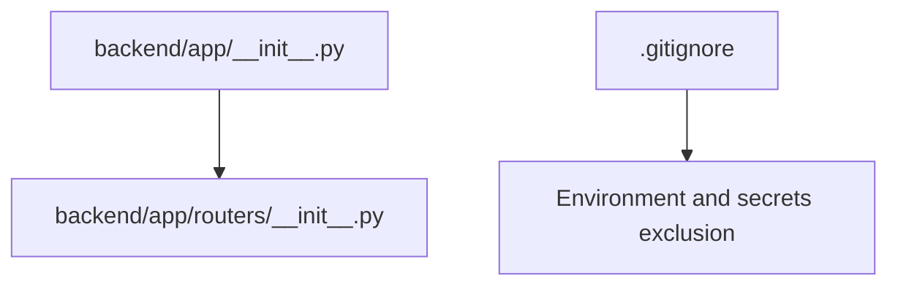

**Diagram sources**
- [backend/app/__init__.py](file://backend/app/__init__.py)
- [backend/app/routers/__init__.py](file://backend/app/routers/__init__.py)
- [.gitignore](file://.gitignore)

**Section sources**
- [backend/app/__init__.py](file://backend/app/__init__.py)
- [backend/app/routers/__init__.py](file://backend/app/routers/__init__.py)
- [.gitignore](file://.gitignore)

## Core Components
Given the current empty scaffolding, the following components should be implemented to provide robust authentication and security:

- Authentication providers
  - JWT-based authentication with short-lived access tokens and refresh tokens
  - Session-based authentication using secure cookies and server-side sessions
  - API key authentication for service-to-service calls
- Authorization engine
  - Role-based access control (RBAC) with roles and permissions
  - Permission checks at route and resource levels
- Security middleware
  - Request validation and sanitization
  - Rate limiting and throttling
  - CORS policy enforcement
  - HTTPS enforcement and HSTS headers
  - Common vulnerability protections (XSS, CSRF, SQL injection)
- Token management
  - Secure token issuance, rotation, and revocation
  - Token storage best practices (httpOnly, secure cookies; encrypted storage)
- Secrets management
  - Environment variables for secrets
  - Secret rotation and audit logging

[No sources needed since this section provides general guidance]

## Architecture Overview
A layered architecture ensures separation of concerns and consistent security enforcement across all endpoints.

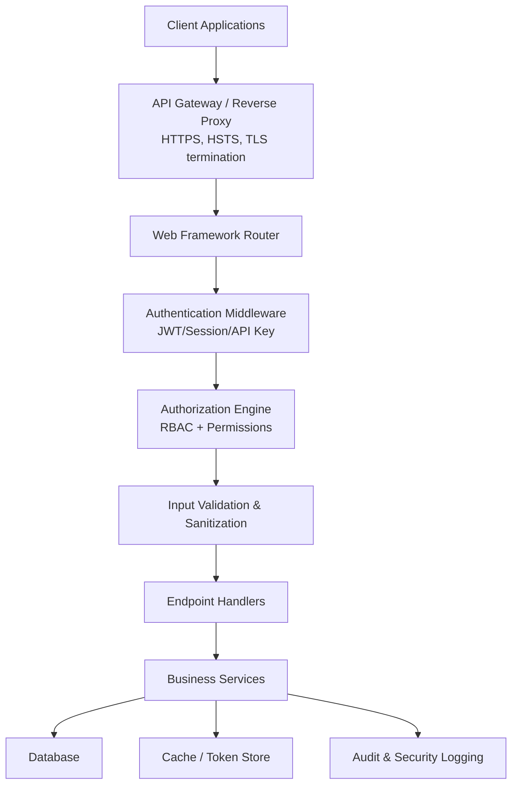

[No sources needed since this diagram shows conceptual workflow, not actual code structure]

## Detailed Component Analysis

### Authentication Patterns

#### JWT Tokens
- Issuance: Validate credentials, generate short-lived access tokens and longer-lived refresh tokens
- Storage: Access tokens in memory or httpOnly cookies; refresh tokens in secure storage
- Validation: Verify signature, expiration, issuer, audience, and scope
- Rotation: Rotate refresh tokens on use; revoke compromised tokens
- Revocation: Maintain a denylist or token versioning for immediate invalidation

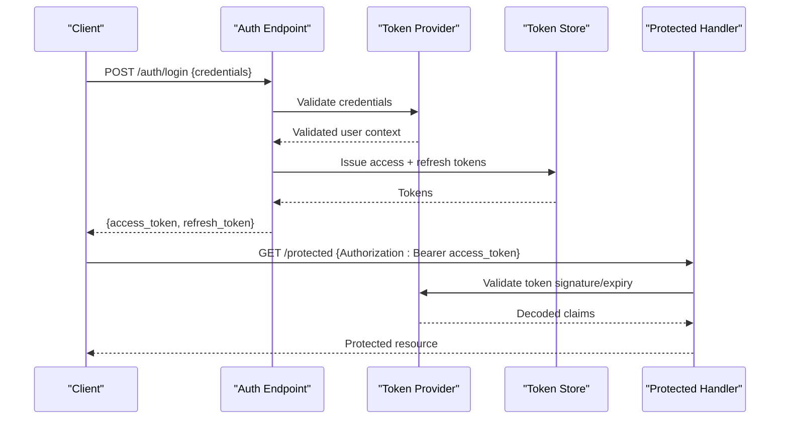

[No sources needed since this diagram shows conceptual workflow, not actual code structure]

#### Session-Based Authentication
- Server-side sessions stored securely (encrypted database or cache)
- Cookie flags: httpOnly, secure, sameSite=Strict/Lax
- Session lifecycle: creation, renewal, and invalidation
- Concurrency controls: single-session-per-user option with forced logout on concurrent login

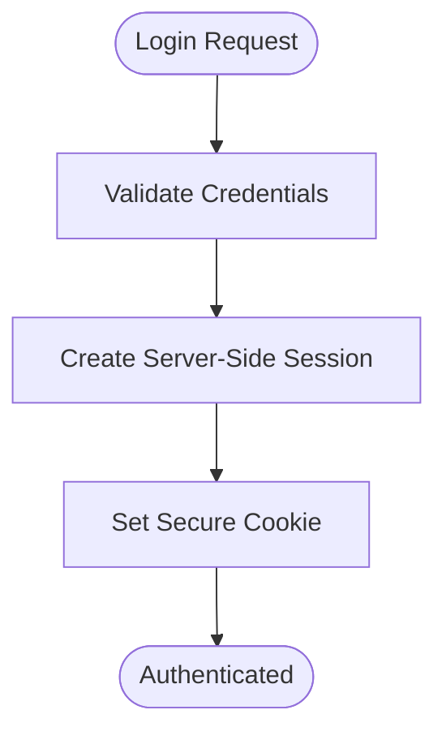

[No sources needed since this diagram shows conceptual workflow, not actual code structure]

#### API Key Authentication
- Generate unique keys per client/service with scopes and expiry
- Transmit via header (e.g., X-API-Key)
- Validate key existence, scope, and status
- Log usage for audit and anomaly detection

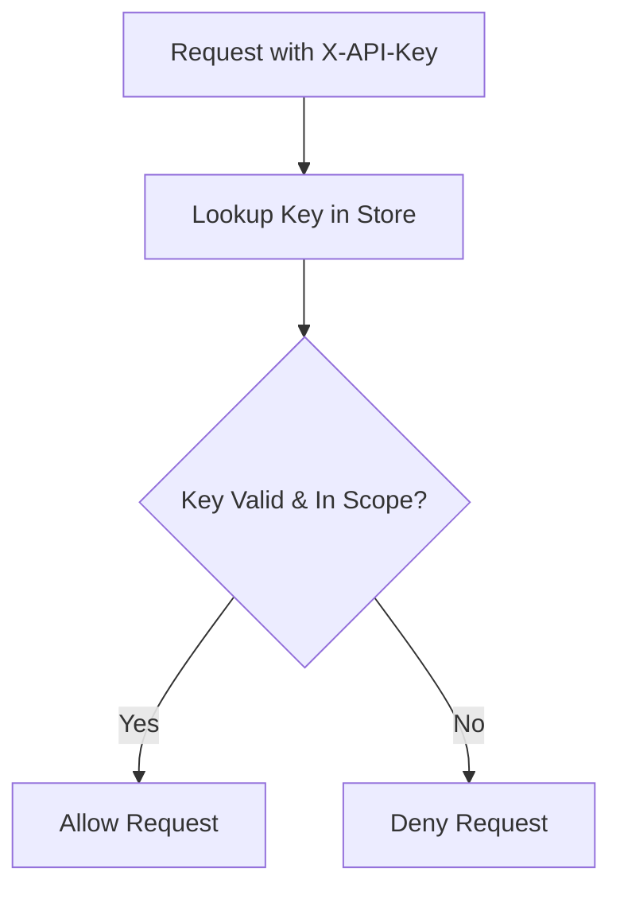

[No sources needed since this diagram shows conceptual workflow, not actual code structure]

### Authorization Mechanisms

#### Role-Based Access Control (RBAC)
- Roles define sets of permissions
- Users assigned to roles
- Endpoints protected by required roles or specific permissions

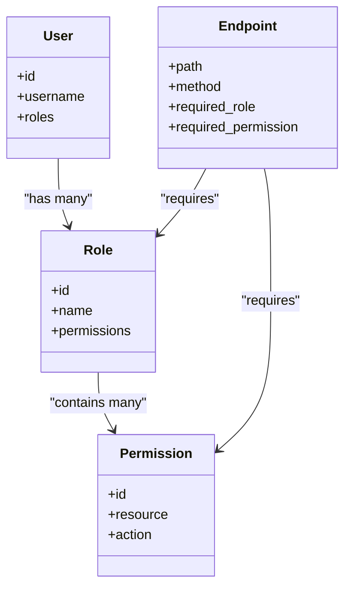

[No sources needed since this diagram shows conceptual workflow, not actual code structure]

#### Permission Management
- Fine-grained permissions at resource/action level
- Dynamic evaluation during request processing
- Audit logs for authorization decisions

[No sources needed since this section provides general guidance]

### Middleware Implementation

#### Security Checks
- Authentication verification (JWT/session/API key)
- Authorization checks (RBAC/permissions)
- Request origin validation and CORS checks

#### Input Validation and Sanitization
- Schema validation for request bodies and query parameters
- Type coercion and range checks
- Output encoding to prevent XSS
- Parameterized queries to prevent SQL injection

#### Request Sanitization
- Strip dangerous characters and tags
- Enforce content-type and size limits
- Normalize paths and reject traversal attempts

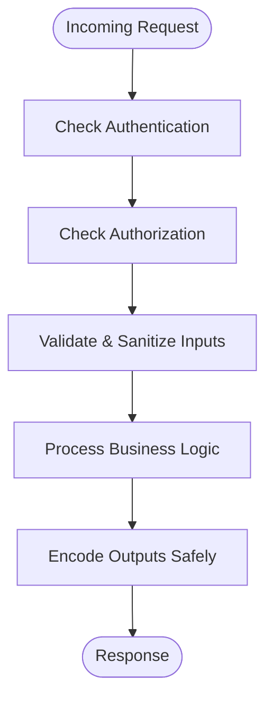

[No sources needed since this diagram shows conceptual workflow, not actual code structure]

### Security Best Practices

#### HTTPS Enforcement
- Enforce HTTPS at reverse proxy or application layer
- Configure HSTS headers
- Redirect HTTP to HTTPS

#### CORS Configuration
- Whitelist allowed origins, methods, and headers
- Use preflight caching judiciously
- Avoid wildcard origins in production

#### Rate Limiting
- Apply per-IP and per-user limits
- Use sliding windows or token buckets
- Return appropriate status codes and retry-after hints

#### Protection Against Common Vulnerabilities
- SQL Injection: parameterized queries, ORM usage, strict typing
- XSS: output encoding, CSP headers, safe HTML handling
- CSRF: anti-CSRF tokens for state-changing requests, SameSite cookies
- SSRF: validate URLs, allowlists, disable redirects where possible

[No sources needed since this section provides general guidance]

### Secure Endpoint Implementation Examples

#### Example: Protected Resource with JWT
- Require Authorization header with valid bearer token
- Decode and verify token claims
- Enforce role/permission requirements
- Return sanitized responses

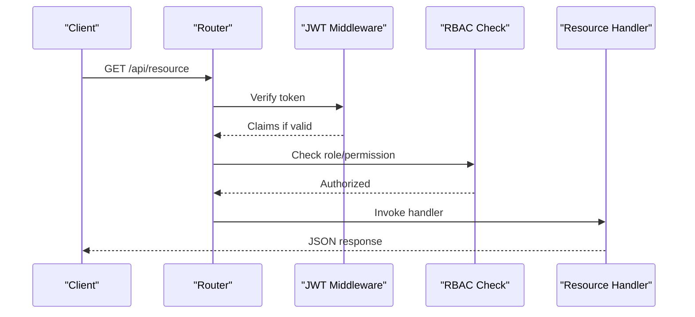

[No sources needed since this diagram shows conceptual workflow, not actual code structure]

#### Example: Login Flow with Refresh Tokens
- Validate credentials
- Issue access and refresh tokens
- Store refresh token securely
- Provide refresh endpoint

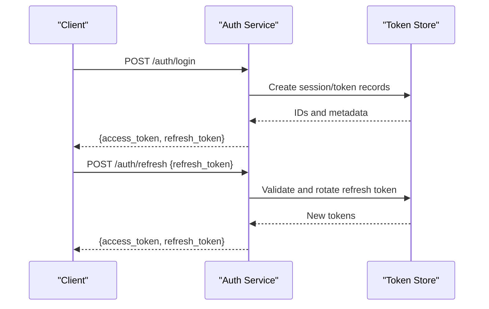

[No sources needed since this diagram shows conceptual workflow, not actual code structure]

#### Example: API Key Endpoint
- Read X-API-Key header
- Validate key and scope
- Proceed to handler if authorized

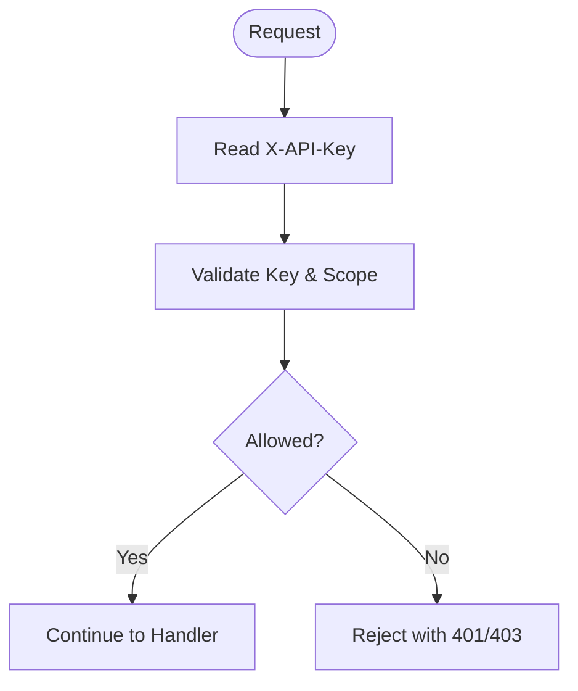

[No sources needed since this diagram shows conceptual workflow, not actual code structure]

## Dependency Analysis
At present, the backend app contains only initialization files without concrete dependencies. As you implement authentication and security, consider these dependency categories:

- Web framework routers and middleware
- Cryptographic libraries for JWT and hashing
- Database drivers and ORMs for sessions and tokens
- Cache systems for rate limiting and token stores
- Logging and monitoring for audit trails

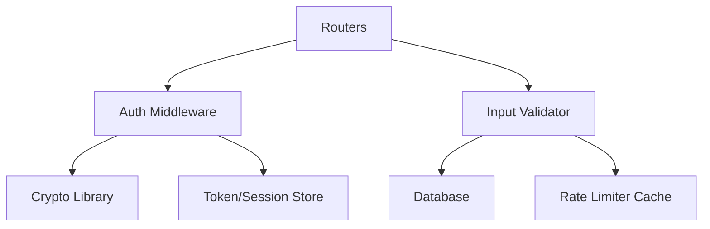

[No sources needed since this diagram shows conceptual workflow, not actual code structure]

## Performance Considerations
- Prefer stateless JWT validation with public key verification when possible
- Cache frequently accessed role/permission mappings
- Use efficient rate-limiting algorithms (token bucket)
- Minimize cryptographic operations by reusing verified contexts
- Batch token store lookups and leverage indexes

[No sources needed since this section provides general guidance]

## Troubleshooting Guide
Common issues and resolutions:
- Invalid token errors: check algorithm, secret/key, issuer, audience, and clock skew
- CORS failures: ensure exact origin match and correct headers/methods
- CSRF errors: verify token presence and validity on state-changing requests
- Rate limit hits: adjust thresholds and monitor client behavior
- Session loss: inspect cookie flags and domain/path settings

[No sources needed since this section provides general guidance]

## Conclusion
Implementing robust authentication and security requires a layered approach combining strong identity verification, fine-grained authorization, rigorous input validation, and proactive protections against common threats. Adopting the patterns and best practices outlined here will help ensure the GoNow API remains secure, scalable, and maintainable.

[No sources needed since this section summarizes without analyzing specific files]

## Appendices

### Configuration Checklist
- Enable HTTPS and HSTS
- Configure CORS allowlists
- Define roles and permissions matrix
- Set up secrets management and rotation
- Enable audit logging for auth/authz events

[No sources needed since this section provides general guidance]