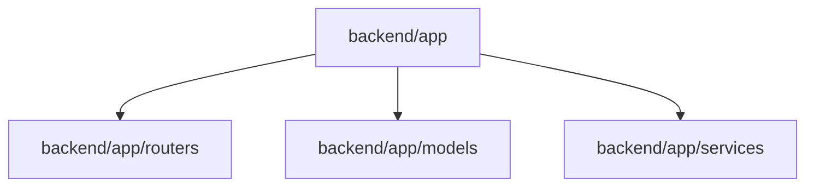
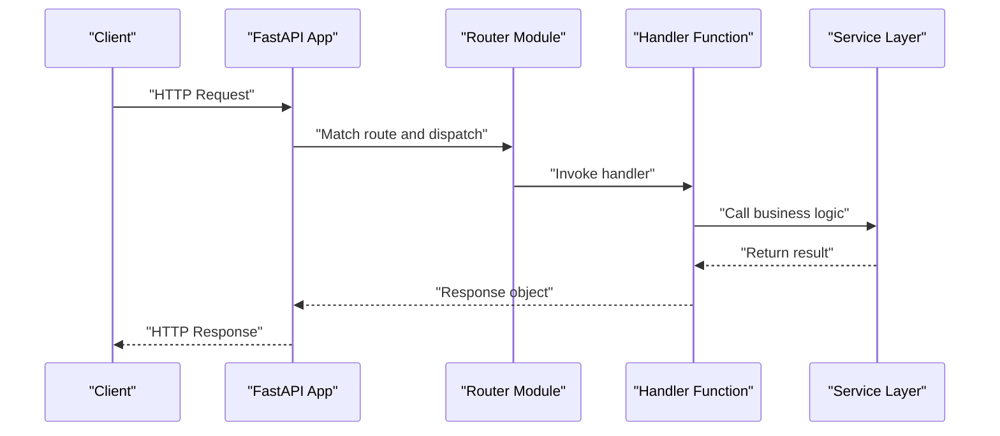
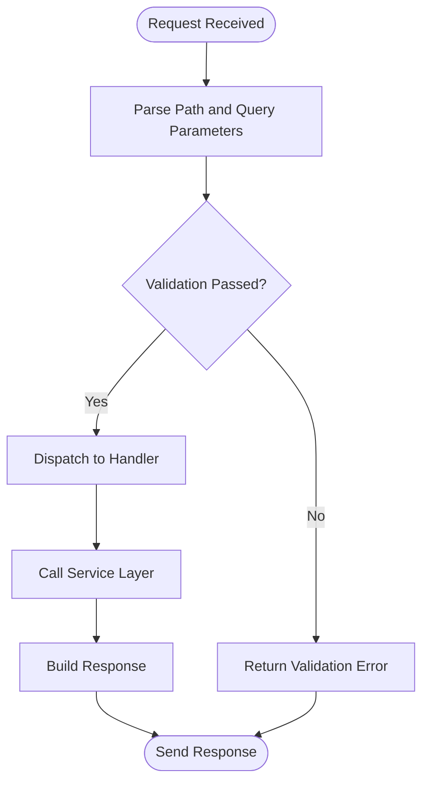
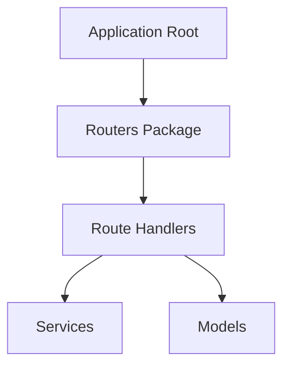

# Endpoint Creation

<cite>
**Referenced Files in This Document**
- [__init__.py](file://backend/app/__init__.py)
- [__init__.py](file://backend/app/routers/__init__.py)
</cite>

## Table of Contents
1. [Introduction](#introduction)
2. [Project Structure](#project-structure)
3. [Core Components](#core-components)
4. [Architecture Overview](#architecture-overview)
5. [Detailed Component Analysis](#detailed-component-analysis)
6. [Dependency Analysis](#dependency-analysis)
7. [Performance Considerations](#performance-considerations)
8. [Troubleshooting Guide](#troubleshooting-guide)
9. [Conclusion](#conclusion)

## Introduction
This document explains how to create API endpoints in the router layer for this project. It covers endpoint definition, HTTP method mapping (GET, POST, PUT, DELETE), URL pattern design, handler organization, and resource-based grouping. It also provides naming conventions, best practices for URL structure, and guidance on path and query parameters.

Note: The repository currently contains only Python package init files under backend/app and backend/app/routers. There are no Go files present; therefore, this guide is written for a Python FastAPI-style router layer that matches the observed directory layout.

## Project Structure
The relevant parts of the project for routing are:
- backend/app: Application root package
- backend/app/routers: Package where route modules should live

**Diagram sources**
- [__init__.py](file://backend/app/__init__.py)
- [__init__.py](file://backend/app/routers/__init__.py)

**Section sources**
- [__init__.py](file://backend/app/__init__.py)
- [__init__.py](file://backend/app/routers/__init__.py)

## Core Components
- Router package: backend/app/routers is the designated place to define route modules and group endpoints by resource.
- App package: backend/app is the application root where routers are typically mounted.

At this time, both __init__.py files are empty placeholders. You will add your route definitions inside this package structure.

**Section sources**
- [__init__.py](file://backend/app/__init__.py)
- [__init__.py](file://backend/app/routers/__init__.py)

## Architecture Overview
A typical router-layer architecture organizes endpoints by resource and mounts them into the main app. The following diagram shows a conceptual flow from client request to handler execution.

[No sources needed since this diagram shows conceptual workflow, not actual code structure]

## Detailed Component Analysis

### Defining Endpoints and HTTP Methods
- Use a router module under backend/app/routers to define endpoints per resource.
- Map HTTP methods to handlers:
  - GET: Retrieve resources or lists
  - POST: Create new resources
  - PUT: Fully update a resource
  - DELETE: Remove a resource
- Each handler receives the incoming request context and returns a response.

Guidelines:
- Keep handlers small and delegate to services for business logic.
- Validate inputs at the boundary (path/query/body).
- Return consistent response shapes and status codes.

**Section sources**
- [__init__.py](file://backend/app/routers/__init__.py)

### URL Pattern Design and Path Parameters
- Use clear, noun-based paths for resources: /users, /orders, /items.
- Use singular nouns for individual resources with an identifier: /users/{user_id}.
- Nest related resources when appropriate: /users/{user_id}/orders.
- Avoid verbs in URLs; use HTTP methods to express actions.

Path parameters:
- Define typed path parameters in the route signature.
- Validate constraints (e.g., integer IDs, UUIDs).

Query parameters:
- Use query strings for filtering, pagination, sorting, and search.
- Provide defaults and validation rules.

**Section sources**
- [__init__.py](file://backend/app/routers/__init__.py)

### Organizing Endpoints by Resource
- Create one router file per major resource (for example, users.py, orders.py).
- Group related endpoints together within each file.
- Mount each router under a common prefix at the app level (for example, /api/v1/users).

Benefits:
- Improves discoverability and maintainability.
- Encourages separation of concerns.

**Section sources**
- [__init__.py](file://backend/app/routers/__init__.py)

### RESTful Resource Patterns
Common patterns:
- List all items: GET /items
- Get one item: GET /items/{item_id}
- Create an item: POST /items
- Update an item: PUT /items/{item_id}
- Delete an item: DELETE /items/{item_id}

Nested resources:
- GET /users/{user_id}/orders
- POST /users/{user_id}/orders

**Section sources**
- [__init__.py](file://backend/app/routers/__init__.py)

### Naming Conventions and Best Practices
- URL paths: lowercase, hyphenated nouns; avoid verbs.
- Path parameters: snake_case or kebab-case consistently; prefer identifiers like user_id or order_id.
- Query parameters: pluralized and descriptive (for example, page_size, sort_by).
- Versioning: include version in the base path (for example, /api/v1/...).
- Consistency: apply the same style across all routers.

**Section sources**
- [__init__.py](file://backend/app/routers/__init__.py)

### Example Workflows

#### Basic CRUD Endpoints
- Implement list, get-by-id, create, update, and delete for a resource.
- Use path parameters for single-resource operations.
- Use query parameters for filtering and pagination.

[No sources needed since this diagram shows conceptual workflow, not actual code structure]

#### Handling Different HTTP Methods
- GET: Read-only; ensure idempotency and caching-friendly responses.
- POST: Create; return created resource and 201 status when applicable.
- PUT: Full update; validate complete payload.
- DELETE: Remove; return appropriate success status.

**Section sources**
- [__init__.py](file://backend/app/routers/__init__.py)

#### Endpoint Grouping Strategy
- Group by domain resource (users, orders, products).
- Mount routers under a shared prefix (for example, /api/v1).
- Keep cross-cutting concerns (auth, logging) outside of route handlers.

**Section sources**
- [__init__.py](file://backend/app/routers/__init__.py)

## Dependency Analysis
At this stage, the router package exists but has no implementation files yet. When you add route modules, they will depend on:
- The application framework (for example, FastAPI)
- Services for business logic
- Models for data structures

[No sources needed since this diagram shows conceptual relationships, not actual code structure]

## Performance Considerations
- Keep handlers thin; offload work to services.
- Validate early to fail fast.
- Use pagination and field selection for large collections.
- Cache read-heavy endpoints where appropriate.
- Avoid N+1 queries by batching database calls in services.

[No sources needed since this section provides general guidance]

## Troubleshooting Guide
- 404 Not Found: Check route prefixes and mounting points.
- 405 Method Not Allowed: Ensure the correct HTTP method is used for the route.
- 422 Validation Error: Inspect path/query/body parameter types and constraints.
- 500 Internal Server Error: Review service-layer exceptions and error handling.

[No sources needed since this section provides general guidance]

## Conclusion
Use the backend/app/routers package to organize endpoints by resource, follow RESTful conventions, and keep handlers focused on routing and validation while delegating business logic to services. Apply consistent naming, clear URL patterns, and proper grouping to maintain a scalable and readable API surface.