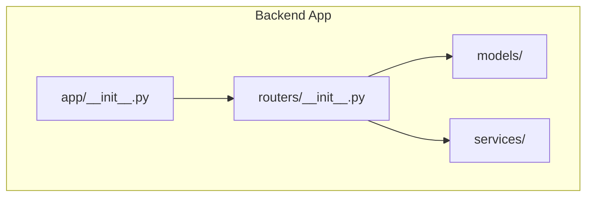
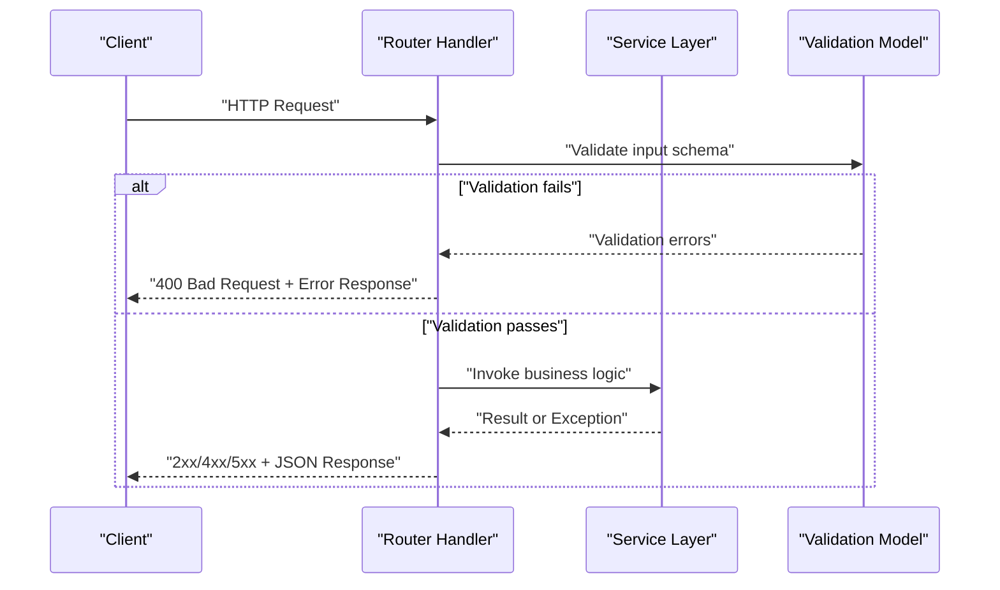
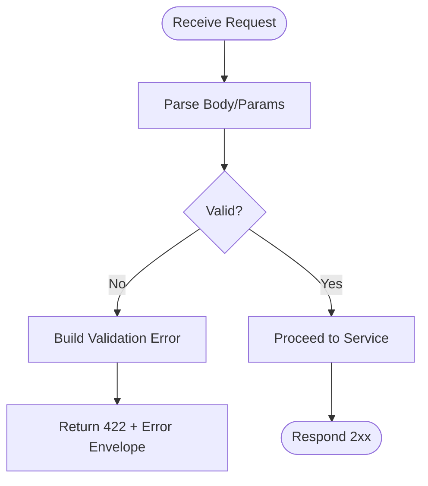
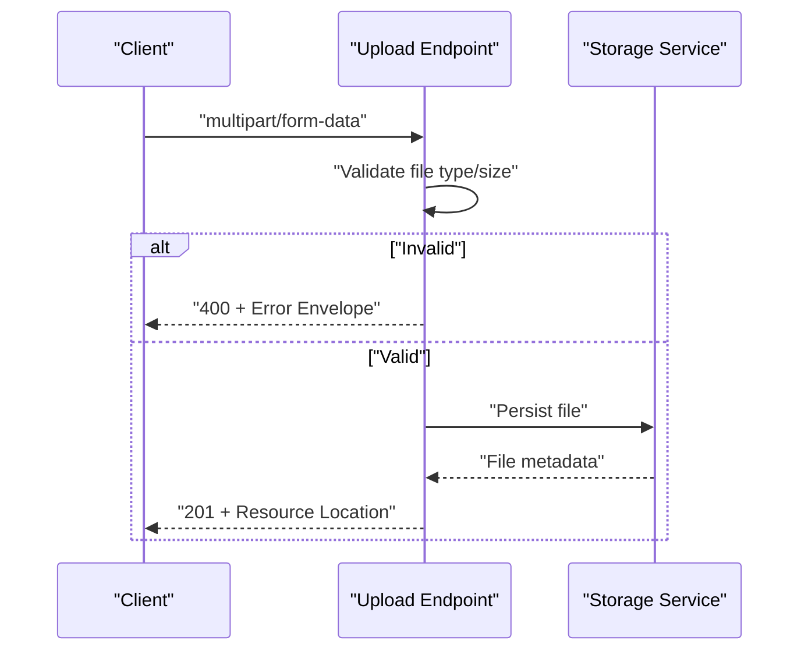
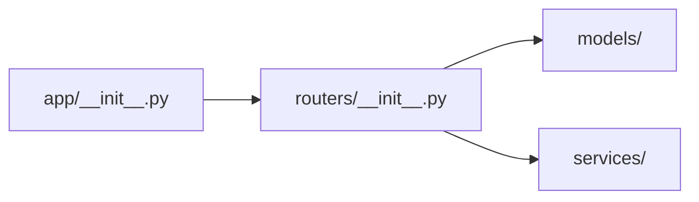

# Request/Response Handling

<cite>
**Referenced Files in This Document**
- [__init__.py](file://backend/app/__init__.py)
- [__init__.py](file://backend/app/routers/__init__.py)
</cite>

## Table of Contents
1. [Introduction](#introduction)
2. [Project Structure](#project-structure)
3. [Core Components](#core-components)
4. [Architecture Overview](#architecture-overview)
5. [Detailed Component Analysis](#detailed-component-analysis)
6. [Dependency Analysis](#dependency-analysis)
7. [Performance Considerations](#performance-considerations)
8. [Troubleshooting Guide](#troubleshooting-guide)
9. [Conclusion](#conclusion)

## Introduction
This document explains how request and response handling should be implemented for the GoNow API endpoints. It covers parsing and validating incoming requests, supporting multiple content types (JSON, form data, file uploads), extracting parameters, formatting responses, using status codes consistently, and producing standardized error responses. It also provides guidance on performance optimization for request processing and response generation.

## Project Structure
The repository contains a backend application with Python package scaffolding under backend/app. The current visible structure includes:
- backend/app/__init__.py
- backend/app/routers/__init__.py

These files indicate a modular layout where routers will define endpoint handlers and services/models will encapsulate business logic. The actual handler implementations are not present in the provided snapshot; therefore, this document provides implementation guidance aligned with common Python web frameworks (e.g., FastAPI/Starlette or Flask).

**Diagram sources**
- [__init__.py](file://backend/app/__init__.py)
- [__init__.py](file://backend/app/routers/__init__.py)

**Section sources**
- [__init__.py](file://backend/app/__init__.py)
- [__init__.py](file://backend/app/routers/__init__.py)

## Core Components
- Routers: Define HTTP routes and endpoint functions that parse requests, validate inputs, call services, and return responses.
- Services: Encapsulate business logic invoked by routers.
- Models: Represent domain entities and validation schemas.

Recommended responsibilities:
- Routers handle I/O concerns: reading headers, body, files, query/path parameters, and constructing responses.
- Services perform computations and interact with external systems.
- Models provide typed structures and validation rules.

[No sources needed since this section provides general guidance]

## Architecture Overview
A typical request/response flow:
- Client sends an HTTP request to an endpoint.
- Router parses and validates the request (headers, path/query/body/form/files).
- Router calls service(s) to process business logic.
- Service returns results or raises errors.
- Router formats a response with appropriate status code and serialization.
- Middleware may add cross-cutting concerns (logging, metrics, CORS).

[No sources needed since this diagram shows conceptual workflow, not actual code structure]

## Detailed Component Analysis

### Request Parsing and Validation
- Content-Type handling:
  - application/json: Parse JSON body into typed models.
  - multipart/form-data: Parse form fields and files.
  - application/x-www-form-urlencoded: Parse key-value pairs.
- Parameter extraction:
  - Path parameters from route patterns.
  - Query parameters via query string parsing.
  - Headers via header accessors.
- Validation:
  - Use schema-based validation to enforce required fields, types, ranges, and constraints.
  - Return structured validation errors when invalid.

Best practices:
- Validate early and fail fast.
- Normalize inputs (trim strings, coerce types).
- Reject unknown fields if strict mode is desired.

[No sources needed since this section provides general guidance]

### Handling Different Content Types
- JSON:
  - Read raw bytes, decode, parse into model instances.
  - Handle malformed JSON with clear error messages.
- Form Data:
  - Extract text fields and binary files separately.
  - Enforce file size limits and allowed MIME types.
- File Uploads:
  - Stream large files to disk or storage.
  - Compute checksums if required.
  - Sanitize filenames and paths.

[No sources needed since this section provides general guidance]

### Response Formatting and Status Codes
- Success responses:
  - Use 200 OK for standard retrieval/update.
  - Use 201 Created for resource creation.
  - Use 204 No Content for successful operations without payload.
- Client errors:
  - 400 Bad Request for validation failures.
  - 401 Unauthorized for missing/invalid authentication.
  - 403 Forbidden for insufficient permissions.
  - 404 Not Found for missing resources.
  - 409 Conflict for duplicate or conflicting state.
  - 422 Unprocessable Entity for semantic validation errors.
- Server errors:
  - 500 Internal Server Error for unexpected exceptions.
  - 502/503 for upstream failures or maintenance.

Response body:
- Consistent envelope for success and error payloads.
- Include correlation IDs for tracing.
- Avoid leaking stack traces or internal details.

[No sources needed since this section provides general guidance]

### Error Responses and Serialization
Standardized error envelope:
- Fields:
  - code: machine-readable error code.
  - message: human-readable description.
  - details: optional context (e.g., field-level validation errors).
  - trace_id: request identifier for debugging.
- Examples:
  - Validation failure returns 422 with field-specific details.
  - Authentication failure returns 401 with minimal details.
  - Business rule violation returns 409 with explanation.

Serialization:
- Ensure deterministic JSON output.
- Omit null fields unless necessary.
- Use ISO 8601 for timestamps.

[No sources needed since this section provides general guidance]

### Header Processing
- Accept and Content-Type negotiation.
- Authorization and API keys.
- Rate limiting and quota headers.
- CORS headers for cross-origin requests.
- Cache control and ETag support.

[No sources needed since this section provides general guidance]

### Example Workflows

#### Request Validation Flow

[No sources needed since this diagram shows conceptual workflow, not actual code structure]

#### File Upload Flow

[No sources needed since this diagram shows conceptual workflow, not actual code structure]

**Section sources**
- [__init__.py](file://backend/app/__init__.py)
- [__init__.py](file://backend/app/routers/__init__.py)

## Dependency Analysis
Given the current repository snapshot, only package initialization files are visible. The dependency graph reflects module organization rather than runtime imports.

**Diagram sources**
- [__init__.py](file://backend/app/__init__.py)
- [__init__.py](file://backend/app/routers/__init__.py)

**Section sources**
- [__init__.py](file://backend/app/__init__.py)
- [__init__.py](file://backend/app/routers/__init__.py)

## Performance Considerations
- Streaming:
  - Stream large request bodies and responses to reduce memory usage.
- Validation:
  - Use efficient schema validators; avoid heavy transformations during validation.
- Serialization:
  - Prefer compact JSON encoders; disable pretty printing in production.
- Connection pooling:
  - Reuse database and HTTP client connections.
- Caching:
  - Apply cache headers and server-side caching for idempotent reads.
- Concurrency:
  - Use async handlers where possible; offload CPU-bound work to workers.
- Backpressure:
  - Implement rate limiting and request timeouts.

[No sources needed since this section provides general guidance]

## Troubleshooting Guide
Common issues and resolutions:
- Malformed JSON:
  - Return 400 with a clear message indicating expected format.
- Missing required fields:
  - Return 422 with field-level details.
- Invalid file upload:
  - Return 400 with allowed types/sizes.
- Authentication failures:
  - Return 401 with minimal details; log securely.
- Upstream failures:
  - Return 502/503 with retry-after when applicable.
- Logging and tracing:
  - Attach correlation IDs to all logs and responses.
  - Capture request IDs and relevant context without sensitive data.

[No sources needed since this section provides general guidance]

## Conclusion
Adopting consistent request parsing, robust validation, standardized error envelopes, and thoughtful response formatting improves reliability and developer experience. Organize code into routers, services, and models to maintain separation of concerns. Optimize for streaming, efficient serialization, and concurrency to meet performance goals.

[No sources needed since this section summarizes without analyzing specific files]