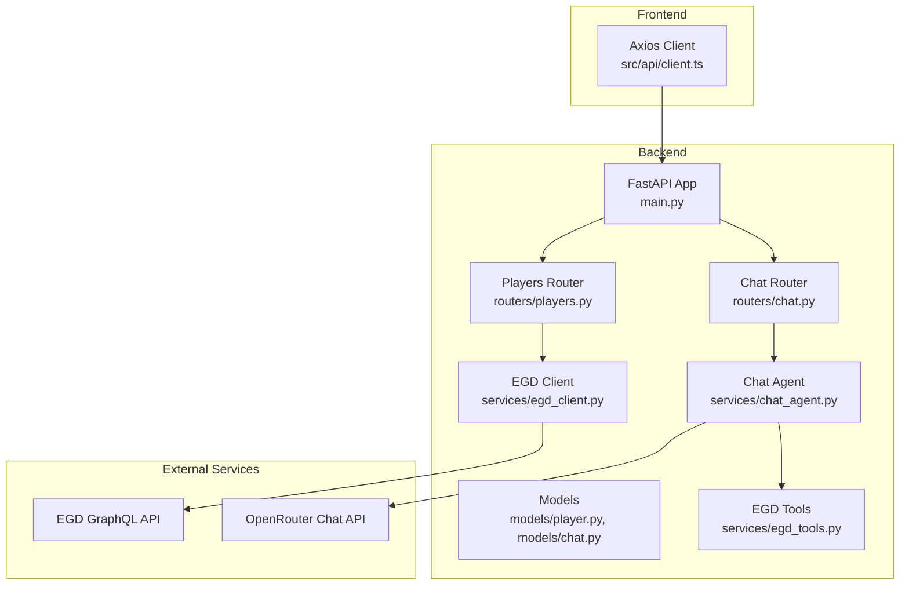
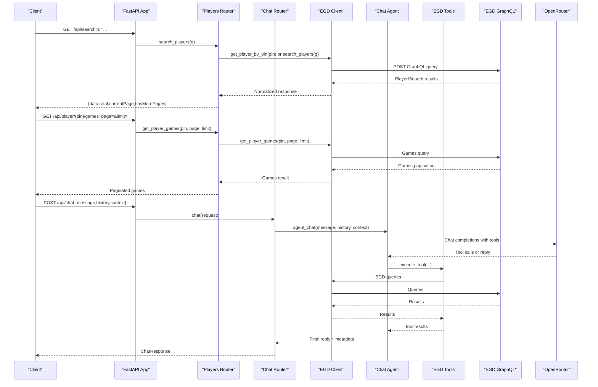
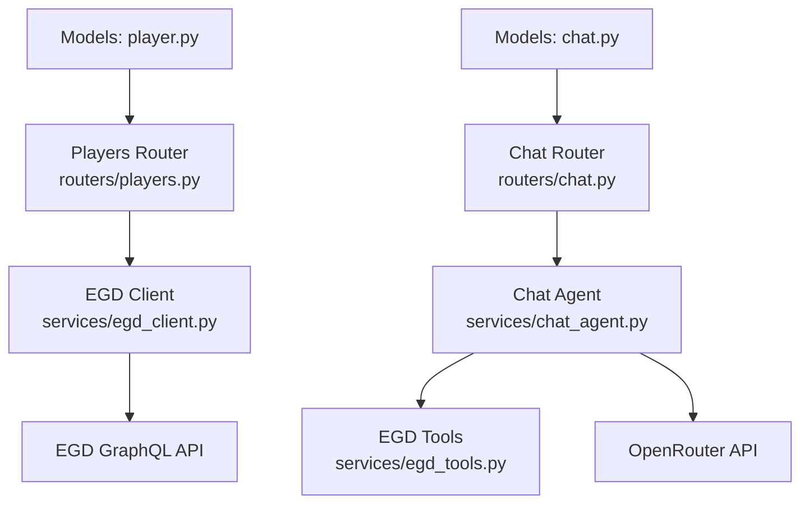

# API Reference

<cite>
**Referenced Files in This Document**
- [main.py](file://backend/app/main.py)
- [players.py](file://backend/app/routers/players.py)
- [chat.py](file://backend/app/routers/chat.py)
- [player.py](file://backend/app/models/player.py)
- [chat.py (models)](file://backend/app/models/chat.py)
- [egd_client.py](file://backend/app/services/egd_client.py)
- [chat_agent.py](file://backend/app/services/chat_agent.py)
- [egd_tools.py](file://backend/app/services/egd_tools.py)
- [client.ts](file://frontend/src/api/client.ts)
- [EGD_API.md](file://docs/EGD_API.md)
</cite>

## Table of Contents
1. [Introduction](#introduction)
2. [Project Structure](#project-structure)
3. [Core Components](#core-components)
4. [Architecture Overview](#architecture-overview)
5. [Detailed Component Analysis](#detailed-component-analysis)
6. [Dependency Analysis](#dependency-analysis)
7. [Performance Considerations](#performance-considerations)
8. [Troubleshooting Guide](#troubleshooting-guide)
9. [Conclusion](#conclusion)
10. [Appendices](#appendices)

## Introduction
This document provides comprehensive API documentation for the GoNow backend REST endpoints. It covers player search, profile retrieval, game history, tournament data, and chat functionality. For each endpoint, you will find HTTP methods, URL patterns, request/response schemas, authentication requirements, parameter validation rules, error codes, and example requests/responses. Client implementation guidelines and common use cases are also included to help integrate quickly.

## Project Structure
The backend is a FastAPI application with modular routers for players and chat, Pydantic models for request/response validation, and services that call external APIs (European Go Database GraphQL and OpenRouter). The frontend includes a TypeScript client demonstrating usage.

**Diagram sources**
- [main.py:14-31](file://backend/app/main.py#L14-L31)
- [players.py:1-107](file://backend/app/routers/players.py#L1-L107)
- [chat.py:1-95](file://backend/app/routers/chat.py#L1-L95)
- [player.py:1-60](file://backend/app/models/player.py#L1-L60)
- [chat.py (models):1-21](file://backend/app/models/chat.py#L1-L21)
- [egd_client.py:1-197](file://backend/app/services/egd_client.py#L1-L197)
- [chat_agent.py:1-154](file://backend/app/services/chat_agent.py#L1-L154)
- [egd_tools.py:1-212](file://backend/app/services/egd_tools.py#L1-L212)
- [client.ts:1-86](file://frontend/src/api/client.ts#L1-L86)

**Section sources**
- [main.py:14-31](file://backend/app/main.py#L14-L31)
- [players.py:1-107](file://backend/app/routers/players.py#L1-L107)
- [chat.py:1-95](file://backend/app/routers/chat.py#L1-L95)
- [client.ts:1-86](file://frontend/src/api/client.ts#L1-L86)

## Core Components
- Players API: Search players by name or PIN; retrieve player details with rating history; fetch paginated game history; list tournaments derived from placements.
- Chat API: Send messages to an AI assistant with optional conversation history and context; supports agentic tool calling via OpenRouter.
- Data Models: Pydantic models define request/response structures for chat and player-related responses.
- External Integrations: EGD GraphQL client with caching; OpenRouter proxy and agentic loop with function calling.

Key responsibilities:
- Routers handle HTTP endpoints, validate parameters, and return structured JSON.
- Services encapsulate business logic and external calls.
- Models enforce schema validation and provide type safety.

**Section sources**
- [players.py:1-107](file://backend/app/routers/players.py#L1-L107)
- [chat.py:1-95](file://backend/app/routers/chat.py#L1-L95)
- [player.py:1-60](file://backend/app/models/player.py#L1-L60)
- [chat.py (models):1-21](file://backend/app/models/chat.py#L1-L21)
- [egd_client.py:1-197](file://backend/app/services/egd_client.py#L1-L197)
- [chat_agent.py:1-154](file://backend/app/services/chat_agent.py#L1-L154)
- [egd_tools.py:1-212](file://backend/app/services/egd_tools.py#L1-L212)

## Architecture Overview
The GoNow API exposes REST endpoints that orchestrate calls to the European Go Database (EGD) GraphQL API and optionally to OpenRouter for AI-powered chat. The architecture emphasizes separation of concerns: routers for HTTP handling, services for integration, and models for validation.

**Diagram sources**
- [players.py:8-106](file://backend/app/routers/players.py#L8-L106)
- [chat.py:9-94](file://backend/app/routers/chat.py#L9-L94)
- [egd_client.py:44-177](file://backend/app/services/egd_client.py#L44-L177)
- [chat_agent.py:30-153](file://backend/app/services/chat_agent.py#L30-L153)
- [egd_tools.py:102-212](file://backend/app/services/egd_tools.py#L102-L212)

## Detailed Component Analysis

### Authentication and CORS
- Authentication: No authentication is required for these REST endpoints.
- CORS: The app allows requests from localhost origins used by the frontend.

Example health check:
- Method: GET
- Path: /health
- Response: {"status": "ok"}

Root endpoint:
- Method: GET
- Path: /
- Response: {"message": "GoNow API is running", "docs": "/docs"}

**Section sources**
- [main.py:20-41](file://backend/app/main.py#L20-L41)

### Player Search
- Method: GET
- Path: /api/search
- Query Parameters:
  - q: string, required, min_length=1
- Behavior:
  - If q is numeric, attempts direct PIN lookup first; otherwise performs name search.
- Request Example:
  - GET /api/search?q=Zhan%20Shi
- Response Schema:
  - data: array of player summaries
  - total: integer
  - currentPage: integer
  - hasMorePages: boolean
- Error Codes:
  - 500: Internal server error if underlying service fails

Notes:
- Numeric input triggers direct PIN lookup; non-numeric triggers name search.
- Pagination fields are provided even for single-PIN lookups.

**Section sources**
- [players.py:8-40](file://backend/app/routers/players.py#L8-L40)
- [egd_client.py:44-70](file://backend/app/services/egd_client.py#L44-L70)

### Player Profile Retrieval
- Method: GET
- Path: /api/player/{pin}
- Path Parameters:
  - pin: integer, required
- Response Schema:
  - All player fields plus rating_history array sorted by date
  - rating_history entries include date, tournament, city, nation, placement, grade, rating_before, rating_after, won, lost, jigo
- Error Codes:
  - 404: Player not found
  - 500: Internal server error

Notes:
- Rating history is extracted from placements and normalized for charting.

**Section sources**
- [players.py:43-80](file://backend/app/routers/players.py#L43-L80)
- [egd_client.py:72-118](file://backend/app/services/egd_client.py#L72-L118)

### Player Game History
- Method: GET
- Path: /api/player/{pin}/games
- Path Parameters:
  - pin: integer, required
- Query Parameters:
  - page: integer, default=1, minimum=1
  - limit: integer, default=50, range 1..200
- Response Schema:
  - data: array of games
  - total: integer
  - currentPage: integer
  - hasMorePages: boolean
- Error Codes:
  - 500: Internal server error

Notes:
- Games are ordered by date descending.
- Limit is enforced up to 200.

**Section sources**
- [players.py:83-94](file://backend/app/routers/players.py#L83-L94)
- [egd_client.py:120-150](file://backend/app/services/egd_client.py#L120-L150)

### Player Tournament History
- Method: GET
- Path: /api/player/{pin}/tournaments
- Path Parameters:
  - pin: integer, required
- Response Schema:
  - data: array of tournament objects
  - total: integer
- Error Codes:
  - 500: Internal server error

Notes:
- Tournaments are deduplicated by code and sorted by date.
- Fields include code, description, date, city, nation, placement, grade_declared, won, lost, jigo, rating_before, rating_after.

**Section sources**
- [players.py:97-106](file://backend/app/routers/players.py#L97-L106)
- [egd_client.py:152-177](file://backend/app/services/egd_client.py#L152-L177)

### Chat API
- Method: POST
- Path: /api/chat
- Request Body:
  - message: string, required
  - context: string, optional (e.g., current player data context)
  - history: array of ChatMessage objects, optional
    - role: "user" | "assistant"
    - content: string
- Response Schema:
  - reply: string
  - model: string | null
  - tool_calls: array of strings | null
- Error Codes:
  - 500: Chat error if LLM or tool execution fails

Behavior:
- If OpenRouter key is missing, returns a configured fallback reply.
- Supports agentic tool calling: the assistant may request functions to query EGD data.

Notes:
- History is truncated to last 10 messages internally.
- Max iterations for tool-calling loops can be configured via environment variables.

**Section sources**
- [chat.py:9-24](file://backend/app/routers/chat.py#L9-L24)
- [chat.py (models):11-21](file://backend/app/models/chat.py#L11-L21)
- [chat_agent.py:30-153](file://backend/app/services/chat_agent.py#L30-L153)
- [egd_tools.py:102-212](file://backend/app/services/egd_tools.py#L102-L212)

### Data Models
- Player Summary:
  - pin: int
  - firstName: string
  - lastName: string
  - countryCode: string
  - grade: string
  - rating: int | null
  - club: string | null
  - totalTournaments: int | null
  - lastAppearance: string | null
- Search Response:
  - data: array of PlayerSummary
  - total: int
  - currentPage: int
  - hasMorePages: bool
- Chat Message:
  - role: "user" | "assistant"
  - content: string
- Chat Request:
  - message: string
  - context: string | null
  - history: array of ChatMessage | null
- Chat Response:
  - reply: string
  - model: string | null
  - tool_calls: array of string | null

**Section sources**
- [player.py:6-60](file://backend/app/models/player.py#L6-L60)
- [chat.py (models):6-21](file://backend/app/models/chat.py#L6-L21)

### Client Implementation Guidelines
- Base URL: http://localhost:8000/api
- Endpoints:
  - GET /search?q=...
  - GET /player/{pin}
  - GET /player/{pin}/games?page=1&limit=50
  - GET /player/{pin}/tournaments
  - POST /chat with body {message, context?, history?}
- Example usage (TypeScript/Axios):
  - searchPlayers(query) -> SearchResponse
  - getPlayer(pin) -> PlayerDetail
  - getPlayerTournaments(pin) -> {data,total}
  - sendChatMessage(message, context?, history?) -> ChatResponse

Notes:
- Ensure CORS is allowed for your frontend origin when running locally.
- Handle errors gracefully; most failures return 500 with a detail field.

**Section sources**
- [client.ts:1-86](file://frontend/src/api/client.ts#L1-L86)

## Dependency Analysis
The following diagram shows how components depend on each other and external services.

**Diagram sources**
- [players.py:1-107](file://backend/app/routers/players.py#L1-L107)
- [chat.py:1-95](file://backend/app/routers/chat.py#L1-L95)
- [egd_client.py:1-197](file://backend/app/services/egd_client.py#L1-L197)
- [chat_agent.py:1-154](file://backend/app/services/chat_agent.py#L1-L154)
- [egd_tools.py:1-212](file://backend/app/services/egd_tools.py#L1-L212)
- [player.py:1-60](file://backend/app/models/player.py#L1-L60)
- [chat.py (models):1-21](file://backend/app/models/chat.py#L1-L21)

**Section sources**
- [players.py:1-107](file://backend/app/routers/players.py#L1-L107)
- [chat.py:1-95](file://backend/app/routers/chat.py#L1-L95)
- [egd_client.py:1-197](file://backend/app/services/egd_client.py#L1-L197)
- [chat_agent.py:1-154](file://backend/app/services/chat_agent.py#L1-L154)
- [egd_tools.py:1-212](file://backend/app/services/egd_tools.py#L1-L212)
- [player.py:1-60](file://backend/app/models/player.py#L1-L60)
- [chat.py (models):1-21](file://backend/app/models/chat.py#L1-L21)

## Performance Considerations
- EGD Client Caching:
  - In-memory cache with TTL of 300 seconds reduces repeated GraphQL calls.
  - Cache keys combine query text and variables.
- Rate Limiting:
  - No explicit rate limiting is implemented at the API layer.
  - Consider adding middleware (e.g., slowapi) to protect against abuse.
- Pagination Limits:
  - Game history limits capped at 200 to prevent large payloads.
- Timeouts:
  - HTTP clients use timeouts (e.g., 30s for EGD, 60s for OpenRouter) to avoid hanging requests.

[No sources needed since this section provides general guidance]

## Troubleshooting Guide
Common issues and resolutions:
- 404 Not Found:
  - Occurs when requesting a player PIN that does not exist.
  - Verify the PIN and ensure it matches EGD records.
- 500 Internal Server Error:
  - May occur due to network errors, invalid EGD responses, or OpenRouter configuration issues.
  - Check logs for detailed error messages.
- Chat Not Configured:
  - If OPENROUTER_API_KEY is missing, chat returns a fallback message.
  - Add the key to the backend .env file.
- CORS Errors:
  - Ensure your frontend origin is allowed in CORS settings.
  - Update allow_origins in the app configuration if necessary.

**Section sources**
- [players.py:43-80](file://backend/app/routers/players.py#L43-L80)
- [chat.py:9-24](file://backend/app/routers/chat.py#L9-L24)
- [main.py:20-27](file://backend/app/main.py#L20-L27)

## Conclusion
The GoNow API provides straightforward REST endpoints for searching players, retrieving profiles and histories, and interacting with an AI assistant. It integrates with the European Go Database via GraphQL and offers optional agentic capabilities through OpenRouter. Clients should implement pagination, handle errors, and respect parameter constraints. Adding rate limiting and robust logging will improve reliability and security.

[No sources needed since this section summarizes without analyzing specific files]

## Appendices

### Parameter Validation Rules
- Search query q:
  - Required, string, min_length=1
- Player games pagination:
  - page: integer, ge=1
  - limit: integer, ge=1, le=200

**Section sources**
- [players.py:8-10](file://backend/app/routers/players.py#L8-L10)
- [players.py:84-88](file://backend/app/routers/players.py#L84-L88)

### Example Requests and Responses

- Search Players
  - Request: GET /api/search?q=Zhan%20Shi
  - Response:
    - {
        "data": [{ "pin": ..., "firstName": "...", "lastName": "...", "countryCode": "...", "grade": "...", "rating": ..., "club": "...", "totalTournaments": ..., "lastAppearance": "..." }],
        "total": 123,
        "currentPage": 1,
        "hasMorePages": true
      }

- Get Player Details
  - Request: GET /api/player/17401142
  - Response:
    - { ...player fields..., "rating_history": [{ "date": "...", "tournament": "...", "city": "...", "nation": "...", "placement": ..., "grade": "...", "rating_before": ..., "rating_after": ..., "won": ..., "lost": ..., "jigo": ... }] }

- Get Player Games
  - Request: GET /api/player/17401142/games?page=1&limit=50
  - Response:
    - {
        "data": [{ "id": ..., "date": "...", "round": ..., "result": "...", "handicap": ..., "tournament": {...}, "player1": {...}, "player2": {...} }],
        "total": ...,
        "currentPage": ...,
        "hasMorePages": ...
      }

- Get Player Tournaments
  - Request: GET /api/player/17401142/tournaments
  - Response:
    - {
        "data": [{ "code": "...", "description": "...", "date": "...", "city": "...", "nation": "...", "placement": ..., "grade_declared": "...", "won": ..., "lost": ..., "jigo": ..., "rating_before": ..., "rating_after": ... }],
        "total": ...
      }

- Chat
  - Request: POST /api/chat
    - Body: { "message": "Show me recent games for PIN 17401142", "history": [{"role":"user","content":"..."}], "context": "Current player: ..." }
  - Response:
    - { "reply": "...", "model": "...", "tool_calls": ["get_player_games"] }

**Section sources**
- [players.py:8-106](file://backend/app/routers/players.py#L8-L106)
- [chat.py:9-24](file://backend/app/routers/chat.py#L9-L24)
- [client.ts:59-85](file://frontend/src/api/client.ts#L59-L85)

### Common Use Cases
- Find a player by name and display their profile:
  - Call /api/search?q=<name>, then /api/player/{pin}.
- Show a player’s recent games:
  - Call /api/player/{pin}/games?page=1&limit=50.
- Analyze tournament performance:
  - Call /api/player/{pin}/tournaments and compute win rates.
- Ask AI insights about a player:
  - Call /api/chat with message and optional context/history.

[No sources needed since this section doesn't analyze specific files]