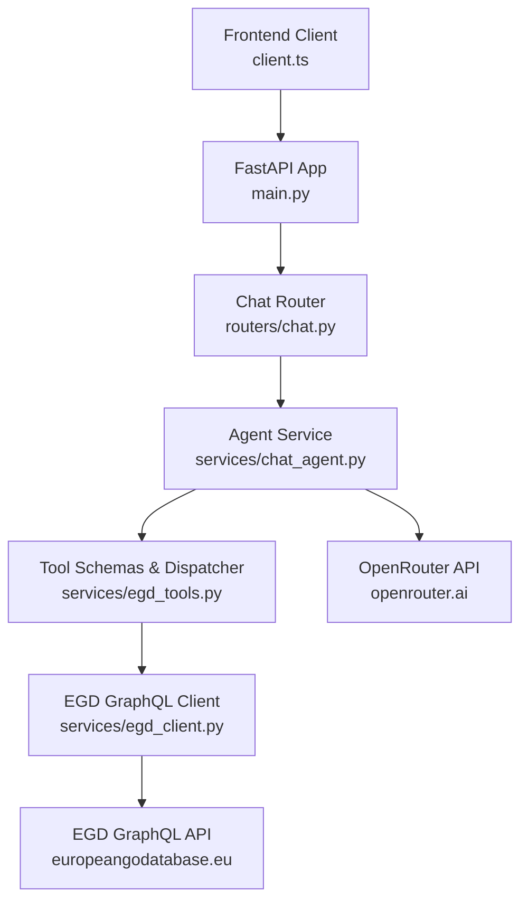
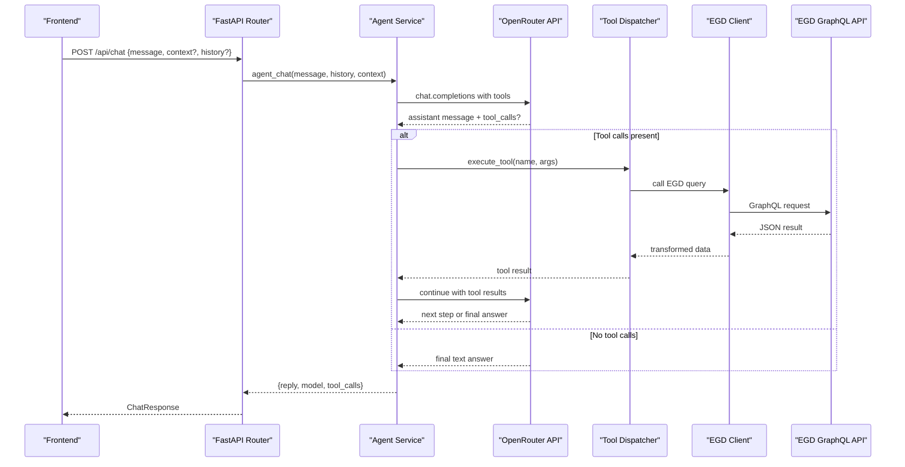
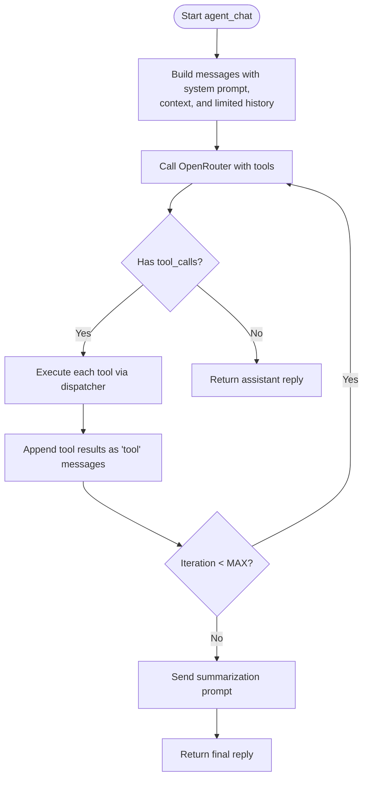
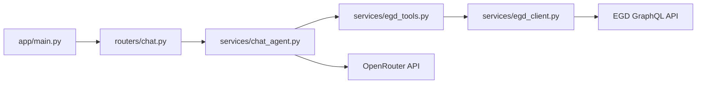

# Chat Endpoints

<cite>
**Referenced Files in This Document**
- [main.py](file://backend/app/main.py)
- [chat.py](file://backend/app/routers/chat.py)
- [chat.py](file://backend/app/models/chat.py)
- [chat_agent.py](file://backend/app/services/chat_agent.py)
- [egd_client.py](file://backend/app/services/egd_client.py)
- [egd_tools.py](file://backend/app/services/egd_tools.py)
- [client.ts](file://frontend/src/api/client.ts)
- [README.md](file://README.md)
</cite>

## Table of Contents
1. [Introduction](#introduction)
2. [Project Structure](#project-structure)
3. [Core Components](#core-components)
4. [Architecture Overview](#architecture-overview)
5. [Detailed Component Analysis](#detailed-component-analysis)
6. [Dependency Analysis](#dependency-analysis)
7. [Performance Considerations](#performance-considerations)
8. [Troubleshooting Guide](#troubleshooting-guide)
9. [Conclusion](#conclusion)
10. [Appendices](#appendices)

## Introduction
This document provides API documentation for the AI chat endpoint POST /api/chat. It explains how to send messages to the agentic chat system, including request schema (message content, conversation context, and optional parameters), response format (AI responses, tool execution results, and conversation state management), agentic behavior, tool calling mechanism, and integration with EGD data sources. It also includes examples of natural language queries, expected responses, and error handling guidance.

## Project Structure
The chat feature is implemented as a FastAPI route that delegates to an agentic service which calls OpenRouter with function/tool calling enabled. The tools are wrappers around the European Go Database (EGD) GraphQL client.

**Diagram sources**
- [main.py:14-31](file://backend/app/main.py#L14-L31)
- [chat.py:1-95](file://backend/app/routers/chat.py#L1-L95)
- [chat_agent.py:30-154](file://backend/app/services/chat_agent.py#L30-L154)
- [egd_tools.py:1-212](file://backend/app/services/egd_tools.py#L1-L212)
- [egd_client.py:1-197](file://backend/app/services/egd_client.py#L1-L197)

**Section sources**
- [main.py:14-31](file://backend/app/main.py#L14-L31)
- [README.md:194-203](file://README.md#L194-L203)

## Core Components
- Request/Response models define the shape of the chat payload and reply.
- The router exposes POST /api/chat and maps it to the agent service.
- The agent orchestrates tool-calling loops with OpenRouter and executes EGD tools via a dispatcher.
- The EGD client performs authenticated GraphQL queries with caching.

Key responsibilities:
- Routers: HTTP boundary and validation.
- Models: Pydantic schemas for requests/responses.
- Services: Business logic (agent loop, tool dispatch, EGD client).

**Section sources**
- [chat.py:1-21](file://backend/app/models/chat.py#L1-L21)
- [chat.py:1-95](file://backend/app/routers/chat.py#L1-L95)
- [chat_agent.py:30-154](file://backend/app/services/chat_agent.py#L30-L154)
- [egd_client.py:11-42](file://backend/app/services/egd_client.py#L11-L42)

## Architecture Overview
POST /api/chat triggers an agentic loop:
- The router validates the request and forwards it to the agent.
- The agent builds a message history, sends it to OpenRouter with tool definitions, and processes any tool_calls.
- For each tool_call, the backend executes the corresponding EGD operation and appends results back to the conversation.
- The loop continues until the LLM returns a final text answer or reaches the maximum iteration limit.

**Diagram sources**
- [chat.py:1-95](file://backend/app/routers/chat.py#L1-L95)
- [chat_agent.py:30-154](file://backend/app/services/chat_agent.py#L30-L154)
- [egd_tools.py:102-212](file://backend/app/services/egd_tools.py#L102-L212)
- [egd_client.py:21-42](file://backend/app/services/egd_client.py#L21-L42)

## Detailed Component Analysis

### Endpoint: POST /api/chat
- Path: /api/chat
- Method: POST
- Content-Type: application/json
- Authentication: None at this layer; OpenRouter key is server-side.

Request body fields:
- message: string (required) — User’s latest prompt.
- context: string (optional) — Additional page or player context injected into the system prompt.
- history: array of ChatMessage (optional) — Conversation history to maintain continuity. Each item has:
  - role: "user" | "assistant"
  - content: string

Response fields:
- reply: string — Final textual answer from the LLM.
- model: string | null — Model used by OpenRouter.
- tool_calls: array of string | null — Names of tools invoked during the turn.

Behavioral notes:
- If no OpenRouter key is configured, the agent returns a fallback reply indicating configuration is missing.
- History is truncated to the last N messages before sending to the LLM to control token usage.
- The agent may call multiple tools across iterations until a final answer is produced or the max iteration limit is reached.

Example request:
{
  "message": "Who is the top-rated German player?",
  "context": "Current view: Player search results",
  "history": [
    {"role": "user", "content": "Show me top players from Germany"},
    {"role": "assistant", "content": "I will search the EGD for German players."}
  ]
}

Example response:
{
  "reply": "Based on the latest EGD data, the highest-rated German player is ...",
  "model": "google/gemini-2.0-flash-001",
  "tool_calls": ["search_player", "get_player_details"]
}

Error handling:
- On internal errors, the router raises a 500 HTTPException with a detail message.
- Missing OpenRouter key yields a graceful fallback reply rather than a server error.

**Section sources**
- [chat.py:1-95](file://backend/app/routers/chat.py#L1-L95)
- [chat.py:1-21](file://backend/app/models/chat.py#L1-L21)
- [chat_agent.py:30-154](file://backend/app/services/chat_agent.py#L30-L154)

### Agentic Behavior and Tool Calling Mechanism
- Tool definitions are provided to OpenRouter so the LLM can decide when to call functions.
- Available tools:
  - search_player(query): Search players by name or PIN.
  - get_player_details(pin): Get detailed profile and rating history.
  - get_player_rating_history(pin): Get rating evolution over time.
  - get_player_games(pin, limit?): Get recent games.
  - compare_players(pin1, pin2): Compare two players’ stats.
- Execution flow:
  - When the LLM returns tool_calls, the backend executes them via the tool dispatcher.
  - Results are appended as tool messages and the LLM is asked to continue.
  - Loop repeats up to CHAT_MAX_ITERATIONS (default 3).
  - If the loop exhausts without a final answer, a follow-up prompt forces a summary.

**Diagram sources**
- [chat_agent.py:30-154](file://backend/app/services/chat_agent.py#L30-L154)
- [egd_tools.py:102-212](file://backend/app/services/egd_tools.py#L102-L212)

**Section sources**
- [chat_agent.py:30-154](file://backend/app/services/chat_agent.py#L30-L154)
- [egd_tools.py:1-99](file://backend/app/services/egd_tools.py#L1-L99)

### EGD Integration
- The EGD client authenticates with a bearer token and caches GraphQL responses for a short TTL.
- The tool dispatcher translates tool invocations into specific EGD queries and normalizes results for the LLM.

Key operations:
- search_players(search, limit): Typo-tolerant player search.
- get_player_by_pin(pin): Full player details and placements.
- get_player_games(pin, page, limit): Game history.
- get_player_tournaments(pin): Tournament history derived from placements.
- get_player_by_name_or_pin(search): Convenience method to resolve by name or PIN.

Caching:
- In-memory cache keyed by query and variables with a configurable TTL.

**Section sources**
- [egd_client.py:11-42](file://backend/app/services/egd_client.py#L11-L42)
- [egd_client.py:44-192](file://backend/app/services/egd_client.py#L44-L192)
- [egd_tools.py:102-212](file://backend/app/services/egd_tools.py#L102-L212)

### Frontend Usage
The frontend uses a typed client to call the chat endpoint:
- Base URL: http://localhost:8000/api
- Function: sendChatMessage(message, context?, history?)
- Types mirror the backend models: ChatMessage and ChatResponse.

**Section sources**
- [client.ts:74-85](file://frontend/src/api/client.ts#L74-L85)

## Dependency Analysis
High-level dependencies between components:

**Diagram sources**
- [main.py:29-31](file://backend/app/main.py#L29-L31)
- [chat.py:1-95](file://backend/app/routers/chat.py#L1-L95)
- [chat_agent.py:30-154](file://backend/app/services/chat_agent.py#L30-L154)
- [egd_tools.py:1-212](file://backend/app/services/egd_tools.py#L1-L212)
- [egd_client.py:1-197](file://backend/app/services/egd_client.py#L1-L197)

**Section sources**
- [main.py:29-31](file://backend/app/main.py#L29-L31)
- [chat.py:1-95](file://backend/app/routers/chat.py#L1-L95)
- [chat_agent.py:30-154](file://backend/app/services/chat_agent.py#L30-L154)
- [egd_tools.py:1-212](file://backend/app/services/egd_tools.py#L1-L212)
- [egd_client.py:1-197](file://backend/app/services/egd_client.py#L1-L197)

## Performance Considerations
- History truncation: Only the last few messages are sent to reduce token usage and latency.
- Tool call limits: Max iterations cap prevents runaway loops.
- EGD caching: Short-lived in-memory cache reduces repeated external calls.
- Timeouts: HTTP clients use timeouts to avoid hanging requests.

[No sources needed since this section provides general guidance]

## Troubleshooting Guide
Common issues and resolutions:
- Missing OpenRouter key: The agent returns a fallback reply indicating configuration is required. Ensure OPENROUTER_API_KEY is set in the environment.
- Unknown tool name: The dispatcher returns an error object; verify tool names match the defined schemas.
- EGD authentication failures: Check EGD_API_TOKEN and network connectivity to the EGD GraphQL endpoint.
- Excessive tool calls: Increase CHAT_MAX_ITERATIONS if complex queries require more steps, but be mindful of cost and latency.
- Large histories: Keep history concise; the agent truncates automatically, but providing fewer messages improves performance.

**Section sources**
- [chat_agent.py:42-48](file://backend/app/services/chat_agent.py#L42-L48)
- [egd_tools.py:207-212](file://backend/app/services/egd_tools.py#L207-L212)
- [chat.py:23-24](file://backend/app/routers/chat.py#L23-L24)

## Conclusion
The POST /api/chat endpoint provides an agentic chat experience backed by OpenRouter tool calling and the EGD GraphQL API. It supports conversational context, autonomous tool invocation, and structured responses suitable for UI rendering and debugging. Proper configuration of environment variables and awareness of tool capabilities ensures reliable and insightful interactions.

[No sources needed since this section summarizes without analyzing specific files]

## Appendices

### Environment Variables
- OPENROUTER_API_KEY: Required for chat functionality.
- CHAT_MODEL: OpenRouter model ID (default gemini-2.0-flash-001).
- CHAT_MAX_ITERATIONS: Maximum tool-calling iterations per turn (default 3).
- EGD_API_TOKEN: Bearer token for EGD GraphQL API.

**Section sources**
- [README.md:139-154](file://README.md#L139-L154)

### Example Natural Language Queries and Expected Responses
- Query: "Find the current rating and grade of player with PIN 12345678."
  - Expected behavior: Tool get_player_details called; response includes rating, grade, and brief insights.
- Query: "Compare players 11111111 and 22222222."
  - Expected behavior: Tool compare_players called; response shows side-by-side stats.
- Query: "What were the last 10 games of player 33333333?"
  - Expected behavior: Tool get_player_games called; response lists opponents, results, and tournaments.

[No sources needed since this section provides conceptual examples]