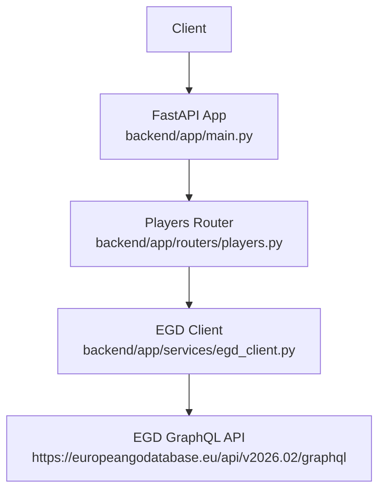
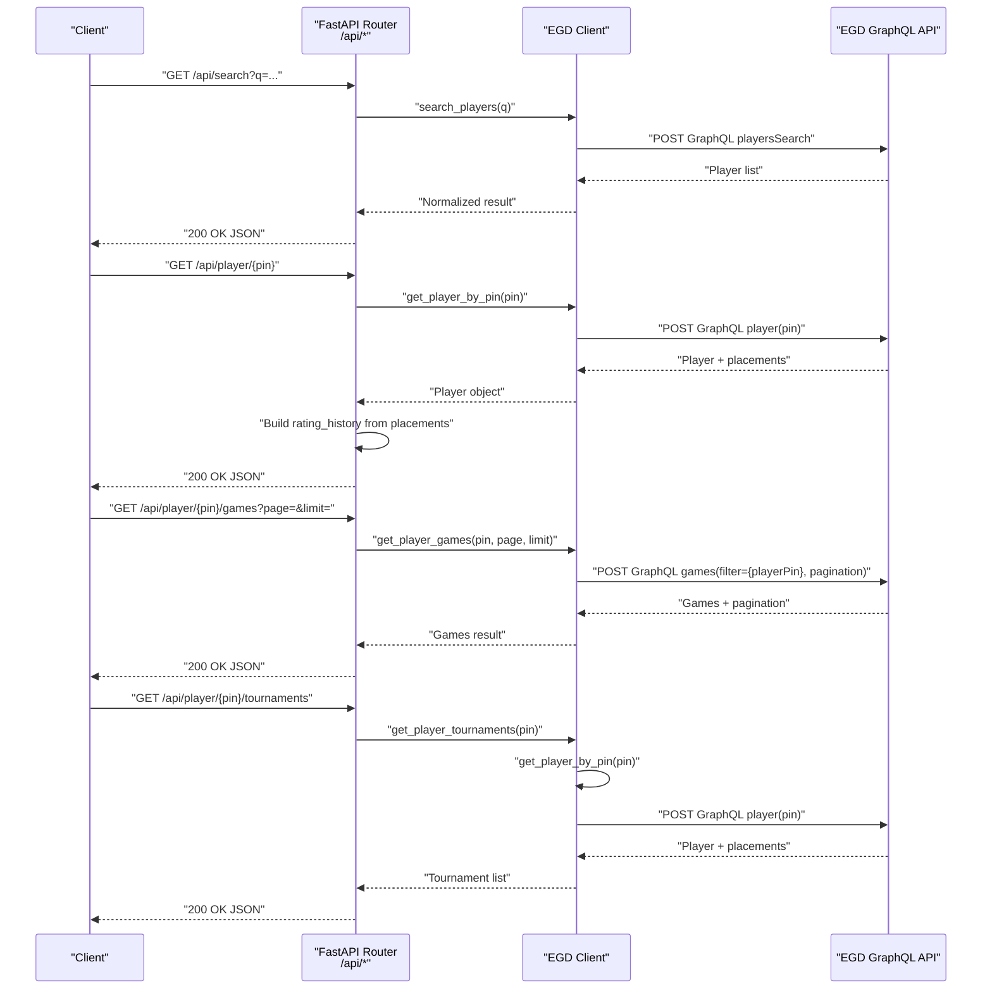
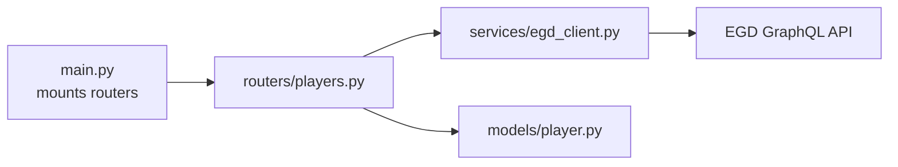

# Player Endpoints

<cite>
**Referenced Files in This Document**
- [main.py](file://backend/app/main.py)
- [players.py](file://backend/app/routers/players.py)
- [player.py](file://backend/app/models/player.py)
- [egd_client.py](file://backend/app/services/egd_client.py)
- [EGD_API.md](file://docs/EGD_API.md)
</cite>

## Table of Contents
1. [Introduction](#introduction)
2. [Project Structure](#project-structure)
3. [Core Components](#core-components)
4. [Architecture Overview](#architecture-overview)
5. [Detailed Component Analysis](#detailed-component-analysis)
6. [Dependency Analysis](#dependency-analysis)
7. [Performance Considerations](#performance-considerations)
8. [Troubleshooting Guide](#troubleshooting-guide)
9. [Conclusion](#conclusion)

## Introduction
This document provides API documentation for player-related REST endpoints exposed by the GoNow backend. It covers:
- GET /api/search: Search players by name or PIN
- GET /api/player/{pin}: Retrieve detailed player information including rating history
- GET /api/player/{pin}/games: Retrieve game history with pagination
- GET /api/player/{pin}/tournaments: Retrieve tournament history

It includes request/response schemas, parameter validation rules, error codes, and data transformation details such as extracting rating history from EGD placement data.

## Project Structure
The player endpoints are implemented using FastAPI routers and a service layer that communicates with the European Go Database (EGD) GraphQL API. The application mounts the player router under the /api prefix.

**Diagram sources**
- [main.py:14-31](file://backend/app/main.py#L14-L31)
- [players.py:1-107](file://backend/app/routers/players.py#L1-L107)
- [egd_client.py:1-197](file://backend/app/services/egd_client.py#L1-L197)

**Section sources**
- [main.py:14-31](file://backend/app/main.py#L14-L31)
- [players.py:1-107](file://backend/app/routers/players.py#L1-L107)
- [egd_client.py:1-197](file://backend/app/services/egd_client.py#L1-L197)

## Core Components
- Routers: Define REST endpoints and handle HTTP requests/responses.
- Models: Pydantic models define response shapes for search results and player details.
- Service Layer: Encapsulates GraphQL queries to EGD and applies caching.

Key responsibilities:
- Parameter validation and normalization (e.g., numeric query treated as PIN).
- Data transformation (e.g., building rating_history from placements).
- Pagination handling for games.
- Error mapping to HTTP status codes.

**Section sources**
- [players.py:1-107](file://backend/app/routers/players.py#L1-L107)
- [player.py:1-60](file://backend/app/models/player.py#L1-L60)
- [egd_client.py:1-197](file://backend/app/services/egd_client.py#L1-L197)

## Architecture Overview
The flow for each endpoint is:
- Client sends an HTTP request to a FastAPI route.
- Route validates parameters and calls the EGD client.
- EGD client executes a GraphQL query against the EGD API with optional caching.
- Response is transformed into the required REST schema and returned.

**Diagram sources**
- [players.py:8-106](file://backend/app/routers/players.py#L8-L106)
- [egd_client.py:44-177](file://backend/app/services/egd_client.py#L44-L177)

## Detailed Component Analysis

### Endpoint: GET /api/search
Purpose:
- Search players by name or PIN. If the query is numeric, it attempts a direct PIN lookup first; otherwise, performs a name-based search.

Path:
- /api/search

Query Parameters:
- q: string, required, minimum length 1. If numeric, treated as PIN for direct lookup.

Response Schema:
- data: array of player summaries
  - pin: integer
  - firstName: string
  - lastName: string
  - countryCode: string
  - grade: string
  - rating: integer | null
  - club: string | null
  - totalTournaments: integer | null
  - lastAppearance: string | null
- total: integer
- currentPage: integer
- hasMorePages: boolean

Notes:
- When q is numeric and a matching PIN exists, returns a single-item data array with total=1 and hasMorePages=false.
- Otherwise, delegates to the underlying playersSearch and returns its normalized structure.

Example Request:
- GET /api/search?q=Zhan%20Shi
- GET /api/search?q=17401142

Example Responses:
- Name search success:
  - { "data": [...], "total": N, "currentPage": 1, "hasMorePages": true|false }
- PIN lookup success:
  - { "data": [{...}], "total": 1, "currentPage": 1, "hasMorePages": false }

Error Codes:
- 500 Internal Server Error: Unexpected server-side errors during processing.

Parameter Validation Rules:
- q is required and must have at least one character.

Data Transformation Details:
- Numeric q triggers get_player_by_pin and wraps the result into the standard search response shape.

**Section sources**
- [players.py:8-40](file://backend/app/routers/players.py#L8-L40)
- [egd_client.py:44-70](file://backend/app/services/egd_client.py#L44-L70)
- [EGD_API.md:81-106](file://docs/EGD_API.md#L81-L106)

### Endpoint: GET /api/player/{pin}
Purpose:
- Retrieve detailed player information and build a rating_history derived from tournament placements.

Path:
- /api/player/{pin}

Path Parameters:
- pin: integer, required

Response Schema:
- All fields from the player object (as returned by the EGD client), plus:
  - rating_history: array of objects with:
    - date: string
    - tournament: string
    - city: string
    - nation: string
    - placement: integer
    - grade: string
    - rating_before: number | null
    - rating_after: number | null
    - won: integer
    - lost: integer
    - jigo: integer

Notes:
- rating_history is constructed from placements.data entries and sorted by date ascending.

Example Request:
- GET /api/player/17401142

Example Response:
- { ...player fields..., "rating_history": [...] }

Error Codes:
- 404 Not Found: Player not found
- 500 Internal Server Error: Unexpected server-side errors

Parameter Validation Rules:
- pin must be an integer.

Data Transformation Details:
- Extracts placements.data and maps each entry to a simplified rating_history item.
- Sorts rating_history by date.

**Section sources**
- [players.py:43-80](file://backend/app/routers/players.py#L43-L80)
- [egd_client.py:72-118](file://backend/app/services/egd_client.py#L72-L118)
- [EGD_API.md:26-79](file://docs/EGD_API.md#L26-L79)

### Endpoint: GET /api/player/{pin}/games
Purpose:
- Retrieve a player’s game history with pagination support.

Path:
- /api/player/{pin}/games

Path Parameters:
- pin: integer, required

Query Parameters:
- page: integer, default 1, minimum 1
- limit: integer, default 50, range 1..200

Response Schema:
- data: array of game records
  - id: integer
  - date: string
  - round: integer
  - result: string
  - handicap: integer
  - tournament: object
    - code: string
    - description: string
    - date: string
  - player1: object
    - pin: integer
    - firstName: string
    - lastName: string
  - player2: object
    - pin: integer
    - firstName: string
    - lastName: string
- total: integer
- currentPage: integer
- hasMorePages: boolean

Notes:
- Games are ordered by date descending by default.
- Pagination is handled via page and limit.

Example Request:
- GET /api/player/17401142/games?page=1&limit=20

Example Response:
- { "data": [...], "total": N, "currentPage": 1, "hasMorePages": true|false }

Error Codes:
- 500 Internal Server Error: Unexpected server-side errors

Parameter Validation Rules:
- page >= 1
- 1 <= limit <= 200

Data Transformation Details:
- Delegates directly to the EGD client’s games query and returns the normalized pagination structure.

**Section sources**
- [players.py:83-94](file://backend/app/routers/players.py#L83-L94)
- [egd_client.py:120-150](file://backend/app/services/egd_client.py#L120-L150)
- [EGD_API.md:129-133](file://docs/EGD_API.md#L129-L133)

### Endpoint: GET /api/player/{pin}/tournaments
Purpose:
- Retrieve a player’s tournament history deduplicated by tournament code and sorted by date.

Path:
- /api/player/{pin}/tournaments

Path Parameters:
- pin: integer, required

Response Schema:
- data: array of tournament summaries
  - code: string
  - description: string
  - date: string
  - city: string
  - nation: string
  - placement: integer
  - grade_declared: string
  - won: integer
  - lost: integer
  - jigo: integer
  - rating_before: number | null
  - rating_after: number | null
- total: integer

Notes:
- Tournaments are deduplicated by code and sorted by date ascending.

Example Request:
- GET /api/player/17401142/tournaments

Example Response:
- { "data": [...], "total": N }

Error Codes:
- 500 Internal Server Error: Unexpected server-side errors

Parameter Validation Rules:
- pin must be an integer.

Data Transformation Details:
- Uses player placements to build a unique list of tournaments and aggregates per-tournament stats.

**Section sources**
- [players.py:97-106](file://backend/app/routers/players.py#L97-L106)
- [egd_client.py:152-177](file://backend/app/services/egd_client.py#L152-L177)

## Dependency Analysis
The following diagram shows how components depend on each other across the stack.

**Diagram sources**
- [main.py:29-31](file://backend/app/main.py#L29-L31)
- [players.py:1-107](file://backend/app/routers/players.py#L1-L107)
- [player.py:1-60](file://backend/app/models/player.py#L1-L60)
- [egd_client.py:1-197](file://backend/app/services/egd_client.py#L1-L197)

**Section sources**
- [main.py:29-31](file://backend/app/main.py#L29-L31)
- [players.py:1-107](file://backend/app/routers/players.py#L1-L107)
- [player.py:1-60](file://backend/app/models/player.py#L1-L60)
- [egd_client.py:1-197](file://backend/app/services/egd_client.py#L1-L197)

## Performance Considerations
- Caching: The EGD client caches GraphQL responses for up to 5 minutes to reduce external API load.
- Pagination: Use reasonable page sizes (default 50, max 200) to balance latency and payload size.
- Sorting: Rating history and tournaments are sorted server-side within the application after retrieval; avoid requesting excessively large datasets.

[No sources needed since this section provides general guidance]

## Troubleshooting Guide
Common issues and resolutions:
- 404 Not Found on /api/player/{pin}: The specified PIN does not exist in the EGD database. Verify the PIN and retry.
- 500 Internal Server Error: Indicates unexpected failures in routing or downstream services. Check logs and ensure the EGD token is valid and network connectivity is available.
- Invalid query parameters: Ensure q is non-empty for search, page >= 1, and 1 <= limit <= 200 for games.

Operational checks:
- Health check: GET /health returns {"status":"ok"} when the service is running.
- OpenAPI docs: Available at /docs for interactive exploration.

**Section sources**
- [players.py:43-80](file://backend/app/routers/players.py#L43-L80)
- [players.py:83-106](file://backend/app/routers/players.py#L83-L106)
- [main.py:34-41](file://backend/app/main.py#L34-L41)

## Conclusion
The player endpoints provide a consistent REST interface over the EGD GraphQL API, with robust parameter validation, clear response schemas, and helpful transformations like rating history extraction. Clients should leverage pagination for games and use the provided error codes to handle edge cases gracefully.

[No sources needed since this section summarizes without analyzing specific files]