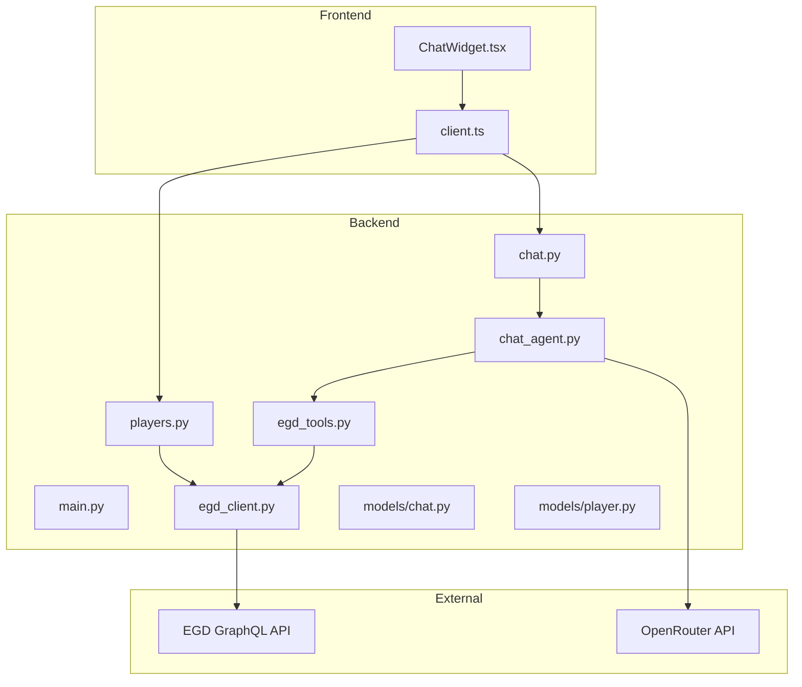
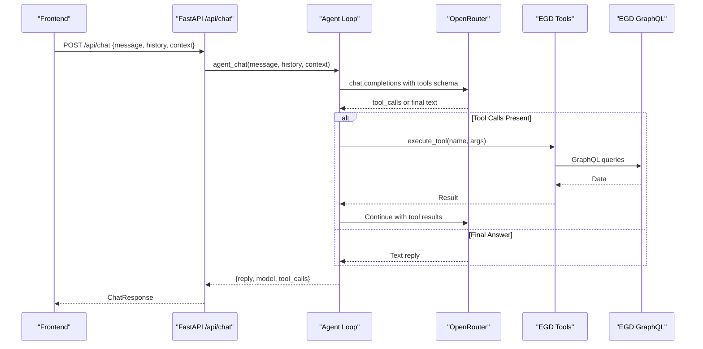
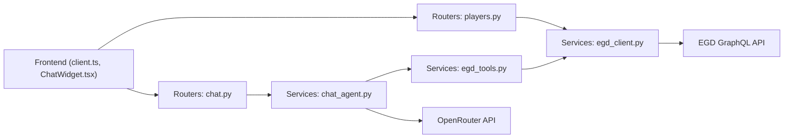
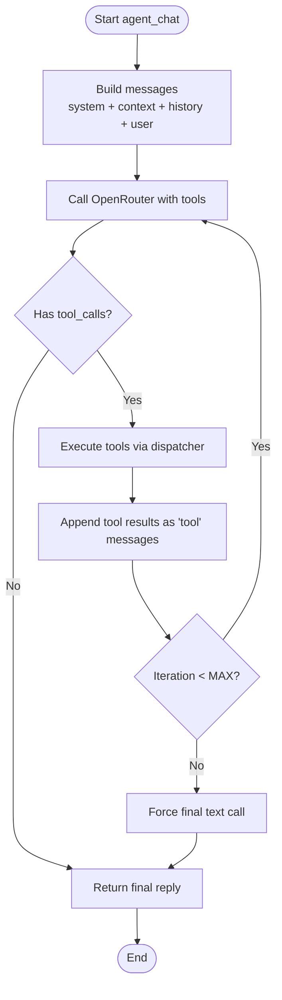

# Agent Design Research

<cite>
**Referenced Files in This Document**
- [README.md](file://README.md)
- [ARCHITECTURE.md](file://docs/ARCHITECTURE.md)
- [AGENT_DESIGN.md](file://docs/AGENT_DESIGN.md)
- [main.py](file://backend/app/main.py)
- [chat.py](file://backend/app/routers/chat.py)
- [players.py](file://backend/app/routers/players.py)
- [chat_agent.py](file://backend/app/services/chat_agent.py)
- [egd_tools.py](file://backend/app/services/egd_tools.py)
- [egd_client.py](file://backend/app/services/egd_client.py)
- [chat.py](file://backend/app/models/chat.py)
- [player.py](file://backend/app/models/player.py)
- [client.ts](file://frontend/src/api/client.ts)
- [ChatWidget.tsx](file://frontend/src/components/ChatWidget.tsx)
- [Makefile](file://Makefile)
</cite>

## Table of Contents
1. [Introduction](#introduction)
2. [Project Structure](#project-structure)
3. [Core Components](#core-components)
4. [Architecture Overview](#architecture-overview)
5. [Detailed Component Analysis](#detailed-component-analysis)
6. [Dependency Analysis](#dependency-analysis)
7. [Performance Considerations](#performance-considerations)
8. [Troubleshooting Guide](#troubleshooting-guide)
9. [Conclusion](#conclusion)
10. [Appendices](#appendices)

## Introduction
This document presents an in-depth analysis of the agent design and system architecture for GoNow, a full-stack web application that integrates with the European Go Database (EGD) and provides AI-powered insights via an agentic chat assistant. The assistant uses OpenRouter’s native tool calling to autonomously query EGD data through server-side tools, enabling dynamic player lookups, comparisons, and analytics.

The project combines:
- A React frontend for search, profiles, favorites, and a floating chat widget
- A FastAPI backend proxying EGD GraphQL calls and orchestrating LLM tool-calling loops
- An agent loop that implements a ReAct-style Reason → Act → Observe flow using OpenRouter function calling
- A robust client layer over EGD with caching and typed models on both sides

## Project Structure
GoNow is organized into clear layers:
- Frontend: React + TypeScript app with API client and UI components
- Backend: FastAPI app with routers, services, and Pydantic models
- Documentation: Architecture and agent design research
- Scripts and Makefile for development orchestration

**Diagram sources**
- [main.py:1-42](file://backend/app/main.py#L1-L42)
- [players.py:1-107](file://backend/app/routers/players.py#L1-L107)
- [chat.py:1-95](file://backend/app/routers/chat.py#L1-L95)
- [chat_agent.py:1-154](file://backend/app/services/chat_agent.py#L1-L154)
- [egd_tools.py:1-212](file://backend/app/services/egd_tools.py#L1-L212)
- [egd_client.py:1-197](file://backend/app/services/egd_client.py#L1-L197)
- [client.ts:1-86](file://frontend/src/api/client.ts#L1-L86)
- [ChatWidget.tsx:1-240](file://frontend/src/components/ChatWidget.tsx#L1-L240)

**Section sources**
- [README.md:1-203](file://README.md#L1-L203)
- [ARCHITECTURE.md:1-99](file://docs/ARCHITECTURE.md#L1-L99)

## Core Components
- FastAPI Application Entry: Initializes CORS, mounts routers, exposes health endpoints
- Player Routers: Search by name/PIN, fetch details, games, tournaments
- Chat Router: Agentic chat endpoint delegating to the agent loop
- Chat Agent: Implements tool-calling loop with OpenRouter, manages conversation history and context
- EGD Tools: Function schemas and dispatcher for EGD operations
- EGD Client: Async GraphQL client with in-memory caching
- Models: Pydantic types for chat and player data
- Frontend Client: Axios-based API client with TypeScript interfaces
- Chat Widget: Floating chat UI with quick prompts and loading indicators

**Section sources**
- [main.py:1-42](file://backend/app/main.py#L1-L42)
- [players.py:1-107](file://backend/app/routers/players.py#L1-L107)
- [chat.py:1-95](file://backend/app/routers/chat.py#L1-L95)
- [chat_agent.py:1-154](file://backend/app/services/chat_agent.py#L1-L154)
- [egd_tools.py:1-212](file://backend/app/services/egd_tools.py#L1-L212)
- [egd_client.py:1-197](file://backend/app/services/egd_client.py#L1-L197)
- [chat.py:1-21](file://backend/app/models/chat.py#L1-L21)
- [player.py:1-60](file://backend/app/models/player.py#L1-L60)
- [client.ts:1-86](file://frontend/src/api/client.ts#L1-L86)
- [ChatWidget.tsx:1-240](file://frontend/src/components/ChatWidget.tsx#L1-L240)

## Architecture Overview
The system follows a layered architecture:
- Frontend communicates with backend REST endpoints
- Backend proxies all EGD GraphQL calls to keep tokens server-side
- Chat agent leverages OpenRouter’s native tool calling to execute predefined functions against EGD
- In-memory caching reduces external API load

**Diagram sources**
- [chat.py:1-95](file://backend/app/routers/chat.py#L1-L95)
- [chat_agent.py:1-154](file://backend/app/services/chat_agent.py#L1-L154)
- [egd_tools.py:1-212](file://backend/app/services/egd_tools.py#L1-L212)
- [egd_client.py:1-197](file://backend/app/services/egd_client.py#L1-L197)

**Section sources**
- [ARCHITECTURE.md:1-99](file://docs/ARCHITECTURE.md#L1-L99)
- [AGENT_DESIGN.md:1-259](file://docs/AGENT_DESIGN.md#L1-L259)

## Detailed Component Analysis

### FastAPI Application Entry
- Loads environment variables from backend/.env
- Configures CORS for local dev origins
- Mounts routers for players and chat
- Exposes root and health endpoints

Key responsibilities:
- App initialization and middleware setup
- Router registration

**Section sources**
- [main.py:1-42](file://backend/app/main.py#L1-L42)

### Player Routers
Endpoints:
- GET /api/search?q=... — Name or PIN lookup with typo tolerance
- GET /api/player/{pin} — Full profile plus rating history
- GET /api/player/{pin}/games — Paginated game history
- GET /api/player/{pin}/tournaments — Tournament history

Behavior:
- Numeric queries attempt direct PIN lookup first
- Non-numeric queries use fuzzy search
- Rating history extracted and sorted by date

Error handling:
- HTTPException for not found and server errors

**Section sources**
- [players.py:1-107](file://backend/app/routers/players.py#L1-L107)
- [egd_client.py:1-197](file://backend/app/services/egd_client.py#L1-L197)

### Chat Router
Endpoint:
- POST /api/chat — Agentic chat with tool calling

Responsibilities:
- Accepts message, optional context, and conversation history
- Delegates to agent_chat
- Returns structured response including model used and tool call log

Error handling:
- Wraps exceptions in HTTP 500 responses

**Section sources**
- [chat.py:1-95](file://backend/app/routers/chat.py#L1-L95)
- [chat.py:1-21](file://backend/app/models/chat.py#L1-L21)

### Chat Agent (Tool Calling Loop)
Core logic:
- Builds messages array with system prompt, optional context, and recent history
- Sends request to OpenRouter with EGD tool schemas
- If tool_calls present:
  - Append assistant message with tool_calls
  - Execute each tool via dispatcher
  - Append tool results as tool role messages
  - Continue loop until max iterations
- If no tool_calls: return final answer
- On iteration exhaustion: force one more call without tools to produce final text

Configuration:
- Model ID from CHAT_MODEL env var
- Max iterations from CHAT_MAX_ITERATIONS env var
- Graceful fallback when OPENROUTER_API_KEY is missing

Complexity:
- Time complexity proportional to number of tool calls per turn and total iterations
- Space complexity includes conversation history capped at last 10 messages

**Section sources**
- [chat_agent.py:1-154](file://backend/app/services/chat_agent.py#L1-L154)
- [AGENT_DESIGN.md:1-259](file://docs/AGENT_DESIGN.md#L1-L259)

### EGD Tools (Function Schemas and Dispatcher)
Tools defined:
- search_player(query)
- get_player_details(pin)
- get_player_rating_history(pin)
- get_player_games(pin, limit?)
- compare_players(pin1, pin2)

Dispatcher behavior:
- Validates arguments and routes to appropriate egd_client methods
- Normalizes responses into success/error envelopes
- Extracts and sorts rating histories where applicable

Error handling:
- Unknown tool names return error envelope
- Exceptions caught and returned as error responses

**Section sources**
- [egd_tools.py:1-212](file://backend/app/services/egd_tools.py#L1-L212)

### EGD Client (GraphQL Layer with Caching)
Capabilities:
- search_players(search, limit)
- get_player_by_pin(pin)
- get_player_games(pin, page, limit)
- get_player_tournaments(pin)
- get_player_by_name_or_pin(search)

Caching:
- In-memory dict cache keyed by query and variables
- TTL of 300 seconds to reduce external calls

Error handling:
- Raises ValueError on GraphQL errors
- Propagates HTTP errors from httpx

**Section sources**
- [egd_client.py:1-197](file://backend/app/services/egd_client.py#L1-L197)

### Models
Chat models:
- ChatMessage(role, content)
- ChatRequest(message, context?, history?)
- ChatResponse(reply, model?, tool_calls?)

Player models:
- PlayerSummary, TournamentInfo, PlacementInfo, PlayerDetail, SearchResponse

Purpose:
- Strong typing for requests/responses
- Validation and serialization across API boundaries

**Section sources**
- [chat.py:1-21](file://backend/app/models/chat.py#L1-L21)
- [player.py:1-60](file://backend/app/models/player.py#L1-L60)

### Frontend API Client
Interfaces:
- PlayerSummary, SearchResponse, RatingHistoryEntry, PlayerDetail
- ChatMessage, ChatResponse

Functions:
- searchPlayers(query)
- getPlayer(pin)
- getPlayerTournaments(pin)
- sendChatMessage(message, context?, history?)

Behavior:
- Axios instance configured with base URL
- Type-safe wrappers around REST endpoints

**Section sources**
- [client.ts:1-86](file://frontend/src/api/client.ts#L1-L86)

### Chat Widget (UI)
Features:
- Floating stone-shaped button to open chat window
- Message list with user/assistant bubbles
- Quick prompts for common queries
- Loading state with “Thinking...” indicator
- Keyboard support (Enter to send)

Integration:
- Uses sendChatMessage from client.ts
- Displays assistant replies and handles errors gracefully

**Section sources**
- [ChatWidget.tsx:1-240](file://frontend/src/components/ChatWidget.tsx#L1-L240)
- [client.ts:1-86](file://frontend/src/api/client.ts#L1-L86)

### Development Orchestration
Makefile targets:
- install, install-be, install-fe
- dev, dev-be, dev-fe
- build, stop, clean

Purpose:
- Simplifies environment setup and running servers
- Cross-platform Windows-friendly commands

**Section sources**
- [Makefile:1-54](file://Makefile#L1-L54)

## Dependency Analysis
High-level dependencies:
- Frontend depends on backend REST APIs
- Backend routers depend on services (EGD client, tools, agent)
- Agent depends on OpenRouter and tools
- Tools depend on EGD client
- EGD client depends on httpx and environment configuration

**Diagram sources**
- [client.ts:1-86](file://frontend/src/api/client.ts#L1-L86)
- [ChatWidget.tsx:1-240](file://frontend/src/components/ChatWidget.tsx#L1-L240)
- [players.py:1-107](file://backend/app/routers/players.py#L1-L107)
- [chat.py:1-95](file://backend/app/routers/chat.py#L1-L95)
- [chat_agent.py:1-154](file://backend/app/services/chat_agent.py#L1-L154)
- [egd_tools.py:1-212](file://backend/app/services/egd_tools.py#L1-L212)
- [egd_client.py:1-197](file://backend/app/services/egd_client.py#L1-L197)

**Section sources**
- [ARCHITECTURE.md:1-99](file://docs/ARCHITECTURE.md#L1-L99)

## Performance Considerations
- In-memory caching with 5-minute TTL reduces EGD API calls significantly
- Conversation history limited to last 10 messages to control payload size
- Max iterations cap prevents infinite tool-calling loops
- Asynchronous HTTP clients (httpx) improve throughput
- Frontend uses lightweight UI patterns; avoid heavy re-renders by batching updates

[No sources needed since this section provides general guidance]

## Troubleshooting Guide
Common issues and resolutions:
- Missing OPENROUTER_API_KEY:
  - Symptom: Chat returns a message indicating configuration is required
  - Resolution: Add key to backend/.env
- Model misconfiguration:
  - Symptom: Unexpected model usage or failures
  - Resolution: Set CHAT_MODEL to a supported model ID
- Iteration exhaustion:
  - Symptom: Agent forces final summary after max iterations
  - Resolution: Increase CHAT_MAX_ITERATIONS if complex queries require more steps
- EGD API errors:
  - Symptom: GraphQL errors raised by client
  - Resolution: Check token validity and query correctness
- CORS issues:
  - Symptom: Frontend blocked from calling backend
  - Resolution: Ensure allow_origins include your dev origin

Operational checks:
- Health endpoint: GET /health should return status ok
- Docs endpoint: /docs available for API exploration

**Section sources**
- [chat_agent.py:1-154](file://backend/app/services/chat_agent.py#L1-L154)
- [main.py:1-42](file://backend/app/main.py#L1-L42)
- [CHAT_DESIGN.md:1-259](file://docs/AGENT_DESIGN.md#L1-L259)

## Conclusion
GoNow’s agent design leverages OpenRouter’s native tool calling to implement a simple yet powerful ReAct-style loop. By keeping tool definitions explicit and executing them server-side, the system remains secure and maintainable. The architecture balances performance with clarity: in-memory caching, async I/O, and minimal orchestration overhead. The frontend provides an intuitive interface with a floating chat widget and quick prompts, while the backend cleanly separates concerns across routers, services, and models.

[No sources needed since this section summarizes without analyzing specific files]

## Appendices

### API Endpoints Summary
- GET /api/search?q=<query>
- GET /api/player/<pin>
- GET /api/player/<pin>/games?page=<n>&limit=<n>
- GET /api/player/<pin>/tournaments
- POST /api/chat

**Section sources**
- [README.md:194-203](file://README.md#L194-L203)
- [players.py:1-107](file://backend/app/routers/players.py#L1-L107)
- [chat.py:1-95](file://backend/app/routers/chat.py#L1-L95)

### Environment Variables
- EGD_API_TOKEN
- OPENROUTER_API_KEY
- CHAT_MODEL
- CHAT_MAX_ITERATIONS

**Section sources**
- [README.md:139-154](file://README.md#L139-L154)

### Agent Flow Algorithm

**Diagram sources**
- [chat_agent.py:1-154](file://backend/app/services/chat_agent.py#L1-L154)