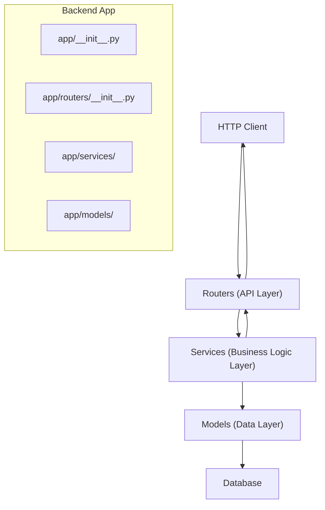
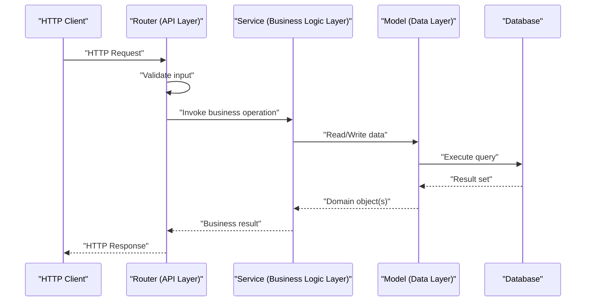
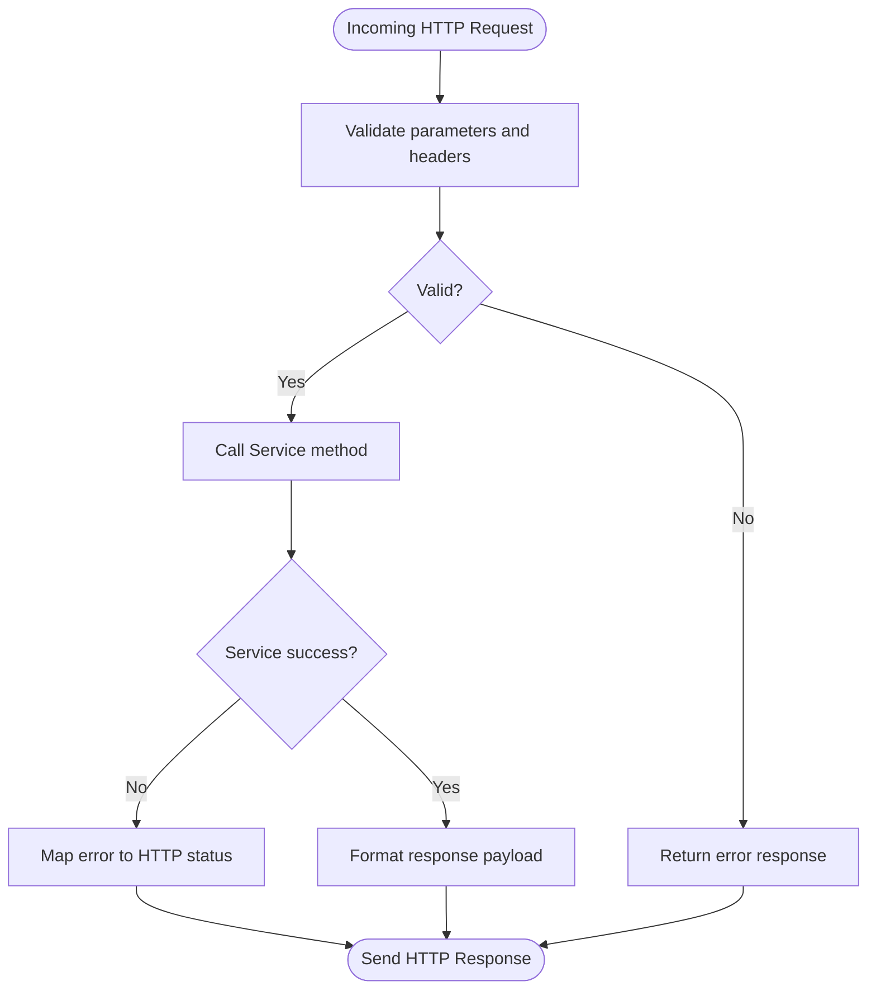
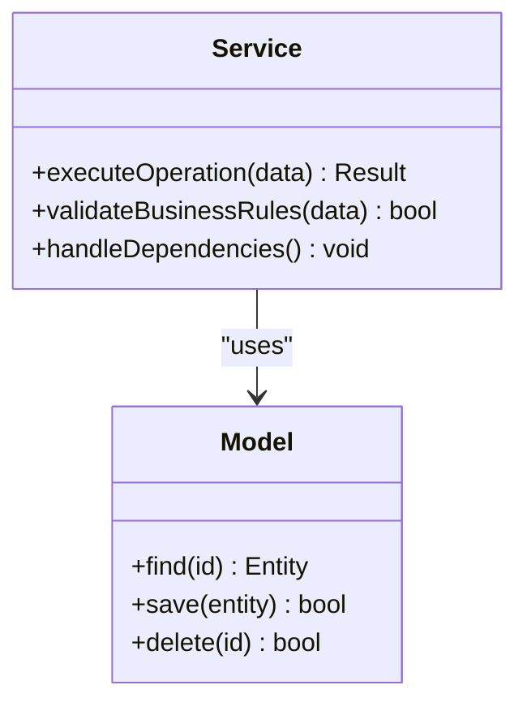
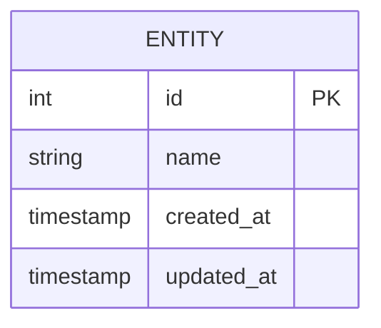
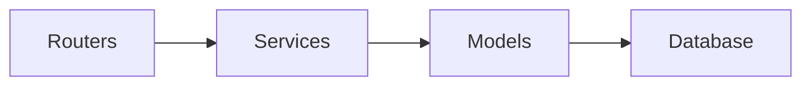

# Architecture Guide

<cite>
**Referenced Files in This Document**
- [__init__.py](file://backend/app/__init__.py)
- [routers/__init__.py](file://backend/app/routers/__init__.py)
</cite>

## Table of Contents
1. [Introduction](#introduction)
2. [Project Structure](#project-structure)
3. [Core Components](#core-components)
4. [Architecture Overview](#architecture-overview)
5. [Detailed Component Analysis](#detailed-component-analysis)
6. [Dependency Analysis](#dependency-analysis)
7. [Performance Considerations](#performance-considerations)
8. [Troubleshooting Guide](#troubleshooting-guide)
9. [Conclusion](#conclusion)

## Introduction
This guide describes the layered architecture of the project with a focus on separation of concerns, service-oriented design, and an MVC-inspired structure. It explains how HTTP requests flow through Routers (API Layer), Services (Business Logic Layer), and Models (Data Layer), and how responses are returned to clients. It also covers cross-cutting concerns such as error handling, validation, and logging, and outlines extension points for adding new features while preserving architectural integrity.

## Project Structure
The backend is organized into clear layers:
- API Layer (Routers): Exposes endpoints and orchestrates request/response handling.
- Business Logic Layer (Services): Encapsulates domain logic and workflows.
- Data Layer (Models): Manages data access and persistence.

[No sources needed since this diagram shows conceptual workflow, not actual code structure]

**Section sources**
- [__init__.py](file://backend/app/__init__.py)
- [routers/__init__.py](file://backend/app/routers/__init__.py)

## Core Components
- Routers (API Layer)
  - Responsibilities: Parse incoming HTTP requests, validate inputs, call services, and format responses.
  - Interaction: Depends on Services; returns structured responses to clients.
- Services (Business Logic Layer)
  - Responsibilities: Implement business rules, orchestrate operations, and coordinate multiple models or external calls.
  - Interaction: Depends on Models; may be called by multiple routers.
- Models (Data Layer)
  - Responsibilities: Represent entities and perform data access operations (CRUD).
  - Interaction: Used by Services; abstracts database interactions.

Design principles:
- Separation of concerns: Each layer has a single responsibility.
- Service-oriented architecture: Reusable business logic encapsulated in services.
- MVC-inspired structure: Clear boundaries between presentation (routers), logic (services), and data (models).

**Section sources**
- [__init__.py](file://backend/app/__init__.py)
- [routers/__init__.py](file://backend/app/routers/__init__.py)

## Architecture Overview
The system follows a layered approach where each request traverses well-defined boundaries:
- Routers receive HTTP requests and delegate to Services.
- Services implement business logic and use Models for data operations.
- Models interact with the database and return data to Services.
- Responses bubble back up through Services to Routers and then to clients.

[No sources needed since this diagram shows conceptual workflow, not actual code structure]

## Detailed Component Analysis

### Routers (API Layer)
- Role: Entry point for HTTP traffic; responsible for request parsing, parameter validation, and response formatting.
- Typical responsibilities:
  - Route definitions and endpoint mapping.
  - Input validation and sanitization.
  - Error translation to appropriate HTTP status codes.
  - Logging of request metadata.
- Integration points:
  - Calls Services to execute business operations.
  - May integrate middleware for authentication, rate limiting, and CORS.

[No sources needed since this diagram shows conceptual workflow, not actual code structure]

**Section sources**
- [routers/__init__.py](file://backend/app/routers/__init__.py)

### Services (Business Logic Layer)
- Role: Encapsulate domain logic and workflows; ensure that business rules are enforced consistently.
- Typical responsibilities:
  - Orchestration of multiple model operations.
  - Transaction management across data operations.
  - Validation beyond basic input checks.
  - Calling external APIs or message brokers when necessary.
- Integration points:
  - Consumed by Routers.
  - Uses Models for data access.

[No sources needed since this diagram shows conceptual workflow, not actual code structure]

**Section sources**
- [__init__.py](file://backend/app/__init__.py)

### Models (Data Layer)
- Role: Provide data access abstractions and represent domain entities.
- Typical responsibilities:
  - CRUD operations against the database.
  - Query building and result mapping.
  - Data transformation to domain objects.
- Integration points:
  - Called by Services.
  - Interacts directly with the database.

[No sources needed since this diagram shows conceptual workflow, not actual code structure]

**Section sources**
- [__init__.py](file://backend/app/__init__.py)

## Dependency Analysis
High-level dependencies follow a unidirectional flow:
- Routers depend on Services.
- Services depend on Models.
- Models depend on database drivers/ORMs.

[No sources needed since this diagram shows conceptual workflow, not actual code structure]

**Section sources**
- [__init__.py](file://backend/app/__init__.py)
- [routers/__init__.py](file://backend/app/routers/__init__.py)

## Performance Considerations
- Connection pooling for database operations.
- Caching strategies at the service layer for read-heavy operations.
- Pagination and selective field retrieval in models.
- Asynchronous processing for long-running tasks via background workers.
- Efficient serialization/deserialization in routers.

[No sources needed since this section provides general guidance]

## Troubleshooting Guide
Common issues and patterns:
- Validation errors: Ensure routers validate inputs early and return consistent error formats.
- Business rule violations: Services should raise domain-specific exceptions mapped to appropriate HTTP statuses.
- Database failures: Models should handle connection errors and retries; services should propagate meaningful messages.
- Logging: Capture request IDs, user context, and key decision points for traceability.

Recommended practices:
- Centralized error handling middleware.
- Structured logging with correlation IDs.
- Health check endpoints for monitoring.

[No sources needed since this section provides general guidance]

## Conclusion
The layered architecture separates concerns cleanly, enabling maintainable and testable code. By adhering to MVC-inspired boundaries and service-oriented principles, the system remains extensible and robust. Following the recommended patterns for validation, error handling, and logging ensures reliability and observability. Extension points exist at each layer, allowing new features to be added without disrupting existing functionality.