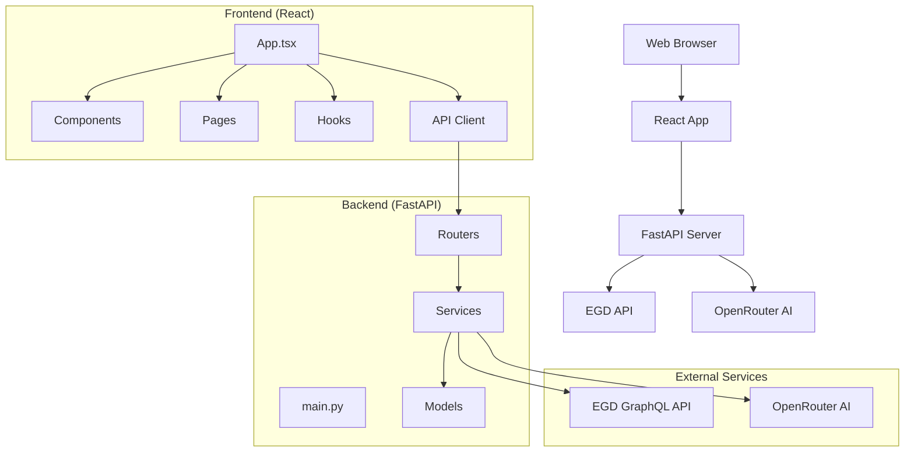
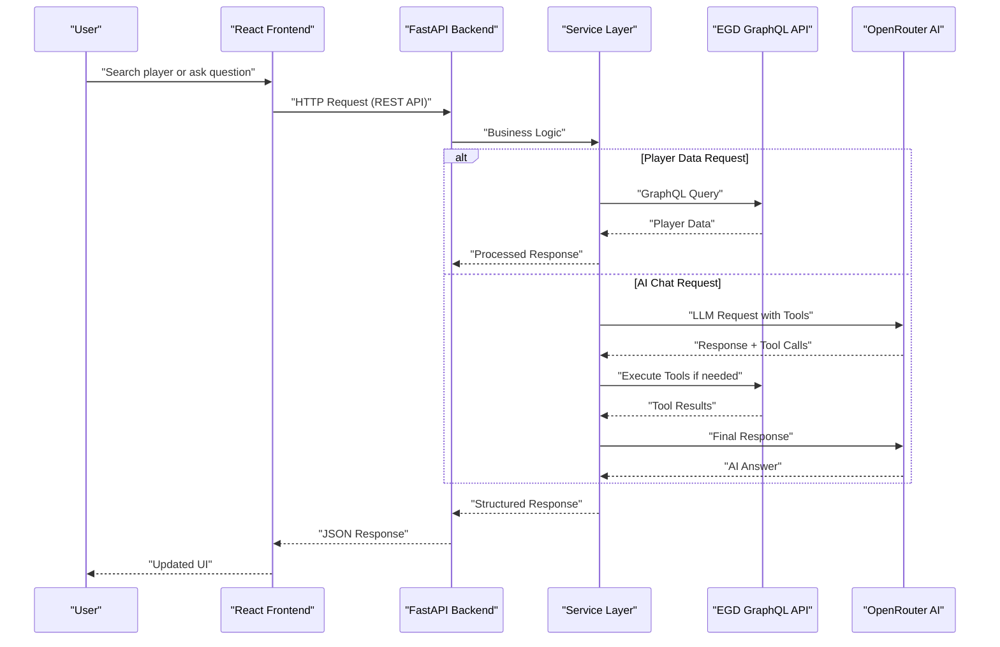
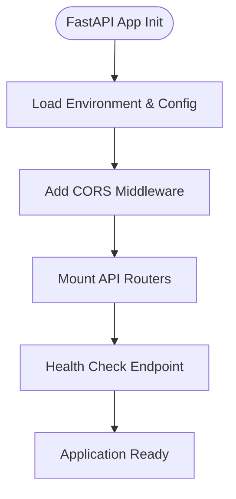
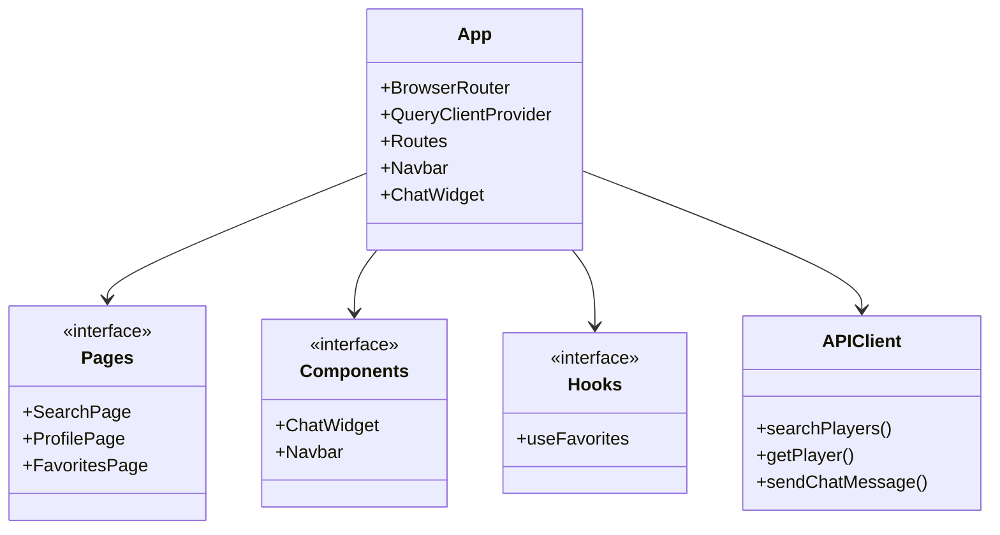
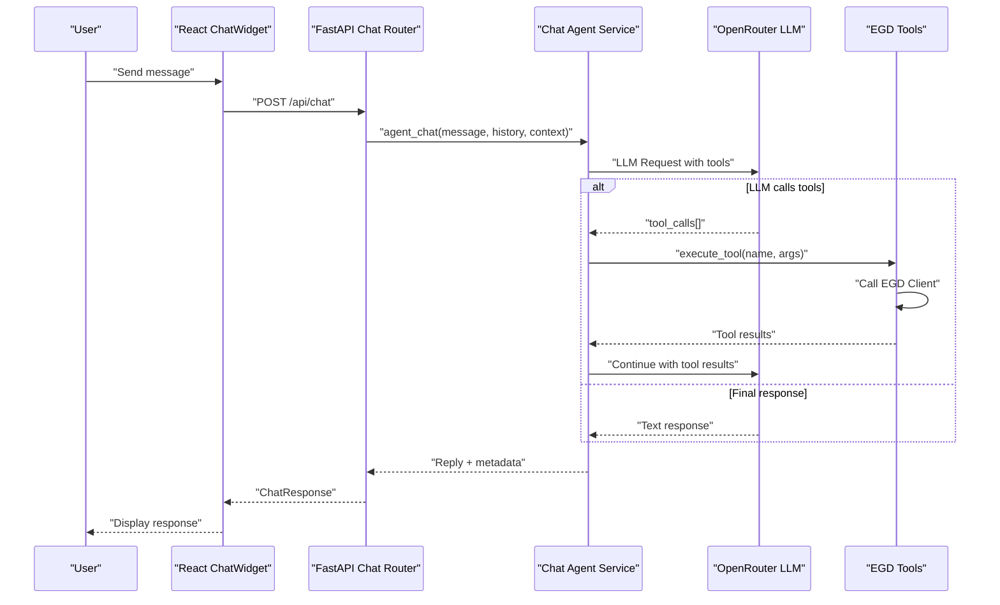
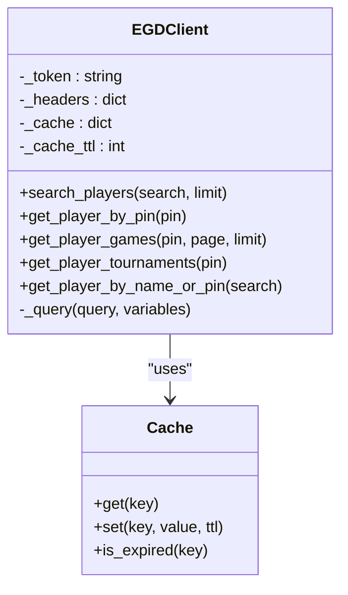
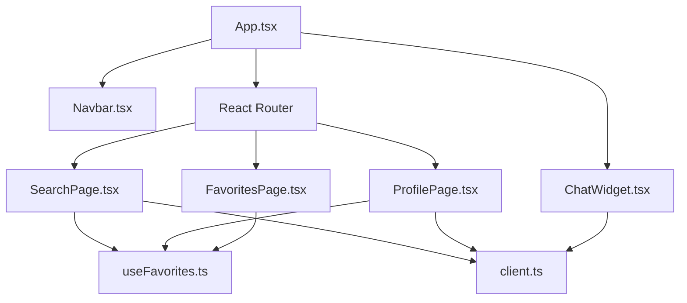
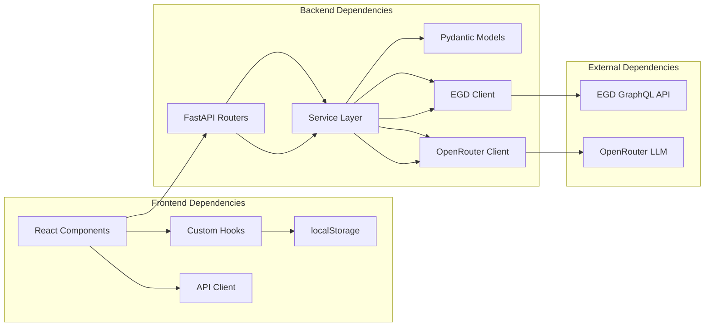

# Architecture Guide

<cite>
**Referenced Files in This Document**
- [main.py](file://backend/app/main.py)
- [chat.py](file://backend/app/routers/chat.py)
- [players.py](file://backend/app/routers/players.py)
- [chat_agent.py](file://backend/app/services/chat_agent.py)
- [egd_client.py](file://backend/app/services/egd_client.py)
- [egd_tools.py](file://backend/app/services/egd_tools.py)
- [chat.py](file://backend/app/models/chat.py)
- [player.py](file://backend/app/models/player.py)
- [App.tsx](file://frontend/src/App.tsx)
- [ChatWidget.tsx](file://frontend/src/components/ChatWidget.tsx)
- [client.ts](file://frontend/src/api/client.ts)
- [SearchPage.tsx](file://frontend/src/pages/SearchPage.tsx)
- [ProfilePage.tsx](file://frontend/src/pages/ProfilePage.tsx)
- [useFavorites.ts](file://frontend/src/hooks/useFavorites.ts)
</cite>

## Update Summary
**Changes Made**
- Updated project structure to reflect new React frontend and FastAPI backend architecture
- Added comprehensive documentation for AI chat assistant with agentic tool calling capabilities
- Documented EGD (European Go Database) integration layer with GraphQL API client
- Added React component architecture with state management and data visualization
- Updated architectural diagrams to show full-stack interactions including external APIs
- Enhanced cross-cutting concerns documentation for modern web application patterns

## Table of Contents
1. [Introduction](#introduction)
2. [Project Structure](#project-structure)
3. [Core Components](#core-components)
4. [Architecture Overview](#architecture-overview)
5. [Detailed Component Analysis](#detailed-component-analysis)
6. [AI Chat Assistant Architecture](#ai-chat-assistant-architecture)
7. [EGD Integration Layer](#egd-integration-layer)
8. [React Frontend Architecture](#react-frontend-architecture)
9. [Dependency Analysis](#dependency-analysis)
10. [Performance Considerations](#performance-considerations)
11. [Troubleshooting Guide](#troubleshooting-guide)
12. [Conclusion](#conclusion)

## Introduction
This guide describes the modern layered architecture of GoNow, featuring a React frontend, FastAPI backend, EGD (European Go Database) integration, and AI-powered chat assistant. The system implements separation of concerns through service-oriented design, MVC-inspired structure, and microservice-like boundaries between frontend and backend components. It explains how HTTP requests flow through the complete stack from React components to external APIs and back to user interfaces.

## Project Structure
The GoNow application follows a modern full-stack architecture with clear separation between frontend and backend:

**Updated** Complete restructuring to support modern full-stack architecture with React frontend, FastAPI backend, and external service integrations.

**Section sources**
- [main.py:1-42](file://backend/app/main.py#L1-L42)
- [App.tsx:1-37](file://frontend/src/App.tsx#L1-L37)

## Core Components
The GoNow architecture consists of several key layers with distinct responsibilities:

### Frontend Layer (React)
- **Components**: Reusable UI elements like ChatWidget, Navbar
- **Pages**: Feature-specific views like SearchPage, ProfilePage, FavoritesPage
- **State Management**: React Query for server state, custom hooks for local state
- **API Client**: Axios-based HTTP client with TypeScript interfaces

### Backend Layer (FastAPI)
- **Routers**: RESTful API endpoints handling request/response lifecycle
- **Services**: Business logic orchestration and external API integration
- **Models**: Pydantic models for data validation and serialization
- **Configuration**: CORS middleware, environment variables, app initialization

### External Integrations
- **EGD Client**: GraphQL API client with caching for European Go Database
- **AI Agent**: Agentic chat system with tool calling capabilities via OpenRouter

**Section sources**
- [main.py:14-31](file://backend/app/main.py#L14-L31)
- [App.tsx:18-36](file://frontend/src/App.tsx#L18-L36)

## Architecture Overview
The system follows a modern full-stack architecture where each request traverses well-defined boundaries across multiple layers:

**Updated** New sequence diagram showing complete full-stack interaction including AI agent workflow and EGD integration.

## Detailed Component Analysis

### FastAPI Backend Architecture

#### Application Entry Point
The main application initializes FastAPI with CORS middleware, router mounting, and health check endpoints.

**Section sources**
- [main.py:14-42](file://backend/app/main.py#L14-L42)

#### API Routers Layer
Routers handle HTTP request/response lifecycle with proper error handling and input validation:

- **Players Router**: `/api/search`, `/api/player/{pin}`, `/api/player/{pin}/games`
- **Chat Router**: `/api/chat` with agentic AI capabilities

**Section sources**
- [players.py:1-107](file://backend/app/routers/players.py#L1-L107)
- [chat.py:1-95](file://backend/app/routers/chat.py#L1-L95)

#### Service Layer Architecture
Services encapsulate business logic and external API integrations:

- **EGD Client**: GraphQL API client with caching and error handling
- **Chat Agent**: Agentic loop with tool calling and conversation management
- **EGD Tools**: Function definitions for AI tool calling

**Section sources**
- [egd_client.py:1-197](file://backend/app/services/egd_client.py#L1-L197)
- [chat_agent.py:1-154](file://backend/app/services/chat_agent.py#L1-L154)
- [egd_tools.py:1-212](file://backend/app/services/egd_tools.py#L1-L212)

### React Frontend Architecture

#### Application Structure
The React application uses modern patterns with React Router, React Query, and TypeScript:

**Section sources**
- [App.tsx:1-37](file://frontend/src/App.tsx#L1-L37)

#### State Management Patterns
- **Server State**: React Query with automatic caching and background updates
- **Local State**: Custom hooks with localStorage persistence
- **Component State**: useState for UI-only state management

**Section sources**
- [useFavorites.ts:1-49](file://frontend/src/hooks/useFavorites.ts#L1-L49)
- [client.ts:1-86](file://frontend/src/api/client.ts#L1-L86)

## AI Chat Assistant Architecture

### Agentic Chat System
The AI chat assistant implements an agentic pattern with tool calling capabilities:

**New** Comprehensive AI chat architecture showing agentic workflow with tool calling capabilities.

### Tool Calling System
The system supports five core tools for Go analytics:

1. **search_player**: Find players by name or PIN
2. **get_player_details**: Retrieve detailed player information
3. **get_player_rating_history**: Get rating evolution over time
4. **get_player_games**: Fetch recent game history
5. **compare_players**: Compare two players side-by-side

**Section sources**
- [chat_agent.py:30-154](file://backend/app/services/chat_agent.py#L30-L154)
- [egd_tools.py:5-99](file://backend/app/services/egd_tools.py#L5-L99)

## EGD Integration Layer

### GraphQL API Client
The EGD client provides a robust interface to the European Go Database with built-in caching:

**New** EGD client architecture showing caching strategy and GraphQL query execution.

### Caching Strategy
The implementation includes intelligent caching with configurable TTL (time-to-live):

- **Cache Key Generation**: Based on query and variables
- **TTL Configuration**: 5-minute default cache lifetime
- **Error Handling**: Graceful fallback when cache is unavailable

**Section sources**
- [egd_client.py:11-42](file://backend/app/services/egd_client.py#L11-L42)

## React Frontend Architecture

### Component Hierarchy
The frontend follows a modular component architecture with clear separation of concerns:

**New** React component hierarchy showing relationships between pages, components, and hooks.

### Data Flow Patterns
The application implements modern data fetching patterns:

- **Declarative Data Fetching**: React Query for server state management
- **Optimistic Updates**: Immediate UI feedback before server confirmation
- **Error Boundaries**: Graceful error handling and recovery
- **Caching Strategy**: Automatic caching with configurable stale times

**Section sources**
- [SearchPage.tsx:1-240](file://frontend/src/pages/SearchPage.tsx#L1-L240)
- [ProfilePage.tsx:1-298](file://frontend/src/pages/ProfilePage.tsx#L1-L298)
- [ChatWidget.tsx:1-240](file://frontend/src/components/ChatWidget.tsx#L1-L240)

## Dependency Analysis
The system follows unidirectional dependency flow with clear separation between layers:

**Updated** Complete dependency graph showing both frontend and backend relationships.

**Section sources**
- [main.py:12-31](file://backend/app/main.py#L12-L31)
- [App.tsx:1-37](file://frontend/src/App.tsx#L1-L37)

## Performance Considerations

### Frontend Optimization
- **Code Splitting**: React.lazy for route-based code splitting
- **Data Caching**: React Query with configurable stale times
- **Debounced Search**: Input debouncing for search functionality
- **Image Optimization**: Lazy loading and responsive images

### Backend Optimization
- **Connection Pooling**: HTTPX async clients for efficient API calls
- **Response Caching**: In-memory caching for EGD queries
- **Pagination**: Efficient data retrieval with pagination parameters
- **Async Processing**: Non-blocking operations for long-running tasks

### AI Service Optimization
- **Conversation History Limiting**: Truncating history to last 10 messages
- **Tool Call Caching**: Avoiding redundant tool executions
- **Timeout Configuration**: Appropriate timeouts for external services
- **Error Recovery**: Graceful degradation when AI services are unavailable

## Troubleshooting Guide

### Common Issues and Solutions

#### Frontend Issues
- **Network Errors**: Check CORS configuration and API endpoint availability
- **State Synchronization**: Verify React Query cache invalidation
- **Component Rendering**: Check conditional rendering and error boundaries
- **Local Storage**: Validate localStorage access and data format

#### Backend Issues
- **CORS Configuration**: Ensure proper origin configuration for development
- **Environment Variables**: Validate .env file setup and variable names
- **External API Errors**: Implement retry logic and graceful error handling
- **Memory Leaks**: Monitor async task cleanup and resource disposal

#### AI Service Issues
- **API Key Configuration**: Verify OpenRouter API key setup
- **Tool Execution Errors**: Implement fallback responses for failed tool calls
- **Conversation Context**: Manage conversation history size and relevance
- **Rate Limiting**: Handle API rate limits with exponential backoff

### Monitoring and Logging
- **Request Tracking**: Correlation IDs for request tracing
- **Error Reporting**: Structured error logging with context
- **Performance Metrics**: Response time monitoring for critical paths
- **Health Checks**: Endpoint availability and dependency status

## Conclusion
The GoNow architecture successfully combines modern web technologies with powerful AI capabilities to create a comprehensive Go analytics platform. The layered architecture ensures maintainability and scalability while providing rich user experiences through real-time data visualization and AI-powered insights. The separation of concerns between frontend, backend, and external services enables independent development and deployment while maintaining clear communication protocols.

The system's extensibility is enhanced through well-defined interfaces and modular design patterns, allowing for easy addition of new features such as additional AI tools, data sources, or frontend components. The comprehensive error handling and monitoring strategies ensure reliability and observability in production environments.