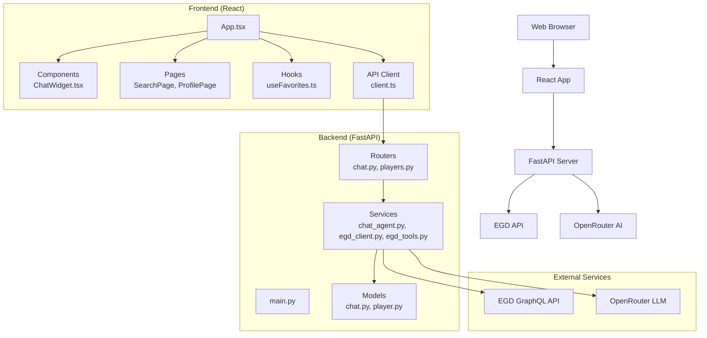
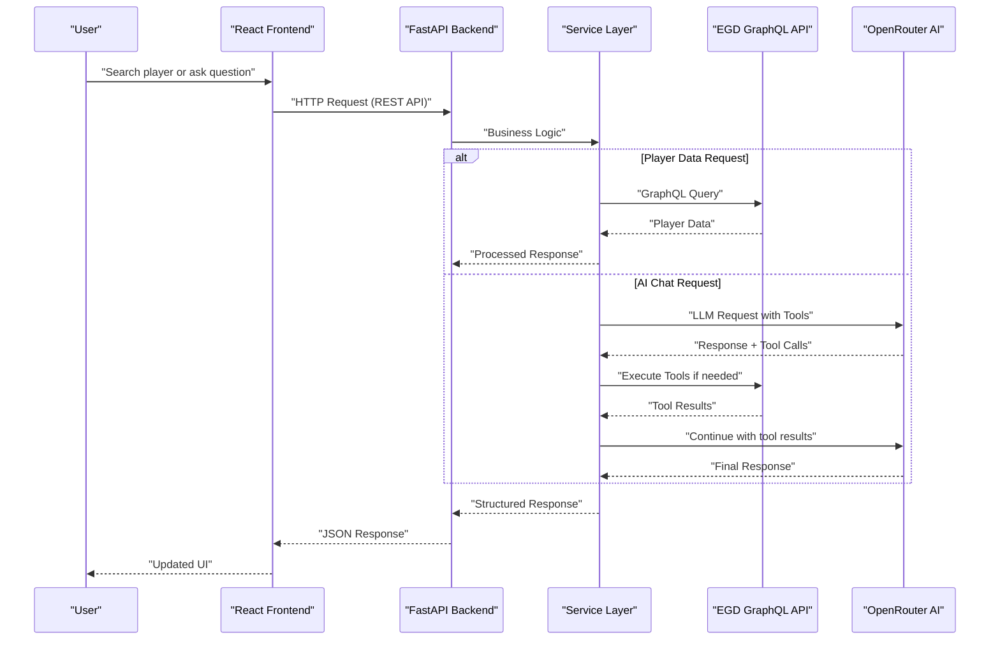
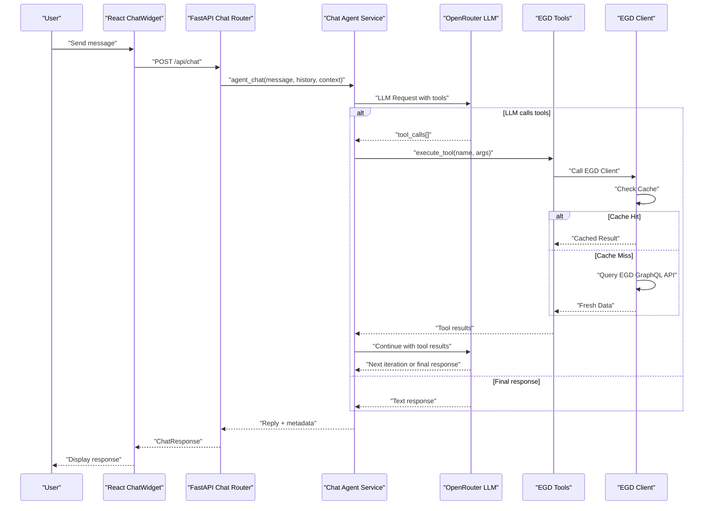
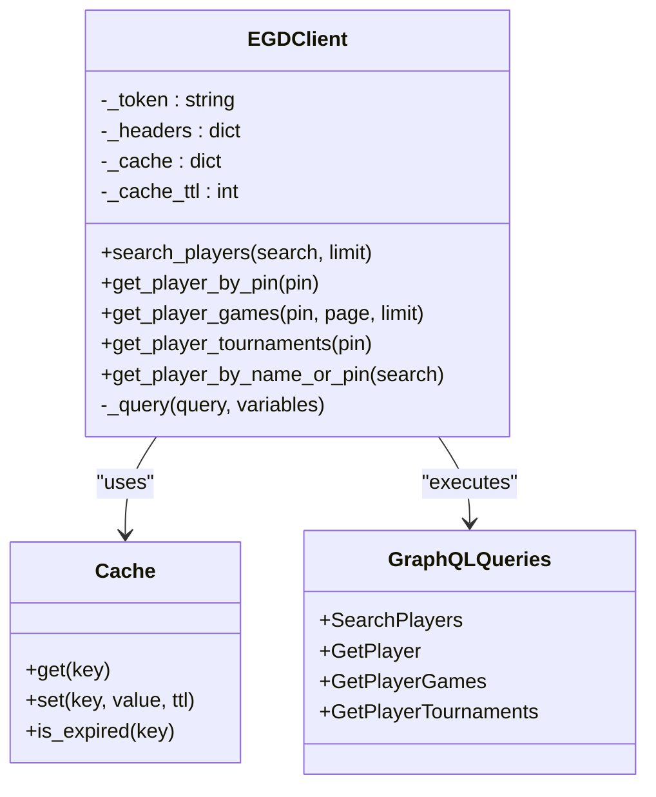
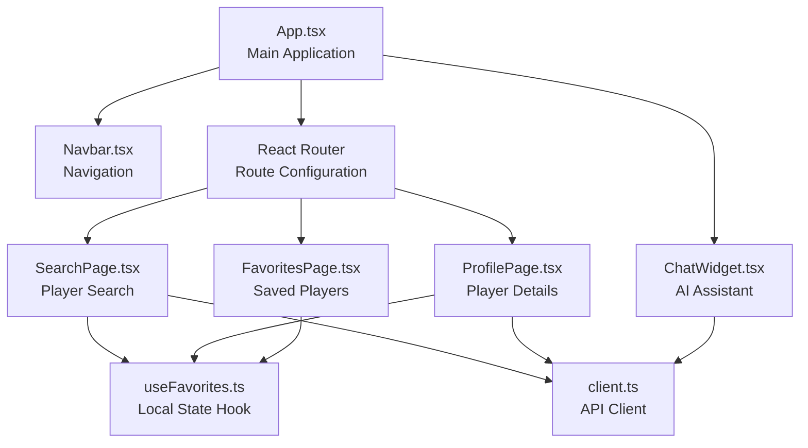
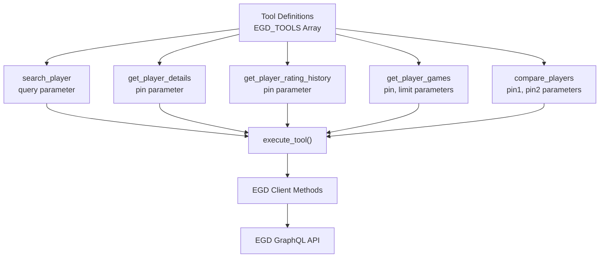
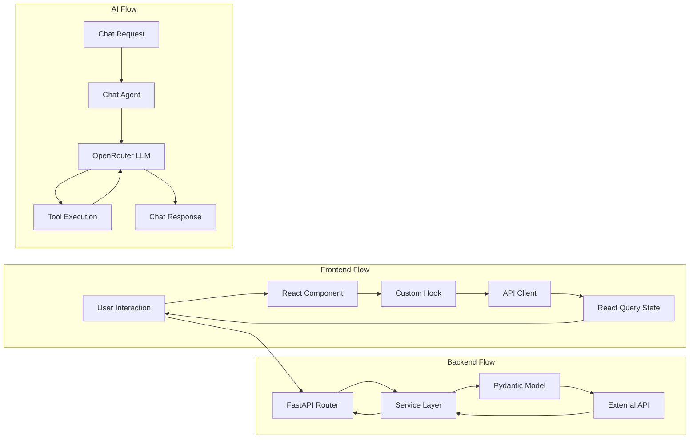

# Architecture Guide

<cite>
**Referenced Files in This Document**
- [main.py](file://backend/app/main.py)
- [chat.py](file://backend/app/routers/chat.py)
- [players.py](file://backend/app/routers/players.py)
- [chat_agent.py](file://backend/app/services/chat_agent.py)
- [egd_client.py](file://backend/app/services/egd_client.py)
- [egd_tools.py](file://backend/app/services/egd_tools.py)
- [chat.py](file://backend/app/models/chat.py)
- [player.py](file://backend/app/models/player.py)
- [App.tsx](file://frontend/src/App.tsx)
- [ChatWidget.tsx](file://frontend/src/components/ChatWidget.tsx)
- [client.ts](file://frontend/src/api/client.ts)
</cite>

## Update Summary
**Changes Made**
- Updated agentic chat architecture documentation with comprehensive ReAct pattern implementation details
- Added detailed OpenRouter tool calling system with five core EGD tools for Go analytics
- Enhanced EGD GraphQL API integration layer with caching strategy and error handling
- Documented complete backend/frontend component responsibilities and data flow patterns
- Added new architectural diagrams showing agentic workflow and tool execution cycles
- Updated cross-cutting concerns documentation for AI-powered features and external service integrations

## Table of Contents
1. [Introduction](#introduction)
2. [Project Structure](#project-structure)
3. [Core Components](#core-components)
4. [Architecture Overview](#architecture-overview)
5. [Agentic Chat System Architecture](#agentic-chat-system-architecture)
6. [EGD Integration Layer](#egd-integration-layer)
7. [React Frontend Architecture](#react-frontend-architecture)
8. [Tool Calling System](#tool-calling-system)
9. [Data Flow Patterns](#data-flow-patterns)
10. [Performance Considerations](#performance-considerations)
11. [Error Handling and Resilience](#error-handling-and-resilience)
12. [Extension Points and Integration](#extension-points-and-integration)
13. [Conclusion](#conclusion)

## Introduction
This guide describes the modern layered architecture of GoNow, featuring a React frontend, FastAPI backend, EGD (European Go Database) integration, and AI-powered agentic chat assistant. The system implements separation of concerns through service-oriented design, MVC-inspired structure, and microservice-like boundaries between frontend and backend components. It explains how HTTP requests flow through the complete stack from React components to external APIs and back to user interfaces, with special emphasis on the agentic chat system that uses ReAct patterns and tool calling capabilities.

## Project Structure
The GoNow application follows a modern full-stack architecture with clear separation between frontend and backend:

**Updated** Complete restructuring to support modern full-stack architecture with React frontend, FastAPI backend, and external service integrations including AI agent capabilities.

**Section sources**
- [main.py:1-42](file://backend/app/main.py#L1-L42)
- [App.tsx:1-37](file://frontend/src/App.tsx#L1-L37)

## Core Components
The GoNow architecture consists of several key layers with distinct responsibilities:

### Frontend Layer (React)
- **Components**: Reusable UI elements like ChatWidget, Navbar with stone-themed design
- **Pages**: Feature-specific views like SearchPage, ProfilePage, FavoritesPage
- **State Management**: React Query for server state, custom hooks for local state
- **API Client**: Axios-based HTTP client with TypeScript interfaces and error handling

### Backend Layer (FastAPI)
- **Routers**: RESTful API endpoints handling request/response lifecycle with validation
- **Services**: Business logic orchestration, external API integration, and agentic workflows
- **Models**: Pydantic models for data validation and serialization
- **Configuration**: CORS middleware, environment variables, app initialization

### External Integrations
- **EGD Client**: GraphQL API client with caching and error handling for European Go Database
- **AI Agent**: Agentic chat system with ReAct pattern implementation and tool calling via OpenRouter

**Section sources**
- [main.py:14-31](file://backend/app/main.py#L14-L31)
- [App.tsx:18-36](file://frontend/src/App.tsx#L18-L36)

## Architecture Overview
The system follows a modern full-stack architecture where each request traverses well-defined boundaries across multiple layers:

**Updated** New sequence diagram showing complete full-stack interaction including AI agent workflow and EGD integration.

## Agentic Chat System Architecture

### ReAct Pattern Implementation
The AI chat assistant implements a sophisticated ReAct (Reasoning and Acting) pattern with agentic tool calling capabilities:

**New** Comprehensive AI chat architecture showing agentic workflow with ReAct pattern, tool calling capabilities, and EGD integration.

### Agentic Loop Mechanics
The chat agent implements a sophisticated loop mechanism:

1. **Initial Request**: Send user message with system prompt and available tools to OpenRouter
2. **Tool Detection**: Check if LLM responds with tool_calls array
3. **Tool Execution**: Execute requested tools and collect results
4. **Context Enhancement**: Feed tool results back to LLM for reasoning
5. **Iteration Control**: Limit iterations to prevent infinite loops (default: 3)
6. **Fallback Strategy**: Force text response if max iterations reached

**Section sources**
- [chat_agent.py:30-154](file://backend/app/services/chat_agent.py#L30-L154)

## EGD Integration Layer

### GraphQL API Client Architecture
The EGD client provides a robust interface to the European Go Database with built-in caching and error handling:

**New** EGD client architecture showing caching strategy, GraphQL query execution, and class relationships.

### Caching Strategy Implementation
The implementation includes intelligent caching with configurable TTL (time-to-live):

- **Cache Key Generation**: Based on query string and variables for unique identification
- **TTL Configuration**: 5-minute default cache lifetime for optimal performance
- **Memory Storage**: In-memory dictionary for fast access during runtime
- **Error Handling**: Graceful fallback when cache is unavailable or corrupted

**Section sources**
- [egd_client.py:11-42](file://backend/app/services/egd_client.py#L11-L42)

## React Frontend Architecture

### Component Hierarchy and Responsibilities
The frontend follows a modular component architecture with clear separation of concerns:

**New** React component hierarchy showing relationships between pages, components, hooks, and API client.

### Chat Widget Implementation
The ChatWidget component provides an interactive AI assistant interface:

- **Floating Interface**: Stone-themed floating action button with expandable chat window
- **Message History**: Persistent conversation state with auto-scroll functionality
- **Loading States**: Visual feedback during AI processing and tool execution
- **Quick Prompts**: Predefined prompts for common Go-related queries
- **Responsive Design**: Mobile-friendly interface with adaptive sizing

**Section sources**
- [ChatWidget.tsx:1-240](file://frontend/src/components/ChatWidget.tsx#L1-L240)

### State Management Patterns
- **Server State**: React Query with automatic caching and background updates
- **Local State**: Custom hooks with localStorage persistence for favorites
- **Component State**: useState for UI-only state management
- **Conversation State**: Message history management with role-based formatting

**Section sources**
- [client.ts:1-86](file://frontend/src/api/client.ts#L1-86)

## Tool Calling System

### Available EGD Tools
The system supports five core tools for Go analytics through function calling:

1. **search_player**: Find players by name or PIN with fuzzy matching
2. **get_player_details**: Retrieve detailed player information including biography and stats
3. **get_player_rating_history**: Get rating evolution over time from tournament results
4. **get_player_games**: Fetch recent game history with opponents and results
5. **compare_players**: Compare two players side-by-side with head-to-head analysis

### Tool Schema Definition
Each tool is defined with OpenAI-compatible function schemas:

**New** Tool calling system architecture showing schema definitions and execution flow.

### Tool Execution Engine
The execute_tool function provides centralized tool dispatch with error handling:

- **Parameter Validation**: Type checking and required parameter verification
- **Error Propagation**: Structured error responses for failed operations
- **Result Formatting**: Consistent response format with success/failure indicators
- **Logging**: Tool call tracking for debugging and analytics

**Section sources**
- [chat_agent.py:30-154](file://backend/app/services/chat_agent.py#L30-L154)
- [egd_tools.py:5-99](file://backend/app/services/egd_tools.py#L5-L99)

## Data Flow Patterns

### Request Processing Pipeline
The application implements a unidirectional data flow pattern:

**Updated** Complete data flow diagram showing frontend, backend, and AI processing pipelines.

### Error Handling Strategies
- **Frontend**: Try-catch blocks with user-friendly error messages
- **Backend**: HTTPException handling with appropriate status codes
- **External APIs**: Retry logic and graceful degradation
- **AI Services**: Fallback responses and timeout handling

## Performance Considerations

### Frontend Optimization
- **Code Splitting**: React.lazy for route-based code splitting
- **Data Caching**: React Query with configurable stale times (30 seconds default)
- **Debounced Search**: Input debouncing for search functionality
- **Image Optimization**: Lazy loading and responsive images

### Backend Optimization
- **Connection Pooling**: HTTPX async clients for efficient API calls
- **Response Caching**: In-memory caching for EGD queries (5-minute TTL)
- **Pagination**: Efficient data retrieval with pagination parameters
- **Async Processing**: Non-blocking operations for long-running tasks

### AI Service Optimization
- **Conversation History Limiting**: Truncating history to last 10 messages
- **Tool Call Caching**: Avoiding redundant tool executions
- **Timeout Configuration**: Appropriate timeouts for external services (30-60 seconds)
- **Error Recovery**: Graceful degradation when AI services are unavailable
- **Iteration Limits**: Maximum 3 iterations to prevent infinite loops

## Error Handling and Resilience

### Multi-Layer Error Strategy
The system implements comprehensive error handling across all layers:

#### Frontend Error Handling
- **Network Errors**: Connection timeout and retry logic
- **API Errors**: HTTP status code handling with user feedback
- **State Errors**: Invalid data handling and recovery mechanisms
- **UI Errors**: Component-level error boundaries and fallback states

#### Backend Error Handling
- **Validation Errors**: Pydantic model validation with descriptive messages
- **External API Errors**: Timeout handling and circuit breaker patterns
- **Database Errors**: Connection pooling and retry strategies
- **AI Service Errors**: Fallback responses and graceful degradation

#### AI Service Error Handling
- **API Key Validation**: Early detection of missing configuration
- **Rate Limiting**: Exponential backoff for rate-limited requests
- **Tool Execution Errors**: Individual tool failure isolation
- **Conversation Context**: Context preservation across errors

### Monitoring and Observability
- **Request Tracking**: Correlation IDs for request tracing
- **Error Reporting**: Structured error logging with context
- **Performance Metrics**: Response time monitoring for critical paths
- **Health Checks**: Endpoint availability and dependency status

## Extension Points and Integration

### Adding New AI Tools
The tool calling system provides clear extension points:

1. **Tool Definition**: Add new function schema to EGD_TOOLS array
2. **Implementation**: Implement tool logic in execute_tool function
3. **Testing**: Unit tests for tool behavior and error cases
4. **Documentation**: Update system prompt and user-facing descriptions

### Extending EGD Client
New GraphQL queries can be added following established patterns:

1. **Query Definition**: Add new GraphQL query method to EGDClient class
2. **Caching**: Implement cache key generation and TTL configuration
3. **Error Handling**: Add appropriate error handling and logging
4. **Type Safety**: Define TypeScript interfaces for frontend consumption

### Frontend Component Extensions
New features can be integrated through established patterns:

1. **Component Architecture**: Follow existing component structure and styling
2. **State Management**: Use React Query for server state, custom hooks for local state
3. **API Integration**: Extend client.ts with new API methods
4. **Routing**: Add new routes following React Router patterns

## Conclusion
The GoNow architecture successfully combines modern web technologies with powerful AI capabilities to create a comprehensive Go analytics platform. The layered architecture ensures maintainability and scalability while providing rich user experiences through real-time data visualization and AI-powered insights. The agentic chat system with ReAct pattern implementation enables sophisticated tool calling and multi-step reasoning capabilities.

The system's extensibility is enhanced through well-defined interfaces and modular design patterns, allowing for easy addition of new AI tools, data sources, or frontend components. The comprehensive error handling and monitoring strategies ensure reliability and observability in production environments. The separation of concerns between frontend, backend, and external services enables independent development and deployment while maintaining clear communication protocols.

The agentic architecture demonstrates advanced AI integration patterns, including tool calling, conversation management, and iterative reasoning, making it suitable for complex analytical tasks beyond simple chat interactions. The EGD integration provides robust data access with caching and error handling, ensuring reliable performance even under high load conditions.