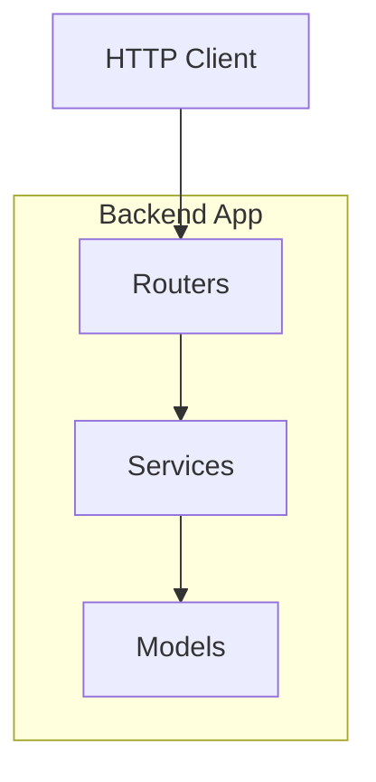
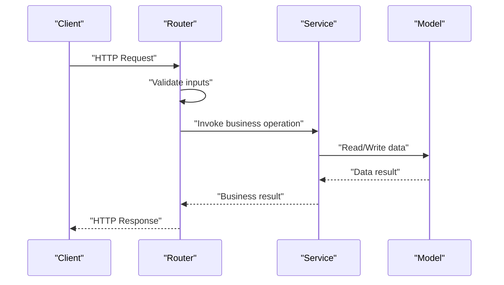
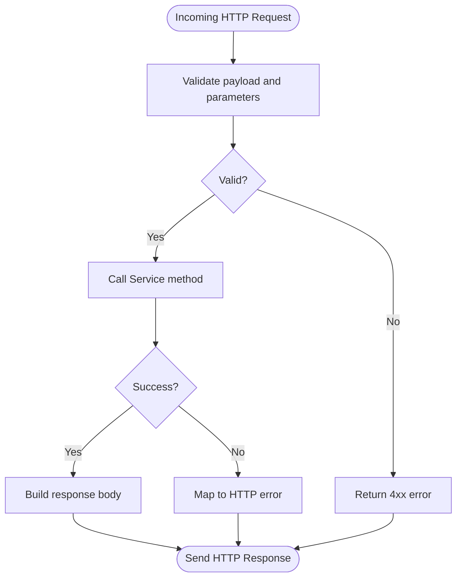
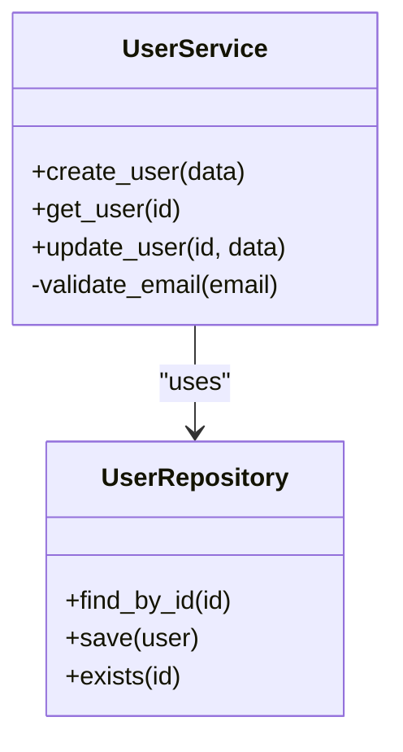
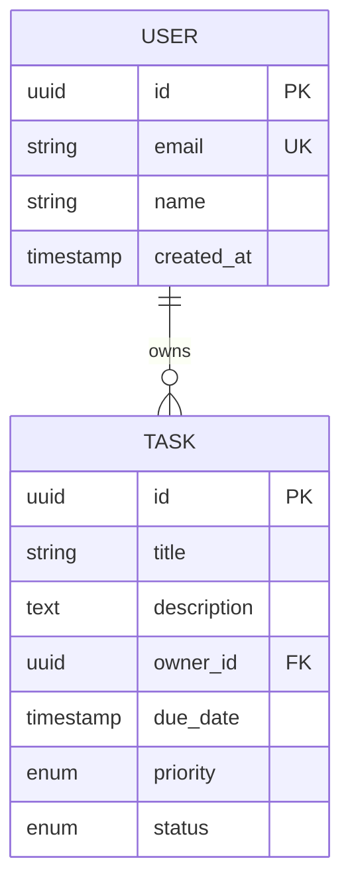
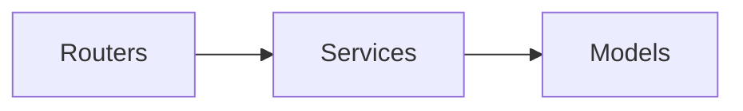

# Component Responsibilities

<cite>
**Referenced Files in This Document**
- [__init__.py](file://backend/app/__init__.py)
- [routers/__init__.py](file://backend/app/routers/__init__.py)
</cite>

## Table of Contents
1. [Introduction](#introduction)
2. [Project Structure](#project-structure)
3. [Core Components](#core-components)
4. [Architecture Overview](#architecture-overview)
5. [Detailed Component Analysis](#detailed-component-analysis)
6. [Dependency Analysis](#dependency-analysis)
7. [Performance Considerations](#performance-considerations)
8. [Troubleshooting Guide](#troubleshooting-guide)
9. [Conclusion](#conclusion)

## Introduction
This document defines the responsibilities and interactions of the core components in the GoNow backend architecture: Routers, Services, and Models. It explains how HTTP requests flow through the system, where business logic is encapsulated, and how data structures and persistence are organized. The guidance emphasizes clean separation of concerns and low coupling between layers to improve maintainability and testability.

## Project Structure
The backend follows a layered structure with clear directories for each concern:
- Routers: Handle HTTP request/response lifecycle and input validation
- Services: Encapsulate business logic and orchestrate operations
- Models: Define data structures and persistence logic

[No sources needed since this diagram shows conceptual workflow, not actual code structure]

**Section sources**
- [__init__.py](file://backend/app/__init__.py)
- [routers/__init__.py](file://backend/app/routers/__init__.py)

## Core Components
- Routers
  - Responsibility: Parse incoming HTTP requests, validate inputs, coordinate responses, and delegate domain work to services.
  - Input validation: Enforce schema constraints and return standardized error responses when invalid.
  - Response handling: Serialize results into appropriate formats and set correct status codes.
- Services
  - Responsibility: Implement business rules, orchestrate multi-step operations, and coordinate calls to models or external systems.
  - Orchestration: Compose multiple model operations and handle cross-cutting concerns such as transactions or retries at this layer.
- Models
  - Responsibility: Represent domain entities, define fields and constraints, and implement persistence logic (e.g., CRUD).
  - Data access: Provide methods to read/write data to storage backends while hiding implementation details from higher layers.

Guidelines for clean separation:
- Keep routers thin; avoid business logic here.
- Keep services free of HTTP-specific concerns.
- Keep models focused on data and persistence; do not embed HTTP or service orchestration.
- Use dependency injection or explicit imports to reduce tight coupling.
- Prefer small, single-purpose functions/methods within each layer.

**Section sources**
- [__init__.py](file://backend/app/__init__.py)
- [routers/__init__.py](file://backend/app/routers/__init__.py)

## Architecture Overview
The typical request flow moves from Routers to Services to Models:
- Router receives an HTTP request, validates inputs, and calls a Service method.
- Service applies business logic and invokes one or more Model methods.
- Model performs persistence operations and returns data.
- Service aggregates results and returns them to the Router.
- Router serializes the response and sends it back to the client.

[No sources needed since this diagram shows conceptual workflow, not actual code structure]

## Detailed Component Analysis

### Routers
- Role: Entry point for HTTP traffic; responsible for parsing, validating, and responding.
- Typical responsibilities:
  - Route definitions mapping endpoints to handler functions.
  - Input validation using schemas or validators.
  - Error mapping to consistent HTTP error responses.
  - Delegation to Services for domain work.
- Example organization pattern:
  - Group routes by feature or resource under the routers directory.
  - Each route file should import only what it needs (services, validators) and remain free of business logic.

[No sources needed since this diagram shows conceptual workflow, not actual code structure]

**Section sources**
- [routers/__init__.py](file://backend/app/routers/__init__.py)

### Services
- Role: Business logic orchestrator; coordinates multiple models and external calls.
- Typical responsibilities:
  - Implement use cases that span multiple entities.
  - Apply domain rules and invariants.
  - Manage transactions or compensating actions.
  - Return plain domain objects or DTOs to routers.
- Example organization pattern:
  - One service per bounded context or major feature.
  - Methods should be small and focused; compose larger workflows from smaller steps.

[No sources needed since this diagram shows conceptual workflow, not actual code structure]

**Section sources**
- [__init__.py](file://backend/app/__init__.py)

### Models
- Role: Data representation and persistence.
- Typical responsibilities:
  - Define entity schemas with field types and constraints.
  - Implement CRUD operations and queries.
  - Encapsulate storage-specific details behind simple interfaces.
- Example organization pattern:
  - One model per entity/resource.
  - Keep persistence logic isolated from business rules.

[No sources needed since this diagram shows conceptual workflow, not actual code structure]

**Section sources**
- [__init__.py](file://backend/app/__init__.py)

## Dependency Analysis
Layered dependencies ensure stability and testability:
- Routers depend on Services.
- Services depend on Models.
- Models have no dependencies on higher layers.

[No sources needed since this diagram shows conceptual workflow, not actual code structure]

Guidelines to avoid tight coupling:
- Import only the minimal required modules in each component.
- Use interfaces or abstract base classes for Models when testing Services.
- Avoid importing Routers inside Services or Models.
- Centralize configuration and shared constants outside of these layers.

**Section sources**
- [__init__.py](file://backend/app/__init__.py)
- [routers/__init__.py](file://backend/app/routers/__init__.py)

## Performance Considerations
- Keep routers fast and stateless; offload heavy work to Services.
- Batch database operations in Models to reduce round-trips.
- Cache frequently accessed data at the Service layer when appropriate.
- Validate early in Routers to fail fast and avoid unnecessary processing.

[No sources needed since this section provides general guidance]

## Troubleshooting Guide
Common issues and remedies:
- Tight coupling symptoms:
  - Symptoms: Hard-to-test code, circular imports, changes in one layer ripple across others.
  - Remedies: Introduce abstractions, move shared logic to utilities, and enforce layer boundaries.
- Validation errors leaking into business logic:
  - Symptoms: Services contain validation checks.
  - Remedies: Move validation to Routers or dedicated validators; pass validated payloads to Services.
- Persistence logic in Services:
  - Symptoms: SQL or ORM calls scattered in Services.
  - Remedies: Move data access to Models; keep Services focused on orchestration.

[No sources needed since this section provides general guidance]

## Conclusion
Adhering to clear component responsibilities—Routers for HTTP concerns, Services for business orchestration, and Models for data and persistence—produces a maintainable and testable backend. Maintain strict dependency direction (Routers → Services → Models), keep each layer thin, and prefer composition over inheritance to minimize coupling.

[No sources needed since this section summarizes without analyzing specific files]