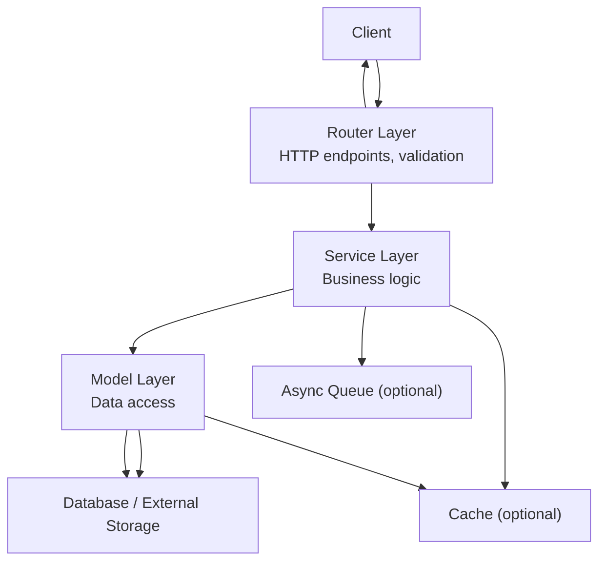
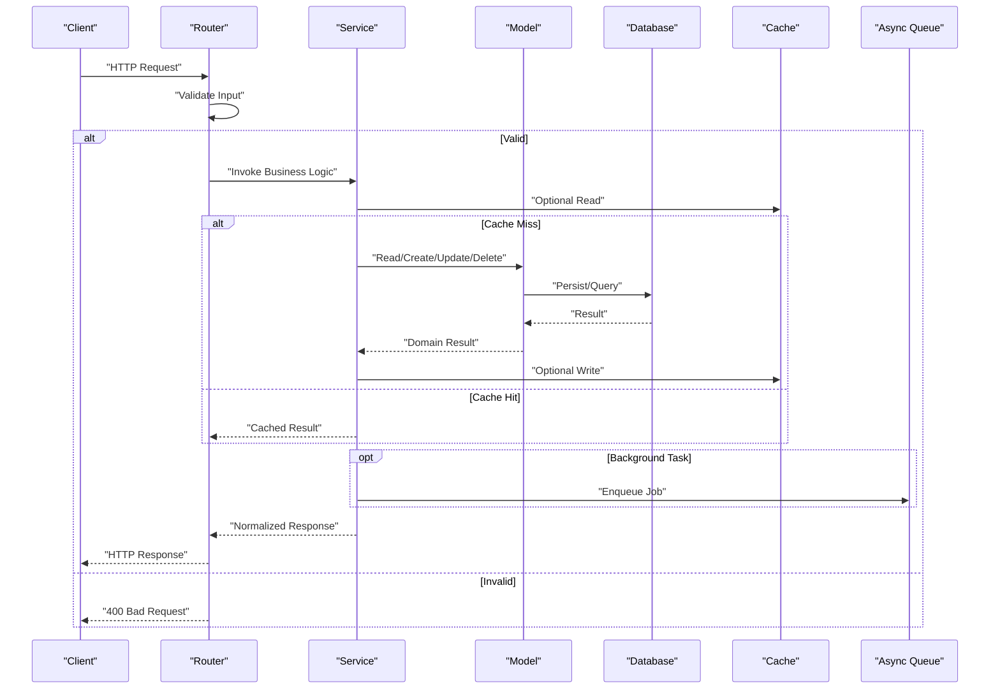
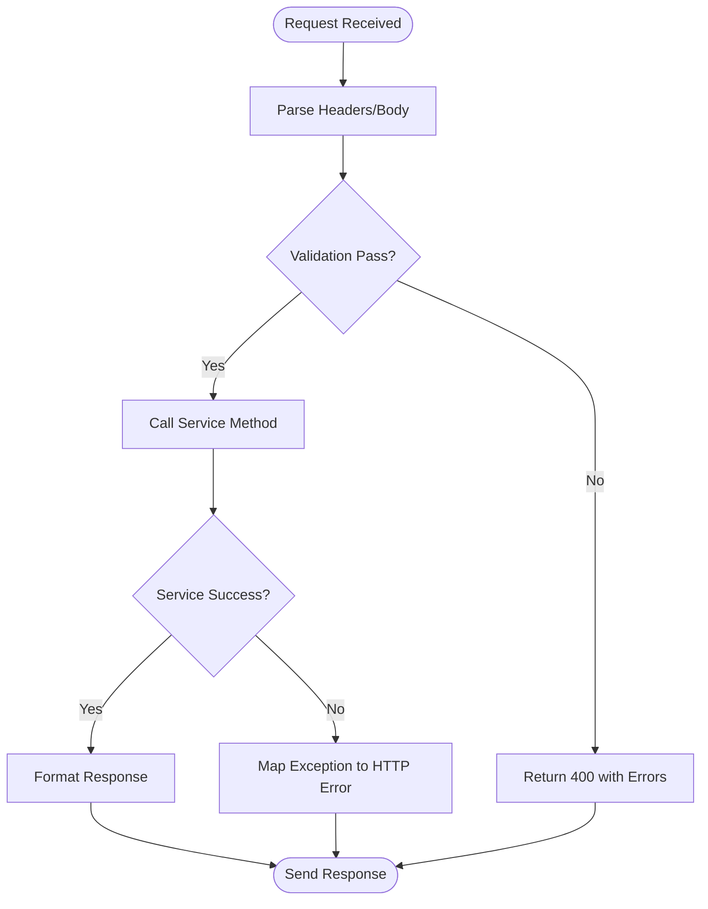
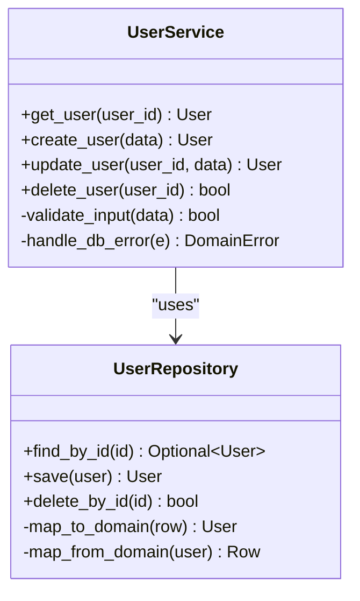
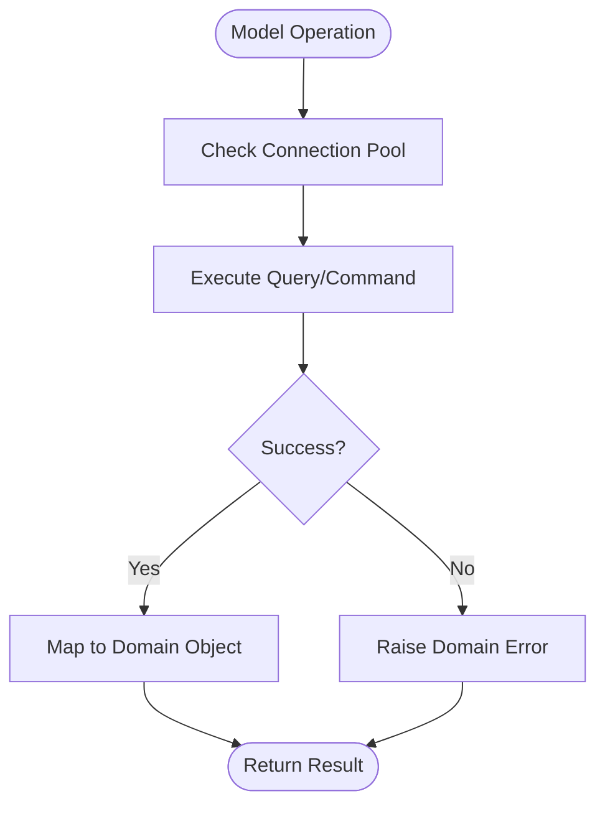
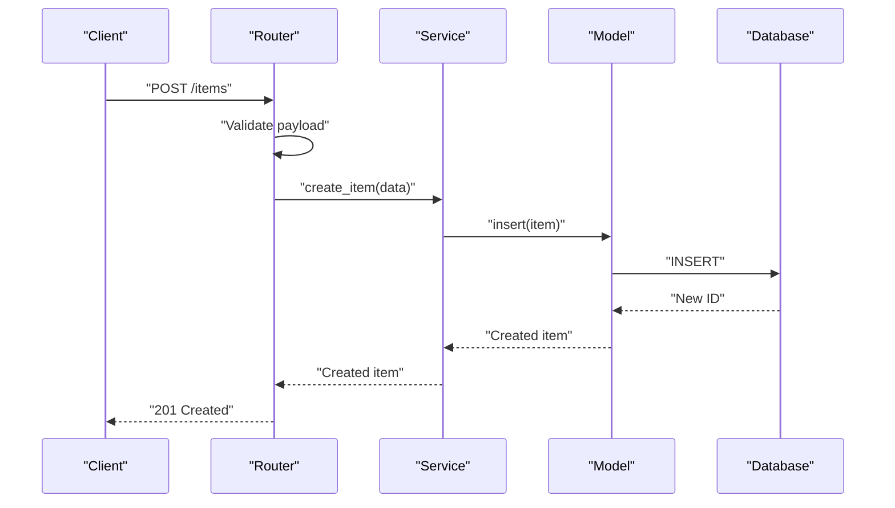
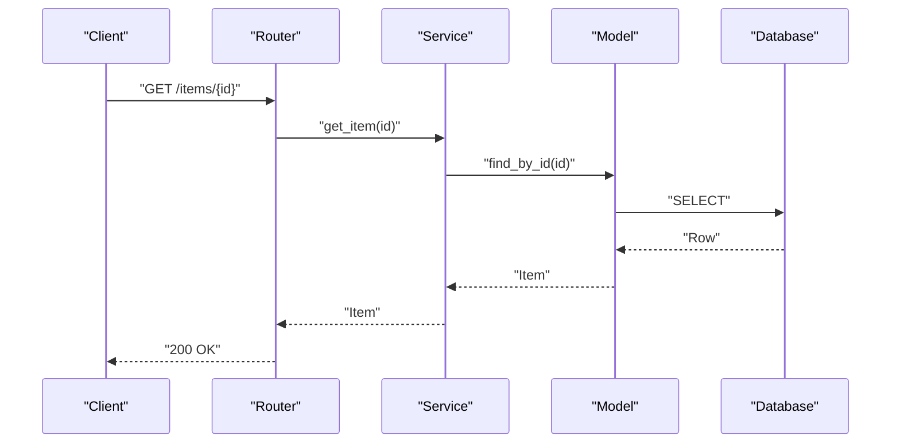
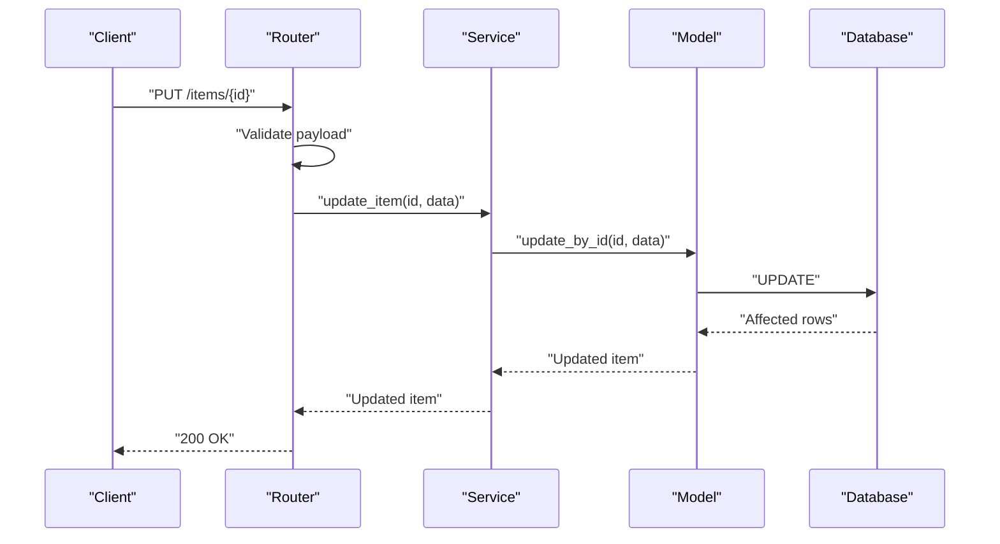
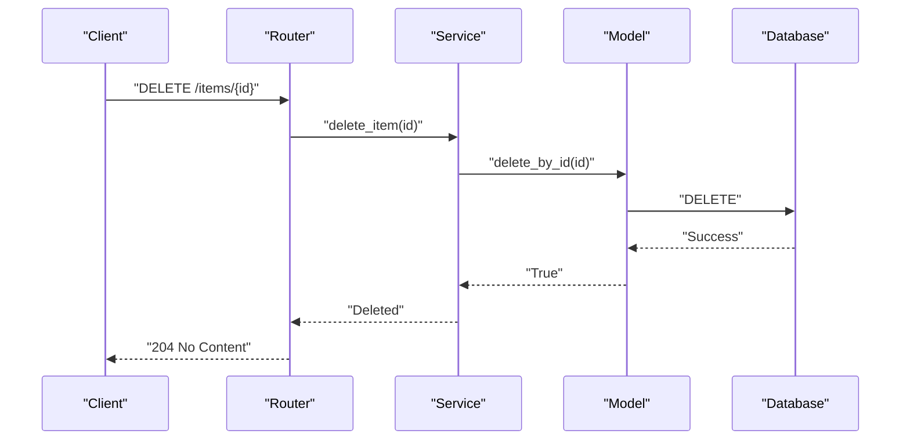
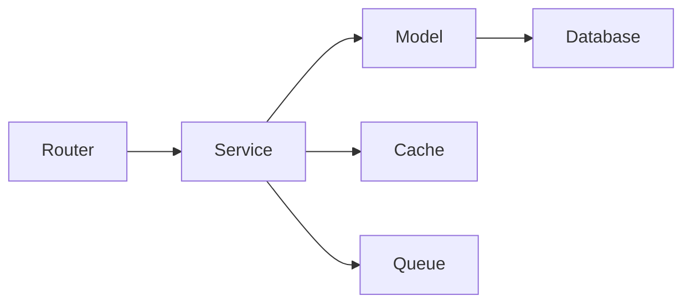

# Data Flow Design

<cite>
**Referenced Files in This Document**
- [__init__.py](file://backend/app/__init__.py)
- [__init__.py](file://backend/app/routers/__init__.py)
</cite>

## Table of Contents
1. [Introduction](#introduction)
2. [Project Structure](#project-structure)
3. [Core Components](#core-components)
4. [Architecture Overview](#architecture-overview)
5. [Detailed Component Analysis](#detailed-component-analysis)
6. [Dependency Analysis](#dependency-analysis)
7. [Performance Considerations](#performance-considerations)
8. [Troubleshooting Guide](#troubleshooting-guide)
9. [Conclusion](#conclusion)

## Introduction
This document describes the data flow design for a layered application with clear separation between routing, services, and models. It explains how an HTTP request flows through the Router layer into Services for business logic, then to Models for data operations, and finally back to the client as a response. It also covers error handling propagation, validation flows, exception management, performance considerations (including caching and asynchronous processing), and troubleshooting guidance for common issues.

## Project Structure
The project follows a layered architecture:
- Routers: Handle HTTP requests and responses, perform input validation, and delegate to services.
- Services: Implement business logic, orchestrate workflows, and interact with models.
- Models: Encapsulate data access and persistence operations.

[No sources needed since this diagram shows conceptual workflow, not actual code structure]

## Core Components
- Router Layer
  - Responsibilities: Parse incoming HTTP requests, validate inputs, call service methods, and format responses.
  - Error Handling: Convert exceptions to appropriate HTTP status codes and structured error payloads.
  - Validation: Apply schema or rule-based validation before invoking services.

- Service Layer
  - Responsibilities: Orchestrate business processes, enforce domain rules, coordinate multiple models, and manage transactions.
  - Error Handling: Translate low-level errors into domain-specific exceptions; propagate meaningful messages upward.
  - Caching/Async: Optionally read/write cache and enqueue background tasks.

- Model Layer
  - Responsibilities: Perform CRUD operations, query transformations, and persistence.
  - Error Handling: Surface database or I/O errors consistently; map them to domain exceptions when necessary.
  - Performance: Use connection pooling, pagination, and selective field projection.

**Section sources**
- [__init__.py](file://backend/app/__init__.py)
- [__init__.py](file://backend/app/routers/__init__.py)

## Architecture Overview
The end-to-end request-response cycle is designed for clarity and resilience:
- Request arrives at Router, which validates and delegates to Service.
- Service executes business logic, interacts with Cache and/or Queue if applicable, and calls Model for data operations.
- Model performs data access and returns results or raises exceptions.
- Service handles exceptions, applies business rules, and returns normalized results.
- Router formats the response and sends it back to the client.

[No sources needed since this diagram shows conceptual workflow, not actual code structure]

## Detailed Component Analysis

### Router Layer
- Entry points are defined under routers. The module initialization indicates where routes are registered and how they integrate with the application framework.
- Typical responsibilities:
  - Route registration and URL mapping.
  - Request parsing and parameter extraction.
  - Input validation using schemas or custom validators.
  - Delegation to service functions/classes.
  - Response formatting and error translation.

[No sources needed since this diagram shows conceptual workflow, not actual code structure]

**Section sources**
- [__init__.py](file://backend/app/routers/__init__.py)

### Service Layer
- Orchestrates business logic across one or more models.
- Manages cross-cutting concerns such as caching and async jobs.
- Ensures consistent error semantics by converting low-level exceptions into domain exceptions.

[No sources needed since this diagram shows conceptual workflow, not actual code structure]

**Section sources**
- [__init__.py](file://backend/app/__init__.py)

### Model Layer
- Implements data access patterns (CRUD).
- Maps between domain objects and storage representations.
- Handles connection lifecycle and resource cleanup.

[No sources needed since this diagram shows conceptual workflow, not actual code structure]

**Section sources**
- [__init__.py](file://backend/app/__init__.py)

### Typical CRUD Sequence Diagrams

#### Create

[No sources needed since this diagram shows conceptual workflow, not actual code structure]

#### Read

[No sources needed since this diagram shows conceptual workflow, not actual code structure]

#### Update

[No sources needed since this diagram shows conceptual workflow, not actual code structure]

#### Delete

[No sources needed since this diagram shows conceptual workflow, not actual code structure]

## Dependency Analysis
High-level dependencies among layers:
- Router depends on Service interfaces.
- Service depends on Model interfaces and optional external components (cache, queue).
- Model depends on database drivers and connection pools.

[No sources needed since this diagram shows conceptual workflow, not actual code structure]

**Section sources**
- [__init__.py](file://backend/app/__init__.py)
- [__init__.py](file://backend/app/routers/__init__.py)

## Performance Considerations
- Connection Management
  - Use connection pooling for databases to reduce overhead.
  - Ensure proper connection lifecycle and release on errors.
- Caching Strategies
  - Read-through cache for frequent reads with short TTLs.
  - Write-through or write-behind strategies depending on consistency needs.
  - Cache invalidation policies tied to domain events or explicit updates.
- Asynchronous Processing
  - Offload long-running tasks (e.g., notifications, reports) to a queue.
  - Use idempotent job design and retry policies with exponential backoff.
- Query Optimization
  - Select only required fields.
  - Use pagination and cursor-based navigation for large datasets.
  - Leverage indexes and avoid N+1 queries.
- Concurrency Control
  - Apply optimistic locking for concurrent updates.
  - Use distributed locks for critical sections when necessary.

[No sources needed since this section provides general guidance]

## Troubleshooting Guide
Common data flow issues and resolutions:
- Validation Failures
  - Symptom: 400 Bad Request with detailed field errors.
  - Action: Inspect router validation rules and ensure client payloads match schemas.
- Missing or Incorrect IDs
  - Symptom: 404 Not Found during read/update/delete.
  - Action: Verify route parameters and model lookup logic; add existence checks.
- Database Errors
  - Symptom: 500 Internal Server Error or domain exceptions from models.
  - Action: Check connection pool health, SQL/query correctness, and index usage.
- Cache Inconsistencies
  - Symptom: Stale reads after updates.
  - Action: Review cache invalidation strategy and TTL settings.
- Async Job Failures
  - Symptom: Jobs stuck or failing repeatedly.
  - Action: Inspect worker logs, adjust retry/backoff, and ensure idempotency.
- Error Propagation Gaps
  - Symptom: Generic error messages reaching clients.
  - Action: Centralize error mapping in router and service layers; log contextual details server-side.

**Section sources**
- [__init__.py](file://backend/app/__init__.py)
- [__init__.py](file://backend/app/routers/__init__.py)

## Conclusion
The layered architecture separates concerns cleanly: routers handle HTTP concerns, services encapsulate business logic, and models manage data access. By standardizing validation, error propagation, and response formatting, the system remains maintainable and testable. Incorporating caching and asynchronous processing improves scalability and responsiveness. Following the troubleshooting guidance helps quickly diagnose and resolve common data flow issues.