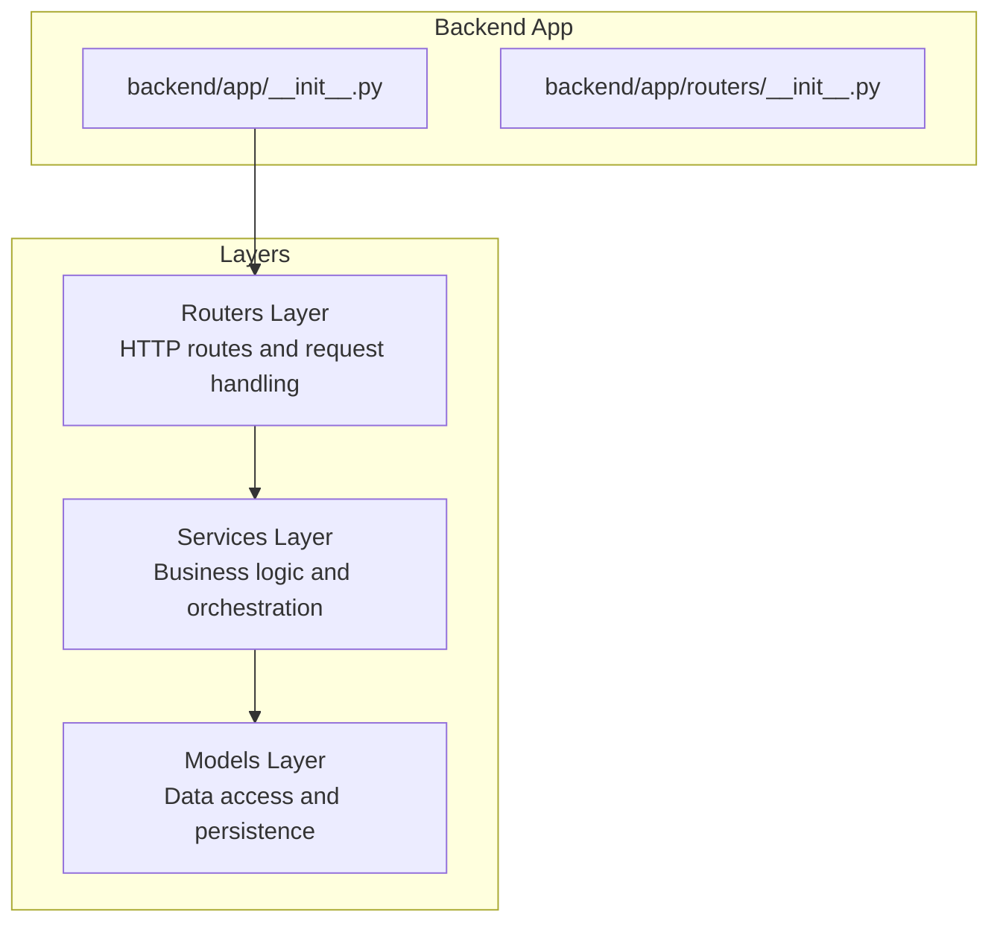
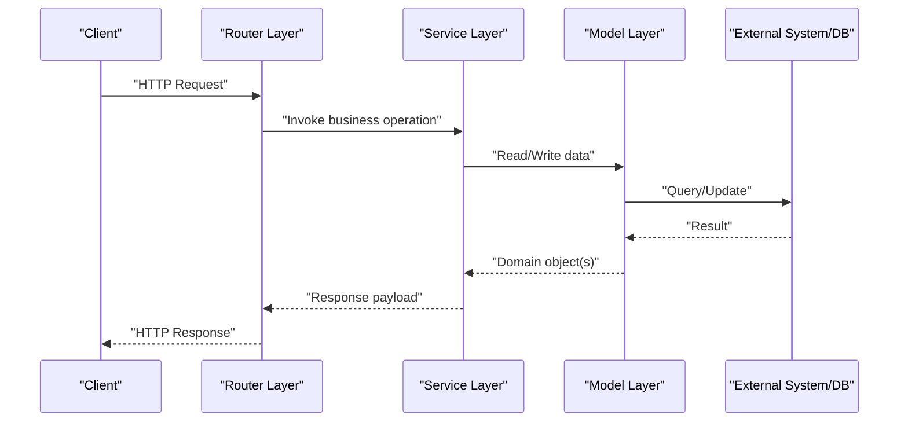
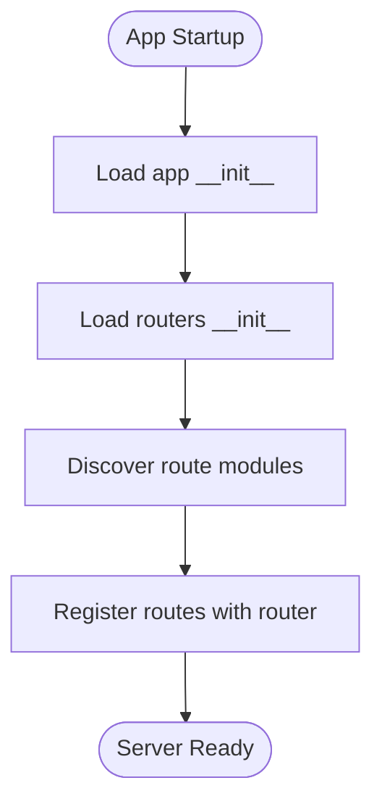
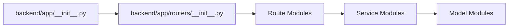

# Extension Points

<cite>
**Referenced Files in This Document**
- [backend/app/__init__.py](file://backend/app/__init__.py)
- [backend/app/routers/__init__.py](file://backend/app/routers/__init__.py)
</cite>

## Table of Contents
1. [Introduction](#introduction)
2. [Project Structure](#project-structure)
3. [Core Components](#core-components)
4. [Architecture Overview](#architecture-overview)
5. [Detailed Component Analysis](#detailed-component-analysis)
6. [Dependency Analysis](#dependency-analysis)
7. [Performance Considerations](#performance-considerations)
8. [Troubleshooting Guide](#troubleshooting-guide)
9. [Conclusion](#conclusion)
10. [Appendices](#appendices)

## Introduction
This document explains how to extend GoNow’s architecture safely and consistently. It focuses on:
- Adding new API endpoints by extending the Router layer
- Implementing new business features through Service layer extensions
- Integrating with external systems or databases via Model layer modifications
- Plugin-ready patterns, middleware integration points, and configuration-driven customization
- Step-by-step guides for common extension scenarios
- Best practices for maintaining architectural integrity and backward compatibility

The guidance is designed for both newcomers and experienced contributors, with progressive complexity and practical examples referenced to actual files.

## Project Structure
GoNow follows a layered structure that separates concerns across routers (HTTP routing), services (business logic), and models (data access). The current repository exposes initialization modules for the application and routers, which serve as natural extension points.

**Diagram sources**
- [backend/app/__init__.py](file://backend/app/__init__.py)
- [backend/app/routers/__init__.py](file://backend/app/routers/__init__.py)

**Section sources**
- [backend/app/__init__.py](file://backend/app/__init__.py)
- [backend/app/routers/__init__.py](file://backend/app/routers/__init__.py)

## Core Components
- Application entrypoint and bootstrap:
  - backend/app/__init__.py: Initializes the application, wires layers, and registers global configuration and middleware.
- Router registry:
  - backend/app/routers/__init__.py: Aggregates route definitions and provides a central place to register new endpoints.

These two modules are the primary extension surfaces for adding HTTP endpoints and integrating additional behavior at startup.

**Section sources**
- [backend/app/__init__.py](file://backend/app/__init__.py)
- [backend/app/routers/__init__.py](file://backend/app/routers/__init__.py)

## Architecture Overview
The system is organized into clear layers:
- Routers: Define HTTP endpoints, parse requests, and delegate to services.
- Services: Encapsulate business rules, coordinate multiple models, and return domain results.
- Models: Provide data access abstractions over databases or external APIs.

[No sources needed since this diagram shows conceptual workflow, not actual code structure]

## Detailed Component Analysis

### Extending the Router Layer (Adding New Endpoints)
Goal: Add a new API endpoint without modifying core router logic.

Recommended approach:
- Create a new route module under the routers package.
- Register the new routes in the router aggregator so they become available at startup.
- Keep handlers thin: validate input, call services, and format responses.

Step-by-step guide:
1. Create a new route file under the routers package for your feature.
2. Define path bindings and handler functions in that file.
3. Import and register the new routes in the router aggregator.
4. Ensure any required dependencies (e.g., config, logging) are accessible from the router context.

Best practices:
- Use consistent naming conventions for paths and handlers.
- Validate inputs early and return structured errors.
- Avoid business logic in routers; delegate to services.

Backward compatibility:
- Introduce new endpoints rather than changing existing ones.
- Version your API when necessary (e.g., /v1/...).

**Section sources**
- [backend/app/routers/__init__.py](file://backend/app/routers/__init__.py)

#### Router Registration Flow

**Diagram sources**
- [backend/app/__init__.py](file://backend/app/__init__.py)
- [backend/app/routers/__init__.py](file://backend/app/routers/__init__.py)

### Extending the Service Layer (New Business Features)
Goal: Implement new business capabilities while keeping routers and models decoupled.

Recommended approach:
- Create a service module that encapsulates the new feature’s logic.
- Compose multiple model calls if needed.
- Expose clear method signatures that routers can call.

Step-by-step guide:
1. Define a service class or module for the new feature.
2. Implement methods that perform business operations using models.
3. Handle domain-level errors and map them to consistent response shapes.
4. Inject dependencies (config, clients) via constructor or context.

Best practices:
- Keep services stateless where possible.
- Favor composition over inheritance.
- Return domain objects or DTOs instead of raw database rows.

Backward compatibility:
- Add new methods rather than altering existing ones.
- Deprecate old methods gradually with versioned behavior.

**Section sources**
- [backend/app/__init__.py](file://backend/app/__init__.py)

### Integrating with External Systems or Databases (Model Layer Modifications)
Goal: Add or modify data access without affecting higher layers.

Recommended approach:
- Create or update model classes that abstract persistence.
- Use dependency injection to provide different implementations (e.g., test doubles).
- Centralize connection management and error mapping in models.

Step-by-step guide:
1. Define a model interface or base class for the entity.
2. Implement concrete model classes for each storage backend.
3. Update the service layer to use the model abstraction.
4. Configure the active model implementation via application settings.

Best practices:
- Isolate I/O in models; keep services focused on business logic.
- Map external errors to domain exceptions.
- Use transactions where appropriate to maintain consistency.

Backward compatibility:
- Introduce new model variants behind feature flags or configuration.
- Maintain adapters for legacy schemas during migration.

**Section sources**
- [backend/app/__init__.py](file://backend/app/__init__.py)

### Middleware Integration Points
Middleware allows cross-cutting concerns such as authentication, logging, rate limiting, and request tracing.

Integration points:
- Global middleware registration in the application initializer.
- Route-specific middleware for scoped behavior.
- Custom middleware factories for parameterized behavior.

Guidelines:
- Keep middleware small and single-purpose.
- Preserve request/response contracts.
- Fail fast with meaningful error codes.

Configuration-driven behavior:
- Enable/disable middleware via configuration keys.
- Parameterize middleware behavior (e.g., thresholds, timeouts).

**Section sources**
- [backend/app/__init__.py](file://backend/app/__init__.py)

### Configuration-Driven Behavior Customization
Use configuration to control runtime behavior without code changes.

Common knobs:
- Feature toggles for new functionality
- Environment-specific settings (dev/staging/prod)
- External service endpoints and credentials
- Logging levels and sampling rates

Implementation tips:
- Load configuration once at startup and inject it into components.
- Validate configuration early and fail fast on invalid values.
- Provide sensible defaults and document all options.

**Section sources**
- [backend/app/__init__.py](file://backend/app/__init__.py)

### Plugin-Ready Patterns
Design the system to accept optional plugins that add features dynamically.

Patterns:
- Plugin discovery: scan packages or directories for plugin modules.
- Plugin lifecycle hooks: initialize, register routes, configure services.
- Capability interfaces: define contracts that plugins implement.

Steps to make the system plugin-ready:
1. Define plugin interfaces for routes, services, and models.
2. Add a plugin loader in the application initializer.
3. Allow plugins to register themselves via the router aggregator.
4. Provide a manifest or metadata for plugin capabilities.

**Section sources**
- [backend/app/__init__.py](file://backend/app/__init__.py)
- [backend/app/routers/__init__.py](file://backend/app/routers/__init__.py)

## Dependency Analysis
The following diagram illustrates the key extension surfaces and their relationships.

**Diagram sources**
- [backend/app/__init__.py](file://backend/app/__init__.py)
- [backend/app/routers/__init__.py](file://backend/app/routers/__init__.py)

**Section sources**
- [backend/app/__init__.py](file://backend/app/__init__.py)
- [backend/app/routers/__init__.py](file://backend/app/routers/__init__.py)

## Performance Considerations
- Prefer lazy loading of heavy dependencies and plugins.
- Cache expensive computations in services when safe.
- Use connection pooling for database and external clients.
- Profile hot paths and avoid unnecessary allocations.
- Keep middleware lightweight; offload heavy work to background jobs.

[No sources needed since this section provides general guidance]

## Troubleshooting Guide
Common issues and resolutions:
- Endpoint not found:
  - Verify route registration in the router aggregator.
  - Check path prefixes and method mappings.
- Service errors:
  - Inspect service logs and ensure proper error mapping.
  - Validate inputs before calling downstream models.
- Model failures:
  - Confirm external connectivity and credentials.
  - Wrap I/O errors with domain exceptions for clarity.
- Middleware misbehavior:
  - Review order of middleware execution.
  - Ensure headers and contexts are preserved.

Operational checks:
- Validate configuration at startup and log missing keys.
- Use health check endpoints to verify subsystem readiness.
- Enable structured logging and correlation IDs for requests.

**Section sources**
- [backend/app/__init__.py](file://backend/app/__init__.py)
- [backend/app/routers/__init__.py](file://backend/app/routers/__init__.py)

## Conclusion
By leveraging the Router, Service, and Model layers along with middleware and configuration, you can extend GoNow’s functionality in a clean, maintainable way. Follow the step-by-step guides and best practices outlined here to preserve architectural integrity, ensure backward compatibility, and keep the system extensible for future growth.

[No sources needed since this section summarizes without analyzing specific files]

## Appendices

### Quick Reference: Where to Extend
- Add new endpoints:
  - Create route modules and register them in the router aggregator.
  - See: [backend/app/routers/__init__.py](file://backend/app/routers/__init__.py)
- Implement business logic:
  - Create service modules and compose model calls.
  - See: [backend/app/__init__.py](file://backend/app/__init__.py)
- Integrate external systems:
  - Implement model classes and wire them via configuration.
  - See: [backend/app/__init__.py](file://backend/app/__init__.py)

**Section sources**
- [backend/app/routers/__init__.py](file://backend/app/routers/__init__.py)
- [backend/app/__init__.py](file://backend/app/__init__.py)