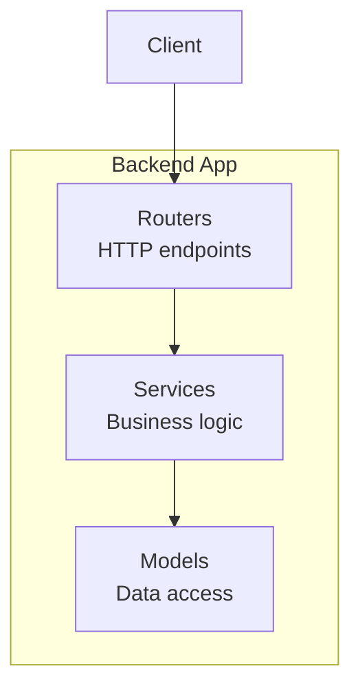
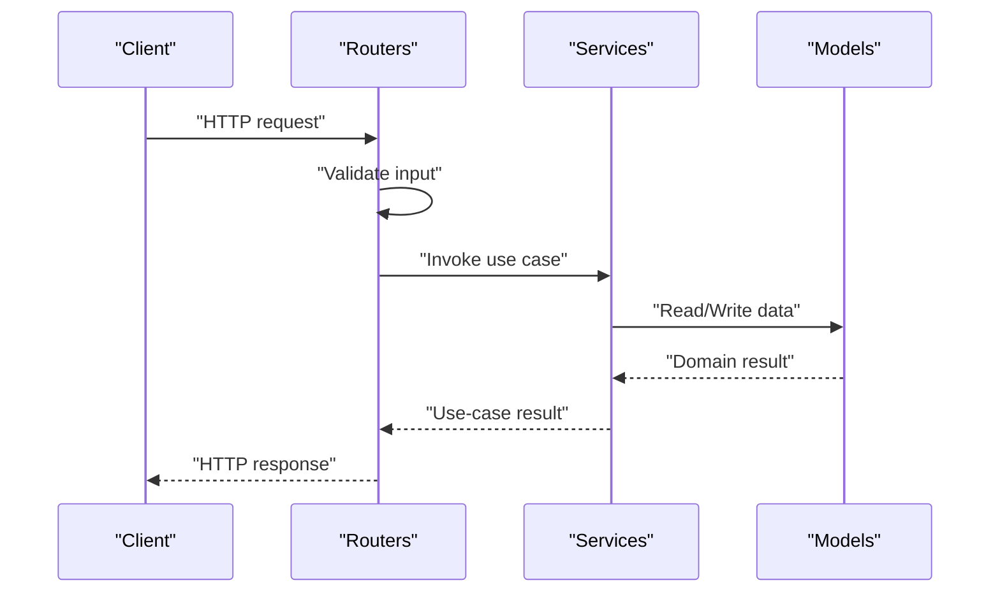
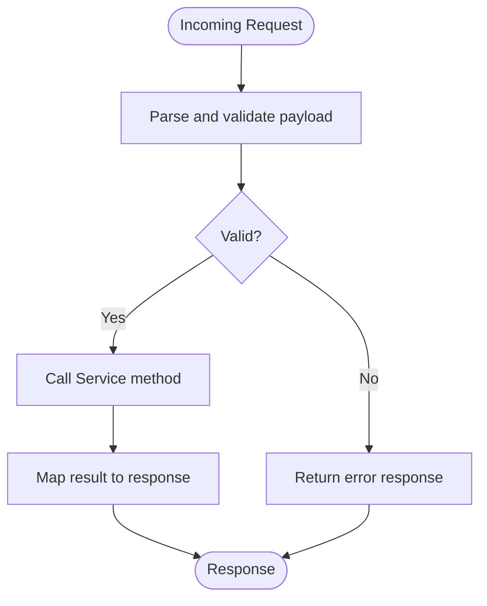
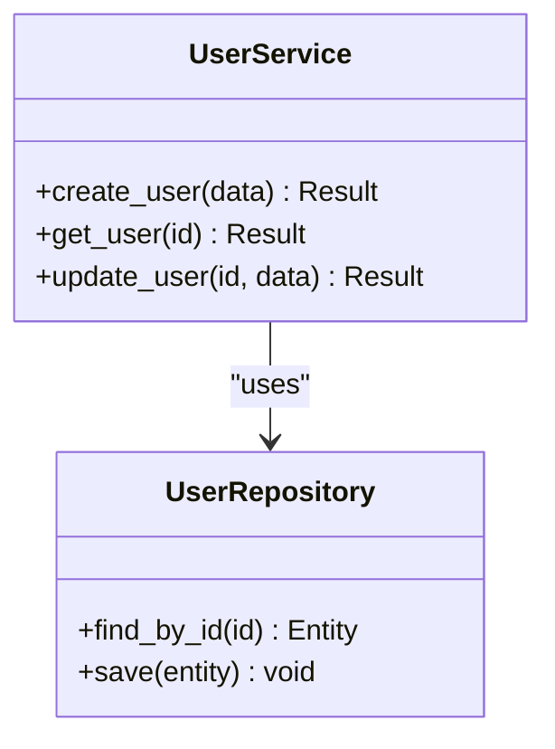
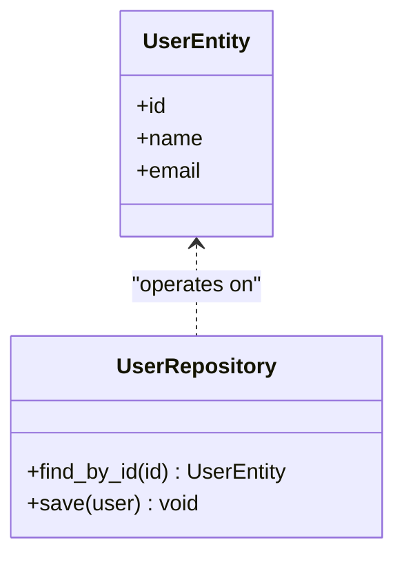
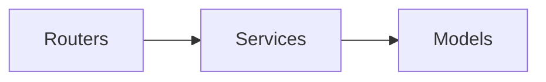

# Layered Architecture Pattern

<cite>
**Referenced Files in This Document**
- [__init__.py](file://backend/app/__init__.py)
- [__init__.py](file://backend/app/routers/__init__.py)
- [.gitignore](file://.gitignore)
</cite>

## Table of Contents
1. [Introduction](#introduction)
2. [Project Structure](#project-structure)
3. [Core Components](#core-components)
4. [Architecture Overview](#architecture-overview)
5. [Detailed Component Analysis](#detailed-component-analysis)
6. [Dependency Analysis](#dependency-analysis)
7. [Performance Considerations](#performance-considerations)
8. [Troubleshooting Guide](#troubleshooting-guide)
9. [Conclusion](#conclusion)

## Introduction
This document explains how to implement a layered architecture pattern for the GoNow backend, focusing on clear separation of concerns across three layers:
- Presentation Layer (Routers): handles HTTP requests and responses, input validation, and routing.
- Business Logic Layer (Services): encapsulates domain rules, orchestration, and use cases.
- Data Access Layer (Models): manages persistence, data transformation, and storage interactions.

The goal is to improve maintainability, testability, and scalability by enforcing strict boundaries between responsibilities and dependencies.

## Project Structure
The repository provides a layered layout under backend/app with dedicated directories for models, routers, and services. The .gitignore indicates Python-related artifacts, suggesting a Python-based backend structure aligned with the layered approach.

**Diagram sources**
- [__init__.py](file://backend/app/__init__.py)
- [__init__.py](file://backend/app/routers/__init__.py)

**Section sources**
- [__init__.py](file://backend/app/__init__.py)
- [__init__.py](file://backend/app/routers/__init__.py)
- [.gitignore](file://.gitignore)

## Core Components
- Presentation Layer (Routers)
  - Responsibilities: parse incoming requests, validate inputs, call services, format responses, handle status codes and errors at the HTTP level.
  - Boundaries: must not contain business rules or direct database calls; depends only on Services.
- Business Logic Layer (Services)
  - Responsibilities: implement domain operations, coordinate multiple Models, enforce invariants, and return domain results.
  - Boundaries: must not depend on HTTP frameworks; depends only on Models.
- Data Access Layer (Models)
  - Responsibilities: interact with databases or external APIs, map entities to storage formats, and provide CRUD operations.
  - Boundaries: must not know about HTTP or business orchestration; exposes clean interfaces for Services.

Benefits
- Maintainability: changes in one layer rarely affect others due to strict boundaries.
- Testability: each layer can be unit-tested in isolation using mocks/stubs.
- Scalability: layers can evolve independently and be scaled horizontally as needed.

Anti-patterns to avoid
- Fat controllers: placing business logic inside routers.
- Anemic models: storing only data without any data-access methods or validations.
- God services: monolithic service classes that do everything.
- Direct DB calls from routers: bypassing the service layer.
- Circular dependencies: routers depending on services that depend back on routers.

[No sources needed since this section provides general guidance]

## Architecture Overview
The layered flow ensures requests move top-down through well-defined boundaries.

[No sources needed since this diagram shows conceptual workflow, not actual code structure]

## Detailed Component Analysis

### Presentation Layer (Routers)
- Purpose: translate HTTP semantics into service calls and produce standardized responses.
- Key practices:
  - Keep route handlers thin: parse, validate, delegate, respond.
  - Centralize error mapping to HTTP status codes.
  - Avoid importing Models directly.

[No sources needed since this diagram shows conceptual workflow, not actual code structure]

**Section sources**
- [__init__.py](file://backend/app/routers/__init__.py)

### Business Logic Layer (Services)
- Purpose: implement domain workflows and orchestrate data access via Models.
- Key practices:
  - Encapsulate use cases as single-responsibility functions/methods.
  - Return domain-friendly results and raise application-level exceptions.
  - Do not import HTTP framework types.

[No sources needed since this diagram shows conceptual workflow, not actual code structure]

**Section sources**
- [__init__.py](file://backend/app/__init__.py)

### Data Access Layer (Models)
- Purpose: manage persistence and data transformations.
- Key practices:
  - Provide clear read/write interfaces for Services.
  - Handle connection management and query building internally.
  - Expose domain entities or DTOs rather than raw rows.

[No sources needed since this diagram shows conceptual workflow, not actual code structure]

**Section sources**
- [__init__.py](file://backend/app/__init__.py)

## Dependency Analysis
Layered architecture enforces a unidirectional dependency graph: Routers → Services → Models. This prevents tight coupling and makes testing straightforward.

[No sources needed since this diagram shows conceptual workflow, not actual code structure]

**Section sources**
- [__init__.py](file://backend/app/__init__.py)
- [__init__.py](file://backend/app/routers/__init__.py)

## Performance Considerations
- Minimize serialization overhead by returning lean payloads from Models.
- Use pagination and selective field retrieval in Models to reduce I/O.
- Cache frequently accessed data in Services when appropriate.
- Batch writes and reads in Models to reduce round-trips.
- Keep Routers stateless to enable horizontal scaling.

[No sources needed since this section provides general guidance]

## Troubleshooting Guide
Common issues and remedies:
- Symptom: Business logic appears in routers.
  - Fix: Move logic to Services; keep routers thin.
- Symptom: Tests are hard to write because of global state or direct DB calls.
  - Fix: Inject repositories/interfaces into Services and mock them in tests.
- Symptom: Tight coupling between layers causing cascading changes.
  - Fix: Introduce interfaces/contracts between layers and adhere to them strictly.
- Symptom: Inconsistent error handling across endpoints.
  - Fix: Centralize error mapping in routers and standardize service exceptions.

[No sources needed since this section provides general guidance]

## Conclusion
Adopting a layered architecture in GoNow clarifies responsibilities, improves testability, and supports scalable growth. By keeping Routers focused on HTTP concerns, Services on domain logic, and Models on data access—and by avoiding anti-patterns—you create a robust foundation for long-term maintenance and evolution.

[No sources needed since this section summarizes without analyzing specific files]