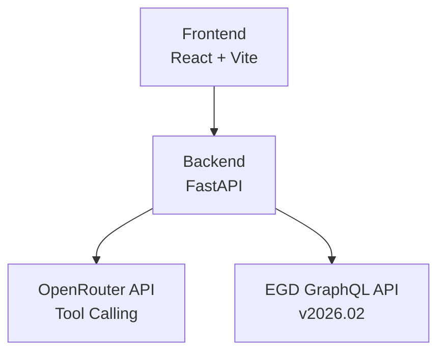
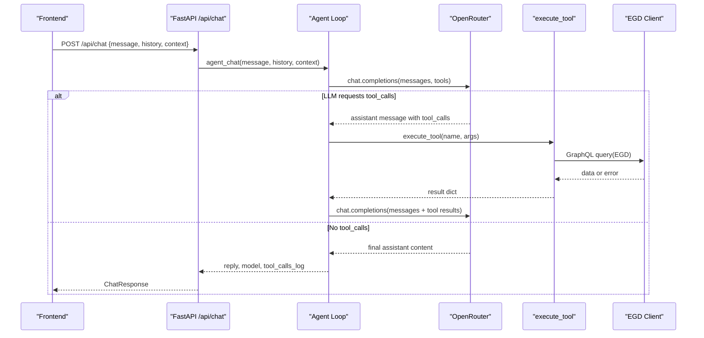
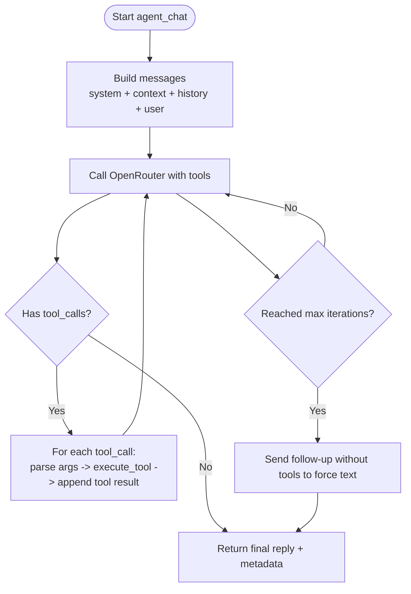
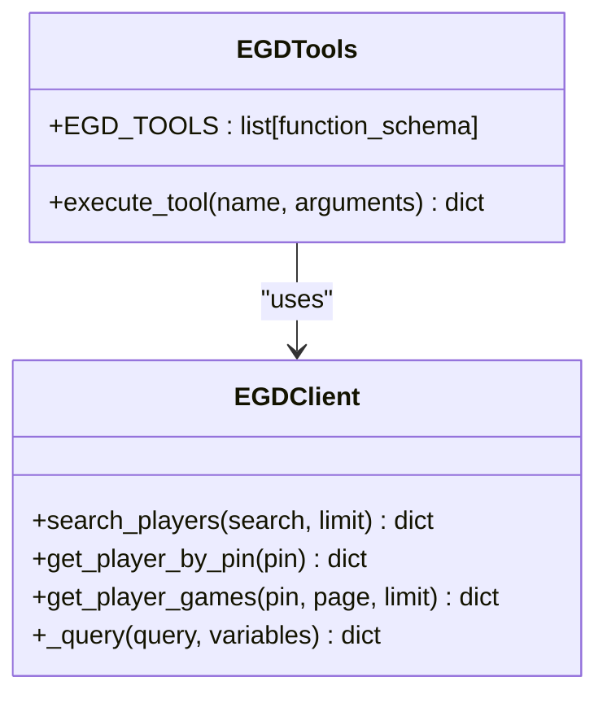
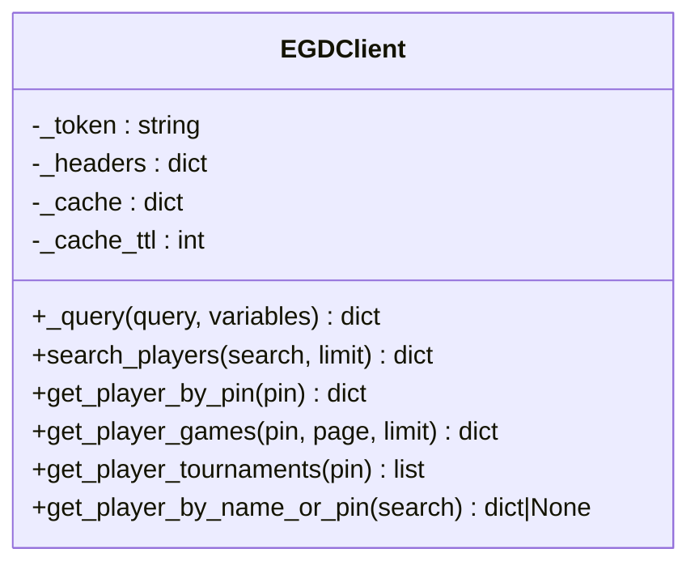
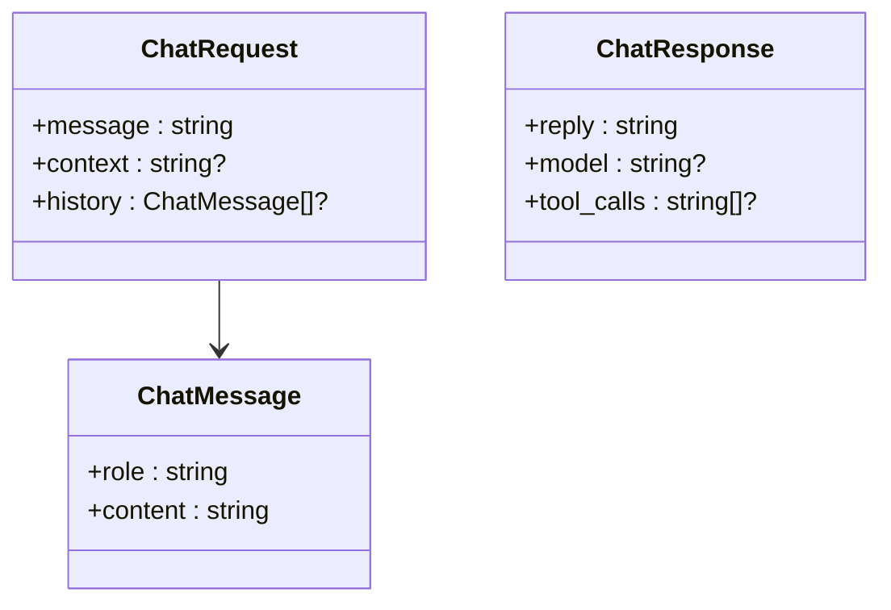
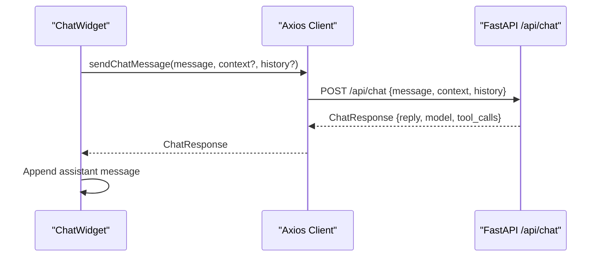
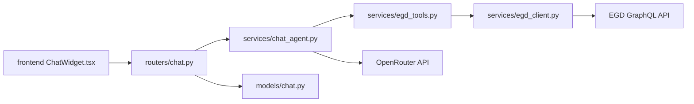

# AI Agent System

<cite>
**Referenced Files in This Document**
- [main.py](file://backend/app/main.py)
- [chat.py](file://backend/app/routers/chat.py)
- [chat_agent.py](file://backend/app/services/chat_agent.py)
- [egd_tools.py](file://backend/app/services/egd_tools.py)
- [egd_client.py](file://backend/app/services/egd_client.py)
- [chat.py](file://backend/app/models/chat.py)
- [ChatWidget.tsx](file://frontend/src/components/ChatWidget.tsx)
- [client.ts](file://frontend/src/api/client.ts)
- [ARCHITECTURE.md](file://docs/ARCHITECTURE.md)
- [AGENT_DESIGN.md](file://docs/AGENT_DESIGN.md)
- [EGD_API.md](file://docs/EGD_API.md)
</cite>

## Table of Contents
1. [Introduction](#introduction)
2. [Project Structure](#project-structure)
3. [Core Components](#core-components)
4. [Architecture Overview](#architecture-overview)
5. [Detailed Component Analysis](#detailed-component-analysis)
6. [Dependency Analysis](#dependency-analysis)
7. [Performance Considerations](#performance-considerations)
8. [Troubleshooting Guide](#troubleshooting-guide)
9. [Conclusion](#conclusion)
10. [Appendices](#appendices)

## Introduction
This document describes the agentic chat system that integrates a FastAPI backend with OpenRouter’s native tool calling to provide an autonomous assistant for Go player analytics. The agent decides when and how to call tools, executes them against the European Go Database (EGD), and synthesizes final answers. It also covers context management, safety measures, integration points, and usage patterns.

## Project Structure
The backend exposes REST endpoints and implements the agentic loop in Python. The frontend provides a floating chat widget that communicates with the backend. External services include OpenRouter (LLM API) and EGD GraphQL API.

**Diagram sources**
- [ARCHITECTURE.md:7-33](file://docs/ARCHITECTURE.md#L7-L33)

**Section sources**
- [ARCHITECTURE.md:43-81](file://docs/ARCHITECTURE.md#L43-L81)

## Core Components
- Chat route: Accepts user messages and delegates to the agent service.
- Agent loop: Sends messages and tool schemas to OpenRouter; iteratively executes tool calls until a final answer is produced.
- Tool definitions and executor: Declares function schemas and dispatches execution to the EGD client.
- EGD client: Wraps GraphQL queries with caching and error handling.
- Models: Pydantic models for request/response validation.
- Frontend chat UI: Floating widget that sends messages and displays responses.

**Section sources**
- [chat.py:1-25](file://backend/app/routers/chat.py#L1-L25)
- [chat_agent.py:1-154](file://backend/app/services/chat_agent.py#L1-L154)
- [egd_tools.py:1-212](file://backend/app/services/egd_tools.py#L1-L212)
- [egd_client.py:1-197](file://backend/app/services/egd_client.py#L1-L197)
- [chat.py:1-21](file://backend/app/models/chat.py#L1-L21)
- [ChatWidget.tsx:1-240](file://frontend/src/components/ChatWidget.tsx#L1-L240)
- [client.ts:1-86](file://frontend/src/api/client.ts#L1-L86)

## Architecture Overview
The chat flow uses OpenRouter’s native tool calling. The agent builds a conversation, sends it with tool schemas, and loops while the model requests tool invocations. Results are appended as tool messages until the model returns a final text response.

**Diagram sources**
- [chat.py:1-25](file://backend/app/routers/chat.py#L1-L25)
- [chat_agent.py:30-154](file://backend/app/services/chat_agent.py#L30-L154)
- [egd_tools.py:102-212](file://backend/app/services/egd_tools.py#L102-L212)
- [egd_client.py:21-150](file://backend/app/services/egd_client.py#L21-L150)

## Detailed Component Analysis

### Agentic Chat Loop (OpenRouter Tool Calling)
Responsibilities:
- Build messages from system prompt, optional page context, and recent history.
- Send to OpenRouter with tool schemas.
- If tool_calls present, execute each via the executor, append tool results, and continue.
- On no tool_calls, return final answer.
- Fallback after max iterations to force a text summary.

Key behaviors:
- Configurable model and iteration limit via environment variables.
- History limited to last N messages to control context size.
- Error-safe JSON parsing for arguments and status checks on HTTP responses.

**Diagram sources**
- [chat_agent.py:30-154](file://backend/app/services/chat_agent.py#L30-L154)

**Section sources**
- [chat_agent.py:30-154](file://backend/app/services/chat_agent.py#L30-L154)

### EGD Tools Definition System and Function Schema Generation
- Tool schemas are defined as OpenAI-compatible function objects, including name, description, and parameter schema.
- The executor maps tool names to implementations, validates required parameters, and returns standardized success/error payloads.
- Tools available:
  - search_player(query)
  - get_player_details(pin)
  - get_player_rating_history(pin)
  - get_player_games(pin, limit?)
  - compare_players(pin1, pin2)

Execution handler responsibilities:
- Resolve arguments safely (JSON parse fallback).
- Call EGD client methods.
- Normalize responses into consistent structures for the LLM.

**Diagram sources**
- [egd_tools.py:5-99](file://backend/app/services/egd_tools.py#L5-L99)
- [egd_tools.py:102-212](file://backend/app/services/egd_tools.py#L102-L212)
- [egd_client.py:11-197](file://backend/app/services/egd_client.py#L11-L197)

**Section sources**
- [egd_tools.py:5-99](file://backend/app/services/egd_tools.py#L5-L99)
- [egd_tools.py:102-212](file://backend/app/services/egd_tools.py#L102-L212)

### EGD Client (GraphQL Wrapper and Caching)
- Provides typed GraphQL queries for players, games, and tournaments.
- Implements in-memory cache keyed by query+variables with TTL.
- Centralizes authentication headers and error propagation.

**Diagram sources**
- [egd_client.py:11-197](file://backend/app/services/egd_client.py#L11-L197)

**Section sources**
- [egd_client.py:1-197](file://backend/app/services/egd_client.py#L1-L197)

### API Route and Request/Response Contracts
- FastAPI route mounts under /api and delegates to the agent service.
- Pydantic models enforce structure for messages, context, and responses.

**Diagram sources**
- [chat.py:1-21](file://backend/app/models/chat.py#L1-L21)
- [chat.py:1-25](file://backend/app/routers/chat.py#L1-L25)

**Section sources**
- [chat.py:1-25](file://backend/app/routers/chat.py#L1-L25)
- [chat.py:1-21](file://backend/app/models/chat.py#L1-L21)

### Frontend Integration
- ChatWidget manages local state, shows typing indicators, and posts messages to the backend.
- Axios client defines TypeScript interfaces and sendChatMessage helper.

**Diagram sources**
- [ChatWidget.tsx:1-240](file://frontend/src/components/ChatWidget.tsx#L1-L240)
- [client.ts:74-86](file://frontend/src/api/client.ts#L74-L86)
- [chat.py:1-25](file://backend/app/routers/chat.py#L1-L25)

**Section sources**
- [ChatWidget.tsx:1-240](file://frontend/src/components/ChatWidget.tsx#L1-L240)
- [client.ts:1-86](file://frontend/src/api/client.ts#L1-L86)

## Dependency Analysis
High-level dependencies between modules and external services:

**Diagram sources**
- [chat.py:1-25](file://backend/app/routers/chat.py#L1-L25)
- [chat_agent.py:1-154](file://backend/app/services/chat_agent.py#L1-L154)
- [egd_tools.py:1-212](file://backend/app/services/egd_tools.py#L1-L212)
- [egd_client.py:1-197](file://backend/app/services/egd_client.py#L1-L197)
- [chat.py:1-21](file://backend/app/models/chat.py#L1-L21)
- [ChatWidget.tsx:1-240](file://frontend/src/components/ChatWidget.tsx#L1-L240)

**Section sources**
- [chat.py:1-25](file://backend/app/routers/chat.py#L1-L25)
- [chat_agent.py:1-154](file://backend/app/services/chat_agent.py#L1-L154)
- [egd_tools.py:1-212](file://backend/app/services/egd_tools.py#L1-L212)
- [egd_client.py:1-197](file://backend/app/services/egd_client.py#L1-L197)
- [chat.py:1-21](file://backend/app/models/chat.py#L1-L21)
- [ChatWidget.tsx:1-240](file://frontend/src/components/ChatWidget.tsx#L1-L240)

## Performance Considerations
- In-memory caching in the EGD client reduces repeated GraphQL calls with a configurable TTL.
- History truncation limits context length to reduce token usage and latency.
- Max iterations cap prevents runaway loops and controls cost.
- Choosing a fast, cost-effective model via configuration balances responsiveness and quality.

[No sources needed since this section provides general guidance]

## Troubleshooting Guide
Common issues and mitigations:
- Missing OpenRouter key: The agent returns a clear message indicating configuration is required.
- Invalid tool arguments: The executor parses arguments with a safe fallback to empty dict and logs the tool name used.
- Unknown tool name: Executor returns an error payload rather than raising exceptions.
- EGD errors: The client raises structured errors which bubble up to the executor and then to the agent; ensure proper error handling upstream if needed.
- CORS and routing: Ensure the app includes CORS middleware and mounts routers correctly.

**Section sources**
- [chat_agent.py:42-48](file://backend/app/services/chat_agent.py#L42-L48)
- [chat_agent.py:100-118](file://backend/app/services/chat_agent.py#L100-L118)
- [egd_tools.py:207-212](file://backend/app/services/egd_tools.py#L207-L212)
- [egd_client.py:38-42](file://backend/app/services/egd_client.py#L38-L42)
- [main.py:20-31](file://backend/app/main.py#L20-L31)

## Conclusion
The agentic chat system leverages OpenRouter’s native tool calling to implement a simple yet powerful ReAct-style loop. Tool schemas are declarative, execution is centralized and safe, and the EGD client encapsulates GraphQL access with caching. The design minimizes dependencies, keeps orchestration lightweight, and integrates cleanly with both backend routes and the frontend chat UI.

[No sources needed since this section summarizes without analyzing specific files]

## Appendices

### Example Tool Usage Patterns
- Search a player by name or PIN, then fetch details and rating history before answering.
- Compare two players side-by-side using their PINs.
- Retrieve recent games for a player with a controlled limit.

These flows are orchestrated by the LLM based on the provided tool schemas and executed server-side.

**Section sources**
- [agd_tools.py:5-99](file://backend/app/services/egd_tools.py#L5-L99)
- [agd_tools.py:102-212](file://backend/app/services/egd_tools.py#L102-L212)

### Safety Measures
- Only predefined tools are exposed; arbitrary code execution is not supported.
- Arguments are parsed defensively; unknown tools return errors instead of failing loudly.
- Context is bounded (history truncation) and optional page context can be injected by the caller.

**Section sources**
- [chat_agent.py:59-63](file://backend/app/services/chat_agent.py#L59-L63)
- [egd_tools.py:207-212](file://backend/app/services/egd_tools.py#L207-L212)

### Configuration Reference
- Environment variables:
  - OPENROUTER_API_KEY
  - CHAT_MODEL
  - CHAT_MAX_ITERATIONS
  - EGD_API_TOKEN

These are loaded at application startup and consumed by the agent and client.

**Section sources**
- [main.py:8-11](file://backend/app/main.py#L8-L11)
- [chat_agent.py:9-11](file://backend/app/services/chat_agent.py#L9-L11)
- [EGD_API.md:9-21](file://docs/EGD_API.md#L9-L21)