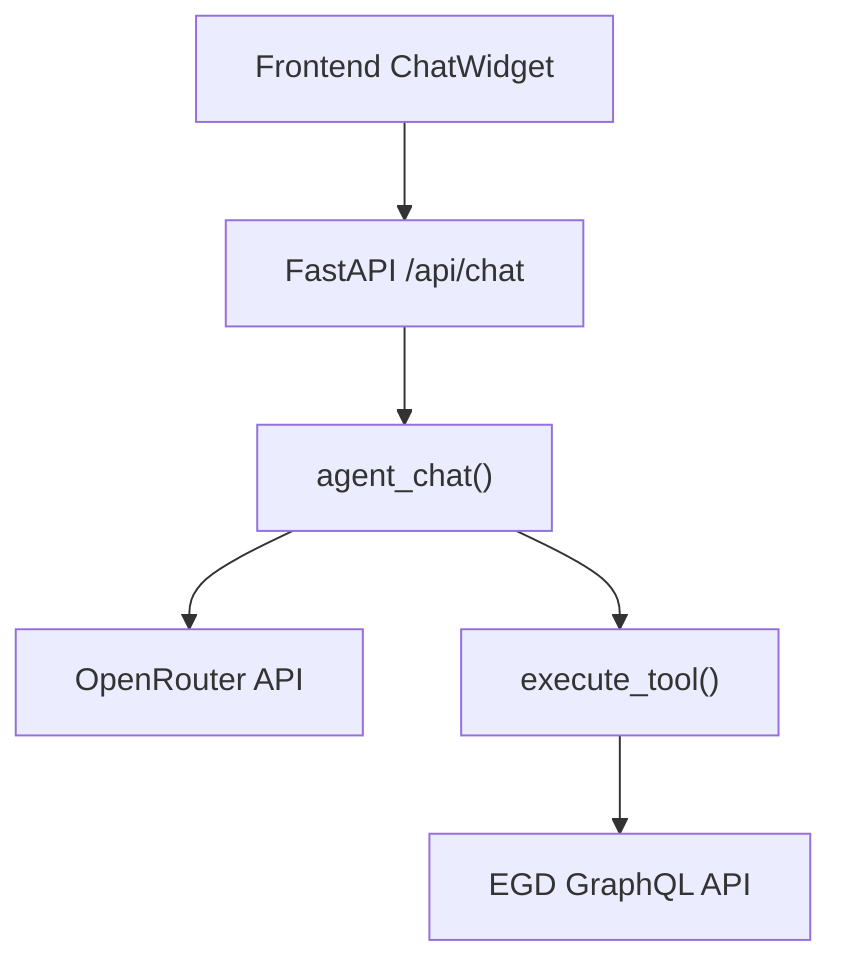
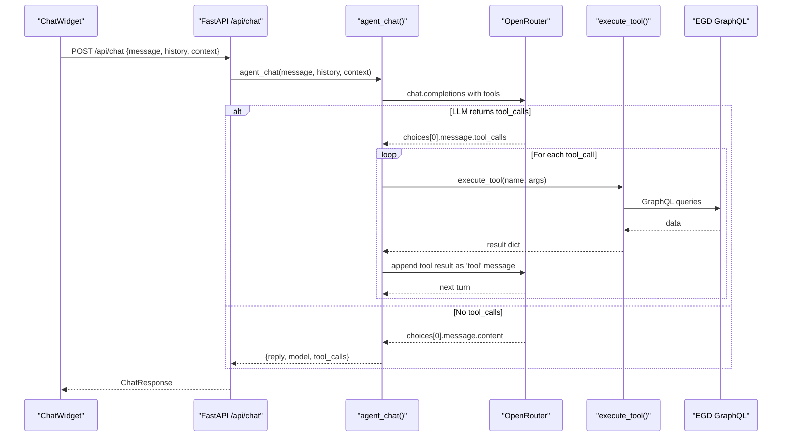
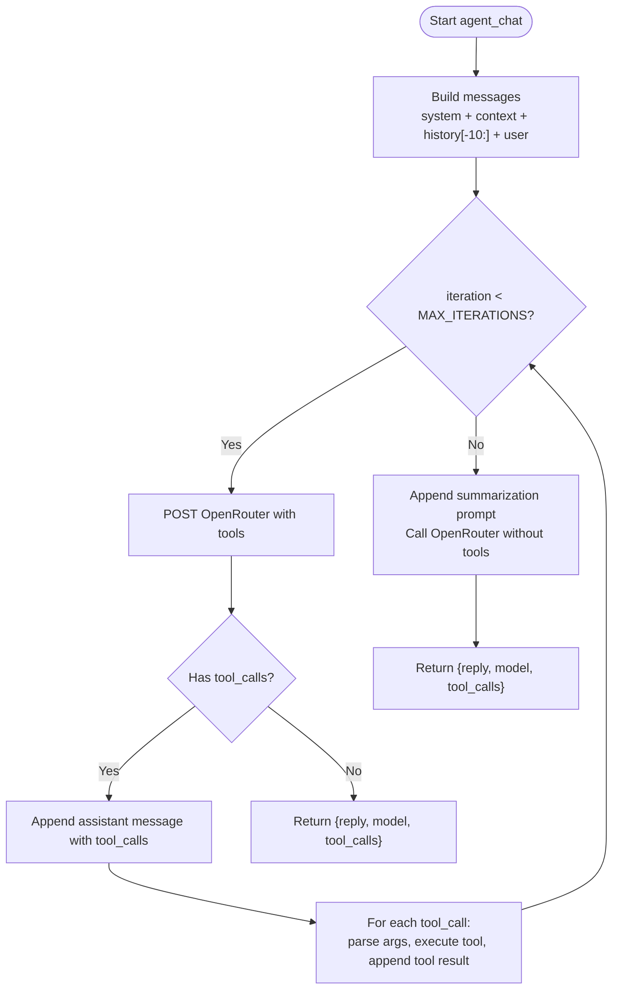
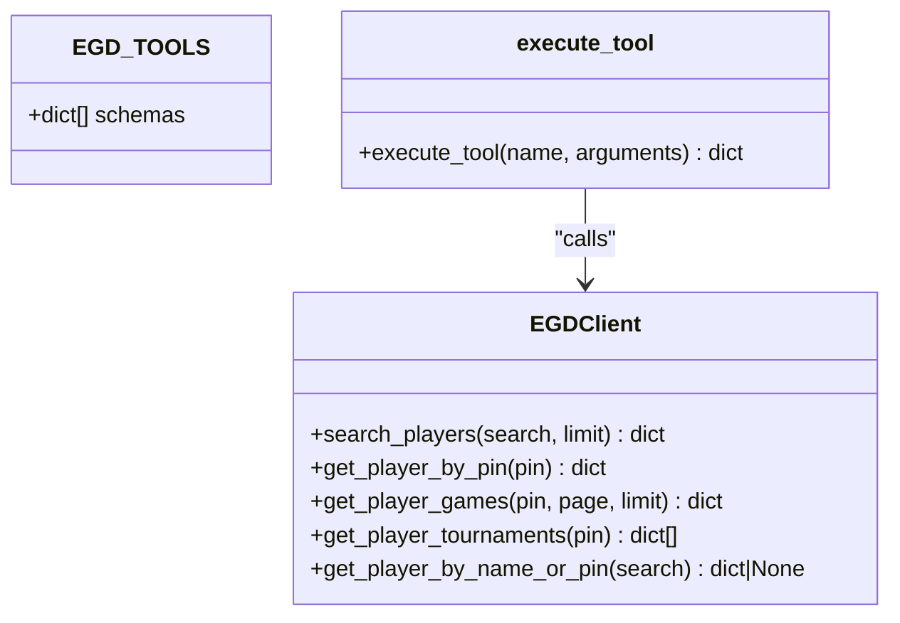
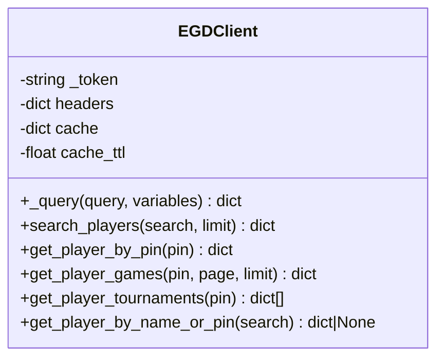
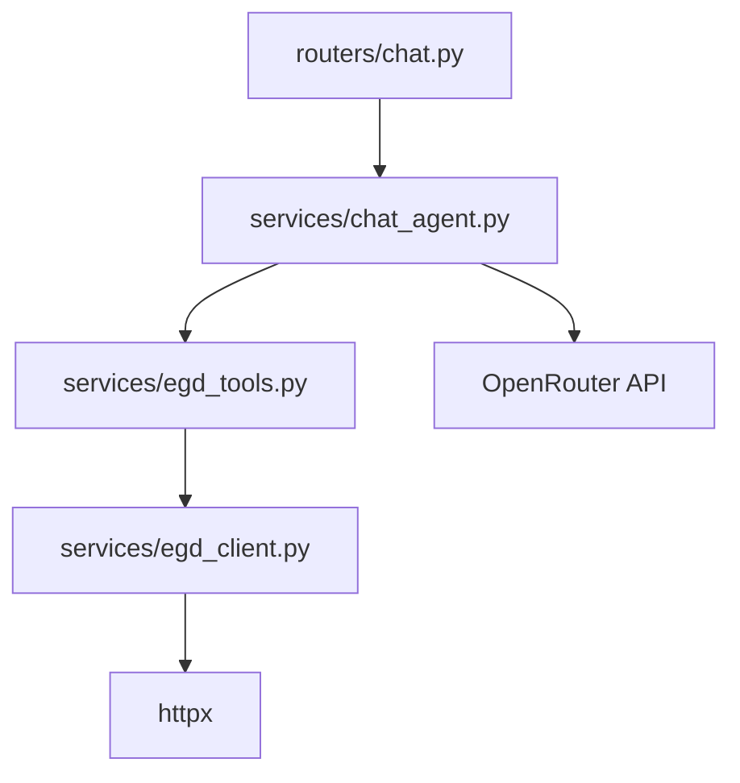

# Agent Loop Implementation

<cite>
**Referenced Files in This Document**
- [chat_agent.py](file://backend/app/services/chat_agent.py)
- [egd_tools.py](file://backend/app/services/egd_tools.py)
- [egd_client.py](file://backend/app/services/egd_client.py)
- [chat.py](file://backend/app/routers/chat.py)
- [chat.py](file://backend/app/models/chat.py)
- [main.py](file://backend/app/main.py)
- [ChatWidget.tsx](file://frontend/src/components/ChatWidget.tsx)
- [AGENTS.md](file://docs/AGENTS.md)
- [AGENT_DESIGN.md](file://docs/AGENT_DESIGN.md)
</cite>

## Table of Contents
1. [Introduction](#introduction)
2. [Project Structure](#project-structure)
3. [Core Components](#core-components)
4. [Architecture Overview](#architecture-overview)
5. [Detailed Component Analysis](#detailed-component-analysis)
6. [Dependency Analysis](#dependency-analysis)
7. [Performance Considerations](#performance-considerations)
8. [Troubleshooting Guide](#troubleshooting-guide)
9. [Conclusion](#conclusion)

## Introduction
This document explains the agentic chat loop implementation that powers GoNow’s AI assistant. The agent uses OpenRouter’s native tool calling to autonomously decide when to query the European Go Database (EGD), execute tools, and synthesize a final answer. It covers the iterative reasoning process, how tool calls versus text responses are handled, conversation management (history and context injection), fallback behavior when maximum iterations are reached, error handling strategies, safety measures against infinite loops and resource exhaustion, and performance considerations.

## Project Structure
The backend implements the agent loop as a FastAPI service that:
- Accepts chat requests with optional history and context
- Builds a message array including system prompt, optional page context, recent history, and the current user message
- Calls OpenRouter with tool schemas for EGD operations
- Executes tool calls returned by the model, appends results back into the conversation, and repeats until a final text response is produced or max iterations are reached
- Returns a structured response including reply, model name, and tool call log

**Diagram sources**
- [chat.py:1-95](file://backend/app/routers/chat.py#L1-L95)
- [chat_agent.py:1-154](file://backend/app/services/chat_agent.py#L1-L154)
- [egd_tools.py:1-212](file://backend/app/services/egd_tools.py#L1-L212)
- [egd_client.py:1-197](file://backend/app/services/egd_client.py#L1-L197)

**Section sources**
- [main.py:14-31](file://backend/app/main.py#L14-L31)
- [chat.py:1-95](file://backend/app/routers/chat.py#L1-L95)
- [chat_agent.py:1-154](file://backend/app/services/chat_agent.py#L1-L154)

## Core Components
- Agentic chat loop: orchestrates messages, tool calling, and iteration control
- Tool definitions and executor: declares OpenAI-compatible function schemas and dispatches execution
- EGD client: provides read-only access to player data via GraphQL with caching
- API route: validates input, delegates to agent, and returns standardized responses
- Models: define request/response structures for validation and typing

Key responsibilities:
- Conversation assembly and context injection
- Iterative reasoning loop with tool execution
- Fallback to force a final text response after max iterations
- Error handling at API boundary and within tool execution
- Safety limits to prevent infinite loops and excessive resource usage

**Section sources**
- [chat_agent.py:30-154](file://backend/app/services/chat_agent.py#L30-L154)
- [egd_tools.py:1-212](file://backend/app/services/egd_tools.py#L1-L212)
- [egd_client.py:1-197](file://backend/app/services/egd_client.py#L1-L197)
- [chat.py:1-95](file://backend/app/routers/chat.py#L1-L95)
- [chat.py:1-21](file://backend/app/models/chat.py#L1-L21)

## Architecture Overview
The agent follows a ReAct-like pattern implemented through OpenRouter’s tool calling:
- Reason: LLM decides whether to call a tool or provide a final answer
- Act: Backend executes the requested tool(s)
- Observe: Results are appended as tool messages
- Repeat: Until a final text response is produced or max iterations are reached

**Diagram sources**
- [chat.py:1-95](file://backend/app/routers/chat.py#L1-L95)
- [chat_agent.py:30-154](file://backend/app/services/chat_agent.py#L30-L154)
- [egd_tools.py:102-212](file://backend/app/services/egd_tools.py#L102-L212)
- [egd_client.py:21-197](file://backend/app/services/egd_client.py#L21-L197)

## Detailed Component Analysis

### Agentic Chat Loop (agent_chat)
Responsibilities:
- Build messages: system prompt, optional context, last N history entries, current user message
- Iterate up to MAX_ITERATIONS:
  - Call OpenRouter with tool schemas
  - If tool_calls present: append assistant message with tool_calls, execute each tool, append tool results, continue loop
  - Else: return final text response
- Fallback: if max iterations exhausted, send a summarization prompt without tools to force a text answer

Safety and constraints:
- Maximum iterations configurable via environment variable (default 3)
- History limited to last 10 messages to reduce payload size
- Timeout set on HTTP client to avoid hanging requests
- Graceful fallback ensures a response even if the model keeps requesting tools

Error handling:
- Missing API key returns a friendly message instead of raising
- JSON decode errors for tool arguments default to empty dict
- Final fallback call raises HTTP-level errors if network/API fails

**Diagram sources**
- [chat_agent.py:30-154](file://backend/app/services/chat_agent.py#L30-L154)

**Section sources**
- [chat_agent.py:30-154](file://backend/app/services/chat_agent.py#L30-L154)

### Tool Definitions and Executor (egd_tools)
Responsibilities:
- Define five OpenAI-compatible function schemas for EGD operations: search_player, get_player_details, get_player_rating_history, get_player_games, compare_players
- Dispatch execution via execute_tool(name, arguments):
  - Validate required parameters
  - Call EGD client methods
  - Normalize and enrich results (e.g., rating history extraction and sorting)
  - Wrap results in success/error dicts

Error handling:
- Unknown tool names return an error dict
- Exceptions during execution are caught and returned as error dicts
- Not found cases return explicit error messages

**Diagram sources**
- [egd_tools.py:5-99](file://backend/app/services/egd_tools.py#L5-L99)
- [egd_tools.py:102-212](file://backend/app/services/egd_tools.py#L102-L212)
- [egd_client.py:11-197](file://backend/app/services/egd_client.py#L11-L197)

**Section sources**
- [egd_tools.py:1-212](file://backend/app/services/egd_tools.py#L1-L212)

### EGD Client (egd_client)
Responsibilities:
- Provide async GraphQL client with bearer token auth
- Implement caching layer keyed by query and variables with TTL
- Expose methods for searching players, retrieving details, games, tournaments, and name/PIN lookup

Caching strategy:
- In-memory cache stores tuples of timestamp and result
- TTL-based invalidation reduces repeated external calls

Error handling:
- Raises ValueError on GraphQL errors
- Network errors propagate to callers; callers wrap in safe error dicts

**Diagram sources**
- [egd_client.py:11-197](file://backend/app/services/egd_client.py#L11-L197)

**Section sources**
- [egd_client.py:1-197](file://backend/app/services/egd_client.py#L1-L197)

### API Route (FastAPI)
Responsibilities:
- Validate request using Pydantic models
- Delegate to agent_chat with message, history, and context
- Return standardized ChatResponse including reply, model, and tool_calls
- Raise HTTPException on unexpected errors

Conversation management:
- Supports optional context injection (e.g., current player data)
- Supports optional history to maintain multi-turn conversations

**Section sources**
- [chat.py:1-95](file://backend/app/routers/chat.py#L1-L95)
- [chat.py:1-21](file://backend/app/models/chat.py#L1-L21)

### Frontend Integration (ChatWidget)
Responsibilities:
- Send user messages to backend
- Display assistant replies
- Show loading state and simple tool status indicators
- Handle errors gracefully by showing a user-friendly message

Note: The frontend currently does not render detailed tool call logs; it focuses on user experience and basic feedback.

**Section sources**
- [ChatWidget.tsx:1-240](file://frontend/src/components/ChatWidget.tsx#L1-L240)

## Dependency Analysis
High-level dependencies:
- FastAPI router depends on agent_chat
- agent_chat depends on OpenRouter API and execute_tool
- execute_tool depends on EGD client
- EGD client depends on httpx and environment configuration

**Diagram sources**
- [chat.py:1-95](file://backend/app/routers/chat.py#L1-L95)
- [chat_agent.py:1-154](file://backend/app/services/chat_agent.py#L1-L154)
- [egd_tools.py:1-212](file://backend/app/services/egd_tools.py#L1-L212)
- [egd_client.py:1-197](file://backend/app/services/egd_client.py#L1-L197)

**Section sources**
- [main.py:14-31](file://backend/app/main.py#L14-L31)
- [chat.py:1-95](file://backend/app/routers/chat.py#L1-L95)
- [chat_agent.py:1-154](file://backend/app/services/chat_agent.py#L1-L154)
- [egd_tools.py:1-212](file://backend/app/services/egd_tools.py#L1-L212)
- [egd_client.py:1-197](file://backend/app/services/egd_client.py#L1-L197)

## Performance Considerations
- Max iterations cap prevents runaway tool-calling loops; default is 3
- History truncation to last 10 messages reduces payload size and latency
- EGD client caching avoids redundant GraphQL calls within TTL window
- HTTP timeouts guard against slow or unresponsive endpoints
- Model selection and token limits can be tuned via environment variables

Recommendations:
- Monitor tool call counts per request and adjust MAX_ITERATIONS based on typical workflows
- Consider increasing cache TTL if EGD data changes infrequently
- Profile OpenRouter latency and adjust timeout accordingly
- Use efficient prompts and concise tool outputs to minimize token usage

[No sources needed since this section provides general guidance]

## Troubleshooting Guide
Common issues and strategies:
- Missing OpenRouter API key: agent_chat returns a friendly message instead of failing
- Invalid tool arguments: JSON decode errors default to empty dict; ensure tool schemas match expected inputs
- EGD API errors: GraphQL errors raise exceptions; tool executor wraps them in error dicts
- Network timeouts: HTTP clients have timeouts; consider retry logic at higher layers if needed
- Infinite tool loops: mitigated by MAX_ITERATIONS and fallback summarization prompt

Operational checks:
- Verify environment variables are loaded from .env
- Confirm CORS settings allow frontend origins
- Inspect tool call logs in ChatResponse.tool_calls for debugging

**Section sources**
- [chat_agent.py:42-48](file://backend/app/services/chat_agent.py#L42-L48)
- [chat_agent.py:100-118](file://backend/app/services/chat_agent.py#L100-L118)
- [chat_agent.py:128-153](file://backend/app/services/chat_agent.py#L128-L153)
- [chat.py:23-24](file://backend/app/routers/chat.py#L23-L24)
- [agd_client.py:38-42](file://backend/app/services/egd_client.py#L38-L42)

## Conclusion
The GoNow agentic chat loop leverages OpenRouter’s native tool calling to implement a lightweight, effective ReAct-style reasoning process. It balances autonomy with safety through configurable iteration limits, history truncation, and robust fallback behavior. The modular design separates orchestration, tool execution, and data access, enabling clear maintenance and extensibility. With caching and timeouts, the system remains performant while providing rich, data-driven insights about Go players and tournaments.

[No sources needed since this section summarizes without analyzing specific files]