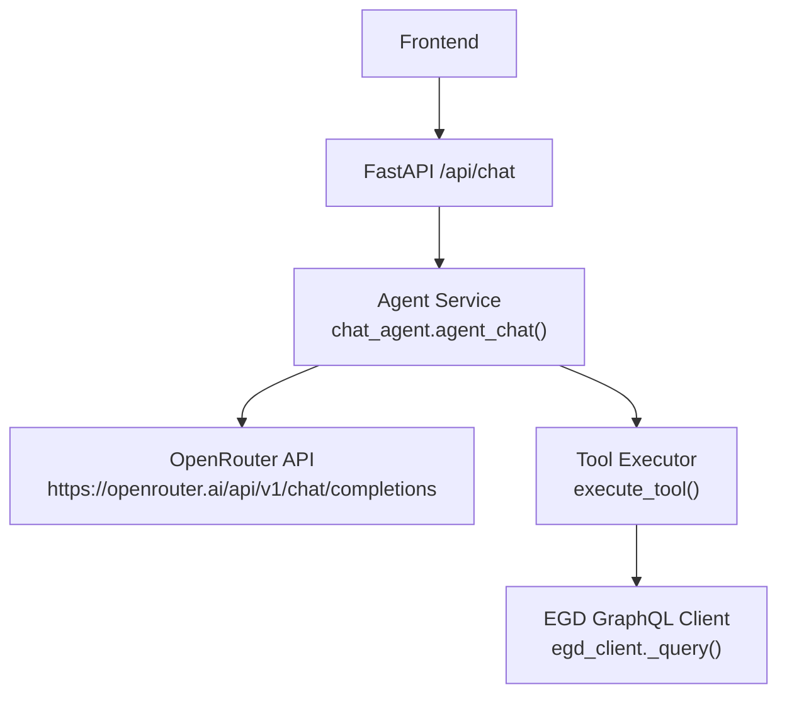
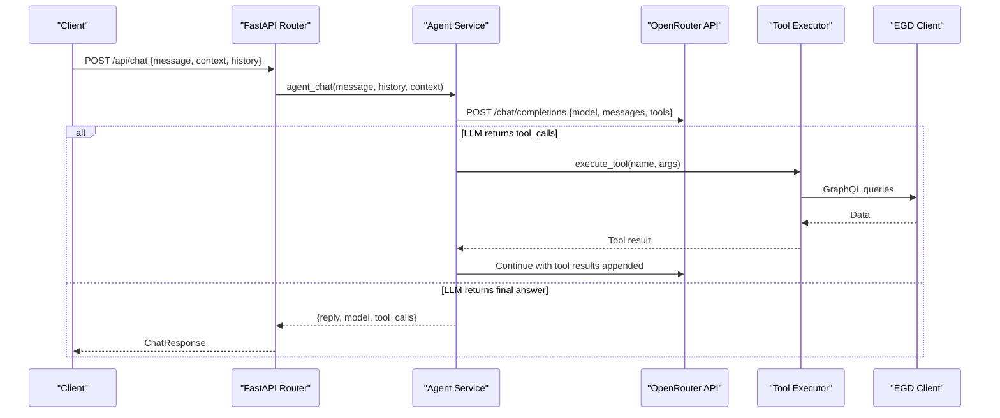
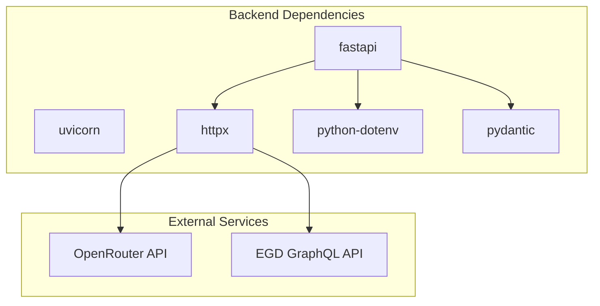

# OpenRouter Model Integration

<cite>
**Referenced Files in This Document**
- [chat_agent.py](file://backend/app/services/chat_agent.py)
- [chat.py](file://backend/app/routers/chat.py)
- [chat.py (models)](file://backend/app/models/chat.py)
- [egd_tools.py](file://backend/app/services/egd_tools.py)
- [main.py](file://backend/app/main.py)
- [requirements.txt](file://backend/requirements.txt)
- [AGENTS.md](file://docs/AGENTS.md)
- [AGENT_DESIGN.md](file://docs/AGENT_DESIGN.md)
</cite>

## Table of Contents
1. [Introduction](#introduction)
2. [Project Structure](#project-structure)
3. [Core Components](#core-components)
4. [Architecture Overview](#architecture-overview)
5. [Detailed Component Analysis](#detailed-component-analysis)
6. [Dependency Analysis](#dependency-analysis)
7. [Performance Considerations](#performance-considerations)
8. [Troubleshooting Guide](#troubleshooting-guide)
9. [Conclusion](#conclusion)
10. [Appendices](#appendices)

## Introduction
This document explains the OpenRouter model integration layer used by the GoNow backend to provide an agentic chat assistant with tool calling. It covers API communication patterns, authentication setup, model selection strategy, request/response formats, error handling, configuration options, and production considerations such as rate limiting, timeouts, and monitoring. The implementation uses OpenRouter’s native function/tool calling to let the LLM autonomously query the European Go Database (EGD) via server-side tools.

## Project Structure
The OpenRouter integration is implemented in the backend FastAPI application:
- HTTP route receives chat requests and delegates to the agent service.
- Agent service orchestrates conversation history, system prompts, and tool schemas, then calls OpenRouter.
- Tool definitions describe available EGD operations; a dispatcher executes them against the EGD client.
- Configuration is loaded from environment variables for keys, model ID, and iteration limits.

**Diagram sources**
- [chat.py:1-95](file://backend/app/routers/chat.py#L1-L95)
- [chat_agent.py:1-154](file://backend/app/services/chat_agent.py#L1-L154)
- [egd_tools.py:1-212](file://backend/app/services/egd_tools.py#L1-L212)
- [agd_client.py:1-197](file://backend/app/services/egd_client.py#L1-L197)

**Section sources**
- [main.py:1-42](file://backend/app/main.py#L1-L42)
- [AGENTS.md:31-36](file://docs/AGENTS.md#L31-L36)

## Core Components
- Chat Router: Accepts POST /api/chat, builds messages, and returns a standardized response.
- Agent Service: Implements the ReAct-style loop using OpenRouter tool calling, manages conversation context, and enforces max iterations.
- Tool Definitions and Dispatcher: Declares EGD functions as OpenAI-compatible schemas and routes execution to the EGD client.
- Models: Pydantic models define request and response shapes.

Key responsibilities:
- Authentication: Bearer token from OPENROUTER_API_KEY.
- Model selection: CHAT_MODEL env var with a default value.
- Iteration control: CHAT_MAX_ITERATIONS caps tool-calling loops.
- Timeouts: httpx AsyncClient timeout configured per call path.

**Section sources**
- [chat.py:1-95](file://backend/app/routers/chat.py#L1-L95)
- [chat_agent.py:1-154](file://backend/app/services/chat_agent.py#L1-L154)
- [chat.py (models):1-21](file://backend/app/models/chat.py#L1-L21)
- [egd_tools.py:1-212](file://backend/app/services/egd_tools.py#L1-L212)
- [AGENTS.md:31-36](file://docs/AGENTS.md#L31-L36)

## Architecture Overview
The chat flow follows a clear sequence:
- Client sends a message to /api/chat.
- Router constructs messages (system prompt, optional context, recent history, user message).
- Agent posts to OpenRouter with model, messages, and tool schemas.
- If the LLM responds with tool_calls, the agent executes each tool via execute_tool(), appends results as tool messages, and continues until no more tool calls or max iterations reached.
- Final text reply is returned to the client.

**Diagram sources**
- [chat.py:1-95](file://backend/app/routers/chat.py#L1-L95)
- [chat_agent.py:1-154](file://backend/app/services/chat_agent.py#L1-L154)
- [egd_tools.py:1-212](file://backend/app/services/egd_tools.py#L1-L212)
- [agd_client.py:1-197](file://backend/app/services/egd_client.py#L1-L197)

## Detailed Component Analysis

### Chat Router (/api/chat)
- Receives ChatRequest (message, optional context, optional history).
- Builds a messages array including a system prompt, optional context, and last N history entries.
- Sends a single-turn request to OpenRouter when not using the agentic loop (legacy route), or delegates to the agent service for tool calling.
- Returns ChatResponse with reply, model name, and optional tool_calls log.

Error handling:
- On exceptions, raises HTTPException with status 500 and a detail string.

Configuration:
- Reads OPENROUTER_API_KEY from environment.
- Uses a hardcoded model in the legacy route; the agentic route reads CHAT_MODEL.

**Section sources**
- [chat.py:1-95](file://backend/app/routers/chat.py#L1-L95)
- [chat.py (models):1-21](file://backend/app/models/chat.py#L1-L21)

### Agent Service (Agentic Loop)
Responsibilities:
- Validates presence of OPENROUTER_API_KEY; if missing, returns a friendly fallback reply.
- Composes messages: system prompt, optional page context, truncated history (last 10), and current user message.
- Calls OpenRouter with model, messages, and tool schemas.
- Handles tool_calls:
  - Parses function name and arguments.
  - Executes via execute_tool().
  - Appends tool results back into the conversation.
  - Loops up to CHAT_MAX_ITERATIONS.
- Fallback behavior:
  - After exhausting iterations, appends a summarization prompt and makes one more call without tools to force a text response.

Timeouts and errors:
- Uses httpx.AsyncClient(timeout=60) for agent calls.
- Raises HTTP-level errors via resp.raise_for_status().
- JSON parsing errors for tool arguments are handled gracefully.

Return format:
- {"reply": str, "model": str, "tool_calls": list[str]}

**Section sources**
- [chat_agent.py:1-154](file://backend/app/services/chat_agent.py#L1-L154)
- [AGENTS.md:31-36](file://docs/AGENTS.md#L31-L36)

### Tool Definitions and Execution
Tools exposed to the LLM:
- search_player(query: string)
- get_player_details(pin: int)
- get_player_rating_history(pin: int)
- get_player_games(pin: int, limit?: int)
- compare_players(pin1: int, pin2: int)

Execution:
- execute_tool(name, arguments) dispatches to EGD client methods.
- Wraps results in {"success": True/False, ...} payloads.
- Errors return {"success": False, "error": str}.

EGD client:
- Provides GraphQL queries with caching (in-memory TTL).
- Enforces pagination and limits where applicable.

**Section sources**
- [egd_tools.py:1-212](file://backend/app/services/egd_tools.py#L1-L212)
- [agd_client.py:1-197](file://backend/app/services/egd_client.py#L1-L197)

### Request/Response Formats
ChatRequest:
- message: string (required)
- context: string (optional)
- history: list of ChatMessage objects (optional)

ChatMessage:
- role: "user" | "assistant"
- content: string

ChatResponse:
- reply: string
- model: string (optional)
- tool_calls: list[string] (optional)

OpenRouter request payload (agent):
- model: string (from CHAT_MODEL)
- messages: array of message objects
- tools: array of function schemas
- max_tokens: integer

OpenRouter response shape:
- choices[0].message.content for final answers
- choices[0].message.tool_calls for function invocations
- model field indicates which model responded

**Section sources**
- [chat.py (models):1-21](file://backend/app/models/chat.py#L1-L21)
- [chat_agent.py:1-154](file://backend/app/services/chat_agent.py#L1-L154)

### Authentication Setup
- OPENROUTER_API_KEY: Bearer token used in Authorization header for OpenRouter calls.
- EGD_API_TOKEN: Bearer token used for EGD GraphQL endpoint.

Environment loading:
- python-dotenv loads .env from backend directory at startup.

**Section sources**
- [main.py:1-42](file://backend/app/main.py#L1-L42)
- [AGENTS.md:31-36](file://docs/AGENTS.md#L31-L36)

### Model Selection Strategy
- Default model: google/gemini-2.0-flash-001 (configured via CHAT_MODEL).
- Legacy route hardcodes openai/gpt-3.5-turbo.
- Model can be changed by setting CHAT_MODEL in environment.

Cost optimization strategies:
- Prefer faster, cheaper models for routine queries (e.g., gemini-2.0-flash-001).
- Use higher-quality models selectively for complex reasoning tasks.
- Limit max_tokens and truncate history to reduce token usage.
- Cache EGD responses to avoid redundant lookups.

Fallback mechanisms:
- If OPENROUTER_API_KEY is missing, return a user-friendly message instead of failing.
- After max iterations, force a final summarization call without tools to ensure a text response.

**Section sources**
- [chat_agent.py:1-154](file://backend/app/services/chat_agent.py#L1-L154)
- [chat.py:1-95](file://backend/app/routers/chat.py#L1-L95)
- [AGENT_DESIGN.md:230-248](file://docs/AGENT_DESIGN.md#L230-L248)

### Error Handling for API Failures
- HTTP errors: resp.raise_for_status() surfaces non-2xx responses.
- JSON parse errors: tool argument parsing catches invalid JSON and defaults to empty dict.
- Tool execution errors: wrapped in success=False with error details.
- Router-level exception handler: converts unhandled exceptions to HTTP 500 with detail.

Production recommendations:
- Add retry logic with exponential backoff for transient network errors.
- Implement circuit breaker patterns for downstream services.
- Log structured telemetry for failures and latencies.

**Section sources**
- [chat_agent.py:1-154](file://backend/app/services/chat_agent.py#L1-L154)
- [chat.py:1-95](file://backend/app/routers/chat.py#L1-L95)
- [agd_client.py:1-197](file://backend/app/services/egd_client.py#L1-L197)

### Rate Limiting and Timeout Handling
- Timeouts:
  - Agent calls use httpx.AsyncClient(timeout=60).
  - Legacy route uses timeout=30.
  - EGD client uses timeout=30.
- Rate limiting:
  - No built-in client-side throttling observed.
  - Consider adding per-model or global rate limiting middleware.
  - Respect OpenRouter and EGD rate limits; implement retries/backoff.

Monitoring approaches:
- Track latency and error rates for OpenRouter and EGD calls.
- Instrument tool call frequency and durations.
- Alert on repeated failures or high latency.

**Section sources**
- [chat_agent.py:1-154](file://backend/app/services/chat_agent.py#L1-L154)
- [chat.py:1-95](file://backend/app/routers/chat.py#L1-L95)
- [agd_client.py:1-197](file://backend/app/services/egd_client.py#L1-L197)

## Dependency Analysis
External dependencies relevant to OpenRouter integration:
- httpx: async HTTP client for OpenRouter and EGD calls.
- python-dotenv: loads environment variables from .env.
- pydantic: request/response validation.
- fastapi/uvicorn: web server and routing.

**Diagram sources**
- [requirements.txt:1-6](file://backend/requirements.txt#L1-L6)
- [main.py:1-42](file://backend/app/main.py#L1-L42)

**Section sources**
- [requirements.txt:1-6](file://backend/requirements.txt#L1-L6)
- [main.py:1-42](file://backend/app/main.py#L1-L42)

## Performance Considerations
- Token budgeting:
  - Keep max_tokens reasonable (e.g., 500–1000).
  - Truncate conversation history to last N messages.
- Model choice:
  - Use cost-effective models for simple queries.
  - Switch to higher-quality models only when needed.
- Caching:
  - EGD client caches GraphQL responses with TTL to reduce external calls.
- Concurrency:
  - Use async I/O for all HTTP calls.
- Observability:
  - Add metrics for latency, throughput, and error rates.
  - Log tool call sequences and outcomes for debugging.

[No sources needed since this section provides general guidance]

## Troubleshooting Guide
Common issues and resolutions:
- Missing API key:
  - Symptom: Friendly fallback reply indicating configuration is required.
  - Resolution: Set OPENROUTER_API_KEY in backend/.env.
- Authentication failures:
  - Symptom: HTTP 401/403 from OpenRouter.
  - Resolution: Verify token validity and permissions.
- Rate limiting:
  - Symptom: HTTP 429 responses.
  - Resolution: Implement retries with backoff; throttle requests.
- Timeouts:
  - Symptom: Connection timeouts or slow responses.
  - Resolution: Adjust timeouts; optimize prompts and history length.
- Tool argument parsing errors:
  - Symptom: Invalid JSON in tool arguments.
  - Resolution: Ensure model outputs valid JSON; handle parse errors gracefully.
- EGD API errors:
  - Symptom: GraphQL errors or missing data.
  - Resolution: Validate tokens; check query parameters; inspect cached data.

**Section sources**
- [chat_agent.py:1-154](file://backend/app/services/chat_agent.py#L1-L154)
- [chat.py:1-95](file://backend/app/routers/chat.py#L1-L95)
- [agd_client.py:1-197](file://backend/app/services/egd_client.py#L1-L197)

## Conclusion
The OpenRouter integration in GoNow leverages native tool calling to create a lightweight, effective agentic chat experience. By configuring model selection, controlling iteration depth, and implementing robust error handling and timeouts, the system balances performance and reliability. For production deployments, add rate limiting, observability, and retry strategies to ensure resilience under load.

[No sources needed since this section summarizes without analyzing specific files]

## Appendices

### Configuration Options
- OPENROUTER_API_KEY: Required for OpenRouter access.
- CHAT_MODEL: Selects the model (default: google/gemini-2.0-flash-001).
- CHAT_MAX_ITERATIONS: Caps tool-calling loops (default: 3).
- EGD_API_TOKEN: Required for EGD GraphQL access.

**Section sources**
- [AGENTS.md:31-36](file://docs/AGENTS.md#L31-L36)

### Example Model-Specific Behaviors
- Gemini Flash: Fast, cost-efficient, supports tool calling well.
- GPT-4o-mini: Balanced speed/cost with strong tool calling.
- GPT-4o/Claude Sonnet: Higher quality but slower and more expensive.

Use these insights to choose models based on task complexity and budget constraints.

**Section sources**
- [AGENT_DESIGN.md:239-248](file://docs/AGENT_DESIGN.md#L239-L248)