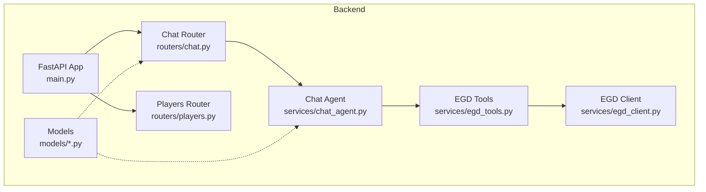
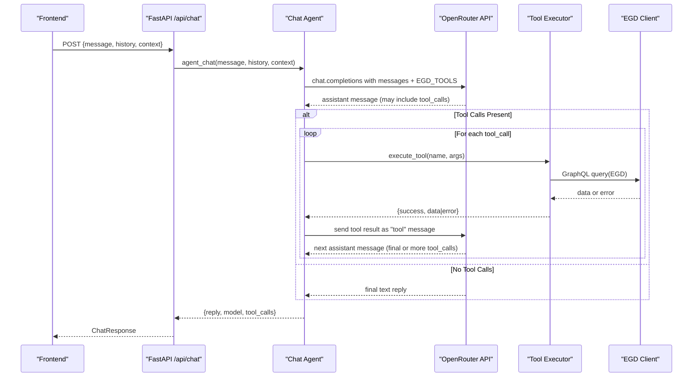
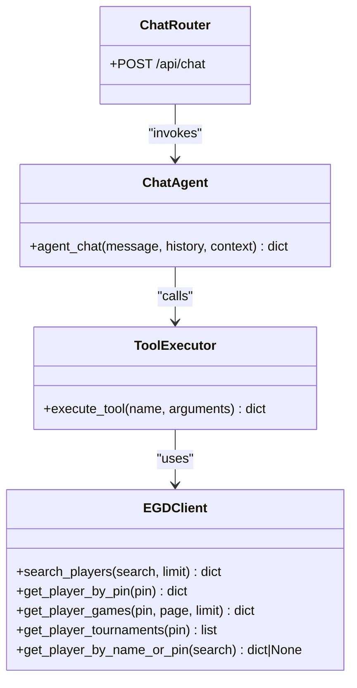
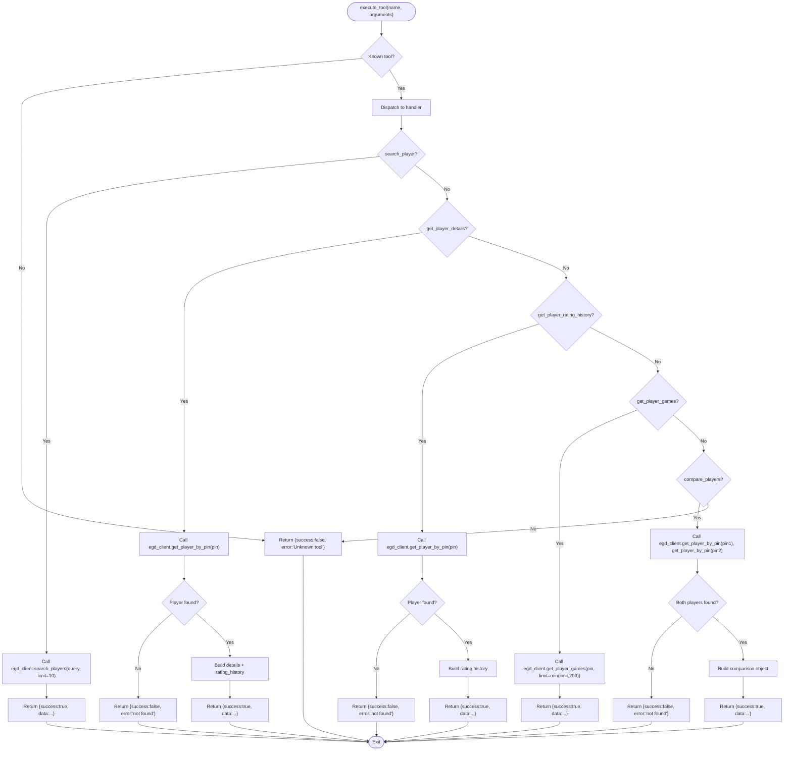
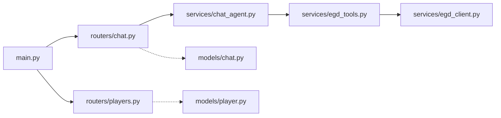

# Tool Definition & Execution System

<cite>
**Referenced Files in This Document**
- [egd_tools.py](file://backend/app/services/egd_tools.py)
- [chat_agent.py](file://backend/app/services/chat_agent.py)
- [chat.py](file://backend/app/routers/chat.py)
- [players.py](file://backend/app/routers/players.py)
- [main.py](file://backend/app/main.py)
- [player.py](file://backend/app/models/player.py)
- [chat.py](file://backend/app/models/chat.py)
- [EGD_API.md](file://docs/EGD_API.md)
</cite>

## Table of Contents
1. [Introduction](#introduction)
2. [Project Structure](#project-structure)
3. [Core Components](#core-components)
4. [Architecture Overview](#architecture-overview)
5. [Detailed Component Analysis](#detailed-component-analysis)
6. [Dependency Analysis](#dependency-analysis)
7. [Performance Considerations](#performance-considerations)
8. [Troubleshooting Guide](#troubleshooting-guide)
9. [Conclusion](#conclusion)
10. [Appendices](#appendices)

## Introduction
This document explains the EGD tools system used by GoNow’s agentic chat assistant. It covers:
- How tools are defined as OpenAI-compatible function schemas
- How tool calls are generated and executed via OpenRouter
- The parameter validation process and error handling patterns
- All available EGD tools, including search_player, get_player_details, get_player_rating_history, get_player_games, and compare_players
- Examples of usage, response formatting, and integration with OpenRouter’s function calling interface

The system is designed to be extensible: new tools can be added by defining a schema and an execution handler.

## Project Structure
The EGD tools system lives primarily under backend/app/services and integrates with FastAPI routers for HTTP endpoints.

**Diagram sources**
- [main.py:14-31](file://backend/app/main.py#L14-L31)
- [chat.py:9-24](file://backend/app/routers/chat.py#L9-L24)
- [players.py:8-40](file://backend/app/routers/players.py#L8-L40)
- [chat_agent.py:30-154](file://backend/app/services/chat_agent.py#L30-L154)
- [egd_tools.py:102-212](file://backend/app/services/egd_tools.py#L102-L212)

**Section sources**
- [main.py:14-31](file://backend/app/main.py#L14-L31)
- [chat.py:9-24](file://backend/app/routers/chat.py#L9-L24)
- [players.py:8-40](file://backend/app/routers/players.py#L8-L40)
- [chat_agent.py:30-154](file://backend/app/services/chat_agent.py#L30-L154)
- [egd_tools.py:102-212](file://backend/app/services/egd_tools.py#L102-L212)

## Core Components
- Tool Schemas: A list of OpenAI-compatible function definitions that describe each tool’s name, description, and parameters.
- Tool Executor: A dispatcher that validates arguments, calls the EGD client, and returns standardized results.
- Chat Agent: Orchestrates the conversation loop with OpenRouter, sends tool schemas, executes tool calls, and feeds results back until a final answer is produced.
- EGD Client: An async GraphQL client with caching that queries the European Go Database API.

Key responsibilities:
- Define tool schemas once and reuse them across the agent loop.
- Centralize execution logic and error handling in the executor.
- Keep external API calls isolated behind the client layer.

**Section sources**
- [egd_tools.py:5-99](file://backend/app/services/egd_tools.py#L5-L99)
- [egd_tools.py:102-212](file://backend/app/services/egd_tools.py#L102-L212)
- [chat_agent.py:30-154](file://backend/app/services/chat_agent.py#L30-L154)

## Architecture Overview
The chat agent uses OpenRouter’s native tool calling. The LLM decides when to call tools based on the provided schemas. The backend executes those tools against the EGD API and returns structured results.

**Diagram sources**
- [chat.py:9-24](file://backend/app/routers/chat.py#L9-L24)
- [chat_agent.py:30-154](file://backend/app/services/chat_agent.py#L30-L154)
- [egd_tools.py:102-212](file://backend/app/services/egd_tools.py#L102-L212)

## Detailed Component Analysis

### Tool Definitions (Function Schemas)
Tools are defined as OpenAI-compatible function schemas. Each entry includes:
- type: "function"
- function.name: unique identifier
- function.description: human-readable purpose
- function.parameters: JSON Schema describing required and optional fields

Available tools:
- search_player(query: string): Search players by name or PIN; returns a list of matches.
- get_player_details(pin: integer): Get detailed profile including grade, rating, biography, and rating history.
- get_player_rating_history(pin: integer): Get rating evolution over time from tournament placements.
- get_player_games(pin: integer, limit?: integer): Get recent games with opponents, results, and tournament info.
- compare_players(pin1: integer, pin2: integer): Compare two players side-by-side with key stats.

Parameter validation:
- Required fields are enforced by the JSON schema.
- Optional fields have defaults applied in the executor (e.g., limit defaults to 20).
- Numeric constraints are enforced at the executor level (e.g., limit capped at 200).

Error handling:
- Unknown tool names return a failure response with an error message.
- Missing player data returns a failure response indicating not found.
- Unexpected exceptions are caught and returned as failures with the exception message.

**Section sources**
- [egd_tools.py:5-99](file://backend/app/services/egd_tools.py#L5-L99)
- [egd_tools.py:102-212](file://backend/app/services/egd_tools.py#L102-L212)

#### Class Diagram: Tool Executor and Dependencies

**Diagram sources**
- [chat.py:9-24](file://backend/app/routers/chat.py#L9-L24)
- [chat_agent.py:30-154](file://backend/app/services/chat_agent.py#L30-L154)
- [egd_tools.py:102-212](file://backend/app/services/egd_tools.py#L102-L212)

### Tool Execution Flow
The executor maps tool names to implementation logic, performs argument extraction, calls the EGD client, and formats responses consistently.

**Diagram sources**
- [egd_tools.py:102-212](file://backend/app/services/egd_tools.py#L102-L212)

**Section sources**
- [egd_tools.py:102-212](file://backend/app/services/egd_tools.py#L102-L212)

### Chat Agent Integration with OpenRouter
The chat agent:
- Builds a messages array with system prompt, optional context, and conversation history.
- Sends messages plus EGD_TOOLS to OpenRouter.
- If the assistant includes tool_calls, the agent executes them via the executor and appends tool results as “tool” role messages.
- Loops until the assistant produces a final text response or reaches the maximum iterations.

Environment configuration:
- OPENROUTER_API_KEY: Required for chat functionality.
- CHAT_MODEL: Configurable model ID (default gemini-2.0-flash-001).
- CHAT_MAX_ITERATIONS: Limits how many times the agent may call tools per turn.

**Section sources**
- [chat_agent.py:30-154](file://backend/app/services/chat_agent.py#L30-L154)

### HTTP API Entry Points
- POST /api/chat: Accepts a user message, optional context, and optional history. Returns a reply, model name, and a log of tool calls made during the turn.
- GET /api/search?q=...: Searches players by name or PIN.
- GET /api/player/{pin}: Retrieves player details and rating history.
- GET /api/player/{pin}/games: Retrieves game history with pagination.
- GET /api/player/{pin}/tournaments: Retrieves tournament history.

These routes integrate with the EGD client directly for non-chat operations and delegate to the chat agent for agentic interactions.

**Section sources**
- [chat.py:9-24](file://backend/app/routers/chat.py#L9-L24)
- [players.py:8-40](file://backend/app/routers/players.py#L8-L40)
- [players.py:43-80](file://backend/app/routers/players.py#L43-L80)
- [players.py:83-94](file://backend/app/routers/players.py#L83-L94)
- [players.py:97-106](file://backend/app/routers/players.py#L97-L106)

### Data Models
Pydantic models define request/response shapes for chat and player data. While the tool executor returns plain dicts, these models standardize API contracts.

- ChatMessage: role and content.
- ChatRequest: message, context, history.
- ChatResponse: reply, model, tool_calls.
- Player-related models: PlayerSummary, TournamentInfo, PlacementInfo, PlayerDetail, SearchResponse.

**Section sources**
- [chat.py:6-21](file://backend/app/models/chat.py#L6-L21)
- [player.py:6-60](file://backend/app/models/player.py#L6-L60)

## Dependency Analysis
The following diagram shows how components depend on each other:

**Diagram sources**
- [main.py:14-31](file://backend/app/main.py#L14-L31)
- [chat.py:9-24](file://backend/app/routers/chat.py#L9-L24)
- [players.py:8-40](file://backend/app/routers/players.py#L8-L40)
- [chat_agent.py:30-154](file://backend/app/services/chat_agent.py#L30-L154)
- [egd_tools.py:102-212](file://backend/app/services/egd_tools.py#L102-L212)

**Section sources**
- [main.py:14-31](file://backend/app/main.py#L14-L31)
- [chat.py:9-24](file://backend/app/routers/chat.py#L9-L24)
- [players.py:8-40](file://backend/app/routers/players.py#L8-L40)
- [chat_agent.py:30-154](file://backend/app/services/chat_agent.py#L30-L154)
- [egd_tools.py:102-212](file://backend/app/services/egd_tools.py#L102-L212)

## Performance Considerations
- In-memory caching: The EGD client caches GraphQL responses for a configurable TTL to reduce external API calls.
- Limit enforcement: Tool executors cap limits (e.g., max 200 games) to prevent excessive payloads.
- Iteration limits: The chat agent caps tool-calling loops to avoid long-running conversations.
- Async I/O: All network calls use async clients to improve throughput.

[No sources needed since this section provides general guidance]

## Troubleshooting Guide
Common issues and resolutions:
- Missing OpenRouter API key: The chat endpoint returns a friendly message instructing to configure the environment variable.
- Unknown tool name: The executor returns a failure response with an error message; verify the tool exists in the schema list.
- Player not found: When a PIN does not exist, the executor returns a failure response; confirm the PIN or use search first.
- GraphQL errors: The client raises errors if the EGD API returns errors; check token validity and query correctness.
- Excessive tool calls: Increase CHAT_MAX_ITERATIONS cautiously; monitor costs and latency.

Operational checks:
- Health endpoint: GET /health returns status ok.
- API docs: Access Swagger UI at /docs.

**Section sources**
- [chat_agent.py:42-48](file://backend/app/services/chat_agent.py#L42-L48)
- [egd_tools.py:207-212](file://backend/app/services/egd_tools.py#L207-L212)
- [main.py:34-41](file://backend/app/main.py#L34-L41)

## Conclusion
The EGD tools system cleanly separates tool definition, execution, and orchestration. By using OpenRouter’s native tool calling, the LLM autonomously decides when to fetch real player data, while the backend ensures safe, validated, and consistent execution. Adding new tools requires only extending the schema list and implementing a handler in the executor.

[No sources needed since this section summarizes without analyzing specific files]

## Appendices

### How to Add a New Tool
Steps:
1. Define a new function schema in the tools list with name, description, and parameters.
2. Implement a handler in the executor that:
   - Validates and extracts arguments
   - Calls the EGD client method(s)
   - Formats a standardized response with success/data or success/error
3. Ensure any constraints (e.g., limits) are enforced in the executor.
4. Test via the chat agent by prompting the LLM to use the new tool.

Example references:
- Tool schema structure: [egd_tools.py:5-99](file://backend/app/services/egd_tools.py#L5-L99)
- Executor dispatch pattern: [egd_tools.py:102-212](file://backend/app/services/egd_tools.py#L102-L212)

**Section sources**
- [egd_tools.py:5-99](file://backend/app/services/egd_tools.py#L5-L99)
- [egd_tools.py:102-212](file://backend/app/services/egd_tools.py#L102-L212)

### Parameter Validation and Error Handling Patterns
- Required fields: Enforced by JSON schema; missing fields cause the LLM to supply them before calling.
- Optional fields: Defaults applied in the executor (e.g., limit defaults to 20).
- Numeric constraints: Enforced in the executor (e.g., limit capped at 200).
- Not found cases: Return explicit failure responses with descriptive errors.
- Exception safety: Wrap executor logic in try/except to catch unexpected errors and return structured failures.

**Section sources**
- [egd_tools.py:102-212](file://backend/app/services/egd_tools.py#L102-L212)

### Available Tools Reference
- search_player(query: string)
  - Purpose: Search players by name or PIN.
  - Parameters: query (required).
  - Response: {success: true, data: playersSearch result}.
- get_player_details(pin: integer)
  - Purpose: Get full player profile and rating history.
  - Parameters: pin (required).
  - Response: {success: true, data: player details with rating_history}.
- get_player_rating_history(pin: integer)
  - Purpose: Get rating evolution over time.
  - Parameters: pin (required).
  - Response: {success: true, data: sorted rating history entries}.
- get_player_games(pin: integer, limit?: integer)
  - Purpose: Get recent games with opponents and tournament info.
  - Parameters: pin (required), limit (optional, default 20, max 200).
  - Response: {success: true, data: games pagination result}.
- compare_players(pin1: integer, pin2: integer)
  - Purpose: Compare two players’ key stats.
  - Parameters: pin1, pin2 (both required).
  - Response: {success: true, data: player1 and player2 summaries}.

**Section sources**
- [egd_tools.py:5-99](file://backend/app/services/egd_tools.py#L5-L99)
- [egd_tools.py:102-212](file://backend/app/services/egd_tools.py#L102-L212)

### Example Usage Scenarios
- Ask the assistant to find a player by name and summarize their current grade and rating.
- Request a comparison between two players by their PINs.
- Retrieve a player’s recent games and highlight performance trends.
- Show a player’s rating evolution chart data for visualization.

Integration notes:
- Use POST /api/chat with a natural language message.
- The assistant will call appropriate tools automatically.
- Responses include a tool_calls log for observability.

**Section sources**
- [chat.py:9-24](file://backend/app/routers/chat.py#L9-L24)
- [chat_agent.py:30-154](file://backend/app/services/chat_agent.py#L30-L154)

### EGD API Reference
For GraphQL queries and types used by the EGD client, see the reference documentation.

**Section sources**
- [EGD_API.md:1-274](file://docs/EGD_API.md#L1-L274)