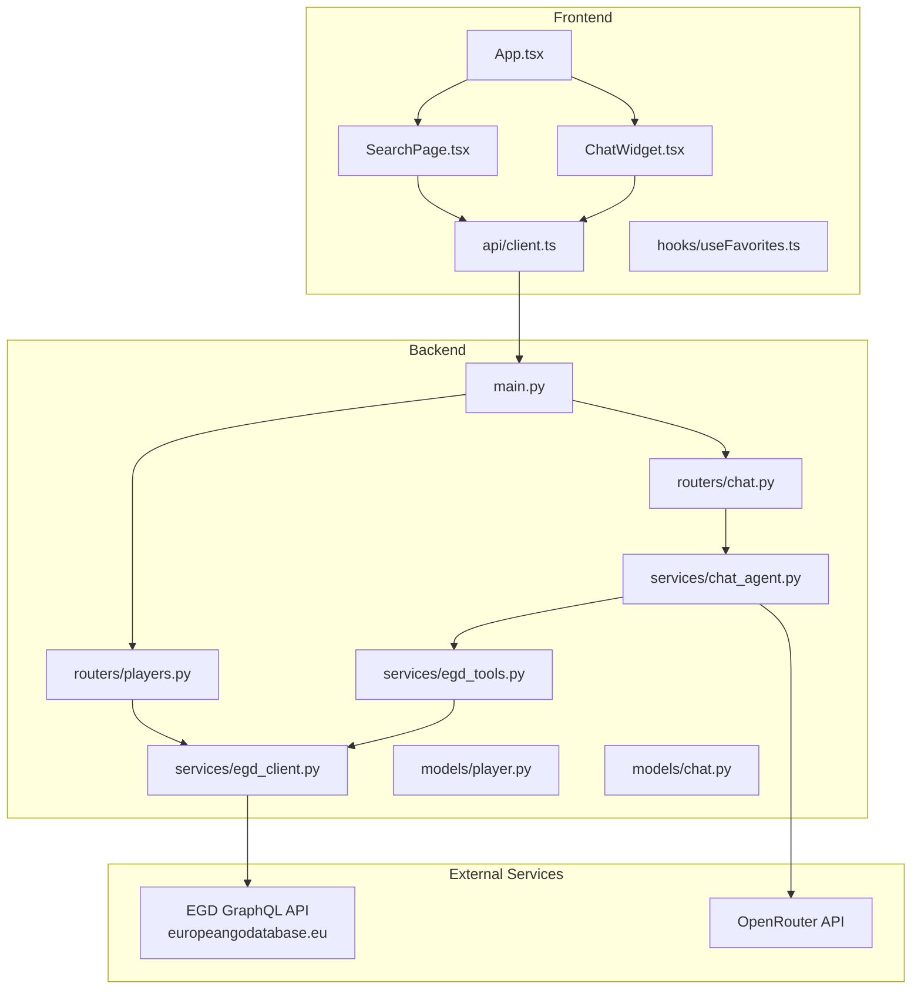
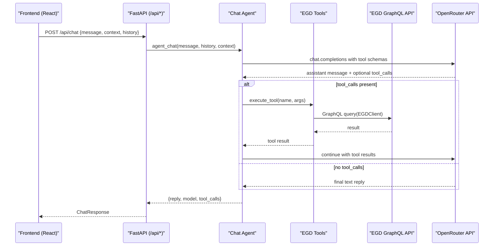
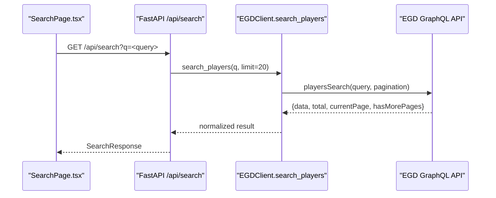
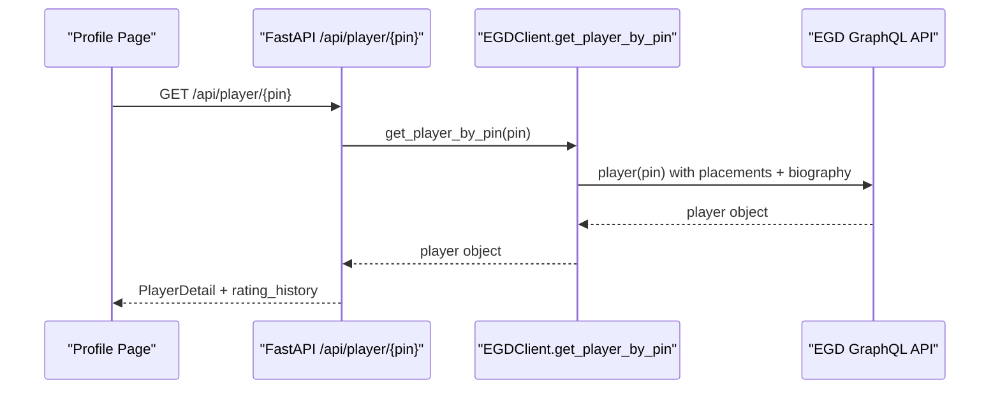
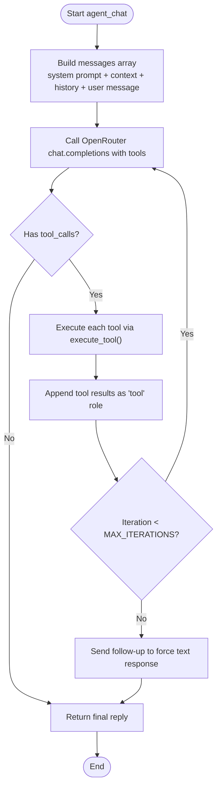
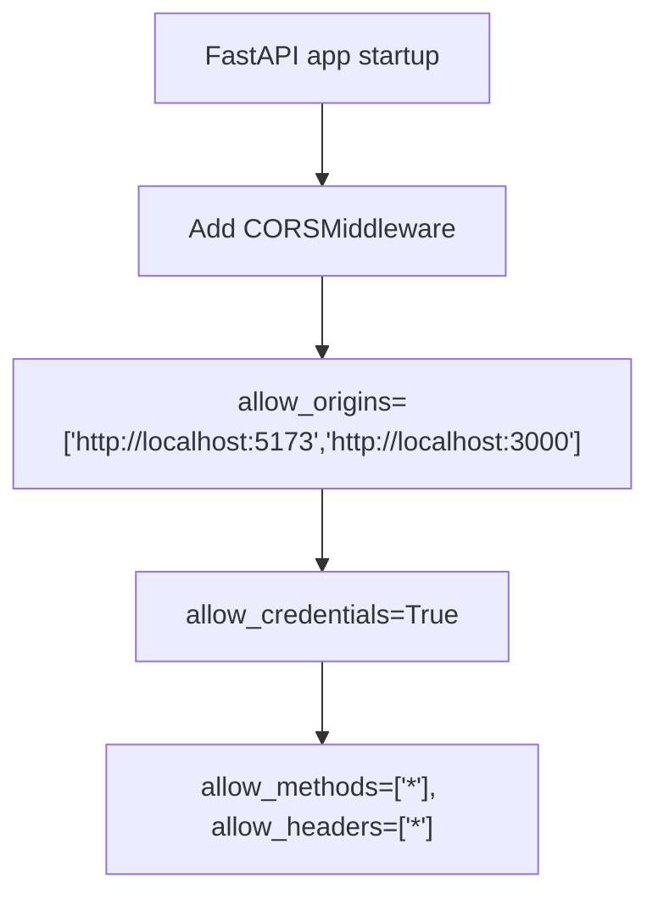
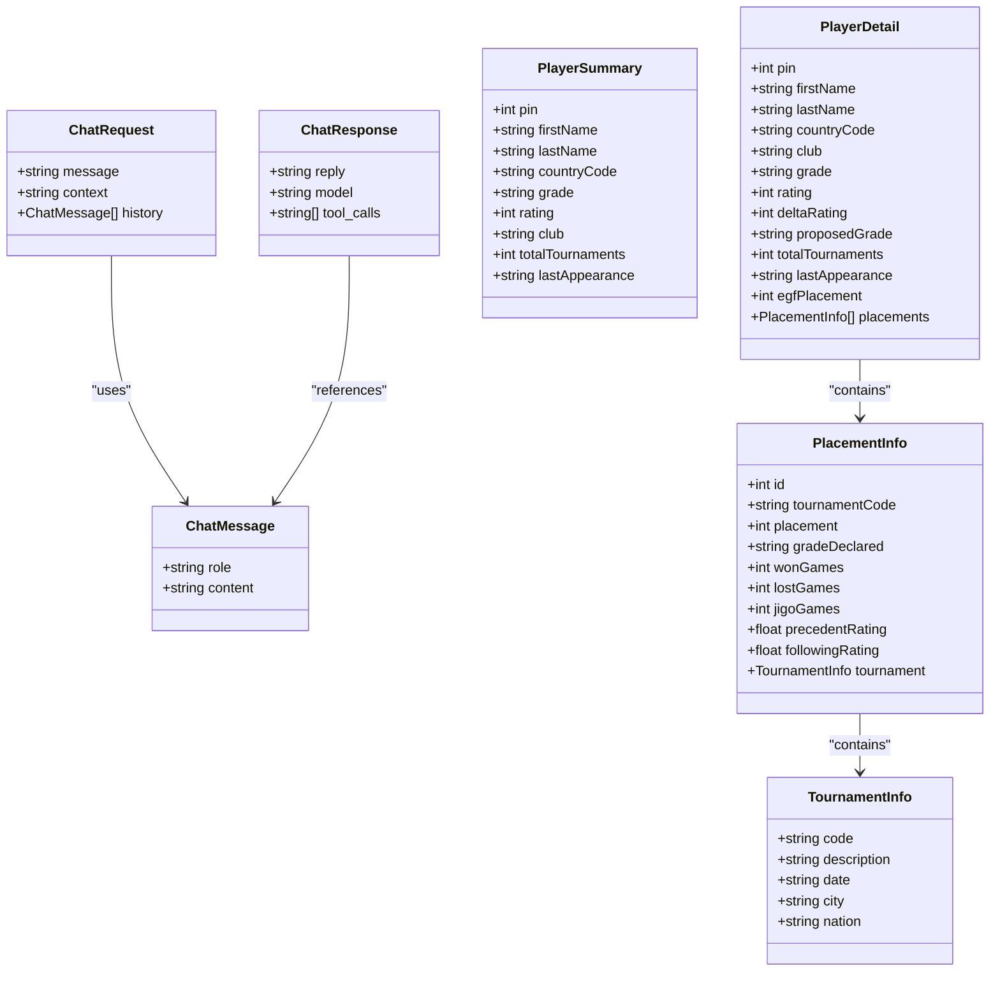
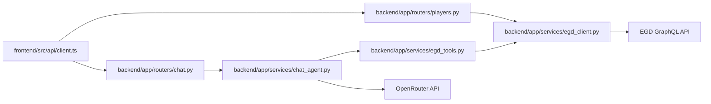

# Architecture Overview

<cite>
**Referenced Files in This Document**
- [main.py](file://backend/app/main.py)
- [players.py](file://backend/app/routers/players.py)
- [chat.py](file://backend/app/routers/chat.py)
- [egd_client.py](file://backend/app/services/egd_client.py)
- [egd_tools.py](file://backend/app/services/egd_tools.py)
- [chat_agent.py](file://backend/app/services/chat_agent.py)
- [player.py](file://backend/app/models/player.py)
- [chat.py](file://backend/app/models/chat.py)
- [client.ts](file://frontend/src/api/client.ts)
- [App.tsx](file://frontend/src/App.tsx)
- [SearchPage.tsx](file://frontend/src/pages/SearchPage.tsx)
- [ChatWidget.tsx](file://frontend/src/components/ChatWidget.tsx)
- [useFavorites.ts](file://frontend/src/hooks/useFavorites.ts)
- [README.md](file://README.md)
- [ARCHITECTURE.md](file://docs/ARCHITECTURE.md)
</cite>

## Table of Contents
1. Introduction
2. Project Structure
3. Core Components
4. Architecture Overview
5. Detailed Component Analysis
6. Dependency Analysis
7. Performance Considerations
8. Troubleshooting Guide
9. Conclusion

## Introduction
GoNow is a full-stack web application that provides player search, detailed profiles, rating evolution visualization, favorites management, and an agentic AI chat assistant. The frontend is built with React and TypeScript; the backend uses FastAPI to proxy EGD GraphQL queries and orchestrate OpenRouter tool calling for autonomous data retrieval and analysis.

Key goals:
- Provide fast, typo-tolerant player search via the European Go Database (EGD).
- Present rich player profiles with rating history and tournament details.
- Offer an agentic chat assistant that can call EGD tools on demand through OpenRouter’s native function calling.

## Project Structure
The repository follows a clear separation between frontend and backend layers, with service-oriented organization in the backend and feature-based components in the frontend.

**Diagram sources**
- [App.tsx:1-37](file://frontend/src/App.tsx#L1-L37)
- [SearchPage.tsx:1-240](file://frontend/src/pages/SearchPage.tsx#L1-L240)
- [ChatWidget.tsx:1-240](file://frontend/src/components/ChatWidget.tsx#L1-L240)
- [client.ts:1-86](file://frontend/src/api/client.ts#L1-L86)
- [main.py:1-42](file://backend/app/main.py#L1-L42)
- [players.py:1-107](file://backend/app/routers/players.py#L1-L107)
- [chat.py:1-95](file://backend/app/routers/chat.py#L1-L95)
- [egd_client.py:1-197](file://backend/app/services/egd_client.py#L1-L197)
- [egd_tools.py:1-212](file://backend/app/services/egd_tools.py#L1-L212)
- [chat_agent.py:1-154](file://backend/app/services/chat_agent.py#L1-L154)
- [player.py:1-60](file://backend/app/models/player.py#L1-L60)
- [chat.py:1-21](file://backend/app/models/chat.py#L1-L21)

**Section sources**
- [README.md:1-203](file://README.md#L1-L203)
- [ARCHITECTURE.md:1-99](file://docs/ARCHITECTURE.md#L1-L99)

## Core Components
- Frontend routing and state:
  - App root sets up React Router and TanStack Query provider.
  - Search page performs debounced queries and renders results.
  - Chat widget manages conversation state and calls backend chat endpoint.
  - Favorites hook persists user favorites in localStorage.
- Backend API layer:
  - FastAPI app configures CORS and mounts routers.
  - Players router exposes search and profile endpoints.
  - Chat router handles agentic chat requests.
- Services:
  - EGD client executes GraphQL queries with in-memory caching.
  - Tool definitions map LLM function calls to EGD operations.
  - Chat agent orchestrates OpenRouter tool-calling loop.
- Models:
  - Pydantic models define request/response contracts for chat and player data.

**Section sources**
- [App.tsx:1-37](file://frontend/src/App.tsx#L1-L37)
- [SearchPage.tsx:1-240](file://frontend/src/pages/SearchPage.tsx#L1-L240)
- [ChatWidget.tsx:1-240](file://frontend/src/components/ChatWidget.tsx#L1-L240)
- [useFavorites.ts:1-49](file://frontend/src/hooks/useFavorites.ts#L1-L49)
- [client.ts:1-86](file://frontend/src/api/client.ts#L1-L86)
- [main.py:1-42](file://backend/app/main.py#L1-L42)
- [players.py:1-107](file://backend/app/routers/players.py#L1-L107)
- [chat.py:1-95](file://backend/app/routers/chat.py#L1-L95)
- [egd_client.py:1-197](file://backend/app/services/egd_client.py#L1-L197)
- [egd_tools.py:1-212](file://backend/app/services/egd_tools.py#L1-L212)
- [chat_agent.py:1-154](file://backend/app/services/chat_agent.py#L1-L154)
- [player.py:1-60](file://backend/app/models/player.py#L1-L60)
- [chat.py:1-21](file://backend/app/models/chat.py#L1-L21)

## Architecture Overview
The system follows a service-oriented architecture:
- Frontend communicates with backend REST APIs over HTTP.
- Backend proxies all EGD GraphQL calls to keep tokens server-side and avoid CORS issues.
- Agentic chat leverages OpenRouter’s native tool calling: the LLM decides when to call tools, the backend executes them against EGD, and feeds results back until a final answer is produced.

**Diagram sources**
- [chat.py:1-95](file://backend/app/routers/chat.py#L1-L95)
- [chat_agent.py:1-154](file://backend/app/services/chat_agent.py#L1-L154)
- [egd_tools.py:1-212](file://backend/app/services/egd_tools.py#L1-L212)
- [egd_client.py:1-197](file://backend/app/services/egd_client.py#L1-L197)

**Section sources**
- [README.md:24-55](file://README.md#L24-L55)
- [ARCHITECTURE.md:1-99](file://docs/ARCHITECTURE.md#L1-L99)

## Detailed Component Analysis

### Player Data Flow (Search and Profiles)
This flow shows how the frontend retrieves player data from EGD via the backend.

**Diagram sources**
- [SearchPage.tsx:1-240](file://frontend/src/pages/SearchPage.tsx#L1-L240)
- [client.ts:59-62](file://frontend/src/api/client.ts#L59-L62)
- [players.py:8-40](file://backend/app/routers/players.py#L8-L40)
- [egd_client.py:44-70](file://backend/app/services/egd_client.py#L44-L70)

**Section sources**
- [SearchPage.tsx:1-240](file://frontend/src/pages/SearchPage.tsx#L1-L240)
- [client.ts:59-62](file://frontend/src/api/client.ts#L59-L62)
- [players.py:8-40](file://backend/app/routers/players.py#L8-L40)
- [egd_client.py:44-70](file://backend/app/services/egd_client.py#L44-L70)

### Player Profile and Rating History

**Diagram sources**
- [players.py:43-80](file://backend/app/routers/players.py#L43-L80)
- [egd_client.py:72-118](file://backend/app/services/egd_client.py#L72-L118)

**Section sources**
- [players.py:43-80](file://backend/app/routers/players.py#L43-L80)
- [egd_client.py:72-118](file://backend/app/services/egd_client.py#L72-L118)

### Agentic Chat Loop

**Diagram sources**
- [chat_agent.py:30-154](file://backend/app/services/chat_agent.py#L30-L154)
- [egd_tools.py:102-212](file://backend/app/services/egd_tools.py#L102-L212)

**Section sources**
- [chat_agent.py:30-154](file://backend/app/services/chat_agent.py#L30-L154)
- [egd_tools.py:102-212](file://backend/app/services/egd_tools.py#L102-L212)

### CORS Configuration
CORS is configured at the FastAPI entrypoint to allow the local development frontends.

**Diagram sources**
- [main.py:20-27](file://backend/app/main.py#L20-L27)

**Section sources**
- [main.py:20-27](file://backend/app/main.py#L20-L27)

### Data Models
Pydantic models define contracts for chat and player responses.

**Diagram sources**
- [chat.py:1-21](file://backend/app/models/chat.py#L1-L21)
- [player.py:1-60](file://backend/app/models/player.py#L1-L60)

**Section sources**
- [chat.py:1-21](file://backend/app/models/chat.py#L1-L21)
- [player.py:1-60](file://backend/app/models/player.py#L1-L60)

## Dependency Analysis
High-level dependencies across layers:

**Diagram sources**
- [client.ts:1-86](file://frontend/src/api/client.ts#L1-L86)
- [players.py:1-107](file://backend/app/routers/players.py#L1-L107)
- [chat.py:1-95](file://backend/app/routers/chat.py#L1-L95)
- [egd_client.py:1-197](file://backend/app/services/egd_client.py#L1-L197)
- [egd_tools.py:1-212](file://backend/app/services/egd_tools.py#L1-L212)
- [chat_agent.py:1-154](file://backend/app/services/chat_agent.py#L1-L154)

**Section sources**
- [client.ts:1-86](file://frontend/src/api/client.ts#L1-L86)
- [players.py:1-107](file://backend/app/routers/players.py#L1-L107)
- [chat.py:1-95](file://backend/app/routers/chat.py#L1-L95)
- [egd_client.py:1-197](file://backend/app/services/egd_client.py#L1-L197)
- [egd_tools.py:1-212](file://backend/app/services/egd_tools.py#L1-L212)
- [chat_agent.py:1-154](file://backend/app/services/chat_agent.py#L1-L154)

## Performance Considerations
- In-memory caching in EGD client:
  - TTL-based cache keyed by query and variables reduces repeated EGD calls.
  - Suitable for single-process deployments; consider distributed caches (Redis) for multi-worker setups.
- Debounced search in frontend:
  - Reduces unnecessary network requests during typing.
- TanStack Query configuration:
  - Stale time and retry settings balance freshness and performance.
- Agentic chat limits:
  - Max iterations cap prevents excessive tool-calling loops.
  - Model selection via environment variable allows tuning speed vs quality.

[No sources needed since this section provides general guidance]

## Troubleshooting Guide
Common issues and resolutions:
- CORS errors from browser:
  - Ensure allowed origins include your dev server URL.
- Missing or invalid API keys:
  - Chat disabled if OPENROUTER_API_KEY is not set; configure .env accordingly.
- EGD token missing or invalid:
  - Set EGD_API_TOKEN in backend .env; verify token permissions.
- High latency or timeouts:
  - Increase httpx timeouts where appropriate; check EGD availability.
- Excessive tool calls:
  - Reduce CHAT_MAX_ITERATIONS or adjust prompts to minimize redundant calls.

**Section sources**
- [main.py:20-27](file://backend/app/main.py#L20-L27)
- [chat_agent.py:42-48](file://backend/app/services/chat_agent.py#L42-L48)
- [egd_client.py:12-19](file://backend/app/services/egd_client.py#L12-L19)

## Conclusion
GoNow implements a clean, service-oriented architecture with clear separation of concerns:
- Frontend focuses on UI, routing, and client-side caching.
- Backend provides REST endpoints, proxies EGD GraphQL calls, and orchestrates OpenRouter tool calling.
- Agentic chat leverages native function calling to autonomously retrieve and analyze real player data.
This design balances simplicity, performance, and extensibility while keeping sensitive credentials server-side and minimizing external dependencies.

[No sources needed since this section summarizes without analyzing specific files]