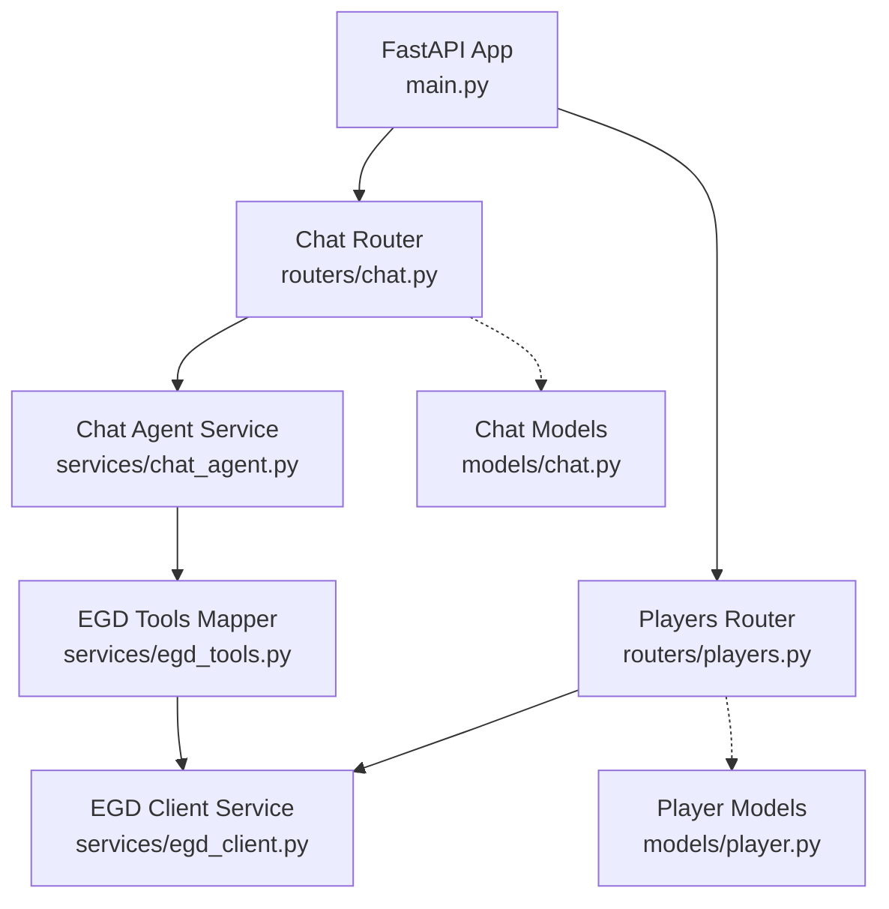
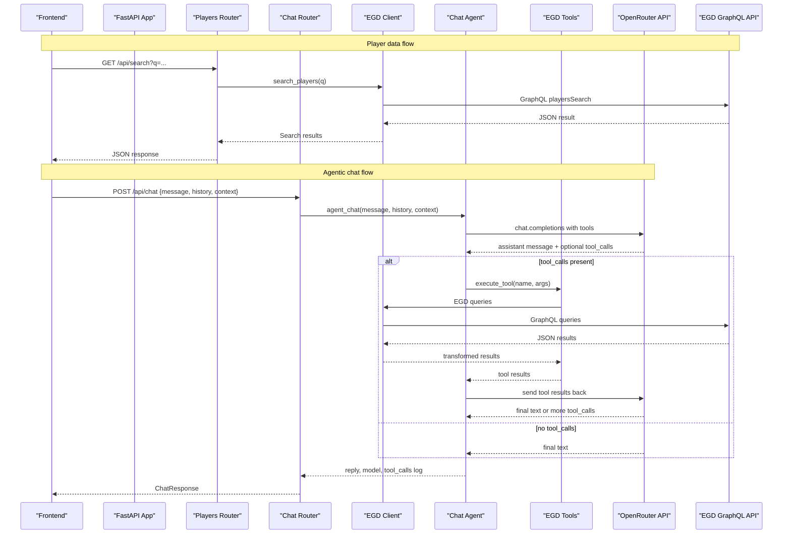
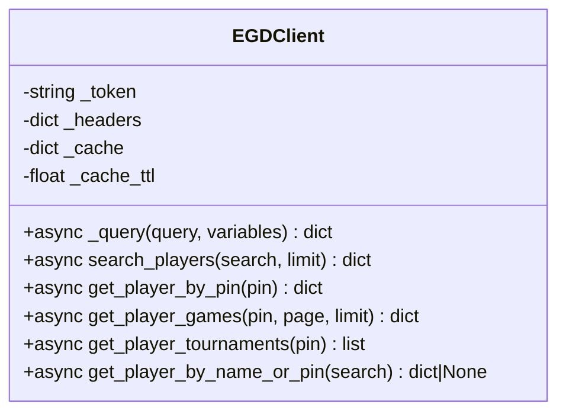
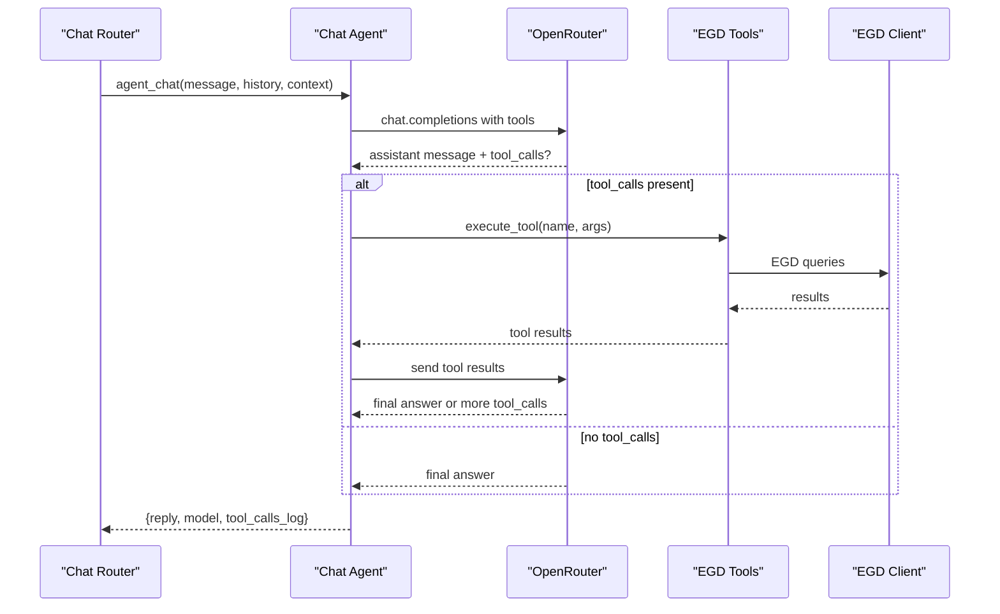
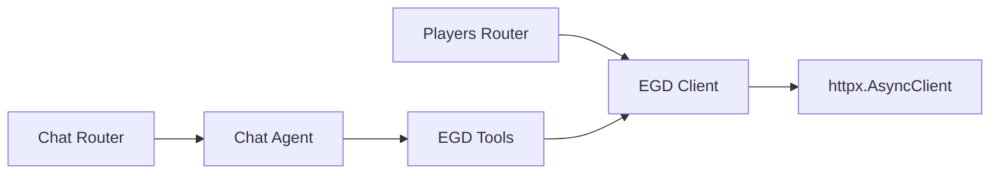

# Backend Architecture

<cite>
**Referenced Files in This Document**
- [main.py](file://backend/app/main.py)
- [players.py](file://backend/app/routers/players.py)
- [chat.py](file://backend/app/routers/chat.py)
- [egd_client.py](file://backend/app/services/egd_client.py)
- [chat_agent.py](file://backend/app/services/chat_agent.py)
- [egd_tools.py](file://backend/app/services/egd_tools.py)
- [player.py](file://backend/app/models/player.py)
- [chat.py](file://backend/app/models/chat.py)
- [requirements.txt](file://backend/requirements.txt)
</cite>

## Table of Contents
1. [Introduction](#introduction)
2. [Project Structure](#project-structure)
3. [Core Components](#core-components)
4. [Architecture Overview](#architecture-overview)
5. [Detailed Component Analysis](#detailed-component-analysis)
6. [Dependency Analysis](#dependency-analysis)
7. [Performance Considerations](#performance-considerations)
8. [Troubleshooting Guide](#troubleshooting-guide)
9. [Conclusion](#conclusion)

## Introduction
This document describes the FastAPI backend architecture for the GoNow application. It focuses on the service-oriented design, router organization, middleware configuration (including CORS), dependency injection patterns, the EGD GraphQL client implementation using httpx with in-memory caching, error handling strategies, request/response flows, authentication mechanisms, and performance optimization techniques.

The backend exposes REST endpoints to serve player data from the European Go Database (EGD) via a GraphQL API and provides an agentic chat endpoint that uses OpenRouter’s native tool calling to autonomously query EGD data and return insights.

## Project Structure
The backend is organized by feature and layer:
- Application entrypoint and middleware setup
- Routers for HTTP endpoints
- Services for business logic and external integrations
- Pydantic models for request/response validation

**Diagram sources**
- [main.py:14-31](file://backend/app/main.py#L14-L31)
- [players.py:1-107](file://backend/app/routers/players.py#L1-L107)
- [chat.py:1-95](file://backend/app/routers/chat.py#L1-L95)
- [egd_client.py:11-197](file://backend/app/services/egd_client.py#L11-L197)
- [chat_agent.py:1-154](file://backend/app/services/chat_agent.py#L1-L154)
- [egd_tools.py:1-212](file://backend/app/services/egd_tools.py#L1-L212)
- [player.py:1-60](file://backend/app/models/player.py#L1-L60)
- [chat.py:1-21](file://backend/app/models/chat.py#L1-L21)

**Section sources**
- [main.py:14-31](file://backend/app/main.py#L14-L31)
- [players.py:1-107](file://backend/app/routers/players.py#L1-L107)
- [chat.py:1-95](file://backend/app/routers/chat.py#L1-L95)
- [egd_client.py:11-197](file://backend/app/services/egd_client.py#L11-L197)
- [chat_agent.py:1-154](file://backend/app/services/chat_agent.py#L1-L154)
- [egd_tools.py:1-212](file://backend/app/services/egd_tools.py#L1-L212)
- [player.py:1-60](file://backend/app/models/player.py#L1-L60)
- [chat.py:1-21](file://backend/app/models/chat.py#L1-L21)

## Core Components
- Application bootstrap and middleware:
  - Initializes FastAPI app, loads environment variables, mounts routers, and configures CORS.
- Routers:
  - Players: search, profile, games, tournaments.
  - Chat: agentic chat endpoint.
- Services:
  - EGD client: httpx-based GraphQL client with in-memory TTL cache.
  - Chat agent: orchestrates OpenRouter tool-calling loop and executes tools via EGD tools mapper.
  - EGD tools: maps LLM function calls to backend operations.
- Models:
  - Pydantic schemas for chat requests/responses and player data structures.

Key responsibilities:
- Routers handle HTTP I/O, parameter parsing, and error mapping.
- Services encapsulate business logic and external API interactions.
- Models enforce request/response contracts.

**Section sources**
- [main.py:14-31](file://backend/app/main.py#L14-L31)
- [players.py:1-107](file://backend/app/routers/players.py#L1-L107)
- [chat.py:1-95](file://backend/app/routers/chat.py#L1-L95)
- [egd_client.py:11-197](file://backend/app/services/egd_client.py#L11-L197)
- [chat_agent.py:1-154](file://backend/app/services/chat_agent.py#L1-L154)
- [egd_tools.py:1-212](file://backend/app/services/egd_tools.py#L1-L212)
- [player.py:1-60](file://backend/app/models/player.py#L1-L60)
- [chat.py:1-21](file://backend/app/models/chat.py#L1-L21)

## Architecture Overview
The backend follows a service-oriented architecture:
- HTTP endpoints are defined in routers.
- Business logic and external integrations live in services.
- Data contracts are modeled with Pydantic schemas.
- The EGD GraphQL client abstracts network calls and caching.
- The chat agent implements a tool-calling loop over OpenRouter, executing backend tools that call the EGD client.

**Diagram sources**
- [players.py:8-40](file://backend/app/routers/players.py#L8-L40)
- [chat.py:9-24](file://backend/app/routers/chat.py#L9-L24)
- [chat.py:47-94](file://backend/app/routers/chat.py#L47-L94)
- [chat_agent.py:30-154](file://backend/app/services/chat_agent.py#L30-L154)
- [egd_tools.py:102-212](file://backend/app/services/egd_tools.py#L102-L212)
- [egd_client.py:21-197](file://backend/app/services/egd_client.py#L21-L197)

**Section sources**
- [players.py:8-40](file://backend/app/routers/players.py#L8-L40)
- [chat.py:9-24](file://backend/app/routers/chat.py#L9-L24)
- [chat.py:47-94](file://backend/app/routers/chat.py#L47-L94)
- [chat_agent.py:30-154](file://backend/app/services/chat_agent.py#L30-L154)
- [egd_tools.py:102-212](file://backend/app/services/egd_tools.py#L102-L212)
- [egd_client.py:21-197](file://backend/app/services/egd_client.py#L21-L197)

## Detailed Component Analysis

### Application Bootstrap and Middleware
- Loads environment variables from a .env file located at the backend root.
- Configures CORS to allow frontend origins with credentials and permissive methods/headers.
- Mounts routers under a shared prefix and exposes health and root endpoints.

CORS configuration highlights:
- Allowed origins include common local development ports.
- Credentials allowed for cookie/session scenarios if needed.
- Methods and headers set to wildcard for flexibility during development.

**Section sources**
- [main.py:8-10](file://backend/app/main.py#L8-L10)
- [main.py:20-27](file://backend/app/main.py#L20-L27)
- [main.py:29-31](file://backend/app/main.py#L29-L31)
- [main.py:34-41](file://backend/app/main.py#L34-L41)

### Dependency Injection Patterns
- The current implementation uses module-level singletons for shared state:
  - EGD client singleton instance exposed by the client module.
  - Routers import and use this singleton directly.
- This pattern avoids explicit DI containers but centralizes configuration and caching within the client.

Considerations:
- Singleton usage simplifies initialization and ensures consistent cache and token configuration across requests.
- For stricter DI, consider passing the client instance via FastAPI dependencies to improve testability and isolation.

**Section sources**
- [egd_client.py:195-197](file://backend/app/services/egd_client.py#L195-L197)
- [players.py:1-5](file://backend/app/routers/players.py#L1-L5)

### EGD GraphQL Client (httpx + In-Memory Cache)
Responsibilities:
- Builds authenticated requests with Authorization header.
- Executes GraphQL queries via httpx.AsyncClient.
- Implements in-memory TTL cache keyed by query and variables.
- Provides typed helpers for searching players, fetching details, games, and tournaments.

Cache strategy:
- Keyed by stringified query and variables.
- TTL-based eviction to reduce external API load.
- Stores timestamp alongside payload to determine freshness.

Error handling:
- Raises ValueError when GraphQL responses contain errors.
- Propagates httpx exceptions up to callers for centralized handling.

Complexity:
- Cache lookup O(1).
- Network latency dominates; cache reduces repeated calls.

**Section sources**
- [egd_client.py:11-20](file://backend/app/services/egd_client.py#L11-L20)
- [egd_client.py:21-42](file://backend/app/services/egd_client.py#L21-L42)
- [egd_client.py:44-70](file://backend/app/services/egd_client.py#L44-L70)
- [egd_client.py:72-118](file://backend/app/services/egd_client.py#L72-L118)
- [egd_client.py:120-150](file://backend/app/services/egd_client.py#L120-L150)
- [egd_client.py:152-177](file://backend/app/services/egd_client.py#L152-L177)
- [egd_client.py:179-192](file://backend/app/services/egd_client.py#L179-L192)

#### Class Diagram: EGD Client

**Diagram sources**
- [egd_client.py:11-197](file://backend/app/services/egd_client.py#L11-L197)

### Chat Agent (OpenRouter Tool Calling Loop)
Responsibilities:
- Constructs messages including system prompt, optional context, and conversation history.
- Sends requests to OpenRouter with tool schemas.
- Iteratively processes tool_calls, executes them via the tools mapper, and feeds results back until a final answer is produced or max iterations reached.

Tool execution:
- Uses a dispatcher to map function names to backend operations.
- Ensures arguments are parsed safely and returns structured results.

Configuration:
- Model and iteration limits are configurable via environment variables.

**Section sources**
- [chat_agent.py:10-12](file://backend/app/services/chat_agent.py#L10-L12)
- [chat_agent.py:30-63](file://backend/app/services/chat_agent.py#L30-L63)
- [chat_agent.py:67-126](file://backend/app/services/chat_agent.py#L67-L126)
- [chat_agent.py:128-154](file://backend/app/services/chat_agent.py#L128-L154)

#### Sequence Diagram: Chat Agent Flow

**Diagram sources**
- [chat_agent.py:30-154](file://backend/app/services/chat_agent.py#L30-L154)
- [egd_tools.py:102-212](file://backend/app/services/egd_tools.py#L102-L212)
- [egd_client.py:21-197](file://backend/app/services/egd_client.py#L21-L197)

### EGD Tools Mapper
Responsibilities:
- Defines OpenAI-compatible tool schemas for function calling.
- Maps function names to backend operations using the EGD client.
- Normalizes and enriches results for consumption by the chat agent.

Tools provided:
- search_player
- get_player_details
- get_player_rating_history
- get_player_games
- compare_players

**Section sources**
- [egd_tools.py:5-99](file://backend/app/services/egd_tools.py#L5-L99)
- [egd_tools.py:102-212](file://backend/app/services/egd_tools.py#L102-L212)

### Routers: Players
Endpoints:
- GET /api/search?q=...
  - If query is numeric, attempts direct PIN lookup first; otherwise falls back to name search.
  - Returns standardized search result structure.
- GET /api/player/{pin}
  - Retrieves player details and constructs rating history from placements.
  - Sorts history by date for charting.
- GET /api/player/{pin}/games
  - Paginated game history retrieval with constraints.
- GET /api/player/{pin}/tournaments
  - Aggregates unique tournaments from placements and sorts by date.

Error handling:
- Converts exceptions into HTTPException with appropriate status codes.

**Section sources**
- [players.py:8-40](file://backend/app/routers/players.py#L8-L40)
- [players.py:43-80](file://backend/app/routers/players.py#L43-L80)
- [players.py:83-94](file://backend/app/routers/players.py#L83-L94)
- [players.py:97-106](file://backend/app/routers/players.py#L97-L106)

### Routers: Chat
Endpoints:
- POST /api/chat
  - Accepts message, optional context, and conversation history.
  - Delegates to the chat agent for agentic processing.
  - Returns a structured response including reply, model, and tool_calls log.

Error handling:
- Wraps exceptions in HTTPException with 500 status.

Note:
- There appears to be duplicate route definitions in the same file; only one will be active depending on import order. Ensure a single authoritative definition.

**Section sources**
- [chat.py:9-24](file://backend/app/routers/chat.py#L9-L24)
- [chat.py:47-94](file://backend/app/routers/chat.py#L47-L94)

### Models: Chat and Player
- Chat models define request/response shapes for the chat endpoint.
- Player models describe expected structures for player summaries, tournament info, placement info, and search responses.

Usage:
- Chat models are used by the chat router for validation and response typing.
- Player models provide type hints and documentation for data returned by the players router.

**Section sources**
- [chat.py:6-21](file://backend/app/models/chat.py#L6-L21)
- [player.py:6-60](file://backend/app/models/player.py#L6-L60)

## Dependency Analysis
High-level dependencies:
- Routers depend on services.
- Chat agent depends on tools mapper and indirectly on EGD client.
- EGD client depends on httpx and environment configuration.

**Diagram sources**
- [players.py:1-107](file://backend/app/routers/players.py#L1-L107)
- [chat.py:1-95](file://backend/app/routers/chat.py#L1-L95)
- [chat_agent.py:1-154](file://backend/app/services/chat_agent.py#L1-L154)
- [egd_tools.py:1-212](file://backend/app/services/egd_tools.py#L1-L212)
- [egd_client.py:1-197](file://backend/app/services/egd_client.py#L1-L197)

**Section sources**
- [players.py:1-107](file://backend/app/routers/players.py#L1-L107)
- [chat.py:1-95](file://backend/app/routers/chat.py#L1-L95)
- [chat_agent.py:1-154](file://backend/app/services/chat_agent.py#L1-L154)
- [egd_tools.py:1-212](file://backend/app/services/egd_tools.py#L1-L212)
- [egd_client.py:1-197](file://backend/app/services/egd_client.py#L1-L197)

## Performance Considerations
- In-memory caching:
  - Reduces repeated EGD GraphQL calls with TTL-based eviction.
  - Effective for read-heavy workloads and improves response times.
- Pagination and limits:
  - Game history endpoints constrain page size to prevent large payloads.
- Async I/O:
  - httpx.AsyncClient enables non-blocking network calls.
- Model shaping:
  - Routers transform raw EGD responses into concise structures suitable for clients.
- Configuration:
  - Environment-driven model selection and iteration limits help balance quality vs. cost/latency.

[No sources needed since this section provides general guidance]

## Troubleshooting Guide
Common issues and resolutions:
- Missing environment variables:
  - Ensure EGD_API_TOKEN and OPENROUTER_API_KEY are set in the backend .env file.
- CORS errors:
  - Verify frontend origin matches configured allow_origins and credentials settings.
- GraphQL errors:
  - Check EGD API token validity and query correctness; errors are raised with details.
- Chat not responding:
  - Confirm OPENROUTER_API_KEY is present; otherwise, chat returns a fallback message.
- Duplicate route definitions:
  - Remove redundant route definitions in the chat router to avoid conflicts.

Operational checks:
- Health endpoint returns status ok for readiness probes.
- Root endpoint confirms API availability and docs location.

**Section sources**
- [main.py:34-41](file://backend/app/main.py#L34-L41)
- [main.py:20-27](file://backend/app/main.py#L20-L27)
- [chat.py:47-55](file://backend/app/routers/chat.py#L47-L55)
- [chat_agent.py:42-48](file://backend/app/services/chat_agent.py#L42-L48)
- [egd_client.py:38-39](file://backend/app/services/egd_client.py#L38-L39)

## Conclusion
The GoNow backend employs a clear service-oriented architecture with well-defined routers, services, and models. The EGD GraphQL client abstracts external API interactions and includes in-memory caching to optimize performance. The agentic chat leverages OpenRouter’s native tool calling to dynamically fetch real-time player data through a controlled set of backend tools. Error handling is centralized in routers, while configuration is driven by environment variables. Future improvements could introduce explicit dependency injection for enhanced testability and additional resilience patterns such as retries and circuit breakers.