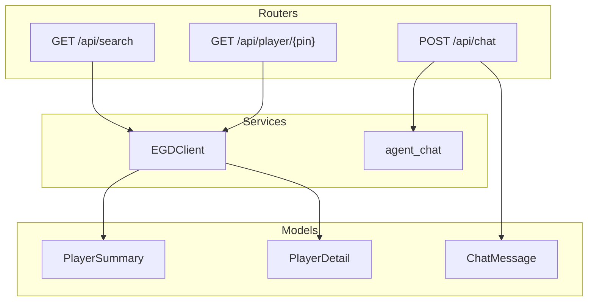
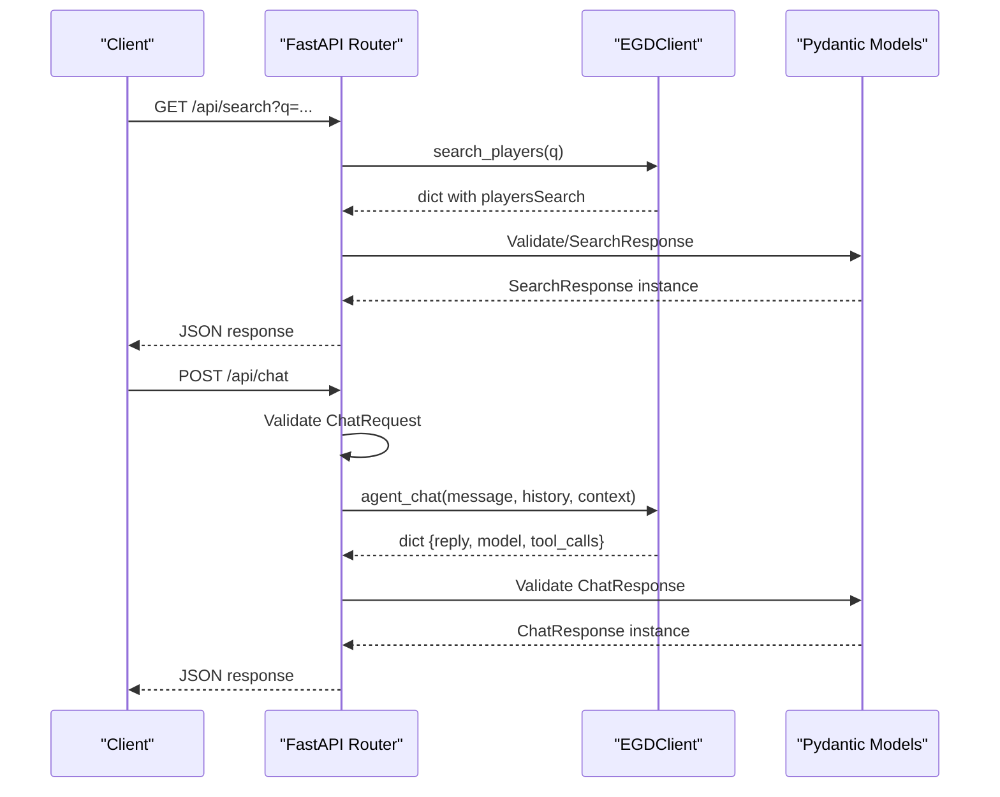
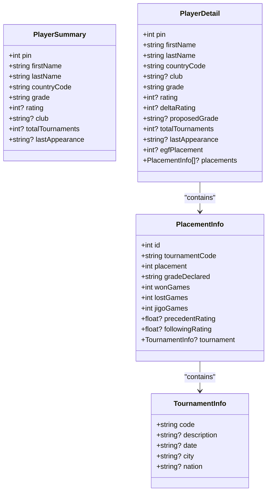
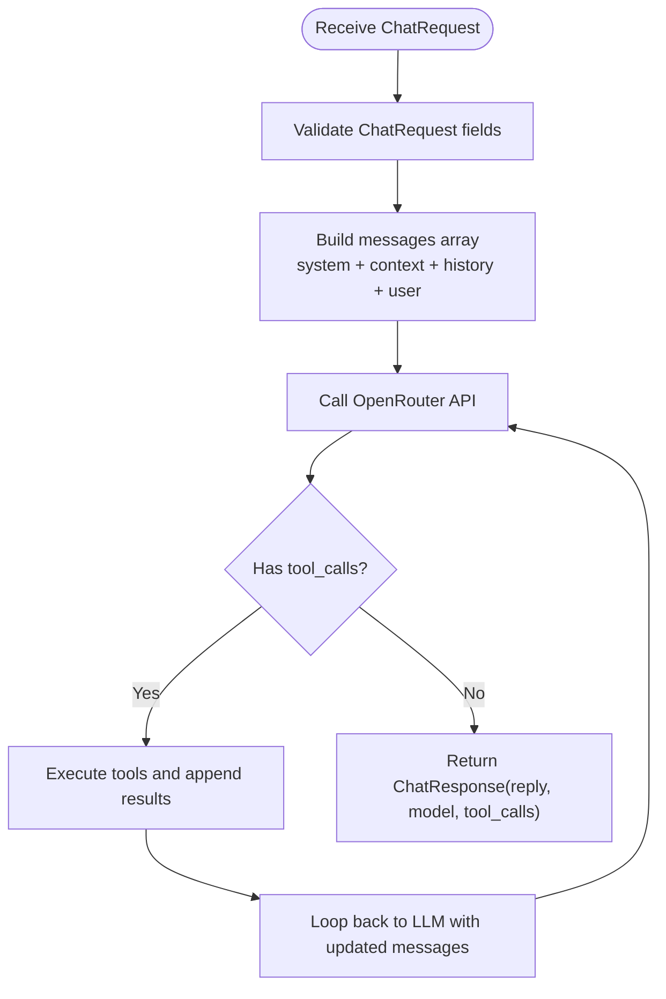
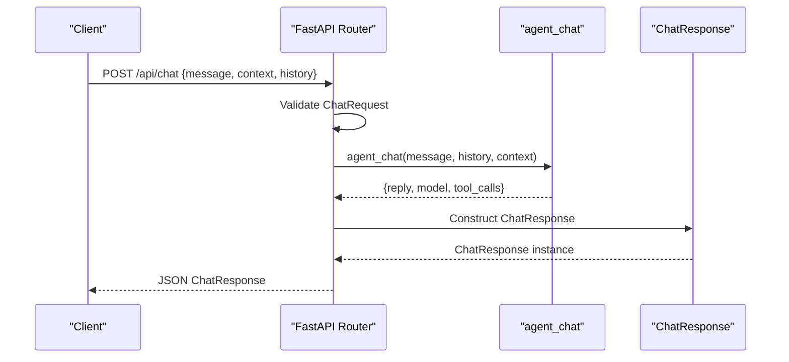
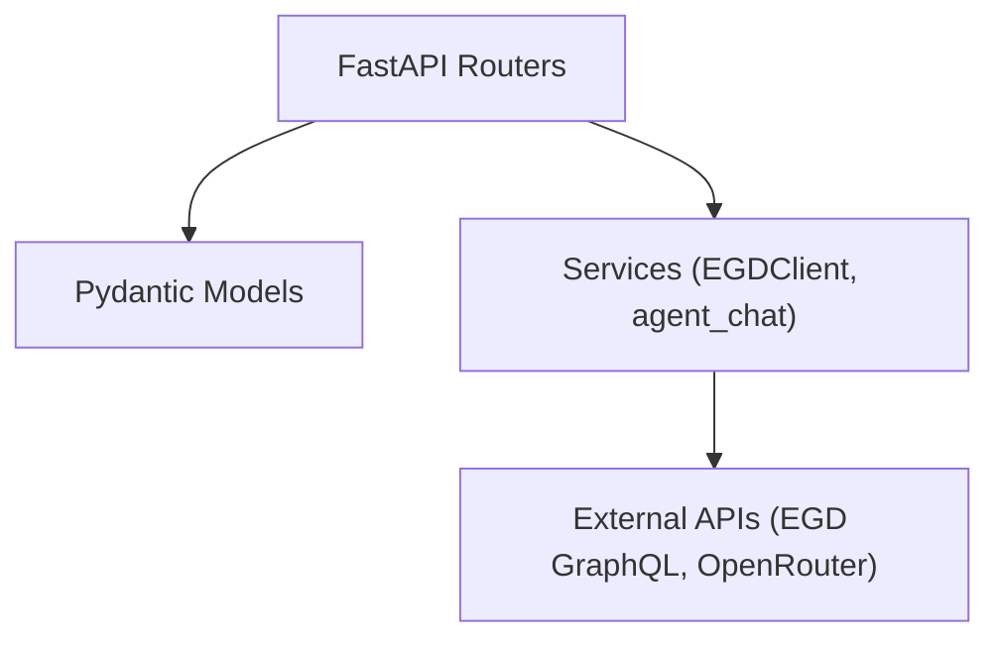

# Data Models and Validation

<cite>
**Referenced Files in This Document**
- [player.py](file://backend/app/models/player.py)
- [chat.py](file://backend/app/models/chat.py)
- [players.py](file://backend/app/routers/players.py)
- [chat.py](file://backend/app/routers/chat.py)
- [egd_client.py](file://backend/app/services/egd_client.py)
- [main.py](file://backend/app/main.py)
</cite>

## Table of Contents
1. [Introduction](#introduction)
2. [Project Structure](#project-structure)
3. [Core Components](#core-components)
4. [Architecture Overview](#architecture-overview)
5. [Detailed Component Analysis](#detailed-component-analysis)
6. [Dependency Analysis](#dependency-analysis)
7. [Performance Considerations](#performance-considerations)
8. [Troubleshooting Guide](#troubleshooting-guide)
9. [Conclusion](#conclusion)

## Introduction
This document explains the Pydantic data models and validation system used across the backend, focusing on:
- PlayerSummary and PlayerDetail models for player data representation
- ChatMessage model structure for conversation history management
- How these models integrate with FastAPI request/response processing
- Patterns for nested validation and type safety across the stack
- Guidance for extending models with inheritance, custom validators, and transformation logic

The goal is to provide a clear, progressive understanding for both technical and non-technical readers.

## Project Structure
The relevant parts of the backend are organized by feature:
- Models define typed schemas using Pydantic
- Routers implement FastAPI endpoints that consume and return these models
- Services interact with external APIs (EGD GraphQL and OpenRouter) and transform raw responses into structured data

[No sources needed since this diagram shows conceptual workflow, not actual code structure]

## Core Components
This section documents the core Pydantic models and their behavior.

### Player Summary Model
- Purpose: Represents a lightweight player record returned from search results.
- Fields:
  - pin: integer identifier
  - firstName: string
  - lastName: string
  - countryCode: string
  - grade: string
  - rating: optional integer
  - club: optional string
  - totalTournaments: optional integer
  - lastAppearance: optional string
- Validation:
  - Required fields must be present and match declared types
  - Optional fields default to None when absent
- Serialization:
  - Excludes None values by default unless configured otherwise
  - Field names are preserved as defined (camelCase)

**Section sources**
- [player.py:6-16](file://backend/app/models/player.py#L6-L16)

### Player Detail Model
- Purpose: Represents an enriched player profile including placement history.
- Fields:
  - pin: integer identifier
  - firstName: string
  - lastName: string
  - countryCode: string
  - club: optional string
  - grade: string
  - rating: optional integer
  - deltaRating: optional integer
  - proposedGrade: optional string
  - totalTournaments: optional integer
  - lastAppearance: optional string
  - egfPlacement: optional integer
  - placements: optional list of PlacementInfo
- Nested Model:
  - PlacementInfo includes tournament details via TournamentInfo
- Validation:
  - Required fields enforced; optional fields default to None
  - Nested lists validated against inner models
- Serialization:
  - Nested objects serialized according to their own schemas
  - Optional fields omitted if None

**Section sources**
- [player.py:18-52](file://backend/app/models/player.py#L18-L52)

### Chat Message Model
- Purpose: Represents a single message in conversation history.
- Fields:
  - role: string constrained to "user" or "assistant"
  - content: string
- Validation:
  - role must be one of the allowed values
  - content must be a non-empty string
- Usage:
  - Used within ChatRequest.history to maintain conversation context

**Section sources**
- [chat.py:6-9](file://backend/app/models/chat.py#L6-L9)

### Chat Request and Response Models
- ChatRequest:
  - message: required string
  - context: optional string for page or player context
  - history: optional list of ChatMessage
- ChatResponse:
  - reply: string response text
  - model: optional string identifying the LLM model used
  - tool_calls: optional list of strings describing executed tools

**Section sources**
- [chat.py:11-21](file://backend/app/models/chat.py#L11-L21)

## Architecture Overview
The models integrate with FastAPI endpoints and services to ensure type safety and consistent serialization.

**Diagram sources**
- [players.py:8-40](file://backend/app/routers/players.py#L8-L40)
- [chat.py:9-24](file://backend/app/routers/chat.py#L9-L24)
- [chat.py:47-94](file://backend/app/routers/chat.py#L47-L94)
- [chat.py:30-153](file://backend/app/services/chat_agent.py#L30-L153)
- [player.py:55-60](file://backend/app/models/player.py#L55-L60)
- [chat.py:11-21](file://backend/app/models/chat.py#L11-L21)

## Detailed Component Analysis

### Player Summary and Detail Models
- Inheritance:
  - Both models inherit from Pydantic’s BaseModel
  - Shared fields like pin, firstName, lastName, countryCode, grade, rating can be abstracted via a base class if desired
- Nested Validation:
  - PlayerDetail.placements uses a list of PlacementInfo
  - PlacementInfo.tournament uses TournamentInfo
- Custom Validators:
  - No explicit validators are implemented in the current models
  - Recommended patterns:
    - Use field-level constraints (e.g., min_length, regex) where applicable
    - Implement model-level validators for cross-field checks (e.g., ensuring rating consistency with grade)
- Serialization Behavior:
  - By default, Pydantic v2 excludes None values during serialization
  - If you need to include nulls, configure the model with model_config = {"json_schema_extra": ...} or use .model_dump(exclude_none=False)

**Diagram sources**
- [player.py:6-16](file://backend/app/models/player.py#L6-L16)
- [player.py:18-36](file://backend/app/models/player.py#L18-L36)
- [player.py:39-52](file://backend/app/models/player.py#L39-L52)

**Section sources**
- [player.py:6-52](file://backend/app/models/player.py#L6-L52)

### ChatMessage and Conversation History
- Role Constraint:
  - The role field should be restricted to "user" or "assistant"
  - Current implementation declares role as str without explicit constraint
  - Recommendation: Add a validator or enum to enforce allowed roles
- History Management:
  - ChatRequest.history is an optional list of ChatMessage
  - The chat router and agent service append messages to a conversation array
  - The agent limits history to the last 10 messages to control payload size

**Diagram sources**
- [chat.py:6-14](file://backend/app/models/chat.py#L6-L14)
- [chat.py:47-94](file://backend/app/routers/chat.py#L47-L94)
- [chat.py:30-153](file://backend/app/services/chat_agent.py#L30-L153)

**Section sources**
- [chat.py:6-14](file://backend/app/models/chat.py#L6-L14)
- [chat.py:47-94](file://backend/app/routers/chat.py#L47-L94)
- [chat.py:30-153](file://backend/app/services/chat_agent.py#L30-L153)

### Integration with FastAPI Request/Response Processing
- Request Validation:
  - FastAPI automatically validates incoming requests against Pydantic models
  - For example, POST /api/chat expects a ChatRequest body; invalid payloads result in 422 errors
- Response Modeling:
  - Endpoints declare response_model to serialize outputs consistently
  - Example: POST /api/chat returns ChatResponse
- Type Safety Across the Stack:
  - EGDClient returns dicts; routers map them to model instances or construct responses
  - Using models ensures consistent schema enforcement at API boundaries

**Diagram sources**
- [chat.py:9-24](file://backend/app/routers/chat.py#L9-L24)
- [chat.py:47-94](file://backend/app/routers/chat.py#L47-L94)
- [chat.py:30-153](file://backend/app/services/chat_agent.py#L30-L153)
- [chat.py:17-21](file://backend/app/models/chat.py#L17-L21)

**Section sources**
- [chat.py:9-24](file://backend/app/routers/chat.py#L9-L24)
- [chat.py:47-94](file://backend/app/routers/chat.py#L47-L94)
- [chat.py:30-153](file://backend/app/services/chat_agent.py#L30-L153)
- [chat.py:17-21](file://backend/app/models/chat.py#L17-L21)

### Data Transformation Patterns and Type Safety
- EGDClient transforms raw GraphQL responses into dictionaries
- Routers convert these dictionaries into model instances or build responses accordingly
- Recommendations:
  - Prefer constructing model instances directly from service outputs to leverage validation
  - Use model.model_validate() for robust parsing of untrusted inputs
  - Centralize transformations in services to keep routers thin

**Section sources**
- [egd_client.py:44-70](file://backend/app/services/egd_client.py#L44-L70)
- [egd_client.py:72-118](file://backend/app/services/egd_client.py#L72-L118)
- [players.py:8-40](file://backend/app/routers/players.py#L8-L40)

## Dependency Analysis
The models depend only on Pydantic and standard library typing. Routers depend on models and services. Services depend on httpx and environment configuration.

**Diagram sources**
- [main.py:14-31](file://backend/app/main.py#L14-L31)
- [players.py:1-107](file://backend/app/routers/players.py#L1-L107)
- [chat.py:1-95](file://backend/app/routers/chat.py#L1-L95)
- [egd_client.py:1-197](file://backend/app/services/egd_client.py#L1-L197)
- [chat.py:1-154](file://backend/app/services/chat_agent.py#L1-L154)

**Section sources**
- [main.py:14-31](file://backend/app/main.py#L14-L31)
- [requirements.txt:1-6](file://backend/requirements.txt#L1-L6)

## Performance Considerations
- Caching:
  - EGDClient implements an in-memory cache with TTL to reduce repeated GraphQL calls
- Payload Size:
  - Chat agent limits history to the last 10 messages to control token usage
- Serialization:
  - Avoid serializing large optional fields when unnecessary; rely on Pydantic’s default exclusion of None values

[No sources needed since this section provides general guidance]

## Troubleshooting Guide
- Validation Errors:
  - Invalid request bodies will produce 422 Unprocessable Entity responses due to Pydantic validation
  - Check field presence and types for required fields
- Missing Configuration:
  - Chat endpoints require OPENROUTER_API_KEY; absence leads to fallback replies
- External API Errors:
  - EGDClient raises ValueError on GraphQL errors; routers catch and translate to HTTPException
- Debugging Tips:
  - Inspect FastAPI docs at /docs to validate expected request/response schemas
  - Log model dumps during development to verify serialization behavior

**Section sources**
- [chat.py:47-94](file://backend/app/routers/chat.py#L47-L94)
- [chat.py:9-24](file://backend/app/routers/chat.py#L9-L24)
- [egd_client.py:38-42](file://backend/app/services/egd_client.py#L38-L42)

## Conclusion
The Pydantic models provide strong type safety and clear contracts for player data and chat interactions. Integrating these models with FastAPI endpoints ensures consistent validation and serialization. To further improve robustness:
- Enforce role constraints in ChatMessage
- Introduce a shared base model for common player fields
- Add custom validators for business rules (e.g., rating-grade consistency)
- Centralize transformations to construct model instances directly from service outputs

[No sources needed since this section summarizes without analyzing specific files]