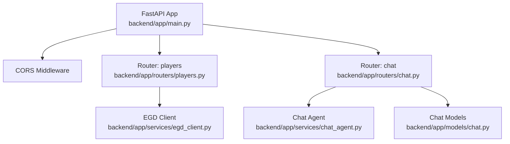
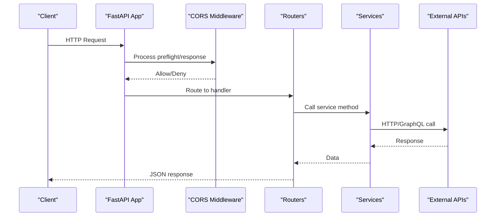
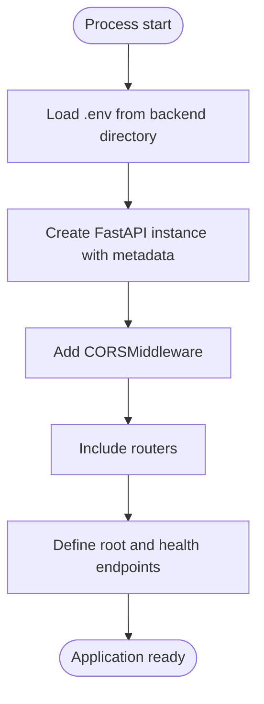
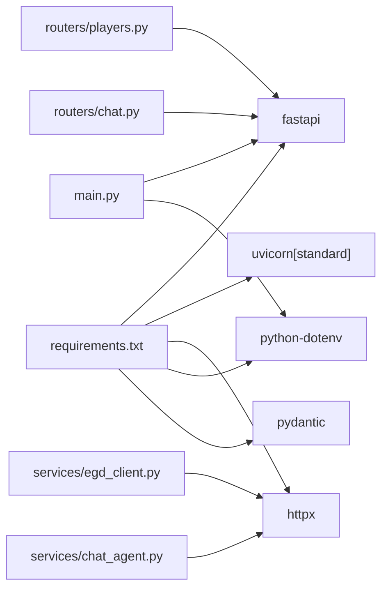

# FastAPI Application Core

<cite>
**Referenced Files in This Document**
- [main.py](file://backend/app/main.py)
- [requirements.txt](file://backend/requirements.txt)
- [players.py](file://backend/app/routers/players.py)
- [chat.py](file://backend/app/routers/chat.py)
- [chat.py (models)](file://backend/app/models/chat.py)
- [egd_client.py](file://backend/app/services/egd_client.py)
- [chat_agent.py](file://backend/app/services/chat_agent.py)
</cite>

## Table of Contents
1. [Introduction](#introduction)
2. [Project Structure](#project-structure)
3. [Core Components](#core-components)
4. [Architecture Overview](#architecture-overview)
5. [Detailed Component Analysis](#detailed-component-analysis)
6. [Dependency Analysis](#dependency-analysis)
7. [Performance Considerations](#performance-considerations)
8. [Troubleshooting Guide](#troubleshooting-guide)
9. [Conclusion](#conclusion)
10. [Appendices](#appendices)

## Introduction
This document explains the FastAPI application core for the GoNow backend. It covers how the application initializes, loads environment variables with python-dotenv, configures CORS middleware, mounts routers, and exposes health and root endpoints. It also documents API metadata configuration and provides practical guidance for adding new routers, additional middleware, and application-level dependencies.

## Project Structure
The backend is organized into feature-based modules:
- Application entry point and bootstrap logic
- Routers for HTTP endpoints
- Services for external integrations and business logic
- Pydantic models for request/response validation



**Diagram sources**
- [main.py:1-42](file://backend/app/main.py#L1-L42)
- [players.py:1-107](file://backend/app/routers/players.py#L1-L107)
- [chat.py:1-95](file://backend/app/routers/chat.py#L1-L95)
- [chat.py (models):1-21](file://backend/app/models/chat.py#L1-L21)
- [egd_client.py:1-197](file://backend/app/services/egd_client.py#L1-L197)
- [chat_agent.py:1-154](file://backend/app/services/chat_agent.py#L1-L154)

**Section sources**
- [main.py:1-42](file://backend/app/main.py#L1-L42)
- [requirements.txt:1-6](file://backend/requirements.txt#L1-L6)

## Core Components
- Application initialization and metadata: The app is created with title, description, and version to power OpenAPI docs and branding.
- Environment loading: python-dotenv loads a .env file from the backend directory before imports that rely on environment variables.
- CORS middleware: Configured to allow frontend origins, credentials, methods, and headers.
- Router mounting: Feature routers are included under a shared prefix.
- Health check endpoint: A simple GET /health returns a status object for liveness probes.

Key responsibilities by file:
- main.py: Bootstrap, env loading, CORS, router inclusion, root and health endpoints.
- routers/players.py: Player search and detail endpoints using the EGD client.
- routers/chat.py: Chat endpoint(s) delegating to agent or proxy logic.
- services/egd_client.py: GraphQL client with caching for EGD data.
- services/chat_agent.py: Agentic chat loop with tool calling via OpenRouter.
- models/chat.py: Pydantic models for chat requests/responses.

**Section sources**
- [main.py:1-42](file://backend/app/main.py#L1-L42)
- [players.py:1-107](file://backend/app/routers/players.py#L1-L107)
- [chat.py:1-95](file://backend/app/routers/chat.py#L1-L95)
- [chat.py (models):1-21](file://backend/app/models/chat.py#L1-L21)
- [egd_client.py:1-197](file://backend/app/services/egd_client.py#L1-L197)
- [chat_agent.py:1-154](file://backend/app/services/chat_agent.py#L1-L154)

## Architecture Overview
The application follows a layered pattern:
- Entry point initializes the app, loads environment variables, adds middleware, and mounts routers.
- Routers define HTTP endpoints and delegate to services.
- Services encapsulate external calls (EGD GraphQL, OpenRouter) and internal logic.
- Models validate input/output structures.



**Diagram sources**
- [main.py:14-31](file://backend/app/main.py#L14-L31)
- [players.py:1-107](file://backend/app/routers/players.py#L1-L107)
- [chat.py:1-95](file://backend/app/routers/chat.py#L1-L95)
- [egd_client.py:1-197](file://backend/app/services/egd_client.py#L1-L197)
- [chat_agent.py:1-154](file://backend/app/services/chat_agent.py#L1-L154)

## Detailed Component Analysis

### Application Initialization and Bootstrap Sequence
- Environment loading: Loads .env from the backend directory before importing routers or services that depend on environment variables.
- App creation: Initializes FastAPI with API metadata (title, description, version).
- Middleware registration: Adds CORS middleware to handle cross-origin requests.
- Router mounting: Includes feature routers with a common prefix.
- Root and health endpoints: Provide basic connectivity checks and documentation link.



**Diagram sources**
- [main.py:8-31](file://backend/app/main.py#L8-L31)

**Section sources**
- [main.py:1-42](file://backend/app/main.py#L1-L42)

### Environment Variable Loading with python-dotenv
- The .env file is loaded early so that subsequent imports can access environment variables such as API tokens and model settings.
- Typical variables used across services include:
  - EGD_API_TOKEN: Used by the EGD client for authentication.
  - OPENROUTER_API_KEY: Required for both chat routes and the agentic chat loop.
  - CHAT_MODEL and CHAT_MAX_ITERATIONS: Control model selection and iteration limits in the agent.

Operational notes:
- Ensure the .env file resides at the backend directory level.
- Avoid committing secrets; use deployment secret management in production.

**Section sources**
- [main.py:8-10](file://backend/app/main.py#L8-L10)
- [egd_client.py:12-17](file://backend/app/services/egd_client.py#L12-L17)
- [chat_agent.py:10-11](file://backend/app/services/chat_agent.py#L10-L11)
- [chat.py:50-55](file://backend/app/routers/chat.py#L50-L55)

### CORS Middleware Configuration
- Origins allowed: Local development frontends.
- Credentials: Enabled to support cookies and authorization headers.
- Methods and headers: Wildcards for flexibility during development.

Production considerations:
- Restrict allow_origins to known domains.
- Limit allow_methods and allow_headers to required subsets.
- Consider using environment variables for origin lists.

**Section sources**
- [main.py:20-27](file://backend/app/main.py#L20-L27)

### Router Mounting Patterns
- Routers are defined with a shared prefix "/api" and tags for grouping.
- They are mounted onto the app using include_router.
- Example patterns:
  - Players: Search, details, games, tournaments.
  - Chat: Message submission with optional context and history.

Adding a new router:
- Create a new module under routers with an APIRouter instance and prefix.
- Define endpoints and return structured responses.
- Import and include the router in main.py.

**Section sources**
- [players.py:1-107](file://backend/app/routers/players.py#L1-L107)
- [chat.py:1-95](file://backend/app/routers/chat.py#L1-L95)
- [main.py:29-31](file://backend/app/main.py#L29-L31)

### Health Check Endpoint Implementation
- GET /health returns a minimal status object suitable for liveness probes.
- GET / provides a friendly message and links to the interactive docs.

Usage:
- Use /health in orchestrators (e.g., Kubernetes liveness/readiness).
- Use / to verify the server is up and to navigate to /docs.

**Section sources**
- [main.py:34-41](file://backend/app/main.py#L34-L41)

### API Metadata Configuration
- Title, description, and version are set at app creation time.
- These values populate the OpenAPI schema and UI (/docs, /redoc).

Best practices:
- Keep version aligned with semantic versioning.
- Update description when capabilities change.

**Section sources**
- [main.py:14-18](file://backend/app/main.py#L14-L18)

### Service Integration Points
- EGD Client: Provides player search, details, games, and tournament history with built-in caching.
- Chat Agent: Orchestrates multi-turn interactions with tool calling against OpenRouter.
- Chat Proxy Route: Alternative route that forwards messages directly to OpenRouter without tool orchestration.

```mermaid
classDiagram
class EGDClient {
+search_players(search, limit)
+get_player_by_pin(pin)
+get_player_games(pin, page, limit)
+get_player_tournaments(pin)
+get_player_by_name_or_pin(search)
}
class ChatAgent {
+agent_chat(message, history, context) dict
}
class PlayersRouter {
+GET /api/search
+GET /api/player/{pin}
+GET /api/player/{pin}/games
+GET /api/player/{pin}/tournaments
}
class ChatRouter {
+POST /api/chat
}
PlayersRouter --> EGDClient : "uses"
ChatRouter --> ChatAgent : "delegates"
```

**Diagram sources**
- [players.py:1-107](file://backend/app/routers/players.py#L1-L107)
- [chat.py:1-95](file://backend/app/routers/chat.py#L1-L95)
- [egd_client.py:1-197](file://backend/app/services/egd_client.py#L1-L197)
- [chat_agent.py:1-154](file://backend/app/services/chat_agent.py#L1-L154)

**Section sources**
- [egd_client.py:1-197](file://backend/app/services/egd_client.py#L1-L197)
- [chat_agent.py:1-154](file://backend/app/services/chat_agent.py#L1-L154)
- [chat.py (models):1-21](file://backend/app/models/chat.py#L1-L21)

### Adding New Routers
Steps:
- Create a new file under routers with an APIRouter(prefix="/api", tags=["your_tag"]).
- Define endpoints and return typed responses using Pydantic models if needed.
- Import the router in main.py and include it with app.include_router(your_router.router).

Example references:
- See existing router structure and usage in players and chat modules.

**Section sources**
- [players.py:1-107](file://backend/app/routers/players.py#L1-L107)
- [chat.py:1-95](file://backend/app/routers/chat.py#L1-L95)
- [main.py:29-31](file://backend/app/main.py#L29-L31)

### Configuring Additional Middleware
To add custom middleware:
- Import your middleware function or class.
- Register it with app.add_middleware(...) after creating the app and before including routers.
- For stateful middleware, consider dependency injection via Depends for cleaner separation.

Reference pattern:
- Observe how CORSMiddleware is added immediately after app creation.

**Section sources**
- [main.py:20-27](file://backend/app/main.py#L20-L27)

### Setting Up Application-Level Dependencies
Common patterns:
- Use Depends() to inject shared resources (e.g., database sessions, clients).
- Initialize singletons or connection pools in services and import them where needed.
- For startup/shutdown hooks, use lifespan events or event handlers around app creation.

References:
- Singleton client usage in services demonstrates reusable instances.

**Section sources**
- [egd_client.py:195-197](file://backend/app/services/egd_client.py#L195-L197)
- [chat_agent.py:1-154](file://backend/app/services/chat_agent.py#L1-L154)

## Dependency Analysis
Runtime dependencies are declared in requirements.txt and imported throughout the codebase.



**Diagram sources**
- [requirements.txt:1-6](file://backend/requirements.txt#L1-L6)
- [main.py:1-12](file://backend/app/main.py#L1-L12)
- [players.py:1-4](file://backend/app/routers/players.py#L1-L4)
- [chat.py:1-4](file://backend/app/routers/chat.py#L1-L4)
- [egd_client.py:1-6](file://backend/app/services/egd_client.py#L1-L6)
- [chat_agent.py:1-6](file://backend/app/services/chat_agent.py#L1-L6)

**Section sources**
- [requirements.txt:1-6](file://backend/requirements.txt#L1-L6)

## Performance Considerations
- Caching: The EGD client caches recent queries for a short TTL to reduce external calls.
- Pagination: Endpoints accept pagination parameters to limit payload sizes.
- Timeouts: External HTTP calls use timeouts to prevent hanging requests.
- Rate limiting: Consider adding rate-limiting middleware for public endpoints in production.
- Connection pooling: httpx AsyncClient is reused per request; consider global pool tuning if needed.

## Troubleshooting Guide
- Missing .env variables:
  - Symptoms: Chat endpoints return fallback messages indicating missing keys.
  - Action: Ensure OPENROUTER_API_KEY and other required variables are present in the backend .env file.
- CORS errors:
  - Symptoms: Browser blocks requests from frontend origins.
  - Action: Verify allow_origins includes the frontend URL; restrict in production.
- Health check failures:
  - Symptoms: /health does not respond.
  - Action: Confirm the app started successfully and no unhandled exceptions occurred during bootstrapping.
- External API errors:
  - Symptoms: 500 responses from player or chat endpoints.
  - Action: Inspect logs for HTTP errors from EGD or OpenRouter; validate tokens and network connectivity.

**Section sources**
- [chat.py:50-55](file://backend/app/routers/chat.py#L50-L55)
- [chat_agent.py:42-48](file://backend/app/services/chat_agent.py#L42-L48)
- [main.py:39-41](file://backend/app/main.py#L39-L41)
- [players.py:39-40](file://backend/app/routers/players.py#L39-L40)

## Conclusion
The GoNow FastAPI core is straightforward and extensible. It initializes with clear metadata, loads environment variables early, applies CORS middleware, and mounts feature routers. Health and root endpoints provide operational visibility. The design cleanly separates routing, services, and models, making it easy to add new features, middleware, and dependencies while maintaining clarity and performance.

## Appendices

### Quick Reference: Key Paths
- Application bootstrap and metadata: [main.py:14-18](file://backend/app/main.py#L14-L18)
- Environment loading: [main.py:8-10](file://backend/app/main.py#L8-L10)
- CORS configuration: [main.py:20-27](file://backend/app/main.py#L20-L27)
- Router mounting: [main.py:29-31](file://backend/app/main.py#L29-L31)
- Health endpoint: [main.py:39-41](file://backend/app/main.py#L39-L41)
- Players router: [players.py:1-107](file://backend/app/routers/players.py#L1-L107)
- Chat router: [chat.py:1-95](file://backend/app/routers/chat.py#L1-L95)
- Chat models: [chat.py (models):1-21](file://backend/app/models/chat.py#L1-L21)
- EGD client: [egd_client.py:1-197](file://backend/app/services/egd_client.py#L1-L197)
- Chat agent: [chat_agent.py:1-154](file://backend/app/services/chat_agent.py#L1-L154)