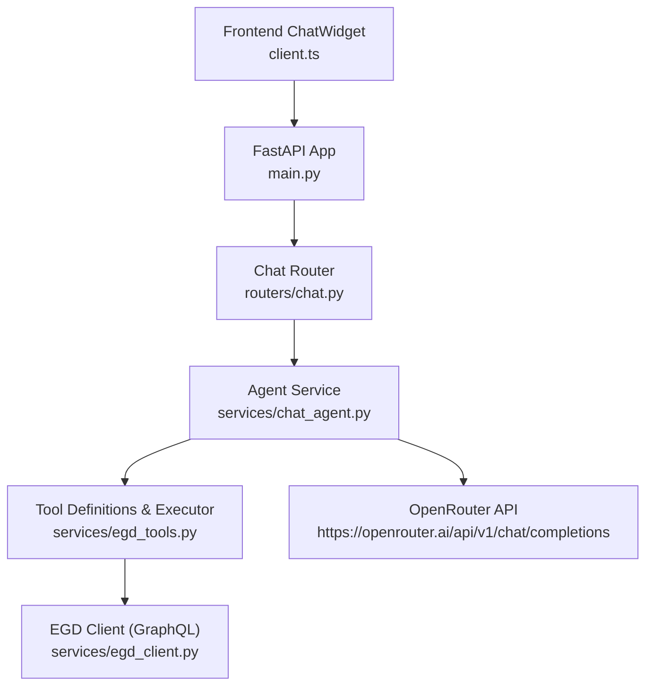
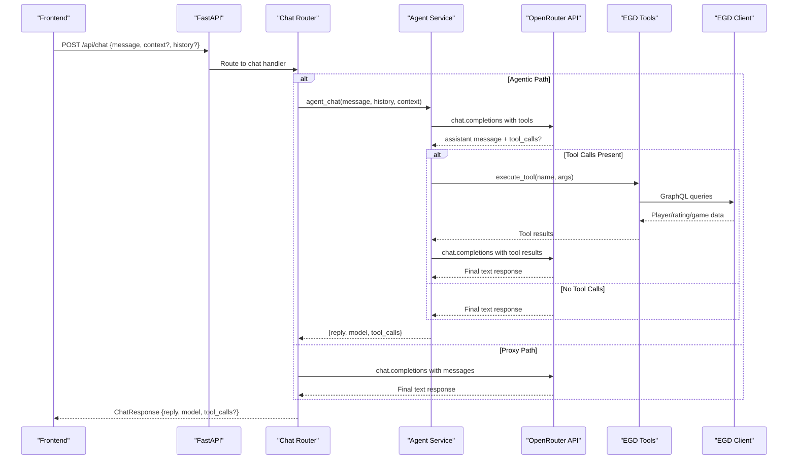
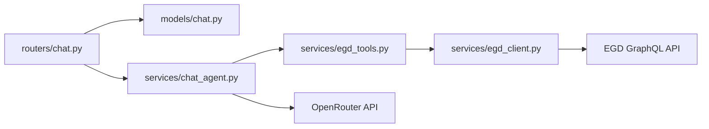

# Chat Router

<cite>
**Referenced Files in This Document**
- [backend/app/routers/chat.py](file://backend/app/routers/chat.py)
- [backend/app/services/chat_agent.py](file://backend/app/services/chat_agent.py)
- [backend/app/models/chat.py](file://backend/app/models/chat.py)
- [backend/app/services/egd_tools.py](file://backend/app/services/egd_tools.py)
- [backend/app/services/egd_client.py](file://backend/app/services/egd_client.py)
- [backend/app/main.py](file://backend/app/main.py)
- [frontend/src/api/client.ts](file://frontend/src/api/client.ts)
- [frontend/src/components/ChatWidget.tsx](file://frontend/src/components/ChatWidget.tsx)
</cite>

## Table of Contents
1. [Introduction](#introduction)
2. [Project Structure](#project-structure)
3. [Core Components](#core-components)
4. [Architecture Overview](#architecture-overview)
5. [Detailed Component Analysis](#detailed-component-analysis)
6. [Dependency Analysis](#dependency-analysis)
7. [Performance Considerations](#performance-considerations)
8. [Troubleshooting Guide](#troubleshooting-guide)
9. [Conclusion](#conclusion)
10. [Appendices](#appendices)

## Introduction
This document explains the Chat Router module that exposes a chat endpoint for natural language queries, integrates with an agentic chat service to call external tools, and formats responses from the OpenRouter API. It covers request validation, conversation context handling, tool calling workflows, response formatting, error handling, and rate limiting considerations.

## Project Structure
The Chat Router is implemented as a FastAPI route under the /api namespace. It validates incoming requests using Pydantic models, delegates processing to an agentic chat service, and returns structured responses. The frontend consumes this endpoint via a simple HTTP client.

**Diagram sources**
- [backend/app/main.py:14-31](file://backend/app/main.py#L14-L31)
- [backend/app/routers/chat.py:1-95](file://backend/app/routers/chat.py#L1-L95)
- [backend/app/services/chat_agent.py:1-154](file://backend/app/services/chat_agent.py#L1-L154)
- [backend/app/services/egd_tools.py:1-212](file://backend/app/services/egd_tools.py#L1-L212)
- [backend/app/services/egd_client.py:1-197](file://backend/app/services/egd_client.py#L1-L197)
- [frontend/src/api/client.ts:74-85](file://frontend/src/api/client.ts#L74-L85)
- [frontend/src/components/ChatWidget.tsx:1-240](file://frontend/src/components/ChatWidget.tsx#L1-L240)

**Section sources**
- [backend/app/main.py:14-31](file://backend/app/main.py#L14-L31)
- [backend/app/routers/chat.py:1-95](file://backend/app/routers/chat.py#L1-L95)

## Core Components
- Chat Request/Response Models: Define the schema for chat messages, optional context, history, and response fields including reply, model name, and tool calls log.
- Chat Router Endpoint: Validates input, constructs message arrays, and forwards to the agent service or directly proxies to OpenRouter depending on implementation path.
- Agentic Chat Service: Orchestrates multi-turn interactions with OpenRouter, supports function/tool calling, executes EGD tools, and manages conversation context.
- Tool Definitions and Execution: Declares OpenAI-compatible tool schemas and maps them to backend operations against the European Go Database (EGD).
- EGD Client: Provides GraphQL access to player data, ratings, and games with caching.

**Section sources**
- [backend/app/models/chat.py:1-21](file://backend/app/models/chat.py#L1-L21)
- [backend/app/routers/chat.py:1-95](file://backend/app/routers/chat.py#L1-L95)
- [backend/app/services/chat_agent.py:1-154](file://backend/app/services/chat_agent.py#L1-L154)
- [backend/app/services/egd_tools.py:1-212](file://backend/app/services/egd_tools.py#L1-L212)
- [backend/app/services/egd_client.py:1-197](file://backend/app/services/egd_client.py#L1-L197)

## Architecture Overview
The chat flow supports two paths:
- Agentic path: Uses the agent service to handle tool calling and iterative reasoning before returning a final answer.
- Proxy path: Directly proxies user messages to OpenRouter with a system prompt and optional context/history.

**Diagram sources**
- [backend/app/routers/chat.py:1-95](file://backend/app/routers/chat.py#L1-L95)
- [backend/app/services/chat_agent.py:1-154](file://backend/app/services/chat_agent.py#L1-L154)
- [backend/app/services/egd_tools.py:1-212](file://backend/app/services/egd_tools.py#L1-L212)
- [backend/app/services/egd_client.py:1-197](file://backend/app/services/egd_client.py#L1-L197)

## Detailed Component Analysis

### Chat Request and Response Schemas
- ChatMessage: role ("user" or "assistant") and content string.
- ChatRequest: message (required), context (optional free-form context), history (optional list of ChatMessage).
- ChatResponse: reply (string), model (optional string), tool_calls (optional list of strings representing executed tool names).

These models are used by FastAPI to validate incoming payloads and serialize outgoing responses.

**Section sources**
- [backend/app/models/chat.py:1-21](file://backend/app/models/chat.py#L1-L21)

### Chat Router Endpoint
- Mounting: The router is mounted at /api and tagged as "chat".
- Validation: FastAPI uses ChatRequest to enforce required fields and types.
- Processing:
  - Agentic path: Delegates to agent_chat, then wraps result into ChatResponse.
  - Proxy path: Builds messages array with system prompt, optional context, and history; posts to OpenRouter; extracts reply and model.
- Error Handling: Catches exceptions and returns HTTP 500 with a descriptive detail.

Notes:
- The file contains two definitions for the same route. In practice, only one should be active. Ensure the intended implementation is loaded.
- The proxy path includes a fallback when OPENROUTER_API_KEY is missing, returning a friendly message instead of raising an error.

**Section sources**
- [backend/app/routers/chat.py:1-95](file://backend/app/routers/chat.py#L1-L95)

### Agentic Chat Service
Responsibilities:
- Build messages array: system prompt, optional page context, last N history entries, current user message.
- Iterative loop:
  - Call OpenRouter with tools attached.
  - If tool_calls present: append assistant message with tool_calls, execute each tool via execute_tool, append tool results, continue loop.
  - If no tool_calls: return final text response.
- Fallback: After exhausting MAX_ITERATIONS, send a summarization prompt to force a text response.
- Returns: {reply, model, tool_calls}.

Configuration:
- MODEL from environment (default gemini-2.0-flash-001).
- MAX_ITERATIONS from environment (default 3).
- OPENROUTER_API_KEY required for functionality.

Error Handling:
- Missing API key yields a graceful message.
- JSON decode errors for tool arguments default to empty dict.
- HTTP errors propagate to router-level exception handling.

**Section sources**
- [backend/app/services/chat_agent.py:1-154](file://backend/app/services/chat_agent.py#L1-L154)

### Tool Definitions and Execution
Tools exposed to LLMs:
- search_player(query): Search players by name or PIN.
- get_player_details(pin): Get detailed profile and rating history.
- get_player_rating_history(pin): Get rating evolution over time.
- get_player_games(pin, limit?): Get recent game history.
- compare_players(pin1, pin2): Compare two players side-by-side.

Execution:
- execute_tool(name, arguments) dispatches to EGD client methods.
- Results are normalized to {"success": True/False, "data"?: ...} or {"success": False, "error": ...}.
- Errors are caught and returned as failure objects.

**Section sources**
- [backend/app/services/egd_tools.py:1-212](file://backend/app/services/egd_tools.py#L1-L212)

### EGD Client Integration
- GraphQL endpoint for European Go Database.
- Methods:
  - search_players(search, limit)
  - get_player_by_pin(pin)
  - get_player_games(pin, page, limit)
  - get_player_tournaments(pin)
  - get_player_by_name_or_pin(search)
- Caching: In-memory cache keyed by query and variables with TTL.
- Error Handling: Raises ValueError on GraphQL errors; HTTP errors handled upstream.

**Section sources**
- [backend/app/services/egd_client.py:1-197](file://backend/app/services/egd_client.py#L1-L197)

### Frontend Integration
- API client sends POST /api/chat with {message, context?, history?}.
- Chat widget maintains local message history, shows loading state, and displays assistant replies.
- Types mirror backend models: ChatMessage and ChatResponse.

**Section sources**
- [frontend/src/api/client.ts:74-85](file://frontend/src/api/client.ts#L74-L85)
- [frontend/src/components/ChatWidget.tsx:1-240](file://frontend/src/components/ChatWidget.tsx#L1-L240)

## Dependency Analysis
High-level dependencies:
- Router depends on models and services.
- Agent service depends on tool definitions and OpenRouter.
- Tools depend on EGD client.
- EGD client depends on httpx and environment configuration.

**Diagram sources**
- [backend/app/routers/chat.py:1-95](file://backend/app/routers/chat.py#L1-L95)
- [backend/app/models/chat.py:1-21](file://backend/app/models/chat.py#L1-L21)
- [backend/app/services/chat_agent.py:1-154](file://backend/app/services/chat_agent.py#L1-L154)
- [backend/app/services/egd_tools.py:1-212](file://backend/app/services/egd_tools.py#L1-L212)
- [backend/app/services/egd_client.py:1-197](file://backend/app/services/egd_client.py#L1-L197)

**Section sources**
- [backend/app/main.py:14-31](file://backend/app/main.py#L14-L31)
- [backend/app/routers/chat.py:1-95](file://backend/app/routers/chat.py#L1-L95)

## Performance Considerations
- History Truncation: The agent service limits history to the last 10 messages to control payload size and latency.
- Token Limits: Requests set max_tokens to constrain output length and cost.
- Timeouts:
  - Agent service uses a longer timeout for tool-heavy loops.
  - EGD client uses a moderate timeout for GraphQL calls.
- Caching: EGD client caches GraphQL responses for a short TTL to reduce repeated network calls.
- Concurrency: Asynchronous HTTP clients allow non-blocking I/O for better throughput.

Recommendations:
- Implement server-side rate limiting per client/IP to protect OpenRouter and EGD endpoints.
- Add retry logic with exponential backoff for transient failures.
- Consider streaming responses for long-running tool chains to improve UX.

[No sources needed since this section provides general guidance]

## Troubleshooting Guide
Common issues and resolutions:
- Missing API Key:
  - Symptom: Friendly message indicating AI chat is not configured.
  - Resolution: Set OPENROUTER_API_KEY in the backend .env file.
- LLM Failures:
  - Symptom: HTTP 500 with error details.
  - Resolution: Check network connectivity, API key validity, and model availability. Inspect logs for specific error messages.
- Tool Execution Errors:
  - Symptom: Tool returns success=False with error message.
  - Resolution: Validate tool arguments and ensure EGD token is valid. Review EGD client errors.
- Context Overflow:
  - Symptom: Slow responses or token limit errors.
  - Resolution: Reduce history length or trim context before sending.

Operational checks:
- Health endpoint: GET /health returns status ok.
- Docs: Swagger UI available at /docs for interactive testing.

**Section sources**
- [backend/app/routers/chat.py:1-95](file://backend/app/routers/chat.py#L1-L95)
- [backend/app/services/chat_agent.py:1-154](file://backend/app/services/chat_agent.py#L1-L154)
- [backend/app/services/egd_tools.py:1-212](file://backend/app/services/egd_tools.py#L1-L212)
- [backend/app/services/egd_client.py:1-197](file://backend/app/services/egd_client.py#L1-L197)
- [backend/app/main.py:34-41](file://backend/app/main.py#L34-L41)

## Conclusion
The Chat Router provides a robust interface for natural language queries with optional tool calling and context-aware responses. It integrates seamlessly with OpenRouter and the European Go Database through well-defined tools and an agentic loop. Proper configuration, error handling, and performance tuning will ensure reliable operation in production.

[No sources needed since this section summarizes without analyzing specific files]

## Appendices

### API Definition Summary
- Endpoint: POST /api/chat
- Request Body:
  - message: string (required)
  - context: string (optional)
  - history: array of {role: "user"|"assistant", content: string} (optional)
- Response Body:
  - reply: string
  - model: string (optional)
  - tool_calls: array of strings (optional)

**Section sources**
- [backend/app/models/chat.py:1-21](file://backend/app/models/chat.py#L1-L21)
- [backend/app/routers/chat.py:1-95](file://backend/app/routers/chat.py#L1-L95)

### Streaming Responses
Current implementation does not stream responses. To add streaming:
- Use Server-Sent Events (SSE) or WebSocket to push incremental tokens.
- Modify the agent service to yield partial responses and update the frontend incrementally.
- Adjust timeouts and buffering accordingly.

[No sources needed since this section proposes enhancements without analyzing specific files]

### Rate Limiting Considerations
- Client-side: Debounce rapid inputs and avoid redundant requests.
- Server-side: Apply middleware-based rate limiting (e.g., per IP or per user) to cap requests to OpenRouter and EGD.
- Backoff: Implement retries with jitter for transient errors.

[No sources needed since this section provides general guidance]