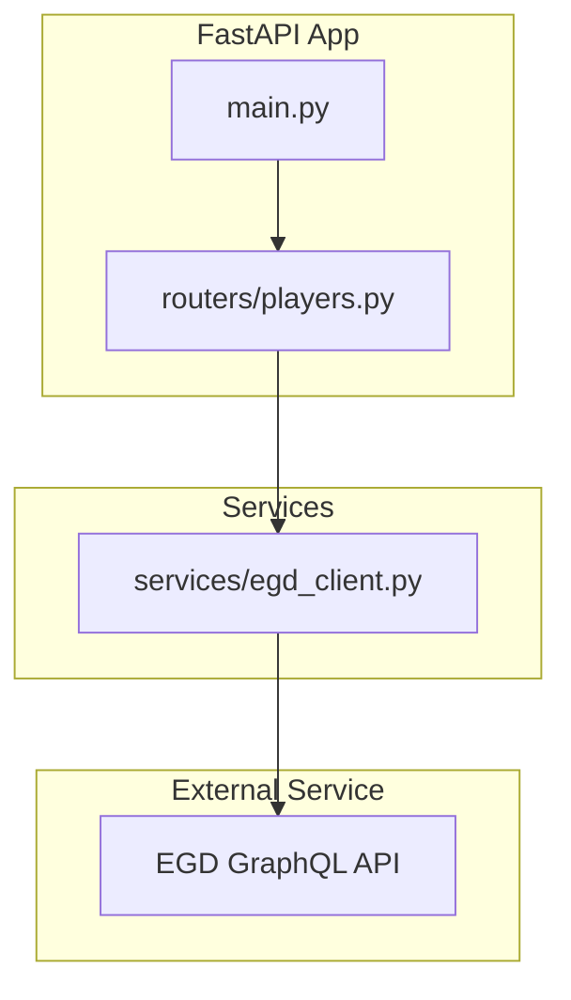
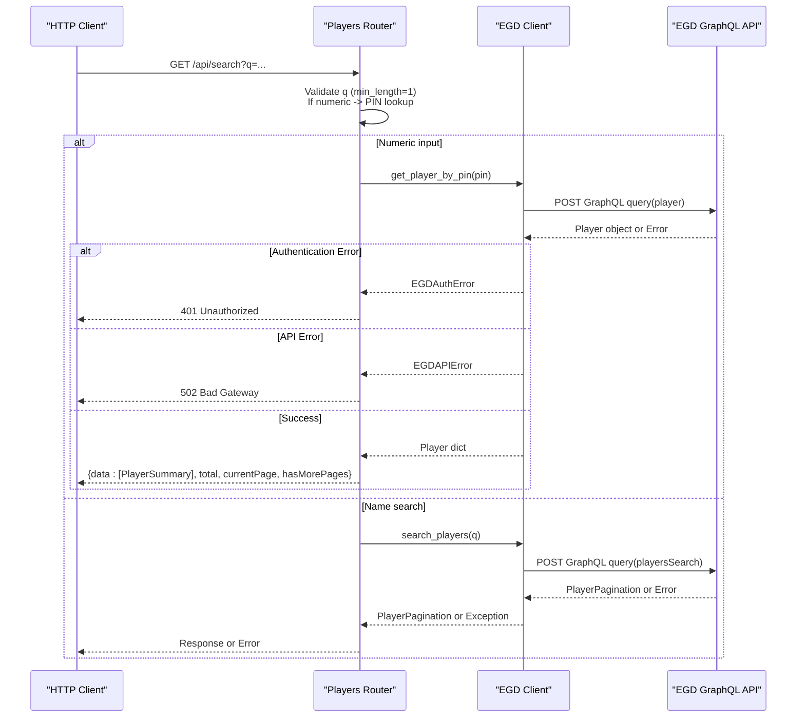
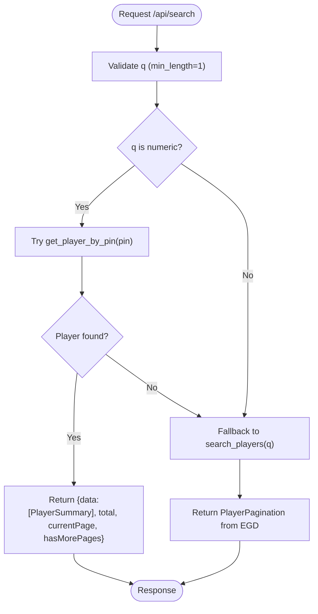
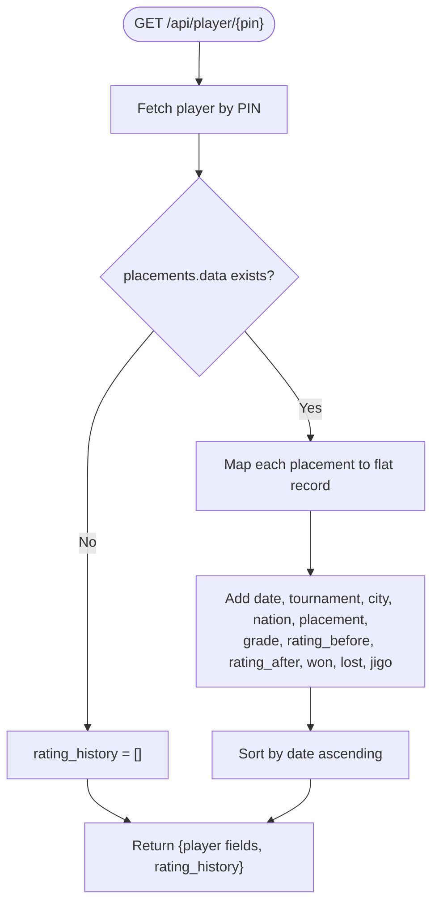
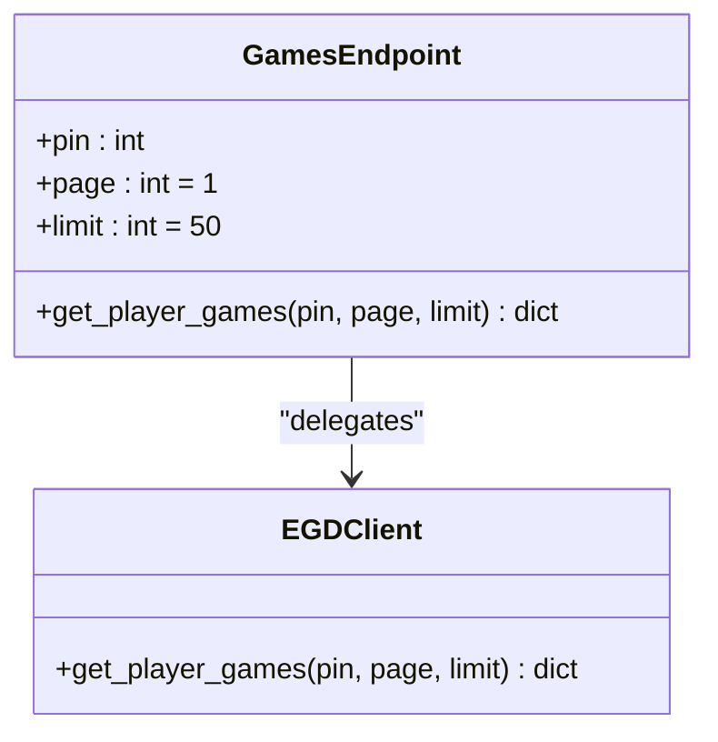
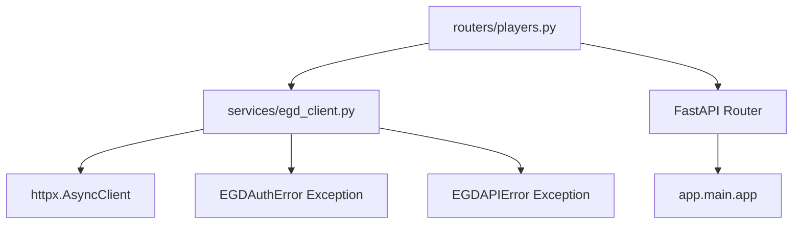

# Players Router

<cite>
**Referenced Files in This Document**
- [players.py](file://backend/app/routers/players.py)
- [egd_client.py](file://backend/app/services/egd_client.py)
- [player.py](file://backend/app/models/player.py)
- [main.py](file://backend/app/main.py)
- [EGD_API.md](file://docs/EGD_API.md)
</cite>

## Update Summary
**Changes Made**
- Updated error handling section to document new EGD exception types (EGDAuthError, EGDAPIError)
- Added comprehensive HTTP status code mapping for authentication and API errors
- Enhanced error response examples with specific status codes (401, 502)
- Updated integration patterns to reflect improved exception handling architecture

## Table of Contents
1. [Introduction](#introduction)
2. [Project Structure](#project-structure)
3. [Core Components](#core-components)
4. [Architecture Overview](#architecture-overview)
5. [Detailed Component Analysis](#detailed-component-analysis)
6. [Dependency Analysis](#dependency-analysis)
7. [Performance Considerations](#performance-considerations)
8. [Troubleshooting Guide](#troubleshooting-guide)
9. [Conclusion](#conclusion)

## Introduction
This document provides comprehensive documentation for the Players Router module, which exposes REST endpoints to search and retrieve player information from the European Go Database (EGD). It covers all endpoints, request/response schemas, query parameter validation rules, path parameter handling, intelligent search logic, rating history transformation for chart visualization, pagination support, error responses, and integration patterns with the EGD client service.

## Project Structure
The Players Router is implemented as a FastAPI router mounted under the application root. The router delegates data access to an EGD GraphQL client that performs HTTP requests to the external EGD API and applies caching.

**Diagram sources**
- [main.py:29-31](file://backend/app/main.py#L29-L31)
- [players.py:1-10](file://backend/app/routers/players.py#L1-L10)
- [egd_client.py:1-20](file://backend/app/services/egd_client.py#L1-L20)

**Section sources**
- [main.py:14-31](file://backend/app/main.py#L14-L31)
- [players.py:1-10](file://backend/app/routers/players.py#L1-L10)

## Core Components
- Players Router: Defines REST endpoints for searching players, retrieving player details, games, and tournaments.
- EGD Client: Encapsulates GraphQL queries, authentication, and response parsing; includes an in-memory cache with TTL and comprehensive error handling.
- Pydantic Models: Define structured types for player summaries, placements, and search responses.

Key responsibilities:
- Validate incoming parameters and normalize responses.
- Implement intelligent search prioritizing PIN lookups over name searches.
- Transform raw placement data into a flat rating_history list suitable for charting.
- Provide pagination for games via query parameters.
- Handle EGD-specific exceptions with appropriate HTTP status codes.

**Section sources**
- [players.py:8-129](file://backend/app/routers/players.py#L8-L129)
- [egd_client.py:11-242](file://backend/app/services/egd_client.py#L11-L242)
- [player.py:6-60](file://backend/app/models/player.py#L6-L60)

## Architecture Overview
The Players Router integrates with the EGD GraphQL API through the EGD client. Requests flow from the FastAPI router to the client, which executes GraphQL queries and returns normalized results. Responses are standardized across endpoints to include consistent pagination fields where applicable. The system implements robust error handling with specific HTTP status codes for different failure scenarios.

**Diagram sources**
- [players.py:8-40](file://backend/app/routers/players.py#L8-L40)
- [egd_client.py:44-70](file://backend/app/services/egd_client.py#L44-L70)
- [egd_client.py:72-118](file://backend/app/services/egd_client.py#L72-L118)

## Detailed Component Analysis

### Endpoints Reference

#### Search Players
- Method: GET
- Path: /api/search
- Query Parameters:
  - q: string, required, min_length=1
- Behavior:
  - If q is numeric, perform direct PIN lookup first.
  - Otherwise, perform name-based search using typo-tolerant search.
- Response Schema:
  - On PIN match:
    - data: array of PlayerSummary objects
    - total: integer
    - currentPage: integer
    - hasMorePages: boolean
  - On name search:
    - Returns the full PlayerPagination structure from EGD (data, total, currentPage, hasMorePages)

Example successful response (PIN lookup):
- data: [{ pin, firstName, lastName, countryCode, grade, rating, club?, totalTournaments?, lastAppearance? }]
- total: 1
- currentPage: 1
- hasMorePages: false

**Updated** Enhanced error handling with specific HTTP status codes:
- Missing or empty q: Validation error (min_length=1)
- Authentication failures: 401 Unauthorized with detailed message
- External API errors: 502 Bad Gateway with error details
- Internal server errors: 500 Internal Server Error

Integration notes:
- Uses egd_client.get_player_by_pin(int(q)) when q.isdigit()
- Falls back to egd_client.search_players(q) otherwise
- Comprehensive exception handling for EGD-specific errors

**Section sources**
- [players.py:8-40](file://backend/app/routers/players.py#L8-L40)
- [egd_client.py:44-70](file://backend/app/services/egd_client.py#L44-L70)
- [egd_client.py:72-118](file://backend/app/services/egd_client.py#L72-L118)

#### Get Player Details
- Method: GET
- Path: /api/player/{pin}
- Path Parameters:
  - pin: integer
- Behavior:
  - Retrieves player by PIN.
  - Transforms placements into a sorted rating_history list for chart visualization.
- Response Schema:
  - All fields from the player object plus:
    - rating_history: array of objects with date, tournament, city, nation, placement, grade, rating_before, rating_after, won, lost, jigo

**Updated** Enhanced error handling:
- Player not found: 404 Not Found
- Authentication failures: 401 Unauthorized with token validation message
- External API errors: 502 Bad Gateway with error details
- Internal server errors: 500 Internal Server Error

Rating history transformation:
- Extracts placements.data entries
- Maps nested tournament info into flat fields
- Sorts by date ascending

**Section sources**
- [players.py:43-80](file://backend/app/routers/players.py#L43-L80)
- [egd_client.py:72-118](file://backend/app/services/egd_client.py#L72-L118)

#### Get Player Games
- Method: GET
- Path: /api/player/{pin}/games
- Path Parameters:
  - pin: integer
- Query Parameters:
  - page: integer, default 1, ge=1
  - limit: integer, default 50, ge=1, le=200
- Behavior:
  - Retrieves paginated game history for the given PIN.
- Response Schema:
  - Data structure returned by EGD client for games:
    - data: array of Game objects
    - total: integer
    - currentPage: integer
    - hasMorePages: boolean

**Updated** Enhanced error handling:
- Authentication failures: 401 Unauthorized with token validation message
- External API errors: 502 Bad Gateway with error details
- Internal server errors: 500 Internal Server Error

Pagination support:
- Enforced by query parameter validators (ge, le)
- Passed directly to EGD client for server-side pagination

**Section sources**
- [players.py:83-94](file://backend/app/routers/players.py#L83-94)
- [egd_client.py:120-150](file://backend/app/services/egd_client.py#L120-L150)

#### Get Player Tournaments
- Method: GET
- Path: /api/player/{pin}/tournaments
- Path Parameters:
  - pin: integer
- Behavior:
  - Retrieves tournament history derived from placements.
  - Deduplicates tournaments by code.
  - Sorts by date ascending.
- Response Schema:
  - data: array of TournamentInfo-like objects with fields such as code, description, date, city, nation, placement, grade_declared, won, lost, jigo, rating_before, rating_after
  - total: integer count of tournaments

**Updated** Enhanced error handling:
- Authentication failures: 401 Unauthorized with token validation message
- External API errors: 502 Bad Gateway with error details
- Internal server errors: 500 Internal Server Error

**Section sources**
- [players.py:97-106](file://backend/app/routers/players.py#L97-L106)
- [egd_client.py:152-177](file://backend/app/services/egd_client.py#L152-L177)

### Intelligent Search Logic
The search endpoint prioritizes PIN lookups over name searches:
- If the query string consists only of digits, it attempts a direct PIN lookup.
- If the PIN lookup fails or returns no result, it falls back to name-based search.
- This approach improves performance and accuracy for exact PIN matches.

**Diagram sources**
- [players.py:8-40](file://backend/app/routers/players.py#L8-L40)
- [egd_client.py:44-70](file://backend/app/services/egd_client.py#L44-L70)
- [egd_client.py:72-118](file://backend/app/services/egd_client.py#L72-L118)

### Rating History Transformation
For chart visualization, the get_player endpoint transforms nested placement data into a flat list:
- Extracts tournament metadata (date, description, city, nation)
- Includes placement metrics (placement, gradeDeclared, wonGames, lostGames, jigoGames)
- Includes rating deltas (precedentRating, followingRating)
- Sorts by date ascending to ensure chronological order

**Diagram sources**
- [players.py:43-80](file://backend/app/routers/players.py#L43-L80)
- [egd_client.py:72-118](file://backend/app/services/egd_client.py#L72-L118)

### Pagination Support
The games endpoint supports server-side pagination:
- page defaults to 1 and must be >= 1
- limit defaults to 50 and must be between 1 and 200 inclusive
- These constraints are enforced by FastAPI Query validators
- The EGD client passes these values directly to the GraphQL query

**Diagram sources**
- [players.py:83-94](file://backend/app/routers/players.py#L83-94)
- [egd_client.py:120-150](file://backend/app/services/egd_client.py#L120-L150)

### Request/Response Schemas

#### Player Summary
- Fields:
  - pin: integer
  - firstName: string
  - lastName: string
  - countryCode: string
  - grade: string
  - rating: integer (optional)
  - club: string (optional)
  - totalTournaments: integer (optional)
  - lastAppearance: string (optional)

**Section sources**
- [player.py:6-16](file://backend/app/models/player.py#L6-L16)

#### Player Detail
- Extends basic player fields with additional attributes:
  - deltaRating: integer (optional)
  - proposedGrade: string (optional)
  - totalTournaments: integer (optional)
  - lastAppearance: string (optional)
  - egfPlacement: integer (optional)
  - placements: array of PlacementInfo (optional)

**Section sources**
- [player.py:39-53](file://backend/app/models/player.py#L39-L53)

#### Placement Info
- Fields:
  - id: integer
  - tournamentCode: string
  - placement: integer
  - gradeDeclared: string
  - wonGames: integer
  - lostGames: integer
  - jigoGames: integer
  - precedentRating: float (optional)
  - followingRating: float (optional)
  - tournament: TournamentInfo (optional)

**Section sources**
- [player.py:26-37](file://backend/app/models/player.py#L26-L37)

#### Tournament Info
- Fields:
  - code: string
  - description: string (optional)
  - date: string (optional)
  - city: string (optional)
  - nation: string (optional)

**Section sources**
- [player.py:18-24](file://backend/app/models/player.py#L18-L24)

#### Search Response
- Fields:
  - data: array of PlayerSummary
  - total: integer
  - currentPage: integer
  - hasMorePages: boolean

**Section sources**
- [player.py:55-60](file://backend/app/models/player.py#L55-L60)

### Error Handling
**Updated** Comprehensive error handling with specific HTTP status codes:

- **Validation Errors**:
  - Missing or invalid query/path parameters return standard FastAPI validation errors (e.g., min_length, ge, le constraints).

- **Authentication Failures (401)**:
  - Invalid or expired EGD API tokens
  - Missing authorization headers
  - Token permission issues
  - Returns: `{"detail": "EGD API authentication failed. Please check your API token."}`

- **External API Errors (502)**:
  - EGD API service unavailable
  - GraphQL query errors
  - Network connectivity issues
  - Returns: `{"detail": "EGD API error: [specific error message]"}`

- **Not Found (404)**:
  - GET /api/player/{pin} returns 404 if the player does not exist.

- **Internal Server Errors (500)**:
  - Unhandled exceptions in routers
  - Unexpected data processing errors
  - Returns: `{"detail": "[exception message]"}`

**Exception Types**:
- `EGDAuthError`: Raised when EGD API authentication fails (status codes 401, 403, or redirect to login)
- `EGDAPIError`: Raised for general EGD API errors including network issues and GraphQL errors

**Section sources**
- [players.py:33-50](file://backend/app/routers/players.py#L33-L50)
- [players.py:87-94](file://backend/app/routers/players.py#L87-L94)
- [players.py:107-112](file://backend/app/routers/players.py#L107-L112)
- [players.py:123-128](file://backend/app/routers/players.py#L123-L128)
- [egd_client.py:11-18](file://backend/app/services/egd_client.py#L11-L18)
- [egd_client.py:47-71](file://backend/app/services/egd_client.py#L47-L71)

### Integration Patterns with EGD Client
- **Authentication**:
  - Bearer token provided via environment variable EGD_API_TOKEN.
  - Automatic detection of authentication failures with proper error propagation.

- **Caching**:
  - In-memory cache keyed by query and variables with a TTL of 300 seconds.

- **GraphQL Queries**:
  - search_players: uses playersSearch with pagination.
  - get_player_by_pin: fetches player including placements and biography.
  - get_player_games: filters games by playerPin with ordering and pagination.
  - get_player_tournaments: derives unique tournaments from placements.

- **Error Propagation**:
  - EGD-specific exceptions are caught and converted to appropriate HTTP status codes.
  - Authentication errors (401) vs API errors (502) are clearly distinguished.

**Section sources**
- [egd_client.py:11-20](file://backend/app/services/egd_client.py#L11-L20)
- [egd_client.py:21-42](file://backend/app/services/egd_client.py#L21-L42)
- [egd_client.py:44-70](file://backend/app/services/egd_client.py#L44-L70)
- [egd_client.py:72-118](file://backend/app/services/egd_client.py#L72-L118)
- [egd_client.py:120-150](file://backend/app/services/egd_client.py#L120-L150)
- [egd_client.py:152-177](file://backend/app/services/egd_client.py#L152-L177)

## Dependency Analysis
The Players Router depends on the EGD client for data retrieval and relies on FastAPI for routing and validation. The EGD client depends on httpx for asynchronous HTTP requests and uses environment configuration for authentication.

**Diagram sources**
- [players.py:1-5](file://backend/app/routers/players.py#L1-L5)
- [egd_client.py:1-10](file://backend/app/services/egd_client.py#L1-L10)
- [main.py:29-31](file://backend/app/main.py#L29-L31)
- [egd_client.py:11-18](file://backend/app/services/egd_client.py#L11-L18)

**Section sources**
- [players.py:1-5](file://backend/app/routers/players.py#L1-L5)
- [egd_client.py:1-10](file://backend/app/services/egd_client.py#L1-L10)
- [main.py:29-31](file://backend/app/main.py#L29-L31)

## Performance Considerations
- Caching:
  - The EGD client caches responses per query and variables for up to 5 minutes, reducing external API calls.
- Pagination:
  - Use appropriate page and limit values to avoid large payloads; default limit is 50, maximum allowed is 200.
- Sorting:
  - Rating history and tournaments are sorted server-side or client-side to minimize frontend processing.
- Network Timeouts:
  - HTTP client timeout is set to 30 seconds to prevent hanging requests.
- Error Handling:
  - Efficient exception handling prevents unnecessary retries and reduces server load during failures.

## Troubleshooting Guide
Common issues and resolutions:
- **Validation Errors**:
  - Ensure q meets min_length=1 for search.
  - Ensure page >= 1 and limit within [1, 200] for games.

- **Authentication Issues (401)**:
  - Verify EGD_API_TOKEN is valid and properly configured in backend/.env
  - Check token permissions and expiration status
  - Ensure Authorization header format is correct: `Bearer <token>`

- **External API Errors (502)**:
  - Check EGD API service availability
  - Verify network connectivity to europeangodatabase.eu
  - Inspect GraphQL errors returned by EGD client for specific error messages

- **Not Found (404)**:
  - Verify the PIN exists in the EGD database.

- **Caching Issues**:
  - Clear in-memory cache by restarting the service if stale data is observed.

**Section sources**
- [players.py:8-40](file://backend/app/routers/players.py#L8-L40)
- [players.py:83-94](file://backend/app/routers/players.py#L83-94)
- [egd_client.py:38-42](file://backend/app/services/egd_client.py#L38-L42)

## Conclusion
The Players Router provides a robust interface for searching and retrieving player data from the EGD. It implements intelligent search prioritization, structured response schemas, efficient pagination, and comprehensive error handling with specific HTTP status codes. The enhanced exception handling system distinguishes between authentication failures (401) and API errors (502), providing clear feedback to clients. The EGD client encapsulates GraphQL interactions and caching, ensuring reliable and performant access to external data while maintaining proper error propagation throughout the application stack.