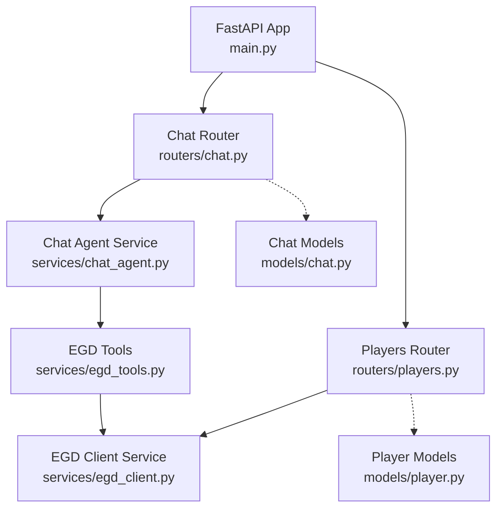
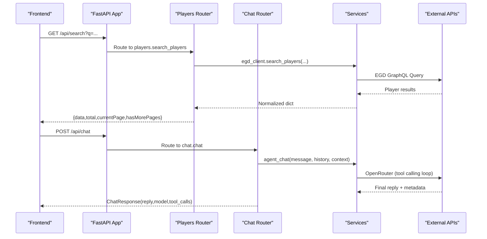
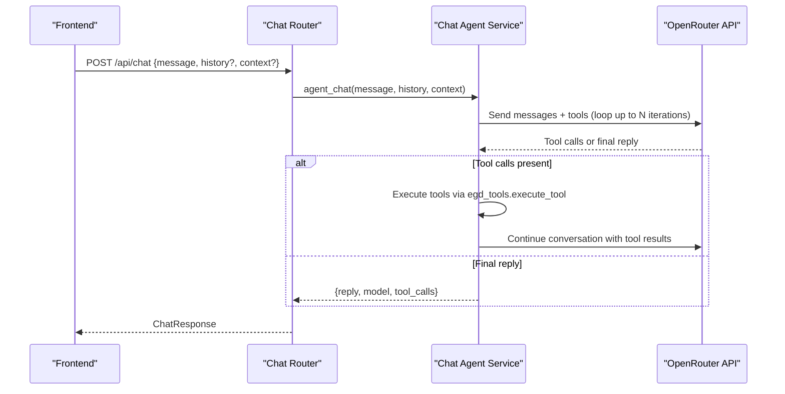
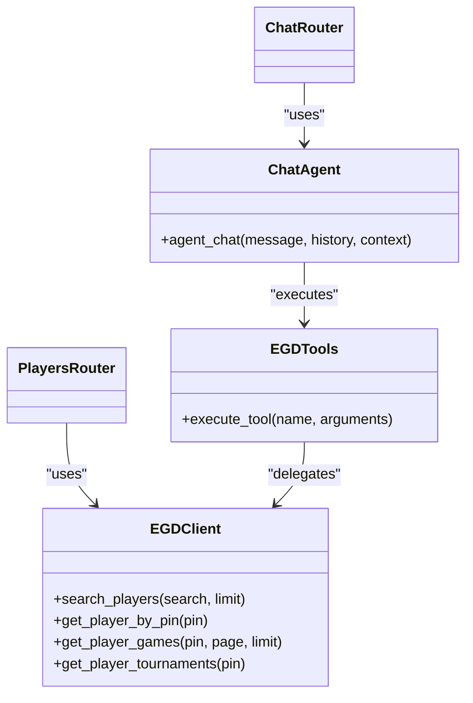
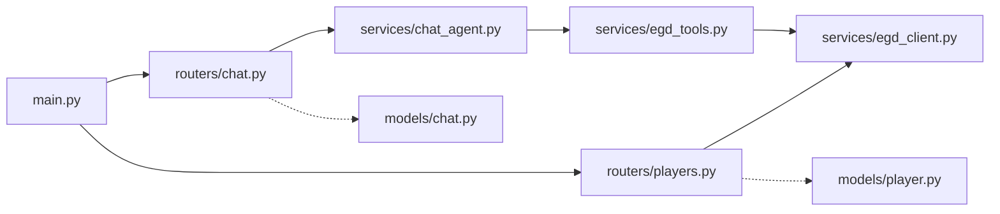

# Routing Layer Architecture

<cite>
**Referenced Files in This Document**
- [main.py](file://backend/app/main.py)
- [players.py](file://backend/app/routers/players.py)
- [chat.py](file://backend/app/routers/chat.py)
- [player.py](file://backend/app/models/player.py)
- [chat.py](file://backend/app/models/chat.py)
- [egd_client.py](file://backend/app/services/egd_client.py)
- [chat_agent.py](file://backend/app/services/chat_agent.py)
- [egd_tools.py](file://backend/app/services/egd_tools.py)
</cite>

## Table of Contents
1. [Introduction](#introduction)
2. [Project Structure](#project-structure)
3. [Core Components](#core-components)
4. [Architecture Overview](#architecture-overview)
5. [Detailed Component Analysis](#detailed-component-analysis)
6. [Dependency Analysis](#dependency-analysis)
7. [Performance Considerations](#performance-considerations)
8. [Troubleshooting Guide](#troubleshooting-guide)
9. [Conclusion](#conclusion)

## Introduction
This document explains the routing layer architecture for the GoNow backend, focusing on how FastAPI routers are organized and how they interact with services and models. It covers:
- Separation of concerns between player and chat routers
- Request validation using Pydantic models
- Response formatting patterns
- Error handling strategies
- RESTful endpoint design for player operations (search, profile, games, tournaments)
- Chat endpoint behavior and current streaming considerations

The goal is to provide a clear mental model of request flow, validation, response shaping, and error propagation across the routing layer.

## Project Structure
At a high level, the application mounts two routers under a shared prefix and exposes health and root endpoints at the app level. The routers encapsulate HTTP semantics and delegate business logic to services. Models define request/response contracts.

**Diagram sources**
- [main.py:14-31](file://backend/app/main.py#L14-L31)
- [players.py:5-106](file://backend/app/routers/players.py#L5-L106)
- [chat.py:6-24](file://backend/app/routers/chat.py#L6-L24)
- [chat.py:47-94](file://backend/app/routers/chat.py#L47-L94)
- [egd_client.py:11-197](file://backend/app/services/egd_client.py#L11-L197)
- [chat_agent.py:30-154](file://backend/app/services/chat_agent.py#L30-L154)
- [egd_tools.py:102-212](file://backend/app/services/egd_tools.py#L102-L212)
- [player.py:6-60](file://backend/app/models/player.py#L6-L60)
- [chat.py:11-21](file://backend/app/models/chat.py#L11-L21)

**Section sources**
- [main.py:14-31](file://backend/app/main.py#L14-L31)

## Core Components
- Players router: Implements REST endpoints for search, player details, games, and tournaments. Uses query parameters and path parameters with built-in validation. Returns consistent JSON structures for list-like responses.
- Chat router: Accepts structured chat requests via Pydantic models and returns typed responses. Currently implements a synchronous proxy to an external chat API; an agentic tool-calling variant exists in the same file but is not mounted by the app.
- Services: Encapsulate external calls (EGD GraphQL client and OpenRouter agent). Routers remain thin, delegating to these services.
- Models: Define request and response schemas used for validation and documentation.

Key responsibilities:
- Routers: HTTP semantics, parameter extraction, basic orchestration, error mapping
- Services: External API integration, data transformation, caching
- Models: Validation, serialization, OpenAPI schema generation

**Section sources**
- [players.py:8-106](file://backend/app/routers/players.py#L8-L106)
- [chat.py:9-24](file://backend/app/routers/chat.py#L9-L24)
- [chat.py:47-94](file://backend/app/routers/chat.py#L47-L94)
- [egd_client.py:44-197](file://backend/app/services/egd_client.py#L44-L197)
- [chat_agent.py:30-154](file://backend/app/services/chat_agent.py#L30-L154)
- [player.py:6-60](file://backend/app/models/player.py#L6-L60)
- [chat.py:11-21](file://backend/app/models/chat.py#L11-L21)

## Architecture Overview
The routing layer sits between the HTTP interface and the service layer. It validates inputs, delegates to services, normalizes responses, and maps exceptions to HTTP errors.

**Diagram sources**
- [players.py:8-40](file://backend/app/routers/players.py#L8-L40)
- [chat.py:9-24](file://backend/app/routers/chat.py#L9-L24)
- [chat.py:47-94](file://backend/app/routers/chat.py#L47-L94)
- [egd_client.py:44-70](file://backend/app/services/egd_client.py#L44-L70)
- [chat_agent.py:30-154](file://backend/app/services/chat_agent.py#L30-L154)

## Detailed Component Analysis

### Players Router
Responsibilities:
- Expose REST endpoints for player search and detail retrieval
- Validate path and query parameters
- Normalize responses into consistent shapes
- Map service exceptions to HTTP errors

Endpoints:
- GET /api/search?q=<query>
  - Query parameter q validated with min_length=1
  - If q is numeric, attempts direct PIN lookup first; otherwise performs name search
  - Returns a paginated structure with data array and pagination fields
- GET /api/player/{pin}
  - Path parameter pin validated as integer
  - Enriches response with rating_history derived from placements
  - Returns 404 when player not found
- GET /api/player/{pin}/games?page=1&limit=50
  - Query parameters page and limit validated with ge/le constraints
  - Delegates to service for game history
- GET /api/player/{pin}/tournaments
  - Aggregates tournament info from placements and sorts by date

Validation examples:
- Path parameter pin: int type enforced by FastAPI
- Query parameter q: str with min_length=1
- Query parameters page and limit: integers with ge/le bounds

Response formatting patterns:
- Search returns a wrapper object with data, total, currentPage, hasMorePages
- Player detail merges base player fields with computed rating_history
- Games and tournaments return normalized structures suitable for frontend consumption

Error handling:
- 404 for missing player profiles
- 500 for unexpected service or network errors
- Re-raises HTTPException to preserve status codes

```mermaid
flowchart TD
Start(["Request /api/search"]) --> ValidateQ["Validate q (min_length=1)"]
ValidateQ --> IsNumeric{"q.isdigit()?"}
IsNumeric --> |Yes| TryPin["Try get_player_by_pin(int(q))"]
TryPin --> Found{"Player found?"}
Found --> |Yes| ReturnSingle["Return single-player wrapper"]
Found --> |No| NameSearch["Fallback to search_players(q)"]
IsNumeric --> |No| NameSearch
NameSearch --> ReturnList["Return paginated result"]
ReturnSingle --> End(["Response"])
ReturnList --> End
```

**Diagram sources**
- [players.py:8-40](file://backend/app/routers/players.py#L8-L40)

**Section sources**
- [players.py:8-106](file://backend/app/routers/players.py#L8-L106)

### Chat Router
Responsibilities:
- Accept structured chat requests using Pydantic models
- Return typed responses
- Currently provides a simple proxy to an external chat API
- An agentic tool-calling implementation exists in the same file but is not mounted by the app

Request validation:
- ChatRequest requires message string; optional context and history fields
- History items use ChatMessage with role and content strings

Response formatting:
- ChatResponse includes reply, optional model, and optional tool_calls

Error handling:
- Returns a friendly fallback when API key is missing
- Maps external API failures to 500 with descriptive messages

Streaming capabilities:
- Current implementation uses standard HTTP response with full payload returned after completion
- No server-sent events or streaming implemented in the active route

**Diagram sources**
- [chat.py:9-24](file://backend/app/routers/chat.py#L9-L24)
- [chat_agent.py:30-154](file://backend/app/services/chat_agent.py#L30-L154)
- [egd_tools.py:102-212](file://backend/app/services/egd_tools.py#L102-L212)

**Section sources**
- [chat.py:9-24](file://backend/app/routers/chat.py#L9-L24)
- [chat.py:47-94](file://backend/app/routers/chat.py#L47-L94)
- [chat_agent.py:30-154](file://backend/app/services/chat_agent.py#L30-L154)

### Pydantic Models and Validation
Models define strict contracts for both requests and responses, enabling automatic validation and OpenAPI schema generation.

- Player models:
  - PlayerSummary, TournamentInfo, PlacementInfo, PlayerDetail, SearchResponse
  - Used to describe expected response shapes and optional fields
- Chat models:
  - ChatMessage, ChatRequest, ChatResponse
  - Used for request validation and response typing

Examples of usage:
- ChatRequest enforces presence of message and optional fields for context/history
- SearchResponse describes the shape of search results including pagination fields

Note: While some routes return plain dicts rather than Pydantic instances, the models still serve as documentation and can be adopted for stricter response enforcement.

**Section sources**
- [player.py:6-60](file://backend/app/models/player.py#L6-L60)
- [chat.py:11-21](file://backend/app/models/chat.py#L11-L21)

### Service Integration and Data Flow
Routers delegate to services that handle external communication and data transformation.

- EGD client:
  - Provides methods for searching players, fetching player details, games, and tournaments
  - Includes in-memory caching with TTL to reduce external calls
- Chat agent:
  - Orchestrates tool-calling loop with OpenRouter
  - Executes predefined tools via egd_tools, which map to EGD client methods

**Diagram sources**
- [egd_client.py:44-197](file://backend/app/services/egd_client.py#L44-L197)
- [chat_agent.py:30-154](file://backend/app/services/chat_agent.py#L30-L154)
- [egd_tools.py:102-212](file://backend/app/services/egd_tools.py#L102-L212)
- [players.py:8-106](file://backend/app/routers/players.py#L8-L106)
- [chat.py:9-24](file://backend/app/routers/chat.py#L9-L24)

**Section sources**
- [egd_client.py:44-197](file://backend/app/services/egd_client.py#L44-L197)
- [chat_agent.py:30-154](file://backend/app/services/chat_agent.py#L30-L154)
- [egd_tools.py:102-212](file://backend/app/services/egd_tools.py#L102-L212)

## Dependency Analysis
The routing layer depends on services for external integrations and on models for validation and documentation. The app mounts routers and configures CORS.

**Diagram sources**
- [main.py:14-31](file://backend/app/main.py#L14-L31)
- [players.py:3-106](file://backend/app/routers/players.py#L3-L106)
- [chat.py:3-24](file://backend/app/routers/chat.py#L3-L24)
- [chat.py:47-94](file://backend/app/routers/chat.py#L47-L94)
- [egd_client.py:11-197](file://backend/app/services/egd_client.py#L11-L197)
- [chat_agent.py:30-154](file://backend/app/services/chat_agent.py#L30-L154)
- [egd_tools.py:102-212](file://backend/app/services/egd_tools.py#L102-L212)
- [player.py:6-60](file://backend/app/models/player.py#L6-L60)
- [chat.py:11-21](file://backend/app/models/chat.py#L11-L21)

**Section sources**
- [main.py:14-31](file://backend/app/main.py#L14-L31)

## Performance Considerations
- In-memory caching in the EGD client reduces repeated external calls with a configurable TTL
- Pagination parameters allow limiting data transfer size for large datasets
- Avoid unnecessary transformations in routers; keep heavy processing in services
- Consider adopting response models consistently to leverage FastAPI’s optimized serialization

[No sources needed since this section provides general guidance]

## Troubleshooting Guide
Common issues and strategies:
- Missing environment variables:
  - Chat endpoint returns a user-friendly message when OPENROUTER_API_KEY is absent
- External API errors:
  - Routers map service exceptions to HTTP 500 with descriptive details
- Not found scenarios:
  - Player profile endpoint returns 404 when the player does not exist
- Validation errors:
  - FastAPI automatically rejects invalid query/path parameters based on declared types and constraints

Operational tips:
- Inspect logs around HTTPException raises to identify upstream failures
- Verify .env configuration for EGD token and OpenRouter key
- Use the OpenAPI docs served by FastAPI to validate request/response schemas

**Section sources**
- [chat.py:47-94](file://backend/app/routers/chat.py#L47-L94)
- [players.py:43-80](file://backend/app/routers/players.py#L43-L80)

## Conclusion
The routing layer cleanly separates HTTP concerns from business logic by delegating to services and leveraging Pydantic models for validation and documentation. Player endpoints follow REST conventions with robust parameter validation and consistent response shapes. The chat endpoint currently returns complete responses synchronously; while it supports agentic tool calling internally, streaming is not implemented in the active route. Adopting response models consistently and considering streaming for long-running chat interactions would further improve reliability and user experience.