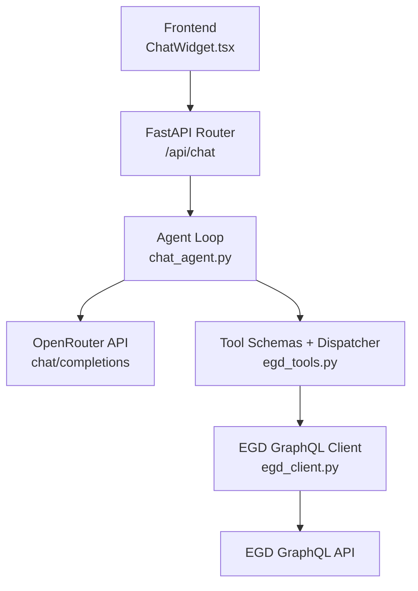
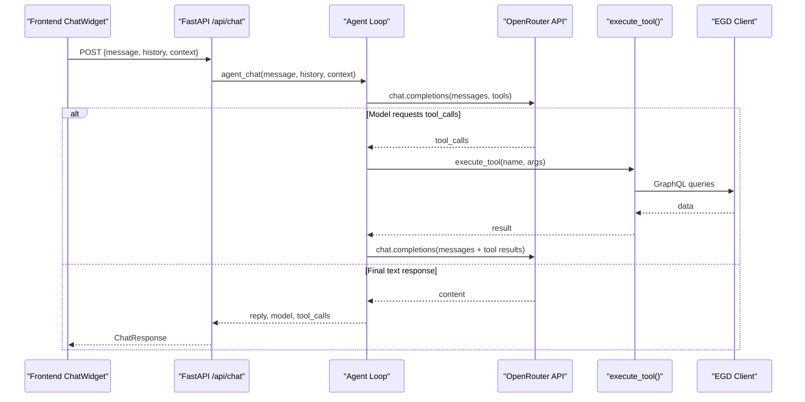
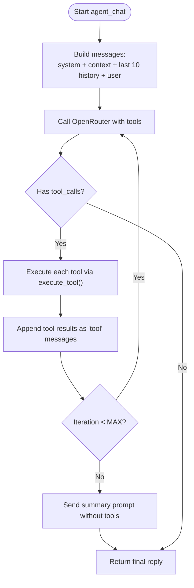
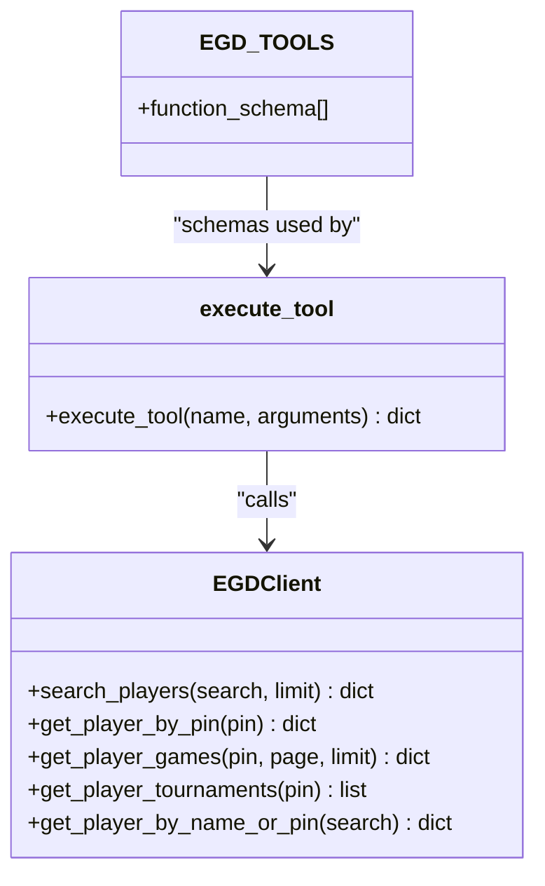
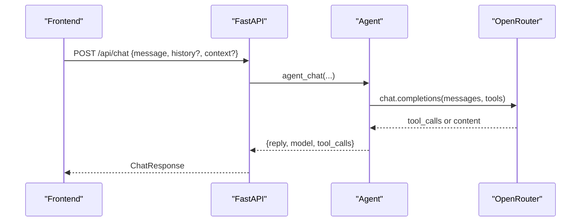
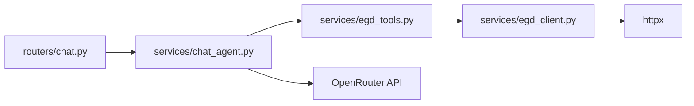

# Agentic Chat System

<cite>
**Referenced Files in This Document**
- [backend/app/services/chat_agent.py](file://backend/app/services/chat_agent.py)
- [backend/app/services/egd_tools.py](file://backend/app/services/egd_tools.py)
- [backend/app/services/egd_client.py](file://backend/app/services/egd_client.py)
- [backend/app/routers/chat.py](file://backend/app/routers/chat.py)
- [backend/app/models/chat.py](file://backend/app/models/chat.py)
- [backend/app/main.py](file://backend/app/main.py)
- [frontend/src/components/ChatWidget.tsx](file://frontend/src/components/ChatWidget.tsx)
- [docs/ARCHITECTURE.md](file://docs/ARCHITECTURE.md)
- [docs/AGENT_DESIGN.md](file://docs/AGENT_DESIGN.md)
</cite>

## Table of Contents
1. [Introduction](#introduction)
2. [Project Structure](#project-structure)
3. [Core Components](#core-components)
4. [Architecture Overview](#architecture-overview)
5. [Detailed Component Analysis](#detailed-component-analysis)
6. [Dependency Analysis](#dependency-analysis)
7. [Performance Considerations](#performance-considerations)
8. [Troubleshooting Guide](#troubleshooting-guide)
9. [Conclusion](#conclusion)
10. [Appendices](#appendices)

## Introduction
This document explains the agentic chat system that enables autonomous tool calling and context-aware responses for Go player analytics. The system integrates a FastAPI backend with OpenRouter’s native tool calling to let an LLM decide when to query the European Go Database (EGD). It covers the iterative reasoning loop, message processing pipeline, conversation state management, memory persistence, tool invocation workflow, configuration options, multi-step examples, error recovery patterns, and performance monitoring approaches.

## Project Structure
The agentic chat is implemented primarily in the backend services and exposed via a FastAPI route. The frontend provides a floating chat widget that sends messages and displays assistant replies.

**Diagram sources**
- [backend/app/routers/chat.py:1-95](file://backend/app/routers/chat.py#L1-L95)
- [backend/app/services/chat_agent.py:1-154](file://backend/app/services/chat_agent.py#L1-L154)
- [backend/app/services/egd_tools.py:1-212](file://backend/app/services/egd_tools.py#L1-L212)
- [backend/app/services/egd_client.py:1-197](file://backend/app/services/egd_client.py#L1-L197)
- [frontend/src/components/ChatWidget.tsx:1-240](file://frontend/src/components/ChatWidget.tsx#L1-L240)

**Section sources**
- [docs/ARCHITECTURE.md:1-99](file://docs/ARCHITECTURE.md#L1-L99)

## Core Components
- Agent loop: orchestrates iterative reasoning with OpenRouter, executes tools, and returns final answers.
- Tool schemas and dispatcher: defines function schemas compatible with OpenAI/OpenRouter and dispatches calls to EGD operations.
- EGD client: GraphQL client with caching for read-only access to the European Go Database.
- API router: exposes POST /api/chat and handles request/response models.
- Frontend widget: UI component that manages conversation state locally and renders assistant replies.

Key responsibilities:
- Message assembly and history truncation
- Iterative tool calling until a final text response or max iterations
- Parameter extraction and execution of predefined tools
- Error handling and fallback behavior
- Configuration via environment variables

**Section sources**
- [backend/app/services/chat_agent.py:1-154](file://backend/app/services/chat_agent.py#L1-L154)
- [backend/app/services/egd_tools.py:1-212](file://backend/app/services/egd_tools.py#L1-L212)
- [backend/app/services/egd_client.py:1-197](file://backend/app/services/egd_client.py#L1-L197)
- [backend/app/routers/chat.py:1-95](file://backend/app/routers/chat.py#L1-L95)
- [backend/app/models/chat.py:1-21](file://backend/app/models/chat.py#L1-L21)
- [frontend/src/components/ChatWidget.tsx:1-240](file://frontend/src/components/ChatWidget.tsx#L1-L240)

## Architecture Overview
The chat flow uses OpenRouter’s native tool calling. The agent builds a conversation with system prompt, optional context, and truncated history, then iteratively prompts the model. If the model requests tool calls, the backend executes them and appends results as tool messages. The loop continues until the model produces a final answer or reaches the iteration cap.

**Diagram sources**
- [backend/app/routers/chat.py:1-95](file://backend/app/routers/chat.py#L1-L95)
- [backend/app/services/chat_agent.py:1-154](file://backend/app/services/chat_agent.py#L1-L154)
- [backend/app/services/egd_tools.py:1-212](file://backend/app/services/egd_tools.py#L1-L212)
- [backend/app/services/egd_client.py:1-197](file://backend/app/services/egd_client.py#L1-L197)

## Detailed Component Analysis

### Agent Loop (Iterative Reasoning)
Responsibilities:
- Build messages array with system prompt, optional page context, and last N history entries.
- Send to OpenRouter with tool schemas.
- Parse tool_calls, execute each tool, append tool results, and continue loop.
- On no tool_calls, return final answer.
- On reaching max iterations, force a final summarization call without tools.

Configuration:
- Model ID from CHAT_MODEL (default google/gemini-2.0-flash-001).
- Max iterations from CHAT_MAX_ITERATIONS (default 3).
- Token limit set per request (max_tokens).

Error handling:
- Missing OPENROUTER_API_KEY returns a user-friendly message.
- JSON decode errors for arguments default to empty dict.
- HTTP errors raised by OpenRouter propagate up.

Context window handling:
- History truncated to last 10 messages to control token usage.
- Optional system context appended for current page/player context.

**Diagram sources**
- [backend/app/services/chat_agent.py:1-154](file://backend/app/services/chat_agent.py#L1-L154)

**Section sources**
- [backend/app/services/chat_agent.py:1-154](file://backend/app/services/chat_agent.py#L1-L154)

### Tool Invocation Workflow
Components:
- Tool schemas: OpenAI-compatible function definitions for search_player, get_player_details, get_player_rating_history, get_player_games, compare_players.
- Dispatcher: execute_tool(name, arguments) routes to appropriate EGD client methods.
- Validation: Required parameters enforced by schema; missing keys handled gracefully.
- Result aggregation: Each tool returns a structured dict with success flag and data or error.

Parameter extraction:
- Arguments parsed from JSON string provided by the model.
- Defaults applied where applicable (e.g., limit for games).

Result format:
- All tool results are normalized into {"success": bool, "data": ...} or {"success": false, "error": "..."} to simplify downstream handling.

**Diagram sources**
- [backend/app/services/egd_tools.py:1-212](file://backend/app/services/egd_tools.py#L1-L212)
- [backend/app/services/egd_client.py:1-197](file://backend/app/services/egd_client.py#L1-L197)

**Section sources**
- [backend/app/services/egd_tools.py:1-212](file://backend/app/services/egd_tools.py#L1-L212)
- [backend/app/services/egd_client.py:1-197](file://backend/app/services/egd_client.py#L1-L197)

### Conversation State Management and Memory Persistence
Backend:
- Stateless per request; accepts optional history and context.
- History truncated to last 10 messages before sending to LLM.
- Context can include current page/player data to improve relevance.

Frontend:
- Local conversation state maintained in React component state.
- No server-side persistence; history is passed back on each request.

Implications:
- To persist across sessions, store history in localStorage or a database.
- Truncation prevents excessive token usage but may lose older context.

**Section sources**
- [backend/app/services/chat_agent.py:1-154](file://backend/app/services/chat_agent.py#L1-L154)
- [backend/app/models/chat.py:1-21](file://backend/app/models/chat.py#L1-L21)
- [frontend/src/components/ChatWidget.tsx:1-240](file://frontend/src/components/ChatWidget.tsx#L1-L240)

### API Integration and Request Flow
- Route: POST /api/chat
- Request body: message, optional context, optional history
- Response: reply, model, tool_calls
- CORS configured for local development origins
- Health check endpoint available

**Diagram sources**
- [backend/app/routers/chat.py:1-95](file://backend/app/routers/chat.py#L1-L95)
- [backend/app/services/chat_agent.py:1-154](file://backend/app/services/chat_agent.py#L1-L154)
- [backend/app/main.py:1-42](file://backend/app/main.py#L1-L42)

**Section sources**
- [backend/app/routers/chat.py:1-95](file://backend/app/routers/chat.py#L1-L95)
- [backend/app/main.py:1-42](file://backend/app/main.py#L1-L42)

### Configuration Options
Environment variables:
- OPENROUTER_API_KEY: Required for chat functionality.
- CHAT_MODEL: Model ID for OpenRouter (default google/gemini-2.0-flash-001).
- CHAT_MAX_ITERATIONS: Maximum tool-calling iterations per turn (default 3).
- EGD_API_TOKEN: Bearer token for EGD GraphQL API.

Request-level settings:
- max_tokens: Set per request to constrain output length.
- History truncation: Last 10 messages included to manage context size.

Notes:
- Temperature is not explicitly set in requests; rely on model defaults.
- For different models, adjust CHAT_MODEL accordingly.

**Section sources**
- [backend/app/services/chat_agent.py:1-154](file://backend/app/services/chat_agent.py#L1-L154)
- [docs/AGENT_DESIGN.md:230-259](file://docs/AGENT_DESIGN.md#L230-L259)

### Examples of Complex Multi-Step Queries
Typical flows:
- Search player by name → retrieve details → summarize rating trends.
- Compare two players → present side-by-side stats.
- Fetch recent games → analyze performance over time.

These flows are orchestrated by the LLM using tool calls; the backend executes tools and feeds results back until a final answer is produced.

[No sources needed since this section summarizes conceptual flows]

### Error Recovery Patterns
- Missing API key: Returns a clear message indicating configuration is required.
- Invalid tool arguments: JSON parse errors default to empty dict; required fields validated by tool logic.
- Unknown tool names: Returns error indicating unknown tool.
- External API failures: Exceptions caught and returned as error payloads; HTTP errors propagated to caller.
- Max iterations reached: Forces a final summarization prompt to ensure a textual response.

Operational recommendations:
- Log tool_calls and errors for observability.
- Surface user-friendly messages in the frontend.

**Section sources**
- [backend/app/services/chat_agent.py:1-154](file://backend/app/services/chat_agent.py#L1-L154)
- [backend/app/services/egd_tools.py:1-212](file://backend/app/services/egd_tools.py#L1-L212)

### Performance Monitoring Approaches
- Track number of tool_calls per turn and total iterations.
- Measure latency between requests and responses at the API layer.
- Monitor EGD client cache hit rates and TTL effectiveness.
- Observe token usage via model field in responses.

Implementation ideas:
- Add metrics collection around agent_chat and execute_tool.
- Record timing for OpenRouter and EGD calls.
- Expose a telemetry endpoint or integrate with existing APM.

[No sources needed since this section provides general guidance]

## Dependency Analysis
High-level dependencies:
- FastAPI router depends on agent service.
- Agent depends on tool schemas and dispatcher.
- Tools depend on EGD client.
- EGD client depends on httpx and environment tokens.

**Diagram sources**
- [backend/app/routers/chat.py:1-95](file://backend/app/routers/chat.py#L1-L95)
- [backend/app/services/chat_agent.py:1-154](file://backend/app/services/chat_agent.py#L1-L154)
- [backend/app/services/egd_tools.py:1-212](file://backend/app/services/egd_tools.py#L1-L212)
- [backend/app/services/egd_client.py:1-197](file://backend/app/services/egd_client.py#L1-L197)

**Section sources**
- [backend/app/routers/chat.py:1-95](file://backend/app/routers/chat.py#L1-L95)
- [backend/app/services/chat_agent.py:1-154](file://backend/app/services/chat_agent.py#L1-L154)
- [backend/app/services/egd_tools.py:1-212](file://backend/app/services/egd_tools.py#L1-L212)
- [backend/app/services/egd_client.py:1-197](file://backend/app/services/egd_client.py#L1-L197)

## Performance Considerations
- Context window: Limit history to last 10 messages to reduce token consumption.
- Iteration cap: Prevent runaway loops with CHAT_MAX_ITERATIONS.
- Caching: EGD client caches responses for 5 minutes to reduce external calls.
- Timeouts: Use reasonable timeouts for OpenRouter and EGD calls.
- Model selection: Choose faster, cheaper models for tool calling when appropriate.

[No sources needed since this section provides general guidance]

## Troubleshooting Guide
Common issues and resolutions:
- Chat disabled: Ensure OPENROUTER_API_KEY is set in .env.
- Tool call errors: Validate tool parameters and ensure required fields are present.
- EGD API errors: Check EGD_API_TOKEN and network connectivity; inspect GraphQL errors.
- Long responses: Adjust max_tokens and consider summarizing tool outputs.
- Stuck in tool loop: Increase CHAT_MAX_ITERATIONS cautiously and review tool schemas.

Observability tips:
- Log tool_calls and outcomes.
- Capture request IDs and timestamps.
- Monitor error rates and latencies.

**Section sources**
- [backend/app/services/chat_agent.py:1-154](file://backend/app/services/chat_agent.py#L1-L154)
- [backend/app/services/egd_tools.py:1-212](file://backend/app/services/egd_tools.py#L1-L212)
- [backend/app/services/egd_client.py:1-197](file://backend/app/services/egd_client.py#L1-L197)

## Conclusion
The agentic chat system leverages OpenRouter’s native tool calling to autonomously query the EGD and synthesize insights. Its design emphasizes simplicity, reliability, and configurability. With clear separation of concerns—agent loop, tool schemas, and EGD client—the system scales well for additional tools and models while maintaining robust error handling and performance controls.

[No sources needed since this section summarizes without analyzing specific files]

## Appendices

### API Definition Summary
- Endpoint: POST /api/chat
- Request fields:
  - message: string (required)
  - context: string (optional)
  - history: list of {role, content} (optional)
- Response fields:
  - reply: string
  - model: string (optional)
  - tool_calls: list of strings (optional)

**Section sources**
- [backend/app/routers/chat.py:1-95](file://backend/app/routers/chat.py#L1-L95)
- [backend/app/models/chat.py:1-21](file://backend/app/models/chat.py#L1-L21)

### Environment Variables Reference
- OPENROUTER_API_KEY: OpenRouter API key
- CHAT_MODEL: Model ID (default google/gemini-2.0-flash-001)
- CHAT_MAX_ITERATIONS: Max tool-calling iterations (default 3)
- EGD_API_TOKEN: EGD GraphQL bearer token

**Section sources**
- [backend/app/services/chat_agent.py:1-154](file://backend/app/services/chat_agent.py#L1-L154)
- [docs/AGENT_DESIGN.md:230-259](file://docs/AGENT_DESIGN.md#L230-L259)