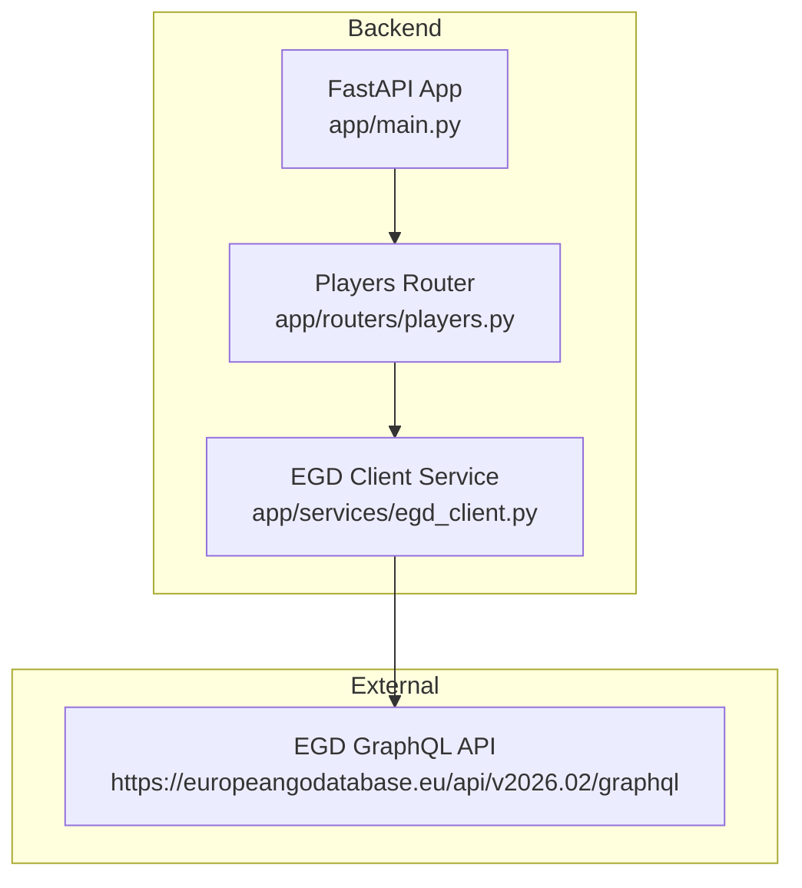
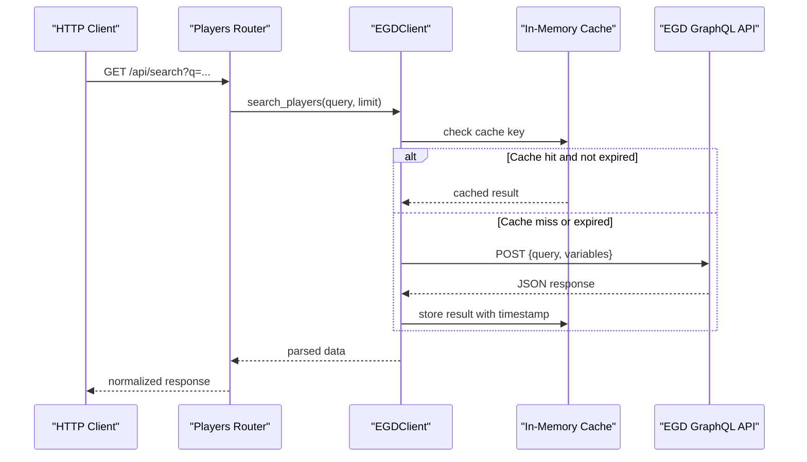
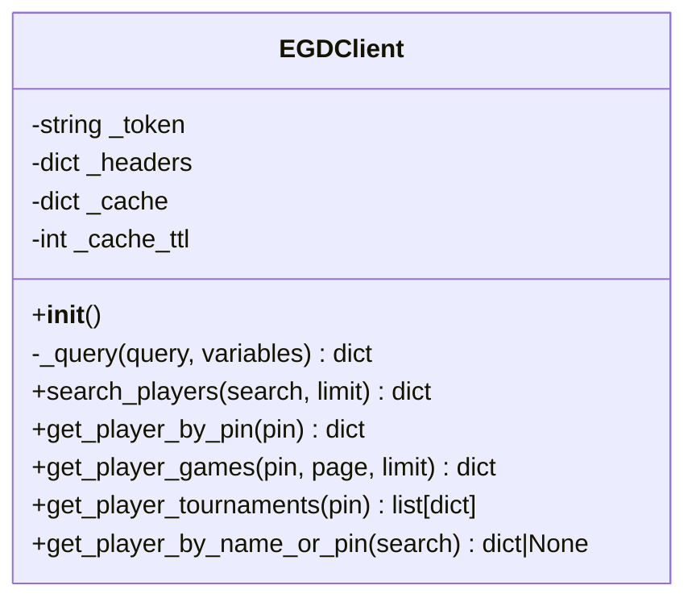
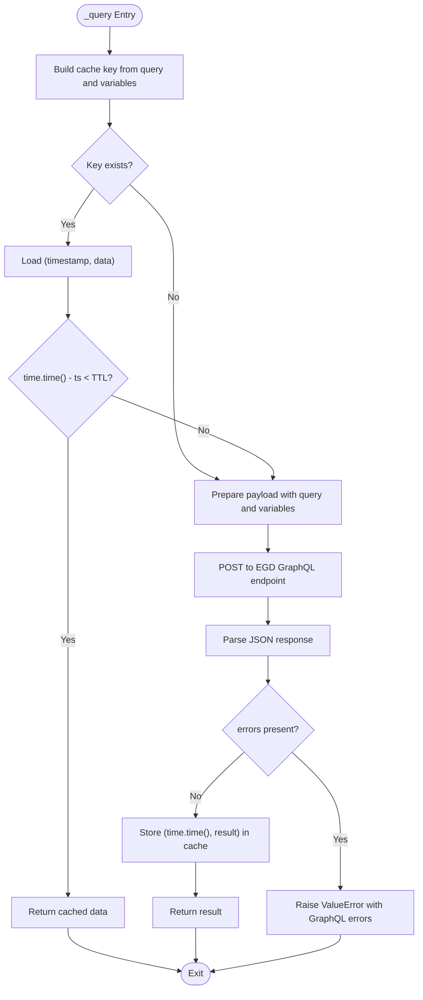
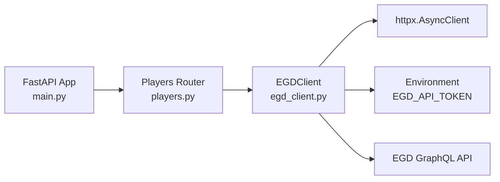

# EGD GraphQL Client

<cite>
**Referenced Files in This Document**
- [egd_client.py](file://backend/app/services/egd_client.py)
- [players.py](file://backend/app/routers/players.py)
- [EGD_API.md](file://docs/EGD_API.md)
- [main.py](file://backend/app/main.py)
- [requirements.txt](file://backend/requirements.txt)
</cite>

## Table of Contents
1. [Introduction](#introduction)
2. [Project Structure](#project-structure)
3. [Core Components](#core-components)
4. [Architecture Overview](#architecture-overview)
5. [Detailed Component Analysis](#detailed-component-analysis)
6. [Dependency Analysis](#dependency-analysis)
7. [Performance Considerations](#performance-considerations)
8. [Troubleshooting Guide](#troubleshooting-guide)
9. [Conclusion](#conclusion)

## Introduction
This document explains the EGD GraphQL client implementation used by the GoNow backend to interact with the European Go Database (EGD) GraphQL API. It covers the EGDClient class architecture, connection management using httpx.AsyncClient, authentication via Bearer tokens, caching with TTL-based expiration, error handling for HTTP and GraphQL errors, response parsing logic, and all available methods: search_players, get_player_by_pin, get_player_games, get_player_tournaments, and get_player_by_name_or_pin. It also provides guidance on constructing GraphQL queries, binding variables, pagination handling, and performance optimization techniques.

## Project Structure
The EGD client is implemented as a service module and exposed through FastAPI routes. The main application wires routers and loads environment configuration.

**Diagram sources**
- [main.py:14-31](file://backend/app/main.py#L14-L31)
- [players.py:1-107](file://backend/app/routers/players.py#L1-107)
- [egd_client.py:11-42](file://backend/app/services/egd_client.py#L11-L42)

**Section sources**
- [main.py:1-42](file://backend/app/main.py#L1-42)
- [players.py:1-107](file://backend/app/routers/players.py#L1-107)
- [egd_client.py:1-197](file://backend/app/services/egd_client.py#L1-197)

## Core Components
- EGDClient: Encapsulates authentication, HTTP transport, caching, and query execution. Provides typed convenience methods for common operations.
- Players Router: Exposes REST endpoints that delegate to EGDClient and transform responses for consumers.

Key responsibilities:
- Authentication: Bearer token from environment variable.
- Transport: Asynchronous HTTP POST to EGD GraphQL endpoint.
- Caching: In-memory dict with timestamped entries and TTL.
- Error Handling: HTTP status checks and GraphQL errors aggregation.
- Response Parsing: Extracts data payloads and normalizes results.

**Section sources**
- [egd_client.py:11-42](file://backend/app/services/egd_client.py#L11-L42)
- [players.py:8-40](file://backend/app/routers/players.py#L8-L40)

## Architecture Overview
The client follows a layered design:
- Application layer (FastAPI router) receives requests and delegates to the service.
- Service layer (EGDClient) handles GraphQL communication, caching, and error translation.
- External system (EGD GraphQL API) returns JSON responses conforming to the schema documented in the project docs.

**Diagram sources**
- [players.py:8-40](file://backend/app/routers/players.py#L8-L40)
- [egd_client.py:21-42](file://backend/app/services/egd_client.py#L21-L42)

## Detailed Component Analysis

### EGDClient Class
Responsibilities:
- Initialize headers with Authorization Bearer token and Content-Type.
- Maintain an in-memory cache keyed by query string plus variables, storing timestamps and payloads.
- Execute GraphQL queries asynchronously with httpx.AsyncClient and a timeout.
- Raise ValueError when the server returns GraphQL errors.
- Provide high-level methods for player search, details, games, tournaments, and flexible lookup.

**Diagram sources**
- [egd_client.py:11-197](file://backend/app/services/egd_client.py#L11-L197)

#### Connection Management
- Uses httpx.AsyncClient within each request context with a timeout.
- Sets Authorization header with Bearer token read from environment.
- Posts JSON payload containing query and optional variables to the EGD GraphQL endpoint.

**Section sources**
- [egd_client.py:12-19](file://backend/app/services/egd_client.py#L12-L19)
- [egd_client.py:33-36](file://backend/app/services/egd_client.py#L33-L36)

#### Authentication
- Token sourced from environment variable EGD_API_TOKEN.
- Header format: Authorization: Bearer <token>.
- Content-Type set to application/json.

**Section sources**
- [egd_client.py:13-17](file://backend/app/services/egd_client.py#L13-L17)
- [EGD_API.md:9-16](file://docs/EGD_API.md#L9-L16)

#### Caching Mechanism
- In-memory dictionary mapping composite keys (query concatenated with variables) to tuples of (timestamp, payload).
- TTL-based expiration: if current time minus stored timestamp is less than configured TTL, return cached payload.
- Default TTL is 300 seconds; can be adjusted per instance.

**Diagram sources**
- [egd_client.py:21-42](file://backend/app/services/egd_client.py#L21-L42)

**Section sources**
- [egd_client.py:18-19](file://backend/app/services/egd_client.py#L18-L19)
- [egd_client.py:23-27](file://backend/app/services/egd_client.py#L23-L27)
- [egd_client.py:41-42](file://backend/app/services/egd_client.py#L41-L42)

#### Error Handling Strategies
- HTTP errors: raise_for_status raises exceptions for non-2xx responses.
- GraphQL errors: presence of "errors" in response triggers ValueError with aggregated error details.
- Upstream callers should catch ValueError and/or HTTP-related exceptions to handle failures gracefully.

**Section sources**
- [egd_client.py:35-39](file://backend/app/services/egd_client.py#L35-L39)

#### Response Parsing Logic
- Each public method constructs a specific GraphQL query and binds variables.
- Returns the relevant nested field from the response’s data object.
- For list endpoints, returns pagination metadata alongside data arrays.

**Section sources**
- [egd_client.py:44-70](file://backend/app/services/egd_client.py#L44-L70)
- [egd_client.py:72-118](file://backend/app/services/egd_client.py#L72-L118)
- [egd_client.py:120-150](file://backend/app/services/egd_client.py#L120-L150)
- [egd_client.py:152-177](file://backend/app/services/egd_client.py#L152-L177)
- [egd_client.py:179-192](file://backend/app/services/egd_client.py#L179-L192)

### Methods Reference

#### search_players
- Purpose: Typo-tolerant name search returning paginated player summaries.
- Inputs: search (string), limit (integer, default 20).
- Output: Dict with fields including data array, total, currentPage, hasMorePages.
- Notes: Leverages playersSearch query with pagination parameters.

**Section sources**
- [egd_client.py:44-70](file://backend/app/services/egd_client.py#L44-L70)
- [EGD_API.md:81-106](file://docs/EGD_API.md#L81-L106)

#### get_player_by_pin
- Purpose: Retrieve detailed player profile including biography and placements.
- Inputs: pin (integer).
- Output: Player object with nested tournament placement data.

**Section sources**
- [egd_client.py:72-118](file://backend/app/services/egd_client.py#L72-L118)
- [EGD_API.md:26-79](file://docs/EGD_API.md#L26-L79)

#### get_player_games
- Purpose: Fetch game history for a player with pagination and ordering.
- Inputs: pin (integer), page (integer, default 1), limit (integer, default 50).
- Output: Games pagination structure with data array and metadata.

**Section sources**
- [egd_client.py:120-150](file://backend/app/services/egd_client.py#L120-L150)
- [EGD_API.md:129-133](file://docs/EGD_API.md#L129-L133)

#### get_player_tournaments
- Purpose: Derive a deduplicated list of tournaments from player placements.
- Inputs: pin (integer).
- Output: List of dicts with tournament info and placement stats.

**Section sources**
- [egd_client.py:152-177](file://backend/app/services/egd_client.py#L152-L177)

#### get_player_by_name_or_pin
- Purpose: Flexible lookup that accepts either a numeric PIN or a name.
- Inputs: search (string).
- Output: Player detail dict if found, otherwise None.
- Behavior: If input is digits, attempts direct PIN lookup; otherwise performs name search and resolves first match.

**Section sources**
- [egd_client.py:179-192](file://backend/app/services/egd_client.py#L179-L192)

### GraphQL Query Construction and Variable Binding
- Queries are defined as strings within methods and executed via _query.
- Variables are passed as a dict and included in the payload under the variables key when provided.
- Example patterns:
  - Search: playersSearch with search and pagination.page/limit.
  - Details: player with pin and nested fields.
  - Games: games with filter.playerPin, order.field/direction, and pagination.page/limit.

**Section sources**
- [egd_client.py:29-31](file://backend/app/services/egd_client.py#L29-L31)
- [egd_client.py:46-68](file://backend/app/services/egd_client.py#L46-L68)
- [egd_client.py:74-116](file://backend/app/services/egd_client.py#L74-L116)
- [egd_client.py:122-148](file://backend/app/services/egd_client.py#L122-L148)

### Pagination Handling
- All list endpoints accept pagination.page and pagination.limit.
- Responses include total, currentPage, and hasMorePages for navigation.
- Consumers should iterate pages until hasMorePages is false.

**Section sources**
- [EGD_API.md:255-274](file://docs/EGD_API.md#L255-L274)
- [egd_client.py:46-68](file://backend/app/services/egd_client.py#L46-L68)
- [egd_client.py:122-148](file://backend/app/services/egd_client.py#L122-L148)

### Integration Points
- FastAPI router exposes endpoints that call EGDClient methods and normalize responses.
- Environment configuration loaded via dotenv; EGD_API_TOKEN required.

**Section sources**
- [players.py:8-40](file://backend/app/routers/players.py#L8-L40)
- [main.py:8-10](file://backend/app/main.py#L8-L10)
- [main.py:29-31](file://backend/app/main.py#L29-L31)

## Dependency Analysis
External dependencies:
- httpx: Async HTTP client used for GraphQL requests.
- Python standard library: os, time, typing.

Internal relationships:
- FastAPI app includes players router.
- Players router depends on egd_client singleton.
- EGDClient depends on environment configuration for token.

**Diagram sources**
- [main.py:29-31](file://backend/app/main.py#L29-L31)
- [players.py:1-107](file://backend/app/routers/players.py#L1-107)
- [egd_client.py:1-197](file://backend/app/services/egd_client.py#L1-197)
- [requirements.txt:1-5](file://backend/requirements.txt#L1-L5)

**Section sources**
- [requirements.txt:1-5](file://backend/requirements.txt#L1-L5)
- [main.py:29-31](file://backend/app/main.py#L29-L31)
- [players.py:1-107](file://backend/app/routers/players.py#L1-107)
- [egd_client.py:1-197](file://backend/app/services/egd_client.py#L1-197)

## Performance Considerations
- Caching: Use TTL-based in-memory cache to reduce redundant network calls. Adjust TTL based on data volatility.
- Request Timeout: Set appropriate timeouts to avoid hanging connections.
- Pagination Limits: Keep limit values reasonable to minimize payload sizes and processing time.
- Deduplication: When deriving lists (e.g., tournaments), use sets to avoid duplicates efficiently.
- Reuse Singleton: The module exports a singleton instance to share state across requests.

[No sources needed since this section provides general guidance]

## Troubleshooting Guide
Common issues and resolutions:
- Missing or invalid EGD_API_TOKEN: Ensure the environment variable is set in backend/.env.
- HTTP errors: Non-2xx responses will raise exceptions; verify network connectivity and token permissions.
- GraphQL errors: Presence of "errors" in response raises ValueError; inspect error messages for query or parameter issues.
- Empty results: For name searches, ensure spelling variations; consider increasing limit or adjusting search terms.
- Pagination exhaustion: Iterate pages while hasMorePages is true; validate page and limit bounds.

Operational tips:
- Validate inputs before calling client methods.
- Wrap calls in try/except blocks at the router layer to convert exceptions into HTTP responses.
- Log cache hits and misses for observability.

**Section sources**
- [EGD_API.md:9-16](file://docs/EGD_API.md#L9-L16)
- [players.py:39-40](file://backend/app/routers/players.py#L39-L40)
- [players.py:77-80](file://backend/app/routers/players.py#L77-L80)
- [players.py:93-94](file://backend/app/routers/players.py#L93-L94)
- [players.py:105-106](file://backend/app/routers/players.py#L105-L106)
- [egd_client.py:35-39](file://backend/app/services/egd_client.py#L35-L39)

## Conclusion
The EGD GraphQL client provides a robust, asynchronous interface to the European Go Database with built-in authentication, caching, and clear error handling. Its methods encapsulate common operations such as player search, detailed profiles, game history, and tournament analysis. By following the recommended practices for query construction, variable binding, pagination, and performance tuning, consumers can build efficient and reliable integrations.