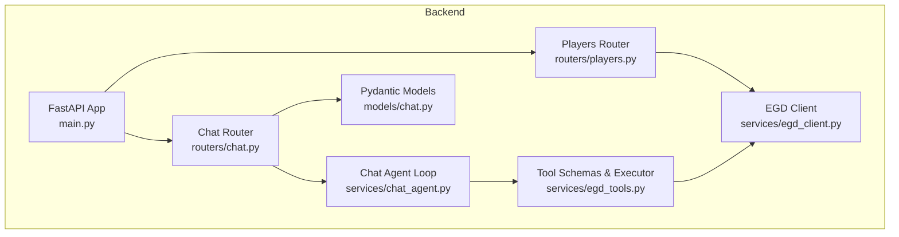
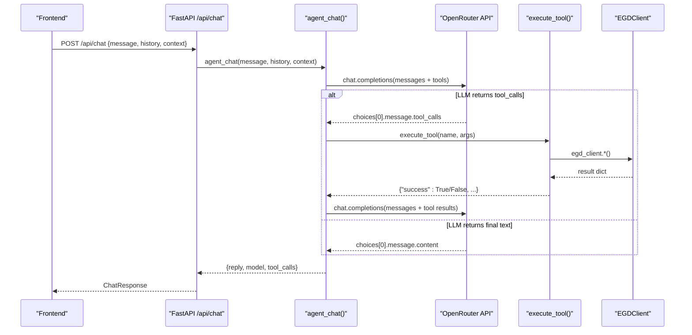
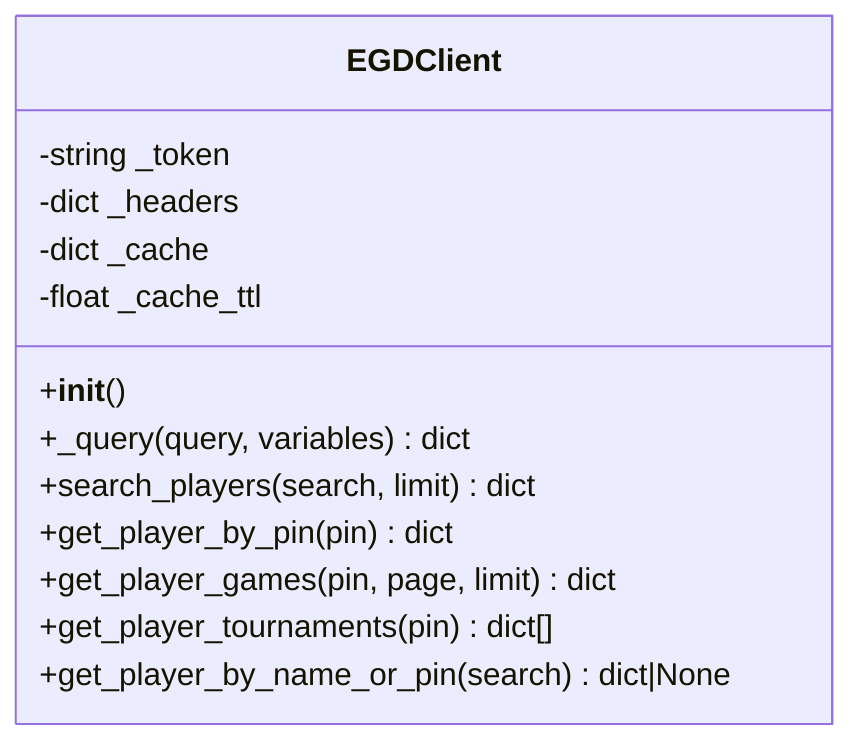
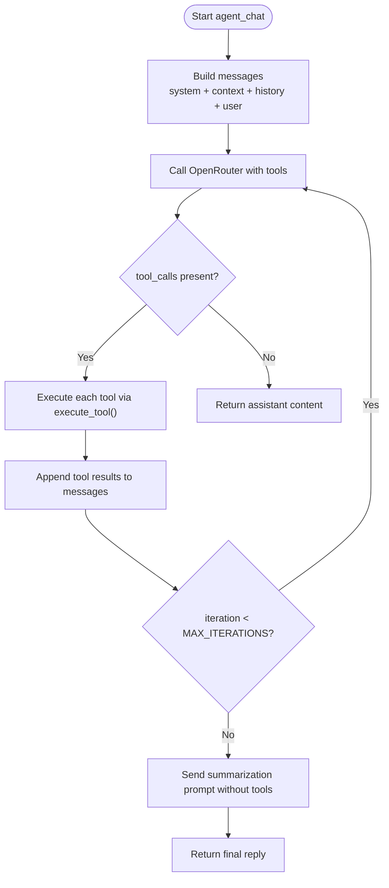
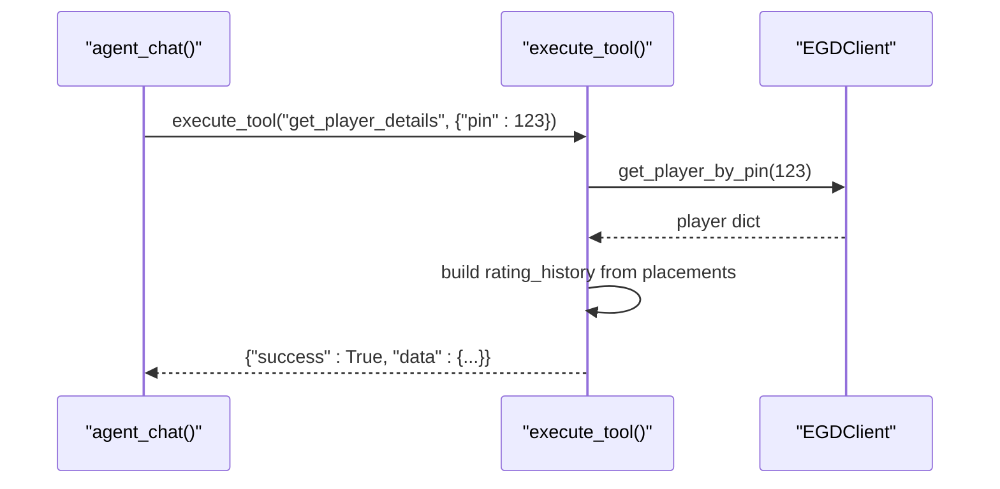
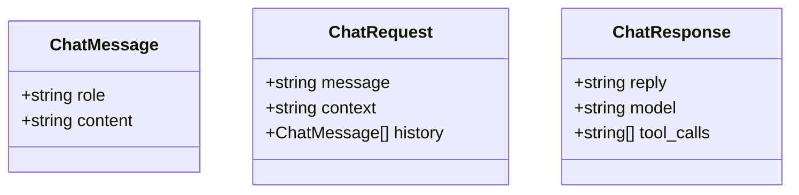
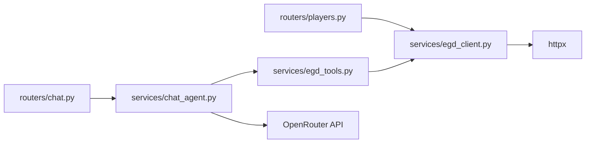

# Service Layer Implementation

<cite>
**Referenced Files in This Document**
- [main.py](file://backend/app/main.py)
- [chat.py](file://backend/app/routers/chat.py)
- [players.py](file://backend/app/routers/players.py)
- [chat_agent.py](file://backend/app/services/chat_agent.py)
- [egd_client.py](file://backend/app/services/egd_client.py)
- [egd_tools.py](file://backend/app/services/egd_tools.py)
- [chat.py](file://backend/app/models/chat.py)
- [requirements.txt](file://backend/requirements.txt)
- [ARCHITECTURE.md](file://docs/ARCHITECTURE.md)
- [EGD_API.md](file://docs/EGD_API.md)
</cite>

## Table of Contents
1. [Introduction](#introduction)
2. [Project Structure](#project-structure)
3. [Core Components](#core-components)
4. [Architecture Overview](#architecture-overview)
5. [Detailed Component Analysis](#detailed-component-analysis)
6. [Dependency Analysis](#dependency-analysis)
7. [Performance Considerations](#performance-considerations)
8. [Troubleshooting Guide](#troubleshooting-guide)
9. [Conclusion](#conclusion)

## Introduction
This document explains the service layer architecture with a focus on:
- The EGD GraphQL client implementation using httpx, including connection management, query construction, and response parsing
- The agentic chat system that uses iterative reasoning loops, tool calling mechanisms, and context management
- The tool execution framework for dynamic function invocation based on LLM calls
- Caching strategies, error handling patterns, and performance optimization techniques

The backend is a FastAPI application that proxies requests to the European Go Database (EGD) GraphQL API and integrates an OpenRouter-hosted LLM with native tool calling to provide an agentic chat assistant.

## Project Structure
The service layer resides under backend/app/services and is exposed via FastAPI routers. The main entrypoint configures CORS, loads environment variables, and mounts routers.

**Diagram sources**
- [main.py:14-31](file://backend/app/main.py#L14-L31)
- [players.py:1-107](file://backend/app/routers/players.py#L1-L107)
- [chat.py:1-95](file://backend/app/routers/chat.py#L1-L95)
- [chat_agent.py:1-154](file://backend/app/services/chat_agent.py#L1-L154)
- [egd_client.py:1-197](file://backend/app/services/egd_client.py#L1-L197)
- [egd_tools.py:1-212](file://backend/app/services/egd_tools.py#L1-L212)
- [chat.py:1-21](file://backend/app/models/chat.py#L1-L21)

**Section sources**
- [main.py:1-42](file://backend/app/main.py#L1-L42)
- [ARCHITECTURE.md:1-99](file://docs/ARCHITECTURE.md#L1-L99)

## Core Components
- EGD GraphQL client: Provides typed methods to search players, fetch player details, retrieve games, and derive tournament history from placements. It includes in-memory caching with TTL and robust error handling.
- Tool schemas and executor: Declares OpenAI-compatible tool definitions and routes LLM-invoked functions to the EGD client.
- Agentic chat loop: Orchestrates conversation messages, sends them to OpenRouter with tool schemas, executes returned tool calls, feeds results back into the conversation, and iterates until a final text response is produced.
- Routers and models: Expose REST endpoints and define request/response contracts.

**Section sources**
- [egd_client.py:11-197](file://backend/app/services/egd_client.py#L11-L197)
- [egd_tools.py:5-212](file://backend/app/services/egd_tools.py#L5-L212)
- [chat_agent.py:30-154](file://backend/app/services/chat_agent.py#L30-L154)
- [chat.py:1-95](file://backend/app/routers/chat.py#L1-L95)
- [players.py:1-107](file://backend/app/routers/players.py#L1-L107)
- [chat.py:1-21](file://backend/app/models/chat.py#L1-L21)

## Architecture Overview
The service layer composes three primary flows:
- Player data access via EGD GraphQL through the client
- Agentic chat with OpenRouter and tool calling
- Routing and model validation at the API boundary

**Diagram sources**
- [chat.py:9-24](file://backend/app/routers/chat.py#L9-L24)
- [chat_agent.py:30-154](file://backend/app/services/chat_agent.py#L30-L154)
- [egd_tools.py:102-212](file://backend/app/services/egd_tools.py#L102-L212)
- [egd_client.py:21-197](file://backend/app/services/egd_client.py#L21-L197)

## Detailed Component Analysis

### EGD GraphQL Client (httpx-based)
Responsibilities:
- Connection management: Uses httpx.AsyncClient per request with timeouts; headers include Authorization and Content-Type.
- Query construction: Encapsulates GraphQL queries for searching players, fetching player details, retrieving games, and deriving tournaments from placements.
- Response parsing: Normalizes responses, extracts nested fields, and raises errors when GraphQL reports errors.
- Caching: In-memory cache keyed by query string and variables with a configurable TTL.

Key behaviors:
- _query builds payload, checks cache, performs HTTP POST, validates status, parses JSON, handles GraphQL errors, updates cache, and returns normalized data.
- search_players, get_player_by_pin, get_player_games implement specific queries and return structured dicts.
- get_player_tournaments derives a deduplicated list of tournaments from placements.
- get_player_by_name_or_pin supports numeric PIN or name-based lookup.

**Diagram sources**
- [egd_client.py:11-197](file://backend/app/services/egd_client.py#L11-L197)

Error handling:
- Raises ValueError on GraphQL errors.
- Catches network and parsing exceptions in higher-level helpers where appropriate.

Caching strategy:
- In-memory dict keyed by f"{query}:{variables}".
- TTL-based expiration to reduce external calls.

Performance considerations:
- Reuse of httpx.AsyncClient per call with timeout prevents resource leaks.
- Cache reduces repeated EGD calls for identical queries within TTL.

**Section sources**
- [egd_client.py:21-42](file://backend/app/services/egd_client.py#L21-L42)
- [egd_client.py:44-197](file://backend/app/services/egd_client.py#L44-L197)

### Agentic Chat System (Iterative Reasoning Loops)
Responsibilities:
- Build message arrays with system prompt, optional context, and limited history.
- Send requests to OpenRouter with tool schemas.
- Iterate up to a maximum number of rounds to handle tool calls.
- Execute tools via the executor and feed results back into the conversation.
- Return final text response and metadata.

Flow highlights:
- If tool_calls are present, append assistant message with tool_calls, execute each tool, append tool results, and continue loop.
- If no tool_calls, return final reply.
- On exhausting iterations, force a final summarization call without tools.

**Diagram sources**
- [chat_agent.py:30-154](file://backend/app/services/chat_agent.py#L30-L154)

Context management:
- Optional context appended as a system message.
- History truncated to last N messages to control token usage.

Configuration:
- Model selection via environment variable.
- Maximum iterations controlled via environment variable.

**Section sources**
- [chat_agent.py:1-154](file://backend/app/services/chat_agent.py#L1-L154)

### Tool Execution Framework (Dynamic Function Invocation)
Responsibilities:
- Define OpenAI-compatible tool schemas for search_player, get_player_details, get_player_rating_history, get_player_games, compare_players.
- Route function names to implementations using the EGD client.
- Normalize outputs into consistent success/error structures.

Execution flow:
- parse function name and arguments
- dispatch to corresponding method on EGD client
- transform raw data into concise summaries suitable for LLM consumption
- wrap results in {"success": True/False, ...}

**Diagram sources**
- [chat_agent.py:99-118](file://backend/app/services/chat_agent.py#L99-L118)
- [egd_tools.py:102-212](file://backend/app/services/egd_tools.py#L102-L212)
- [egd_client.py:72-118](file://backend/app/services/egd_client.py#L72-L118)

Error handling:
- Unknown tool names return explicit error.
- Exceptions caught and wrapped in failure responses.

**Section sources**
- [egd_tools.py:5-99](file://backend/app/services/egd_tools.py#L5-L99)
- [egd_tools.py:102-212](file://backend/app/services/egd_tools.py#L102-L212)

### API Routers and Models
Routers:
- Players router exposes search, player details, games, and tournaments endpoints, delegating to EGD client.
- Chat router posts to the agentic chat service and returns standardized responses.

Models:
- Pydantic models define ChatMessage, ChatRequest, and ChatResponse for validation and documentation.

**Diagram sources**
- [chat.py:1-21](file://backend/app/models/chat.py#L1-L21)

**Section sources**
- [players.py:1-107](file://backend/app/routers/players.py#L1-L107)
- [chat.py:1-95](file://backend/app/routers/chat.py#L1-L95)
- [chat.py:1-21](file://backend/app/models/chat.py#L1-L21)

## Dependency Analysis
High-level dependencies:
- Routers depend on services (client, agent, tools).
- Tools depend on the EGD client.
- The chat agent depends on tools and external OpenRouter API.
- The EGD client depends on httpx and environment configuration.

**Diagram sources**
- [players.py:1-107](file://backend/app/routers/players.py#L1-L107)
- [chat.py:1-95](file://backend/app/routers/chat.py#L1-L95)
- [chat_agent.py:1-154](file://backend/app/services/chat_agent.py#L1-L154)
- [egd_tools.py:1-212](file://backend/app/services/egd_tools.py#L1-L212)
- [egd_client.py:1-197](file://backend/app/services/egd_client.py#L1-L197)
- [requirements.txt:1-6](file://backend/requirements.txt#L1-L6)

**Section sources**
- [requirements.txt:1-6](file://backend/requirements.txt#L1-L6)

## Performance Considerations
- Caching: In-memory cache with TTL reduces repeated EGD GraphQL calls for identical queries.
- Request scoping: Using httpx.AsyncClient per request with timeouts avoids long-lived connections and ensures timely failures.
- Context truncation: Limiting conversation history reduces token usage and latency.
- Iteration limits: Constraining tool-calling loops prevents runaway interactions.
- Data shaping: Tool executor transforms large datasets into concise summaries to minimize downstream processing.

Recommendations:
- Consider connection pooling across requests if throughput increases significantly.
- Add rate limiting and retry/backoff for transient network errors.
- Introduce distributed cache (e.g., Redis) for multi-process deployments.
- Profile LLM call latencies and adjust max_tokens and iteration limits accordingly.

## Troubleshooting Guide
Common issues and resolutions:
- Missing API keys:
  - Ensure OPENROUTER_API_KEY is set for chat functionality.
  - Ensure EGD_API_TOKEN is configured for EGD GraphQL access.
- GraphQL errors:
  - The client raises errors when the EGD response contains errors; inspect the error payload and adjust queries or parameters.
- Network timeouts:
  - Increase timeouts or investigate upstream latency; verify network connectivity and firewall rules.
- Tool argument parsing:
  - Malformed JSON arguments are handled gracefully; validate tool schemas and ensure LLM provides correct parameter types.
- Rate limits or quota exceeded:
  - Implement retries with exponential backoff and monitor usage quotas.

Operational checks:
- Health endpoint confirms server readiness.
- Swagger docs available at /docs for API exploration.

**Section sources**
- [chat_agent.py:42-48](file://backend/app/services/chat_agent.py#L42-L48)
- [egd_client.py:33-42](file://backend/app/services/egd_client.py#L33-L42)
- [main.py:34-41](file://backend/app/main.py#L34-L41)

## Conclusion
The service layer cleanly separates concerns:
- EGD client encapsulates GraphQL access, caching, and normalization
- Tool executor bridges LLM function calling with concrete operations
- Agentic chat orchestrates iterative reasoning with bounded loops and context management
- Routers expose stable APIs backed by validated models

This design enables extensibility (new tools), resilience (error handling and timeouts), and performance (caching and context limits) while maintaining clarity and maintainability.