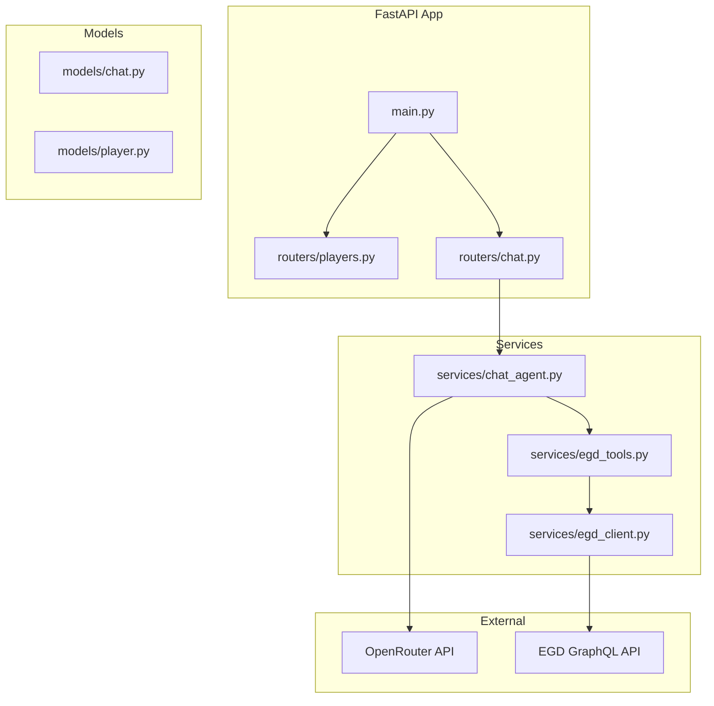
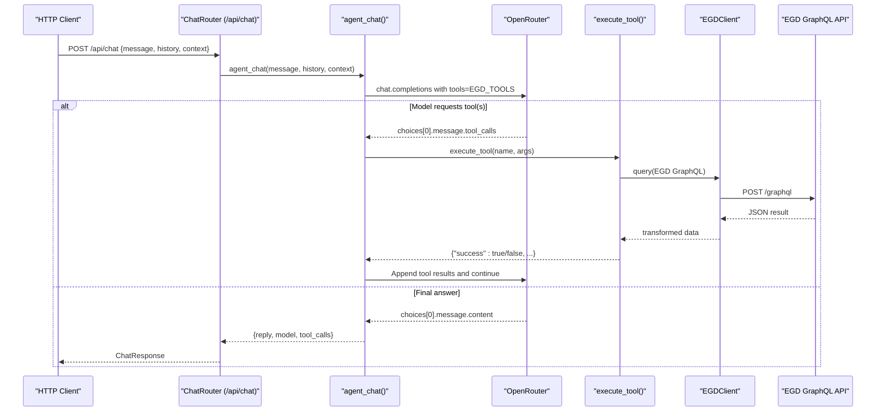
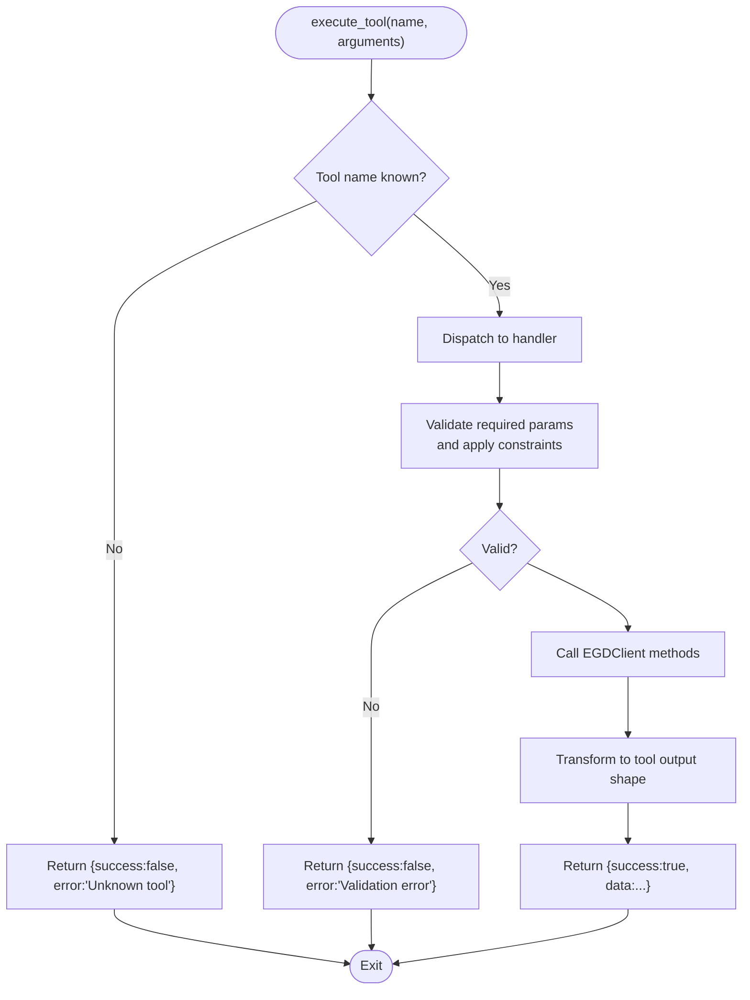
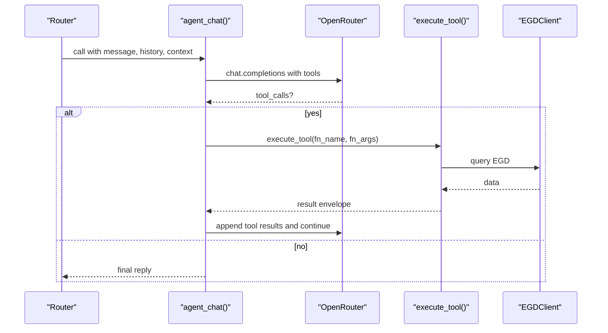
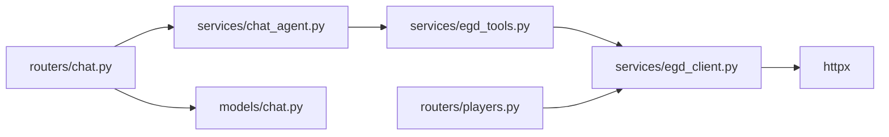

# Tool Execution Framework

<cite>
**Referenced Files in This Document**
- [egd_tools.py](file://backend/app/services/egd_tools.py)
- [chat_agent.py](file://backend/app/services/chat_agent.py)
- [egd_client.py](file://backend/app/services/egd_client.py)
- [player.py](file://backend/app/models/player.py)
- [chat.py](file://backend/app/models/chat.py)
- [players.py](file://backend/app/routers/players.py)
- [chat.py](file://backend/app/routers/chat.py)
- [main.py](file://backend/app/main.py)
- [EGD_API.md](file://docs/EGD_API.md)
- [requirements.txt](file://backend/requirements.txt)
</cite>

## Table of Contents
1. [Introduction](#introduction)
2. [Project Structure](#project-structure)
3. [Core Components](#core-components)
4. [Architecture Overview](#architecture-overview)
5. [Detailed Component Analysis](#detailed-component-analysis)
6. [Dependency Analysis](#dependency-analysis)
7. [Performance Considerations](#performance-considerations)
8. [Security and Rate Limiting](#security-and-rate-limiting)
9. [Troubleshooting Guide](#troubleshooting-guide)
10. [Conclusion](#conclusion)
11. [Appendices](#appendices)

## Introduction
This document describes the dynamic tool execution framework that powers agentic chat with function calling. It explains how tools are registered, how their schemas are defined, how parameters are validated and coerced, and how results are serialized back to the LLM. It also catalogs all available EGD tools for player search, profile retrieval, game analysis, and tournament statistics, and provides guidance on adding new tools, customizing existing ones, implementing complex data transformations, and addressing security, rate limiting, and performance concerns.

## Project Structure
The backend is a FastAPI application that:
- Exposes REST endpoints for players and an agentic chat endpoint.
- Integrates with OpenRouter for model inference and function/tool calling.
- Implements a tool registry and executor that maps LLM tool calls to Python functions.
- Wraps the European Go Database (EGD) GraphQL API via an HTTP client with caching.

**Diagram sources**
- [main.py:14-31](file://backend/app/main.py#L14-L31)
- [chat.py:1-95](file://backend/app/routers/chat.py#L1-L95)
- [chat_agent.py:30-154](file://backend/app/services/chat_agent.py#L30-L154)
- [egd_tools.py:102-212](file://backend/app/services/egd_tools.py#L102-L212)
- [egd_client.py:11-197](file://backend/app/services/egd_client.py#L11-L197)

**Section sources**
- [main.py:14-31](file://backend/app/main.py#L14-L31)
- [chat.py:1-95](file://backend/app/routers/chat.py#L1-L95)
- [chat_agent.py:30-154](file://backend/app/services/chat_agent.py#L30-L154)
- [egd_tools.py:102-212](file://backend/app/services/egd_tools.py#L102-L212)
- [egd_client.py:11-197](file://backend/app/services/egd_client.py#L11-L197)

## Core Components
- Tool Registry and Schema: A list of OpenAI-compatible tool definitions describing available functions and parameter schemas.
- Tool Executor: A dispatcher that receives a tool name and arguments, validates inputs, executes the corresponding logic, and returns a standardized result envelope.
- Agentic Chat Loop: Orchestrates conversation with the LLM, detects tool call requests, invokes the executor, feeds results back, and loops until a final text response is produced.
- EGD Client: An async HTTP client that queries the EGD GraphQL API with built-in request/response caching.

Key responsibilities:
- Tool registration: Declarative schema definitions for each tool.
- Parameter validation/coercion: JSON argument parsing and type enforcement by the LLM provider; additional server-side checks where needed.
- Error handling: Consistent success/error envelopes returned to the LLM.
- Result serialization: Structured dicts converted to JSON strings for tool responses.

**Section sources**
- [egd_tools.py:5-99](file://backend/app/services/egd_tools.py#L5-L99)
- [egd_tools.py:102-212](file://backend/app/services/egd_tools.py#L102-L212)
- [chat_agent.py:30-154](file://backend/app/services/chat_agent.py#L30-L154)
- [egd_client.py:11-197](file://backend/app/services/egd_client.py#L11-L197)

## Architecture Overview
The agentic flow uses OpenRouter’s function/tool calling protocol. The chat agent sends messages along with tool schemas. If the model decides to call a tool, it returns structured tool_calls. The agent parses arguments, executes the tool via the executor, appends tool results as “tool” role messages, and continues until the model produces a final answer.

**Diagram sources**
- [chat.py:1-95](file://backend/app/routers/chat.py#L1-L95)
- [chat_agent.py:30-154](file://backend/app/services/chat_agent.py#L30-L154)
- [egd_tools.py:102-212](file://backend/app/services/egd_tools.py#L102-L212)
- [egd_client.py:21-42](file://backend/app/services/egd_client.py#L21-L42)

## Detailed Component Analysis

### Tool Registration and Schema Definitions
Tools are declared as OpenAI-compatible function schemas. Each entry includes:
- type: "function"
- function.name: unique identifier used by the LLM
- function.description: human-readable purpose
- function.parameters: JSON Schema object defining required and optional fields, types, and descriptions

Available tools:
- search_player: Search for players by name or PIN. Parameters: query (string).
- get_player_details: Get detailed profile by PIN. Parameters: pin (integer).
- get_player_rating_history: Get rating evolution over time by PIN. Parameters: pin (integer).
- get_player_games: Get recent games by PIN with optional limit. Parameters: pin (integer), limit (integer, default 20, max 200).
- compare_players: Compare two players by PINs. Parameters: pin1 (integer), pin2 (integer).

These schemas guide the LLM in constructing valid tool_calls and ensure consistent parameter names and types.

**Section sources**
- [egd_tools.py:5-99](file://backend/app/services/egd_tools.py#L5-L99)

### Tool Executor and Invocation Flow
The executor maps tool names to implementations:
- Validates presence of required arguments.
- Performs optional constraints (e.g., limit clamping).
- Calls EGD client methods to fetch data.
- Transforms raw API responses into concise structures suitable for LLM consumption.
- Returns a uniform envelope: {"success": True/False, "data": ..., "error": ...}.

Error propagation:
- Missing or invalid arguments produce error envelopes.
- External errors are caught and wrapped in error envelopes.
- Unknown tool names return an error envelope.

Type coercion:
- Arguments are parsed from JSON strings provided by the LLM.
- Types are enforced by JSON Schema; integer fields must be integers.
- Optional numeric fields have defaults and bounds applied server-side.

Result serialization:
- All tool results are plain dicts, later serialized to JSON strings when appended as tool messages.

**Diagram sources**
- [egd_tools.py:102-212](file://backend/app/services/egd_tools.py#L102-L212)

**Section sources**
- [egd_tools.py:102-212](file://backend/app/services/egd_tools.py#L102-L212)

### Agentic Chat Loop and Function Calling
The chat loop:
- Builds a message array including system prompt, optional context, and recent history.
- Sends a request to OpenRouter with tools attached.
- If tool_calls are present:
  - Parses arguments from JSON string.
  - Executes each tool via the executor.
  - Appends assistant message with tool_calls and tool results as separate messages.
  - Continues the loop up to a maximum number of iterations.
- If no tool_calls, returns the final text reply.

Environment configuration:
- OPENROUTER_API_KEY: Required for chat functionality.
- CHAT_MODEL: Defaults to a specified model if not set.
- CHAT_MAX_ITERATIONS: Limits tool-calling loops.

**Diagram sources**
- [chat_agent.py:30-154](file://backend/app/services/chat_agent.py#L30-L154)
- [egd_tools.py:102-212](file://backend/app/services/egd_tools.py#L102-L212)
- [egd_client.py:21-42](file://backend/app/services/egd_client.py#L21-L42)

**Section sources**
- [chat_agent.py:30-154](file://backend/app/services/chat_agent.py#L30-L154)

### EGD Client and Data Access Layer
The EGD client:
- Provides typed methods for searching players, retrieving player details, fetching games, and extracting tournaments.
- Uses a shared cache keyed by query and variables with a TTL to reduce external calls.
- Raises exceptions on GraphQL errors and network failures.

Data transformation examples:
- Player details include extracted rating history derived from placements.
- Tournament lists deduplicate by code and sort by date.

**Section sources**
- [egd_client.py:11-197](file://backend/app/services/egd_client.py#L11-L197)
- [EGD_API.md:1-274](file://docs/EGD_API.md#L1-L274)

### Models and Contracts
Pydantic models define request/response contracts for chat and player data. While tools operate on plain dicts, these models standardize API boundaries and provide validation at the router layer.

- ChatRequest/ChatResponse: Define message, optional context, history, and response fields.
- Player models: Represent summaries, details, placements, and search responses.

**Section sources**
- [chat.py:1-21](file://backend/app/models/chat.py#L1-L21)
- [player.py:1-60](file://backend/app/models/player.py#L1-L60)

### API Endpoints and Integration Points
- GET /api/search: Search players by name or PIN.
- GET /api/player/{pin}: Get player details with rating history.
- GET /api/player/{pin}/games: Paginated game history.
- GET /api/player/{pin}/tournaments: Tournament history.
- POST /api/chat: Agentic chat with tool calling.

These endpoints integrate with the EGD client and, for chat, the agentic loop.

**Section sources**
- [players.py:8-106](file://backend/app/routers/players.py#L8-L106)
- [chat.py:1-95](file://backend/app/routers/chat.py#L1-L95)
- [main.py:29-31](file://backend/app/main.py#L29-L31)

## Dependency Analysis
High-level dependencies:
- ChatRouter depends on ChatAgent.
- ChatAgent depends on Tool Registry and Executor.
- Executor depends on EGDClient.
- EGDClient depends on httpx and environment variables.

**Diagram sources**
- [chat.py:1-95](file://backend/app/routers/chat.py#L1-L95)
- [chat_agent.py:30-154](file://backend/app/services/chat_agent.py#L30-L154)
- [egd_tools.py:102-212](file://backend/app/services/egd_tools.py#L102-L212)
- [egd_client.py:11-197](file://backend/app/services/egd_client.py#L11-L197)
- [players.py:8-106](file://backend/app/routers/players.py#L8-L106)

**Section sources**
- [chat.py:1-95](file://backend/app/routers/chat.py#L1-L95)
- [chat_agent.py:30-154](file://backend/app/services/chat_agent.py#L30-L154)
- [egd_tools.py:102-212](file://backend/app/services/egd_tools.py#L102-L212)
- [egd_client.py:11-197](file://backend/app/services/egd_client.py#L11-L197)
- [players.py:8-106](file://backend/app/routers/players.py#L8-L106)

## Performance Considerations
- Caching: EGDClient caches GraphQL responses by query and variables with a TTL to reduce latency and external load.
- Pagination limits: Tools enforce upper bounds (e.g., limit capped at 200) to prevent large payloads.
- Iteration limits: The chat loop caps tool-calling iterations to avoid runaway loops.
- Async I/O: All HTTP interactions are asynchronous to improve throughput.

Recommendations:
- Tune cache TTL based on data freshness requirements.
- Add per-tool metrics and timeouts.
- Consider result memoization for repeated identical tool calls within a session.

[No sources needed since this section provides general guidance]

## Security and Rate Limiting
Security considerations:
- Secrets management: API keys and tokens are loaded from environment variables. Ensure .env is excluded from version control and restrict access.
- Input validation: Use JSON Schema in tool definitions to constrain inputs. Enforce server-side checks for numeric ranges and required fields.
- Output sanitization: Avoid leaking internal stack traces; wrap errors in safe envelopes.

Rate limiting:
- Implement server-side rate limiting for both REST endpoints and the chat endpoint.
- Apply per-user quotas and throttling for OpenRouter calls.
- Consider token-based rate limiting for EGD GraphQL API usage.

Operational hardening:
- Configure timeouts for all HTTP clients.
- Add retries with exponential backoff for transient failures.
- Log tool invocations and outcomes without sensitive data.

[No sources needed since this section provides general guidance]

## Troubleshooting Guide
Common issues and resolutions:
- Missing API key: Chat returns a configured message when OPENROUTER_API_KEY is absent. Verify environment setup.
- Invalid tool arguments: Ensure arguments match JSON Schema types and required fields. The executor returns error envelopes for missing or invalid parameters.
- Unknown tool name: The executor returns an error for unrecognized tool names. Confirm tool registration and spelling.
- EGD API errors: The client raises exceptions on GraphQL errors; these propagate to the executor and are wrapped in error envelopes.
- Timeouts: Increase client timeouts or adjust MAX_ITERATIONS if responses are slow.

Diagnostic tips:
- Inspect tool_calls_log in chat responses to trace which tools were invoked.
- Review cached keys and TTL behavior in the EGD client.
- Validate JSON payloads sent to OpenRouter and received from EGD.

**Section sources**
- [chat_agent.py:42-48](file://backend/app/services/chat_agent.py#L42-L48)
- [chat_agent.py:100-118](file://backend/app/services/chat_agent.py#L100-L118)
- [egd_tools.py:207-212](file://backend/app/services/egd_tools.py#L207-L212)
- [egd_client.py:38-42](file://backend/app/services/egd_client.py#L38-L42)

## Conclusion
The dynamic tool execution framework integrates LLM function calling with robust server-side orchestration. Tools are declaratively registered with clear schemas, executed through a centralized dispatcher, and return standardized envelopes. The agentic chat loop coordinates multi-step reasoning with external data sources while maintaining safety via iteration limits and error wrapping. With proper security controls, rate limiting, and performance tuning, the system scales effectively for real-world usage.

[No sources needed since this section summarizes without analyzing specific files]

## Appendices

### Adding a New Tool
Steps:
1. Define a new tool entry in the tool registry with name, description, and JSON Schema parameters.
2. Implement the handler in the executor:
   - Validate required parameters.
   - Call appropriate EGD client methods.
   - Transform data into a concise structure.
   - Return a success envelope with data.
3. Test via the chat endpoint by prompting the model to use the new tool.

Example references:
- Tool definition pattern: see existing entries.
- Executor dispatch pattern: see handler branches.

**Section sources**
- [egd_tools.py:5-99](file://backend/app/services/egd_tools.py#L5-L99)
- [egd_tools.py:102-212](file://backend/app/services/egd_tools.py#L102-L212)

### Customizing Existing Tools
Guidance:
- Adjust parameter constraints (e.g., increase limit bounds).
- Enhance data transformation to include additional fields.
- Introduce optional filters or sorting options.

References:
- Limit clamping and defaults: see game retrieval handler.
- Rating history extraction: see detail and rating history handlers.

**Section sources**
- [egd_tools.py:170-174](file://backend/app/services/egd_tools.py#L170-L174)
- [egd_tools.py:114-148](file://backend/app/services/egd_tools.py#L114-L148)
- [egd_tools.py:150-168](file://backend/app/services/egd_tools.py#L150-L168)

### Implementing Complex Data Transformations
Approach:
- Fetch raw data via EGD client.
- Aggregate and compute derived metrics (e.g., win rates, rating deltas).
- Sort and paginate results before returning.
- Keep payloads concise for LLM readability.

References:
- Tournament deduplication and sorting.
- Rating history construction and ordering.

**Section sources**
- [egd_client.py:152-177](file://backend/app/services/egd_client.py#L152-L177)
- [egd_tools.py:114-148](file://backend/app/services/egd_tools.py#L114-L148)

### Tool Interface Contract
Contract summary:
- Input: tool name (string) and arguments (dict).
- Output: dict with fields:
  - success: boolean
  - data: any serializable payload on success
  - error: string on failure
- Errors:
  - Unknown tool name
  - Missing/invalid parameters
  - External service errors

**Section sources**
- [egd_tools.py:102-212](file://backend/app/services/egd_tools.py#L102-L212)

### Return Value Formatting and Error Propagation
Formatting:
- Success: {"success": True, "data": <payload>}
- Failure: {"success": False, "error": "<message>"}

Propagation:
- Exceptions raised by EGD client are caught and converted to error envelopes.
- Chat loop serializes tool results to JSON strings and appends them as tool messages.

**Section sources**
- [egd_tools.py:207-212](file://backend/app/services/egd_tools.py#L207-L212)
- [chat_agent.py:110-118](file://backend/app/services/chat_agent.py#L110-L118)

### Available EGD Tools Summary
- search_player(query): Search players by name or PIN.
- get_player_details(pin): Retrieve full profile and rating history.
- get_player_rating_history(pin): Extract rating evolution timeline.
- get_player_games(pin, limit): Recent games with opponents and tournament info.
- compare_players(pin1, pin2): Side-by-side stats for two players.

**Section sources**
- [egd_tools.py:5-99](file://backend/app/services/egd_tools.py#L5-L99)

### Environment Variables and Configuration
- OPENROUTER_API_KEY: Required for chat.
- CHAT_MODEL: Default model selection.
- CHAT_MAX_ITERATIONS: Max tool-calling iterations.
- EGD_API_TOKEN: Bearer token for EGD GraphQL API.

**Section sources**
- [chat_agent.py:42-48](file://backend/app/services/chat_agent.py#L42-L48)
- [chat_agent.py:9-11](file://backend/app/services/chat_agent.py#L9-L11)
- [egd_client.py:13-17](file://backend/app/services/egd_client.py#L13-L17)

### Dependencies
Runtime dependencies include FastAPI, Uvicorn, httpx, python-dotenv, and Pydantic.

**Section sources**
- [requirements.txt:1-6](file://backend/requirements.txt#L1-L6)