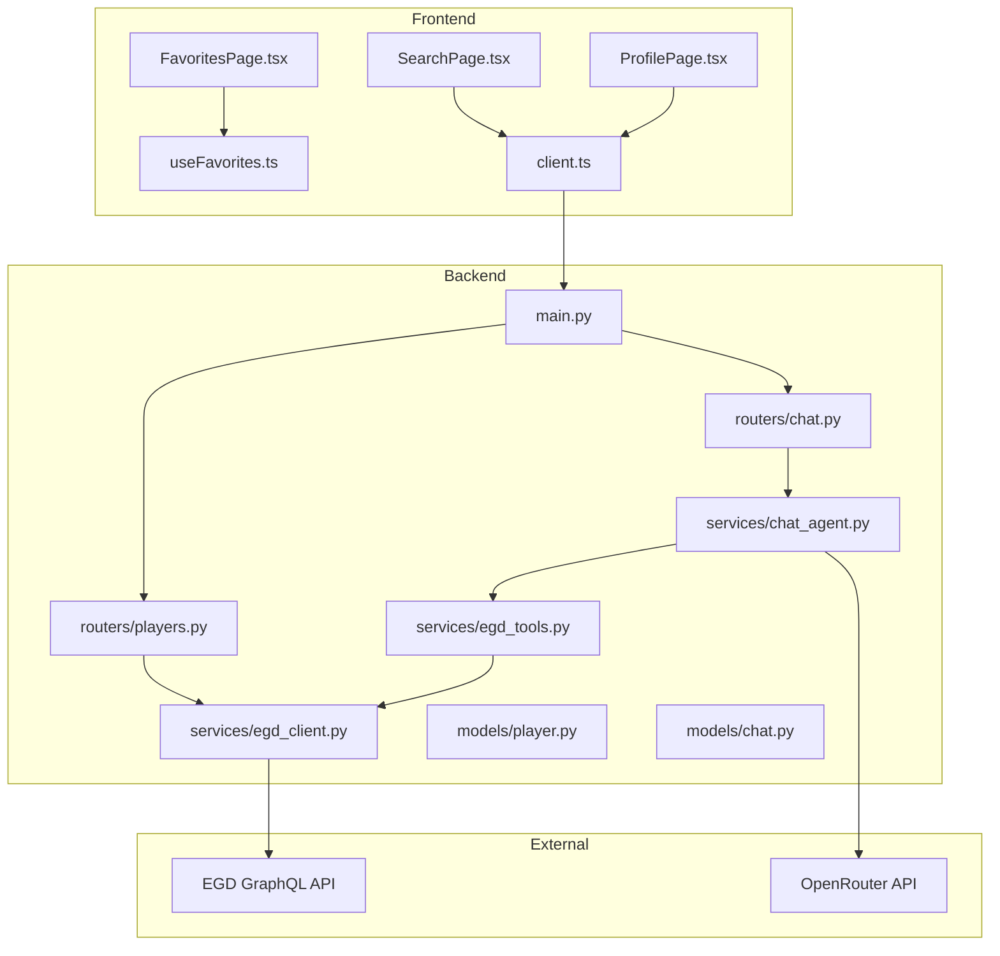
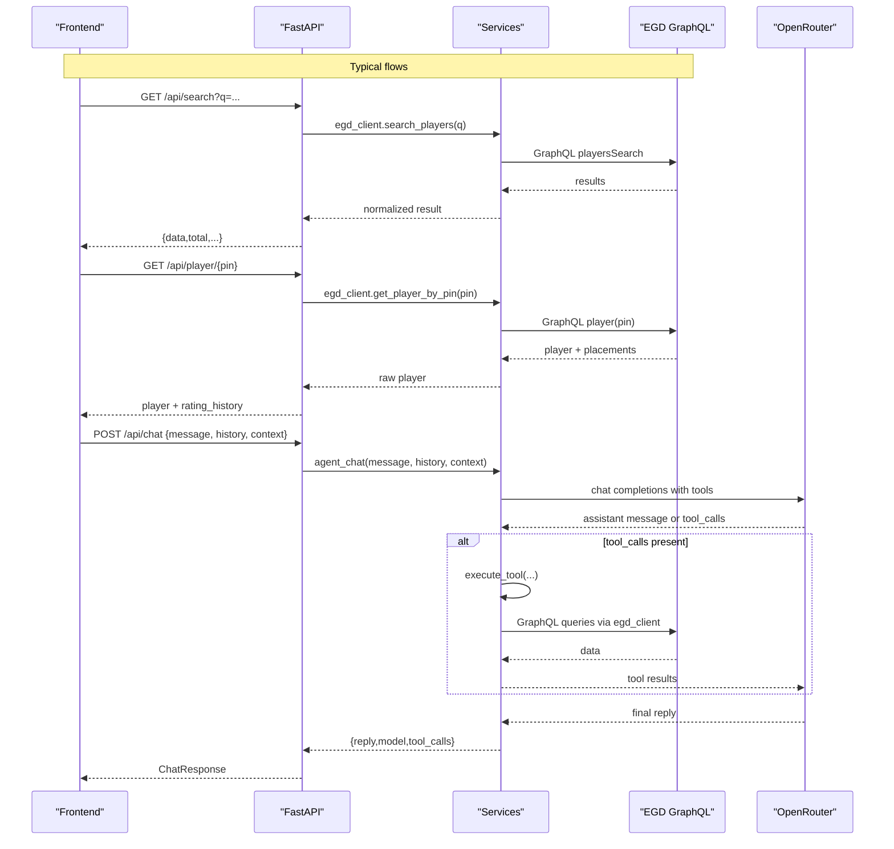
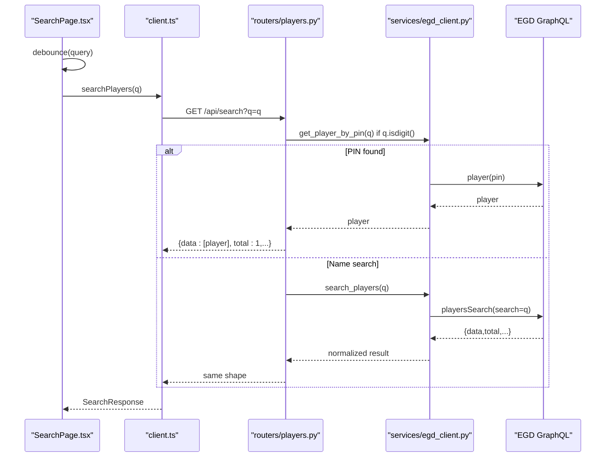
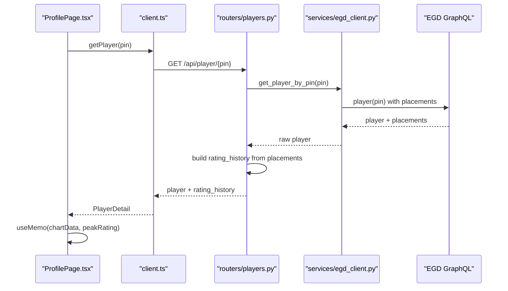
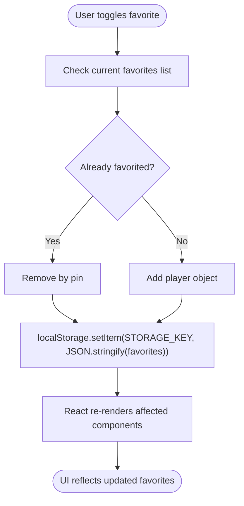
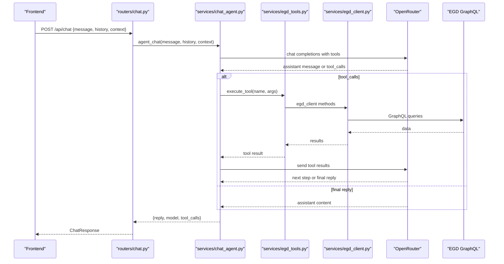
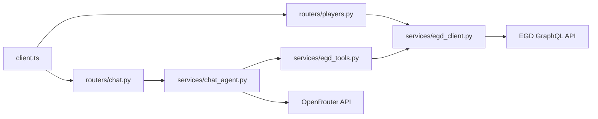

# Data Flow Design

<cite>
**Referenced Files in This Document**
- [main.py](file://backend/app/main.py)
- [players.py](file://backend/app/routers/players.py)
- [chat.py](file://backend/app/routers/chat.py)
- [egd_client.py](file://backend/app/services/egd_client.py)
- [chat_agent.py](file://backend/app/services/chat_agent.py)
- [egd_tools.py](file://backend/app/services/egd_tools.py)
- [player.py](file://backend/app/models/player.py)
- [chat.py](file://backend/app/models/chat.py)
- [client.ts](file://frontend/src/api/client.ts)
- [useFavorites.ts](file://frontend/src/hooks/useFavorites.ts)
- [SearchPage.tsx](file://frontend/src/pages/SearchPage.tsx)
- [ProfilePage.tsx](file://frontend/src/pages/ProfilePage.tsx)
- [FavoritesPage.tsx](file://frontend/src/pages/FavoritesPage.tsx)
</cite>

## Table of Contents
1. [Introduction](#introduction)
2. [Project Structure](#project-structure)
3. [Core Components](#core-components)
4. [Architecture Overview](#architecture-overview)
5. [Detailed Component Analysis](#detailed-component-analysis)
6. [Dependency Analysis](#dependency-analysis)
7. [Performance Considerations](#performance-considerations)
8. [Troubleshooting Guide](#troubleshooting-guide)
9. [Conclusion](#conclusion)

## Introduction
This document describes the end-to-end data flow design across the GoNow system, covering:
- Player search flows
- Profile data retrieval and rating evolution visualization
- Favorites management with client-side persistence
- Chat message processing with agentic tool calling
It also explains caching strategies at different layers, data transformation patterns, error handling, and includes sequence diagrams for typical request-response cycles and state synchronization.

## Project Structure
The system is a full-stack application:
- Frontend (React + TypeScript): pages, hooks, API client
- Backend (FastAPI): routers, services, models
- External APIs: EGD GraphQL API and OpenRouter LLM

**Diagram sources**
- [main.py:14-31](file://backend/app/main.py#L14-L31)
- [players.py:8-40](file://backend/app/routers/players.py#L8-L40)
- [chat.py:9-24](file://backend/app/routers/chat.py#L9-L24)
- [egd_client.py:11-42](file://backend/app/services/egd_client.py#L11-L42)
- [chat_agent.py:30-67](file://backend/app/services/chat_agent.py#L30-L67)
- [egd_tools.py:102-112](file://backend/app/services/egd_tools.py#L102-L112)
- [client.ts:59-85](file://frontend/src/api/client.ts#L59-L85)
- [SearchPage.tsx:18-23](file://frontend/src/pages/SearchPage.tsx#L18-L23)
- [ProfilePage.tsx:16-20](file://frontend/src/pages/ProfilePage.tsx#L16-L20)
- [FavoritesPage.tsx:4-6](file://frontend/src/pages/FavoritesPage.tsx#L4-L6)
- [useFavorites.ts:6-18](file://frontend/src/hooks/useFavorites.ts#L6-L18)

**Section sources**
- [main.py:14-31](file://backend/app/main.py#L14-L31)
- [client.ts:1-86](file://frontend/src/api/client.ts#L1-L86)

## Core Components
- FastAPI application entrypoint mounts routers and configures CORS.
- Players router exposes endpoints for search and player details.
- Chat router delegates to an agentic chat service that can call tools.
- EGD client performs GraphQL queries against the European Go Database with in-memory caching.
- Chat agent orchestrates tool-calling loops with OpenRouter.
- Frontend API client wraps HTTP calls and defines typed interfaces.
- useFavorites hook persists favorites in localStorage.

Key responsibilities:
- Routers: route requests, transform responses, handle errors.
- Services: external API integration, business logic, tool execution.
- Models: Pydantic schemas for validation and documentation.
- Frontend: UI orchestration, query caching via React Query, local state for favorites.

**Section sources**
- [main.py:14-31](file://backend/app/main.py#L14-L31)
- [players.py:8-106](file://backend/app/routers/players.py#L8-L106)
- [chat.py:9-24](file://backend/app/routers/chat.py#L9-L24)
- [egd_client.py:11-42](file://backend/app/services/egd_client.py#L11-L42)
- [chat_agent.py:30-67](file://backend/app/services/chat_agent.py#L30-L67)
- [client.ts:59-85](file://frontend/src/api/client.ts#L59-L85)
- [useFavorites.ts:6-48](file://frontend/src/hooks/useFavorites.ts#L6-L48)

## Architecture Overview
High-level request-response paths:
- Search: Frontend → /api/search → EGD playersSearch → cached response
- Profile: Frontend → /api/player/{pin} → EGD player(pin) with placements → transformed profile
- Favorites: LocalStorage-based state; no backend persistence
- Chat: Frontend → /api/chat → Chat Agent → OpenRouter → optional tool calls → EGD via tools → final answer

**Diagram sources**
- [players.py:8-40](file://backend/app/routers/players.py#L8-L40)
- [players.py:43-80](file://backend/app/routers/players.py#L43-L80)
- [chat.py:9-24](file://backend/app/routers/chat.py#L9-L24)
- [chat_agent.py:30-126](file://backend/app/services/chat_agent.py#L30-L126)
- [egd_client.py:44-70](file://backend/app/services/egd_client.py#L44-L70)
- [egd_client.py:72-118](file://backend/app/services/egd_client.py#L72-L118)
- [client.ts:59-85](file://frontend/src/api/client.ts#L59-L85)

## Detailed Component Analysis

### Player Search Flow
- Frontend debounces input and uses React Query to cache results with staleTime.
- Axios client calls /api/search?q=...
- Router attempts direct PIN lookup if numeric; otherwise falls back to name search.
- EGD client executes GraphQL query with in-memory TTL cache.
- Response is normalized into a consistent shape for the frontend.

**Diagram sources**
- [SearchPage.tsx:18-23](file://frontend/src/pages/SearchPage.tsx#L18-L23)
- [client.ts:59-62](file://frontend/src/api/client.ts#L59-L62)
- [players.py:8-40](file://backend/app/routers/players.py#L8-L40)
- [egd_client.py:44-70](file://backend/app/services/egd_client.py#L44-L70)
- [egd_client.py:72-118](file://backend/app/services/egd_client.py#L72-L118)

**Section sources**
- [SearchPage.tsx:18-23](file://frontend/src/pages/SearchPage.tsx#L18-L23)
- [client.ts:59-62](file://frontend/src/api/client.ts#L59-L62)
- [players.py:8-40](file://backend/app/routers/players.py#L8-L40)
- [egd_client.py:44-70](file://backend/app/services/egd_client.py#L44-L70)

### Profile Data Retrieval and Rating Evolution
- Frontend fetches player detail by pin using React Query.
- Backend extracts rating history from placements and sorts by date.
- Frontend transforms data for charting and displays summary statistics.

**Diagram sources**
- [ProfilePage.tsx:16-20](file://frontend/src/pages/ProfilePage.tsx#L16-L20)
- [client.ts:64-67](file://frontend/src/api/client.ts#L64-L67)
- [players.py:43-80](file://backend/app/routers/players.py#L43-L80)
- [egd_client.py:72-118](file://backend/app/services/egd_client.py#L72-L118)

**Section sources**
- [ProfilePage.tsx:44-58](file://frontend/src/pages/ProfilePage.tsx#L44-L58)
- [players.py:51-76](file://backend/app/routers/players.py#L51-L76)
- [egd_client.py:72-118](file://backend/app/services/egd_client.py#L72-L118)

### Favorites Management (Client-Side State Synchronization)
- useFavorites initializes state from localStorage and persists changes automatically.
- Search and Profile pages toggle favorites; FavoritesPage lists them.
- No server round-trip; state is synchronized within the browser session.

**Diagram sources**
- [useFavorites.ts:6-18](file://frontend/src/hooks/useFavorites.ts#L6-L18)
- [useFavorites.ts:20-45](file://frontend/src/hooks/useFavorites.ts#L20-L45)
- [SearchPage.tsx:109-115](file://frontend/src/pages/SearchPage.tsx#L109-L115)
- [ProfilePage.tsx:93-96](file://frontend/src/pages/ProfilePage.tsx#L93-L96)
- [FavoritesPage.tsx:4-6](file://frontend/src/pages/FavoritesPage.tsx#L4-L6)

**Section sources**
- [useFavorites.ts:6-48](file://frontend/src/hooks/useFavorites.ts#L6-L48)
- [SearchPage.tsx:109-115](file://frontend/src/pages/SearchPage.tsx#L109-L115)
- [ProfilePage.tsx:93-96](file://frontend/src/pages/ProfilePage.tsx#L93-L96)
- [FavoritesPage.tsx:4-6](file://frontend/src/pages/FavoritesPage.tsx#L4-L6)

### Chat Message Processing (Agentic Tool Calling)
- Frontend posts messages with optional context and history.
- Chat router invokes agent_chat which builds a conversation and sends it to OpenRouter with tool schemas.
- If the model returns tool_calls, the agent executes corresponding tools via egd_tools.execute_tool, feeding results back to the model until a final text reply is produced.

**Diagram sources**
- [chat.py:9-24](file://backend/app/routers/chat.py#L9-L24)
- [chat_agent.py:30-126](file://backend/app/services/chat_agent.py#L30-L126)
- [egd_tools.py:102-112](file://backend/app/services/egd_tools.py#L102-L112)
- [egd_client.py:44-70](file://backend/app/services/egd_client.py#L44-L70)
- [client.ts:74-85](file://frontend/src/api/client.ts#L74-L85)

**Section sources**
- [chat.py:9-24](file://backend/app/routers/chat.py#L9-L24)
- [chat_agent.py:30-126](file://backend/app/services/chat_agent.py#L30-L126)
- [egd_tools.py:102-212](file://backend/app/services/egd_tools.py#L102-L212)

## Dependency Analysis
- Frontend depends on backend REST endpoints defined by routers.
- Backend routers depend on services for external API access.
- EGD client encapsulates all GraphQL interactions and provides caching.
- Chat agent depends on tool definitions and executor to bridge LLM tool calls to backend services.

**Diagram sources**
- [client.ts:59-85](file://frontend/src/api/client.ts#L59-L85)
- [players.py:8-40](file://backend/app/routers/players.py#L8-L40)
- [chat.py:9-24](file://backend/app/routers/chat.py#L9-L24)
- [chat_agent.py:30-67](file://backend/app/services/chat_agent.py#L30-L67)
- [egd_tools.py:102-112](file://backend/app/services/egd_tools.py#L102-L112)
- [egd_client.py:11-42](file://backend/app/services/egd_client.py#L11-L42)

**Section sources**
- [client.ts:59-85](file://frontend/src/api/client.ts#L59-L85)
- [players.py:8-40](file://backend/app/routers/players.py#L8-L40)
- [chat.py:9-24](file://backend/app/routers/chat.py#L9-L24)
- [chat_agent.py:30-67](file://backend/app/services/chat_agent.py#L30-L67)
- [egd_tools.py:102-112](file://backend/app/services/egd_tools.py#L102-L112)
- [egd_client.py:11-42](file://backend/app/services/egd_client.py#L11-L42)

## Performance Considerations
- In-memory caching in EGD client reduces repeated GraphQL calls with a configurable TTL.
- Frontend uses React Query with staleTime to avoid unnecessary refetches.
- Debounced search input minimizes network requests during typing.
- Agentic chat limits iterations and truncates conversation history to control latency and token usage.

[No sources needed since this section provides general guidance]

## Troubleshooting Guide
Common issues and where they are handled:
- Network or upstream errors:
  - EGD client raises errors when GraphQL responses contain errors or HTTP failures.
  - Routers wrap exceptions in HTTPException with status 500.
- Missing configuration:
  - Chat routes return a friendly message when OPENROUTER_API_KEY is not set.
- Not found cases:
  - Player detail endpoint returns 404 when player is missing.
- Client-side states:
  - Frontend shows loading and error states for queries and handles empty results gracefully.

Operational checks:
- Health endpoint available at /health.
- API docs served at /docs.

**Section sources**
- [egd_client.py:33-42](file://backend/app/services/egd_client.py#L33-L42)
- [players.py:43-80](file://backend/app/routers/players.py#L43-L80)
- [chat.py:47-94](file://backend/app/routers/chat.py#L47-94)
- [main.py:34-41](file://backend/app/main.py#L34-L41)
- [SearchPage.tsx:70-81](file://frontend/src/pages/SearchPage.tsx#L70-L81)
- [ProfilePage.tsx:22-42](file://frontend/src/pages/ProfilePage.tsx#L22-L42)

## Conclusion
GoNow implements a clear separation of concerns:
- Frontend focuses on UX, query caching, and local state for favorites.
- Backend provides thin routing and robust service layer integration with EGD and OpenRouter.
- Caching and transformations occur at appropriate layers to balance performance and correctness.
- The agentic chat loop enables dynamic tool usage while keeping the system secure through predefined tool schemas.

[No sources needed since this section summarizes without analyzing specific files]