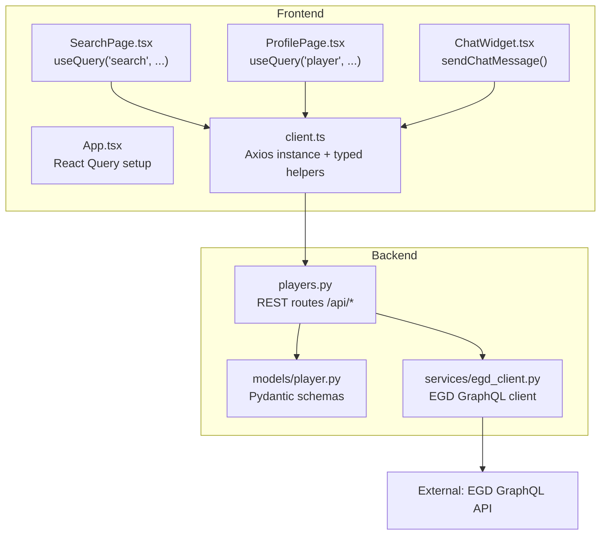
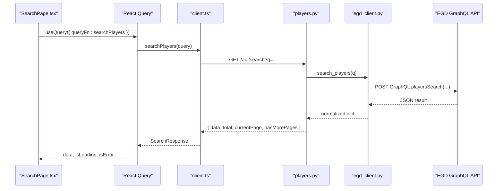
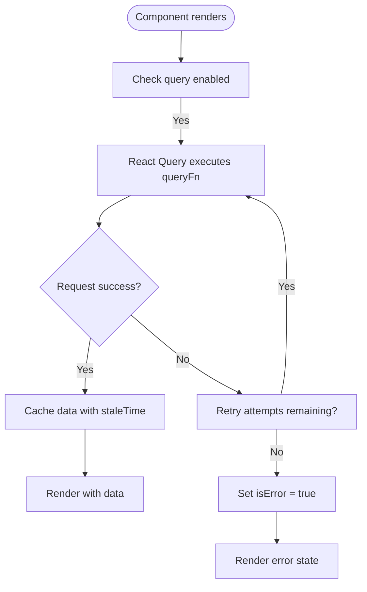
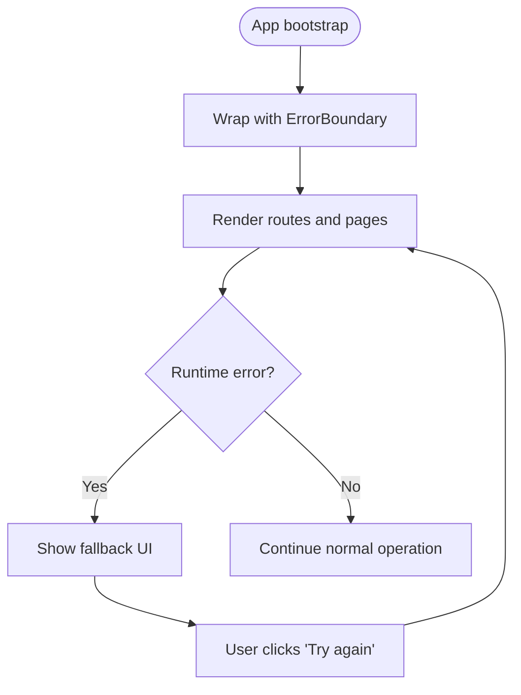
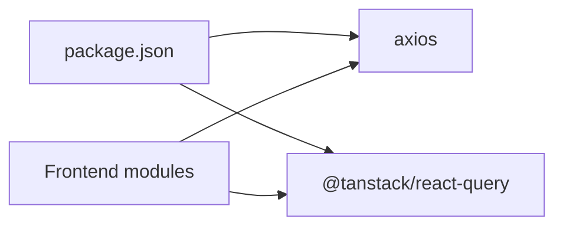

# API Integration

<cite>
**Referenced Files in This Document**
- [client.ts](file://frontend/src/api/client.ts)
- [App.tsx](file://frontend/src/App.tsx)
- [SearchPage.tsx](file://frontend/src/pages/SearchPage.tsx)
- [ProfilePage.tsx](file://frontend/src/pages/ProfilePage.tsx)
- [ChatWidget.tsx](file://frontend/src/components/ChatWidget.tsx)
- [package.json](file://frontend/package.json)
- [players.py](file://backend/app/routers/players.py)
- [player.py](file://backend/app/models/player.py)
- [egd_client.py](file://backend/app/services/egd_client.py)
- [EGD_API.md](file://docs/EGD_API.md)
</cite>

## Table of Contents
1. [Introduction](#introduction)
2. [Project Structure](#project-structure)
3. [Core Components](#core-components)
4. [Architecture Overview](#architecture-overview)
5. [Detailed Component Analysis](#detailed-component-analysis)
6. [Dependency Analysis](#dependency-analysis)
7. [Performance Considerations](#performance-considerations)
8. [Troubleshooting Guide](#troubleshooting-guide)
9. [Conclusion](#conclusion)

## Introduction
This document explains the frontend API integration for the GoNow application, focusing on the Axios client configuration, HTTP request patterns, TypeScript type definitions for API responses, and how React components consume these APIs. It also covers error handling strategies, retry logic configuration via React Query, and provides examples of GET requests for player data. Where applicable, it maps to backend endpoints and models to clarify end-to-end data flows.

## Project Structure
The API integration spans a thin frontend HTTP layer (Axios + React Query), typed response interfaces, and UI components that call the backend REST endpoints. The backend exposes routes that transform external GraphQL data into REST responses consumed by the frontend.

**Diagram sources**
- [client.ts:1-86](file://frontend/src/api/client.ts#L1-L86)
- [App.tsx:9-16](file://frontend/src/App.tsx#L9-L16)
- [SearchPage.tsx:18-23](file://frontend/src/pages/SearchPage.tsx#L18-L23)
- [ProfilePage.tsx:16-20](file://frontend/src/pages/ProfilePage.tsx#L16-L20)
- [ChatWidget.tsx:24-36](file://frontend/src/components/ChatWidget.tsx#L24-L36)
- [players.py:8-106](file://backend/app/routers/players.py#L8-L106)
- [player.py:6-60](file://backend/app/models/player.py#L6-L60)
- [egd_client.py:11-42](file://backend/app/services/egd_client.py#L11-L42)

**Section sources**
- [client.ts:1-86](file://frontend/src/api/client.ts#L1-L86)
- [App.tsx:9-16](file://frontend/src/App.tsx#L9-L16)
- [SearchPage.tsx:18-23](file://frontend/src/pages/SearchPage.tsx#L18-L23)
- [ProfilePage.tsx:16-20](file://frontend/src/pages/ProfilePage.tsx#L16-L20)
- [ChatWidget.tsx:24-36](file://frontend/src/components/ChatWidget.tsx#L24-L36)
- [players.py:8-106](file://backend/app/routers/players.py#L8-L106)
- [player.py:6-60](file://backend/app/models/player.py#L6-L60)
- [egd_client.py:11-42](file://backend/app/services/egd_client.py#L11-L42)

## Core Components
- Axios client configuration:
  - A single Axios instance is created with a base URL pointing to the local backend API.
  - No interceptors are configured at this time; all request/response transformations occur in the backend or are handled per-call in components.
- Typed API helpers:
  - Functions encapsulate HTTP calls and return strongly-typed results using exported TypeScript interfaces.
  - Examples include searchPlayers, getPlayer, getPlayerTournaments, and sendChatMessage.
- React Query integration:
  - Global defaults configure retries and staleTime.
  - Pages use useQuery with query keys and functions that call the typed helpers.

Key responsibilities:
- client.ts: Define types, create Axios instance, and export typed request functions.
- App.tsx: Configure React Query defaults (retry count, staleTime).
- SearchPage.tsx and ProfilePage.tsx: Use useQuery to fetch and render data.
- ChatWidget.tsx: Demonstrates direct async call pattern with try/catch.

**Section sources**
- [client.ts:3-5](file://frontend/src/api/client.ts#L3-L5)
- [client.ts:59-85](file://frontend/src/api/client.ts#L59-L85)
- [App.tsx:9-16](file://frontend/src/App.tsx#L9-L16)
- [SearchPage.tsx:18-23](file://frontend/src/pages/SearchPage.tsx#L18-L23)
- [ProfilePage.tsx:16-20](file://frontend/src/pages/ProfilePage.tsx#L16-L20)
- [ChatWidget.tsx:24-36](file://frontend/src/components/ChatWidget.tsx#L24-L36)

## Architecture Overview
End-to-end flow for player data retrieval:

**Diagram sources**
- [SearchPage.tsx:18-23](file://frontend/src/pages/SearchPage.tsx#L18-L23)
- [client.ts:59-62](file://frontend/src/api/client.ts#L59-L62)
- [players.py:8-40](file://backend/app/routers/players.py#L8-L40)
- [egd_client.py:44-70](file://backend/app/services/egd_client.py#L44-L70)
- [EGD_API.md:81-106](file://docs/EGD_API.md#L81-L106)

## Detailed Component Analysis

### Axios Client Configuration and Request Patterns
- Base URL:
  - The Axios instance uses a base URL targeting the local backend API.
- Request methods:
  - GET requests are used for searching players and retrieving player details/tournaments.
  - POST is used for chat interactions.
- Response unwrapping:
  - Each helper returns res.data directly, so callers receive the typed payload without needing to unwrap manually.
- Interceptors:
  - None are currently configured in the Axios instance.

Examples:
- GET player detail by PIN:
  - Function path: getPlayer(pin)
  - Endpoint: GET /api/player/{pin}
  - Returns: PlayerDetail
- GET player tournaments:
  - Function path: getPlayerTournaments(pin)
  - Endpoint: GET /api/player/{pin}/tournaments
  - Returns: Array of tournament entries

**Section sources**
- [client.ts:3-5](file://frontend/src/api/client.ts#L3-L5)
- [client.ts:64-72](file://frontend/src/api/client.ts#L64-L72)
- [client.ts:59-62](file://frontend/src/api/client.ts#L59-L62)
- [client.ts:74-85](file://frontend/src/api/client.ts#L74-L85)

### TypeScript Type Definitions for API Responses
Exported interfaces define the shape of responses consumed by the UI:
- PlayerSummary: fields for list view (PIN, name, country, grade, rating, club, totals, last appearance).
- SearchResponse: paginated search result wrapper with data array and pagination metadata.
- RatingHistoryEntry: individual tournament placement entry with rating deltas and game stats.
- PlayerDetail: extends PlayerSummary with additional fields and rating_history.
- ChatMessage and ChatResponse: message role/content and assistant reply metadata.

These types ensure compile-time safety across components and reduce runtime errors when rendering data.

**Section sources**
- [client.ts:7-57](file://frontend/src/api/client.ts#L7-L57)

### React Query Usage and Retry Logic
Global defaults:
- retry: 1
- staleTime: 30000 ms

Per-query usage:
- SearchPage sets a longer staleTime (60s) for search results.
- ProfilePage uses a simple query key ['player', pin] to fetch player details.

Behavior:
- On failure, React Query will attempt up to the configured number of retries before marking the query as errored.
- Components can read isLoading and isError to show loading spinners or error messages.

**Diagram sources**
- [App.tsx:9-16](file://frontend/src/App.tsx#L9-L16)
- [SearchPage.tsx:18-23](file://frontend/src/pages/SearchPage.tsx#L18-L23)
- [ProfilePage.tsx:16-20](file://frontend/src/pages/ProfilePage.tsx#L16-L20)

**Section sources**
- [App.tsx:9-16](file://frontend/src/App.tsx#L9-L16)
- [SearchPage.tsx:18-23](file://frontend/src/pages/SearchPage.tsx#L18-L23)
- [ProfilePage.tsx:16-20](file://frontend/src/pages/ProfilePage.tsx#L16-L20)

### Error Handling Strategies
- Per-component handling:
  - SearchPage and ProfilePage check isError from useQuery and render user-friendly messages.
  - ChatWidget wraps sendChatMessage in try/catch and displays an error message if the request fails.
- Backend error mapping:
  - Backend routes raise HTTP exceptions for not found and server errors, which translate to non-2xx responses for the frontend.

Recommendations:
- Centralize error display with a global error boundary component to catch unexpected crashes and network failures consistently.
- Add Axios interceptors to normalize error payloads and attach logging or analytics.

**Section sources**
- [SearchPage.tsx:77-81](file://frontend/src/pages/SearchPage.tsx#L77-L81)
- [ProfilePage.tsx:33-42](file://frontend/src/pages/ProfilePage.tsx#L33-L42)
- [ChatWidget.tsx:24-36](file://frontend/src/components/ChatWidget.tsx#L24-L36)
- [players.py:43-80](file://backend/app/routers/players.py#L43-L80)

### Example: GET Requests for Player Data
- Search players:
  - Frontend function: searchPlayers(query)
  - Calls: GET /api/search?q={query}
  - Returns: SearchResponse
- Get player detail:
  - Frontend function: getPlayer(pin)
  - Calls: GET /api/player/{pin}
  - Returns: PlayerDetail
- Get player tournaments:
  - Frontend function: getPlayerTournaments(pin)
  - Calls: GET /api/player/{pin}/tournaments
  - Returns: Array of tournament entries

Usage in components:
- SearchPage uses useQuery with searchPlayers and debounced input.
- ProfilePage uses useQuery with getPlayer and route params.

**Section sources**
- [client.ts:59-72](file://frontend/src/api/client.ts#L59-L72)
- [SearchPage.tsx:18-23](file://frontend/src/pages/SearchPage.tsx#L18-L23)
- [ProfilePage.tsx:16-20](file://frontend/src/pages/ProfilePage.tsx#L16-L20)
- [players.py:8-106](file://backend/app/routers/players.py#L8-L106)

### Conceptual Overview: Error Boundary Implementation
An error boundary should wrap the application to catch unhandled exceptions and provide a graceful fallback UI. While not present in the current codebase, a typical implementation would:
- Wrap the main app tree with a class-based ErrorBoundary component.
- Maintain an error state and a reset method.
- Display a friendly message and a “Try again” action.

[No sources needed since this diagram shows conceptual workflow, not actual code structure]

## Dependency Analysis
Frontend dependencies relevant to API integration:
- axios: HTTP client used to call backend endpoints.
- @tanstack/react-query: Data fetching and caching with retry and staleTime defaults.

**Diagram sources**
- [package.json:12-18](file://frontend/package.json#L12-L18)

**Section sources**
- [package.json:12-18](file://frontend/package.json#L12-L18)

## Performance Considerations
- Stale times:
  - Search results have a 60-second staleTime to reduce repeated queries during active searches.
  - Global default staleTime is 30 seconds for other queries.
- Retries:
  - Default retry count is 1; adjust per endpoint based on reliability needs.
- Debouncing:
  - SearchPage debounces input to avoid excessive requests while typing.
- Backend caching:
  - The EGD client caches GraphQL responses for 5 minutes to reduce external API load.

[No sources needed since this section provides general guidance]

## Troubleshooting Guide
Common issues and resolutions:
- Network connectivity:
  - Ensure the backend is running locally on port 8000 and accessible from the frontend dev server.
- CORS:
  - If cross-origin requests fail, configure backend CORS to allow the frontend origin.
- Authentication tokens:
  - For external services (e.g., OpenRouter), ensure environment variables are set correctly.
- Pagination and limits:
  - When extending features, respect backend pagination parameters and limits.

Where to look:
- Axios base URL and request paths in client.ts.
- React Query configuration in App.tsx.
- Component-level error states in SearchPage.tsx and ProfilePage.tsx.
- Backend routes and exception handling in players.py.

**Section sources**
- [client.ts:3-5](file://frontend/src/api/client.ts#L3-L5)
- [App.tsx:9-16](file://frontend/src/App.tsx#L9-L16)
- [SearchPage.tsx:77-81](file://frontend/src/pages/SearchPage.tsx#L77-L81)
- [ProfilePage.tsx:33-42](file://frontend/src/pages/ProfilePage.tsx#L33-L42)
- [players.py:43-80](file://backend/app/routers/players.py#L43-L80)

## Conclusion
The frontend integrates with the backend through a small, typed Axios client and leverages React Query for caching, retries, and declarative data fetching. TypeScript interfaces enforce response shapes, improving developer experience and reducing runtime errors. Current error handling is component-scoped; adding a global error boundary and centralized interceptors would further improve robustness and observability.