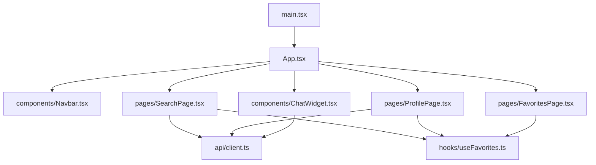
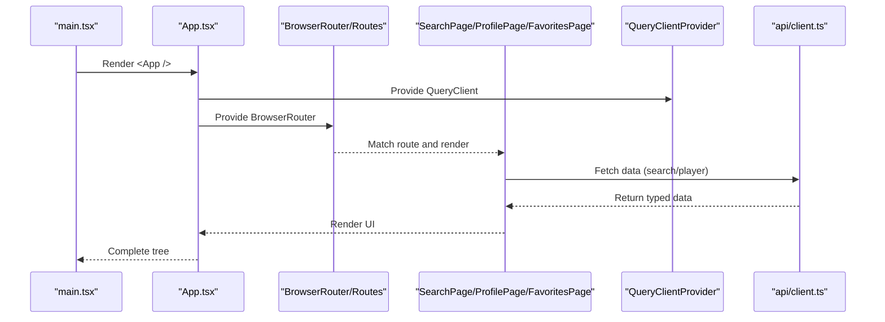
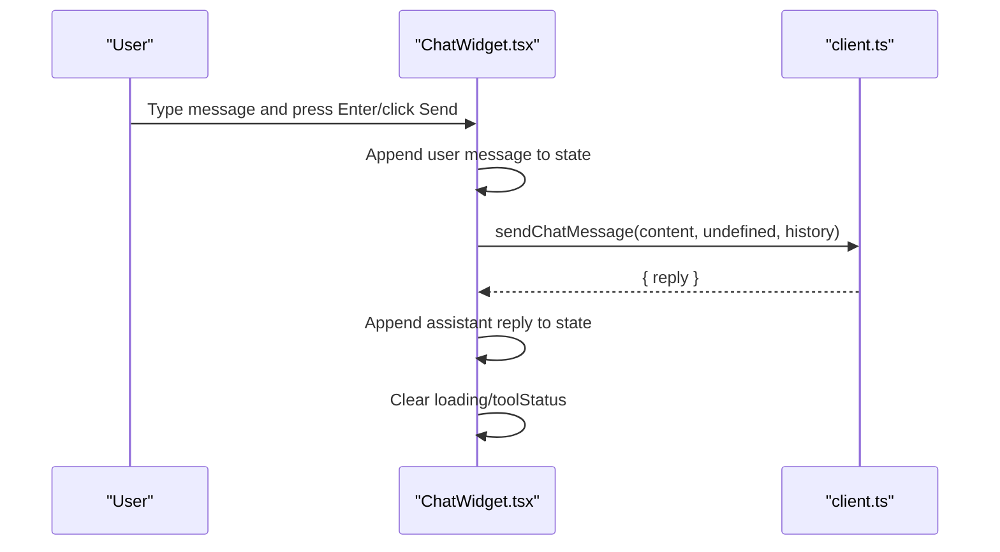
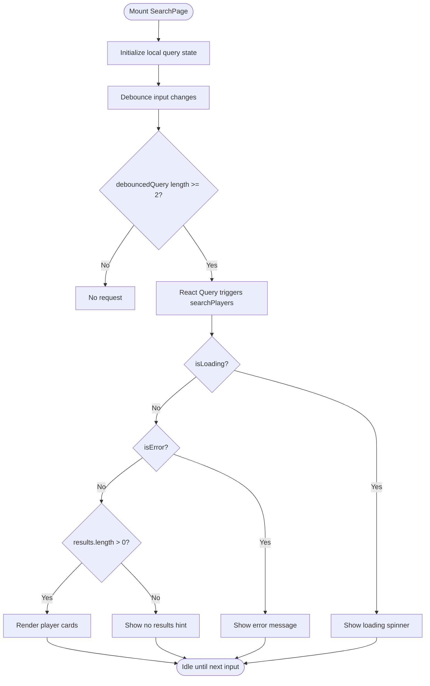
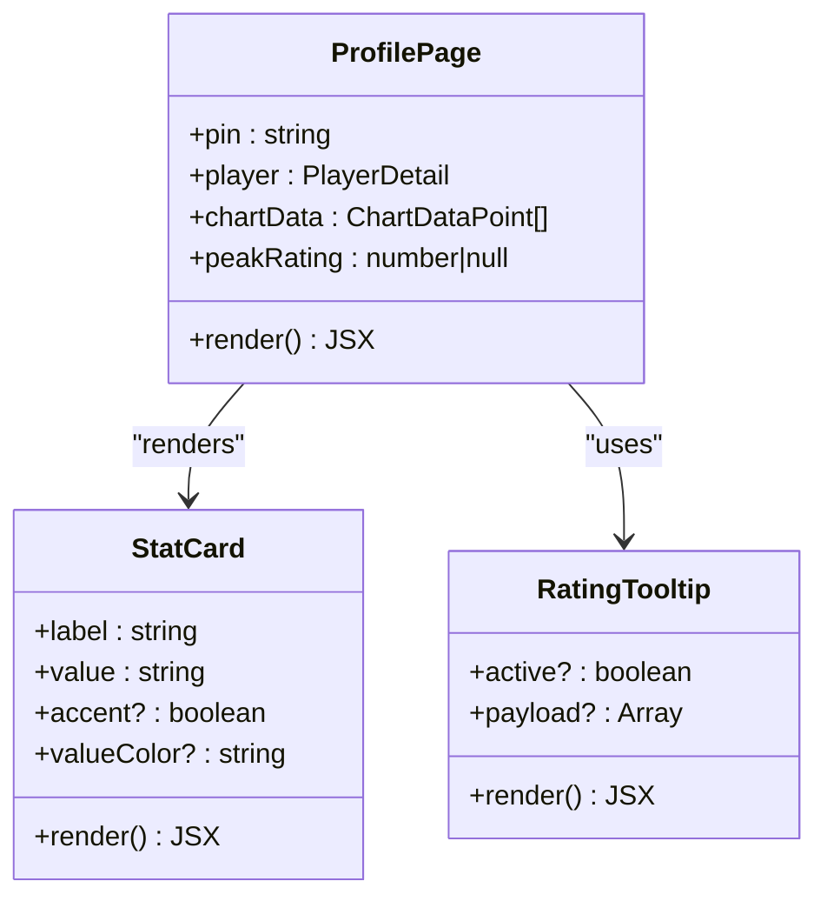
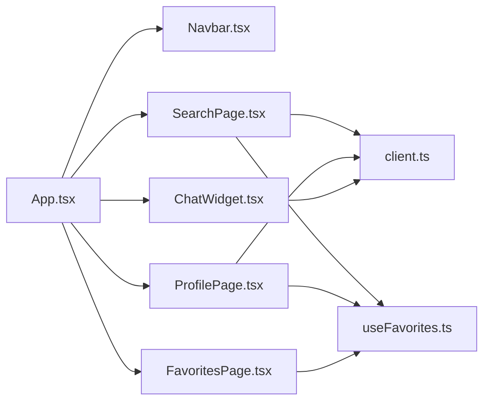

# Component Structure

<cite>
**Referenced Files in This Document**
- [main.tsx](file://frontend/src/main.tsx)
- [App.tsx](file://frontend/src/App.tsx)
- [Navbar.tsx](file://frontend/src/components/Navbar.tsx)
- [ChatWidget.tsx](file://frontend/src/components/ChatWidget.tsx)
- [SearchPage.tsx](file://frontend/src/pages/SearchPage.tsx)
- [ProfilePage.tsx](file://frontend/src/pages/ProfilePage.tsx)
- [FavoritesPage.tsx](file://frontend/src/pages/FavoritesPage.tsx)
- [useFavorites.ts](file://frontend/src/hooks/useFavorites.ts)
- [client.ts](file://frontend/src/api/client.ts)
</cite>

## Table of Contents
1. [Introduction](#introduction)
2. [Project Structure](#project-structure)
3. [Core Components](#core-components)
4. [Architecture Overview](#architecture-overview)
5. [Detailed Component Analysis](#detailed-component-analysis)
6. [Dependency Analysis](#dependency-analysis)
7. [Performance Considerations](#performance-considerations)
8. [Troubleshooting Guide](#troubleshooting-guide)
9. [Conclusion](#conclusion)

## Introduction
This document explains the React component structure and hierarchy for the frontend application. It covers how the root App is configured, how layout components (Navbar, ChatWidget) compose with page components (SearchPage, ProfilePage, FavoritesPage), how data flows via props and hooks, and how components interact with routing and API clients. The goal is to provide a clear mental model of the UI architecture and integration patterns used across the app.

## Project Structure
The frontend organizes code by feature area:
- Entry point mounts the app and wraps it with StrictMode.
- Root App configures providers (React Query, Router) and composes Navbar, Routes, and ChatWidget.
- Layout components (Navbar, ChatWidget) are reused across pages.
- Page components implement specific routes and orchestrate data fetching and state.
- A shared hook manages favorites persistence.
- An API client centralizes HTTP calls and types.

**Diagram sources**
- [main.tsx:1-11](file://frontend/src/main.tsx#L1-L11)
- [App.tsx:1-37](file://frontend/src/App.tsx#L1-L37)
- [Navbar.tsx:1-94](file://frontend/src/components/Navbar.tsx#L1-L94)
- [ChatWidget.tsx:1-240](file://frontend/src/components/ChatWidget.tsx#L1-L240)
- [SearchPage.tsx:1-240](file://frontend/src/pages/SearchPage.tsx#L1-L240)
- [ProfilePage.tsx:1-375](file://frontend/src/pages/ProfilePage.tsx#L1-L375)
- [FavoritesPage.tsx:1-103](file://frontend/src/pages/FavoritesPage.tsx#L1-L103)
- [useFavorites.ts:1-49](file://frontend/src/hooks/useFavorites.ts#L1-L49)
- [client.ts:1-86](file://frontend/src/api/client.ts#L1-L86)

**Section sources**
- [main.tsx:1-11](file://frontend/src/main.tsx#L1-L11)
- [App.tsx:1-37](file://frontend/src/App.tsx#L1-L37)

## Core Components
- App: Configures global providers (React Query client, React Router), renders Navbar, Routes, and ChatWidget.
- Navbar: Provides navigation links using react-router-dom NavLink; highlights active route.
- ChatWidget: Floating chat interface that sends messages to the backend and displays conversation history.
- SearchPage: Debounced search input, queries players, shows results grid, integrates favorites toggle.
- ProfilePage: Displays player details, rating evolution chart, tournament table, and favorite toggle.
- FavoritesPage: Lists saved players and allows removal or navigation to profiles.
- useFavorites: Shared hook for adding/removing/toggling favorites persisted in localStorage.
- client: Centralized axios-based API client with typed functions for search, player detail, and chat.

Key prop passing and composition patterns:
- App composes Navbar and ChatWidget around Routes; no props passed between them.
- Pages consume shared state via useFavorites hook rather than prop drilling.
- Data fetching is handled by React Query within pages; no direct API calls from layout components except ChatWidget.

**Section sources**
- [App.tsx:1-37](file://frontend/src/App.tsx#L1-L37)
- [Navbar.tsx:1-94](file://frontend/src/components/Navbar.tsx#L1-L94)
- [ChatWidget.tsx:1-240](file://frontend/src/components/ChatWidget.tsx#L1-L240)
- [SearchPage.tsx:1-240](file://frontend/src/pages/SearchPage.tsx#L1-L240)
- [ProfilePage.tsx:1-375](file://frontend/src/pages/ProfilePage.tsx#L1-L375)
- [FavoritesPage.tsx:1-103](file://frontend/src/pages/FavoritesPage.tsx#L1-L103)
- [useFavorites.ts:1-49](file://frontend/src/hooks/useFavorites.ts#L1-L49)
- [client.ts:1-86](file://frontend/src/api/client.ts#L1-L86)

## Architecture Overview
High-level runtime flow:
- main.tsx creates the React root and renders App under StrictMode.
- App sets up QueryClientProvider and BrowserRouter, then renders Navbar, Routes, and ChatWidget.
- Routes render SearchPage, ProfilePage, or FavoritesPage based on URL.
- Pages fetch data via React Query and display results.
- ChatWidget independently communicates with the chat endpoint.

**Diagram sources**
- [main.tsx:1-11](file://frontend/src/main.tsx#L1-L11)
- [App.tsx:1-37](file://frontend/src/App.tsx#L1-L37)
- [SearchPage.tsx:1-240](file://frontend/src/pages/SearchPage.tsx#L1-L240)
- [ProfilePage.tsx:1-375](file://frontend/src/pages/ProfilePage.tsx#L1-L375)
- [client.ts:1-86](file://frontend/src/api/client.ts#L1-L86)

## Detailed Component Analysis

### Root App Configuration
- Providers:
  - QueryClientProvider wraps the entire app with a configured QueryClient (retry and staleTime options).
  - BrowserRouter provides routing context.
- Composition:
  - Renders Navbar at the top.
  - Renders Routes inside a main container.
  - Renders ChatWidget at the bottom-right floating position.
- Styling:
  - Uses inline styles for minimal layout scaffolding (e.g., background, min-height).

Integration points:
- Imports all layout and page components.
- Defines route mappings for home, player profile, and favorites.

**Section sources**
- [App.tsx:1-37](file://frontend/src/App.tsx#L1-L37)

### Navbar
- Purpose: Global navigation with logo and links to Search and Favorites.
- Behavior:
  - Uses NavLink to highlight active link based on current route.
  - No props received; purely presentational with internal styles.
- Interaction:
  - Navigates via react-router-dom without triggering re-renders outside the nav.

Usage pattern:
- Rendered once by App; no prop passing required.

**Section sources**
- [Navbar.tsx:1-94](file://frontend/src/components/Navbar.tsx#L1-L94)

### ChatWidget
- Purpose: Floating assistant chat window integrated into every page.
- State:
  - Open/close visibility, user input, message list, loading indicator, tool status.
- Lifecycle:
  - Auto-scrolls to latest message when messages change.
  - Sends user messages to the backend and appends assistant replies.
  - Handles errors gracefully by showing an error message.
- Integration:
  - Calls sendChatMessage from api/client.ts.
  - Does not depend on routing or favorites.

Sequence diagram for sending a message:

**Diagram sources**
- [ChatWidget.tsx:1-240](file://frontend/src/components/ChatWidget.tsx#L1-L240)
- [client.ts:74-85](file://frontend/src/api/client.ts#L74-L85)

**Section sources**
- [ChatWidget.tsx:1-240](file://frontend/src/components/ChatWidget.tsx#L1-L240)
- [client.ts:74-85](file://frontend/src/api/client.ts#L74-L85)

### SearchPage
- Purpose: Player search with debounced input, result grid, and favorites management.
- Data flow:
  - Debounces query input to reduce requests.
  - Uses React Query to fetch search results; enables request only after minimum length.
  - Maps results to cards; clicking navigates to player profile.
- Favorites integration:
  - Uses useFavorites hook to toggle favorites per player card.
- Error handling:
  - Shows error banner if query fails.
  - Shows empty state when no results found.

Flowchart of search lifecycle:

**Diagram sources**
- [SearchPage.tsx:1-240](file://frontend/src/pages/SearchPage.tsx#L1-L240)
- [client.ts:59-62](file://frontend/src/api/client.ts#L59-L62)

**Section sources**
- [SearchPage.tsx:1-240](file://frontend/src/pages/SearchPage.tsx#L1-L240)
- [useFavorites.ts:1-49](file://frontend/src/hooks/useFavorites.ts#L1-L49)
- [client.ts:59-62](file://frontend/src/api/client.ts#L59-L62)

### ProfilePage
- Purpose: Display detailed player information, rating evolution chart, and tournament history.
- Data flow:
  - Reads pin from route params.
  - Uses React Query to fetch player detail by pin.
  - Computes chart data and peak rating with useMemo.
- Favorites integration:
  - Toggles favorite state using useFavorites hook.
- Navigation:
  - Back button navigates to previous route.

Class-like structure overview:

**Diagram sources**
- [ProfilePage.tsx:1-375](file://frontend/src/pages/ProfilePage.tsx#L1-L375)

**Section sources**
- [ProfilePage.tsx:1-375](file://frontend/src/pages/ProfilePage.tsx#L1-L375)
- [client.ts:64-67](file://frontend/src/api/client.ts#L64-L67)
- [useFavorites.ts:1-49](file://frontend/src/hooks/useFavorites.ts#L1-L49)

### FavoritesPage
- Purpose: List and manage favorite players.
- Behavior:
  - If no favorites, shows empty state with call-to-action to search.
  - Otherwise, renders a grid of favorite cards with remove action and navigation to profile.
- Integration:
  - Uses useFavorites hook for reading and removing favorites.

**Section sources**
- [FavoritesPage.tsx:1-103](file://frontend/src/pages/FavoritesPage.tsx#L1-L103)
- [useFavorites.ts:1-49](file://frontend/src/hooks/useFavorites.ts#L1-L49)

### useFavorites Hook
- Responsibilities:
  - Initialize favorites from localStorage.
  - Persist favorites to localStorage on change.
  - Provide add/remove/isFavorite/toggle operations.
- Usage:
  - Consumed by SearchPage, ProfilePage, and FavoritesPage to share favorites state across the app.

Prop/state passing pattern:
- Instead of prop drilling, pages subscribe to the same hook instance provided by React context internally, ensuring consistent state across components.

**Section sources**
- [useFavorites.ts:1-49](file://frontend/src/hooks/useFavorites.ts#L1-L49)

### API Client
- Responsibilities:
  - Create axios instance with base URL.
  - Export typed functions for search, player detail, tournaments, and chat.
  - Define TypeScript interfaces for request/response shapes.
- Integration:
  - Used by SearchPage and ProfilePage for data fetching.
  - Used by ChatWidget for messaging.

**Section sources**
- [client.ts:1-86](file://frontend/src/api/client.ts#L1-L86)

## Dependency Analysis
Component dependency graph:

Observations:
- Low coupling: Layout components do not depend on pages; pages depend on shared hook and API client.
- Single source of truth for favorites via useFavorites.
- Data fetching centralized in pages through React Query and client functions.

**Diagram sources**
- [App.tsx:1-37](file://frontend/src/App.tsx#L1-L37)
- [Navbar.tsx:1-94](file://frontend/src/components/Navbar.tsx#L1-L94)
- [ChatWidget.tsx:1-240](file://frontend/src/components/ChatWidget.tsx#L1-L240)
- [SearchPage.tsx:1-240](file://frontend/src/pages/SearchPage.tsx#L1-L240)
- [ProfilePage.tsx:1-375](file://frontend/src/pages/ProfilePage.tsx#L1-L375)
- [FavoritesPage.tsx:1-103](file://frontend/src/pages/FavoritesPage.tsx#L1-L103)
- [useFavorites.ts:1-49](file://frontend/src/hooks/useFavorites.ts#L1-L49)
- [client.ts:1-86](file://frontend/src/api/client.ts#L1-L86)

**Section sources**
- [App.tsx:1-37](file://frontend/src/App.tsx#L1-L37)
- [client.ts:1-86](file://frontend/src/api/client.ts#L1-L86)

## Performance Considerations
- Debounced search reduces unnecessary network requests.
- React Query caching and staleTime minimize redundant fetches.
- useMemo in ProfilePage avoids recomputing derived chart data on each render.
- ChatWidget auto-scrolls efficiently using refs.
- Inline styles avoid external CSS overhead but could be extracted for maintainability if needed.

[No sources needed since this section provides general guidance]

## Troubleshooting Guide
Common issues and resolutions:
- Search returns no results:
  - Ensure query length meets minimum threshold before request.
  - Check network connectivity and backend availability.
- Player profile fails to load:
  - Verify route param pin is valid and numeric.
  - Confirm getPlayer function returns expected shape.
- Favorites not persisting:
  - Inspect localStorage for storage key and JSON validity.
  - Ensure add/remove/toggle functions are invoked correctly.
- Chat messages not appearing:
  - Validate sendChatMessage payload and response format.
  - Handle network errors and show user-friendly feedback.

**Section sources**
- [SearchPage.tsx:1-240](file://frontend/src/pages/SearchPage.tsx#L1-L240)
- [ProfilePage.tsx:1-375](file://frontend/src/pages/ProfilePage.tsx#L1-L375)
- [useFavorites.ts:1-49](file://frontend/src/hooks/useFavorites.ts#L1-L49)
- [ChatWidget.tsx:1-240](file://frontend/src/components/ChatWidget.tsx#L1-L240)
- [client.ts:1-86](file://frontend/src/api/client.ts#L1-L86)

## Conclusion
The application follows a clean separation of concerns:
- App orchestrates providers and layout.
- Layout components remain independent of page logic.
- Pages encapsulate domain-specific behavior and data fetching.
- Shared state (favorites) is managed via a custom hook, avoiding prop drilling.
- API interactions are centralized and typed, improving reliability and developer experience.

This structure supports scalability, testability, and maintainability while keeping the UI intuitive and responsive.