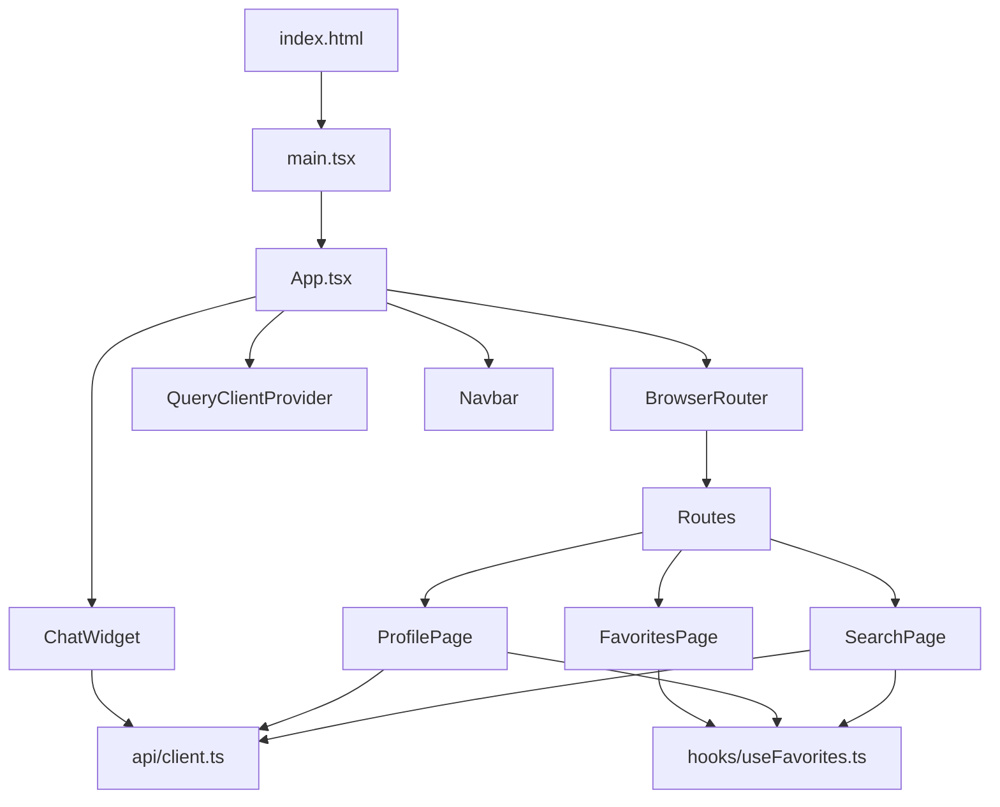
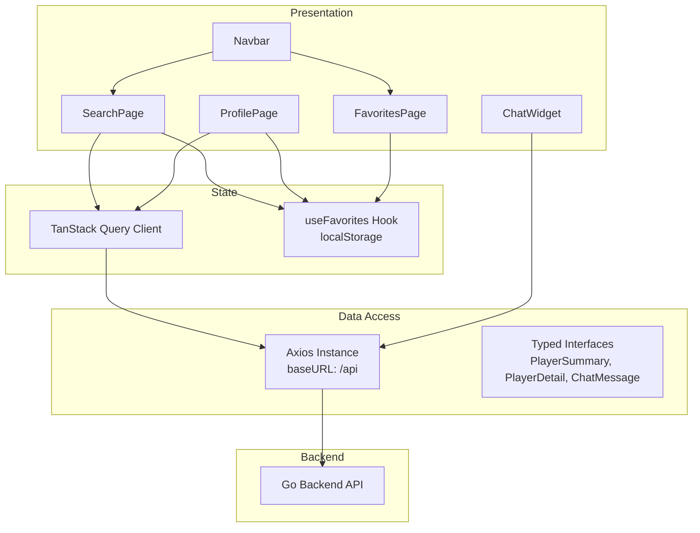
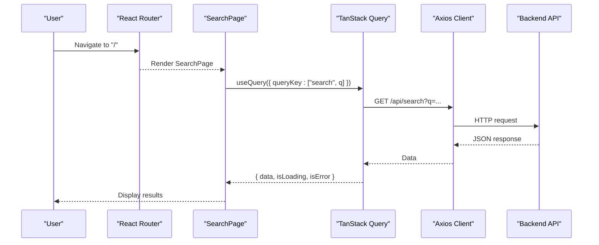
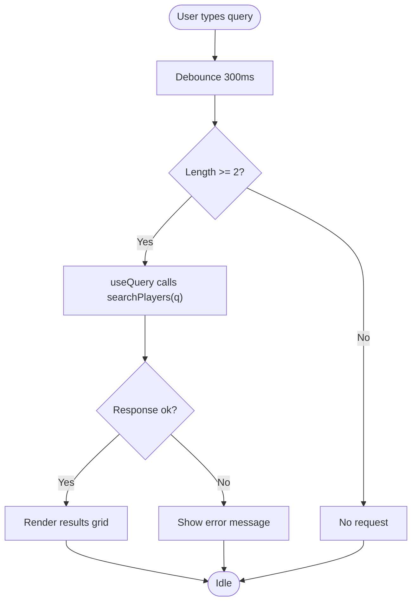
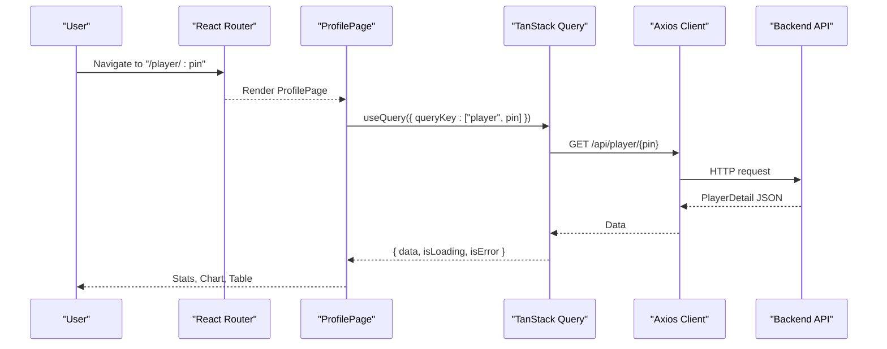
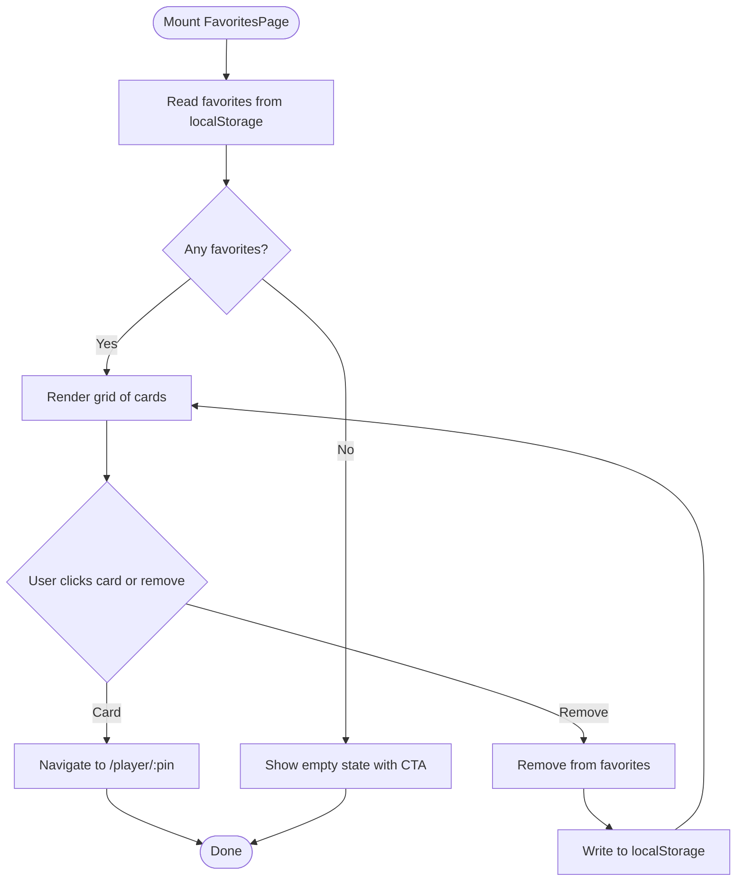
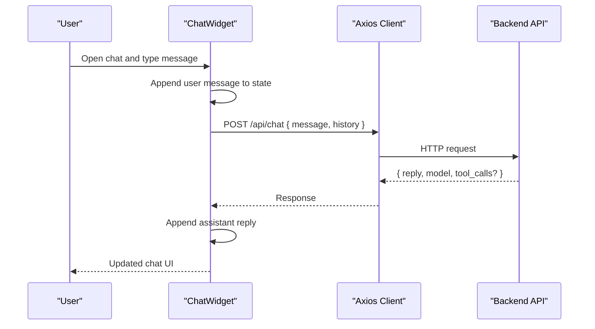
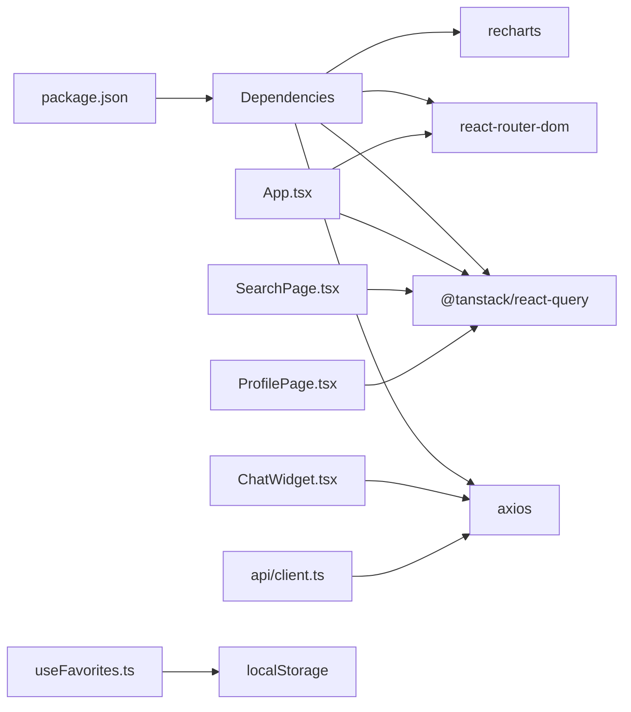

# Frontend Architecture

<cite>
**Referenced Files in This Document**
- [App.tsx](file://frontend/src/App.tsx)
- [main.tsx](file://frontend/src/main.tsx)
- [client.ts](file://frontend/src/api/client.ts)
- [Navbar.tsx](file://frontend/src/components/Navbar.tsx)
- [ChatWidget.tsx](file://frontend/src/components/ChatWidget.tsx)
- [SearchPage.tsx](file://frontend/src/pages/SearchPage.tsx)
- [ProfilePage.tsx](file://frontend/src/pages/ProfilePage.tsx)
- [FavoritesPage.tsx](file://frontend/src/pages/FavoritesPage.tsx)
- [useFavorites.ts](file://frontend/src/hooks/useFavorites.ts)
- [index.css](file://frontend/src/index.css)
- [vite.config.ts](file://frontend/vite.config.ts)
- [package.json](file://frontend/package.json)
- [index.html](file://frontend/index.html)
</cite>

## Table of Contents
1. [Introduction](#introduction)
2. [Project Structure](#project-structure)
3. [Core Components](#core-components)
4. [Architecture Overview](#architecture-overview)
5. [Detailed Component Analysis](#detailed-component-analysis)
6. [Dependency Analysis](#dependency-analysis)
7. [Performance Considerations](#performance-considerations)
8. [Troubleshooting Guide](#troubleshooting-guide)
9. [Conclusion](#conclusion)

## Introduction
This document describes the React frontend architecture for the GoNow application. It covers component hierarchy, routing with React Router, state management via TanStack Query and a local favorites hook, API client implementation using Axios, Go-themed styling with CSS custom properties, responsive design patterns, and Vite build configuration. It also maps data flows and integration points with the backend API.

## Project Structure
The frontend is organized by feature and responsibility:
- Entry point and app shell
  - main.tsx mounts the React tree
  - App.tsx configures providers (TanStack Query), routing, and global layout
- Pages
  - SearchPage.tsx: search players and display results
  - ProfilePage.tsx: player detail, rating chart, and tournament history
  - FavoritesPage.tsx: list of favorite players persisted locally
- Shared components
  - Navbar.tsx: navigation bar with active link highlighting
  - ChatWidget.tsx: floating chat assistant integrated with the backend chat endpoint
- Data layer
  - api/client.ts: Axios instance and typed API functions
  - hooks/useFavorites.ts: local favorites persistence with localStorage
- Styling
  - index.css: Go-themed CSS custom properties, animations, and shared UI classes
- Build and scripts
  - vite.config.ts: Vite + React plugin
  - package.json: dependencies and scripts
  - index.html: HTML entrypoint

**Diagram sources**
- [index.html:1-14](file://frontend/index.html#L1-L14)
- [main.tsx:1-11](file://frontend/src/main.tsx#L1-L11)
- [App.tsx:1-37](file://frontend/src/App.tsx#L1-L37)
- [SearchPage.tsx:1-240](file://frontend/src/pages/SearchPage.tsx#L1-L240)
- [ProfilePage.tsx:1-375](file://frontend/src/pages/ProfilePage.tsx#L1-L375)
- [FavoritesPage.tsx:1-103](file://frontend/src/pages/FavoritesPage.tsx#L1-L103)
- [Navbar.tsx:1-94](file://frontend/src/components/Navbar.tsx#L1-L94)
- [ChatWidget.tsx:1-240](file://frontend/src/components/ChatWidget.tsx#L1-L240)
- [client.ts:1-86](file://frontend/src/api/client.ts#L1-L86)
- [useFavorites.ts:1-49](file://frontend/src/hooks/useFavorites.ts#L1-L49)

**Section sources**
- [index.html:1-14](file://frontend/index.html#L1-L14)
- [main.tsx:1-11](file://frontend/src/main.tsx#L1-L11)
- [App.tsx:1-37](file://frontend/src/App.tsx#L1-L37)

## Core Components
- App shell and providers
  - Wraps the app with QueryClientProvider and BrowserRouter
  - Defines routes for search, profile, and favorites
  - Renders Navbar and ChatWidget globally
- Routing
  - / -> SearchPage
  - /player/:pin -> ProfilePage
  - /favorites -> FavoritesPage
- State management
  - TanStack Query for server state (search, player details)
  - useFavorites hook for client-side favorites with localStorage persistence
- API client
  - Axios instance configured with baseURL pointing to the backend API
  - Typed functions for search, player detail, tournaments, and chat
- UI components
  - Navbar with NavLink active states
  - ChatWidget with message history and error handling
  - Pages composed of cards, charts, and tables

**Section sources**
- [App.tsx:1-37](file://frontend/src/App.tsx#L1-L37)
- [client.ts:1-86](file://frontend/src/api/client.ts#L1-L86)
- [useFavorites.ts:1-49](file://frontend/src/hooks/useFavorites.ts#L1-L49)
- [Navbar.tsx:1-94](file://frontend/src/components/Navbar.tsx#L1-L94)
- [ChatWidget.tsx:1-240](file://frontend/src/components/ChatWidget.tsx#L1-L240)
- [SearchPage.tsx:1-240](file://frontend/src/pages/SearchPage.tsx#L1-L240)
- [ProfilePage.tsx:1-375](file://frontend/src/pages/ProfilePage.tsx#L1-L375)
- [FavoritesPage.tsx:1-103](file://frontend/src/pages/FavoritesPage.tsx#L1-L103)

## Architecture Overview
The frontend follows a layered architecture:
- Presentation layer: React components and pages
- State layer: TanStack Query for server state; useFavorites for client state
- Data access layer: Axios-based API client with typed interfaces
- Styling layer: CSS custom properties and utility classes for Go theme

**Diagram sources**
- [App.tsx:1-37](file://frontend/src/App.tsx#L1-L37)
- [SearchPage.tsx:1-240](file://frontend/src/pages/SearchPage.tsx#L1-L240)
- [ProfilePage.tsx:1-375](file://frontend/src/pages/ProfilePage.tsx#L1-L375)
- [FavoritesPage.tsx:1-103](file://frontend/src/pages/FavoritesPage.tsx#L1-L103)
- [client.ts:1-86](file://frontend/src/api/client.ts#L1-L86)
- [useFavorites.ts:1-49](file://frontend/src/hooks/useFavorites.ts#L1-L49)
- [ChatWidget.tsx:1-240](file://frontend/src/components/ChatWidget.tsx#L1-L240)

## Detailed Component Analysis

### App Shell and Routing
- Providers
  - QueryClientProvider wraps the app with default query options (retry, staleTime)
  - BrowserRouter provides routing context
- Routes
  - Root route renders SearchPage
  - Dynamic route /player/:pin renders ProfilePage
  - /favorites renders FavoritesPage
- Layout
  - Navbar at top
  - ChatWidget fixed at bottom-right

**Diagram sources**
- [App.tsx:1-37](file://frontend/src/App.tsx#L1-L37)
- [SearchPage.tsx:1-240](file://frontend/src/pages/SearchPage.tsx#L1-L240)
- [client.ts:1-86](file://frontend/src/api/client.ts#L1-L86)

**Section sources**
- [App.tsx:1-37](file://frontend/src/App.tsx#L1-L37)

### Search Page
- Features
  - Debounced search input triggers queries only when length >= 2
  - Displays loading, error, and no-results states
  - Results grid with player cards and quick navigation to profiles
  - Favorite toggle via useFavorites
- Data flow
  - useQuery fetches search results from /api/search
  - Navigation uses react-router-dom navigate

**Diagram sources**
- [SearchPage.tsx:1-240](file://frontend/src/pages/SearchPage.tsx#L1-L240)
- [client.ts:1-86](file://frontend/src/api/client.ts#L1-L86)

**Section sources**
- [SearchPage.tsx:1-240](file://frontend/src/pages/SearchPage.tsx#L1-L240)

### Profile Page
- Features
  - Loads player detail by PIN using useQuery
  - Renders stats, rating evolution chart, and tournament table
  - Integrates favorites toggle
- Data processing
  - Transforms rating_history into chart-friendly data
  - Computes peak rating and summary metrics
- Visualization
  - Uses Recharts ComposedChart with gradient area and line
  - Tooltip shows detailed per-tournament info

**Diagram sources**
- [App.tsx:1-37](file://frontend/src/App.tsx#L1-L37)
- [ProfilePage.tsx:1-375](file://frontend/src/pages/ProfilePage.tsx#L1-L375)
- [client.ts:1-86](file://frontend/src/api/client.ts#L1-L86)

**Section sources**
- [ProfilePage.tsx:1-375](file://frontend/src/pages/ProfilePage.tsx#L1-L375)

### Favorites Page
- Features
  - Lists all favorite players persisted in localStorage
  - Allows removal and navigation to player profiles
- State
  - useFavorites manages add/remove/toggle and checks membership

**Diagram sources**
- [FavoritesPage.tsx:1-103](file://frontend/src/pages/FavoritesPage.tsx#L1-L103)
- [useFavorites.ts:1-49](file://frontend/src/hooks/useFavorites.ts#L1-L49)

**Section sources**
- [FavoritesPage.tsx:1-103](file://frontend/src/pages/FavoritesPage.tsx#L1-L103)
- [useFavorites.ts:1-49](file://frontend/src/hooks/useFavorites.ts#L1-L49)

### Chat Widget
- Features
  - Floating action button opens chat window
  - Sends messages to backend chat endpoint with optional history
  - Shows typing indicator and error fallback message
- Integration
  - Calls sendChatMessage from api/client.ts
  - Maintains local message state and auto-scrolls to latest

**Diagram sources**
- [ChatWidget.tsx:1-240](file://frontend/src/components/ChatWidget.tsx#L1-L240)
- [client.ts:1-86](file://frontend/src/api/client.ts#L1-L86)

**Section sources**
- [ChatWidget.tsx:1-240](file://frontend/src/components/ChatWidget.tsx#L1-L240)

### Navbar
- Features
  - Sticky header with logo and links
  - Active link highlighting based on current route
- Styling
  - Uses CSS custom properties for colors and shadows

**Section sources**
- [Navbar.tsx:1-94](file://frontend/src/components/Navbar.tsx#L1-L94)

## Dependency Analysis
- External libraries
  - React and ReactDOM for UI rendering
  - React Router for navigation
  - TanStack Query for server state caching and background updates
  - Axios for HTTP requests
  - Recharts for charts
- Internal dependencies
  - Pages depend on api/client.ts for data fetching
  - Pages and components use useFavorites for persistent client state
  - Global styles and theme provided by index.css

**Diagram sources**
- [package.json:1-30](file://frontend/package.json#L1-L30)
- [App.tsx:1-37](file://frontend/src/App.tsx#L1-L37)
- [SearchPage.tsx:1-240](file://frontend/src/pages/SearchPage.tsx#L1-L240)
- [ProfilePage.tsx:1-375](file://frontend/src/pages/ProfilePage.tsx#L1-L375)
- [ChatWidget.tsx:1-240](file://frontend/src/components/ChatWidget.tsx#L1-L240)
- [client.ts:1-86](file://frontend/src/api/client.ts#L1-L86)
- [useFavorites.ts:1-49](file://frontend/src/hooks/useFavorites.ts#L1-L49)

**Section sources**
- [package.json:1-30](file://frontend/package.json#L1-L30)

## Performance Considerations
- Query caching and staleness
  - Default QueryClient sets retry and staleTime; SearchPage overrides staleTime for search results
  - Use query keys that reflect inputs to avoid unnecessary refetches
- Debouncing search
  - SearchPage debounces input to reduce network load
- Local storage persistence
  - useFavorites persists favorites efficiently; consider batching writes if volume grows
- Rendering optimizations
  - Memoization used in ProfilePage for derived chart data
- Network efficiency
  - Axios instance centralizes baseURL; consider interceptors for auth headers or retries

[No sources needed since this section provides general guidance]

## Troubleshooting Guide
- API connectivity
  - Ensure backend is running and accessible at the configured baseURL
  - Check browser console for CORS errors if deployed behind different origins
- Query errors
  - SearchPage and ProfilePage show error states; verify endpoints return expected shapes
- Chat failures
  - ChatWidget displays an error message on failure; confirm /chat endpoint availability
- Favorites not persisting
  - Verify localStorage is enabled and not blocked by privacy settings
- Routing issues
  - Confirm dynamic route params are correctly parsed and passed to queries

**Section sources**
- [client.ts:1-86](file://frontend/src/api/client.ts#L1-L86)
- [SearchPage.tsx:1-240](file://frontend/src/pages/SearchPage.tsx#L1-L240)
- [ProfilePage.tsx:1-375](file://frontend/src/pages/ProfilePage.tsx#L1-L375)
- [ChatWidget.tsx:1-240](file://frontend/src/components/ChatWidget.tsx#L1-L240)
- [useFavorites.ts:1-49](file://frontend/src/hooks/useFavorites.ts#L1-L49)

## Conclusion
The GoNow frontend is a modern React application leveraging TanStack Query for efficient server state management, React Router for declarative navigation, and an Axios-based API client with strong TypeScript types. The Go-themed styling system uses CSS custom properties and reusable classes, while Vite provides a fast development and build experience. The architecture cleanly separates concerns across presentation, state, and data layers, enabling maintainability and scalability.