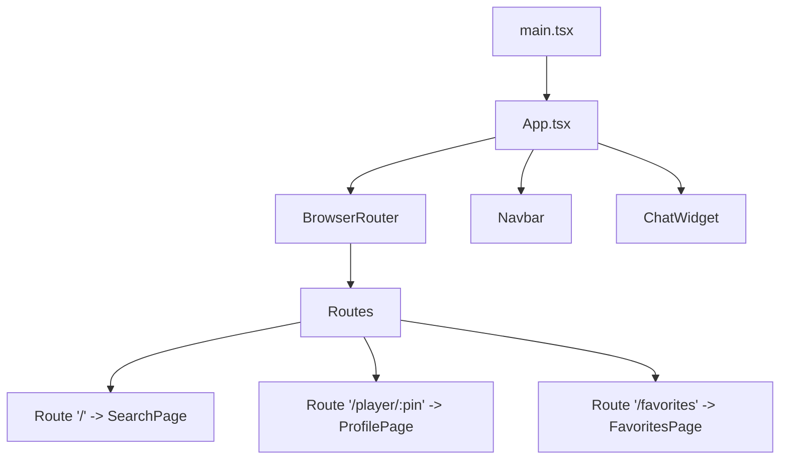
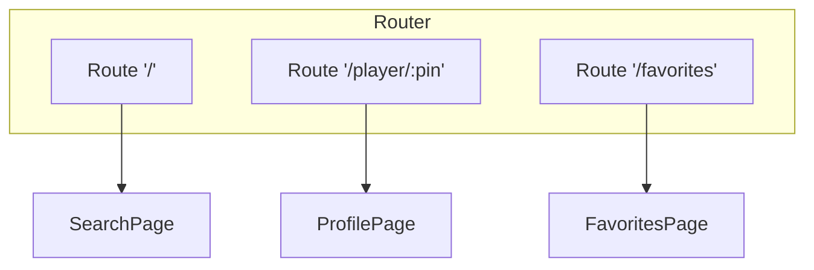
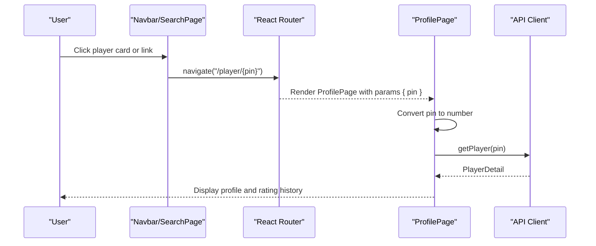
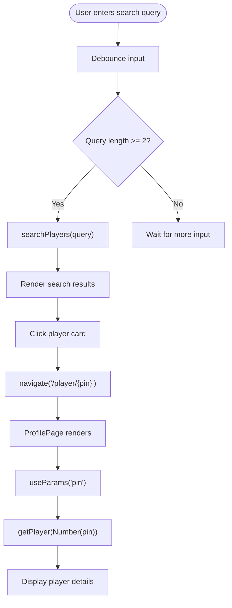
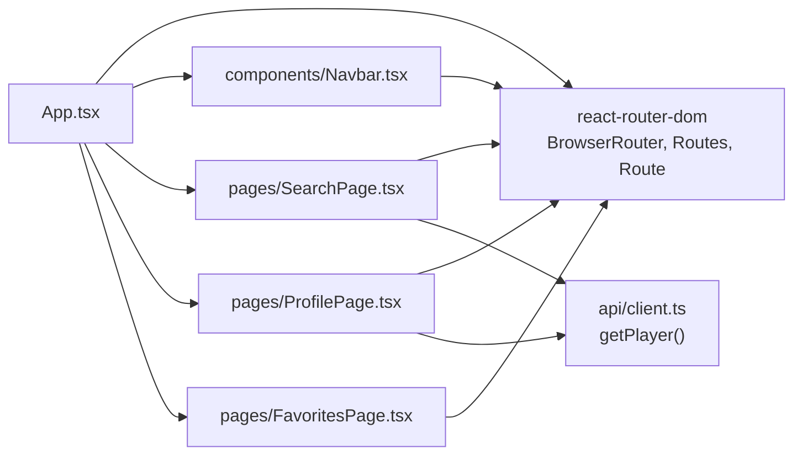

# Routing Configuration

<cite>
**Referenced Files in This Document**
- [App.tsx](file://frontend/src/App.tsx)
- [main.tsx](file://frontend/src/main.tsx)
- [Navbar.tsx](file://frontend/src/components/Navbar.tsx)
- [SearchPage.tsx](file://frontend/src/pages/SearchPage.tsx)
- [ProfilePage.tsx](file://frontend/src/pages/ProfilePage.tsx)
- [FavoritesPage.tsx](file://frontend/src/pages/FavoritesPage.tsx)
- [client.ts](file://frontend/src/api/client.ts)
</cite>

## Table of Contents
1. [Introduction](#introduction)
2. [Project Structure](#project-structure)
3. [Core Components](#core-components)
4. [Architecture Overview](#architecture-overview)
5. [Detailed Component Analysis](#detailed-component-analysis)
6. [Dependency Analysis](#dependency-analysis)
7. [Performance Considerations](#performance-considerations)
8. [Troubleshooting Guide](#troubleshooting-guide)
9. [Conclusion](#conclusion)

## Introduction
This document explains the React Router configuration and navigation patterns used in the GoNow frontend application. It covers route definitions, URL parameters (especially player PIN routing), programmatic navigation, and how different pages are rendered based on URL paths. It also includes examples of navigating between search results and player profiles.

## Project Structure
The routing is configured at the application root and composed with a global navigation bar and page components. The router is provided by react-router-dom v7 and wrapped around the entire app.

**Diagram sources**
- [main.tsx:1-11](file://frontend/src/main.tsx#L1-L11)
- [App.tsx:18-36](file://frontend/src/App.tsx#L18-L36)
- [Navbar.tsx:1-35](file://frontend/src/components/Navbar.tsx#L1-L35)

**Section sources**
- [main.tsx:1-11](file://frontend/src/main.tsx#L1-L11)
- [App.tsx:1-37](file://frontend/src/App.tsx#L1-L37)

## Core Components
- Application shell and router setup:
  - The app initializes React Query and wraps the UI with BrowserRouter to enable client-side routing.
  - Routes map URL paths to page components.
- Navigation bar:
  - Uses NavLink for declarative navigation and active state styling.
- Pages:
  - SearchPage: displays search results and navigates to player profiles using programmatic navigation.
  - ProfilePage: reads the player PIN from the URL and fetches detailed data.
  - FavoritesPage: lists favorite players and navigates to their profiles.

Key responsibilities:
- App.tsx: defines routes and provides global context providers.
- Navbar.tsx: provides top-level navigation links.
- SearchPage.tsx: performs searches and navigates to /player/:pin.
- ProfilePage.tsx: consumes :pin parameter and loads player details.
- FavoritesPage.tsx: manages favorites and navigates to profile pages.

**Section sources**
- [App.tsx:18-36](file://frontend/src/App.tsx#L18-L36)
- [Navbar.tsx:1-35](file://frontend/src/components/Navbar.tsx#L1-L35)
- [SearchPage.tsx:1-148](file://frontend/src/pages/SearchPage.tsx#L1-L148)
- [ProfilePage.tsx:1-239](file://frontend/src/pages/ProfilePage.tsx#L1-L239)
- [FavoritesPage.tsx:1-63](file://frontend/src/pages/FavoritesPage.tsx#L1-L63)

## Architecture Overview
The routing architecture uses a single BrowserRouter with three primary routes:
- Root path "/" renders the search interface.
- Dynamic path "/player/:pin" renders the player profile page and extracts the pin parameter.
- Static path "/favorites" renders the favorites list.

**Diagram sources**
- [App.tsx:25-29](file://frontend/src/App.tsx#L25-L29)

## Detailed Component Analysis

### Route Definitions
- Root route "/" maps to SearchPage.
- Player profile route "/player/:pin" maps to ProfilePage; the segment :pin is a URL parameter representing the player’s EGD PIN.
- Favorites route "/favorites" maps to FavoritesPage.

These routes are declared within the Routes component inside BrowserRouter.

**Section sources**
- [App.tsx:25-29](file://frontend/src/App.tsx#L25-L29)

### URL Parameters: Player PIN Routing
- The ProfilePage reads the pin parameter from the URL using the useParams hook typed as string.
- The pin is converted to a number before being passed to the API client to fetch player details.
- If the pin is missing or invalid, the query is disabled to prevent unnecessary requests.

**Diagram sources**
- [SearchPage.tsx:89-95](file://frontend/src/pages/SearchPage.tsx#L89-L95)
- [ProfilePage.tsx:11-20](file://frontend/src/pages/ProfilePage.tsx#L11-L20)
- [client.ts:64-67](file://frontend/src/api/client.ts#L64-L67)

**Section sources**
- [ProfilePage.tsx:11-20](file://frontend/src/pages/ProfilePage.tsx#L11-L20)
- [client.ts:64-67](file://frontend/src/api/client.ts#L64-L67)

### Programmatic Navigation
- SearchPage uses useNavigate to programmatically navigate to a player profile when a result card is clicked.
- FavoritesPage uses useNavigate to navigate to a player profile from the favorites list.
- ProfilePage uses useNavigate for back navigation actions (e.g., returning to the previous page or to the search page).

Examples:
- Navigate to a player profile from search results:
  - See [SearchPage.tsx:89-95](file://frontend/src/pages/SearchPage.tsx#L89-L95)
- Navigate to a player profile from favorites:
  - See [FavoritesPage.tsx:32-33](file://frontend/src/pages/FavoritesPage.tsx#L32-L33)
- Back navigation in profile:
  - See [ProfilePage.tsx:38](file://frontend/src/pages/ProfilePage.tsx#L38)

**Section sources**
- [SearchPage.tsx:89-95](file://frontend/src/pages/SearchPage.tsx#L89-L95)
- [FavoritesPage.tsx:32-33](file://frontend/src/pages/FavoritesPage.tsx#L32-L33)
- [ProfilePage.tsx:38](file://frontend/src/pages/ProfilePage.tsx#L38)

### Declarative Navigation (Navbar)
- The Navbar uses NavLink to provide links to the search page and favorites page.
- Active link styles are applied automatically based on the current route.

Examples:
- Link to search:
  - See [Navbar.tsx:12-21](file://frontend/src/components/Navbar.tsx#L12-L21)
- Link to favorites:
  - See [Navbar.tsx:22-30](file://frontend/src/components/Navbar.tsx#L22-L30)

**Section sources**
- [Navbar.tsx:1-35](file://frontend/src/components/Navbar.tsx#L1-L35)

### Route Guards
- There are no explicit route guards implemented in the current codebase. Access to routes is not restricted by authentication or authorization checks.

[No sources needed since this section summarizes behavior without analyzing specific files]

### Data Flow Between Pages and API
- SearchPage triggers an API call to search players and renders results.
- Clicking a result navigates to /player/:pin.
- ProfilePage reads the pin parameter and calls the API to fetch detailed player information.

**Diagram sources**
- [SearchPage.tsx:13-23](file://frontend/src/pages/SearchPage.tsx#L13-23)
- [SearchPage.tsx:89-95](file://frontend/src/pages/SearchPage.tsx#L89-L95)
- [ProfilePage.tsx:11-20](file://frontend/src/pages/ProfilePage.tsx#L11-L20)
- [client.ts:59-67](file://frontend/src/api/client.ts#L59-L67)

**Section sources**
- [SearchPage.tsx:13-23](file://frontend/src/pages/SearchPage.tsx#L13-23)
- [SearchPage.tsx:89-95](file://frontend/src/pages/SearchPage.tsx#L89-L95)
- [ProfilePage.tsx:11-20](file://frontend/src/pages/ProfilePage.tsx#L11-L20)
- [client.ts:59-67](file://frontend/src/api/client.ts#L59-L67)

## Dependency Analysis
The following diagram shows how routing-related dependencies connect across components:

**Diagram sources**
- [App.tsx:1-37](file://frontend/src/App.tsx#L1-L37)
- [Navbar.tsx:1-35](file://frontend/src/components/Navbar.tsx#L1-L35)
- [SearchPage.tsx:1-148](file://frontend/src/pages/SearchPage.tsx#L1-L148)
- [ProfilePage.tsx:1-239](file://frontend/src/pages/ProfilePage.tsx#L1-L239)
- [FavoritesPage.tsx:1-63](file://frontend/src/pages/FavoritesPage.tsx#L1-L63)
- [client.ts:59-67](file://frontend/src/api/client.ts#L59-L67)

**Section sources**
- [App.tsx:1-37](file://frontend/src/App.tsx#L1-L37)
- [client.ts:59-67](file://frontend/src/api/client.ts#L59-L67)

## Performance Considerations
- Debounced search reduces unnecessary API calls while typing.
- React Query caching and stale time settings help minimize redundant network requests.
- Parameterized routes avoid full page reloads and keep navigation fast.

[No sources needed since this section provides general guidance]

## Troubleshooting Guide
Common issues and resolutions:
- Invalid or missing PIN:
  - Ensure the URL contains a numeric PIN segment after /player/.
  - ProfilePage disables queries if the pin is falsy; verify that the parameter exists before rendering.
- Navigation not working:
  - Confirm that navigate is called with the correct path format "/player/{pin}".
  - Check that the route definition matches the intended path.
- Active link styles not updating:
  - Verify NavLink usage and ensure the to prop matches the defined routes.

**Section sources**
- [ProfilePage.tsx:11-20](file://frontend/src/pages/ProfilePage.tsx#L11-L20)
- [SearchPage.tsx:89-95](file://frontend/src/pages/SearchPage.tsx#L89-L95)
- [Navbar.tsx:12-30](file://frontend/src/components/Navbar.tsx#L12-L30)

## Conclusion
The GoNow frontend uses a straightforward React Router setup with three main routes: search, player profile, and favorites. Player PIN routing is handled via a dynamic URL parameter, and navigation occurs both declaratively (NavLink) and programmatically (useNavigate). No route guards are currently implemented. The design keeps routing simple and efficient, leveraging React Query for data fetching and caching.