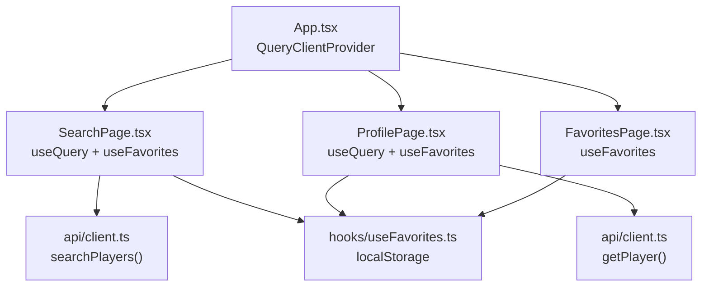
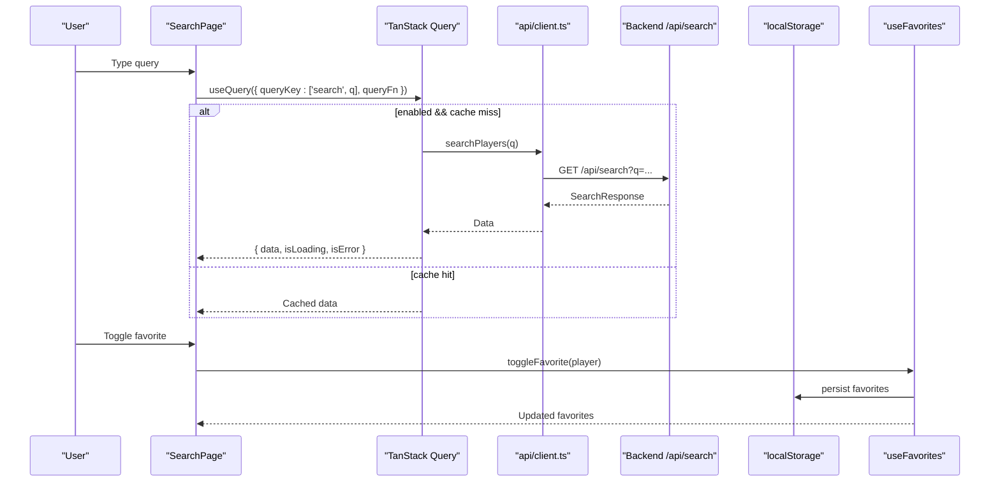
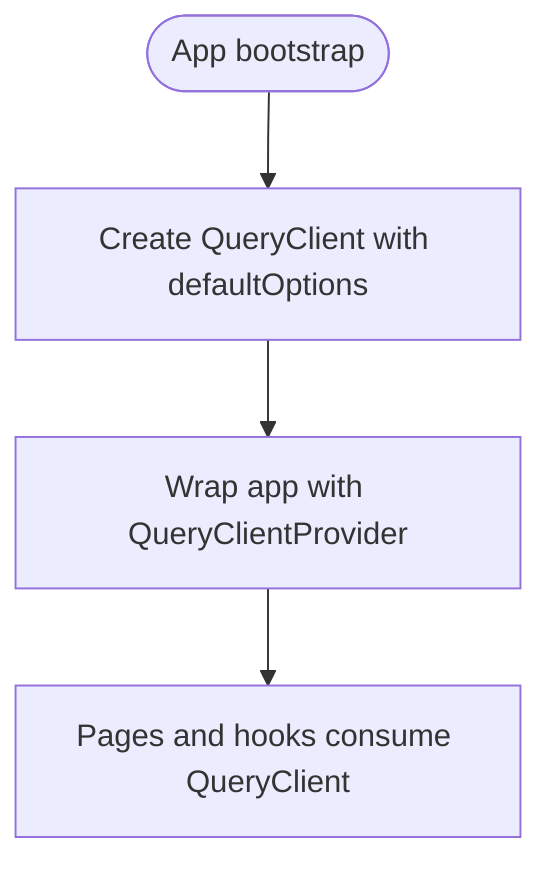
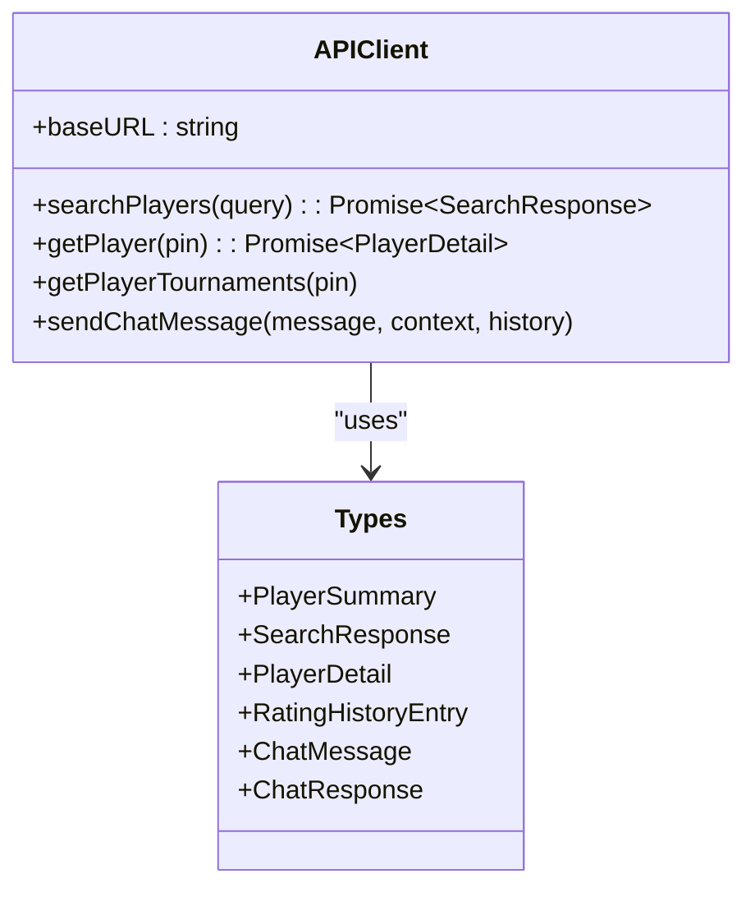
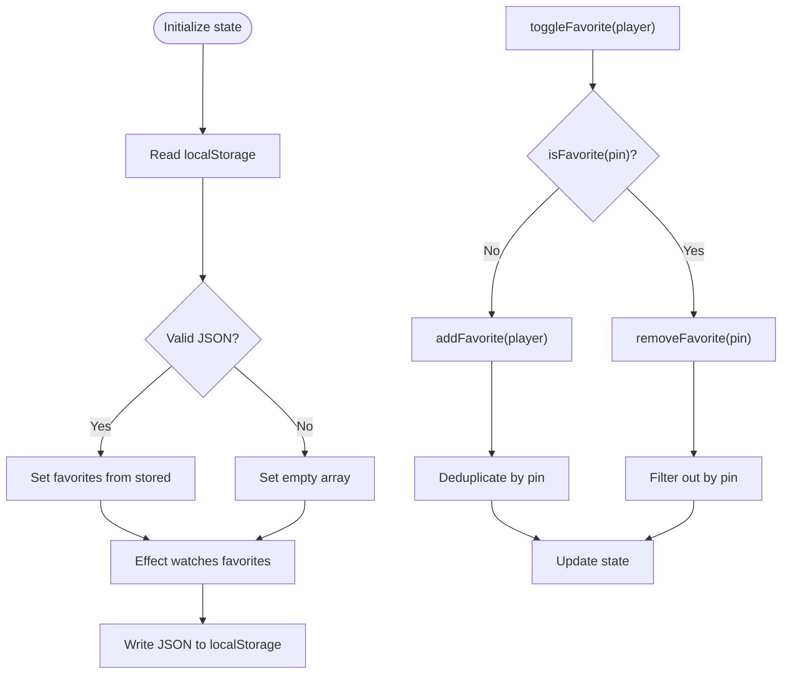
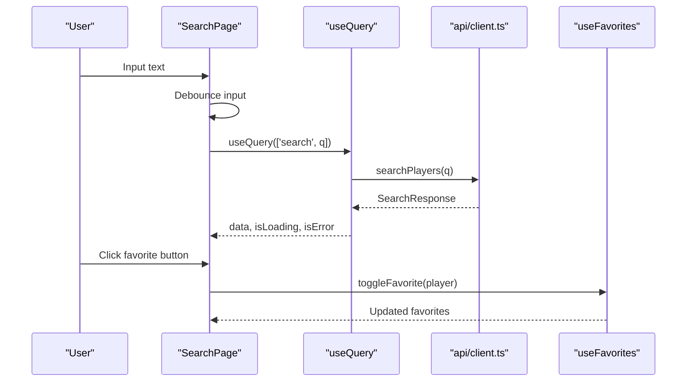
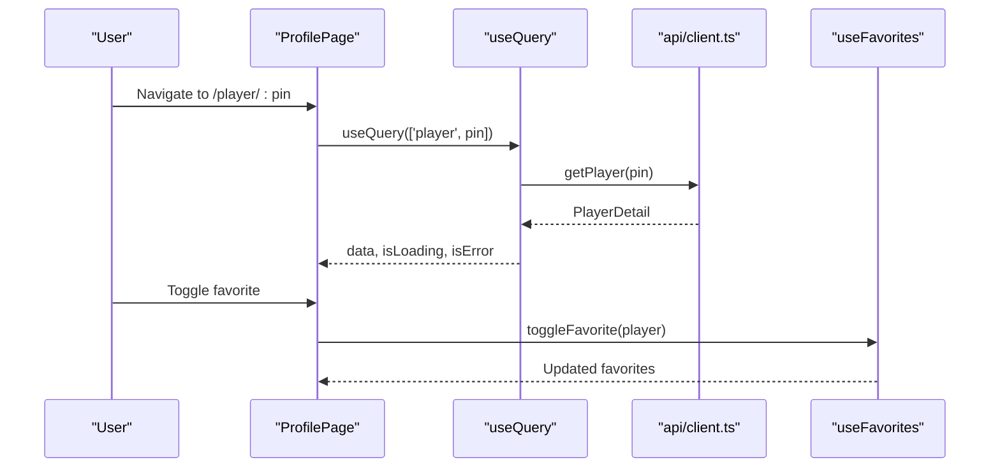
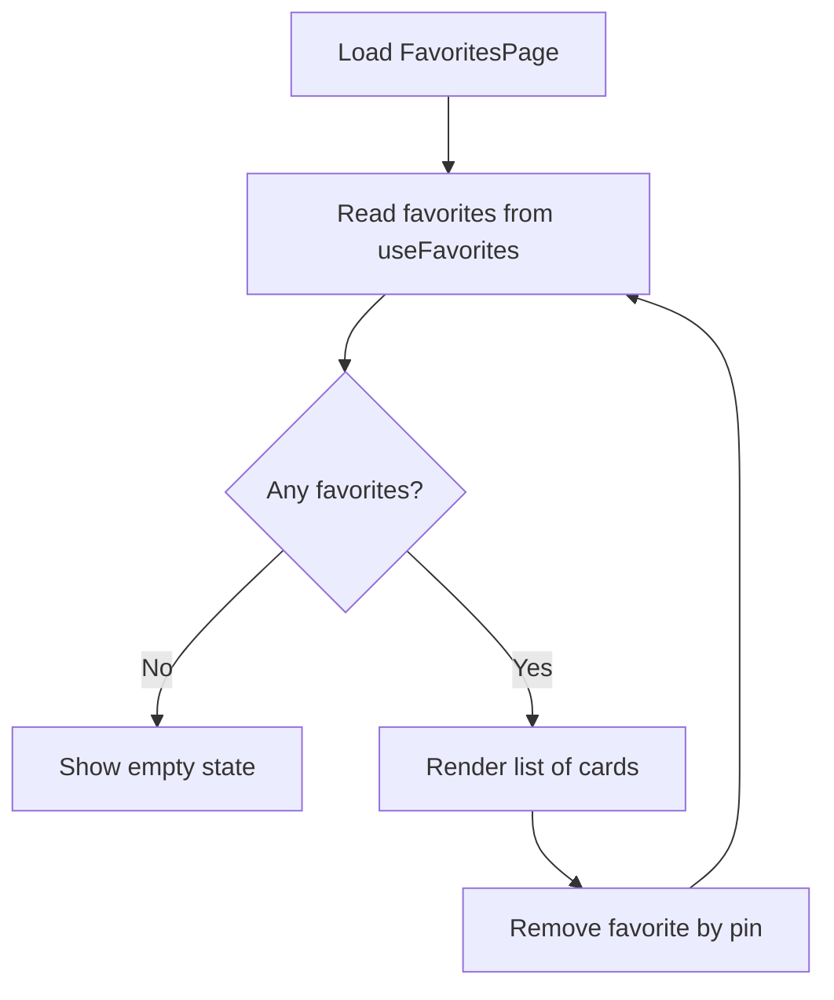
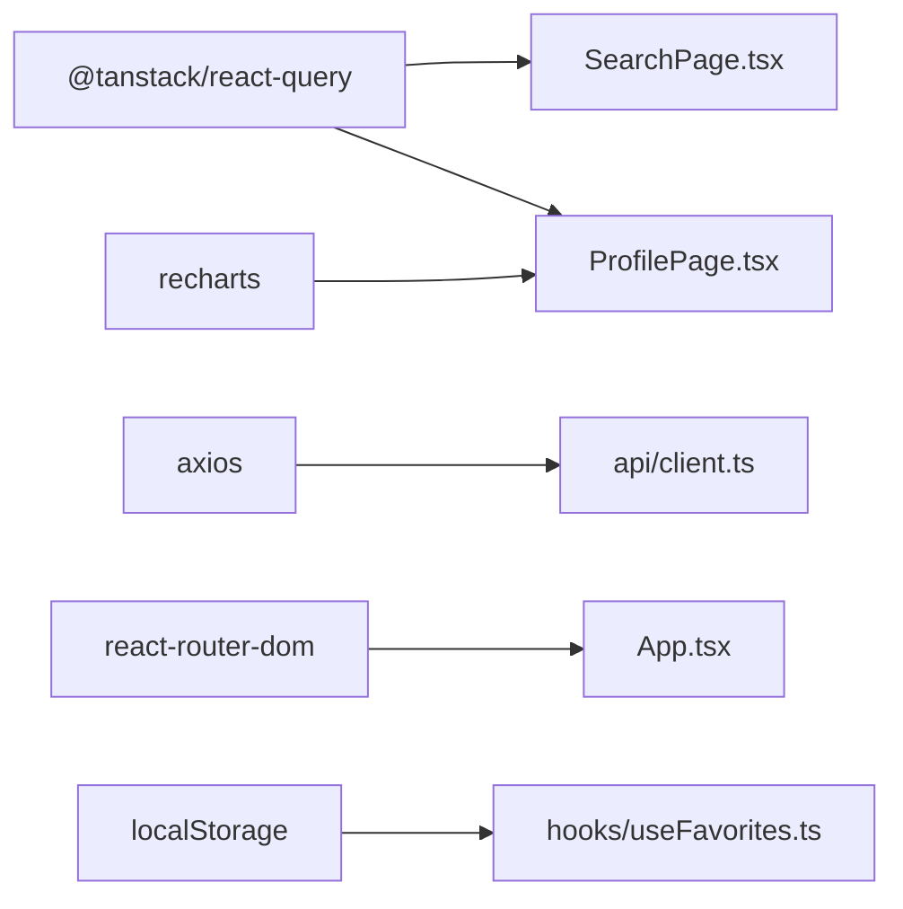

# State Management

<cite>
**Referenced Files in This Document**
- [App.tsx](file://frontend/src/App.tsx)
- [main.tsx](file://frontend/src/main.tsx)
- [client.ts](file://frontend/src/api/client.ts)
- [useFavorites.ts](file://frontend/src/hooks/useFavorites.ts)
- [SearchPage.tsx](file://frontend/src/pages/SearchPage.tsx)
- [ProfilePage.tsx](file://frontend/src/pages/ProfilePage.tsx)
- [FavoritesPage.tsx](file://frontend/src/pages/FavoritesPage.tsx)
- [package.json](file://frontend/package.json)
</cite>

## Table of Contents
1. Introduction
2. Project Structure
3. Core Components
4. Architecture Overview
5. Detailed Component Analysis
6. Dependency Analysis
7. Performance Considerations
8. Troubleshooting Guide
9. Conclusion

## Introduction
This document explains the state management architecture of the frontend, focusing on:
- Server state handling with TanStack Query (React Query v5)
- Client state persistence using a custom useFavorites hook backed by localStorage
- Separation of server state vs client state
- Caching strategies and data fetching patterns
- Error handling and loading states
- Data synchronization between server and local storage

The application uses React 19, TanStack Query for server state, Axios for HTTP requests, and React Router for navigation.

## Project Structure
The relevant parts of the frontend are organized as follows:
- App-level configuration for TanStack Query is provided at the root component
- API clients define typed endpoints and HTTP calls
- Pages consume server state via useQuery and client state via useFavorites
- The custom hook persists favorites to localStorage

**Diagram sources**
- [App.tsx:1-37](file://frontend/src/App.tsx#L1-L37)
- [SearchPage.tsx:1-240](file://frontend/src/pages/SearchPage.tsx#L1-L240)
- [ProfilePage.tsx:1-375](file://frontend/src/pages/ProfilePage.tsx#L1-L375)
- [FavoritesPage.tsx:1-103](file://frontend/src/pages/FavoritesPage.tsx#L1-L103)
- [client.ts:1-86](file://frontend/src/api/client.ts#L1-L86)
- [useFavorites.ts:1-49](file://frontend/src/hooks/useFavorites.ts#L1-L49)

**Section sources**
- [App.tsx:1-37](file://frontend/src/App.tsx#L1-L37)
- [main.tsx:1-11](file://frontend/src/main.tsx#L1-L11)

## Core Components
- QueryClient configuration:
  - Global defaults include retry count and staleTime
  - Provider wraps the entire app tree
- API client:
  - Centralized Axios instance with baseURL
  - Typed functions for search, player detail, tournaments, and chat
- Custom hook:
  - useFavorites manages an array of favorite players persisted to localStorage
  - Provides add/remove/toggle/isFavorite utilities

Key responsibilities:
- Server state: fetched via useQuery with query keys and options
- Client state: managed locally via useState and useEffect inside useFavorites
- Persistence: automatic sync to localStorage on changes

**Section sources**
- [App.tsx:9-16](file://frontend/src/App.tsx#L9-L16)
- [client.ts:1-86](file://frontend/src/api/client.ts#L1-L86)
- [useFavorites.ts:1-49](file://frontend/src/hooks/useFavorites.ts#L1-L49)

## Architecture Overview
The system separates server state from client state:
- Server state is cached and deduplicated by TanStack Query
- Client state (favorites) is isolated in a local hook and persisted to localStorage
- UI components compose both states without tight coupling

**Diagram sources**
- [SearchPage.tsx:18-23](file://frontend/src/pages/SearchPage.tsx#L18-L23)
- [client.ts:59-62](file://frontend/src/api/client.ts#L59-L62)
- [useFavorites.ts:20-45](file://frontend/src/hooks/useFavorites.ts#L20-L45)

## Detailed Component Analysis

### QueryClient Configuration
- Created once at app level and provided via QueryClientProvider
- Default options:
  - retry: limited number of retries for failed queries
  - staleTime: time before a query is considered stale and eligible for refetching
- Provider placement ensures all child components can access the client

**Diagram sources**
- [App.tsx:9-16](file://frontend/src/App.tsx#L9-L16)
- [App.tsx:18-36](file://frontend/src/App.tsx#L18-L36)

**Section sources**
- [App.tsx:9-16](file://frontend/src/App.tsx#L9-L16)
- [App.tsx:18-36](file://frontend/src/App.tsx#L18-L36)

### API Client and Data Fetching Patterns
- Axios instance configured with baseURL
- Typed interfaces for responses and payloads
- Functions encapsulate HTTP calls and return promises with typed data
- Pages call these functions within useQuery’s queryFn

**Diagram sources**
- [client.ts:1-86](file://frontend/src/api/client.ts#L1-L86)

**Section sources**
- [client.ts:1-86](file://frontend/src/api/client.ts#L1-L86)

### useFavorites Hook (Local Storage Persistence)
Responsibilities:
- Initialize state from localStorage safely
- Persist state changes back to localStorage
- Provide immutable-like operations (add, remove, toggle, check)
- Memoize callbacks to avoid unnecessary re-renders

**Diagram sources**
- [useFavorites.ts:1-49](file://frontend/src/hooks/useFavorites.ts#L1-L49)

**Section sources**
- [useFavorites.ts:1-49](file://frontend/src/hooks/useFavorites.ts#L1-L49)

### Search Page: Server State + Local Favorites
- Debounces user input to reduce network calls
- Uses useQuery with a stable query key including the debounced query
- Displays loading and error states
- Integrates with useFavorites to mark/unmark favorites

**Diagram sources**
- [SearchPage.tsx:13-23](file://frontend/src/pages/SearchPage.tsx#L13-L23)
- [SearchPage.tsx:109-115](file://frontend/src/pages/SearchPage.tsx#L109-L115)
- [client.ts:59-62](file://frontend/src/api/client.ts#L59-L62)
- [useFavorites.ts:36-45](file://frontend/src/hooks/useFavorites.ts#L36-L45)

**Section sources**
- [SearchPage.tsx:13-23](file://frontend/src/pages/SearchPage.tsx#L13-L23)
- [SearchPage.tsx:70-81](file://frontend/src/pages/SearchPage.tsx#L70-L81)
- [SearchPage.tsx:109-115](file://frontend/src/pages/SearchPage.tsx#L109-L115)

### Profile Page: Detail View with Chart and Favorites
- Fetches player details by PIN using useQuery
- Renders loading and error screens
- Computes chart data and peak rating
- Integrates with useFavorites for persistent favorite status

**Diagram sources**
- [ProfilePage.tsx:16-20](file://frontend/src/pages/ProfilePage.tsx#L16-L20)
- [ProfilePage.tsx:93-96](file://frontend/src/pages/ProfilePage.tsx#L93-L96)
- [client.ts:64-67](file://frontend/src/api/client.ts#L64-L67)
- [useFavorites.ts:36-45](file://frontend/src/hooks/useFavorites.ts#L36-L45)

**Section sources**
- [ProfilePage.tsx:16-20](file://frontend/src/pages/ProfilePage.tsx#L16-L20)
- [ProfilePage.tsx:22-42](file://frontend/src/pages/ProfilePage.tsx#L22-L42)
- [ProfilePage.tsx:93-96](file://frontend/src/pages/ProfilePage.tsx#L93-L96)

### Favorites Page: Local State Display
- Reads favorites from useFavorites
- Allows removal of entries
- Navigates to profile pages

**Diagram sources**
- [FavoritesPage.tsx:4-6](file://frontend/src/pages/FavoritesPage.tsx#L4-L6)
- [FavoritesPage.tsx:42-43](file://frontend/src/pages/FavoritesPage.tsx#L42-L43)
- [useFavorites.ts:27-29](file://frontend/src/hooks/useFavorites.ts#L27-L29)

**Section sources**
- [FavoritesPage.tsx:4-6](file://frontend/src/pages/FavoritesPage.tsx#L4-L6)
- [FavoritesPage.tsx:8-22](file://frontend/src/pages/FavoritesPage.tsx#L8-L22)
- [FavoritesPage.tsx:42-43](file://frontend/src/pages/FavoritesPage.tsx#L42-L43)

## Dependency Analysis
- TanStack Query provides global caching and lifecycle management
- Axios handles HTTP transport
- React Router drives navigation
- Recharts renders charts in profile view
- LocalStorage persists client state

**Diagram sources**
- [package.json:12-18](file://frontend/package.json#L12-L18)
- [App.tsx:1-37](file://frontend/src/App.tsx#L1-L37)
- [SearchPage.tsx:1-240](file://frontend/src/pages/SearchPage.tsx#L1-L240)
- [ProfilePage.tsx:1-375](file://frontend/src/pages/ProfilePage.tsx#L1-L375)
- [client.ts:1-86](file://frontend/src/api/client.ts#L1-L86)
- [useFavorites.ts:1-49](file://frontend/src/hooks/useFavorites.ts#L1-L49)

**Section sources**
- [package.json:12-18](file://frontend/package.json#L12-L18)

## Performance Considerations
- Stale time tuning:
  - Global staleTime set to a moderate value; per-query overrides used where appropriate
- Retry policy:
  - Limited retries to avoid excessive network load
- Debouncing:
  - Search input is debounced to reduce request volume
- Memoization:
  - Callbacks in useFavorites are memoized to prevent unnecessary re-renders
- Rendering optimization:
  - useMemo used in profile page to compute chart data and peak rating

[No sources needed since this section provides general guidance]

## Troubleshooting Guide
Common issues and resolutions:
- No results or empty cache:
  - Ensure queryKey matches exactly across calls
  - Verify enabled conditions (e.g., minimum query length)
- Network errors:
  - Check backend availability and CORS settings
  - Review error states rendered in pages
- Favorites not persisting:
  - Confirm localStorage is available and not blocked
  - Validate JSON serialization/deserialization in the hook
- Excessive re-renders:
  - Ensure callback stability in useFavorites
  - Avoid recreating objects/arrays inline in render paths

**Section sources**
- [SearchPage.tsx:70-81](file://frontend/src/pages/SearchPage.tsx#L70-L81)
- [ProfilePage.tsx:22-42](file://frontend/src/pages/ProfilePage.tsx#L22-L42)
- [useFavorites.ts:7-18](file://frontend/src/hooks/useFavorites.ts#L7-L18)

## Conclusion
The application cleanly separates server state (managed by TanStack Query) from client state (managed by useFavorites). This separation improves performance through caching and deduplication while ensuring user preferences persist across sessions. The design is modular, testable, and extensible, allowing future enhancements such as background refetching, optimistic updates, and more sophisticated cache invalidation strategies.