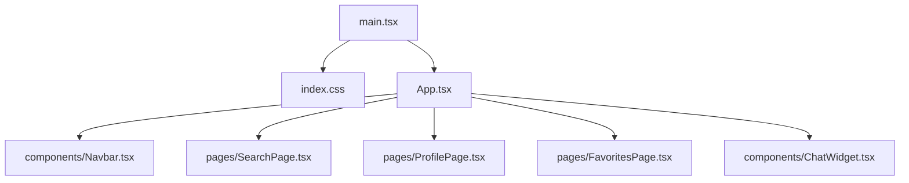
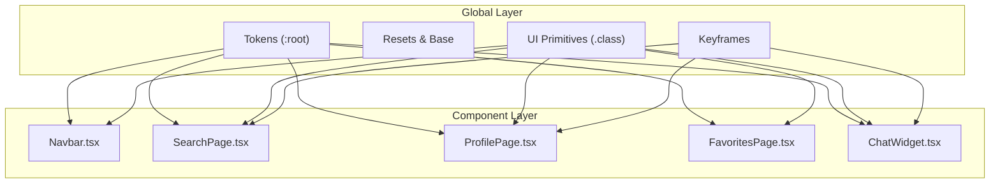
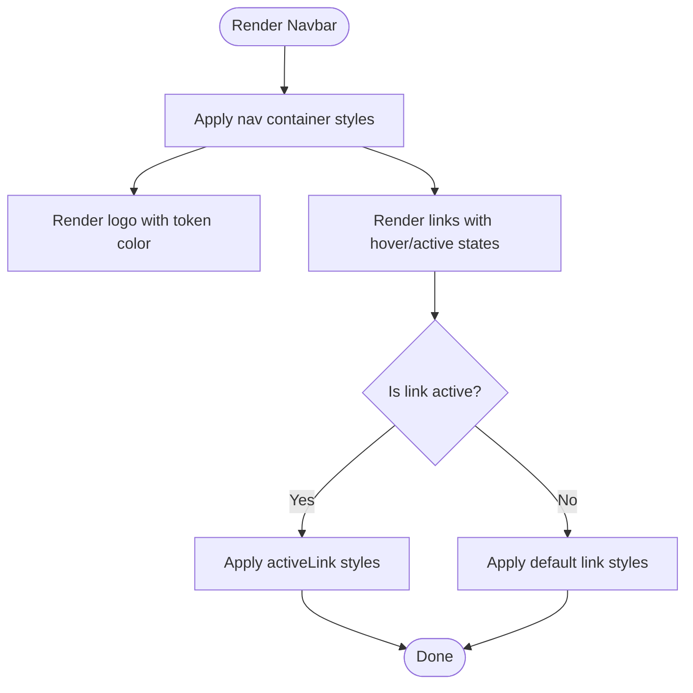
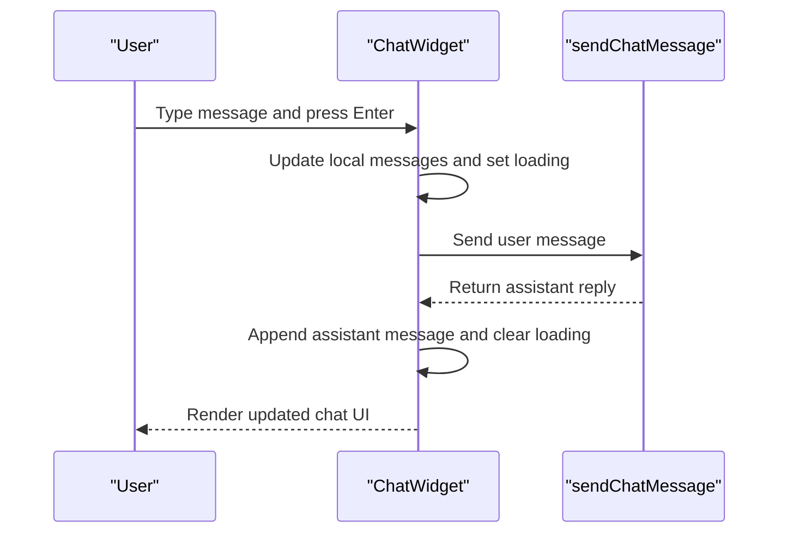
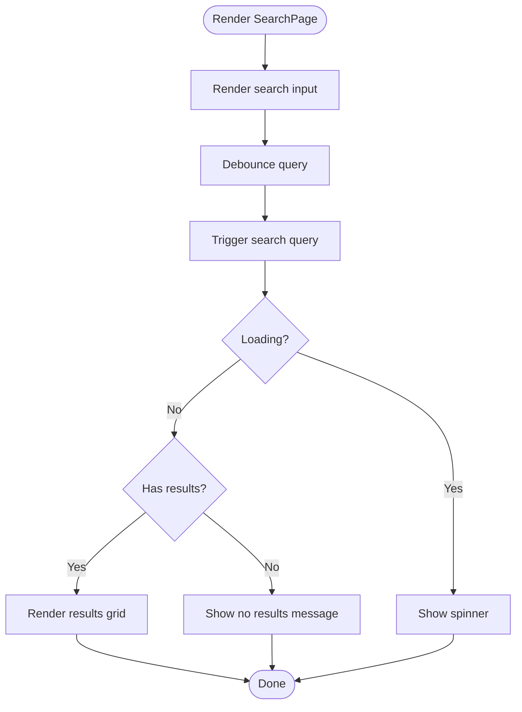
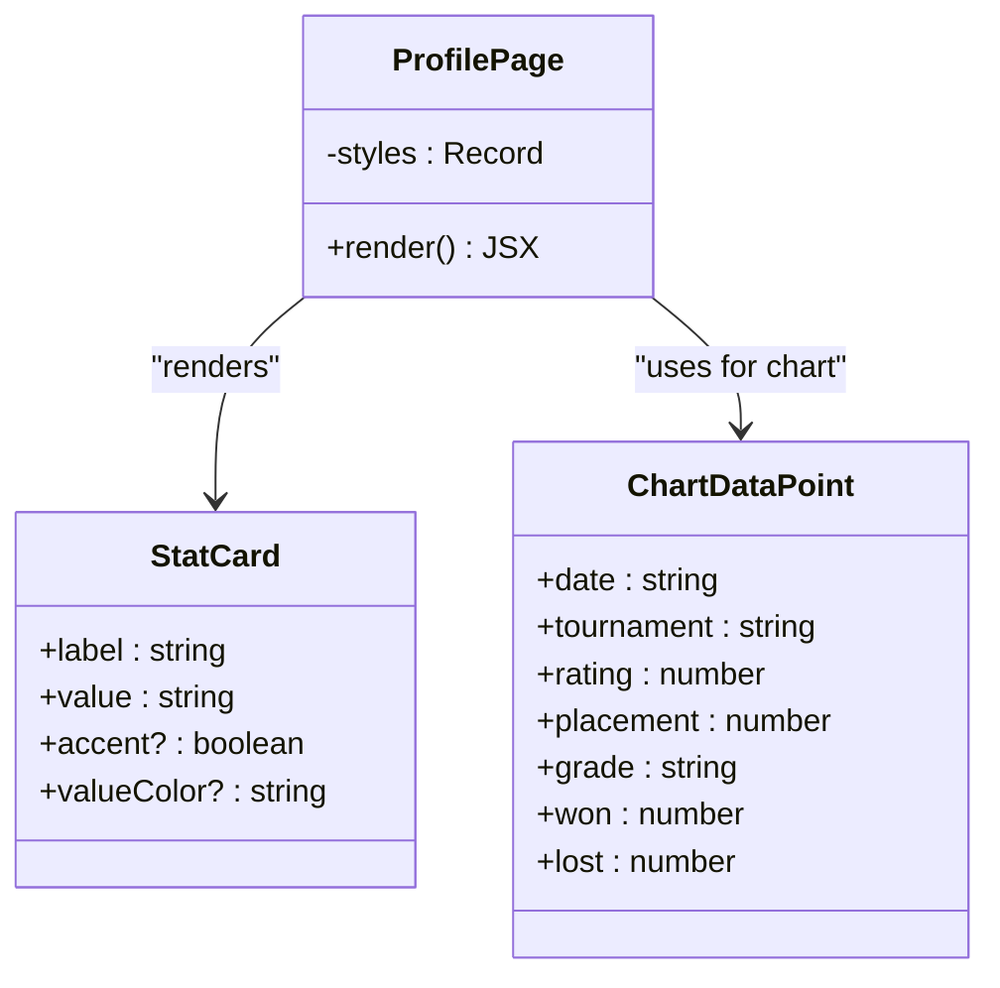
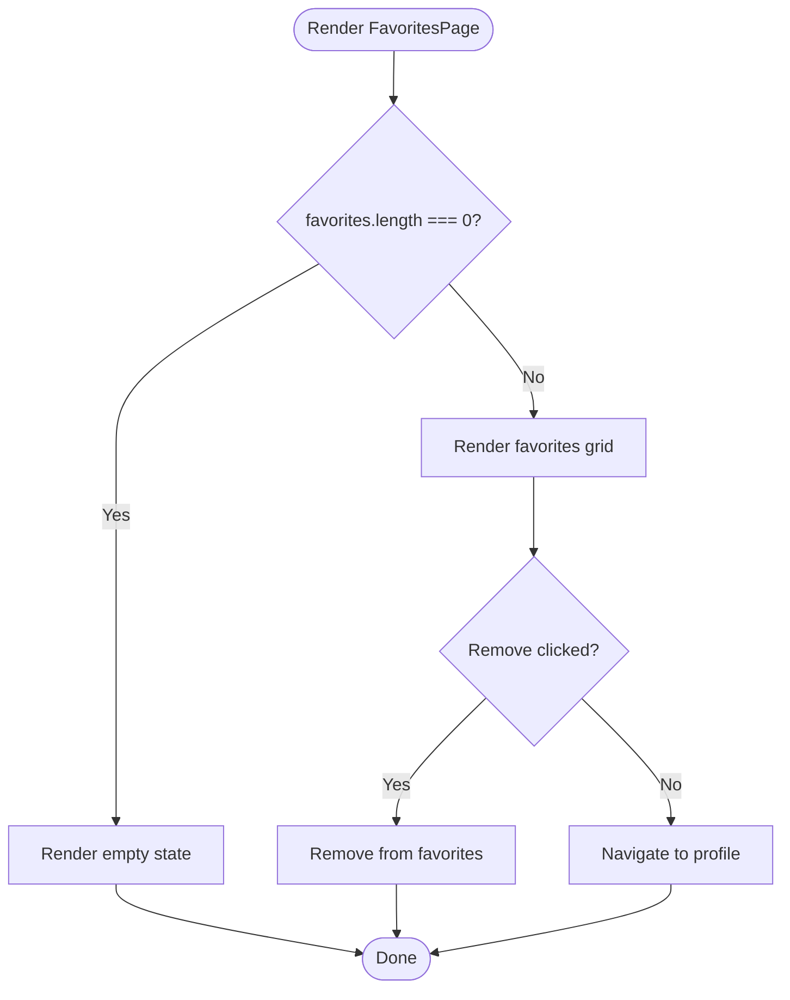
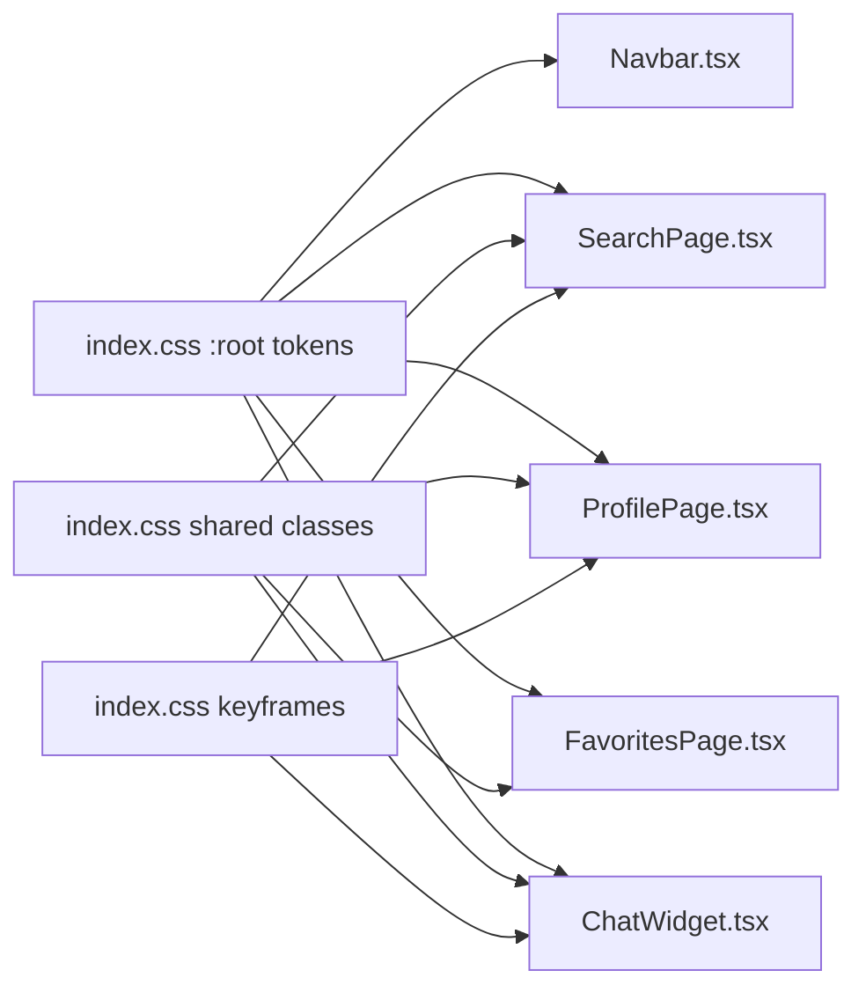
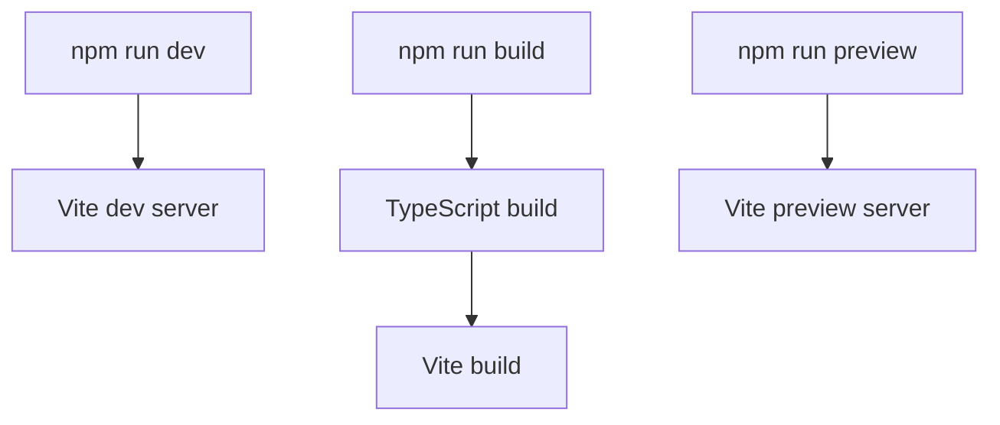

# Styling System

<cite>
**Referenced Files in This Document**
- [index.css](file://frontend/src/index.css)
- [vite.config.ts](file://frontend/vite.config.ts)
- [package.json](file://frontend/package.json)
- [main.tsx](file://frontend/src/main.tsx)
- [App.tsx](file://frontend/src/App.tsx)
- [Navbar.tsx](file://frontend/src/components/Navbar.tsx)
- [ChatWidget.tsx](file://frontend/src/components/ChatWidget.tsx)
- [SearchPage.tsx](file://frontend/src/pages/SearchPage.tsx)
- [ProfilePage.tsx](file://frontend/src/pages/ProfilePage.tsx)
- [FavoritesPage.tsx](file://frontend/src/pages/FavoritesPage.tsx)
</cite>

## Table of Contents
1. [Introduction](#introduction)
2. [Project Structure](#project-structure)
3. [Core Components](#core-components)
4. [Architecture Overview](#architecture-overview)
5. [Detailed Component Analysis](#detailed-component-analysis)
6. [Dependency Analysis](#dependency-analysis)
7. [Performance Considerations](#performance-considerations)
8. [Troubleshooting Guide](#troubleshooting-guide)
9. [Conclusion](#conclusion)

## Introduction
This document explains the Go-themed styling system and CSS architecture used by the frontend application. It covers:
- CSS custom properties (design tokens) for color, typography, and layout
- Global styles and animations
- Responsive design patterns
- Component-specific styles using a hybrid approach: shared CSS classes plus inline styles via React’s style objects
- Build configuration with Vite for CSS processing
- The absence of CSS-in-JS libraries; instead, the app uses inline styles and global CSS together

The goal is to provide both high-level guidance and code-level references so that developers can extend or modify the theme consistently.

## Project Structure
Styling-related files are organized as follows:
- Global stylesheet: index.css
- Entry point imports the global stylesheet: main.tsx
- Application shell sets base background and layout: App.tsx
- Components and pages use a mix of:
  - Shared CSS classes defined in index.css (e.g., search-input, player-card, stone-badge)
  - Inline styles defined as TypeScript objects within each component

**Diagram sources**
- [main.tsx:1-11](file://frontend/src/main.tsx#L1-L11)
- [index.css:1-313](file://frontend/src/index.css#L1-L313)
- [App.tsx:1-37](file://frontend/src/App.tsx#L1-L37)
- [Navbar.tsx:1-94](file://frontend/src/components/Navbar.tsx#L1-L94)
- [SearchPage.tsx:1-240](file://frontend/src/pages/SearchPage.tsx#L1-L240)
- [ProfilePage.tsx:1-375](file://frontend/src/pages/ProfilePage.tsx#L1-L375)
- [FavoritesPage.tsx:1-103](file://frontend/src/pages/FavoritesPage.tsx#L1-L103)
- [ChatWidget.tsx:1-240](file://frontend/src/components/ChatWidget.tsx#L1-L240)

**Section sources**
- [main.tsx:1-11](file://frontend/src/main.tsx#L1-L11)
- [index.css:1-313](file://frontend/src/index.css#L1-L313)
- [App.tsx:1-37](file://frontend/src/App.tsx#L1-L37)

## Core Components
This section documents the foundational styling layers: design tokens, global resets, typography, animations, and reusable UI primitives.

### Design Tokens (CSS Custom Properties)
Global tokens are declared under :root and include:
- Wood palette: light, base, dark
- Slate tones: base and light variants
- Stone black and white
- Accent color
- Text colors: primary and light
- Backgrounds: page background and card background
- Border color

These tokens are consumed across components via var(--token-name).

**Section sources**
- [index.css:7-21](file://frontend/src/index.css#L7-L21)

### Global Resets and Base Styles
- Universal box-sizing reset
- Body font stack and smoothing settings
- Background and text color defaults
- Link and form element inheritance rules

**Section sources**
- [index.css:1-30](file://frontend/src/index.css#L1-L30)

### Animations and Keyframes
Reusable keyframe animations:
- spin
- pulse
- fadeIn
- stoneDrop

These are referenced by components for loading indicators, transitions, and micro-interactions.

**Section sources**
- [index.css:40-57](file://frontend/src/index.css#L40-L57)

### Reusable UI Primitives (Shared Classes)
- Search input and wrapper: .search-input, .search-wrapper, focus-within state
- Grade badge: .stone-badge with .stone-black and .stone-white variants
- Card hover effect: .player-card
- Scrollbar customization
- Go board grid background pattern: .go-grid-bg

These classes are applied in multiple pages and components to ensure consistent look and feel.

**Section sources**
- [index.css:71-154](file://frontend/src/index.css#L71-L154)
- [index.css:32-38](file://frontend/src/index.css#L32-L38)

### Typography System
- Font families: system fonts and web-safe fallbacks
- Heading styles with responsive sizing via media queries
- Code block styling with monospace font and background
- Base body font size and line-height

Responsive adjustments are implemented using @media queries for smaller screens.

**Section sources**
- [index.css:23-30](file://frontend/src/index.css#L23-L30)
- [index.css:270-312](file://frontend/src/index.css#L270-L312)

### Color Scheme
- Light theme tokens define wood, slate, stone, accent, backgrounds, borders, and text
- Components reference these tokens to maintain consistency
- Some components also apply direct hex values for gradients and shadows

**Section sources**
- [index.css:7-21](file://frontend/src/index.css#L7-L21)
- [Navbar.tsx:37-93](file://frontend/src/components/Navbar.tsx#L37-L93)
- [ChatWidget.tsx:152-239](file://frontend/src/components/ChatWidget.tsx#L152-L239)
- [SearchPage.tsx:179-239](file://frontend/src/pages/SearchPage.tsx#L179-L239)
- [ProfilePage.tsx:287-374](file://frontend/src/pages/ProfilePage.tsx#L287-L374)
- [FavoritesPage.tsx:65-102](file://frontend/src/pages/FavoritesPage.tsx#L65-L102)

### Responsive Design Patterns
- Grid layouts using auto-fill and minmax for cards
- Media queries for heading sizes and root font size
- Flexible containers with max-width and centering

Examples:
- Player cards grid
- Header typography scaling
- Root font size adaptation

**Section sources**
- [SearchPage.tsx:211-214](file://frontend/src/pages/SearchPage.tsx#L211-L214)
- [index.css:229-232](file://frontend/src/index.css#L229-L232)
- [index.css:277-294](file://frontend/src/index.css#L277-L294)

## Architecture Overview
The styling architecture combines:
- Global CSS for tokens, resets, animations, and shared classes
- Inline styles for component-specific layout and theming
- No CSS-in-JS library; styling is achieved through React style objects and CSS variables

**Diagram sources**
- [index.css:7-21](file://frontend/src/index.css#L7-L21)
- [index.css:1-30](file://frontend/src/index.css#L1-L30)
- [index.css:40-57](file://frontend/src/index.css#L40-L57)
- [index.css:71-154](file://frontend/src/index.css#L71-L154)
- [Navbar.tsx:37-93](file://frontend/src/components/Navbar.tsx#L37-L93)
- [SearchPage.tsx:179-239](file://frontend/src/pages/SearchPage.tsx#L179-L239)
- [ProfilePage.tsx:287-374](file://frontend/src/pages/ProfilePage.tsx#L287-L374)
- [FavoritesPage.tsx:65-102](file://frontend/src/pages/FavoritesPage.tsx#L65-L102)
- [ChatWidget.tsx:152-239](file://frontend/src/components/ChatWidget.tsx#L152-L239)

## Detailed Component Analysis

### Navbar
- Uses inline styles for sticky positioning, spacing, and navigation links
- Applies token-based colors for logo and active link states
- Integrates a stone-like icon using radial gradient and shadow

**Diagram sources**
- [Navbar.tsx:3-35](file://frontend/src/components/Navbar.tsx#L3-L35)
- [Navbar.tsx:37-93](file://frontend/src/components/Navbar.tsx#L37-L93)

**Section sources**
- [Navbar.tsx:1-94](file://frontend/src/components/Navbar.tsx#L1-L94)

### ChatWidget
- Floating action button and chat window positioned fixed at bottom-right
- Message bubbles styled with token-based backgrounds and borders
- Quick prompts and input area leverage shared classes and tokens
- Uses pulse animation for tool status indicator

**Diagram sources**
- [ChatWidget.tsx:16-37](file://frontend/src/components/ChatWidget.tsx#L16-L37)
- [ChatWidget.tsx:152-239](file://frontend/src/components/ChatWidget.tsx#L152-L239)

**Section sources**
- [ChatWidget.tsx:1-240](file://frontend/src/components/ChatWidget.tsx#L1-L240)

### SearchPage
- Hero section with title, subtitle, and search form
- Results grid using CSS grid with auto-fill and minmax
- Loading spinner and error states styled with tokens
- Grade badges and flags rendered with shared classes

**Diagram sources**
- [SearchPage.tsx:7-28](file://frontend/src/pages/SearchPage.tsx#L7-L28)
- [SearchPage.tsx:179-239](file://frontend/src/pages/SearchPage.tsx#L179-L239)

**Section sources**
- [SearchPage.tsx:1-240](file://frontend/src/pages/SearchPage.tsx#L1-L240)

### ProfilePage
- Header with photo or grade badge, name, and metadata
- Stats grid with accent variant for grade
- Rating evolution chart using Recharts with token-based colors
- Tournament history table with alternating row styles

**Diagram sources**
- [ProfilePage.tsx:11-238](file://frontend/src/pages/ProfilePage.tsx#L11-L238)
- [ProfilePage.tsx:276-285](file://frontend/src/pages/ProfilePage.tsx#L276-L285)
- [ProfilePage.tsx:241-251](file://frontend/src/pages/ProfilePage.tsx#L241-L251)

**Section sources**
- [ProfilePage.tsx:1-375](file://frontend/src/pages/ProfilePage.tsx#L1-L375)

### FavoritesPage
- Empty state with call-to-action to search players
- Grid of favorite player cards with remove functionality
- Consistent use of shared classes and tokens

**Diagram sources**
- [FavoritesPage.tsx:4-62](file://frontend/src/pages/FavoritesPage.tsx#L4-L62)
- [FavoritesPage.tsx:65-102](file://frontend/src/pages/FavoritesPage.tsx#L65-L102)

**Section sources**
- [FavoritesPage.tsx:1-103](file://frontend/src/pages/FavoritesPage.tsx#L1-L103)

## Dependency Analysis
Styling dependencies flow from global tokens and shared classes into components. Components primarily rely on inline styles but reuse shared classes for consistent UI elements.

**Diagram sources**
- [index.css:7-21](file://frontend/src/index.css#L7-L21)
- [index.css:71-154](file://frontend/src/index.css#L71-L154)
- [index.css:40-57](file://frontend/src/index.css#L40-L57)
- [Navbar.tsx:37-93](file://frontend/src/components/Navbar.tsx#L37-L93)
- [SearchPage.tsx:179-239](file://frontend/src/pages/SearchPage.tsx#L179-L239)
- [ProfilePage.tsx:287-374](file://frontend/src/pages/ProfilePage.tsx#L287-L374)
- [FavoritesPage.tsx:65-102](file://frontend/src/pages/FavoritesPage.tsx#L65-L102)
- [ChatWidget.tsx:152-239](file://frontend/src/components/ChatWidget.tsx#L152-L239)

**Section sources**
- [index.css:7-21](file://frontend/src/index.css#L7-L21)
- [index.css:71-154](file://frontend/src/index.css#L71-L154)
- [index.css:40-57](file://frontend/src/index.css#L40-L57)
- [Navbar.tsx:37-93](file://frontend/src/components/Navbar.tsx#L37-L93)
- [SearchPage.tsx:179-239](file://frontend/src/pages/SearchPage.tsx#L179-L239)
- [ProfilePage.tsx:287-374](file://frontend/src/pages/ProfilePage.tsx#L287-L374)
- [FavoritesPage.tsx:65-102](file://frontend/src/pages/FavoritesPage.tsx#L65-L102)
- [ChatWidget.tsx:152-239](file://frontend/src/components/ChatWidget.tsx#L152-L239)

## Performance Considerations
- Prefer CSS variables for frequently changing theme values to avoid re-renders caused by inline style updates
- Use shared classes for static styles to reduce inline style object size
- Keep animations minimal and hardware-accelerated where possible (transform, opacity)
- Avoid excessive inline style computations inside render loops; memoize when necessary

[No sources needed since this section provides general guidance]

## Troubleshooting Guide
Common issues and resolutions:
- Token not found: Ensure the CSS variable is defined in :root and correctly referenced via var(--name)
- Class not applied: Verify className usage matches the exact class name defined in index.css
- Animation not visible: Confirm keyframes are defined and referenced by the same animation name
- Responsive behavior unexpected: Check media queries and ensure breakpoints align with intended layout changes

**Section sources**
- [index.css:7-21](file://frontend/src/index.css#L7-L21)
- [index.css:71-154](file://frontend/src/index.css#L71-L154)
- [index.css:40-57](file://frontend/src/index.css#L40-L57)

## Conclusion
The styling system blends global CSS tokens and shared classes with component-level inline styles. This hybrid approach offers flexibility while maintaining visual consistency. By centralizing design tokens and animations in index.css and leveraging CSS variables throughout components, the application achieves a cohesive Go-themed aesthetic. The build setup relies on Vite with the React plugin, processing CSS without additional preprocessors or CSS-in-JS libraries.

[No sources needed since this section summarizes without analyzing specific files]

## Appendix

### Build Configuration with Vite
- Vite config includes the React plugin for JSX/TSX support
- Scripts in package.json provide dev, build, lint, and preview commands
- CSS is processed by Vite’s default pipeline; no extra plugins are configured for CSS preprocessing

**Diagram sources**
- [vite.config.ts:1-8](file://frontend/vite.config.ts#L1-L8)
- [package.json:6-11](file://frontend/package.json#L6-L11)

**Section sources**
- [vite.config.ts:1-8](file://frontend/vite.config.ts#L1-L8)
- [package.json:1-30](file://frontend/package.json#L1-L30)

### CSS-in-JS Patterns
- No external CSS-in-JS library is used
- Inline styles are implemented via TypeScript objects typed as React.CSSProperties
- Shared styles are centralized in index.css and reused through className assignments

**Section sources**
- [Navbar.tsx:37-93](file://frontend/src/components/Navbar.tsx#L37-L93)
- [SearchPage.tsx:179-239](file://frontend/src/pages/SearchPage.tsx#L179-L239)
- [ProfilePage.tsx:287-374](file://frontend/src/pages/ProfilePage.tsx#L287-L374)
- [FavoritesPage.tsx:65-102](file://frontend/src/pages/FavoritesPage.tsx#L65-L102)
- [ChatWidget.tsx:152-239](file://frontend/src/components/ChatWidget.tsx#L152-L239)