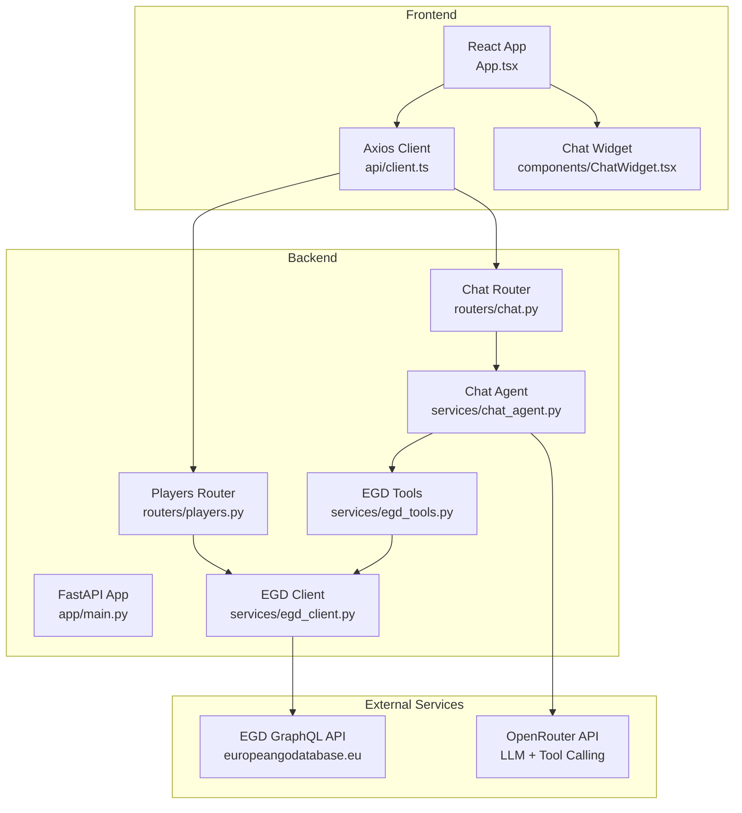
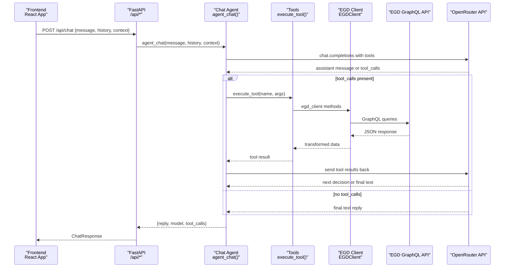
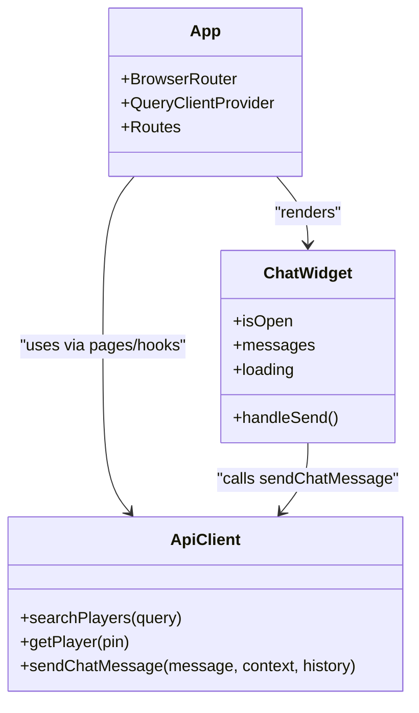
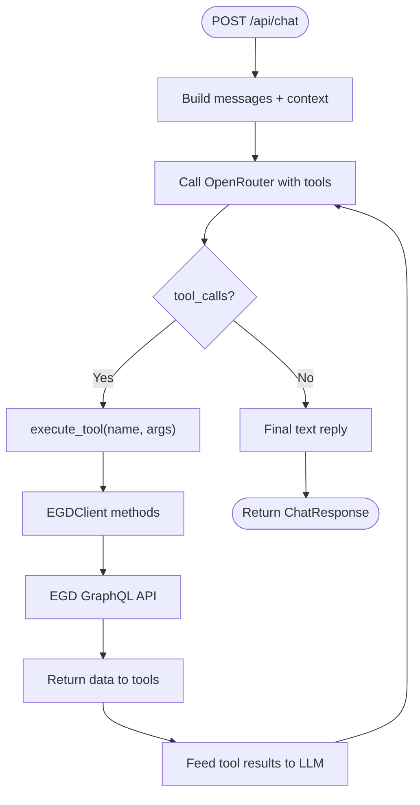
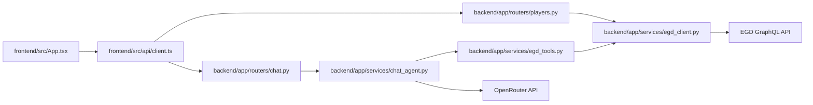

# System Overview

<cite>
**Referenced Files in This Document**
- [README.md](file://README.md)
- [ARCHITECTURE.md](file://docs/ARCHITECTURE.md)
- [main.py](file://backend/app/main.py)
- [players.py](file://backend/app/routers/players.py)
- [chat.py](file://backend/app/routers/chat.py)
- [egd_client.py](file://backend/app/services/egd_client.py)
- [chat_agent.py](file://backend/app/services/chat_agent.py)
- [egd_tools.py](file://backend/app/services/egd_tools.py)
- [client.ts](file://frontend/src/api/client.ts)
- [App.tsx](file://frontend/src/App.tsx)
- [ChatWidget.tsx](file://frontend/src/components/ChatWidget.tsx)
- [requirements.txt](file://backend/requirements.txt)
- [package.json](file://frontend/package.json)
</cite>

## Table of Contents
1. [Introduction](#introduction)
2. [Project Structure](#project-structure)
3. [Core Components](#core-components)
4. [Architecture Overview](#architecture-overview)
5. [Detailed Component Analysis](#detailed-component-analysis)
6. [Dependency Analysis](#dependency-analysis)
7. [Performance Considerations](#performance-considerations)
8. [Troubleshooting Guide](#troubleshooting-guide)
9. [Conclusion](#conclusion)

## Introduction
GoNow is a full-stack web application that helps users explore and track European Go players using the European Go Database (EGD). The system provides:
- Player search and detailed profiles with rating evolution charts
- Favorites management stored locally in the browser
- An agentic AI chat assistant powered by OpenRouter, which can call EGD tools to retrieve real-time player data and provide insights

The architecture separates concerns across a React frontend, a FastAPI backend, an EGD GraphQL client, and OpenRouter’s AI services. The backend proxies all EGD calls to keep API tokens server-side and implements a tool-calling loop so the LLM can autonomously query EGD data when needed.

## Project Structure
The repository is organized into clear layers:
- Frontend: React + TypeScript app served by Vite, with routing, UI components, and an Axios-based API client
- Backend: FastAPI application exposing REST endpoints for player data and chat; includes routers, services, and models
- External integrations: EGD GraphQL API and OpenRouter AI service

**Diagram sources**
- [App.tsx:1-37](file://frontend/src/App.tsx#L1-L37)
- [client.ts:1-86](file://frontend/src/api/client.ts#L1-L86)
- [ChatWidget.tsx:1-240](file://frontend/src/components/ChatWidget.tsx#L1-L240)
- [main.py:1-42](file://backend/app/main.py#L1-L42)
- [players.py:1-107](file://backend/app/routers/players.py#L1-L107)
- [chat.py:1-95](file://backend/app/routers/chat.py#L1-L95)
- [egd_client.py:1-197](file://backend/app/services/egd_client.py#L1-L197)
- [chat_agent.py:1-154](file://backend/app/services/chat_agent.py#L1-L154)
- [egd_tools.py:1-212](file://backend/app/services/egd_tools.py#L1-L212)

**Section sources**
- [README.md:1-203](file://README.md#L1-L203)
- [ARCHITECTURE.md:1-99](file://docs/ARCHITECTURE.md#L1-L99)

## Core Components
- Frontend
  - React application with routes for Search, Profile, and Favorites pages
  - Axios client encapsulating HTTP calls to the backend
  - Chat widget component providing a floating chat interface
- Backend
  - FastAPI app with CORS configured and routers mounted
  - Players router handling search and profile endpoints
  - Chat router delegating to the agent service
  - EGD client performing GraphQL queries with caching
  - Chat agent implementing the tool-calling loop with OpenRouter
  - EGD tools defining function schemas and execution logic
- External Integrations
  - EGD GraphQL API for authoritative player data
  - OpenRouter API for LLM inference and native tool calling

Technology stack rationale:
- React + TypeScript + Vite for a modern, fast, type-safe frontend
- FastAPI for high-performance async APIs and automatic docs
- httpx for efficient async HTTP requests to EGD GraphQL
- Pydantic for robust request/response modeling
- OpenRouter for flexible model access and built-in tool calling
- In-memory caching to reduce external API load

**Section sources**
- [App.tsx:1-37](file://frontend/src/App.tsx#L1-L37)
- [client.ts:1-86](file://frontend/src/api/client.ts#L1-L86)
- [ChatWidget.tsx:1-240](file://frontend/src/components/ChatWidget.tsx#L1-L240)
- [main.py:1-42](file://backend/app/main.py#L1-L42)
- [players.py:1-107](file://backend/app/routers/players.py#L1-L107)
- [chat.py:1-95](file://backend/app/routers/chat.py#L1-L95)
- [egd_client.py:1-197](file://backend/app/services/egd_client.py#L1-L197)
- [chat_agent.py:1-154](file://backend/app/services/chat_agent.py#L1-L154)
- [egd_tools.py:1-212](file://backend/app/services/egd_tools.py#L1-L212)
- [requirements.txt:1-6](file://backend/requirements.txt#L1-L6)
- [package.json:1-30](file://frontend/package.json#L1-L30)

## Architecture Overview
High-level interactions:
- Frontend communicates with the backend over HTTP for player data and chat
- Backend proxies all EGD GraphQL calls to protect credentials and simplify CORS
- Chat uses OpenRouter’s native tool calling: the LLM decides when to call EGD tools, the backend executes them, and results are fed back until a final answer is produced

**Diagram sources**
- [chat.py:1-95](file://backend/app/routers/chat.py#L1-L95)
- [chat_agent.py:1-154](file://backend/app/services/chat_agent.py#L1-L154)
- [egd_tools.py:1-212](file://backend/app/services/egd_tools.py#L1-L212)
- [egd_client.py:1-197](file://backend/app/services/egd_client.py#L1-L197)

**Section sources**
- [README.md:24-56](file://README.md#L24-L56)
- [ARCHITECTURE.md:7-33](file://docs/ARCHITECTURE.md#L7-L33)

## Detailed Component Analysis

### Frontend Layer
- Routing and state
  - Root component sets up React Router and TanStack Query provider
  - Pages include Search, Profile, and Favorites
- API client
  - Axios instance targets backend base URL
  - Typed interfaces for search responses, player details, and chat messages
- Chat widget
  - Floating UI with quick prompts, typing indicators, and error handling
  - Sends user messages and displays assistant replies

**Diagram sources**
- [App.tsx:1-37](file://frontend/src/App.tsx#L1-L37)
- [ChatWidget.tsx:1-240](file://frontend/src/components/ChatWidget.tsx#L1-L240)
- [client.ts:1-86](file://frontend/src/api/client.ts#L1-L86)

**Section sources**
- [App.tsx:1-37](file://frontend/src/App.tsx#L1-L37)
- [client.ts:1-86](file://frontend/src/api/client.ts#L1-L86)
- [ChatWidget.tsx:1-240](file://frontend/src/components/ChatWidget.tsx#L1-L240)

### Backend Layer
- Application bootstrap
  - Loads environment variables from .env
  - Configures CORS for local development origins
  - Mounts routers for players and chat
- Players router
  - GET /api/search?q=... supports numeric PIN shortcut and name search
  - GET /api/player/{pin} returns enriched profile with rating_history
  - Additional endpoints for games and tournaments
- Chat router
  - POST /api/chat delegates to agent_chat and returns structured response
- EGD client
  - Encapsulates GraphQL queries with in-memory caching (TTL)
  - Provides search, player details, games, and tournament helpers
- Chat agent
  - Implements tool-calling loop with OpenRouter
  - Limits iterations and forces a final text response if needed
- EGD tools
  - Defines function schemas for search_player, get_player_details, get_player_rating_history, get_player_games, compare_players
  - Executes tools by invoking EGD client methods and returning normalized results

**Diagram sources**
- [chat.py:1-95](file://backend/app/routers/chat.py#L1-L95)
- [chat_agent.py:1-154](file://backend/app/services/chat_agent.py#L1-L154)
- [egd_tools.py:1-212](file://backend/app/services/egd_tools.py#L1-L212)
- [egd_client.py:1-197](file://backend/app/services/egd_client.py#L1-L197)

**Section sources**
- [main.py:1-42](file://backend/app/main.py#L1-L42)
- [players.py:1-107](file://backend/app/routers/players.py#L1-L107)
- [chat.py:1-95](file://backend/app/routers/chat.py#L1-L95)
- [egd_client.py:1-197](file://backend/app/services/egd_client.py#L1-L197)
- [chat_agent.py:1-154](file://backend/app/services/chat_agent.py#L1-L154)
- [egd_tools.py:1-212](file://backend/app/services/egd_tools.py#L1-L212)

### Data Flows Between Layers
- Player search flow
  - Frontend calls GET /api/search?q=...
  - Backend checks if query is numeric; if so, performs direct PIN lookup
  - Otherwise, searches by name via EGD GraphQL
  - Returns standardized search results to the frontend
- Player profile flow
  - Frontend calls GET /api/player/{pin}
  - Backend retrieves player details and extracts rating_history from placements
  - Returns enriched profile including biography and chart-ready data
- Agentic chat flow
  - Frontend sends message with optional context and history
  - Backend constructs messages and invokes agent_chat
  - Agent loops with OpenRouter, executing tools as needed
  - Results are returned to the frontend as a final reply

**Section sources**
- [players.py:8-80](file://backend/app/routers/players.py#L8-L80)
- [client.ts:59-85](file://frontend/src/api/client.ts#L59-L85)
- [chat_agent.py:30-154](file://backend/app/services/chat_agent.py#L30-L154)

### Technology Stack Choices and Rationale
- Frontend
  - React 19 + TypeScript for strong typing and modern DX
  - Vite for fast dev server and builds
  - React Router for navigation
  - Recharts for interactive charts
  - TanStack Query for caching and background updates
- Backend
  - Python 3.14 + FastAPI for async performance and auto-generated docs
  - httpx for efficient async HTTP to EGD GraphQL
  - Pydantic for validation and serialization
  - python-dotenv for configuration
- AI Integration
  - OpenRouter for model flexibility and native tool calling
  - Configurable model via CHAT_MODEL; default gemini-2.0-flash-001
- Data Source
  - EGD GraphQL API v2026.02 for authoritative player data

**Section sources**
- [README.md:14-23](file://README.md#L14-L23)
- [ARCHITECTURE.md:35-41](file://docs/ARCHITECTURE.md#L35-L41)
- [requirements.txt:1-6](file://backend/requirements.txt#L1-L6)
- [package.json:12-28](file://frontend/package.json#L12-L28)

## Dependency Analysis
Component relationships and coupling:
- Frontend depends on backend REST endpoints through a typed Axios client
- Backend routers depend on services (EGD client, chat agent, tools)
- Chat agent depends on tools and OpenRouter; tools depend on EGD client
- EGD client depends on environment token and httpx

**Diagram sources**
- [App.tsx:1-37](file://frontend/src/App.tsx#L1-L37)
- [client.ts:1-86](file://frontend/src/api/client.ts#L1-L86)
- [players.py:1-107](file://backend/app/routers/players.py#L1-L107)
- [chat.py:1-95](file://backend/app/routers/chat.py#L1-L95)
- [chat_agent.py:1-154](file://backend/app/services/chat_agent.py#L1-L154)
- [egd_tools.py:1-212](file://backend/app/services/egd_tools.py#L1-L212)
- [egd_client.py:1-197](file://backend/app/services/egd_client.py#L1-L197)

**Section sources**
- [main.py:1-42](file://backend/app/main.py#L1-L42)
- [README.md:57-90](file://README.md#L57-L90)

## Performance Considerations
- In-memory caching in the EGD client reduces repeated GraphQL calls with a configurable TTL
- Async I/O throughout the backend minimizes latency for concurrent requests
- Limiting chat tool-calling iterations prevents excessive round-trips to OpenRouter
- Frontend uses TanStack Query defaults for caching and retries to improve UX

[No sources needed since this section provides general guidance]

## Troubleshooting Guide
Common issues and resolutions:
- Missing OpenRouter key
  - Symptom: Chat returns a message indicating it is not configured
  - Resolution: Add OPENROUTER_API_KEY to backend .env
- EGD token missing or invalid
  - Symptom: GraphQL errors or empty results
  - Resolution: Ensure EGD_API_TOKEN is set in backend .env
- CORS errors during development
  - Symptom: Frontend blocked from calling backend
  - Resolution: Verify allow_origins includes your dev origin (default includes localhost:5173)
- Excessive tool calls or timeouts
  - Symptom: Chat takes too long or fails
  - Resolution: Adjust CHAT_MAX_ITERATIONS and model selection; ensure network stability

**Section sources**
- [chat_agent.py:42-48](file://backend/app/services/chat_agent.py#L42-L48)
- [chat.py:47-94](file://backend/app/routers/chat.py#L47-L94)
- [main.py:20-27](file://backend/app/main.py#L20-L27)
- [egd_client.py:21-42](file://backend/app/services/egd_client.py#L21-L42)

## Conclusion
GoNow combines a modern React frontend with a FastAPI backend to deliver rich player analytics and an agentic AI chat experience. The design keeps sensitive keys server-side, leverages OpenRouter’s native tool calling for autonomous data retrieval, and uses caching to optimize performance. This layered architecture ensures scalability, maintainability, and a smooth user experience.