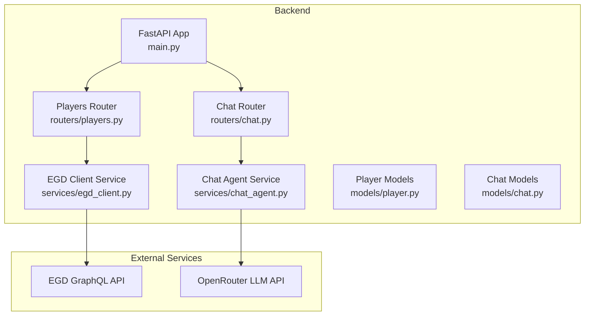
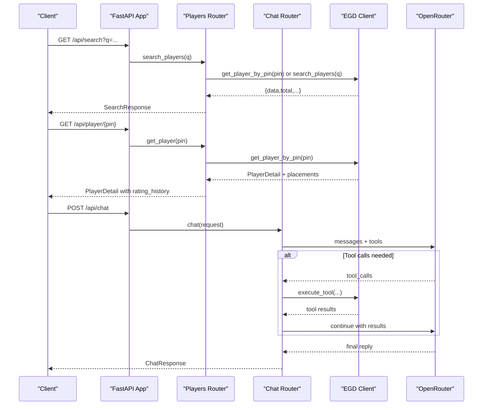
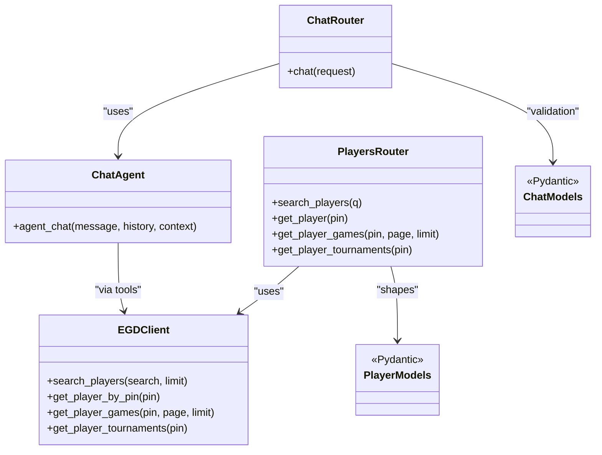

# API Routers

<cite>
**Referenced Files in This Document**
- [main.py](file://backend/app/main.py)
- [players.py](file://backend/app/routers/players.py)
- [chat.py](file://backend/app/routers/chat.py)
- [player.py](file://backend/app/models/player.py)
- [chat.py](file://backend/app/models/chat.py)
- [egd_client.py](file://backend/app/services/egd_client.py)
- [chat_agent.py](file://backend/app/services/chat_agent.py)
- [client.ts](file://frontend/src/api/client.ts)
</cite>

## Table of Contents
1. [Introduction](#introduction)
2. [Project Structure](#project-structure)
3. [Core Components](#core-components)
4. [Architecture Overview](#architecture-overview)
5. [Detailed Component Analysis](#detailed-component-analysis)
6. [Dependency Analysis](#dependency-analysis)
7. [Performance Considerations](#performance-considerations)
8. [Troubleshooting Guide](#troubleshooting-guide)
9. [Conclusion](#conclusion)

## Introduction
This document describes the REST API routers for the GoNow backend, focusing on:
- Player search
- Player profile
- Player game history
- Player tournament history
- AI chat assistant

It includes request/response schemas, authentication notes, error handling behavior, and usage examples. The API is implemented with FastAPI and integrates with the European Go Database (EGD) GraphQL API and an OpenRouter-based LLM service.

## Project Structure
The API is organized into routers, models, services, and a main application entry point. Routers define HTTP endpoints; services encapsulate external calls to EGD and LLM providers; models define Pydantic schemas used for validation and documentation.

**Diagram sources**
- [main.py:14-31](file://backend/app/main.py#L14-L31)
- [players.py:1-107](file://backend/app/routers/players.py#L1-L107)
- [chat.py:1-95](file://backend/app/routers/chat.py#L1-L95)
- [egd_client.py:1-197](file://backend/app/services/egd_client.py#L1-L197)
- [chat_agent.py:1-154](file://backend/app/services/chat_agent.py#L1-L154)

**Section sources**
- [main.py:14-31](file://backend/app/main.py#L14-L31)
- [players.py:1-107](file://backend/app/routers/players.py#L1-L107)
- [chat.py:1-95](file://backend/app/routers/chat.py#L1-L95)

## Core Components
- Players router: exposes player search, profile, games, and tournaments endpoints.
- Chat router: exposes an AI chat endpoint that can call tools to fetch EGD data.
- EGD client: wraps GraphQL queries to the European Go Database with caching.
- Chat agent: orchestrates tool-calling loops with OpenRouter.
- Models: Pydantic schemas for chat requests/responses and player data structures.

Key responsibilities:
- Validate inputs and return structured responses.
- Map EGD data to consistent response shapes.
- Handle errors by raising HTTP exceptions with appropriate status codes.

**Section sources**
- [players.py:1-107](file://backend/app/routers/players.py#L1-L107)
- [chat.py:1-95](file://backend/app/routers/chat.py#L1-L95)
- [egd_client.py:1-197](file://backend/app/services/egd_client.py#L1-L197)
- [chat_agent.py:1-154](file://backend/app/services/chat_agent.py#L1-L154)
- [player.py:1-60](file://backend/app/models/player.py#L1-L60)
- [chat.py:1-21](file://backend/app/models/chat.py#L1-L21)

## Architecture Overview
High-level flow:
- Clients call REST endpoints under /api.
- Routers validate parameters and delegate to services.
- EGD client performs authenticated GraphQL queries with caching.
- Chat agent may call tools to retrieve live data via EGD client before returning final answers.

**Diagram sources**
- [players.py:8-106](file://backend/app/routers/players.py#L8-L106)
- [chat.py:9-24](file://backend/app/routers/chat.py#L9-L24)
- [chat.py:47-94](file://backend/app/routers/chat.py#L47-L94)
- [egd_client.py:44-192](file://backend/app/services/egd_client.py#L44-L192)
- [chat_agent.py:30-153](file://backend/app/services/chat_agent.py#L30-L153)

## Detailed Component Analysis

### Authentication and Security
- External integrations:
  - EGD GraphQL API requires a bearer token provided via environment variable.
  - OpenRouter requires an API key provided via environment variable.
- Internal API endpoints do not implement custom authentication middleware in the current codebase.

Environment variables used:
- EGD_API_TOKEN
- OPENROUTER_API_KEY
- CHAT_MODEL
- CHAT_MAX_ITERATIONS

CORS configuration allows frontend origins.

**Section sources**
- [main.py:20-27](file://backend/app/main.py#L20-L27)
- [egd_client.py:12-18](file://backend/app/services/egd_client.py#L12-L18)
- [chat_agent.py:42-48](file://backend/app/services/chat_agent.py#L42-L48)

---

### Endpoint: GET /api/search
Purpose:
- Search players by name or PIN. If the query is numeric, attempts direct PIN lookup first; otherwise falls back to name search.

Request:
- Method: GET
- Path: /api/search
- Query parameters:
  - q: string, required, minimum length 1

Response:
- Type: SearchResponse
  - data: list of PlayerSummary
  - total: integer
  - currentPage: integer
  - hasMorePages: boolean

Error handling:
- Returns 500 if internal processing fails.

Usage example:
- curl http://localhost:8000/api/search?q=Zhan%20Shi
- Frontend usage: searchPlayers("Zhan Shi")

Notes:
- When q is numeric, returns a single-player result wrapped in the same pagination shape.

**Section sources**
- [players.py:8-40](file://backend/app/routers/players.py#L8-L40)
- [player.py:55-60](file://backend/app/models/player.py#L55-L60)
- [client.ts:59-62](file://frontend/src/api/client.ts#L59-L62)

---

### Endpoint: GET /api/player/{pin}
Purpose:
- Retrieve detailed player information including rating evolution derived from placements.

Request:
- Method: GET
- Path: /api/player/{pin}
- Path parameters:
  - pin: integer

Response:
- Object containing all player fields plus:
  - rating_history: array of entries with date, tournament, city, nation, placement, grade, rating_before, rating_after, won, lost, jigo
  - biography: optional object with type, biography, photo

Error handling:
- Returns 404 when player not found.
- Returns 500 on other errors.

Usage example:
- curl http://localhost:8000/api/player/17401142
- Frontend usage: getPlayer(17401142)

Notes:
- Rating history is sorted by date.

**Section sources**
- [players.py:43-80](file://backend/app/routers/players.py#L43-L80)
- [player.py:39-53](file://backend/app/models/player.py#L39-L53)
- [client.ts:64-67](file://frontend/src/api/client.ts#L64-L67)

---

### Endpoint: GET /api/player/{pin}/games
Purpose:
- Retrieve paginated game history for a player.

Request:
- Method: GET
- Path: /api/player/{pin}/games
- Path parameters:
  - pin: integer
- Query parameters:
  - page: integer, default 1, minimum 1
  - limit: integer, default 50, range 1–200

Response:
- Pagination object:
  - data: list of Game objects
  - total: integer
  - currentPage: integer
  - hasMorePages: boolean

Error handling:
- Returns 500 on errors.

Usage example:
- curl http://localhost:8000/api/player/17401142/games?page=1&limit=50

Notes:
- Games are ordered by date descending.

**Section sources**
- [players.py:83-94](file://backend/app/routers/players.py#L83-L94)
- [egd_client.py:120-150](file://backend/app/services/egd_client.py#L120-L150)

---

### Endpoint: GET /api/player/{pin}/tournaments
Purpose:
- Retrieve a player’s tournament history deduplicated by tournament code and sorted by date.

Request:
- Method: GET
- Path: /api/player/{pin}/tournaments
- Path parameters:
  - pin: integer

Response:
- Object:
  - data: list of TournamentInfo-like entries with fields such as code, description, date, city, nation, placement, grade_declared, won, lost, jigo, rating_before, rating_after
  - total: integer count of tournaments

Error handling:
- Returns 500 on errors.

Usage example:
- curl http://localhost:8000/api/player/17401142/tournaments
- Frontend usage: getPlayerTournaments(17401142)

Notes:
- Deduplication ensures each tournament appears once even if multiple placements exist.

**Section sources**
- [players.py:97-106](file://backend/app/routers/players.py#L97-L106)
- [egd_client.py:152-177](file://backend/app/services/egd_client.py#L152-L177)
- [client.ts:69-72](file://frontend/src/api/client.ts#L69-L72)

---

### Endpoint: POST /api/chat
Purpose:
- Send a message to the AI chat assistant. Supports conversation history and optional context. Can call tools to fetch real-time EGD data.

Request:
- Method: POST
- Path: /api/chat
- Request body (ChatRequest):
  - message: string, required
  - context: string, optional (e.g., current player data snippet)
  - history: array of ChatMessage objects, optional
    - role: "user" or "assistant"
    - content: string

Response:
- ChatResponse:
  - reply: string
  - model: string, optional
  - tool_calls: array of strings, optional (names of tools invoked)

Behavior:
- If no OpenRouter API key is configured, returns a fallback reply indicating configuration is missing.
- Otherwise, constructs messages (system prompt, optional context, last N history entries, user message), sends to OpenRouter, and iteratively executes tool calls until a final text response is produced.

Error handling:
- Returns 500 with details on failures.

Usage example:
- curl -X POST http://localhost:8000/api/chat -H "Content-Type: application/json" -d '{"message":"Show me Zhan Shi's latest rating change","context":"Player: Zhan Shi, PIN: 17401142"}'
- Frontend usage: sendChatMessage("...", "Context...", [{role:"user",content:"..."}])

Notes:
- The agent may call tools like search_player or get_player_details to enrich responses.

**Section sources**
- [chat.py:9-24](file://backend/app/routers/chat.py#L9-L24)
- [chat.py:47-94](file://backend/app/routers/chat.py#L47-L94)
- [chat.py:1-21](file://backend/app/models/chat.py#L1-L21)
- [chat_agent.py:30-153](file://backend/app/services/chat_agent.py#L30-L153)
- [client.ts:74-85](file://frontend/src/api/client.ts#L74-L85)

---

### Data Schemas

#### Player Summary
- Fields:
  - pin: integer
  - firstName: string
  - lastName: string
  - countryCode: string
  - grade: string
  - rating: integer | null
  - club: string | null
  - totalTournaments: integer | null
  - lastAppearance: string | null

#### Search Response
- Fields:
  - data: list of PlayerSummary
  - total: integer
  - currentPage: integer
  - hasMorePages: boolean

#### Player Detail
- Extends Player Summary with:
  - deltaRating: integer | null
  - proposedGrade: string | null
  - egfPlacement: integer | null
  - rating_history: list of entries with date, tournament, city, nation, placement, grade, rating_before, rating_after, won, lost, jigo
  - biography: optional object with type, biography, photo

#### Chat Message
- Fields:
  - role: "user" | "assistant"
  - content: string

#### Chat Request
- Fields:
  - message: string
  - context: string | null
  - history: list of ChatMessage | null

#### Chat Response
- Fields:
  - reply: string
  - model: string | null
  - tool_calls: list of string | null

**Section sources**
- [player.py:6-60](file://backend/app/models/player.py#L6-L60)
- [chat.py:6-21](file://backend/app/models/chat.py#L6-L21)
- [client.ts:7-57](file://frontend/src/api/client.ts#L7-L57)

---

### Error Codes and Handling
- 404 Not Found: Returned when a player does not exist.
- 500 Internal Server Error: Returned for unexpected exceptions in routers or service calls.
- Chat endpoint returns a friendly fallback when OpenRouter API key is missing.

Rate Limiting:
- No explicit rate limiting is implemented at the API layer.

Authentication:
- Endpoints themselves do not enforce authentication. External services require tokens configured via environment variables.

**Section sources**
- [players.py:48-50](file://backend/app/routers/players.py#L48-L50)
- [players.py:39-40](file://backend/app/routers/players.py#L39-L40)
- [players.py:93-94](file://backend/app/routers/players.py#L93-L94)
- [players.py:105-106](file://backend/app/routers/players.py#L105-L106)
- [chat.py:23-24](file://backend/app/routers/chat.py#L23-L24)
- [chat.py:50-55](file://backend/app/routers/chat.py#L50-L55)

## Dependency Analysis
Routers depend on services which encapsulate external integrations. Models provide shared types.

**Diagram sources**
- [players.py:1-107](file://backend/app/routers/players.py#L1-L107)
- [chat.py:1-95](file://backend/app/routers/chat.py#L1-L95)
- [egd_client.py:1-197](file://backend/app/services/egd_client.py#L1-L197)
- [chat_agent.py:1-154](file://backend/app/services/chat_agent.py#L1-L154)
- [player.py:1-60](file://backend/app/models/player.py#L1-L60)
- [chat.py:1-21](file://backend/app/models/chat.py#L1-L21)

**Section sources**
- [players.py:1-107](file://backend/app/routers/players.py#L1-L107)
- [chat.py:1-95](file://backend/app/routers/chat.py#L1-L95)
- [egd_client.py:1-197](file://backend/app/services/egd_client.py#L1-L197)
- [chat_agent.py:1-154](file://backend/app/services/chat_agent.py#L1-L154)

## Performance Considerations
- EGD client caches GraphQL responses for 5 minutes per query+variables combination to reduce external latency and load.
- Chat agent limits conversation history to the last 10 messages to control payload size.
- Maximum iterations for tool-calling loop are configurable via environment variable.
- Pagination parameters allow clients to control data volume for game history.

Recommendations:
- Add server-side rate limiting for public endpoints.
- Consider adding request tracing and metrics.
- Cache frequently accessed player profiles at the API layer if needed.

[No sources needed since this section provides general guidance]

## Troubleshooting Guide
Common issues:
- Missing EGD API token: Ensure EGD_API_TOKEN is set in the backend .env file.
- Missing OpenRouter API key: Ensure OPENROUTER_API_KEY is set; otherwise chat returns a configuration notice.
- CORS errors: Verify allowed origins include your frontend URL.
- 404 on player endpoints: Confirm the PIN exists in EGD.
- 500 errors: Check logs for underlying HTTP or parsing errors from EGD or OpenRouter.

Operational checks:
- Health endpoint: GET /health returns {"status": "ok"}.
- Root endpoint: GET / returns basic info and docs link.

**Section sources**
- [main.py:34-41](file://backend/app/main.py#L34-L41)
- [chat.py:50-55](file://backend/app/routers/chat.py#L50-L55)
- [main.py:20-27](file://backend/app/main.py#L20-L27)

## Conclusion
The GoNow API provides straightforward REST endpoints for searching players, retrieving profiles, browsing game and tournament histories, and interacting with an AI chat assistant. It leverages the EGD GraphQL API for authoritative Go data and OpenRouter for conversational analytics. While functional, consider adding authentication, rate limiting, and enhanced error diagnostics for production readiness.