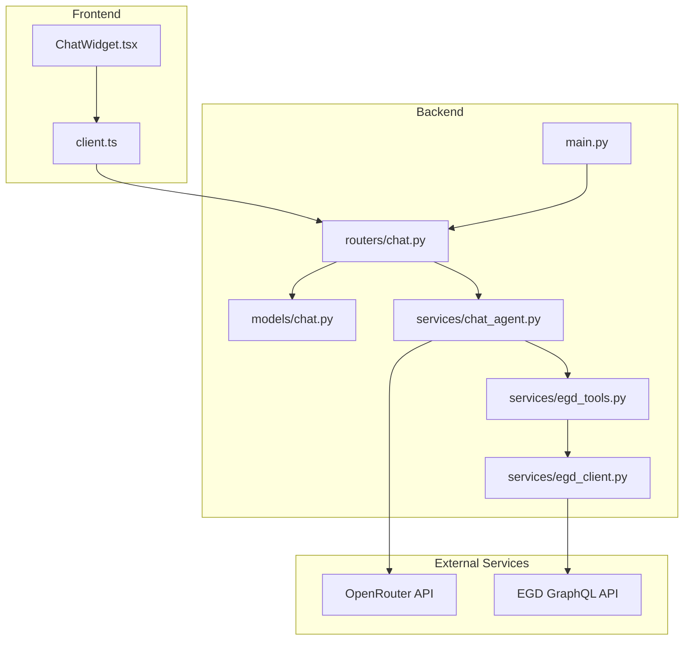
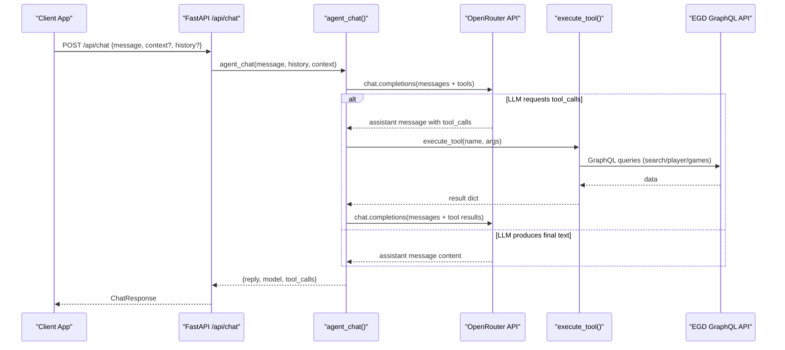
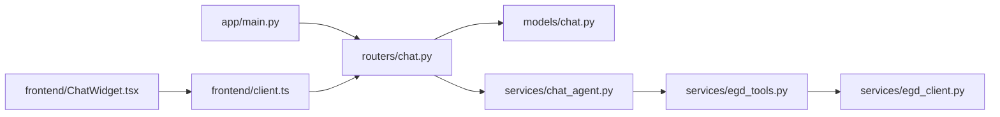
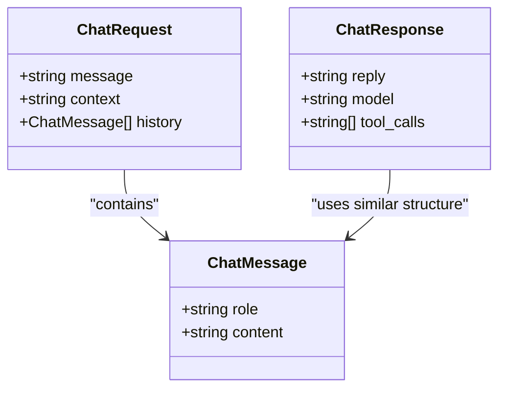
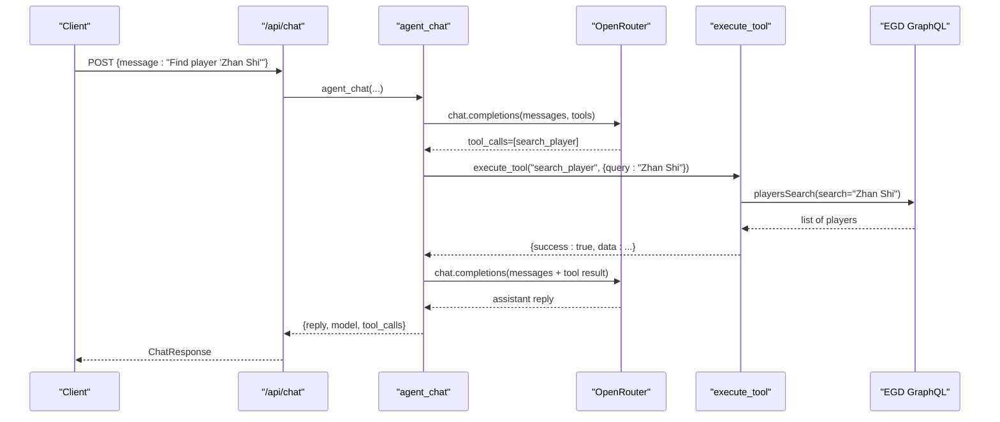

# Chat Routes

<cite>
**Referenced Files in This Document**
- [main.py](file://backend/app/main.py)
- [chat.py](file://backend/app/routers/chat.py)
- [chat.py](file://backend/app/models/chat.py)
- [chat_agent.py](file://backend/app/services/chat_agent.py)
- [egd_tools.py](file://backend/app/services/egd_tools.py)
- [egd_client.py](file://backend/app/services/egd_client.py)
- [client.ts](file://frontend/src/api/client.ts)
- [ChatWidget.tsx](file://frontend/src/components/ChatWidget.tsx)
</cite>

## Table of Contents
1. [Introduction](#introduction)
2. [Project Structure](#project-structure)
3. [Core Components](#core-components)
4. [Architecture Overview](#architecture-overview)
5. [Detailed Component Analysis](#detailed-component-analysis)
6. [Dependency Analysis](#dependency-analysis)
7. [Performance Considerations](#performance-considerations)
8. [Troubleshooting Guide](#troubleshooting-guide)
9. [Conclusion](#conclusion)
10. [Appendices](#appendices)

## Introduction
This document provides detailed API documentation for the AI chat endpoint POST /api/chat, which supports natural language queries with agentic tool calling capabilities. It explains request and response schemas, authentication requirements, integration with OpenRouter LLM service, the agentic loop implementation, tool execution flow, context management, error handling strategies, usage examples, rate limiting considerations, and best practices for client implementations.

## Project Structure
The chat feature spans backend routes, models, services (agent loop, tools, EGD client), and frontend components that call the API.

**Diagram sources**
- [main.py:14-31](file://backend/app/main.py#L14-L31)
- [chat.py:1-95](file://backend/app/routers/chat.py#L1-L95)
- [chat.py:1-21](file://backend/app/models/chat.py#L1-L21)
- [chat_agent.py:1-154](file://backend/app/services/chat_agent.py#L1-L154)
- [egd_tools.py:1-212](file://backend/app/services/egd_tools.py#L1-L212)
- [egd_client.py:1-197](file://backend/app/services/egd_client.py#L1-L197)
- [client.ts:1-86](file://frontend/src/api/client.ts#L1-L86)
- [ChatWidget.tsx:1-240](file://frontend/src/components/ChatWidget.tsx#L1-L240)

**Section sources**
- [main.py:14-31](file://backend/app/main.py#L14-L31)
- [chat.py:1-95](file://backend/app/routers/chat.py#L1-L95)
- [chat.py:1-21](file://backend/app/models/chat.py#L1-L21)
- [chat_agent.py:1-154](file://backend/app/services/chat_agent.py#L1-L154)
- [egd_tools.py:1-212](file://backend/app/services/egd_tools.py#L1-L212)
- [egd_client.py:1-197](file://backend/app/services/egd_client.py#L1-L197)
- [client.ts:1-86](file://frontend/src/api/client.ts#L1-L86)
- [ChatWidget.tsx:1-240](file://frontend/src/components/ChatWidget.tsx#L1-L240)

## Core Components
- Route handler: POST /api/chat accepts a message, optional context, and conversation history; returns a reply and metadata.
- Models: Pydantic models define ChatMessage, ChatRequest, and ChatResponse structures.
- Agent loop: Orchestrates multiple calls to OpenRouter with tool definitions, executes tool calls, and loops until a final text response is produced or iteration limit is reached.
- Tools: Function schemas for search_player, get_player_details, get_player_rating_history, get_player_games, compare_players; executed via execute_tool.
- EGD client: Provides async GraphQL access to European Go Database with caching.
- Frontend client: Axios-based client and React component for sending messages and rendering responses.

**Section sources**
- [chat.py:1-95](file://backend/app/routers/chat.py#L1-L95)
- [chat.py:1-21](file://backend/app/models/chat.py#L1-L21)
- [chat_agent.py:1-154](file://backend/app/services/chat_agent.py#L1-L154)
- [egd_tools.py:1-212](file://backend/app/services/egd_tools.py#L1-L212)
- [egd_client.py:1-197](file://backend/app/services/egd_client.py#L1-L197)
- [client.ts:1-86](file://frontend/src/api/client.ts#L1-L86)
- [ChatWidget.tsx:1-240](file://frontend/src/components/ChatWidget.tsx#L1-L240)

## Architecture Overview
The chat endpoint integrates an agentic loop with OpenRouter’s function/tool calling. The route forwards requests to the agent, which builds a message history, sends it to OpenRouter with tool schemas, executes any requested tools by querying the EGD GraphQL API, feeds results back to the model, and repeats until a final answer is generated.

**Diagram sources**
- [chat.py:1-95](file://backend/app/routers/chat.py#L1-L95)
- [chat_agent.py:1-154](file://backend/app/services/chat_agent.py#L1-L154)
- [egd_tools.py:1-212](file://backend/app/services/egd_tools.py#L1-L212)
- [egd_client.py:1-197](file://backend/app/services/egd_client.py#L1-L197)

## Detailed Component Analysis

### API Endpoint: POST /api/chat
- Path: /api/chat
- Method: POST
- Request body: JSON object conforming to ChatRequest schema
- Response: JSON object conforming to ChatResponse schema
- Authentication: No explicit auth header required at this endpoint; OpenRouter key is read server-side from environment variables.
- Streaming: Not implemented; responses are returned after completion.

Request schema (ChatRequest):
- message: string (required)
- context: string (optional) — additional page or player context injected into system prompt
- history: array of ChatMessage objects (optional) — previous conversation turns

ChatMessage fields:
- role: string ("user" or "assistant")
- content: string

Response schema (ChatResponse):
- reply: string (final assistant text)
- model: string | null (model used by OpenRouter)
- tool_calls: array of strings | null (names of tools invoked during the session)

Notes:
- The route wraps the agent call and maps its result to ChatResponse.
- Errors raise HTTPException with status 500 and a detail message.

**Section sources**
- [chat.py:1-95](file://backend/app/routers/chat.py#L1-L95)
- [chat.py:1-21](file://backend/app/models/chat.py#L1-L21)

### Agentic Loop Implementation
The agent performs a bounded iterative loop:
- Builds messages including system prompt, optional context, truncated history (last 10), and current user message.
- Sends messages to OpenRouter with tool schemas attached.
- If the assistant includes tool_calls:
  - Adds assistant message to conversation.
  - Executes each tool via execute_tool.
  - Appends tool results as tool messages.
  - Continues loop.
- If no tool_calls, returns assistant content as final reply.
- On reaching max iterations, appends a summarization prompt and makes one more call without tools to force a text response.

Configuration:
- OPENROUTER_API_KEY: Required for OpenRouter access.
- CHAT_MODEL: Model name (default google/gemini-2.0-flash-001).
- CHAT_MAX_ITERATIONS: Max number of tool-calling iterations (default 3).

Error handling:
- Missing API key returns a friendly fallback reply.
- Network or parsing errors propagate up to the route, which raises HTTPException(500).

**Section sources**
- [chat_agent.py:1-154](file://backend/app/services/chat_agent.py#L1-L154)

### Tool Execution Flow
Tool schemas are defined for OpenRouter/OpenAI-compatible function calling:
- search_player(query: string)
- get_player_details(pin: integer)
- get_player_rating_history(pin: integer)
- get_player_games(pin: integer, limit?: integer)
- compare_players(pin1: integer, pin2: integer)

Execution:
- execute_tool dispatches by name and calls EGD client methods.
- Results are wrapped in {"success": bool, "data"?: any, "error"?: string}.
- Unknown tool names return an error response.

EGD client behavior:
- Uses httpx AsyncClient with timeouts.
- Caches GraphQL responses in-memory with TTL (5 minutes).
- Raises ValueError on GraphQL errors.

**Section sources**
- [egd_tools.py:1-212](file://backend/app/services/egd_tools.py#L1-L212)
- [egd_client.py:1-197](file://backend/app/services/egd_client.py#L1-L197)

### Context Management
- System prompt sets persona and rating context.
- Optional context parameter is appended as a system message to provide page-level or player-specific background.
- History is limited to last 10 messages to control token usage.

**Section sources**
- [chat_agent.py:1-154](file://backend/app/services/chat_agent.py#L1-L154)

### Error Handling Strategies
- Route-level: try/except around agent call returns HTTPException(500) with detail.
- Agent-level: missing API key returns a safe reply; JSON decode errors in tool arguments default to empty dict; unknown tools return error payload.
- EGD client: raises ValueError on GraphQL errors; network errors bubble up.

**Section sources**
- [chat.py:1-95](file://backend/app/routers/chat.py#L1-L95)
- [chat_agent.py:1-154](file://backend/app/services/chat_agent.py#L1-L154)
- [egd_tools.py:1-212](file://backend/app/services/egd_tools.py#L1-L212)
- [egd_client.py:1-197](file://backend/app/services/egd_client.py#L1-L197)

### Usage Examples
Common queries supported by tools:
- Player lookup: “Search for player Zhan Shi”
- Performance analysis: “Show me recent games for PIN 12345678”
- Comparative statistics: “Compare players with PINs 12345678 and 87654321”

Example request payloads:
- Basic query:
  - { "message": "Who is the top-rated player in Germany?" }
- With context:
  - { "message": "Summarize their progress", "context": "Current focus: player PIN 12345678" }
- With history:
  - {
      "message": "What was their rating change in the last tournament?",
      "history": [
        { "role": "user", "content": "Tell me about player PIN 12345678" },
        { "role": "assistant", "content": "Here is the profile..." }
      ]
    }

Example response:
- { "reply": "...", "model": "google/gemini-2.0-flash-001", "tool_calls": ["get_player_details", "get_player_rating_history"] }

**Section sources**
- [chat.py:1-95](file://backend/app/routers/chat.py#L1-L95)
- [chat.py:1-21](file://backend/app/models/chat.py#L1-L21)
- [chat_agent.py:1-154](file://backend/app/services/chat_agent.py#L1-L154)
- [egd_tools.py:1-212](file://backend/app/services/egd_tools.py#L1-L212)

### Rate Limiting Considerations
- OpenRouter: Respect upstream rate limits and retry/backoff policies. Consider implementing client-side exponential backoff and jitter.
- EGD GraphQL API: Use the built-in in-memory cache (TTL 5 minutes) to reduce repeated calls. Avoid excessive parallelism.
- Backend concurrency: Ensure the FastAPI server is configured with appropriate workers and connection pools for httpx clients.

[No sources needed since this section provides general guidance]

### Best Practices for Client Implementation
- Send concise, specific prompts to minimize tool calls and tokens.
- Provide context when relevant to reduce round-trips.
- Maintain conversation history on the client and pass it with each request to preserve continuity.
- Handle 500 errors gracefully and show user-friendly messages.
- Implement retries with backoff for transient failures.
- Avoid sending very large histories; keep only recent turns.

**Section sources**
- [client.ts:1-86](file://frontend/src/api/client.ts#L1-L86)
- [ChatWidget.tsx:1-240](file://frontend/src/components/ChatWidget.tsx#L1-L240)

## Dependency Analysis
The following diagram shows runtime dependencies between modules involved in the chat flow.

**Diagram sources**
- [main.py:14-31](file://backend/app/main.py#L14-L31)
- [chat.py:1-95](file://backend/app/routers/chat.py#L1-L95)
- [chat.py:1-21](file://backend/app/models/chat.py#L1-L21)
- [chat_agent.py:1-154](file://backend/app/services/chat_agent.py#L1-L154)
- [egd_tools.py:1-212](file://backend/app/services/egd_tools.py#L1-L212)
- [egd_client.py:1-197](file://backend/app/services/egd_client.py#L1-L197)
- [client.ts:1-86](file://frontend/src/api/client.ts#L1-L86)
- [ChatWidget.tsx:1-240](file://frontend/src/components/ChatWidget.tsx#L1-L240)

**Section sources**
- [main.py:14-31](file://backend/app/main.py#L14-L31)
- [chat.py:1-95](file://backend/app/routers/chat.py#L1-L95)
- [chat.py:1-21](file://backend/app/models/chat.py#L1-L21)
- [chat_agent.py:1-154](file://backend/app/services/chat_agent.py#L1-L154)
- [egd_tools.py:1-212](file://backend/app/services/egd_tools.py#L1-L212)
- [egd_client.py:1-197](file://backend/app/services/egd_client.py#L1-L197)
- [client.ts:1-86](file://frontend/src/api/client.ts#L1-L86)
- [ChatWidget.tsx:1-240](file://frontend/src/components/ChatWidget.tsx#L1-L240)

## Performance Considerations
- Token budget: Keep history short and prompts focused to reduce cost and latency.
- Tool efficiency: Prefer precise queries (e.g., exact PIN) to avoid broad searches.
- Caching: Leverage the EGD client’s in-memory cache to avoid redundant GraphQL calls.
- Timeouts: Ensure reasonable timeouts for both OpenRouter and EGD calls to prevent hanging requests.
- Concurrency: Tune server workers and connection pool sizes for optimal throughput.

[No sources needed since this section provides general guidance]

## Troubleshooting Guide
- Missing OpenRouter API key:
  - Symptom: Fallback reply indicating configuration is missing.
  - Action: Set OPENROUTER_API_KEY in the backend .env file.
- HTTP 500 from /api/chat:
  - Cause: Upstream OpenRouter or EGD errors, malformed tool arguments, or unexpected responses.
  - Action: Check logs for details; validate tool arguments; ensure network connectivity.
- Empty or incorrect tool results:
  - Cause: Invalid PIN or non-existent player.
  - Action: Verify PINs; use search_player first to confirm identifiers.
- High latency:
  - Causes: Multiple tool calls, large histories, slow upstream APIs.
  - Action: Reduce history length, refine prompts, rely on cached EGD data.

**Section sources**
- [chat.py:1-95](file://backend/app/routers/chat.py#L1-L95)
- [chat_agent.py:1-154](file://backend/app/services/chat_agent.py#L1-L154)
- [egd_tools.py:1-212](file://backend/app/services/egd_tools.py#L1-L212)
- [egd_client.py:1-197](file://backend/app/services/egd_client.py#L1-L197)

## Conclusion
POST /api/chat provides a robust agentic interface backed by OpenRouter and the European Go Database. It supports dynamic tool invocation, context-aware conversations, and structured responses suitable for UI integration. By following the recommended best practices and error-handling strategies, clients can deliver responsive and insightful Go analytics experiences.

[No sources needed since this section summarizes without analyzing specific files]

## Appendices

### Data Models Diagram

**Diagram sources**
- [chat.py:1-21](file://backend/app/models/chat.py#L1-L21)

### Sequence Diagram: Typical Player Lookup Flow

**Diagram sources**
- [chat.py:1-95](file://backend/app/routers/chat.py#L1-L95)
- [chat_agent.py:1-154](file://backend/app/services/chat_agent.py#L1-L154)
- [egd_tools.py:1-212](file://backend/app/services/egd_tools.py#L1-L212)
- [egd_client.py:1-197](file://backend/app/services/egd_client.py#L1-L197)