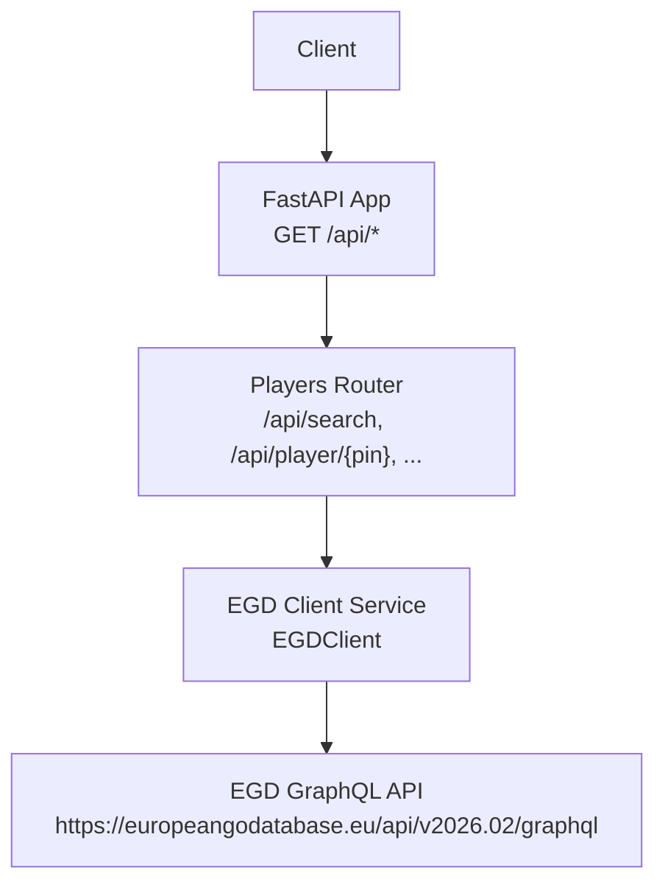
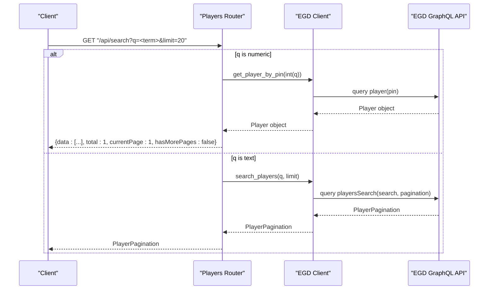
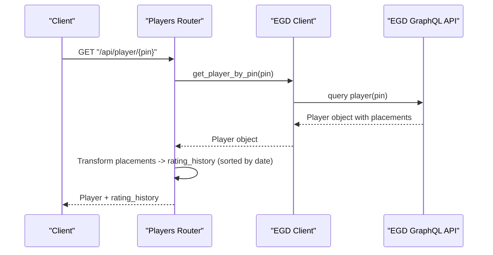
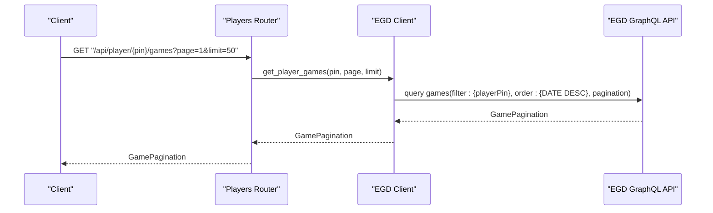
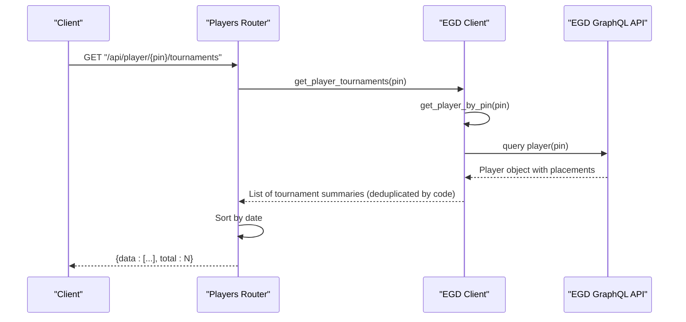
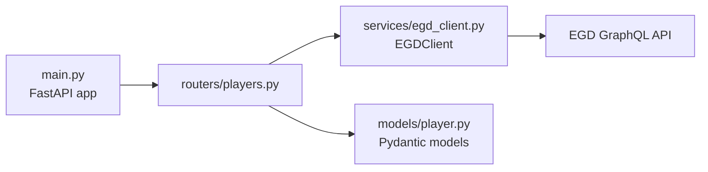

# Player Routes

<cite>
**Referenced Files in This Document**
- [main.py](file://backend/app/main.py)
- [players.py](file://backend/app/routers/players.py)
- [egd_client.py](file://backend/app/services/egd_client.py)
- [player.py](file://backend/app/models/player.py)
- [EGD_API.md](file://docs/EGD_API.md)
</cite>

## Table of Contents
1. [Introduction](#introduction)
2. [Project Structure](#project-structure)
3. [Core Components](#core-components)
4. [Architecture Overview](#architecture-overview)
5. [Detailed Component Analysis](#detailed-component-analysis)
6. [Dependency Analysis](#dependency-analysis)
7. [Performance Considerations](#performance-considerations)
8. [Troubleshooting Guide](#troubleshooting-guide)
9. [Conclusion](#conclusion)

## Introduction
This document provides detailed API documentation for player-related endpoints exposed by the backend service. It covers:
- GET /api/search: Search players by name or PIN with typo-tolerant matching and optional pagination.
- GET /api/player/{pin}: Retrieve a complete player profile, including transformed rating history.
- GET /api/player/{pin}/games: Paginated retrieval of a player’s game history.
- GET /api/player/{pin}/tournaments: Tournament history sorted by date.

It also documents request/response schemas, parameter validation, error handling (including 404 and 500 responses), and integration with the European Go Database (EGD) GraphQL client service.

## Project Structure
The player routes are implemented as a FastAPI router mounted at runtime. The EGD client encapsulates all external GraphQL calls and caching logic. Pydantic models define data structures used across the application.

**Diagram sources**
- [main.py:14-31](file://backend/app/main.py#L14-L31)
- [players.py:1-107](file://backend/app/routers/players.py#L1-L107)
- [egd_client.py:11-42](file://backend/app/services/egd_client.py#L11-L42)

**Section sources**
- [main.py:14-31](file://backend/app/main.py#L14-L31)
- [players.py:1-107](file://backend/app/routers/players.py#L1-L107)
- [egd_client.py:11-42](file://backend/app/services/egd_client.py#L11-L42)

## Core Components
- Players Router: Defines HTTP endpoints under /api prefix and orchestrates requests to the EGD client.
- EGD Client: Encapsulates GraphQL queries, authentication, and response caching.
- Models: Pydantic models describing expected data shapes for player summaries, tournaments, placements, and search responses.

Key responsibilities:
- Parameter validation and normalization (e.g., numeric PIN optimization).
- Data transformation (e.g., building rating_history from placements).
- Pagination support for games and search results.
- Consistent error mapping to HTTP status codes.

**Section sources**
- [players.py:1-107](file://backend/app/routers/players.py#L1-L107)
- [egd_client.py:11-197](file://backend/app/services/egd_client.py#L11-L197)
- [player.py:1-60](file://backend/app/models/player.py#L1-L60)

## Architecture Overview
The following sequence diagrams illustrate the end-to-end flows for each endpoint.

### GET /api/search

**Diagram sources**
- [players.py:8-40](file://backend/app/routers/players.py#L8-L40)
- [egd_client.py:44-70](file://backend/app/services/egd_client.py#L44-L70)
- [egd_client.py:72-118](file://backend/app/services/egd_client.py#L72-L118)

### GET /api/player/{pin}

**Diagram sources**
- [players.py:43-80](file://backend/app/routers/players.py#L43-L80)
- [egd_client.py:72-118](file://backend/app/services/egd_client.py#L72-L118)

### GET /api/player/{pin}/games

**Diagram sources**
- [players.py:83-94](file://backend/app/routers/players.py#L83-L94)
- [egd_client.py:120-150](file://backend/app/services/egd_client.py#L120-L150)

### GET /api/player/{pin}/tournaments

**Diagram sources**
- [players.py:97-106](file://backend/app/routers/players.py#L97-L106)
- [egd_client.py:152-177](file://backend/app/services/egd_client.py#L152-L177)
- [egd_client.py:72-118](file://backend/app/services/egd_client.py#L72-L118)

## Detailed Component Analysis

### Endpoint: GET /api/search
Purpose:
- Search players by name or PIN.
- If the query term is numeric, attempts direct PIN lookup first; otherwise performs a typo-tolerant name search via the EGD GraphQL API.

Query Parameters:
- q: string, required, minimum length 1. Used to match either PIN (if numeric) or player name.
- limit: integer, optional, default 20. Passed to the underlying search query.

Behavior:
- Numeric q: Attempts to fetch player by PIN. On success, returns a single-item result set with pagination metadata indicating one page.
- Text q: Delegates to the EGD search endpoint and returns its pagination structure.

Response Schema:
- When PIN matched directly:
  - data: array of player summary objects
  - total: integer
  - currentPage: integer
  - hasMorePages: boolean
- When name search:
  - data: array of player summary objects
  - total: integer
  - currentPage: integer
  - hasMorePages: boolean

Player Summary Object Fields:
- pin: integer
- firstName: string
- lastName: string
- countryCode: string
- grade: string
- rating: integer (optional)
- club: string (optional)
- totalTournaments: integer (optional)
- lastAppearance: string (optional)

Example Requests:
- GET /api/search?q=Zhan%20Shi&limit=10
- GET /api/search?q=17401142

Example Responses:
- Name search:
  - {
      "data": [{ "pin": 17401142, "firstName": "Zhan", "lastName": "Shi", "countryCode": "CN", "grade": "5d", "rating": 2100, "club": "Go Club", "totalTournaments": 120, "lastAppearance": "2024-06-15" }],
      "total": 1,
      "currentPage": 1,
      "hasMorePages": false
    }
- PIN search:
  - Same shape as above with exactly one entry.

Error Handling:
- 400: Invalid or missing q (due to min_length constraint).
- 404: Not applicable here; if PIN not found, falls back to name search.
- 500: Server errors from upstream services or internal exceptions.

Notes:
- Typo tolerance is provided by the EGD playersSearch implementation.

**Section sources**
- [players.py:8-40](file://backend/app/routers/players.py#L8-L40)
- [egd_client.py:44-70](file://backend/app/services/egd_client.py#L44-L70)
- [player.py:6-15](file://backend/app/models/player.py#L6-L15)
- [EGD_API.md:81-106](file://docs/EGD_API.md#L81-L106)

### Endpoint: GET /api/player/{pin}
Purpose:
- Retrieve a complete player profile and transform placement data into a chronological rating history.

Path Parameters:
- pin: integer, required.

Behavior:
- Fetches player details from EGD.
- Extracts placements and constructs rating_history entries containing tournament context and rating deltas.
- Sorts rating_history by date ascending.

Response Schema:
- All fields returned by the EGD player query, plus:
  - rating_history: array of objects with:
    - date: string
    - tournament: string
    - city: string
    - nation: string
    - placement: integer
    - grade: string
    - rating_before: number (optional)
    - rating_after: number (optional)
    - won: integer
    - lost: integer
    - jigo: integer

Example Request:
- GET /api/player/17401142

Example Response:
- {
    "pin": 17401142,
    "firstName": "Zhan",
    "lastName": "Shi",
    "countryCode": "CN",
    "grade": "5d",
    "rating": 2100,
    "deltaRating": 10,
    "proposedGrade": "6d",
    "totalTournaments": 120,
    "lastAppearance": "2024-06-15",
    "egfPlacement": 123,
    "biography": [...],
    "placements": {...},
    "rating_history": [
      {
        "date": "2024-06-15",
        "tournament": "European Championship",
        "city": "Berlin",
        "nation": "DE",
        "placement": 5,
        "grade": "5d",
        "rating_before": 2090,
        "rating_after": 2100,
        "won": 6,
        "lost": 1,
        "jigo": 0
      }
    ]
  }

Error Handling:
- 404: Player not found.
- 500: Server errors from upstream services or internal exceptions.

**Section sources**
- [players.py:43-80](file://backend/app/routers/players.py#L43-L80)
- [egd_client.py:72-118](file://backend/app/services/egd_client.py#L72-L118)
- [EGD_API.md:26-79](file://docs/EGD_API.md#L26-L79)

### Endpoint: GET /api/player/{pin}/games
Purpose:
- Retrieve a player’s game history with pagination and descending date ordering.

Path Parameters:
- pin: integer, required.

Query Parameters:
- page: integer, optional, default 1, minimum 1.
- limit: integer, optional, default 50, range 1–200.

Behavior:
- Calls the EGD games query with filter by player PIN, ordered by date descending, and paginated.

Response Schema:
- data: array of game objects with fields such as id, date, round, result, handicap, tournament info, and opponent info.
- total: integer
- currentPage: integer
- hasMorePages: boolean

Example Request:
- GET /api/player/17401142/games?page=1&limit=20

Example Response:
- {
    "data": [
      {
        "id": 123456,
        "date": "2024-06-15",
        "round": 3,
        "result": "W+R",
        "handicap": 0,
        "tournament": { "code": "T240615A", "description": "European Championship", "date": "2024-06-15" },
        "player1": { "pin": 17401142, "firstName": "Zhan", "lastName": "Shi" },
        "player2": { "pin": 98765432, "firstName": "Jane", "lastName": "Doe" }
      }
    ],
    "total": 120,
    "currentPage": 1,
    "hasMorePages": true
  }

Error Handling:
- 500: Server errors from upstream services or internal exceptions.

Validation Notes:
- page must be >= 1.
- limit must be between 1 and 200 inclusive.

**Section sources**
- [players.py:83-94](file://backend/app/routers/players.py#L83-L94)
- [egd_client.py:120-150](file://backend/app/services/egd_client.py#L120-L150)
- [EGD_API.md:129-133](file://docs/EGD_API.md#L129-L133)

### Endpoint: GET /api/player/{pin}/tournaments
Purpose:
- Retrieve a player’s tournament history derived from placements, deduplicated by tournament code, and sorted by date.

Path Parameters:
- pin: integer, required.

Behavior:
- Uses player placements to build a list of unique tournaments per code.
- Sorts the resulting list by date ascending.

Response Schema:
- data: array of tournament summary objects with fields such as code, description, date, city, nation, placement, grade_declared, won, lost, jigo, rating_before, rating_after.
- total: integer (length of data).

Example Request:
- GET /api/player/17401142/tournaments

Example Response:
- {
    "data": [
      {
        "code": "T240615A",
        "description": "European Championship",
        "date": "2024-06-15",
        "city": "Berlin",
        "nation": "DE",
        "placement": 5,
        "grade_declared": "5d",
        "won": 6,
        "lost": 1,
        "jigo": 0,
        "rating_before": 2090,
        "rating_after": 2100
      }
    ],
    "total": 1
  }

Error Handling:
- 500: Server errors from upstream services or internal exceptions.

**Section sources**
- [players.py:97-106](file://backend/app/routers/players.py#L97-L106)
- [egd_client.py:152-177](file://backend/app/services/egd_client.py#L152-L177)

## Dependency Analysis
The following diagram shows how components depend on each other and where external integrations occur.

**Diagram sources**
- [main.py:14-31](file://backend/app/main.py#L14-L31)
- [players.py:1-107](file://backend/app/routers/players.py#L1-L107)
- [egd_client.py:11-42](file://backend/app/services/egd_client.py#L11-L42)
- [player.py:1-60](file://backend/app/models/player.py#L1-L60)

Coupling and Cohesion:
- The router depends only on the EGD client interface and does not implement network logic itself, promoting cohesion.
- The EGD client centralizes GraphQL queries, headers, and caching, reducing duplication.

External Dependencies:
- EGD GraphQL API requires an Authorization Bearer token configured via environment variables.
- HTTP client uses async HTTP with timeouts and raises status errors appropriately.

Potential Circular Dependencies:
- None observed; routers import the client service, which does not import routers.

**Section sources**
- [main.py:14-31](file://backend/app/main.py#L14-L31)
- [players.py:1-107](file://backend/app/routers/players.py#L1-L107)
- [egd_client.py:11-42](file://backend/app/services/egd_client.py#L11-L42)
- [player.py:1-60](file://backend/app/models/player.py#L1-L60)

## Performance Considerations
- Caching: The EGD client caches responses keyed by query and variables with a TTL of 5 minutes, reducing repeated network calls.
- Pagination: Games and search endpoints support pagination to limit payload sizes and improve responsiveness.
- Sorting: Rating history and tournament lists are sorted server-side or post-processed efficiently.
- Timeouts: HTTP requests use a 30-second timeout to avoid hanging connections.

[No sources needed since this section provides general guidance]

## Troubleshooting Guide
Common Issues and Resolutions:
- 404 Not Found:
  - Occurs when requesting a player that does not exist via GET /api/player/{pin}.
  - Resolution: Verify the PIN and ensure it exists in the EGD database.
- 500 Internal Server Error:
  - Raised when upstream EGD queries fail or unexpected exceptions occur.
  - Resolution: Check logs, verify EGD token validity, and confirm network connectivity.
- Parameter Validation Errors:
  - GET /api/search requires q with minimum length 1.
  - GET /api/player/{pin}/games enforces page >= 1 and 1 <= limit <= 200.
  - Resolution: Adjust query parameters accordingly.

Integration Checks:
- Ensure EGD_API_TOKEN is set in the environment.
- Confirm CORS settings allow your frontend origin.

**Section sources**
- [players.py:43-80](file://backend/app/routers/players.py#L43-L80)
- [players.py:83-94](file://backend/app/routers/players.py#L83-L94)
- [players.py:97-106](file://backend/app/routers/players.py#L97-L106)
- [main.py:20-27](file://backend/app/main.py#L20-L27)
- [egd_client.py:11-18](file://backend/app/services/egd_client.py#L11-L18)

## Conclusion
The player routes provide a clean, typed, and well-integrated API surface over the EGD GraphQL service. They offer robust search capabilities, comprehensive player profiles with transformed rating histories, paginated game histories, and sorted tournament records. Proper parameter validation and consistent error handling ensure predictable behavior for clients.

[No sources needed since this section summarizes without analyzing specific files]