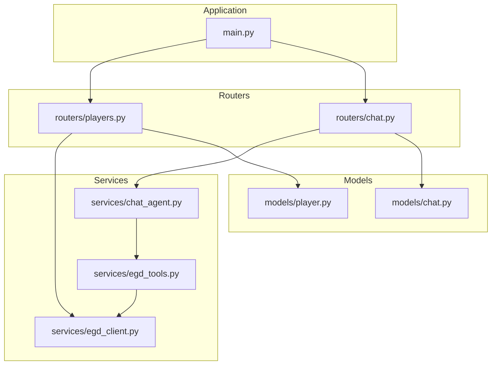
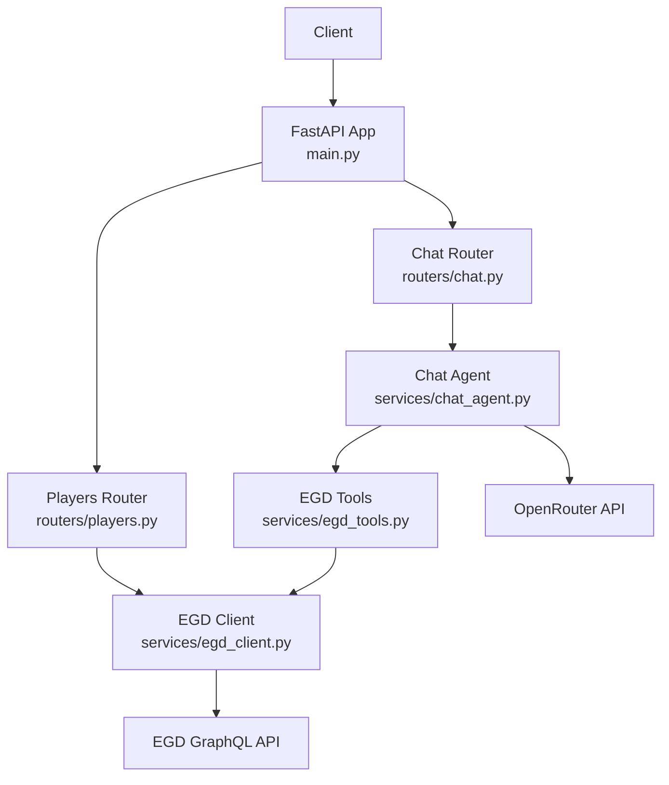
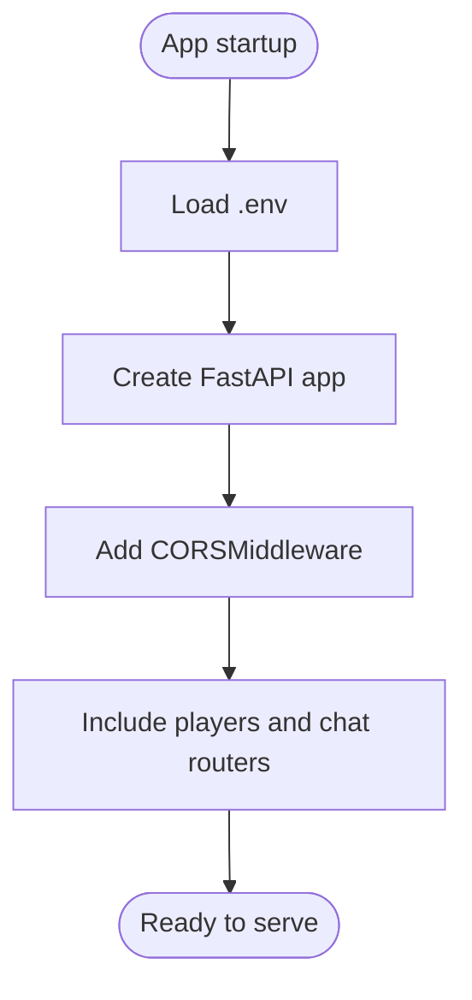
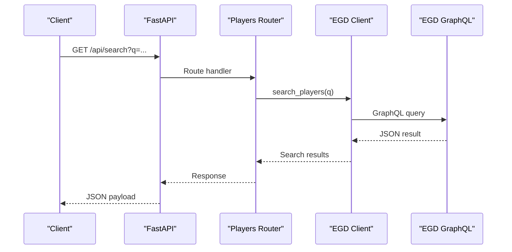
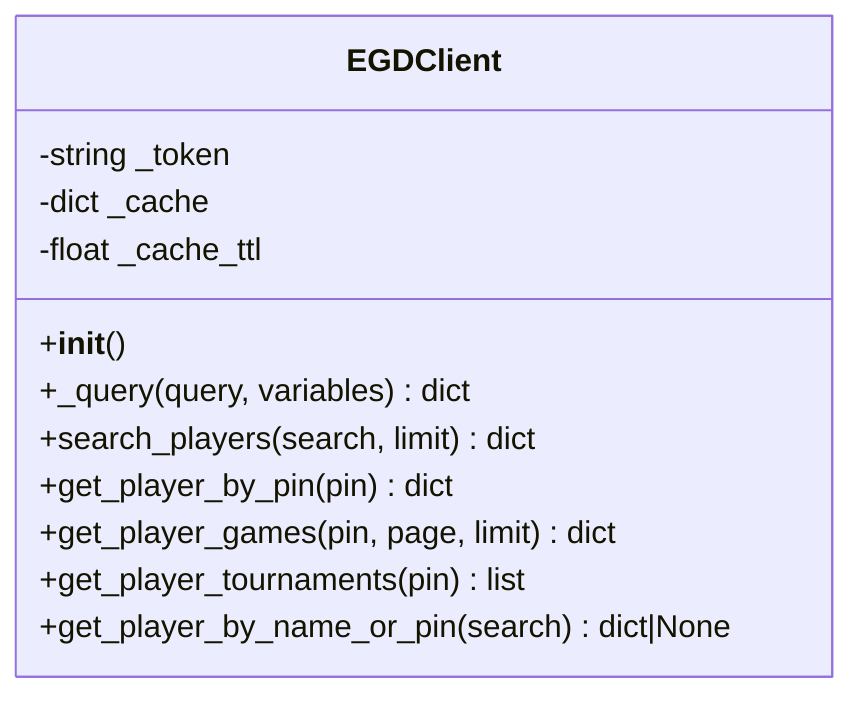
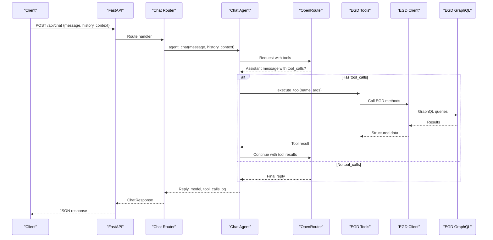
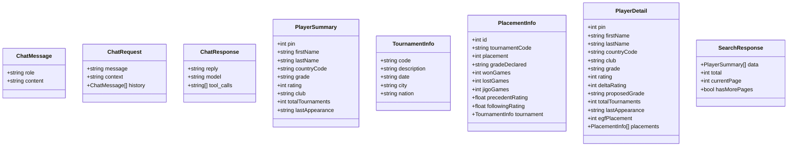
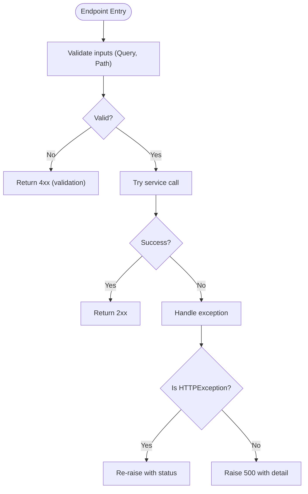
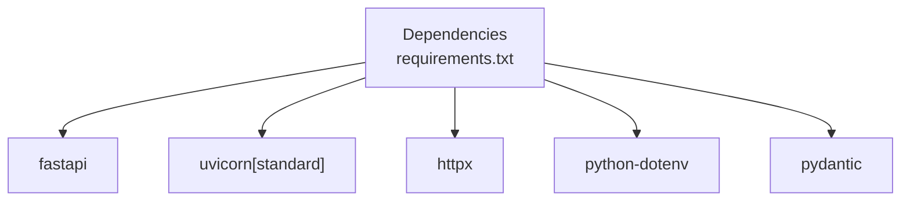

# Backend Documentation

<cite>
**Referenced Files in This Document**
- [main.py](file://backend/app/main.py)
- [requirements.txt](file://backend/requirements.txt)
- [players.py](file://backend/app/routers/players.py)
- [chat.py](file://backend/app/routers/chat.py)
- [egd_client.py](file://backend/app/services/egd_client.py)
- [chat_agent.py](file://backend/app/services/chat_agent.py)
- [egd_tools.py](file://backend/app/services/egd_tools.py)
- [chat.py](file://backend/app/models/chat.py)
- [player.py](file://backend/app/models/player.py)
</cite>

## Table of Contents
1. [Introduction](#introduction)
2. [Project Structure](#project-structure)
3. [Core Components](#core-components)
4. [Architecture Overview](#architecture-overview)
5. [Detailed Component Analysis](#detailed-component-analysis)
6. [Dependency Analysis](#dependency-analysis)
7. [Performance Considerations](#performance-considerations)
8. [Troubleshooting Guide](#troubleshooting-guide)
9. [Conclusion](#conclusion)

## Introduction
This document provides comprehensive backend documentation for the FastAPI Python application that powers the GoNow API. It covers application initialization, middleware configuration, CORS setup, router organization, service layer architecture, EGD client implementation with caching, Pydantic model definitions, error handling, request validation, and performance optimization strategies. The backend exposes REST endpoints for player search and details, as well as an AI-powered chat endpoint that can call tools to retrieve real data from the European Go Database (EGD).

## Project Structure
The backend is organized by feature and layer:
- Application entry point and global configuration
- Routers for HTTP endpoints
- Services for business logic and external integrations
- Models for request/response schemas

**Diagram sources**
- [main.py:14-31](file://backend/app/main.py#L14-L31)
- [players.py:1-10](file://backend/app/routers/players.py#L1-L10)
- [chat.py:1-10](file://backend/app/routers/chat.py#L1-L10)
- [egd_client.py:11-20](file://backend/app/services/egd_client.py#L11-L20)
- [chat_agent.py:1-12](file://backend/app/services/chat_agent.py#L1-L12)
- [egd_tools.py:1-10](file://backend/app/services/egd_tools.py#L1-L10)
- [chat.py:1-10](file://backend/app/models/chat.py#L1-L10)
- [player.py:1-10](file://backend/app/models/player.py#L1-L10)

**Section sources**
- [main.py:1-42](file://backend/app/main.py#L1-L42)
- [requirements.txt:1-6](file://backend/requirements.txt#L1-L6)

## Core Components
- Application initialization and global settings are defined in the main module, including title, description, version, CORS middleware, and router mounting.
- Routers define REST endpoints under a common prefix and organize endpoints by domain (players, chat).
- Service layer encapsulates external calls to EGD and orchestrates agentic chat flows with tool calling.
- Pydantic models define structured request and response schemas for chat and player data.

Key responsibilities:
- main.py: App factory, environment loading, CORS, router registration, health and root endpoints.
- routers/players.py: Player search, detail retrieval, games, tournaments endpoints.
- routers/chat.py: Chat endpoint using either direct OpenRouter proxy or agentic flow via chat_agent.
- services/egd_client.py: GraphQL client with in-process cache and TTL-based invalidation.
- services/chat_agent.py: Agentic loop over OpenRouter with function/tool calling and result feedback.
- services/egd_tools.py: Tool schema definitions and execution dispatcher for LLM function calling.
- models/chat.py: Pydantic models for chat messages, requests, and responses.
- models/player.py: Pydantic models for player summaries, tournament info, placements, and search results.

**Section sources**
- [main.py:14-31](file://backend/app/main.py#L14-L31)
- [players.py:8-41](file://backend/app/routers/players.py#L8-L41)
- [chat.py:9-24](file://backend/app/routers/chat.py#L9-L24)
- [egd_client.py:11-42](file://backend/app/services/egd_client.py#L11-L42)
- [chat_agent.py:30-41](file://backend/app/services/chat_agent.py#L30-L41)
- [egd_tools.py:5-99](file://backend/app/services/egd_tools.py#L5-L99)
- [chat.py:6-21](file://backend/app/models/chat.py#L6-L21)
- [player.py:6-60](file://backend/app/models/player.py#L6-L60)

## Architecture Overview
The backend follows a layered architecture:
- Presentation layer: FastAPI routers handle HTTP requests and responses.
- Service layer: Encapsulates business logic and external integrations (EGD GraphQL, OpenRouter).
- Data access layer: EGD client performs GraphQL queries with caching.
- Models: Pydantic schemas enforce request/response structure.

**Diagram sources**
- [main.py:14-31](file://backend/app/main.py#L14-L31)
- [players.py:1-10](file://backend/app/routers/players.py#L1-L10)
- [chat.py:1-10](file://backend/app/routers/chat.py#L1-L10)
- [chat_agent.py:1-12](file://backend/app/services/chat_agent.py#L1-L12)
- [egd_tools.py:1-10](file://backend/app/services/egd_tools.py#L1-L10)
- [egd_client.py:11-20](file://backend/app/services/egd_client.py#L11-L20)

## Detailed Component Analysis

### Application Initialization and Middleware
- Loads environment variables from a .env file located at the backend directory.
- Creates a FastAPI app with metadata (title, description, version).
- Configures CORS to allow frontend origins with credentials and permissive methods/headers.
- Mounts routers under a shared prefix and registers root and health endpoints.

**Diagram sources**
- [main.py:8-18](file://backend/app/main.py#L8-L18)
- [main.py:20-31](file://backend/app/main.py#L20-L31)

**Section sources**
- [main.py:8-18](file://backend/app/main.py#L8-L18)
- [main.py:20-31](file://backend/app/main.py#L20-L31)
- [main.py:34-42](file://backend/app/main.py#L34-L42)

### Router Organization
- Shared prefix "/api" is used across routers.
- Players router defines endpoints for search, player details, games, and tournaments.
- Chat router defines a single POST /api/chat endpoint; two implementations exist in the same file (direct proxy vs agentic), but only one will be active due to duplicate route definition behavior.

**Diagram sources**
- [players.py:8-41](file://backend/app/routers/players.py#L8-L41)
- [egd_client.py:44-70](file://backend/app/services/egd_client.py#L44-L70)

**Section sources**
- [players.py:1-107](file://backend/app/routers/players.py#L1-L107)
- [chat.py:1-95](file://backend/app/routers/chat.py#L1-L95)

### EGD Client Implementation with Caching
- Provides async GraphQL operations for searching players, retrieving player details, games, and tournaments.
- Implements an in-process dictionary cache keyed by query string and variables, with a time-to-live (TTL) of 300 seconds.
- Uses httpx AsyncClient with timeouts and raises errors on GraphQL errors.

**Diagram sources**
- [egd_client.py:11-42](file://backend/app/services/egd_client.py#L11-L42)
- [egd_client.py:44-197](file://backend/app/services/egd_client.py#L44-L197)

**Section sources**
- [egd_client.py:11-42](file://backend/app/services/egd_client.py#L11-L42)
- [egd_client.py:44-197](file://backend/app/services/egd_client.py#L44-L197)

### Chat Agent and Tool Calling
- The chat agent builds a conversation context with system prompt, optional page context, and limited history.
- Sends requests to OpenRouter with tool definitions; if the model returns tool_calls, executes them via the tool executor and feeds results back into the conversation.
- Loops up to a configurable maximum number of iterations before forcing a final text response.

**Diagram sources**
- [chat.py:9-24](file://backend/app/routers/chat.py#L9-L24)
- [chat_agent.py:30-154](file://backend/app/services/chat_agent.py#L30-L154)
- [egd_tools.py:102-212](file://backend/app/services/egd_tools.py#L102-L212)
- [egd_client.py:44-197](file://backend/app/services/egd_client.py#L44-L197)

**Section sources**
- [chat_agent.py:30-154](file://backend/app/services/chat_agent.py#L30-L154)
- [egd_tools.py:5-99](file://backend/app/services/egd_tools.py#L5-L99)
- [egd_tools.py:102-212](file://backend/app/services/egd_tools.py#L102-L212)

### Pydantic Model Definitions
- Chat models define roles, content, request fields (message, optional context and history), and response fields (reply, optional model and tool_calls).
- Player models define summary, tournament info, placement info, detailed player profile, and paginated search response structures.

**Diagram sources**
- [chat.py:6-21](file://backend/app/models/chat.py#L6-L21)
- [player.py:6-60](file://backend/app/models/player.py#L6-L60)

**Section sources**
- [chat.py:6-21](file://backend/app/models/chat.py#L6-L21)
- [player.py:6-60](file://backend/app/models/player.py#L6-L60)

### Error Handling and Request Validation
- Routers use try/except blocks to catch exceptions and raise HTTPException with appropriate status codes (e.g., 404 for not found, 500 for server errors).
- Query parameters are validated using FastAPI’s Query constraints (e.g., minimum length, range limits).
- EGD client raises ValueError on GraphQL errors and uses httpx.raise_for_status() for HTTP errors.
- Chat agent and tools return structured success/error payloads for tool execution, enabling graceful fallbacks.

**Diagram sources**
- [players.py:8-41](file://backend/app/routers/players.py#L8-L41)
- [players.py:43-81](file://backend/app/routers/players.py#L43-L81)
- [players.py:83-107](file://backend/app/routers/players.py#L83-L107)
- [chat.py:9-24](file://backend/app/routers/chat.py#L9-L24)
- [egd_client.py:21-42](file://backend/app/services/egd_client.py#L21-L42)

**Section sources**
- [players.py:8-41](file://backend/app/routers/players.py#L8-L41)
- [players.py:43-81](file://backend/app/routers/players.py#L43-L81)
- [players.py:83-107](file://backend/app/routers/players.py#L83-L107)
- [chat.py:9-24](file://backend/app/routers/chat.py#L9-L24)
- [egd_client.py:21-42](file://backend/app/services/egd_client.py#L21-L42)

## Dependency Analysis
External dependencies include FastAPI, Uvicorn, httpx, python-dotenv, and Pydantic. These provide ASGI server capabilities, HTTP client functionality, environment variable management, and data validation.

**Diagram sources**
- [requirements.txt:1-6](file://backend/requirements.txt#L1-L6)

**Section sources**
- [requirements.txt:1-6](file://backend/requirements.txt#L1-L6)

## Performance Considerations
- In-memory caching: The EGD client caches GraphQL responses keyed by query and variables with a 300-second TTL to reduce external calls and latency.
- Pagination and limits: Player games endpoint enforces page and limit constraints to control payload size and processing time.
- Timeouts: External HTTP clients set explicit timeouts to prevent hanging requests.
- History truncation: Chat agent limits conversation history to the last 10 messages to manage token usage and response times.
- Sorting and deduplication: Tournament lists are sorted and deduplicated to minimize redundant data and improve readability.

Recommendations:
- Consider distributed caching (e.g., Redis) for multi-worker deployments to share cache state.
- Introduce rate limiting and circuit breakers for external APIs.
- Use response compression and selective field projection where possible.
- Monitor and tune TTL values based on data volatility and traffic patterns.

[No sources needed since this section provides general guidance]

## Troubleshooting Guide
Common issues and resolutions:
- Missing environment variables: Ensure OPENROUTER_API_KEY and CHAT_MODEL are configured for chat features; EGD_API_TOKEN is required for EGD access.
- CORS errors: Verify allowed origins match the frontend URL; credentials must be enabled when sending cookies or auth headers.
- GraphQL errors: Check EGD API token validity and network connectivity; inspect error payloads returned by the GraphQL endpoint.
- HTTP errors: Review httpx status codes and ensure proper error propagation in routers.
- Chat not responding: Confirm OpenRouter availability and model selection; check max iteration limits and tool execution logs.

Operational checks:
- Health endpoint returns a simple status for readiness probes.
- Root endpoint confirms API availability and points to interactive docs.

**Section sources**
- [main.py:34-42](file://backend/app/main.py#L34-L42)
- [main.py:20-27](file://backend/app/main.py#L20-L27)
- [chat_agent.py:42-48](file://backend/app/services/chat_agent.py#L42-L48)
- [chat.py:47-95](file://backend/app/routers/chat.py#L47-L95)
- [egd_client.py:21-42](file://backend/app/services/egd_client.py#L21-L42)

## Conclusion
The GoNow backend implements a clean, layered FastAPI application with clear separation between presentation, service, and data access layers. It integrates with the European Go Database via a GraphQL client with in-process caching and supports an AI-driven chat experience through OpenRouter with agentic tool calling. Robust error handling and request validation ensure reliable operation, while performance optimizations like caching, pagination, and timeouts help maintain responsiveness. For production deployments, consider adding distributed caching, rate limiting, and observability to further enhance reliability and scalability.