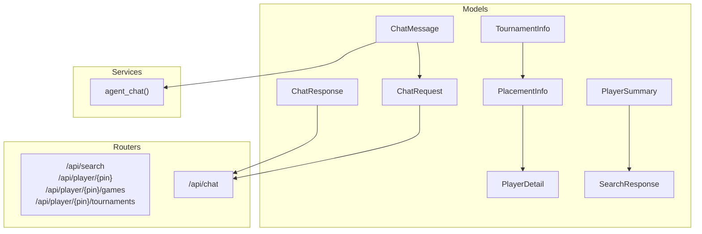
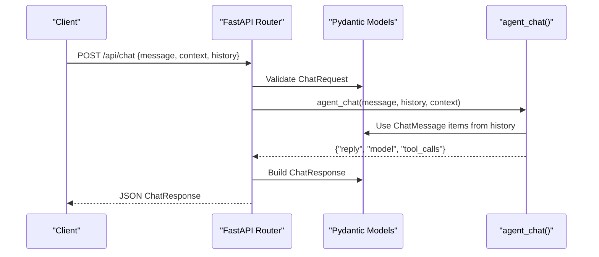
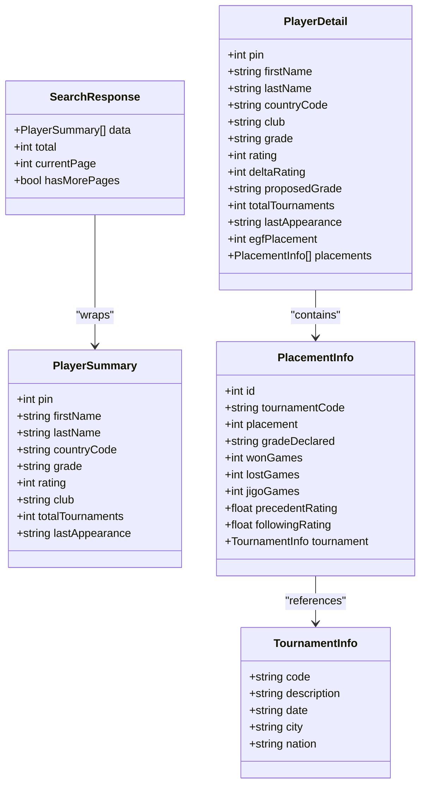
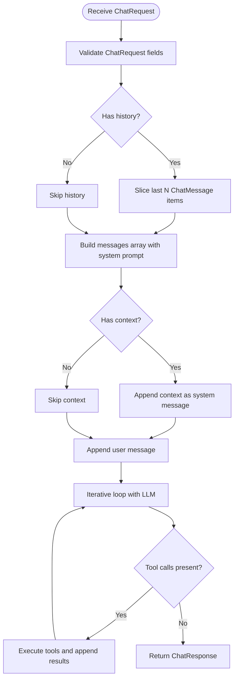
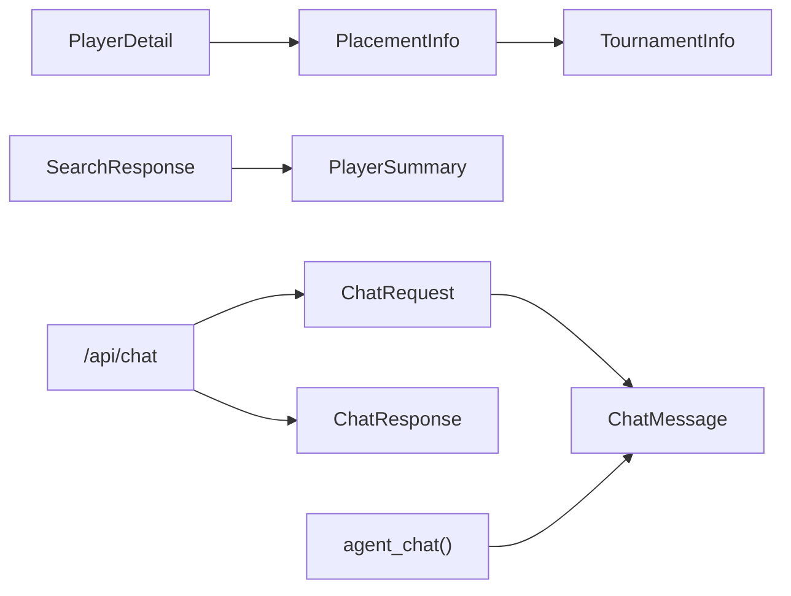

# Data Models

<cite>
**Referenced Files in This Document**
- [player.py](file://backend/app/models/player.py)
- [chat.py](file://backend/app/models/chat.py)
- [players.py](file://backend/app/routers/players.py)
- [chat.py](file://backend/app/routers/chat.py)
- [chat_agent.py](file://backend/app/services/chat_agent.py)
</cite>

## Table of Contents
1. [Introduction](#introduction)
2. [Project Structure](#project-structure)
3. [Core Components](#core-components)
4. [Architecture Overview](#architecture-overview)
5. [Detailed Component Analysis](#detailed-component-analysis)
6. [Dependency Analysis](#dependency-analysis)
7. [Performance Considerations](#performance-considerations)
8. [Troubleshooting Guide](#troubleshooting-guide)
9. [Conclusion](#conclusion)

## Introduction
This document provides comprehensive data model documentation for the Pydantic models used in the backend, focusing on player and chat-related schemas. It explains field definitions, validation rules, serialization behavior, relationships between models, and how they are consumed by API routes and services. It also includes guidance on instantiation, validation errors, and JSON serialization/deserialization patterns.

## Project Structure
The relevant Pydantic models are defined under the models package and consumed by routers and services:
- Player models: PlayerSummary, TournamentInfo, PlacementInfo, PlayerDetail, SearchResponse
- Chat models: ChatMessage, ChatRequest, ChatResponse

**Diagram sources**
- [player.py:6-60](file://backend/app/models/player.py#L6-L60)
- [chat.py:6-21](file://backend/app/models/chat.py#L6-L21)
- [players.py:8-106](file://backend/app/routers/players.py#L8-L106)
- [chat.py:9-24](file://backend/app/routers/chat.py#L9-L24)
- [chat_agent.py:30-153](file://backend/app/services/chat_agent.py#L30-L153)

**Section sources**
- [player.py:6-60](file://backend/app/models/player.py#L6-L60)
- [chat.py:6-21](file://backend/app/models/chat.py#L6-L21)
- [players.py:8-106](file://backend/app/routers/players.py#L8-L106)
- [chat.py:9-24](file://backend/app/routers/chat.py#L9-L24)
- [chat_agent.py:30-153](file://backend/app/services/chat_agent.py#L30-L153)

## Core Components
This section summarizes each Pydantic model’s purpose, fields, and behavior.

- PlayerSummary
  - Purpose: Lightweight representation of a player returned in search results.
  - Fields: pin (int), firstName (str), lastName (str), countryCode (str), grade (str), rating (Optional[int]), club (Optional[str]), totalTournaments (Optional[int]), lastAppearance (Optional[str]).
  - Validation: Enforced types; optional fields default to None when absent.
  - Serialization: Converts to JSON with camelCase keys as defined.

- TournamentInfo
  - Purpose: Describes a tournament associated with a placement.
  - Fields: code (str), description (Optional[str]), date (Optional[str]), city (Optional[str]), nation (Optional[str]).
  - Validation: Enforced types; optional fields default to None.
  - Serialization: Nested object in JSON.

- PlacementInfo
  - Purpose: Represents a single tournament placement with performance metrics.
  - Fields: id (int), tournamentCode (str), placement (int), gradeDeclared (str), wonGames (int), lostGames (int), jigoGames (int), precedentRating (Optional[float]), followingRating (Optional[float]), tournament (Optional[TournamentInfo]).
  - Validation: Enforced numeric and string types; nested TournamentInfo validated if present.
  - Serialization: Includes nested tournament object when provided.

- PlayerDetail
  - Purpose: Detailed player profile including rating deltas and placements.
  - Fields: pin (int), firstName (str), lastName (str), countryCode (str), club (Optional[str]), grade (str), rating (Optional[int]), deltaRating (Optional[int]), proposedGrade (Optional[str]), totalTournaments (Optional[int]), lastAppearance (Optional[str]), egfPlacement (Optional[int]), placements (Optional[list[PlacementInfo]]).
  - Validation: Enforced types; list of PlacementInfo validated if present.
  - Serialization: Nested array of placements with tournament details.

- SearchResponse
  - Purpose: Paginated search result container.
  - Fields: data (list[PlayerSummary]), total (int), currentPage (int), hasMorePages (bool).
  - Validation: Ensures correct pagination metadata and typed list of summaries.
  - Serialization: Flat JSON with an array of PlayerSummary objects.

- ChatMessage
  - Purpose: A single message in a conversation with role and content.
  - Fields: role (str), content (str).
  - Validation: Enforces non-empty strings; role is free-form but typically “user” or “assistant”.
  - Serialization: Simple JSON object with two string fields.

- ChatRequest
  - Purpose: Request payload for chat endpoints.
  - Fields: message (str), context (Optional[str]), history (Optional[list[ChatMessage]]).
  - Validation: Requires message; validates nested ChatMessage entries if provided.
  - Serialization: Accepts JSON with optional context and history array.

- ChatResponse
  - Purpose: Response payload from chat endpoints.
  - Fields: reply (str), model (Optional[str]), tool_calls (Optional[list[str]]).
  - Validation: Ensures reply is present; optional fields default to None.
  - Serialization: Returns JSON with reply and optional metadata.

**Section sources**
- [player.py:6-60](file://backend/app/models/player.py#L6-L60)
- [chat.py:6-21](file://backend/app/models/chat.py#L6-L21)

## Architecture Overview
The models integrate into FastAPI routes and services:
- Player routes return dictionaries that align with SearchResponse and PlayerDetail structures.
- Chat routes accept ChatRequest and return ChatResponse, using response_model for automatic validation and serialization.
- The agentic chat service consumes ChatMessage instances to build conversation history.

**Diagram sources**
- [chat.py:9-24](file://backend/app/routers/chat.py#L9-L24)
- [chat_agent.py:30-153](file://backend/app/services/chat_agent.py#L30-L153)
- [chat.py:6-21](file://backend/app/models/chat.py#L6-L21)

**Section sources**
- [chat.py:9-24](file://backend/app/routers/chat.py#L9-L24)
- [chat_agent.py:30-153](file://backend/app/services/chat_agent.py#L30-L153)

## Detailed Component Analysis

### Player Models
- Relationships and nesting
  - PlayerDetail contains an optional list of PlacementInfo.
  - PlacementInfo optionally references TournamentInfo.
  - SearchResponse wraps a list of PlayerSummary.

- Field semantics and validation
  - Numeric fields enforce int or float where applicable.
  - Optional fields allow absence without raising validation errors.
  - String fields enforce type; no custom constraints beyond presence/type.

- Serialization behavior
  - All models serialize to JSON preserving field names exactly as declared.
  - Nested objects and arrays are serialized recursively.

- Usage examples (paths only)
  - Instantiation: See [player.py:6-60](file://backend/app/models/player.py#L6-L60)
  - Validation error example: Provide invalid type for pin (e.g., string) to trigger Pydantic validation error.
  - JSON serialization: Construct a PlayerDetail with placements and call .model_dump() to get dict, then json.dumps for JSON string.

**Diagram sources**
- [player.py:6-60](file://backend/app/models/player.py#L6-L60)

**Section sources**
- [player.py:6-60](file://backend/app/models/player.py#L6-L60)

### Chat Models and Conversation State Management
- ChatMessage
  - Minimal structure with role and content.
  - Used to represent user and assistant messages in conversation history.

- ChatRequest
  - Accepts message, optional context, and optional history (list of ChatMessage).
  - Validated by FastAPI via response_model and request body parsing.

- ChatResponse
  - Contains reply text and optional metadata (model name, tool calls).

- Conversation state management
  - History is passed through the chat route into the agent service.
  - The agent service limits history to the last N messages before sending to the LLM.
  - Tool calls are appended to the internal messages array during iterative processing.

**Diagram sources**
- [chat.py:9-24](file://backend/app/routers/chat.py#L9-L24)
- [chat_agent.py:30-153](file://backend/app/services/chat_agent.py#L30-L153)
- [chat.py:6-21](file://backend/app/models/chat.py#L6-L21)

**Section sources**
- [chat.py:9-24](file://backend/app/routers/chat.py#L9-L24)
- [chat_agent.py:30-153](file://backend/app/services/chat_agent.py#L30-L153)
- [chat.py:6-21](file://backend/app/models/chat.py#L6-L21)

### Custom Validators and Constraints
- No explicit custom validators are implemented in the current models.
- Validation relies on Pydantic’s built-in type enforcement and Optional defaults.
- If additional constraints are needed (e.g., role enum values, rating ranges), add Pydantic validators or use constrained types.

**Section sources**
- [player.py:6-60](file://backend/app/models/player.py#L6-L60)
- [chat.py:6-21](file://backend/app/models/chat.py#L6-L21)

### Examples (Paths Only)
- Instantiation
  - Create a PlayerSummary instance with required fields; omit optional fields to test defaults.
  - Create a ChatMessage with role and content; pass multiple ChatMessage items in ChatRequest.history.
- Validation Errors
  - Supplying wrong types (e.g., string for pin) will raise a Pydantic ValidationError.
  - Missing required fields (e.g., message in ChatRequest) will raise a validation error.
- JSON Serialization/Deserialization
  - Serialize models to JSON using .model_dump_json().
  - Deserialize JSON back to models using model_validate_json() or model_construct() depending on needs.

**Section sources**
- [player.py:6-60](file://backend/app/models/player.py#L6-L60)
- [chat.py:6-21](file://backend/app/models/chat.py#L6-L21)

## Dependency Analysis
- Model-to-model dependencies
  - PlayerDetail depends on PlacementInfo.
  - PlacementInfo depends on TournamentInfo.
  - SearchResponse depends on PlayerSummary.
  - ChatRequest depends on ChatMessage.

- Model-to-route/service dependencies
  - Players router returns dictionaries aligned with SearchResponse and PlayerDetail shapes.
  - Chat router uses ChatRequest and ChatResponse via response_model.
  - Agent service consumes ChatMessage items from history.

**Diagram sources**
- [player.py:6-60](file://backend/app/models/player.py#L6-L60)
- [chat.py:6-21](file://backend/app/models/chat.py#L6-L21)
- [chat.py:9-24](file://backend/app/routers/chat.py#L9-L24)
- [chat_agent.py:30-153](file://backend/app/services/chat_agent.py#L30-L153)

**Section sources**
- [player.py:6-60](file://backend/app/models/player.py#L6-L60)
- [chat.py:6-21](file://backend/app/models/chat.py#L6-L21)
- [chat.py:9-24](file://backend/app/routers/chat.py#L9-L24)
- [chat_agent.py:30-153](file://backend/app/services/chat_agent.py#L30-L153)

## Performance Considerations
- Avoid unnecessary deep copying of large histories; the agent service already slices history to limit size.
- Prefer returning minimal payloads (e.g., PlayerSummary in search) to reduce network overhead.
- Use response_model in FastAPI routes to leverage efficient serialization and validation.

## Troubleshooting Guide
- Validation errors
  - Check field types match model definitions (e.g., pin must be int).
  - Ensure required fields are present in requests (e.g., message in ChatRequest).
- Serialization issues
  - Confirm that nested objects (placements, tournament) are correctly structured.
  - Verify optional fields are omitted or set to null as expected.
- Route integration
  - For chat, ensure history items have valid role and content fields.
  - For players, confirm that returned dictionaries conform to SearchResponse and PlayerDetail shapes.

**Section sources**
- [players.py:8-106](file://backend/app/routers/players.py#L8-L106)
- [chat.py:9-24](file://backend/app/routers/chat.py#L9-L24)

## Conclusion
The Pydantic models provide clear, type-safe contracts for player data and chat interactions. They support nested structures, optional fields, and straightforward JSON serialization. While no custom validators are currently implemented, the models can be extended with constraints and enums as requirements evolve. Integration with FastAPI routes and the agentic chat service demonstrates robust usage patterns for validation and serialization.