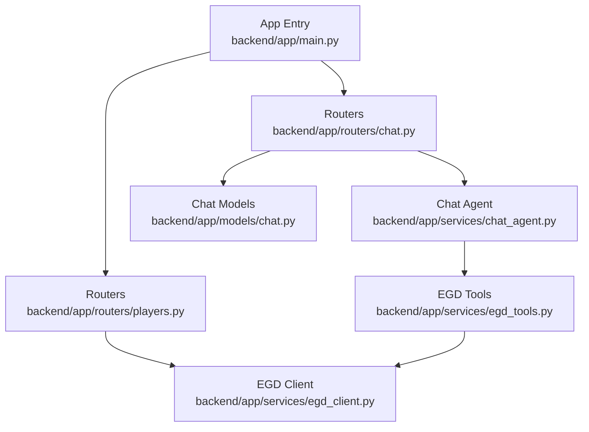
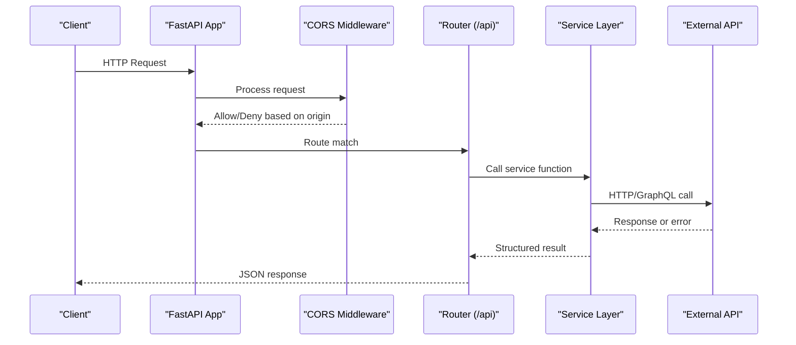
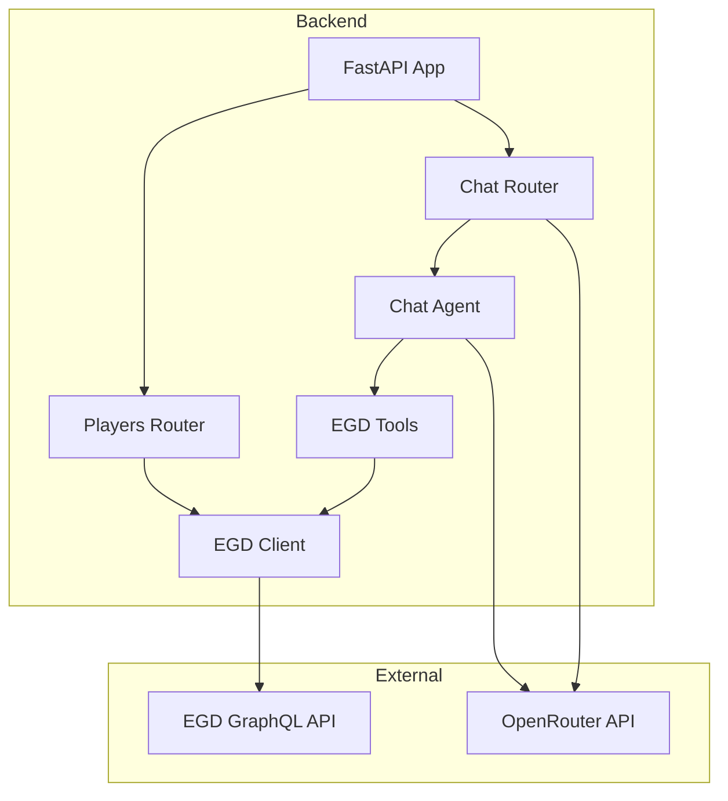

# FastAPI Application

<cite>
**Referenced Files in This Document**
- [main.py](file://backend/app/main.py)
- [requirements.txt](file://backend/requirements.txt)
- [players.py](file://backend/app/routers/players.py)
- [chat.py](file://backend/app/routers/chat.py)
- [chat_agent.py](file://backend/app/services/chat_agent.py)
- [egd_client.py](file://backend/app/services/egd_client.py)
- [egd_tools.py](file://backend/app/services/egd_tools.py)
- [chat.py](file://backend/app/models/chat.py)
- [Makefile](file://Makefile)
</cite>

## Table of Contents
1. [Introduction](#introduction)
2. [Project Structure](#project-structure)
3. [Core Components](#core-components)
4. [Architecture Overview](#architecture-overview)
5. [Detailed Component Analysis](#detailed-component-analysis)
6. [Dependency Analysis](#dependency-analysis)
7. [Performance Considerations](#performance-considerations)
8. [Troubleshooting Guide](#troubleshooting-guide)
9. [Conclusion](#conclusion)

## Introduction
This document explains the FastAPI application initialization and configuration for the GoNow backend. It covers app setup, middleware (CORS), environment variable loading via dotenv, router mounting, health check endpoints, application lifecycle, startup procedures, configuration options, error handling strategies, logging setup, and performance tuning parameters. The goal is to provide a clear understanding of how the server boots, what it configures at startup, and how requests flow through routers and services.

## Project Structure
The backend is organized by feature with a small number of core modules:
- Application entrypoint and global configuration
- Routers for HTTP endpoints
- Services for external integrations and business logic
- Pydantic models for request/response validation
- Requirements and development scripts

**Diagram sources**
- [main.py:14-31](file://backend/app/main.py#L14-L31)
- [players.py:1-10](file://backend/app/routers/players.py#L1-L10)
- [chat.py:1-10](file://backend/app/routers/chat.py#L1-L10)
- [chat_agent.py:1-15](file://backend/app/services/chat_agent.py#L1-L15)
- [egd_client.py:1-20](file://backend/app/services/egd_client.py#L1-L20)
- [egd_tools.py:1-10](file://backend/app/services/egd_tools.py#L1-L10)
- [chat.py:1-21](file://backend/app/models/chat.py#L1-L21)

**Section sources**
- [main.py:1-42](file://backend/app/main.py#L1-L42)
- [requirements.txt:1-6](file://backend/requirements.txt#L1-L6)

## Core Components
- Application instance and metadata: title, description, version
- Middleware: CORS configured for local frontend origins
- Environment variables: loaded from a .env file located relative to the backend directory
- Routers: mounted under /api prefix for players and chat features
- Health and root endpoints: simple status checks and API info

Key behaviors:
- CORS allows credentials and all methods/headers for specified origins
- Router mounting registers routes for player search/details/games/tournaments and AI chat
- Root and health endpoints return lightweight JSON responses

**Section sources**
- [main.py:14-42](file://backend/app/main.py#L14-L42)
- [players.py:1-107](file://backend/app/routers/players.py#L1-L107)
- [chat.py:1-95](file://backend/app/routers/chat.py#L1-L95)

## Architecture Overview
At startup, the application loads environment variables, creates the FastAPI instance, adds CORS middleware, mounts routers, and exposes root and health endpoints. Requests are handled by route handlers that call service clients to interact with external APIs (EGD GraphQL and OpenRouter).

**Diagram sources**
- [main.py:20-31](file://backend/app/main.py#L20-L31)
- [players.py:8-40](file://backend/app/routers/players.py#L8-L40)
- [chat.py:9-24](file://backend/app/routers/chat.py#L9-L24)
- [chat_agent.py:30-154](file://backend/app/services/chat_agent.py#L30-L154)
- [egd_client.py:21-42](file://backend/app/services/egd_client.py#L21-L42)

## Detailed Component Analysis

### Application Initialization and Configuration
- Loads environment variables from a .env file located at the repository’s backend directory
- Creates the FastAPI app with descriptive metadata
- Adds CORS middleware allowing specific frontend origins, credentials, and all methods/headers
- Mounts routers for players and chat under /api
- Exposes root and health endpoints

Configuration highlights:
- CORS origins include common local dev ports
- Credentials enabled for cross-origin cookies/auth headers
- All methods and headers allowed for simplicity in development

Startup procedure:
- Python imports main module
- dotenv loads .env into os.environ
- FastAPI app object created
- Middleware registered
- Routers included
- Endpoints registered

Environment variables used across the app:
- OPENROUTER_API_KEY: required for AI chat functionality
- CHAT_MODEL: model selection for agentic chat loop
- CHAT_MAX_ITERATIONS: maximum iterations for tool-calling loops
- EGD_API_TOKEN: authentication token for European Go Database GraphQL API

**Section sources**
- [main.py:8-31](file://backend/app/main.py#L8-L31)
- [main.py:34-42](file://backend/app/main.py#L34-L42)
- [chat_agent.py:9-11](file://backend/app/services/chat_agent.py#L9-L11)
- [chat_agent.py:42-48](file://backend/app/services/chat_agent.py#L42-L48)
- [chat.py:50-55](file://backend/app/routers/chat.py#L50-L55)
- [egd_client.py:12-17](file://backend/app/services/egd_client.py#L12-L17)

### Middleware Configuration (CORS)
- Uses CORSMiddleware with allow_origins set to local development servers
- Allows credentials to support authenticated cross-origin requests
- Allows all methods and headers to simplify development workflows

Operational notes:
- In production, restrict allow_origins to known domains
- Consider tightening allow_methods and allow_headers if needed

**Section sources**
- [main.py:20-27](file://backend/app/main.py#L20-L27)

### Environment Variable Loading with dotenv
- Loads .env from the backend directory using Path resolution relative to the main module
- Variables become available via os.environ throughout the application

Common variables:
- OPENROUTER_API_KEY: enables AI chat features
- CHAT_MODEL: selects LLM model for agentic chat
- CHAT_MAX_ITERATIONS: controls max tool-calling iterations
- EGD_API_TOKEN: authenticates against EGD GraphQL API

**Section sources**
- [main.py:8-10](file://backend/app/main.py#L8-L10)
- [chat_agent.py:9-11](file://backend/app/services/chat_agent.py#L9-L11)
- [chat.py:50-55](file://backend/app/routers/chat.py#L50-L55)
- [egd_client.py:12-17](file://backend/app/services/egd_client.py#L12-L17)

### Router Mounting and Endpoints
- Players router provides:
  - GET /api/search: search players by name or PIN
  - GET /api/player/{pin}: get player details with rating history
  - GET /api/player/{pin}/games: paginate game history
  - GET /api/player/{pin}/tournaments: list tournaments
- Chat router provides:
  - POST /api/chat: send message to AI assistant (supports optional context and conversation history)

Routing behavior:
- Both routers use prefix "/api" and tags for grouping
- Handlers validate inputs and raise HTTP exceptions on errors

**Section sources**
- [players.py:5-107](file://backend/app/routers/players.py#L5-L107)
- [chat.py:6-24](file://backend/app/routers/chat.py#L6-L24)

### Health Check Endpoints
- Root endpoint returns API status and docs link
- Health endpoint returns a simple status object

Use cases:
- Load balancer probes
- Kubernetes liveness/readiness checks

**Section sources**
- [main.py:34-42](file://backend/app/main.py#L34-L42)

### Application Lifecycle and Startup Procedures
Current implementation:
- No explicit lifespan events or startup hooks are defined
- Startup tasks occur during import time (dotenv load, app creation, middleware registration, router inclusion)

Implications:
- Long-running initialization should be moved to lifespan events for cleaner separation
- Resource initialization can be deferred until first request if desired

Recommendation:
- Use FastAPI lifespan to initialize resources and perform graceful shutdown

[No sources needed since this section provides general guidance]

### Error Handling Strategies
- Routers wrap calls in try/except blocks and raise HTTPException with appropriate status codes
- Service layer raises ValueError for GraphQL errors and handles HTTP errors from external clients
- Tool execution returns structured success/error dictionaries for safe consumption by the agent loop

Patterns:
- Consistent 500 responses for unexpected exceptions
- 404 for not found scenarios
- Validation errors are handled by FastAPI automatically

**Section sources**
- [players.py:39-80](file://backend/app/routers/players.py#L39-L80)
- [chat.py:23-24](file://backend/app/routers/chat.py#L23-L24)
- [chat.py:93-94](file://backend/app/routers/chat.py#L93-L94)
- [egd_client.py:37-42](file://backend/app/services/egd_client.py#L37-L42)
- [egd_tools.py:207-212](file://backend/app/services/egd_tools.py#L207-L212)

### Logging Setup
Current implementation:
- No explicit logging configuration is present in the codebase

Recommendations:
- Configure structured logging (e.g., JSON logs) for production
- Add request ID correlation and log levels per environment
- Log key metrics such as latency and error rates

[No sources needed since this section provides general guidance]

### Performance Tuning Parameters
Observed parameters:
- EGD client cache TTL: 300 seconds for GraphQL query results
- HTTP timeouts:
  - EGD client: 30 seconds
  - Chat agent: 60 seconds
  - Simple chat proxy: 30 seconds
- Pagination limits:
  - Player games limit capped at 200
- Agentic chat loop:
  - MAX_ITERATIONS configurable via environment variable

Optimization opportunities:
- Centralize timeout configuration and expose via environment variables
- Implement rate limiting and circuit breakers for external API calls
- Add response caching at the router level for frequently accessed data
- Tune cache TTL based on data freshness requirements

**Section sources**
- [egd_client.py:18-19](file://backend/app/services/egd_client.py#L18-L19)
- [egd_client.py:33-35](file://backend/app/services/egd_client.py#L33-L35)
- [chat_agent.py:67-81](file://backend/app/services/chat_agent.py#L67-L81)
- [chat.py:75-87](file://backend/app/routers/chat.py#L75-L87)
- [players.py:86-88](file://backend/app/routers/players.py#L86-L88)
- [chat_agent.py:11](file://backend/app/services/chat_agent.py#L11)

## Dependency Analysis
High-level dependencies:
- FastAPI and Uvicorn for ASGI server and routing
- httpx for async HTTP requests
- python-dotenv for environment loading
- Pydantic for data validation

Runtime dependencies:
- External APIs:
  - European Go Database GraphQL API
  - OpenRouter chat completions API

**Diagram sources**
- [main.py:14-31](file://backend/app/main.py#L14-L31)
- [players.py:1-10](file://backend/app/routers/players.py#L1-L10)
- [chat.py:1-10](file://backend/app/routers/chat.py#L1-L10)
- [chat_agent.py:1-15](file://backend/app/services/chat_agent.py#L1-L15)
- [egd_client.py:1-20](file://backend/app/services/egd_client.py#L1-L20)
- [egd_tools.py:1-10](file://backend/app/services/egd_tools.py#L1-L10)

**Section sources**
- [requirements.txt:1-6](file://backend/requirements.txt#L1-L6)

## Performance Considerations
- Cache strategy:
  - EGD client uses an in-memory dict cache with TTL; consider Redis for distributed deployments
- Timeouts:
  - Ensure timeouts align with SLAs and retry policies
- Pagination:
  - Enforce upper bounds on page sizes to prevent large payloads
- Concurrency:
  - Leverage async I/O for external calls; avoid blocking operations
- Observability:
  - Add metrics collection and structured logging for latency and error tracking

[No sources needed since this section provides general guidance]

## Troubleshooting Guide
Common issues and resolutions:
- Missing environment variables:
  - Ensure OPENROUTER_API_KEY and EGD_API_TOKEN are set in .env
  - Verify .env path resolution points to the correct backend directory
- CORS failures:
  - Confirm frontend origin matches allow_origins settings
  - Enable credentials only when necessary
- External API errors:
  - Inspect HTTP status codes and error messages from EGD and OpenRouter
  - Validate tokens and network connectivity
- Rate limits and timeouts:
  - Adjust timeouts and implement retries/backoff where appropriate
- Health checks:
  - Use /health to verify service availability

**Section sources**
- [main.py:8-10](file://backend/app/main.py#L8-L10)
- [main.py:20-27](file://backend/app/main.py#L20-L27)
- [chat.py:50-55](file://backend/app/routers/chat.py#L50-L55)
- [egd_client.py:37-42](file://backend/app/services/egd_client.py#L37-L42)
- [main.py:34-42](file://backend/app/main.py#L34-L42)

## Conclusion
The GoNow FastAPI backend initializes cleanly with minimal configuration, providing CORS support, environment-driven settings, and modular routers for players and chat. While functional for development, production readiness would benefit from explicit lifespan management, robust logging, centralized configuration, and enhanced observability. The existing error handling patterns and performance parameters offer a solid foundation for further optimization.